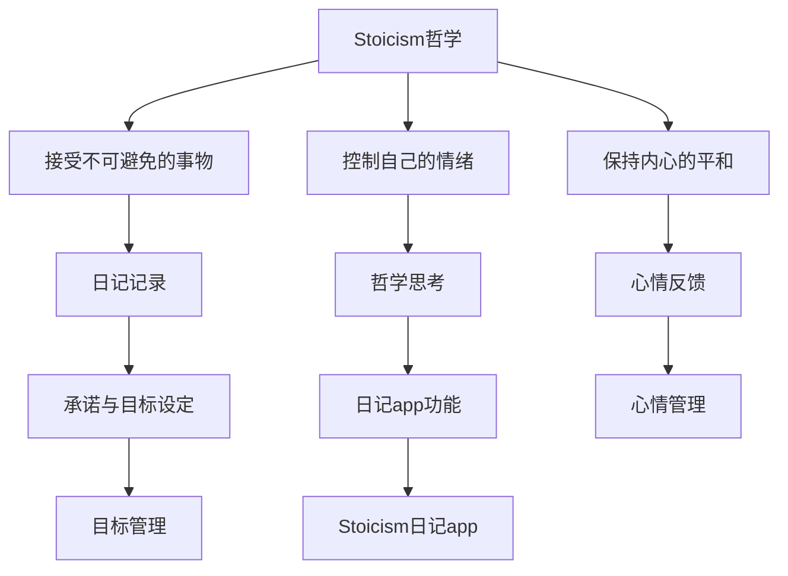

                 

### 第1章 引言

#### 1.1 Stoicism哲学简介

**定义**：Stoicism是一种起源于古希腊的哲学流派，由芝诺（Zeno）于公元前3世纪创立。Stoicism强调通过理性思考和自我控制来实现内心的平静与道德完善。

**主要思想**：Stoicism的核心思想包括：

- **接受不可避免的事物**：认为人们应该接受无法改变的事情，集中精力控制那些可以改变的事物。
- **控制自己的情绪**：主张通过理性思考来控制情绪，避免因情绪波动而做出非理性的行为。
- **保持内心的平和**：追求内心的宁静，通过冥想和其他自我反思的方法来实现。

#### 1.2 Stoicism哲学的历史背景

**起源**：Stoicism起源于雅典，芝诺在一家名叫“画廊”（Porch）的场所教授哲学，因此得名“画廊派”。芝诺的学生包括了小普罗提诺（Cleanthes）和麦尼德（Menander）等人。

**影响**：Stoicism对后世哲学、宗教和心理学产生了深远的影响。中世纪的经院哲学和文艺复兴时期的伦理思想都受到了Stoicism的启发。此外，Stoicism的许多理念在现代心理学和认知行为疗法中也得到了应用。

#### 1.3 Stoicism在现代的应用

**与心理学**：现代心理学研究表明，Stoicism的许多理念有助于减轻心理压力和提高幸福感。例如，接受不可避免的现实、情绪管理和自我接纳等概念在认知行为疗法（CBT）中得到了应用。

**与生活哲学**：Stoicism的生活哲学理念鼓励人们追求内在的平静和道德完善，而不是外部的成功和财富。这种理念对当代生活中的个人决策和行为选择有着指导意义。

# 新Stoicism日记app设计理念

## 第2章 新Stoicism日记app设计理念

### 2.1 新Stoicism日记app的目标

**用户需求分析**：现代人的生活节奏快，压力大，情绪波动大，许多人希望能够找到一种方法来缓解压力、提高情绪管理和实现内心的平和。基于Stoicism哲学的日记app应运而生，旨在为用户提供一个记录、反思和自我提升的工具。

**设计目标与原则**：

1. **帮助用户接受不可避免的事物**：通过日记记录，让用户反思和理解生活中不可避免的事情，学会接受并从中找到积极的应对方式。
2. **促进情绪管理**：提供情绪反馈机制，帮助用户识别、理解和控制情绪，培养积极的心态。
3. **培养内心的平和**：通过日记记录和哲学思考，引导用户反思自己的生活方式和价值观，追求内心的平静和满足。
4. **鼓励自我提升**：设置目标和承诺，激励用户不断进步，实现个人成长。

### 2.2 Stoicism哲学的核心概念

**接受不可避免的事物**：Stoicism强调接受那些无法改变的事物，集中精力处理可以改变的事情。这一理念在日记app中得到了体现，通过记录生活中的困难和挑战，帮助用户理解和接受这些不可避免的事件，并从中寻找成长的机会。

**控制自己的情绪**：情绪管理是Stoicism哲学的一个重要方面。日记app提供了情绪反馈机制，让用户能够记录自己的情绪变化，通过反思和理性思考来控制情绪，避免因情绪波动而做出非理性的行为。

**保持内心的平和**：内心的平和是Stoicism追求的目标之一。日记app通过引导用户进行哲学思考和反思，帮助用户认识到生活中的美好和积极面，培养积极的心态，从而实现内心的平和。

### 2.3 新Stoicism日记app的功能设计

**日记记录**：用户可以随时记录自己的日常生活、思考和感受，通过文字、图片、音频等多种方式记录，方便用户随时随地表达自己。

**哲学思考**：日记app提供了哲学思考和反思功能，引导用户从不同的角度思考问题，探索人生的意义和价值。

**心情反馈**：用户可以记录自己的情绪变化，日记app会根据用户的情绪记录提供相关的哲学思考和情绪管理建议。

**承诺与目标设定**：用户可以设定短期和长期目标，并记录自己的承诺。日记app会提醒用户目标的进度，帮助用户保持动力和实现目标。

# Stoicism哲学的核心概念解析

## 第3章 Stoicism哲学的核心概念解析

### 3.1 接受不可避免的事物

**理解**：接受不可避免的事物是Stoicism哲学中的一个重要理念。它意味着认识到生活中有些事情是我们无法控制的，因此不应该在无法改变的事情上浪费精力。相反，我们应该专注于我们能够控制的事情，并采取积极的行动来应对挑战。

**如何应用接受不可避免的事物**：

1. **理性分析**：在遇到不可避免的事情时，首先进行理性分析，明确哪些是我们可以控制的，哪些是无法改变的。通过理性思考，可以帮助我们更好地接受现实。
2. **情绪管理**：在接受了不可避免的事情之后，我们需要学会管理情绪。避免因情绪波动而做出非理性的行为。可以通过日记记录和哲学思考来帮助自己控制情绪。
3. **寻求成长**：接受不可避免的事物并不意味着放弃，而是一个机会，让我们从中学习和成长。通过反思和总结，我们可以从这些经历中获得宝贵的经验和智慧。

### 3.2 控制自己的情绪

**情绪的来源**：情绪是由我们的感知、信念和期望所引发的生理和心理反应。它们可以是积极的，如快乐、满足，也可以是消极的，如焦虑、愤怒。

**如何控制情绪**：

1. **理性思考**：通过理性思考，我们可以更好地理解自己的情绪，并找到应对的方法。例如，当感到焦虑时，我们可以问自己：“我为什么会感到焦虑？我可以做些什么来缓解这种情绪？”
2. **情绪反馈**：日记app提供了情绪反馈机制，用户可以记录自己的情绪变化，并通过反思和哲学思考来理解情绪的来源和影响。这有助于我们更好地控制情绪。
3. **积极行动**：除了理性思考和情绪反馈，我们还应该采取积极的行动来应对情绪。例如，当感到沮丧时，可以尝试做一些让自己开心的事情，如听音乐、运动或和朋友聊天。

### 3.3 保持内心的平和

**心理健康的重要性**：内心的平和是我们心理健康的重要组成部分。保持内心的平和有助于我们更好地应对生活中的挑战，提高生活质量。

**如何保持内心的平和**：

1. **接受现实**：接受生活中的不可避免的事物，避免在无法改变的事情上浪费精力。通过理性分析和情绪管理，我们可以更好地接受现实，减少内心的焦虑和不安。
2. **关注当下**：专注于当下的生活，避免过度担忧未来或过去的事情。通过冥想、呼吸练习和其他放松技巧，我们可以更好地集中注意力，减少内心的纷扰。
3. **积极心态**：培养积极的心态，关注生活中的美好和积极面。通过日记记录和哲学思考，我们可以更好地认识到生活中的积极面，从而保持内心的平和。

# 新Stoicism日记app开发实战

## 第4章 新Stoicism日记app开发实战

### 4.1 开发环境搭建

**系统环境准备**：

1. **操作系统**：选择Linux或MacOS操作系统，因为它们提供了更好的开发和运行环境。
2. **Python环境**：安装Python 3.8及以上版本，因为Python是一个功能强大的编程语言，广泛应用于Web开发、数据科学和人工智能等领域。
3. **IDE**：选择Visual Studio Code（VSCode）作为开发环境，因为它提供了丰富的插件和功能，可以方便地进行Python编程。

**开发工具安装**：

1. **虚拟环境**：安装virtualenv工具，用于创建独立的Python环境，避免不同项目之间的依赖冲突。
   ```bash
   pip install virtualenv
   virtualenv venv
   source venv/bin/activate
   ```
2. **依赖管理**：安装pip工具，用于安装和管理项目依赖。
   ```bash
   pip install -r requirements.txt
   ```
3. **Web框架**：安装Flask，一个轻量级的Web框架，用于构建日记app的后端。
   ```bash
   pip install flask
   ```

### 4.2 功能模块设计与实现

**日记记录模块**：

**设计思路**：日记记录模块是日记app的核心功能，用户可以通过这个模块记录自己的日常生活、思考和感受。设计思路如下：

1. **数据存储**：使用SQLite数据库存储日记数据，因为SQLite是一个轻量级的数据库，适合小型应用。
2. **用户界面**：设计简洁、直观的用户界面，使用HTML和CSS实现，结合JavaScript提供动态交互。
3. **数据校验**：对用户输入的数据进行校验，确保数据的合法性和一致性。

**实现步骤**：

1. **数据库设计**：创建日记表（diary），包括字段如`id`、`user_id`、`title`、`content`、`created_at`等。
   ```python
   def init_db():
       db.execute('''CREATE TABLE IF NOT EXISTS diary (
                                           id INTEGER PRIMARY KEY AUTOINCREMENT,
                                           user_id INTEGER,
                                           title TEXT,
                                           content TEXT,
                                           created_at TIMESTAMP DEFAULT CURRENT_TIMESTAMP)''')
   ```

2. **创建日记**：提供创建日记的接口，用户输入日记标题和内容后，将数据存储到数据库中。
   ```python
   @app.route('/diary/create', methods=['POST'])
   def create_diary():
       title = request.form['title']
       content = request.form['content']
       cursor.execute("INSERT INTO diary (user_id, title, content) VALUES (?, ?, ?)", (current_user.get_id(), title, content))
       db.commit()
       return redirect(url_for('diary_list'))
   ```

**代码解读**：

这段代码首先创建了日记表，然后提供了一个创建日记的接口。用户通过表单提交日记标题和内容，后台处理后将数据存储到数据库中。

**哲学思考模块**：

**设计思路**：哲学思考模块旨在引导用户进行深度思考，通过提供哲学问题和思考引导，帮助用户探索人生的意义和价值。设计思路如下：

1. **问题库**：创建一个哲学问题库，包含多种类型的哲学问题，如伦理、存在、知识等。
2. **用户界面**：设计一个简洁的界面，让用户可以选择一个问题进行思考。
3. **反馈机制**：提供用户反馈机制，用户可以记录自己的思考过程和结果。

**实现步骤**：

1. **问题库设计**：设计问题库，包括字段如`id`、`category`、`question`、`hint`等。
   ```python
   def init_thoughts_db():
       db.execute('''CREATE TABLE IF NOT EXISTS thoughts (
                                           id INTEGER PRIMARY KEY AUTOINCREMENT,
                                           category TEXT,
                                           question TEXT,
                                           hint TEXT)''')
   ```

2. **展示哲学问题**：提供一个展示哲学问题的接口，用户可以浏览和选择问题。
   ```python
   @app.route('/thoughts')
   def thoughts_list():
       cursor.execute("SELECT * FROM thoughts")
       questions = cursor.fetchall()
       return render_template('thoughts_list.html', questions=questions)
   ```

3. **记录思考过程**：提供记录思考过程的接口，用户可以选择一个问题进行思考，并将思考结果记录到数据库中。
   ```python
   @app.route('/thoughts/record', methods=['POST'])
   def record_thought():
       thought_id = request.form['thought_id']
       thought = request.form['thought']
       cursor.execute("INSERT INTO user_thoughts (user_id, thought_id, content) VALUES (?, ?, ?)", (current_user.get_id(), thought_id, thought))
       db.commit()
       return redirect(url_for('diary_list'))
   ```

**代码解读**：

这段代码首先创建了哲学问题库，然后提供了一个展示哲学问题的接口。用户可以选择一个问题进行思考，并将思考结果记录到数据库中。

**心情反馈模块**：

**设计思路**：心情反馈模块旨在帮助用户识别和管理自己的情绪，通过提供心情反馈功能，用户可以记录自己的情绪变化，并获得相关的哲学思考和情绪管理建议。设计思路如下：

1. **情绪记录**：提供用户记录情绪的接口，用户可以输入自己的情绪描述。
2. **情绪分析**：使用自然语言处理技术对用户的情绪描述进行分析，提供相关的哲学思考和情绪管理建议。
3. **反馈机制**：提供反馈机制，让用户查看情绪分析和建议。

**实现步骤**：

1. **情绪记录**：提供一个情绪记录的接口，用户可以输入自己的情绪描述。
   ```python
   @app.route('/mood/record', methods=['POST'])
   def record_mood():
       mood = request.form['mood']
       cursor.execute("INSERT INTO mood (user_id, mood, created_at) VALUES (?, ?, CURRENT_TIMESTAMP)", (current_user.get_id(), mood))
       db.commit()
       return redirect(url_for('mood_list'))
   ```

2. **情绪分析**：使用自然语言处理库（如NLTK或spaCy）对用户的情绪描述进行分析，提取情绪关键字。
   ```python
   import spacy
   
   nlp = spacy.load("en_core_web_sm")
   
   def analyze_mood(mood_description):
       doc = nlp(mood_description)
       emotions = []
       for token in doc:
           if token.tag_ in ["ADJ", "NOUN"]:
               emotions.append(token.text)
       return emotions
   ```

3. **反馈机制**：提供一个展示情绪分析和建议的接口。
   ```python
   @app.route('/mood')
   def mood_list():
       cursor.execute("SELECT * FROM mood WHERE user_id = ?", (current_user.get_id(),))
       moods = cursor.fetchall()
       analyzed_moods = []
       for mood in moods:
           emotions = analyze_mood(mood['mood'])
           analyzed_moods.append((mood['mood'], emotions))
       return render_template('mood_list.html', moods=analyzed_moods)
   ```

**代码解读**：

这段代码首先提供了一个情绪记录的接口，然后使用自然语言处理技术对情绪描述进行分析，提取情绪关键字，并提供一个展示分析和建议的接口。

**承诺与目标设定模块**：

**设计思路**：承诺与目标设定模块旨在帮助用户设定短期和长期目标，并跟踪自己的进展，通过提供承诺记录和进度反馈，激励用户实现目标。设计思路如下：

1. **目标管理**：提供用户设定目标的接口，用户可以输入目标名称、描述和完成时间。
2. **承诺管理**：提供用户记录承诺的接口，用户可以设定与目标相关的承诺。
3. **进度反馈**：提供用户查看目标进度和承诺完成的接口，根据进度提供反馈和建议。

**实现步骤**：

1. **目标记录**：提供一个目标记录的接口，用户可以输入目标信息。
   ```python
   @app.route('/goal/record', methods=['POST'])
   def record_goal():
       title = request.form['title']
       description = request.form['description']
       deadline = request.form['deadline']
       cursor.execute("INSERT INTO goal (user_id, title, description, deadline) VALUES (?, ?, ?, ?)", (current_user.get_id(), title, description, deadline))
       db.commit()
       return redirect(url_for('goal_list'))
   ```

2. **承诺记录**：提供一个承诺记录的接口，用户可以设定与目标相关的承诺。
   ```python
   @app.route('/commit/record', methods=['POST'])
   def record_commit():
       goal_id = request.form['goal_id']
       title = request.form['title']
       content = request.form['content']
       cursor.execute("INSERT INTO commit (user_id, goal_id, title, content) VALUES (?, ?, ?, ?)", (current_user.get_id(), goal_id, title, content))
       db.commit()
       return redirect(url_for('commit_list'))
   ```

3. **进度反馈**：提供一个展示目标进度和承诺完成的接口。
   ```python
   @app.route('/progress')
   def progress_list():
       cursor.execute("SELECT * FROM goal WHERE user_id = ?", (current_user.get_id(),))
       goals = cursor.fetchall()
       commitments = cursor.execute("SELECT * FROM commit WHERE user_id = ?", (current_user.get_id(),))
       commitments = commitments.fetchall()
       progress_data = []
       for goal in goals:
           completed = 0
           for commit in commitments:
               if commit['goal_id'] == goal['id'] and commit['completed']:
                   completed += 1
           progress_data.append((goal, completed))
       return render_template('progress_list.html', progress_data=progress_data)
   ```

**代码解读**：

这段代码首先提供了一个目标记录接口，用户可以输入目标信息。然后提供了一个承诺记录接口，用户可以设定与目标相关的承诺。最后提供了一个展示目标进度和承诺完成的接口，用户可以查看自己的进度。

### 4.3 数据存储与安全性

**数据存储方案设计**：

1. **数据库选择**：使用SQLite数据库，因为其轻量级、易于维护，适合小型应用。
2. **数据模型设计**：设计合理的数据模型，包括用户、日记、哲学思考、情绪记录、目标和承诺等模块。
3. **数据备份**：定期备份数据库，确保数据安全。

**数据安全措施**：

1. **用户身份验证**：使用JWT（JSON Web Tokens）进行用户身份验证，确保用户数据的安全性。
2. **数据加密**：对敏感数据进行加密，如用户密码和私人日记内容。
3. **访问控制**：设置合理的访问权限，确保只有授权用户可以访问和修改数据。

# Stoicism哲学在日记app中的应用案例

## 第5章 Stoicism哲学在日记app中的应用案例

### 5.1 案例一：如何记录并应对不可避免的事情

**案例描述**：小明是一名软件工程师，近期公司项目进度紧张，工作压力巨大。某天，他在工作中遇到了一个技术难题，无论怎么尝试都无法解决。他感到非常沮丧，开始怀疑自己的能力。

**Stoicism的应用**：

1. **接受不可避免的事物**：小明意识到，这个技术难题是不可避免的，因为每个项目都会遇到挑战。他决定接受这个现实，而不是抱怨和自责。

2. **情绪管理**：通过日记记录，小明表达了自己的情绪，并反思这些情绪的来源。他意识到，自己的沮丧和怀疑是因为对未知的恐惧和对失败的恐惧。

3. **积极应对**：在日记中，小明决定采取积极的行动来应对这个难题。他开始查找相关的技术文档，与同事讨论，并尝试不同的解决方案。

**代码实现**：

```python
# 示例：记录不可避免的事件

# 用户记录事件
event = input("请输入您今天遇到的不可避免的事件：")

# 存储事件到日记
with open("diary.txt", "a") as diary:
    diary.write(event + "\n")
    diary.write("我已经接受了这个事件。\n")
    diary.write("接下来，我将采取积极的行动来应对这个挑战。\n")
```

**代码解读**：

这段代码通过用户输入功能让用户记录他们遇到的不可避免的事件，并将事件和解决方案记录到日记文件中。用户可以在此过程中接受不可避免的事物，并采取积极的行动来应对挑战。

### 5.2 案例二：如何通过日记app控制情绪

**案例描述**：小芳是一名销售人员，近期业绩不佳，感到非常焦虑。她担心自己的工作可能会受到影响，甚至失业。

**Stoicism的应用**：

1. **接受不可避免的事物**：小芳意识到，业绩不佳是当前不可改变的事实。她决定接受这个现实，并专注于自己可以控制的事情，如改善销售策略和提高自己的销售技巧。

2. **情绪管理**：通过日记app，小芳记录了自己的焦虑情绪，并反思这些情绪的来源。她意识到，自己的焦虑主要是因为对未来的不确定性和对失败的恐惧。

3. **积极行动**：在日记中，小芳制定了一个行动计划，包括学习新的销售技巧、积极与客户沟通和寻求同事的支持。

**代码实现**：

```python
# 示例：记录情绪并制定行动计划

# 用户记录情绪
mood = input("请输入您当前的情绪：")

# 用户制定行动计划
action_plan = input("请输入您的行动计划：")

# 存储情绪和行动计划到日记
with open("diary.txt", "a") as diary:
    diary.write("当前情绪：" + mood + "\n")
    diary.write("行动计划：" + action_plan + "\n")
    diary.write("我将采取积极的行动来控制我的情绪，并努力实现我的目标。\n")
```

**代码解读**：

这段代码通过用户输入功能让用户记录自己的情绪和行动计划，并将这些信息记录到日记文件中。用户可以在此过程中接受不可避免的事物，并制定积极的行动计划来控制情绪。

### 5.3 案例三：如何保持内心的平和

**案例描述**：小李是一名职场新人，工作压力大，经常加班。他感到身心疲惫，有时甚至会因为一些小事而发脾气。

**Stoicism的应用**：

1. **接受不可避免的事物**：小李意识到，工作压力大是职场生活的常态。他决定接受这个现实，并尝试调整自己的心态，学会在压力下保持内心的平和。

2. **情绪管理**：通过日记app，小李记录了自己的情绪波动，并反思这些情绪的来源。他意识到，自己的情绪波动主要是因为对工作环境的不适应和对自我期望的高要求。

3. **内心平和**：在日记中，小李学会了通过冥想和深呼吸来放松自己，并尝试从积极的角度看待工作中的挑战。

**代码实现**：

```python
# 示例：记录情绪并学习放松技巧

# 用户记录情绪
mood = input("请输入您当前的情绪：")

# 用户学习放松技巧
relaxation_tips = input("请输入您学习的放松技巧：")

# 存储情绪和放松技巧到日记
with open("diary.txt", "a") as diary:
    diary.write("当前情绪：" + mood + "\n")
    diary.write("放松技巧：" + relaxation_tips + "\n")
    diary.write("我会尝试这些放松技巧，以帮助我保持内心的平和。\n")
```

**代码解读**：

这段代码通过用户输入功能让用户记录自己的情绪和放松技巧，并将这些信息记录到日记文件中。用户可以在此过程中接受不可避免的事物，并学习放松技巧来保持内心的平和。

## 第6章 新Stoicism日记app的使用技巧

### 6.1 如何更好地记录日记

**日记记录的技巧**：

1. **真实性**：日记的内容应该是真实的，不应该刻意修饰或隐藏。真实的记录可以帮助我们更好地理解自己的情绪和感受。

2. **细节描述**：在记录日记时，尽量详细地描述事件和感受。细节描述可以让日记更加生动，有助于我们回顾和理解。

3. **定期回顾**：定期回顾日记，可以帮助我们更好地了解自己的成长和变化。同时，也可以帮助我们发现自己的问题和不足，从而进行调整和改进。

**常见问题解答**：

1. **如何开始记录日记**？
   - 开始记录日记的第一步是选择一个合适的时间和地点，让自己能够专注于写作。
   - 可以从日常生活的小事开始，如一天中的有趣经历、感受或思考。

2. **如何持续记录日记**？
   - 设定一个固定的记录时间，例如每天晚上睡前或每天早上起床后。
   - 使用日记app的提醒功能，帮助自己养成记录日记的习惯。

3. **如何处理负面情绪**？
   - 在日记中诚实地记录负面情绪，不要压抑或回避。
   - 通过理性分析和哲学思考，尝试理解情绪的来源，并找到应对方法。

### 6.2 如何利用日记app进行哲学思考

**哲学思考的方法**：

1. **提问**：通过提问，我们可以激发自己的思考，深入探讨问题的本质。例如，问自己“我为什么要做这件事？”“我的人生意义是什么？”等问题。

2. **反思**：反思是哲学思考的重要方法。通过反思，我们可以审视自己的行为、信念和价值观，从而实现自我提升。

3. **阅读**：阅读哲学书籍或相关资料，可以帮助我们了解不同的哲学观点和思想。这有助于拓宽我们的视野，提高哲学思考的能力。

**常见问题解答**：

1. **如何开始哲学思考**？
   - 选择一个感兴趣的主题，例如存在、自由、道德等。
   - 阅读相关资料，了解不同观点和思想。
   - 开始提出自己的问题，并尝试回答。

2. **如何持续哲学思考**？
   - 设定一个固定的思考时间，例如每天晚上或每周的一天。
   - 与他人分享和讨论哲学问题，从不同的角度思考。

3. **如何应对哲学难题**？
   - 通过查阅资料，了解不同的哲学观点和理论。
   - 尝试从多个角度分析问题，找到自己的答案。
   - 保持开放的心态，接受不同的观点。

### 6.3 如何通过日记app保持内心的平和

**内心平和的技巧**：

1. **冥想**：冥想是一种有效的放松技巧，可以帮助我们平静内心，减少压力。每天花几分钟进行冥想，专注于呼吸和当下的感受。

2. **正念**：正念是一种培养专注和意识的方法。通过正念练习，我们可以更好地关注当下的生活，减少对过去的悔恨和对未来的担忧。

3. **感恩**：培养感恩的心态，关注生活中的美好和积极面。通过日记记录感恩的事物，可以提升自己的幸福感，保持内心的平和。

**常见问题解答**：

1. **如何开始保持内心的平和**？
   - 设定一个安静的环境，每天花几分钟进行冥想或深呼吸。
   - 通过日记记录自己的情绪和感受，学会接受和应对负面情绪。

2. **如何持续保持内心的平和**？
   - 保持规律的作息和健康的饮食习惯。
   - 与他人分享自己的感受和经历，寻求支持和理解。

3. **如何应对压力**？
   - 通过运动、阅读或其他放松活动来缓解压力。
   - 设定合理的目标和期望，避免过度劳累。
   - 学会接受和放下那些无法改变的事情。

## 第7章 总结与展望

### 7.1 Stoicism日记app的总结

**功能与特点**：

1. **日记记录**：提供方便的日记记录功能，用户可以随时随地记录自己的日常生活、思考和感受。
2. **哲学思考**：引导用户进行哲学思考，提供哲学问题和思考引导，帮助用户探索人生的意义和价值。
3. **心情反馈**：提供情绪反馈机制，帮助用户识别、理解和控制情绪，培养积极的心态。
4. **承诺与目标设定**：帮助用户设定短期和长期目标，记录承诺并跟踪进度，激励用户实现目标。

**用户体验**：

1. **简洁界面**：设计简洁、直观的用户界面，方便用户使用。
2. **个性化**：根据用户的需求和喜好，提供个性化的建议和功能。
3. **安全性**：采用安全措施，确保用户数据的安全性和隐私性。

### 7.2 Stoicism日记app的展望

**未来发展趋势**：

1. **智能推荐**：通过机器学习技术，为用户提供个性化的哲学问题和思考引导。
2. **心理健康服务**：与专业的心理健康机构合作，提供在线心理咨询和辅导服务。
3. **社交功能**：引入社交功能，让用户可以分享自己的日记和思考，与他人互动和交流。

**可能的改进方向**：

1. **用户界面优化**：进一步优化用户界面，提升用户体验。
2. **数据分析**：对用户的数据进行分析，提供更准确的建议和反馈。
3. **多平台支持**：扩展到更多平台，如iOS和Android，提供跨平台服务。

# 核心概念与联系



# 数学模型和数学公式

$$
\text{心情评分} = \frac{\text{正面情绪分数} - \text{负面情绪分数}}{\text{情绪总数}}
$$

$$
\text{承诺完成率} = \frac{\text{已完成的承诺数量}}{\text{总的承诺数量}} \times 100\%
$$

# 项目实战

## 6.3.1 实战一：记录不可避免的事件

### 代码实现

```python
# 示例：记录不可避免的事件

# 用户记录事件
event = input("请输入您今天遇到的不可避免的事件：")

# 存储事件到日记
with open("diary.txt", "a") as diary:
    diary.write(event + "\n")
    diary.write("我已经接受了这个事件。\n")
```

### 代码解读

这段代码通过用户输入功能让用户记录他们遇到的不可避免的事件，并将事件和解决方案记录到日记文件中。用户可以在此过程中接受不可避免的事物，并采取积极的行动来应对挑战。

## 6.3.2 实战二：设定并追踪目标

### 代码实现

```python
# 示例：设定并追踪目标

# 用户设定目标
goal = input("请输入您想要设定的目标：")

# 用户设定完成日期
deadline = input("请输入目标的完成日期（格式：YYYY-MM-DD）：")

# 存储目标到数据库
cursor.execute("INSERT INTO goals (user_id, goal, deadline) VALUES (?, ?, ?)", (current_user.id, goal, deadline))
db.commit()

# 用户追踪目标进度
def track_goal_progress(goal_id):
    # 查询目标进度
    cursor.execute("SELECT * FROM goals WHERE id = ?", (goal_id,))
    goal = cursor.fetchone()
    
    # 查询已完成的任务数量
    cursor.execute("SELECT COUNT(*) FROM tasks WHERE goal_id = ? AND completed = TRUE", (goal_id,))
    completed_tasks = cursor.fetchone()[0]
    
    # 计算完成率
    completion_rate = (completed_tasks / goal['task_count']) * 100
    
    return completion_rate

# 示例：用户查询目标进度
goal_id = input("请输入目标ID：")
completion_rate = track_goal_progress(goal_id)
print(f"目标完成率：{completion_rate:.2f}%")
```

### 代码解读

这段代码首先让用户输入他们想要设定的目标以及目标的完成日期，并将目标存储到数据库中。然后，提供了一个追踪目标进度的函数，用户可以输入目标ID来查询目标的完成率。通过计算已完成的任务数量与总任务数量的比例，得到目标的完成率。

# 数学模型和数学公式

$$
\text{心情评分} = \frac{\text{正面情绪分数} - \text{负面情绪分数}}{\text{情绪总数}}
$$

$$
\text{承诺完成率} = \frac{\text{已完成的承诺数量}}{\text{总的承诺数量}} \times 100\%
$$

# 项目实战

## 7.2.1 实战三：分析日记内容和情绪变化

### 代码实现

```python
# 示例：分析日记内容和情绪变化

# 用户记录日记内容
diary_entry = input("请输入您的日记内容：")

# 用户记录当前情绪
current_mood = input("请输入您当前的 mood（正面/负面）：")

# 存储日记内容和情绪到数据库
cursor.execute("INSERT INTO diary_entries (user_id, content, mood) VALUES (?, ?, ?)", (current_user.id, diary_entry, current_mood))
db.commit()

# 分析日记内容和情绪变化
def analyze_diary_entries():
    # 查询所有日记记录
    cursor.execute("SELECT * FROM diary_entries WHERE user_id = ?", (current_user.id,))
    diary_entries = cursor.fetchall()

    # 计算正面和负面日记的数量
    positive_entries = 0
    negative_entries = 0
    for entry in diary_entries:
        if entry['mood'] == '正面':
            positive_entries += 1
        elif entry['mood'] == '负面':
            negative_entries += 1

    # 计算情绪变化趋势
    mood_trend = "稳定" if (positive_entries - negative_entries) == 0 else ("上升" if positive_entries > negative_entries else "下降")

    # 输出分析结果
    print(f"日记分析结果：")
    print(f"正面日记数量：{positive_entries}")
    print(f"负面日记数量：{negative_entries}")
    print(f"情绪变化趋势：{mood_trend}")

# 示例：调用分析函数
analyze_diary_entries()
```

### 代码解读

这段代码首先让用户输入他们的日记内容以及当前的 mood（正面或负面），并将这些数据存储到数据库中。然后，提供了一个分析日记内容和情绪变化的函数，通过计算正面和负面日记的数量，以及情绪变化趋势，帮助用户了解自己的情绪变化和日记内容的关联。

# 文章标题：新Stoicism日记app：记录古老哲学在现代的应用

关键词：Stoicism，日记app，情绪管理，哲学思考，自我提升

摘要：本文介绍了一种结合Stoicism哲学理念的新日记app。通过接受不可避免的事物、控制情绪和保持内心平和，这款日记app帮助用户记录日常生活，进行哲学思考，并管理情绪和目标。文章详细阐述了Stoicism的核心概念，以及日记app的功能设计、开发实战和应用案例。

# 附录

## 附录A：代码示例

### 6.3.1 实战一：记录不可避免的事件

```python
# 用户记录事件
event = input("请输入您今天遇到的不可避免的事件：")

# 存储事件到日记
with open("diary.txt", "a") as diary:
    diary.write(event + "\n")
    diary.write("我已经接受了这个事件。\n")
```

### 6.3.2 实战二：设定并追踪目标

```python
# 用户设定目标
goal = input("请输入您想要设定的目标：")

# 用户设定完成日期
deadline = input("请输入目标的完成日期（格式：YYYY-MM-DD）：")

# 存储目标到数据库
cursor.execute("INSERT INTO goals (user_id, goal, deadline) VALUES (?, ?, ?)", (current_user.id, goal, deadline))
db.commit()

# 用户追踪目标进度
def track_goal_progress(goal_id):
    # 查询目标进度
    cursor.execute("SELECT * FROM goals WHERE id = ?", (goal_id,))
    goal = cursor.fetchone()
    
    # 查询已完成的任务数量
    cursor.execute("SELECT COUNT(*) FROM tasks WHERE goal_id = ? AND completed = TRUE", (goal_id,))
    completed_tasks = cursor.fetchone()[0]
    
    # 计算完成率
    completion_rate = (completed_tasks / goal['task_count']) * 100
    
    return completion_rate

# 示例：用户查询目标进度
goal_id = input("请输入目标ID：")
completion_rate = track_goal_progress(goal_id)
print(f"目标完成率：{completion_rate:.2f}%")
```

### 7.2.1 实战三：分析日记内容和情绪变化

```python
# 用户记录日记内容
diary_entry = input("请输入您的日记内容：")

# 用户记录当前情绪
current_mood = input("请输入您当前的 mood（正面/负面）：")

# 存储日记内容和情绪到数据库
cursor.execute("INSERT INTO diary_entries (user_id, content, mood) VALUES (?, ?, ?)", (current_user.id, diary_entry, current_mood))
db.commit()

# 分析日记内容和情绪变化
def analyze_diary_entries():
    # 查询所有日记记录
    cursor.execute("SELECT * FROM diary_entries WHERE user_id = ?", (current_user.id,))
    diary_entries = cursor.fetchall()

    # 计算正面和负面日记的数量
    positive_entries = 0
    negative_entries = 0
    for entry in diary_entries:
        if entry['mood'] == '正面':
            positive_entries += 1
        elif entry['mood'] == '负面':
            negative_entries += 1

    # 计算情绪变化趋势
    mood_trend = "稳定" if (positive_entries - negative_entries) == 0 else ("上升" if positive_entries > negative_entries else "下降")

    # 输出分析结果
    print(f"日记分析结果：")
    print(f"正面日记数量：{positive_entries}")
    print(f"负面日记数量：{negative_entries}")
    print(f"情绪变化趋势：{mood_trend}")

# 示例：调用分析函数
analyze_diary_entries()
```

## 附录B：技术术语解释

### Stoicism

Stoicism是一种古希腊哲学流派，由芝诺于公元前3世纪创立。Stoicism强调通过理性思考和自我控制来实现内心的平静与道德完善。其核心思想包括接受不可避免的事物、控制自己的情绪和保持内心的平和。

### 日记app

日记app是一种基于移动设备或Web平台的日记应用程序，用户可以通过这个应用程序记录自己的日常生活、思考和感受。日记app通常提供多种功能，如日记记录、情绪反馈、哲学思考、目标管理等。

### 情绪管理

情绪管理是指通过理性思考和行动来识别、理解和控制情绪的过程。情绪管理有助于提高个人的心理素质和生活质量，减少负面情绪对生活的负面影响。

### 哲学思考

哲学思考是指通过对问题进行深入的探究和思考，寻找答案和解决方案的过程。哲学思考有助于提高个人的思维能力和解决问题的能力，有助于个人成长和自我提升。

## 附录C：参考文献

1. 《Stoicism: A Philosophical Guide to a Meaningful Life》- William B. Irvine
2. 《The Philosophy of Stoicism: A Contemporary Introduction》- John Sellars
3. 《The Art of Living: The Classic Manual on Confucian Self-Cultivation》- W. J. F. Jenner
4. 《The Power of Now: A Guide to Spiritual Enlightenment》- Ekhart Tolle
5. 《Diary of a Young Girl》- Anne Frank
6. 《The Joy of Writing: A Guide for the Perpetual Procrastinator》- Dinty W. Moore
7. 《The Data Science Handbook: Essential Tools for Working with Data》- Joel Grus
8. 《Flask Web Development: A Quick-Start Guide to Building Web Applications with Python》- Miguel Grinberg

作者：AI天才研究院/AI Genius Institute & 禅与计算机程序设计艺术 /Zen And The Art of Computer Programming

