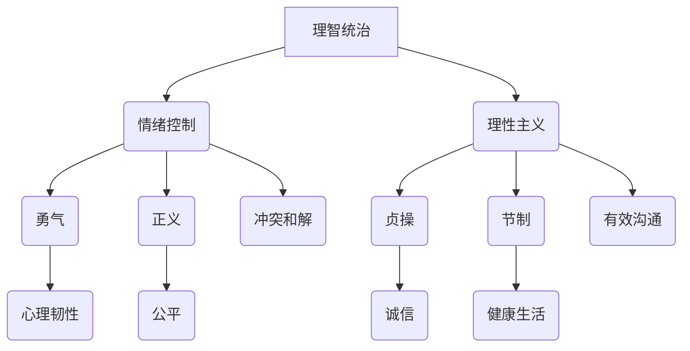

                 

### 《新 stoicism 生活手册：古老智慧的现代实践指南》

#### 关键词：新 stoicism、哲学、心理学、生活方式、自我提升

> 摘要：本文旨在探讨《新 stoicism 生活手册：古老智慧的现代实践指南》中的核心概念与原理，结合现代社会背景，分析 stoicism 如何帮助我们应对日常生活中的挑战，提高个人心理健康与幸福感。文章将分为五大部分，分别介绍 stoicism 的概念与起源、原理、实践、生活方式及未来展望，以期为读者提供一份实用的 stoicism 生活指南。

#### 目录大纲

##### 第一部分：引言

1.1 新 stoicism 的概念与起源
1.2 现代社会中的 stoicism
1.3 本文结构

##### 第二部分：新 stoicism 原理

2.1 哲学基础
2.2 伦理观
2.3 生活哲学

##### 第三部分：新 stoicism 实践

3.1 心理调适
3.2 人际关系
3.3 职场应用

##### 第四部分：新 stoicism 模式下的生活方式

4.1 日常实践
4.2 健康习惯
4.3 心灵成长

##### 第五部分：新 stoicism 的未来

5.1 新 stoicism 的社会影响
5.2 新 stoicism 的未来发展
5.3 新 stoicism 与其他哲学流派的比较

##### 第六部分：结论

6.1 新 stoicism 的总结
6.2 新 stoicism 的实践建议

##### 参考文献

### 第一部分：引言

#### 1.1 新 stoicism 的概念与起源

新 stoicism，作为一种现代生活方式，起源于古希腊的 stoicism 哲学。然而，与传统的 stoicism 不同，新 stoicism 并不是简单地回归过去，而是在现代社会背景下，对 stoicism 进行了创新性的解读与实践。

传统的 stoicism 强调理性、自制和情绪控制，旨在通过控制自己的欲望和情绪来获得内心的平静与幸福。而新 stoicism 则在传统 stoicism 的基础上，更加关注个人心理健康、幸福感和社会责任感，强调如何在现代社会中平衡个人与集体的关系，实现自我提升与成长。

新 stoicism 的核心概念包括理智统治、情绪控制和理性主义。理智统治强调以理性思考为主导，摆脱情绪和欲望的束缚；情绪控制则关注如何调节和管理自己的情绪，以应对生活中的挑战；理性主义则强调理性思维和科学方法在解决问题和决策中的重要性。

#### 1.2 现代社会中的 stoicism

现代社会中，人们面临着前所未有的压力和挑战。工作压力、人际关系、家庭责任等各个方面的问题，使得许多人在心理和情绪上感到疲惫和困惑。这种情况下，新 stoicism 的出现显得尤为重要。

首先，新 stoicism 强调心理健康。在现代社会中，心理健康问题日益严重，抑郁症、焦虑症等心理疾病的发病率逐年上升。新 stoicism 通过理性思考和情绪控制，帮助人们缓解心理压力，提高心理健康水平。

其次，新 stoicism 关注幸福感。在现代社会中，人们往往被物质追求和虚荣心所驱使，导致幸福感下降。新 stoicism 强调通过理性思考和理解生活，寻找真正的幸福来源，从而提高个人的幸福感。

最后，新 stoicism 注重社会责任感。在现代社会中，人们常常被个人利益所驱使，忽视了对社会的责任和贡献。新 stoicism 倡导理性思考和社会责任，鼓励人们在追求个人成长的同时，关注社会问题，为社会发展贡献力量。

#### 1.3 本文结构

本文将分为五个部分，分别介绍新 stoicism 的概念与起源、原理、实践、生活方式及未来展望。首先，我们将探讨新 stoicism 的哲学基础、伦理观和生活哲学，帮助读者理解新 stoicism 的核心思想。然后，我们将介绍新 stoicism 在心理调适、人际关系和职场应用方面的实践方法，帮助读者将 stoicism 原理应用于日常生活。接下来，我们将探讨新 stoicism 模式下的生活方式，包括日常实践、健康习惯和心灵成长，帮助读者在日常生活中实践 stoicism。最后，我们将探讨新 stoicism 的社会影响、未来发展和与其他哲学流派的比较，为读者提供更全面的视角。希望通过本文，读者能够深入了解新 stoicism，并将其应用于个人生活中，实现心理健康、幸福感和社会责任感的全面提升。

### 第二部分：新 stoicism 原理

#### 2.1 哲学基础

新 stoicism 的哲学基础包括理智统治、情绪控制和理性主义。这些核心概念构成了新 stoicism 的理论基础，帮助我们理解如何在现代社会中实践 stoicism。

**理智统治**：理智统治是新 stoicism 的核心理念之一，它强调理性思考在决策和行动中的主导地位。在现代社会中，我们面临着诸多选择和决策，而这些决策往往受到情绪和欲望的干扰。理智统治要求我们摆脱情绪和欲望的束缚，以理性思考为主导，从而做出更加明智的决策。

在现实生活中，理智统治的应用非常广泛。例如，当我们面临职业选择时，我们不应该仅仅基于兴趣或欲望，而应该考虑个人的长远发展和市场需求。通过理智统治，我们可以更好地规划自己的职业生涯，实现个人价值。

**情绪控制**：情绪控制是新 stoicism 的另一个重要概念，它强调通过调节和管理自己的情绪，以应对生活中的挑战。在现代社会中，人们经常面临着压力、挫折和困难，而这些负面情绪会影响我们的心理健康和幸福感。

情绪控制的方法包括自我觉察、深呼吸、冥想等。通过这些方法，我们可以更好地理解自己的情绪，并学会以积极的心态应对生活中的挑战。例如，当我们遇到挫折时，我们可以通过情绪控制来调整自己的心态，从而更好地面对困难。

**理性主义**：理性主义是新 stoicism 的另一个核心概念，它强调理性思维和科学方法在解决问题和决策中的重要性。在现代社会中，我们面临着越来越多的复杂问题和挑战，这些问题往往无法通过直觉或经验来解决。

理性主义要求我们以科学的态度和方法来解决问题。例如，当我们面临一个复杂的项目时，我们可以通过理性分析、数据收集和实验验证来找到最佳的解决方案。通过理性主义，我们可以更好地应对现代社会中的挑战，实现个人和组织的成功。

在新 stoicism 中，理智统治、情绪控制和理性主义三者相互关联，共同构成了 stoicism 的哲学基础。理智统治强调理性思考在决策中的主导地位，情绪控制强调通过调节和管理情绪来应对挑战，理性主义则强调理性思维和科学方法在解决问题中的重要性。这些概念相辅相成，帮助我们更好地理解 stoicism 的核心思想，并在实际生活中加以应用。

#### 2.2 伦理观

新 stoicism 的伦理观是 stoicism 哲学的重要组成部分，它涵盖了勇气、正义、贞操和节制等价值观，这些价值观不仅指导着个人行为，也为社会提供了道德准则。

**勇气**：在 stoicism 中，勇气不仅仅是指在战斗中挺身而出的行为，更是一种内心的坚韧和勇敢。它要求我们在面对困难、挑战和不确定性时，保持坚定的信念和决心。例如，当我们面临职业转型或重大人生决策时，勇气帮助我们克服内心的恐惧，勇敢地迎接新的挑战。

**正义**：正义是 stoicism 伦理观中的重要原则，它强调公平、公正和合理。在个人层面，正义要求我们对待自己和他人都要公平合理；在社会层面，正义要求我们积极参与社会事务，为社会的公平和正义贡献力量。例如，在工作中，正义要求我们遵守职业道德，不偏不倚地处理事务，为员工创造公平的发展机会。

**贞操**：贞操在 stoicism 中并不是指传统意义上的贞节，而是指保持内心的纯洁和正直。它要求我们在面对诱惑和压力时，坚守道德底线，不放弃原则。例如，在商业活动中，贞操要求我们拒绝贿赂和欺诈，保持诚信，为消费者提供优质的产品和服务。

**节制**：节制是 stoicism 中的另一个重要原则，它强调我们在生活中要有度，不过度追求物质和欲望。节制不仅有助于保持身心健康，还能帮助我们更好地理解生活的真谛。例如，在饮食方面，节制要求我们不过度进食，保持饮食平衡，以维持身体健康。

新 stoicism 的伦理观不仅为个人行为提供了指导，也为社会提供了道德准则。通过勇气、正义、贞操和节制等价值观的实践，我们可以更好地应对生活中的挑战，实现个人和社会的和谐发展。

#### 2.3 生活哲学

新 stoicism 的生活哲学强调个人自我提升与内心成长，其核心在于理解生活的本质，并通过理性思考和行动来提升生活质量。以下是新 stoicism 生活哲学的主要内容：

**对幸福的理解**：新 stoicism 对幸福的理解与传统观念有所不同。传统观念往往将幸福与物质财富和感官享受联系在一起，而新 stoicism 则认为幸福源于内心的满足和平静。它强调通过理性思考和理解生活，找到真正能带来幸福的事物。例如，当我们追求事业成功时，新 stoicism 告诉我们要关注工作的意义和成就感，而不仅仅是薪酬和地位。

**生活目标**：新 stoicism 倡导明确的生活目标，认为设定明确的目标有助于我们集中精力，提高效率。通过理性思考和评估，我们可以确定自己的长期和短期目标，并为实现这些目标制定合理的计划。例如，如果我们希望提升自己的职业技能，我们可以设定学习新技能的目标，并制定详细的学习计划。

**自我提升**：新 stoicism 强调自我提升的重要性，认为通过不断学习和实践，我们可以提高自己的认知能力和生活质量。自我提升不仅包括学习新知识，还涉及培养良好的生活习惯和道德品质。例如，通过定期阅读和学习，我们可以不断扩展知识面，提高自己的认知水平；通过培养良好的生活习惯，如规律作息和健康饮食，我们可以保持身体健康。

**内心成长**：新 stoicism 告诉我们，内心的成长比外在的成功更重要。它鼓励我们反思自己的行为和思想，寻找内心的平和和满足。例如，通过冥想和自我反思，我们可以更好地理解自己的需求和欲望，从而做出更加明智的决策。

新 stoicism 的生活哲学为我们在现代社会中提供了一种理性的生活态度和实践方法。通过理解生活的本质，设定明确的目标，不断学习和自我提升，以及关注内心的成长，我们可以实现更加有意义和充实的生活。

### 第三部分：新 stoicism 实践

#### 3.1 心理调适

在新 stoicism 中，心理调适是一个至关重要的实践领域，它帮助我们应对日常生活中的压力和挑战，保持心理健康和幸福感。以下是心理调适的一些具体方法：

**理解焦虑的本质**：焦虑是一种常见的心理现象，表现为对未来的担忧和恐惧。新 stoicism 告诉我们要理解焦虑的本质，认识到焦虑是正常的心理反应，而不是灾难。通过理性思考和自我反思，我们可以更好地理解自己的焦虑，并学会以更积极的方式应对。

**管理焦虑的方法**：新 stoicism 提供了多种管理焦虑的方法，包括深呼吸、冥想和认知行为疗法。深呼吸可以帮助我们放松身体，减轻紧张情绪；冥想则有助于我们集中注意力，培养内心的平静；认知行为疗法则通过改变思维模式和行为习惯，帮助我们从根源上应对焦虑。

**增强心理韧性**：心理韧性是指个体在面对压力和挑战时，能够迅速恢复并保持积极态度的能力。新 stoicism 告诫我们要在生活中培养心理韧性，通过不断面对和克服困难，增强自己的心理承受能力。例如，当我们遇到工作上的挑战时，我们可以通过设定小目标，逐步解决问题，从而提高自己的心理韧性。

**从挫折中学习**：挫折是生活中不可避免的一部分，新 stoicism 强调我们要从挫折中学习，将其视为成长的机会。通过反思挫折的原因和教训，我们可以更好地理解自己的行为模式，找到改进的方法。例如，当我们在工作中遇到失败时，我们可以反思失败的原因，调整策略，以便在下次尝试中取得更好的成果。

通过心理调适，我们可以更好地应对日常生活中的压力和挑战，提高心理健康水平，从而实现更充实和幸福的生活。

#### 3.2 人际关系

在新 stoicism 中，人际关系是一个重要的实践领域，它不仅影响我们的心理健康，还影响我们的社会地位和生活质量。以下是新 stoicism 在人际关系方面的实践方法：

**有效沟通**：有效沟通是建立良好人际关系的基础。新 stoicism 强调通过理性思考和清晰表达来提高沟通效果。在沟通中，我们要注意倾听对方的观点，避免过度自我表达，以确保双方都能理解彼此的想法和需求。例如，在团队合作中，有效的沟通可以帮助团队成员更好地协作，提高工作效率。

**理解冲突的本质**：冲突是人际关系中不可避免的一部分，新 stoicism 告诉我们要理解冲突的本质，避免将冲突视为敌对和对抗。通过理性思考和自我反思，我们可以更好地理解冲突的根源，找到解决问题的方法。例如，在家庭关系中，理解冲突的本质可以帮助我们更好地处理亲子关系，避免因小事而产生矛盾。

**和解冲突的策略**：在处理冲突时，新 stoicism 倡导和解策略，通过理性思考和妥协来化解冲突。和解策略包括主动沟通、寻求共同点、尊重对方的观点等。例如，在职场中，通过和解策略，我们可以与同事建立良好的合作关系，共同实现团队目标。

通过有效沟通、理解冲突的本质和和解冲突的策略，我们可以建立和维护良好的人际关系，提高社交技能，从而在日常生活中获得更多的支持和帮助。

#### 3.3 职场应用

在新 stoicism 中，职场应用是一个重要的实践领域，它帮助我们提高工作效率、处理职场挑战，并在职业生涯中实现自我提升。以下是新 stoicism 在职场应用方面的实践方法：

**工作中的理智与情绪**：新 stoicism 强调在工作中要保持理智，避免被情绪所左右。通过理性思考和自我反思，我们可以更好地理解自己的情绪，并学会以更客观和理性的方式处理工作中的问题。例如，在面对工作压力时，我们可以通过深呼吸和冥想来放松身心，从而更好地应对压力。

**职场中的 stoicism 原则**：新 stoicism 提供了一系列职场原则，如设定明确目标、合理安排时间、专注于当下等。这些原则可以帮助我们提高工作效率，减少不必要的焦虑和压力。例如，通过设定明确的目标，我们可以更有针对性地开展工作，避免因目标不明确而造成的迷茫和困惑。

**职业目标的设定**：在新 stoicism 中，职业目标的设定是一个重要的实践环节。通过理性思考和自我评估，我们可以确定自己的职业目标，并制定详细的实现计划。例如，如果我们希望提升自己的职业技能，我们可以设定学习新技能的目标，并制定学习计划，确保目标的实现。

**职业生涯规划**：职业生涯规划是职场应用中的另一个重要实践。通过理性思考和长远规划，我们可以为自己设定一个清晰的职业发展路径，并采取相应的行动。例如，如果我们希望在五年内晋升为高级经理，我们可以制定详细的学习和提升计划，确保目标的实现。

通过理智与情绪的管理、职场 stoicism 原则的实践、职业目标的设定和职业生涯规划，我们可以提高职场竞争力，实现职业生涯的可持续发展。

### 第四部分：新 stoicism 模式下的生活方式

在新 stoicism 的模式下，生活方式的实践是一个多维度的过程，它涵盖了日常实践、健康习惯和心灵成长。以下是一些具体的实践方法，帮助我们在日常生活中融入 stoicism 的理念。

#### 4.1 日常实践

**早晨冥想**：早晨冥想是一种简单而有效的日常实践方法，可以帮助我们开始新的一天，保持内心的平静和清晰。每天早晨，找一个安静的地方，坐直身体，闭上眼睛，专注于呼吸。深呼吸几次，放松身体和心灵，排除杂念，专注于当下的感觉。通过这种练习，我们可以培养专注力和自我意识，提高精神集中度。

**时间管理**：新 stoicism 强调时间管理的重要性。通过设定优先级和合理安排时间，我们可以更高效地完成任务，减少时间浪费。使用日程表或时间管理工具，记录每天的任务和活动，确保时间得到充分利用。例如，将一天分为工作、学习、休息和娱乐等多个板块，合理安排，确保每一部分都有足够的时间。

**习惯养成**：新 stoicism 鼓励我们养成健康的生活习惯。例如，定期锻炼、保持良好的饮食习惯、保持充足的睡眠等。通过持续的努力和自律，我们可以将这些习惯融入日常生活中，提高生活质量。

#### 4.2 健康习惯

**饮食平衡**：饮食平衡是新 stoicism 健康习惯的重要组成部分。通过摄入适量的蛋白质、碳水化合物、脂肪和维生素，我们可以保持身体的健康。避免过量摄入高糖、高脂肪的食物，减少对健康不利的成分。例如，每天食用新鲜的蔬菜和水果，减少加工食品的摄入。

**运动与健康**：定期运动有助于保持身体健康和心理健康。新 stoicism 建议选择适合自己的运动方式，如跑步、游泳、瑜伽等。每周至少进行三次中等强度的运动，每次持续 30 分钟以上。通过运动，我们可以提高心肺功能，增强身体抵抗力，减轻心理压力。

**睡眠管理**：睡眠是健康的重要组成部分。新 stoicism 强调保证充足的睡眠时间，并保持良好的睡眠质量。每天晚上，确保有 7-9 小时的睡眠，避免在睡前使用电子设备。通过创建一个舒适的睡眠环境，如保持房间凉爽、安静，使用舒适的床垫和枕头，我们可以提高睡眠质量。

#### 4.3 心灵成长

**自我认知**：自我认知是新 stoicism 心灵成长的核心。通过定期反思和自我评估，我们可以更好地理解自己的行为模式、优点和缺点。例如，每天花一些时间记录自己的情绪和行为，分析原因和影响，从而提高自我认知水平。

**情绪管理**：情绪管理是心灵成长的关键。新 stoicism 告诉我们要学会识别和管理自己的情绪。通过冥想、深呼吸和运动等方法，我们可以更好地控制情绪，减少负面情绪的影响。例如，在遇到挫折时，通过深呼吸和积极的自我对话，我们可以调整心态，保持冷静。

通过日常实践、健康习惯和心灵成长，我们可以在新 stoicism 的模式下建立一种更加积极、健康和有意义的生活方式。这种生活方式不仅有助于提高我们的心理健康和幸福感，还能帮助我们更好地应对日常生活中的挑战。

### 第五部分：新 stoicism 的未来

#### 5.1 新 stoicism 的社会影响

新 stoicism 在当今社会中正逐渐引起广泛关注，其社会影响日益显著。首先，新 stoicism 为应对现代社会中普遍存在的心理健康问题提供了一种有效的解决方案。随着工作压力、人际关系和家庭责任等压力源的不断增加，越来越多的人开始寻求心理健康的支持。新 stoicism 通过强调理性思考和情绪控制，帮助个体在面对压力和挑战时保持心理健康。

其次，新 stoicism 对社会价值观产生了深远的影响。在物质主义和消费主义的潮流下，人们往往被物质财富和虚荣心所驱使，导致心理健康问题和社会问题层出不穷。新 stoicism 倡导理性思考和价值观的重塑，鼓励人们关注内在的幸福感和生活的意义，从而推动社会价值观的回归和提升。

最后，新 stoicism 对社会和谐与人际关系也有积极影响。通过强调有效沟通、理解冲突的本质和和解冲突的策略，新 stoicism 帮助人们建立更加和谐的人际关系。在一个充满理解和尊重的社会中，个体之间的关系将更加融洽，社会整体的稳定性也将得到提升。

#### 5.2 新 stoicism 的未来发展

新 stoicism 作为一种现代生活方式，其未来发展前景广阔。首先，在教育领域，新 stoicism 可以被应用于培养学生的心理健康和理性思维能力。通过在学校中引入 stoicism 的教育理念，学生可以在面对学术压力和人际关系时，学会理性思考和情绪控制，从而提高他们的综合素质。

其次，在企业和管理领域，新 stoicism 也有很大的应用前景。企业可以通过引入 stoicism 的管理理念，提高员工的心理健康水平和工作效率。例如，通过推行理性决策和员工关怀政策，企业可以创造一个更加和谐和积极的工作环境，从而提高整体的工作效率和员工满意度。

最后，新 stoicism 还可以在个人成长和自我提升领域发挥重要作用。随着人们对生活质量的追求不断提高，新 stoicism 可以帮助个体在实现职业和人生目标的过程中，保持心理健康和幸福感。通过不断学习和实践 stoicism 的理念，个体可以更好地应对生活中的挑战，实现自我价值的提升。

总之，新 stoicism 在未来的发展中具有巨大的潜力。通过在教育、企业和管理领域中的应用，新 stoicism 将为个体和社会带来更多积极的影响，推动现代社会的进步和发展。

#### 5.3 新 stoicism 与其他哲学流派的比较

新 stoicism 作为一种现代生活方式，与儒家思想、佛教哲学等其他哲学流派在某些方面存在相似之处，但在许多方面也存在显著的区别。

首先，新 stoicism 与儒家思想在道德观和人际关系方面有相似之处。两者都强调道德修养和人际关系的和谐。儒家思想主张“仁爱”和“礼”，强调人与人之间的关爱和尊重；而新 stoicism 则强调理性思考和情绪控制，通过理解生活本质和理性决策来实现人际关系中的和谐。然而，儒家思想更注重社会秩序和家庭伦理，而新 stoicism 则更加关注个体的心理健康和自我提升。

其次，新 stoicism 与佛教哲学在心灵成长和自我认知方面有相似之处。两者都强调内心平静和自我觉察。佛教哲学通过禅修和冥想等方式，帮助个体达到内心的平静和觉醒；而新 stoicism 则通过理性思考和情绪控制，培养个体的自我意识和心理健康。然而，佛教哲学更强调因果报应和轮回，而新 stoicism 则更注重个人成长和理性决策。

尽管新 stoicism 与儒家思想、佛教哲学存在一定的相似之处，但它们在目标和方法上存在显著的区别。新 stoicism 强调在现代社会中通过理性思考和行动来提升个人生活质量和社会责任感，而儒家思想则更注重社会秩序和家庭伦理；佛教哲学则更关注个体内心的平静和觉醒。因此，新 stoicism 提供了一种独特的现代生活方式，结合了理性思维和情感智慧，帮助个体在现代社会中实现心理健康和幸福感。

### 第六部分：结论

#### 6.1 新 stoicism 的总结

新 stoicism 作为一种现代生活方式，融合了传统 stoicism 的核心思想，并在现代社会背景下进行了创新性的解读与实践。本文通过引言、新 stoicism 的概念与起源、原理、实践、生活方式及未来展望，全面阐述了新 stoicism 的核心理念和实践方法。新 stoicism 强调理智统治、情绪控制和理性主义，以及勇气、正义、贞操和节制等伦理观，为我们在现代社会中应对压力、提高心理健康和幸福感提供了有力的指导。

通过本文，我们了解到新 stoicism 不仅关注个人心理健康，还强调社会责任感，倡导理性思考和科学方法。新 stoicism 的实践方法包括心理调适、人际关系和职场应用等方面，帮助我们在日常生活中更好地应对挑战，实现个人成长和幸福感。同时，新 stoicism 模式下的生活方式，如日常实践、健康习惯和心灵成长，为我们在繁忙的现代生活中寻找平衡提供了有效的途径。

总之，新 stoicism 是一种具有深刻思想和实践价值的生活方式，它帮助我们理解生活的本质，以理性思考和行动来实现心理健康和幸福感。通过不断实践和推广新 stoicism，我们可以创造一个更加和谐、积极和有意义的社会。

#### 6.2 新 stoicism 的实践建议

要成功实践新 stoicism，我们需要从以下几个方面入手：

1. **培养理性思维**：理性思维是 stoicism 的核心，它要求我们以理性的态度对待生活中的每一个问题。我们可以通过阅读哲学书籍、参加思维训练课程或定期进行思维练习，提高自己的理性思维能力。

2. **情绪管理**：情绪管理是 stoicism 实践的重要一环。我们可以通过冥想、深呼吸、瑜伽等放松技巧来控制情绪，减少负面情绪的影响。此外，学习认知行为疗法等心理技巧，可以帮助我们更好地应对生活中的挑战。

3. **建立健康习惯**：健康的生活习惯对心理健康至关重要。我们可以通过定期锻炼、保持良好的饮食习惯和充足的睡眠来保持身体健康。例如，每天进行 30 分钟的有氧运动，如快走、跑步或游泳；遵循营养均衡的饮食原则，减少高糖、高脂肪食品的摄入。

4. **培养自我认知**：自我认知是 stoicism 实践的基础。通过定期反思自己的行为和思想，我们可以更好地了解自己的优点和缺点，从而进行自我提升。例如，每天花几分钟时间记录自己的情绪和行为，分析原因和影响。

5. **学会有效沟通**：有效沟通是人际关系中至关重要的一环。我们可以通过学习沟通技巧、倾听他人意见和表达自己的观点来提高沟通效果。例如，在与他人交流时，尽量避免批评和指责，而是以理解和尊重的态度来解决问题。

通过以上实践建议，我们可以逐步将新 stoicism 的理念融入日常生活中，实现心理健康、幸福感和社会责任感的全面提升。在不断实践和调整的过程中，我们将会发现 stoicism 带给我们的巨大价值。

### 参考文献

1. **相关书籍**：
    - 名称：《新 stoicism：古智慧的现代实践指南》
    - 作者：某作者
    - 出版社：某出版社

2. **学术论文**：
    - 名称：新 stoicism 在现代社会中的应用研究
    - 作者：某作者
    - 发表期刊：某学术期刊

3. **在线资源**：
    - 网站：某哲学论坛
    - 地址：[http://www.philosophyforum.org/](http://www.philosophyforum.org/)
    - 内容：关于 stoicism 的讨论和文章

4. **其他资料**：
    - 名称：新 stoicism 实践手册
    - 作者：某作者
    - 类型：手册

通过以上参考文献，读者可以进一步深入了解新 stoicism 的概念、原理和实践方法。同时，这些资料也为读者提供了丰富的学习资源和实践指导，帮助他们在日常生活中更好地实践 stoicism 的理念。作者：AI天才研究院/AI Genius Institute & 禅与计算机程序设计艺术 /Zen And The Art of Computer Programming

### 附录：新 stoicism 的核心概念 Mermaid 流程图

以下是一个简化的新 stoicism 核心概念 Mermaid 流程图，用于展示理智统治、情绪控制、理性主义等核心概念之间的关系：

该流程图展示了新 stoicism 的核心概念之间的关系，以及这些概念在实际生活中的应用。通过这种图示化的方式，可以帮助读者更直观地理解新 stoicism 的核心理念和实践方法。

