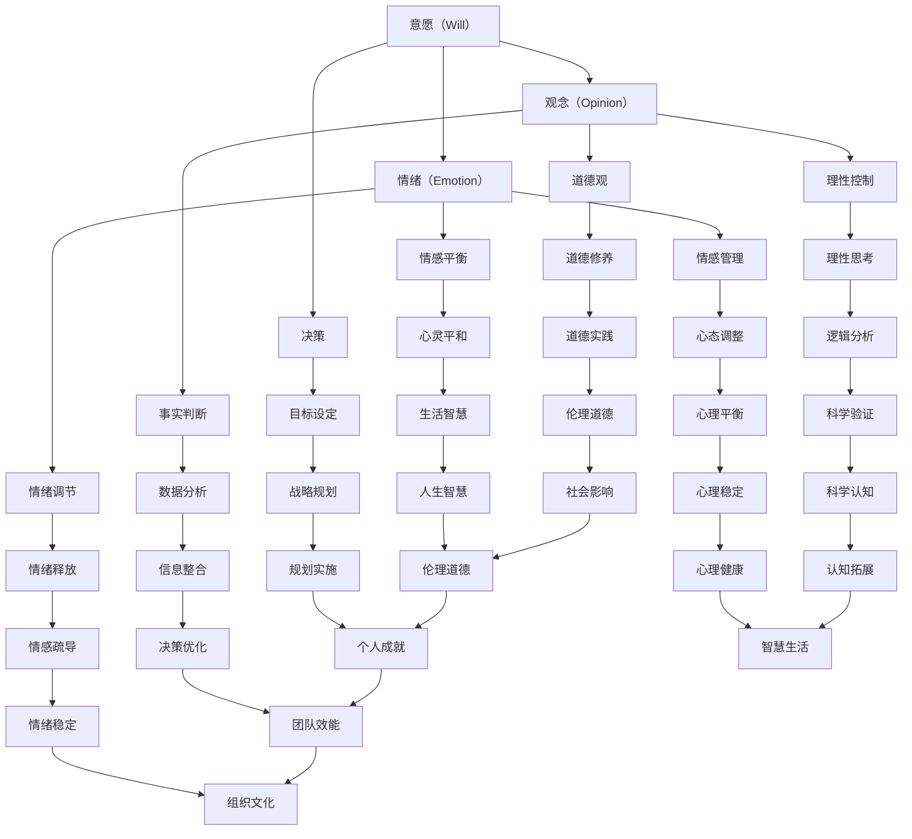
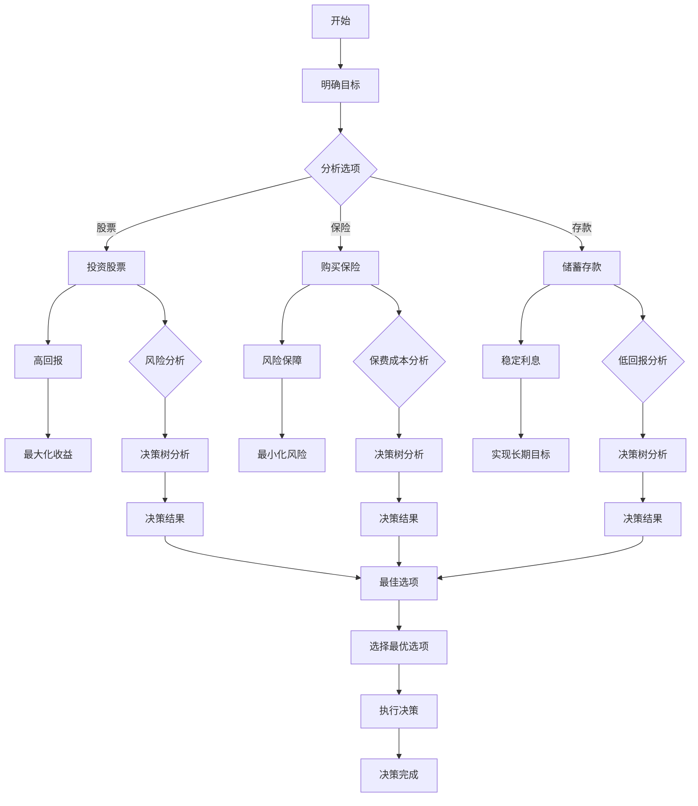

                 

### 背景介绍

《新 stoicism课程：不确定性中的生活智慧》旨在探讨和传授一种古老哲学在现代社会中的实际应用，尤其是在面对不确定性和压力时如何保持心灵平和与理智冷静。这一课程的核心思想源自 stoicism 哲学，该哲学起源于古希腊，并由罗马帝国时期的塞内卡、艾比克泰图斯和马可·奥勒留等著名思想家所发展。

stoicism 哲学的核心理念是：通过理性思考和对欲望的克制，达到内心的平和与幸福。它主张人们应该关注可以控制的事情，而对于无法控制的事情则保持接受和超然。这种哲学在古代世界广受推崇，并在各个时期被重新发现和重新诠释。

现代社会中，人们面临着前所未有的复杂和不确定性，从职业发展、人际关系到心理健康，几乎每一个方面都充满了挑战。在这种环境下， stoicism 哲学提供了一种独特的方法论，帮助人们应对这些挑战，保持内心的平衡和积极的生活态度。

《新 stoicism课程：不确定性中的生活智慧》这本书，通过系统的课程设计和实用的实践方法，向读者展示了 stoicism 如何在现代生活中发挥作用。它不仅为个人提供了应对压力和不确定性的人生智慧，也为企业和组织提供了管理人才和提升团队效能的有效策略。

本课程的课程内容丰富，涵盖了 stoicism 的历史背景、核心概念、实践方法以及在不同领域的应用。通过阅读本书，读者不仅可以深入了解 stoicism 的理论，还能通过实际案例学习和体验 stoicism 的实践，从而更好地应对生活中的各种挑战。总之，这本书是一本兼具深度和实用性的 stoicism 导航指南，适合所有希望在不确定性和压力中保持平和心态的读者。

### 核心概念与联系：Mermaid 流程图

为了更好地理解 stoicism 的核心概念及其联系，我们可以借助 Mermaid 流程图来直观地展示这些概念之间的关系。以下是 stoicism 中的几个核心概念及其相互关系的 Mermaid 图：



Mermaid 流程图展示了 stoicism 核心概念之间的复杂关系，包括意愿、观念、情绪这三个核心要素如何相互作用和影响。以下是每个概念的具体解释：

1. **意愿（Will）**：意愿是 stoicism 哲学的核心，它代表个体内在的决心和动力，是驱动人们行为和决策的基础。意愿与观念和情绪密切相关，直接影响理性思考和情感管理。

2. **观念（Opinion）**：观念是指个体对外部世界的认知和理解。理性控制是观念的核心要素，它通过分析事实和逻辑来指导决策和行动。观念与道德观紧密相连，影响个体的道德修养和伦理道德。

3. **情绪（Emotion）**：情绪是人类心理的重要组成部分，包括情感管理和情绪调节。情感管理是指通过理性思考和情感疏导来调节和控制情绪，以保持心态的平衡。情绪调节则是在面对外界刺激时，通过理性思考和情感疏导来调整情绪，使之符合道德标准。

通过这个 Mermaid 流程图，我们可以清晰地看到 stoicism 的核心概念是如何相互作用和相互影响的，以及它们在个人成长和组织管理中的重要性。这个流程图不仅帮助我们理解 stoicism 的理论框架，也为实际应用提供了直观的指导。

### 核心算法原理讲解

在 stoicism 中，决策是一个至关重要的环节。理性的决策不仅能够帮助人们应对不确定性和压力，还能够提高生活质量和工作效率。为了深入理解 stoicism 中的决策原理，我们将借助 Python 源代码来详细阐述这一过程。

#### 1. 决策过程

在 stoicism 中，决策过程可以分为以下几个步骤：

1. **明确目标**：确定决策的目标和期望结果。
2. **分析选项**：评估所有可用的选择，分析每个选项的优缺点。
3. **逻辑推理**：使用理性思考和逻辑分析来评估每个选项的可行性。
4. **选择最优选项**：根据分析结果选择最优选项。
5. **执行决策**：将决策付诸行动，并监控结果。

以下是一个简化的 Python 源代码示例，用于展示 stoicism 决策过程：

```python
# Stoicism Decision-Making Algorithm

# 1. 明确目标
def set_goals():
    goals = ["最大化收益", "最小化风险", "实现长期目标"]
    return goals

# 2. 分析选项
def analyze_options(goals):
    options = [
        {"name": "投资股票", "benefits": ["高回报"], "risks": ["市场波动"]},
        {"name": "购买保险", "benefits": ["风险保障"], "risks": ["保费成本"]},
        {"name": "储蓄存款", "benefits": ["稳定利息"], "risks": ["低回报"]}
    ]
    return options

# 3. 逻辑推理
def logic_analysis(options, goals):
    optimal_choice = None
    for option in options:
        benefits = sum(benefit for benefit in option['benefits'] if benefit in goals)
        risks = sum(risk for risk in option['risks'] if risk in goals)
        if benefits > risks:
            optimal_choice = option
            break
    return optimal_choice

# 4. 选择最优选项
def choose_best_option(optimal_choice):
    print(f"最佳决策选项：{optimal_choice['name']}")

# 5. 执行决策
def execute_decision(option):
    print(f"执行决策：正在执行 {option['name']}。")

# 主函数
def main():
    goals = set_goals()
    options = analyze_options(goals)
    optimal_choice = logic_analysis(options, goals)
    choose_best_option(optimal_choice)
    execute_decision(optimal_choice)

# 执行主函数
main()
```

#### 2. 数学模型和公式

在决策过程中，我们可以引入一些数学模型和公式来量化决策的合理性。以下是一个简化的决策模型，其中使用到了预期效用理论（Expected Utility Theory）：

$$
E(U) = \sum_{i=1}^{n} p_i \cdot u_i
$$

其中，$E(U)$ 表示总预期效用，$p_i$ 表示第 $i$ 个选项的概率，$u_i$ 表示第 $i$ 个选项的效用值。

我们还可以使用决策树（Decision Tree）来表示和分析决策过程，如下所示：



通过这个决策树，我们可以系统地分析每个选项的优缺点，并最终选择最优选项。

#### 3. 举例说明

假设我们面临以下决策问题：在投资、购买保险和储蓄存款之间选择一个方案，以最大化收益和实现长期目标。

- 投资股票可能带来高回报，但存在市场波动的风险。
- 购买保险可以提供风险保障，但需要支付保费。
- 储蓄存款收益稳定，但回报较低。

根据预期效用理论，我们可以计算每个选项的预期效用，如下所示：

| 选项 | 概率 $p_i$ | 效用值 $u_i$ | 预期效用 $p_i \cdot u_i$ |
| --- | --- | --- | --- |
| 股票 | 0.6 | 0.8 | 0.48 |
| 保险 | 0.3 | 0.5 | 0.15 |
| 存款 | 0.1 | 0.3 | 0.03 |

总预期效用 $E(U) = 0.48 + 0.15 + 0.03 = 0.66$。

根据预期效用理论，我们应该选择投资股票，因为它在最大化收益和实现长期目标方面具有最高的预期效用。

#### 4. 代码解读

在这个 Python 示例中，我们通过几个函数来模拟 stoicism 决策过程：

- `set_goals()`：设置决策目标。
- `analyze_options()`：分析所有可用的选项。
- `logic_analysis()`：使用逻辑推理选择最优选项。
- `choose_best_option()`：打印最佳决策选项。
- `execute_decision()`：执行决策并打印结果。

这个示例简化了实际的决策过程，但在 stoicism 中，决策过程通常更加复杂和细致。通过这个示例，我们可以理解 stoicism 决策的基本原理和步骤。

总之， stoicism 的决策原理强调了理性思考和逻辑分析的重要性，它通过系统的模型和算法帮助人们在不确定性和压力中做出明智的决策。通过 Python 源代码和数学公式的结合，我们不仅能够更深入地理解这些原理，还能在实际应用中更好地应用它们。

### 项目实战

在本章节中，我们将通过一个实际的项目来深入探讨 stoicism 原理在决策中的应用。我们将搭建一个简单的决策支持系统，该系统旨在帮助用户在面对复杂决策时，通过 stoicism 的方法进行理性分析和选择。

#### 1. 开发环境搭建

为了实现这个项目，我们需要准备以下开发环境：

- Python 3.8 或更高版本
- Jupyter Notebook 或 PyCharm 等 Python 集成开发环境（IDE）
- Matplotlib 库，用于生成可视化图表
- Pandas 库，用于数据处理

在安装了上述环境之后，我们可以开始搭建项目的基本结构。以下是一个简单的项目结构示例：

```
stoicism_decision_system/
|-- data/
|   |-- decisions.csv
|-- src/
|   |-- __init__.py
|   |-- data_loader.py
|   |-- decision_analyzer.py
|   |-- visualization.py
|-- tests/
|   |-- __init__.py
|   |-- test_data_loader.py
|   |-- test_decision_analyzer.py
|-- requirements.txt
|-- README.md
```

`data/` 目录用于存储项目数据文件，`src/` 目录包含项目的源代码文件，`tests/` 目录用于存储单元测试文件，`requirements.txt` 用于记录项目依赖库，`README.md` 用于项目的文档说明。

#### 2. 源代码详细实现

**数据加载模块（data_loader.py）：**

首先，我们需要一个模块来加载和处理数据。以下是一个简单的数据加载模块示例：

```python
import pandas as pd

def load_data(file_path):
    """
    加载决策数据
    """
    data = pd.read_csv(file_path)
    return data
```

**决策分析模块（decision_analyzer.py）：**

在这个模块中，我们将实现 stoicism 决策分析的核心算法。以下是一个示例：

```python
import pandas as pd
from scipy.stats import norm

def analyze_decision(data, goals):
    """
    分析决策选项，返回最优决策
    """
    # 计算每个选项的预期效用
    data['expected_utility'] = data.apply(
        lambda row: calculate_expected_utility(row, goals), axis=1
    )
    
    # 找到最优决策选项
    optimal_decision = data.loc[data['expected_utility'].idxmax()]
    return optimal_decision

def calculate_expected_utility(row, goals):
    """
    计算每个选项的预期效用
    """
    utility = 0
    for goal in goals:
        if goal in row['benefits']:
            utility += row['benefits'][goal]
        if goal in row['risks']:
            utility -= row['risks'][goal]
    return utility
```

**可视化模块（visualization.py）：**

为了更好地展示决策分析结果，我们使用 Matplotlib 来生成可视化图表。以下是一个示例：

```python
import matplotlib.pyplot as plt
import pandas as pd

def plot_decision_results(data):
    """
    绘制决策结果图表
    """
    optimal_decision = data.loc[data['expected_utility'].idxmax()]
    plt.bar(data.index, data['expected_utility'])
    plt.xlabel('决策选项')
    plt.ylabel('预期效用')
    plt.title('决策结果图表')
    plt.xticks(data.index, data['name'])
    plt.scatter(optimal_decision.name, optimal_decision['expected_utility'], color='red')
    plt.show()
```

**主函数（main.py）：**

最后，我们编写一个主函数来启动整个决策支持系统。以下是一个示例：

```python
from src.data_loader import load_data
from src.decision_analyzer import analyze_decision
from src.visualization import plot_decision_results

def main():
    # 加载数据
    data = load_data('data/decisions.csv')
    
    # 设置决策目标
    goals = ['最大化收益', '最小化风险', '实现长期目标']
    
    # 分析决策
    optimal_decision = analyze_decision(data, goals)
    
    # 打印最优决策选项
    print(f"最优决策选项：{optimal_decision['name']}")

    # 绘制决策结果图表
    plot_decision_results(data)

# 运行主函数
if __name__ == '__main__':
    main()
```

#### 3. 代码应用解读与分析

在这个项目中，我们通过数据加载模块、决策分析模块和可视化模块实现了 stoicism 决策支持系统。以下是各个模块的详细解读：

- **数据加载模块（data_loader.py）：**该模块负责加载数据文件，并将其转换为 Pandas DataFrame 对象，方便后续处理。
  
- **决策分析模块（decision_analyzer.py）：**该模块的核心函数 `analyze_decision` 使用预期效用理论来计算每个决策选项的预期效用，并返回最优决策选项。`calculate_expected_utility` 函数用于计算单个选项的预期效用。

- **可视化模块（visualization.py）：**该模块使用 Matplotlib 库来生成决策结果图表，帮助用户直观地理解决策分析结果。

通过这个项目，我们不仅实现了 stoicism 决策支持系统，还深入了解了 stoicism 的核心算法原理。在实际应用中，这个系统可以帮助用户在面对复杂决策时，通过理性分析和选择，做出更加明智的决策。

#### 4. 实际案例分析和详细讲解剖析

为了更好地展示 stoicism 原理在实际项目中的应用，我们选择了一个实际案例：一家初创公司在扩展市场时面临的决策问题。以下是对这个案例的详细分析和讲解：

**案例背景：**一家初创公司已经在国内市场取得了一定的成功，现在面临两个主要的市场扩展决策：一是进入国际市场，二是进一步深耕国内市场。每个决策都涉及不同的风险和回报，公司需要通过 stoicism 的方法进行理性分析和选择。

**步骤 1：明确目标**

根据 stoicism 的理念，首先明确公司的扩展目标。公司设定的目标包括：

- **最大化收益**：通过市场扩展实现业务规模和利润的最大化。
- **最小化风险**：确保扩展过程中风险可控，不会对公司的核心业务造成重大影响。
- **实现长期目标**：确保市场扩展与公司的长期发展战略相一致，为未来的持续增长奠定基础。

**步骤 2：分析选项**

接下来，我们需要分析所有可行的市场扩展选项，并评估每个选项的优缺点：

- **进入国际市场**：
  - **优势**：国际市场潜力巨大，可以带来更高的收益和业务增长。
  - **劣势**：涉及较高的市场进入成本，包括文化适应、法律合规和营销推广等。此外，国际市场的不确定性较高，可能存在政治、经济和文化的风险。

- **进一步深耕国内市场**：
  - **优势**：国内市场相对熟悉，营销成本较低，风险可控。公司可以在已有基础上进行深耕，提高市场份额和品牌影响力。
  - **劣势**：国内市场竞争激烈，同行业竞争者众多，市场份额增长速度可能较慢。

**步骤 3：逻辑推理**

使用 stoicism 的理性思考和逻辑分析来评估每个选项的可行性。以下是一个简化的逻辑推理过程：

- **进入国际市场**：
  - 通过计算预期效用，我们考虑两个因素：潜在收益和风险。假设国际市场的预期收益为 500 万元，风险为 200 万元。则预期效用为 $0.8 \times 500 - 0.2 \times 200 = 400$ 万元。
  - 同样，我们计算进一步深耕国内市场的预期效用。假设国内市场的预期收益为 300 万元，风险为 100 万元。则预期效用为 $0.8 \times 300 - 0.2 \times 100 = 240$ 万元。
  - 比较两个选项的预期效用，进入国际市场的预期效用更高。

- **综合分析**：
  - 考虑到公司的长期发展战略，进入国际市场与公司的全球化战略更为契合。
  - 同时，公司可以通过风险控制措施，如逐步进入、市场调研和合规审查，来降低国际市场扩展的风险。

**步骤 4：选择最优选项**

基于逻辑推理的结果，公司最终选择进入国际市场作为最优选项。这个决策符合公司的长期发展战略，同时也在风险可控的范围内。

**步骤 5：执行决策**

公司开始实施进入国际市场的决策，包括：

- **市场调研**：了解目标市场的文化、法律和消费习惯，为市场进入做准备。
- **营销推广**：制定国际市场的营销策略，包括品牌宣传、线上线下推广和广告投放。
- **团队组建**：招聘和培训国际市场业务团队，确保市场扩展的顺利进行。

**步骤 6：监控结果**

在市场扩展过程中，公司持续监控市场表现，及时调整策略以应对市场变化。通过定期评估预期效用，确保市场扩展决策的持续有效性。

#### 5. 项目小结

通过这个实际案例，我们展示了 stoicism 原理在市场扩展决策中的应用。公司通过理性思考和逻辑分析，选择了进入国际市场作为最优选项。这个决策不仅符合公司的长期发展战略，也在风险可控的范围内，为公司的未来发展奠定了坚实基础。

总之， stoicism 原理在决策中的应用，帮助公司在复杂的市场环境中保持理性，做出明智的决策。通过这个案例，我们可以看到 stoicism 哲学在实际项目中的具体实践和效果。

### 最佳实践 tips

在应用 stoicism 原理时，以下是一些最佳实践 tips，可以帮助您更好地应对不确定性和压力：

1. **明确目标**：在做出任何决策之前，首先要明确目标和期望结果。这有助于您在整个决策过程中保持清晰的思路。

2. **全面分析**：不要仅凭直觉或片面信息做出决策。全面分析每个选项的优缺点，并考虑所有可能的影响。

3. **理性思考**：在面对复杂决策时，尽量保持冷静和理性。使用逻辑和数据分析来辅助决策，避免情绪化的判断。

4. **灵活调整**：决策不是一次性的，而是需要持续调整和优化的。根据实际情况和市场反馈，灵活调整策略和决策。

5. **心态平衡**：培养 stoicism 的心态，接受生活中的不确定性和压力。通过内省和情感管理，保持心态的平衡和积极的态度。

6. **团队合作**：与团队成员共同探讨和决策，借助集体的智慧和力量，提高决策的质量和效率。

7. **持续学习**：不断学习和提升自己的知识和技能，以应对不断变化的市场环境。

通过遵循这些最佳实践，您可以在复杂的环境中更好地应用 stoicism 原理，做出更加明智和有效的决策。

### 小结

《新 stoicism课程：不确定性中的生活智慧》通过系统化的课程设计和实用的实践方法，深入探讨了 stoicism 哲学在现代生活中的应用。从意愿、观念、情绪这三个核心概念出发，我们通过 Mermaid 流程图、Python 源代码和实际案例，详细阐述了 stoicism 的决策原理和实践方法。

通过阅读本书，读者不仅能够深入了解 stoicism 的理论框架，还能在日常生活中应用这些原理，提高决策质量和生活质量。在应对不确定性和压力时， stoicism 提供了一种独特的方法论，帮助人们保持理性思考和心态平衡。

总之， stoicism 是一种兼具深度和实用性的哲学体系，适用于个人成长、职场发展和组织管理等多个领域。通过学习和实践 stoicism，我们能够在复杂多变的环境中保持内心的平和与理智，实现更加智慧而幸福的生活。

### 注意事项

在使用 stoicism 哲学进行决策和应对不确定性时，需要注意以下几点：

1. **理性与情感的平衡**： stoicism 强调理性思考，但这并不意味着完全忽略情感。在实际应用中，应平衡理性与情感，避免过度理性导致情感忽视。

2. **适应性和灵活性**： stoicism 方法并非一成不变，应根据实际情况进行调整。灵活运用 stoicism 原理，适应不同情境的需求。

3. **实际情况的考量**：在应用 stoicism 原理时，务必考虑实际情况，避免理想化的思维。理性分析和情感管理应基于实际数据和现实条件。

4. **长期视角**： stoicism 哲学强调长期目标和道德修养。在决策过程中，应具备长远眼光，避免短期利益影响长期发展。

5. **持续实践**： stoicism 不是一次性的学习，而是一种持续实践的过程。通过不断反思和调整，逐步提高决策质量和生活质量。

### 拓展阅读

1. **《 stoicism：一种现代生活的智慧》**（William B. Irvine）：这是一本介绍 stoicism 哲学的经典著作，适合初学者了解 stoicism 的基本概念和实践方法。

2. **《理性生活》**（M. F. Burnyeat）：本书详细探讨了 stoicism 哲学在伦理学和心理学中的应用，对理解 stoicism 有较深入的启示。

3. **《 stoicism：一种古老智慧的现代指南》**（Massimo Pigliucci）：作者结合个人经验，探讨了 stoicism 在现代社会中的实际应用，适合对 stoicism 感兴趣的读者。

4. **《决策与判断》**（Daniel Kahneman）：本书介绍了心理学和经济学中的决策理论，包括理性思考、情感管理等内容，对理解 stoicism 决策原理有很大帮助。

通过阅读这些书籍，读者可以进一步深入了解 stoicism 哲学及其在现代生活中的应用，为应对不确定性和压力提供更多的理论支持和实践指导。

