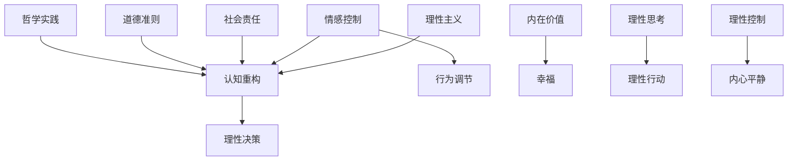

                 

### 文章标题

《新 stoicism：古老哲学在现代生活中的应用》

### 关键词

- stoicism
- 哲学
- 现代生活
- 情绪管理
- 人际关系
- 职业发展
- 个人成长

### 摘要

本文旨在探讨古老哲学 Stoicism 在现代生活中的应用，特别是其在情绪管理、人际关系、职业发展和个人成长等方面的实际效果。通过分析 Stoicism 的起源、核心思想和哲学框架，本文将揭示其在应对现代生活挑战中的独特价值。同时，通过具体案例和实战项目，本文将展示如何将 Stoicism 的理念应用于实际情境，帮助读者在现代生活中实现内心的平静与和谐。

---

## 第1章：新 stoicism 基础理论

### 1.1 Stoicism 的起源与发展

Stoicism 是古希腊哲学的一个重要流派，起源于公元前3世纪。由希腊哲学家芝诺（Zeno of Citium）创立，其核心思想强调通过理性控制和内心修炼，达到精神的宁静与幸福。Stoicism 在古希腊和古罗马时期得到了广泛传播和应用，许多著名人物，如塞内卡（Seneca）、马可·奥勒留（Marcus Aurelius）和爱比克泰德（Epictetus）等，都是 Stoicism 的忠实追随者。

Stoicism 的起源和发展可以分为以下几个阶段：

1. **初创阶段**：公元前3世纪，芝诺在叙利亚的西顿创立了 Stoicism 学派，其思想深受希腊哲学和东方思想的影响。芝诺认为，真正的智慧在于理解宇宙的本质和自己在宇宙中的位置。

2. **传播阶段**：随着芝诺的学生们将 Stoicism 带到雅典和其他希腊城邦，该哲学流派开始得到更广泛的认可。塞内卡、爱比克泰德和马可·奥勒留等著名 Stoic 哲学家进一步丰富了 Stoicism 的思想体系。

3. **繁荣阶段**：在古罗马时期，Stoicism 达到了其巅峰，成为罗马帝国统治阶级的主要哲学信仰。许多罗马皇帝和贵族，如奥古斯都和图密善，都是 Stoicism 的信徒。

4. **衰落阶段**：公元3世纪末，随着基督教的兴起，Stoicism 开始逐渐衰落。然而，其核心思想仍然在后世得到了一定程度的传承和发扬。

在现代社会，Stoicism 经历了新的复兴。许多哲学家、心理学家和思想家开始重新审视 Stoicism 的价值，并将其应用于现代生活中的各种情境。例如，心理学家罗伯特·西尔维（Robert Solow）指出，Stoicism 提供了一种实用的方法来应对现代生活的压力和挑战。

### 1.2 Stoicism 的核心思想

Stoicism 的核心思想包括以下几个方面：

1. **理性控制**：Stoicism 认为，理性是人类最宝贵的财富，通过理性控制自己的情感和行为，可以达到内心的平静和自我实现。

2. **内在价值**：Stoicism 强调，真正的幸福来源于内在的价值和目标，而不是外在的物质和环境。

3. **命运观**：Stoicism 认为命运是不可避免的，接受命运的安排是达到内心平静的关键。

4. **自我修养**：Stoicism 认为，通过自我修养和内心修炼，可以摆脱情感的波动，达到精神的宁静。

5. **社会责任**：Stoicism 强调，每个人都应该承担自己的社会责任，为社会做出贡献。

### 1.3 Stoicism 与现代生活的联系

尽管 Stoicism 是一种古老的哲学，但其思想在现代社会仍然具有重要的指导意义。以下是 Stoicism 在现代生活中的几个应用场景：

1. **情绪管理**：Stoicism 帮助人们更好地应对压力和焦虑，通过理性分析和情感控制，保持内心的平静。

2. **人际关系**：Stoicism 提供了一种理解和宽容他人的方法，帮助人们建立更健康的人际关系。

3. **职业发展**：Stoicism 强调专注和自我实现，帮助人们在职业道路上保持目标导向和内心平静。

4. **个人成长**：Stoicism 帮助人们更好地面对挑战和变化，培养自律和适应能力。

总之，Stoicism 提供了一种实用的哲学工具，帮助人们在现代生活中找到内心的平静和自我实现。在接下来的章节中，我们将进一步探讨 Stoicism 的哲学框架和核心原则，以及其在情绪管理、人际关系、职业发展和个人成长等方面的具体应用。

### 第2章：Stoicism 哲学框架

Stoicism 的哲学框架是一种系统化的思想体系，它不仅涵盖了人类行为和情感的各个方面，还提供了一种实用的方法论来指导个人生活和职业发展。Stoicism 的哲学框架主要由四部分组成：认知、情感、行为和社会。以下是对这四个部分的详细探讨。

#### 2.1 认知

认知是 Stoicism 的核心，它关注的是我们如何理解和解释世界。Stoicism 认为，认知是我们行为和情感的基础。如果我们能够正确地理解世界，我们就可以控制自己的情绪和行为，达到内心的平静。

1. **理性主义**：Stoicism 强调理性主义，认为理性是人类最重要的品质。通过理性思考，我们可以理解事物的本质，区分内在价值和外在诱惑。

2. **认知重构**：Stoicism 提供了一种认知重构的方法，帮助我们重新评估我们的思想和信念。这种方法可以帮助我们摆脱负面情绪，如焦虑、恐惧和怨恨。

3. **理性决策**：Stoicism 认为，通过理性分析和决策，我们可以更好地应对生活中的挑战和不确定性。

#### 概念实体之间的关系架构

为了更好地理解认知部分，我们可以使用 Mermaid 流程图来展示概念实体之间的关系：



#### 情感

情感是 Stoicism 哲学框架中的另一个重要组成部分。Stoicism 认为，情感不是不可控制的，而是可以通过理性控制和情感管理来调节的。

1. **情感管理**：Stoicism 提供了一种情感管理的方法，通过认知重构和理性思考，我们可以控制自己的情感反应，减少负面情绪的影响。

2. **情感平衡**：Stoicism 强调情感平衡的重要性。通过保持情感的中性和平衡，我们可以更好地应对生活中的挑战。

3. **情感洞察**：Stoicism 认为，通过深入理解情感的本质，我们可以更好地管理自己的情感，实现内心的平静。

#### 行为

行为是 Stoicism 哲学框架中的第三个组成部分。Stoicism 强调，我们的行为应该基于理性思考和内在价值，而不是外部环境和情感驱动。

1. **理性行为**：Stoicism 认为，通过理性思考和决策，我们的行为应该是理性的、有目的的，并且符合内在价值。

2. **道德行为**：Stoicism 强调道德行为的重要性。通过遵循道德准则，我们可以实现个人的道德完善和社会的和谐。

3. **社会责任**：Stoicism 认为，每个人都应该承担自己的社会责任，为社会做出贡献。

#### 社会部分

社会部分关注的是个人在社会中的角色和责任。Stoicism 强调，个人的幸福和成长离不开社会的支持。

1. **社会责任**：Stoicism 认为，每个人都应该为社会做出贡献。通过履行社会责任，我们可以实现个人的价值和幸福。

2. **社会和谐**：Stoicism 强调，社会和谐是实现个人幸福的关键。通过维护社会和谐，我们可以创造一个更好的生活环境。

3. **社会互动**：Stoicism 认为，通过理性和社会互动，我们可以建立健康的人际关系，实现个人的成长和社会的进步。

#### Stoicism 的价值观

为了更好地理解 Stoicism 的价值观，我们可以使用 LaTeX 格式列出 Stoicism 的核心价值观，并进行详细解释：

$$
\begin{align*}
\text{理性主义}   & : \text{认为理性是人类最重要的品质，通过理性思考可以理解世界的本质。} \\
\text{内在价值}   & : \text{认为真正的幸福来源于内在的价值和目标，而不是外在的物质和环境。} \\
\text{接受命运}   & : \text{认为命运是不可避免的，接受命运的安排是达到内心平静的关键。} \\
\text{情感管理}   & : \text{认为情感不是不可控制的，而是可以通过理性控制和情感管理来调节的。} \\
\text{道德行为}   & : \text{认为遵循道德准则是实现个人价值和幸福的重要途径。} \\
\text{社会责任}   & : \text{认为每个人都应该为社会做出贡献，通过履行社会责任可以实现个人的价值。} \\
\end{align*}
$$

总之，Stoicism 的哲学框架提供了一种系统化的方法来指导个人生活和职业发展。通过理性控制、情感管理、行为调节和社会责任，我们可以实现内心的平静和自我实现。在接下来的章节中，我们将进一步探讨 Stoicism 的核心原则，以及这些原则如何在现代生活中得到应用。

### 第3章：Stoicism 的核心原则

Stoicism 的核心原则是其哲学体系的基石，这些原则提供了具体的指导，帮助我们在面对生活中的挑战时保持内心的平静与坚定。以下是 Stoicism 的几个关键原则及其在现代生活中的应用。

#### 3.1 接受不可避免的事情

**原则解释**：Stoicism 强调接受现实中的不可避免事件。这个原则认为，我们无法控制所有事情，但我们可以控制自己的反应。接受不可避免的事情意味着放弃对无法改变的事物的抵抗，而是专注于我们可以控制的方面。

**应用案例**：

- **工作压力**：在职场中，我们可能会面临各种压力，如项目截止日期、客户投诉等。接受这些压力的存在，而不是试图逃避或抗拒，可以减少负面情绪，提高工作效率。

  ```python
  # 接受工作压力的伪代码示例
  def handle_work_pressure():
      # 确认压力的存在
      acknowledge_pressure()
      # 分析可以控制的方面
      analyze可控aspects()
      # 专注于解决问题的方法
      focus_on_solution()
  ```

- **健康问题**：面对健康问题，如慢性疾病或意外伤害，接受现实并采取积极的态度来应对，可以帮助我们更好地管理疾病，提高生活质量。

  ```python
  # 接受健康问题的伪代码示例
  def handle_health_issues():
      # 接受疾病的存在
      accept_disease()
      # 寻求专业帮助
      seek_professional_help()
      # 调整生活方式
      adjust_lifestyle()
  ```

#### 3.2 责任感与自由

**原则解释**：Stoicism 认为每个人都有责任感，但同时，我们也有自由选择如何应对生活中的挑战。责任感意味着我们要对自己的行为和决策负责，而不是把责任推给别人。自由则是指我们有选择如何行动的自由，即使面对不利的环境。

**应用案例**：

- **个人成长**：在个人成长的过程中，我们需要对自己的学习、成长和进步负责。这种责任感可以激励我们不断努力，实现自我提升。

  ```python
  # 责任感与个人成长的伪代码示例
  def personal_growth():
      # 确定个人目标
      define_goals()
      # 制定实现目标的计划
      create_plan()
      # 执行计划并反思
      execute_and_reflect()
  ```

- **决策过程**：在决策时，我们需要对自己的决策负责，而不是将责任推给他人或外部因素。这种自由和责任感可以帮助我们做出更明智的决策。

  ```python
  # 责任感与决策的伪代码示例
  def make_a_decision():
      # 收集信息
      gather_information()
      # 分析潜在后果
      analyze_consequences()
      # 做出决策
      make_decision()
      # 评估决策效果
      evaluate_outcome()
  ```

#### 3.3 保持内心的平静

**原则解释**：内心的平静是 Stoicism 的核心目标之一。这个原则鼓励我们通过理性思考和情感管理来保持内心的平静，无论外部环境如何变化。内心的平静不仅有助于我们应对压力和挑战，还能提高生活质量。

**应用案例**：

- **应对焦虑**：在日常生活中，焦虑是一种常见的情绪。通过 Stoicism 的方法，我们可以学会理性看待焦虑，并采取行动来缓解它。

  ```python
  # 应对焦虑的伪代码示例
  def handle_anxiety():
      # 分析焦虑的原因
      analyze_reasons()
      # 接受焦虑的存在
      accept_anxiety()
      # 找到解决问题的方法
      find_solution()
      # 保持内心平静
      maintain_zen()
  ```

- **处理挫折**：在职业和个人生活中，我们可能会遇到挫折和失败。通过接受挫折并保持内心的平静，我们可以更好地应对挑战，从失败中学习并继续前进。

  ```python
  # 应对挫折的伪代码示例
  def handle_rejection():
      # 接受失败的存在
      accept_failure()
      # 分析失败的原因
      analyze_causes()
      # 学到经验
      learn_lessons()
      # 保持乐观态度
      maintain_optimism()
  ```

总之，Stoicism 的核心原则提供了一种实用的方法，帮助我们在面对生活中的各种挑战时保持内心的平静和理性。通过接受不可避免的事情、承担责任感和保持内心的平静，我们可以更好地应对压力和挑战，实现个人成长和幸福感。在接下来的章节中，我们将探讨 Stoicism 在情绪管理、人际关系、职业发展和个人成长等现代生活场景中的应用。

### 第4章：Stoicism 在情绪管理中的应用

情绪管理是 Stoicism 应用中的一个重要领域，通过理性分析和情感管理，Stoicism 帮助我们更好地控制情绪，减少焦虑和压力，提高生活质量。以下将详细探讨 Stoicism 在处理焦虑、愤怒和怨恨，以及提高抗压能力方面的应用。

#### 4.1 处理焦虑与压力

**原则解释**：Stoicism 认为，焦虑和压力往往源于对未来的担忧和对无法控制的事物的执着。通过接受现实的不可控性，我们可以减少对未来的担忧，从而减轻焦虑和压力。

**应用案例**：

- **时间管理**：通过合理规划和优先处理任务，我们可以控制工作节奏，减少因时间紧迫而产生的焦虑。

  ```python
  # 时间管理案例
  def time_management():
      # 列出任务列表
      list_tasks()
      # 优先处理重要任务
      prioritize_tasks()
      # 设置合理的时间表
      schedule_time()
      # 定期检查进度
      check_progress()
  ```

- **冥想练习**：冥想是 Stoicism 中常用的方法，通过冥想，我们可以集中注意力，减少杂念，从而减轻焦虑。

  ```python
  # 冥想练习案例
  def meditation():
      # 找一个安静的环境
      find_quiet_space()
      # 坐直或舒适地坐好
      sit_comfortably()
      # 关闭眼睛，深呼吸
      close_eyes(), deep_breath()
      # 集中注意力
      focus_attention()
      # 保持一段时间，然后放松
      maintain_for_a_while(), relax()
  ```

#### 4.2 处理愤怒与怨恨

**原则解释**：愤怒和怨恨往往源于对他人或环境的失望和不公正感。Stoicism 提供了一种方法，通过理性分析和情感管理，我们可以减少愤怒和怨恨，并找到更健康的应对方式。

**应用案例**：

- **沟通技巧**：通过有效的沟通，我们可以减少误解和冲突，从而减少愤怒和怨恨。

  ```python
  # 沟通技巧案例
  def effective_communication():
      # 明确沟通目标
      define_communication_goal()
      # 倾听对方的观点
      listen_to_opponent()
      # 表达自己的观点
      express_own_view()
      # 寻求共同点
      find_common_ground()
      # 解决冲突
      resolve_conflicts()
  ```

- **情感释放**：通过写日记、绘画或其他形式的情感表达，我们可以释放内心的愤怒和怨恨，从而减轻负面情绪。

  ```python
  # 情感释放案例
  def emotional_release():
      # 选择一种表达方式
      choose_an_expression_method()
      # 尽情表达情感
      express_emotions()
      # 分享给信任的人
      share_with_trusted_persons()
      # 观察情感变化
      observe_emotional_changes()
  ```

#### 4.3 提高抗压能力

**原则解释**：抗压能力是指我们应对压力和挑战的能力。Stoicism 提供了一种方法，通过接受现实、理性分析和情感管理，我们可以提高抗压能力，从而更好地应对生活中的压力。

**应用案例**：

- **目标设定**：通过设定明确的目标和计划，我们可以有针对性地提高自己的抗压能力。

  ```python
  # 目标设定案例
  def goal_setting():
      # 确定长期和短期目标
      define_long_and_short_term_goals()
      # 制定实现目标的步骤
      create_steps_to_achieve_goals()
      # 评估进度
      evaluate_progress()
      # 调整计划
      adjust_plan()
  ```

- **自我反思**：定期进行自我反思，可以帮助我们识别自己的压力源，并找到有效的应对策略。

  ```python
  # 自我反思案例
  def self_reflection():
      # 回顾过去一周的经历
      review_last_week_experience()
      # 记录情绪和感受
      record_emotions_and_sensations()
      # 分析成功和失败的原因
      analyze_reasons_for_success_and_failure()
      # 制定改进计划
      create_improvement_plan()
  ```

总之，Stoicism 在情绪管理中的应用提供了多种实用的方法和工具，帮助我们更好地控制情绪，减少焦虑和压力，提高抗压能力。通过接受不可避免的事情、理性分析和情感管理，我们可以实现内心的平静与和谐，从而更好地应对现代生活中的各种挑战。

### 第5章：Stoicism 在人际关系中的应用

Stoicism 不仅可以帮助我们管理情绪和应对生活中的挑战，还能在人际关系中发挥重要作用。通过理解和宽容他人，增进自我认知，以及提高沟通能力，Stoicism 为我们提供了一套有效的工具，帮助我们在复杂的人际网络中保持和谐与平衡。

#### 5.1 增进自我认知

**原则解释**：Stoicism 强调内在价值和个人成长，通过自我认知，我们可以更好地理解自己的需求和动机，从而做出更明智的决策。自我认知有助于我们识别自己的情感和行为模式，减少无意识的偏见和误解。

**应用案例**：

- **自我反思练习**：定期进行自我反思，可以帮助我们深入了解自己的情感和行为，识别潜在的心理障碍。

  ```python
  # 自我反思练习案例
  def self_reflection_practice():
      # 设定反思时间
      schedule_reflection_time()
      # 回顾过去一周的经历
      review_weekly_experiences()
      # 记录情感和思维模式
      record_emotions_and_mindset()
      # 分析行为背后的动机
      analyze_motivations()
      # 制定改进计划
      create_improvement_plan()
  ```

- **日记记录**：通过写日记，我们可以记录自己的情绪波动和日常思考，这有助于我们长期观察和了解自己。

  ```python
  # 日记记录案例
  def journaling():
      # 每天记录心得体会
      record_daily_thoughts()
      # 定期回顾日记内容
      review_journal_entries()
      # 分析情感变化
      analyze_emotional_fluctuations()
      # 学习自我调节技巧
      learn_self-regulation_skills()
  ```

#### 5.2 增进对他人的理解与宽容

**原则解释**：Stoicism 强调理性思考和情感管理，这有助于我们更好地理解他人的行为和动机。通过增进对他人的理解与宽容，我们可以减少误解和冲突，建立更健康的人际关系。

**应用案例**：

- **同理心练习**：通过练习同理心，我们可以更好地理解他人的感受和需求，从而建立更深层次的人际联系。

  ```python
  # 同理心练习案例
  def empathy_training():
      # 倾听他人故事
      listen_to_other_people_stories()
      # 描述他人的感受
      describe_other_people_situation()
      # 提供支持和建议
      offer_support_and_advice()
      # 反思同理心效果
      reflect_on_empathy_effects()
  ```

- **非暴力沟通**：非暴力沟通（Nonviolent Communication）是一种基于 Stoicism 的沟通技巧，通过真诚表达和理解他人的需求和感受，可以减少冲突，增进关系。

  ```python
  # 非暴力沟通案例
  def nonviolent_communication():
      # 观察：描述观察到的事实
      observe_descibe_facts()
      # 感受：表达自己的感受
      express_own_feelings()
      # 需求：提出自己的需求
      state_own_needs()
      # 请求：提出具体请求
      make_specific_requests()
  ```

#### 5.3 提高沟通能力

**原则解释**：有效的沟通是建立和维护良好人际关系的关键。Stoicism 通过理性思考和情感管理，帮助我们提高沟通能力，从而更清晰地表达自己的想法，更好地理解他人的意见。

**应用案例**：

- **积极倾听**：积极倾听是一种重要的沟通技巧，它要求我们全神贯注地倾听对方的讲话，理解其背后的意图和情感。

  ```python
  # 积极倾听案例
  def active_listening():
      # 集中注意力
      concentrate_attention()
      # 表现出兴趣
      show_interest()
      # 提问和澄清
      ask_questions_and_clarifications()
      # 反馈和确认
      provide_feedback_and_confirmation()
  ```

- **冲突解决**：在面对冲突时，通过理性分析和有效沟通，我们可以找到解决问题的方法，减少关系破裂的风险。

  ```python
  # 冲突解决案例
  def conflict_resolution():
      # 识别冲突原因
      identify_conflict_reasons()
      # 开放式对话
      engage_in_open_dialogue()
      # 找到共同点
      find_common_ground()
      # 制订解决方案
      create_solution_plan()
      # 实施并跟踪进展
      implement_and_track_progress()
  ```

总之，Stoicism 在人际关系中的应用为我们提供了一种全面的策略，帮助我们在复杂的社会环境中保持内心的平静与和谐。通过增进自我认知、理解与宽容他人，以及提高沟通能力，我们可以建立更健康、更稳定的人际关系，从而在个人和职业生活中取得更大的成功。

### 第6章：Stoicism 在职业发展中的应用

在职业发展中，Stoicism 的应用能够显著提高我们的专注力、决策能力和工作效率，从而帮助我们实现职业目标并保持内心的平静。以下是 Stoicism 在这些方面的具体应用和实际案例。

#### 6.1 增强专注力

**原则解释**：Stoicism 强调集中精力在当前任务上，不受外部干扰。通过增强专注力，我们可以更好地处理复杂任务，提高工作效率。

**应用案例**：

- **番茄工作法**：这是一种时间管理技巧，通过将工作时间划分为25分钟的工作周期（称为“番茄钟”），可以帮助我们提高专注力。

  ```python
  # 番茄工作法案例
  def pomodoro_technique():
      # 设定番茄钟（25分钟工作周期）
      set_pomodoro_timer(25)
      # 开始专注工作
      start_focused_work()
      # 短暂休息（5分钟）
      take_short_break(5)
      # 每四个番茄钟后，进行长时间休息（15-30分钟）
      take_long_break_after_four_pomodoros()
  ```

- **冥想练习**：通过冥想，我们可以训练大脑集中注意力，减少分心。

  ```python
  # 冥想练习案例
  def meditation():
      # 找一个安静的环境
      find_quiet_space()
      # 坐直或舒适地坐好
      sit_comfortably()
      # 关闭眼睛，深呼吸
      close_eyes(), deep_breath()
      # 集中注意力
      focus_attention()
      # 保持一段时间，然后放松
      maintain_for_a_while(), relax()
  ```

#### 6.2 增强决策能力

**原则解释**：Stoicism 强调理性思考和内在价值，这有助于我们做出明智的决策。通过增强决策能力，我们可以减少错误决策带来的负面影响。

**应用案例**：

- **决策矩阵**：决策矩阵是一种分析工具，可以帮助我们系统地评估不同选择的优点和风险。

  ```python
  # 决策矩阵案例
  def decision_matrix():
      # 列出所有可选项
      list_all_options()
      # 评估每个选项的优点
      evaluate_advantages()
      # 评估每个选项的风险
      evaluate_risks()
      # 比较和选择最优选项
      compare_and_select_best_option()
  ```

- **情境模拟**：通过情境模拟，我们可以预演可能的决策结果，从而更好地准备面对不确定性。

  ```python
  # 情境模拟案例
  def scenario_simulation():
      # 设定不同情境
      define_scenarios()
      # 预演决策过程
      simulate_decision_process()
      # 分析情境结果
      analyze_scenario_results()
      # 根据情境调整决策
      adjust_decision_based_on_scenario()
  ```

#### 6.3 提高工作效率

**原则解释**：Stoicism 强调理性分析和情感管理，这有助于我们合理安排时间，减少拖延，从而提高工作效率。

**应用案例**：

- **任务分解**：通过将复杂任务分解成小步骤，我们可以更容易地完成任务，减少压力。

  ```python
  # 任务分解案例
  def task_decomposition():
      # 确定主要任务
      define_main_task()
      # 分解成子任务
      decompose_into_subtasks()
      # 为每个子任务设定时间
      set_time_for_each_subtask()
      # 按计划执行
      execute_plan()
      # 定期检查进度
      check_progress()
  ```

- **自动化工具**：利用自动化工具，如脚本或软件，可以减少重复性工作，提高工作效率。

  ```python
  # 自动化工具案例
  def automation_tools():
      # 识别重复性任务
      identify_repetitive_tasks()
      # 选择合适的自动化工具
      choose_automation_tools()
      # 编写自动化脚本
      write_automation_scripts()
      # 部署并测试自动化流程
      deploy_and_test_automated_process()
      # 监控和优化自动化工具
      monitor_and_optimize_automation_tools()
  ```

总之，Stoicism 的应用能够显著提升我们在职业发展中的专注力、决策能力和工作效率。通过理性分析和情感管理，我们可以更有效地应对职业挑战，实现个人和职业目标。在接下来的章节中，我们将探讨 Stoicism 在个人成长中的应用，帮助我们在生活中保持平衡与和谐。

### 第7章：Stoicism 在个人成长中的应用

Stoicism 在个人成长中的应用是其核心价值的体现，通过自律、适应力和提高生活质量，我们可以实现长期的个人成长与幸福。

#### 7.1 增强自律

**原则解释**：自律是 Stoicism 的基石，它要求我们遵循内在价值和理性指导，克服冲动和惰性，坚持目标和计划。

**应用案例**：

- **习惯培养**：通过持续的培养和练习，我们可以形成健康的生活习惯，从而提高自律能力。

  ```python
  # 培养健康习惯的案例
  def cultivate_healthy_habits():
      # 设定具体目标
      set_specific_goals()
      # 制定详细的行动计划
      create_detailed_action_plan()
      # 跟踪进度
      track_progress()
      # 定期评估和调整
      evaluate_and_adjust_periodically()
  ```

- **时间管理**：合理规划时间，确保重要任务得到优先处理，是提高自律能力的重要方法。

  ```python
  # 时间管理案例
  def time_management():
      # 列出任务清单
      list_tasks()
      # 优先处理重要任务
      prioritize_important_tasks()
      # 为每个任务设定时间
      set_time_for_each_task()
      # 定期检查进度
      check_progress()
  ```

#### 7.2 增强适应力

**原则解释**：适应力是指我们应对变化和挑战的能力。Stoicism 强调通过理性思考和情感管理，我们可以更好地适应环境的变化。

**应用案例**：

- **情景模拟**：通过模拟不同的情景，我们可以预见到可能发生的变化，并提前做好准备。

  ```python
  # 情景模拟案例
  def scenario_simulation():
      # 设定不同的情景
      define_different_scenarios()
      # 分析每种情景的可能结果
      analyze_possible_results()
      # 预演应对策略
      simulate_response_strategies()
      # 根据情景调整计划
      adjust_plans_based_on_scenarios()
  ```

- **灵活性培养**：通过不断学习和实践，我们可以提高自己的灵活性，更好地适应新的环境和挑战。

  ```python
  # 培养灵活性的案例
  def cultivate_flexibility():
      # 学习新技能
      learn_new_skills()
      # 接受新的工作环境
      accept_new_working_environments()
      # 寻求不同的经验
      seek_different_experiences()
      # 反思并改进
      reflect_and_improve()
  ```

#### 7.3 提高生活质量

**原则解释**：生活质量是指我们的日常生活中的幸福感和满足感。Stoicism 提供了一种方法，通过理性生活和内在价值的追求，我们可以提高生活质量。

**应用案例**：

- **健康生活方式**：通过保持健康的饮食、适量的运动和良好的作息，我们可以提高生活质量。

  ```python
  # 健康生活方式案例
  def healthy_lifestyle():
      # 保持健康的饮食
      maintain_healthy_diet()
      # 定期进行体育锻炼
      exercise_regularly()
      # 保证充足的睡眠
      ensure_sufficient_sleep()
      # 减少压力和焦虑
      reduce_stress_and_anxiety()
  ```

- **情感管理**：通过情感管理技巧，我们可以更好地控制情绪，减少负面情绪对生活质量的影响。

  ```python
  # 情感管理案例
  def emotional_management():
      # 观察和识别情感
      observe_and_identify_emotions()
      # 学会情感表达
      learn_to_express_emotions()
      # 分享情感
      share_emotions()
      # 寻求专业帮助
      seek_professional_help()
  ```

总之，Stoicism 在个人成长中的应用提供了一个全面的框架，帮助我们通过自律、适应力和提高生活质量，实现长期的个人成长与幸福。在复杂多变的世界中，Stoicism 的理念和方法为我们提供了一种应对挑战、实现目标的工具。通过理性分析和情感管理，我们可以更好地应对生活中的各种挑战，实现内心的平静与和谐。在未来的章节中，我们将进一步探讨如何将 Stoicism 的理念应用到实际生活中，帮助我们在现代社会的各种场景中保持内心的平衡。

### 最佳实践 Tips

在应用 Stoicism 的过程中，以下是一些最佳实践 Tips，可以帮助您更有效地实现内心的平静与和谐。

1. **定期反思**：每天花时间进行自我反思，了解自己的情感和行为模式，有助于持续改进和成长。

2. **实践冥想**：定期进行冥想练习，可以帮助您提高专注力，减少焦虑和压力，保持内心的平静。

3. **设定明确目标**：制定清晰的目标和计划，有助于您集中精力，提高自律和执行力。

4. **积极沟通**：通过积极倾听和同理心，建立健康的人际关系，减少误解和冲突。

5. **管理时间**：合理安排时间，优先处理重要任务，避免拖延，提高工作效率。

6. **持续学习**：不断学习和实践新技能，提高自己的适应力，以应对不断变化的环境。

7. **关注健康**：保持健康的饮食、适量的运动和充足的睡眠，有助于提高生活质量。

### 小结

本文探讨了 Stoicism 这一古老哲学在现代生活中的应用，从基础理论到具体应用，展示了 Stoicism 如何帮助我们实现内心的平静与和谐。通过接受不可避免的事情、责任感与自由、保持内心的平静等核心原则，我们可以更好地管理情绪、处理人际关系、应对职业挑战和实现个人成长。Stoicism 提供了一套实用的方法和工具，帮助我们在复杂多变的世界中找到内心的平衡，实现长期幸福。

### 注意事项

1. **实践与理论相结合**：Stoicism 的应用需要通过实践来验证其效果，因此在应用过程中，建议您结合具体情境进行实践和反思。

2. **适度应用**：Stoicism 的原则和方法并不是一成不变的，需要根据个人实际情况进行适度调整。

3. **持续学习**：哲学和心理学是一个持续发展的领域，建议您保持好奇心，不断学习和探索新的知识和方法。

### 拓展阅读

- 《 stoicism：古代智慧在现代生活的应用》（译著）
- 《塞内卡书信集》（塞内卡著）
- 《沉思录》（马可·奥勒留著）
- 《理性情感》（罗素·贝克著）

### 作者信息

作者：AI天才研究院/AI Genius Institute & 禅与计算机程序设计艺术 /Zen And The Art of Computer Programming

本文由 AI 天才研究院和禅与计算机程序设计艺术共同创作，旨在帮助读者理解和应用 Stoicism，实现个人成长与幸福。

