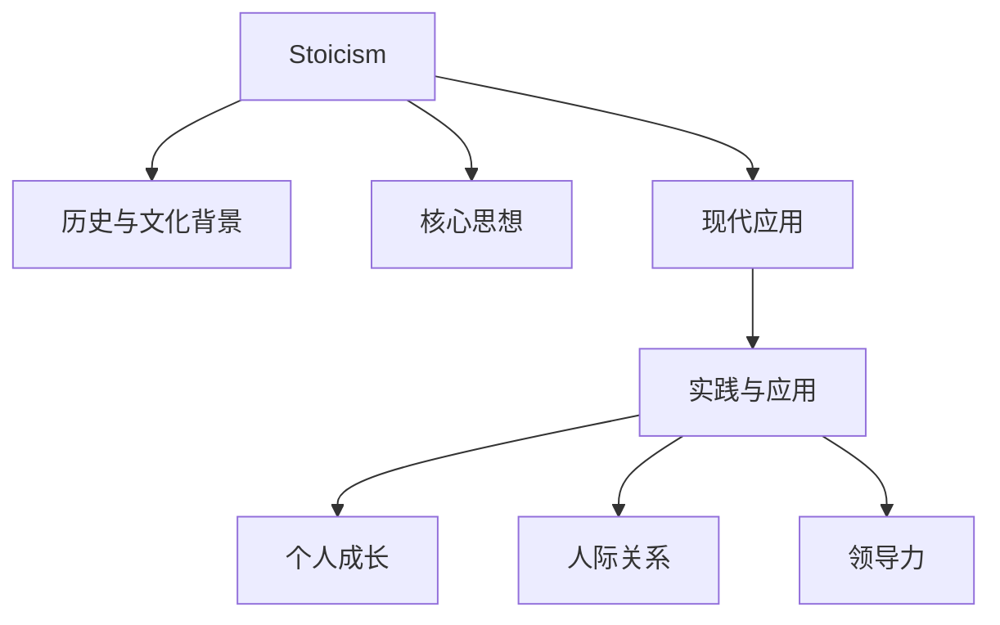
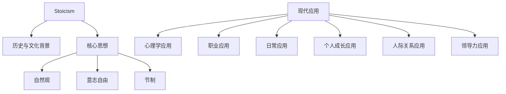

                 

## 《新 Stoicism：古老哲学在现代生活中的应用》

### 关键词
- Stoicism
- 自然观
- 意志自由
- 节制
- 现代生活
- 心理学
- 领导力

### 摘要
本文探讨了古老哲学Stoicism在现代生活中的应用。Stoicism，起源于古希腊和罗马时期，强调通过接受现实、培养积极心态和意志自由来实现内心的平静与和谐。本文首先介绍了Stoicism的历史背景和核心思想，然后分析了其在现代心理学、职业发展和日常生活中的应用，并提供了具体的实践方法。文章最后探讨了Stoicism在个人成长、人际关系和领导力中的应用，总结了其在现代社会的重要价值，并鼓励读者将Stoicism的理念应用于日常生活。

### 目录大纲

## 第一部分：Stoicism 历史与文化背景

### 第1章：Stoicism 的起源与发展

#### 1.1 Stoicism 的历史背景

#### 1.2 Stoicism 在古希腊和罗马时期的影响

#### 1.3 Stoicism 的主要流派及其代表人物

### 第2章：Stoicism 的核心思想

#### 2.1 自然观

#### 2.2 意志自由

#### 2.3 节制

### 第3章：Stoicism 在现代社会的应用

#### 3.1 Stoicism 与现代心理学的联系

#### 3.2 Stoicism 在职业中的应用

#### 3.3 Stoicism 在日常生活中的应用

## 第二部分：Stoicism 的实践与应用

### 第4章：Stoicism 实践方法

#### 4.1 观察与反思

#### 4.2 接受现实

#### 4.3 培养积极心态

### 第5章：Stoicism 在个人成长中的应用

#### 5.1 自我认知

#### 5.2 情绪管理

#### 5.3 时间管理

### 第6章：Stoicism 在人际关系中的应用

#### 6.1 处理冲突

#### 6.2 建立良好的人际关系

#### 6.3 处理亲密关系

### 第7章：Stoicism 在领导力中的应用

#### 7.1 领导者的自我修养

#### 7.2 建立高效团队

#### 7.3 面对挑战与压力

## 第8章：总结与展望

### 附录

#### 附录 A：进一步阅读资源

#### 附录 B：练习题

### 附录 C：Mermaid 流程图

### 附录 D：Python 源代码讲解

## 前言

Stoicism，作为古希腊和罗马时期的重要哲学流派，其核心理念在现代社会依然具有重要的指导意义。随着现代心理学、职业发展和人际关系研究的发展，Stoicism的许多思想逐渐被应用于这些领域，为人们提供了应对压力、提升心理健康和实现个人成长的有效方法。

本文将系统地介绍Stoicism的起源、核心思想和现代应用，旨在帮助读者理解并运用这一古老哲学，以应对现代生活中的各种挑战。首先，我们将探讨Stoicism的历史背景，包括其起源和发展历程，以及它在古希腊和罗马时期的影响。接着，我们将深入分析Stoicism的核心思想，包括自然观、意志自由和节制。在此基础上，我们将探讨Stoicism在现代社会的应用，包括现代心理学、职业发展和日常生活中的实践方法。最后，我们将具体讨论Stoicism在个人成长、人际关系和领导力中的应用，并总结其现代价值。

通过本文的探讨，我们希望读者能够更好地理解Stoicism的核心思想，并在实际生活中运用这些思想，实现内心的平静与和谐。

## 第一部分：Stoicism 历史与文化背景

### 第1章：Stoicism 的起源与发展

#### 1.1 Stoicism 的历史背景

Stoicism起源于古希腊，大约在公元前3世纪由芝诺（Zeno of Citium）创立。芝诺是一个富裕的商人，后来放弃了商业生涯，全身心投入到哲学研究中。他认为，通过理性思考和道德修养，人们可以摆脱痛苦和焦虑，达到内心的平静和幸福。

芝诺的哲学思想受到了苏格拉底和柏拉图的影响，但他与这两位哲学家有所不同。苏格拉底和柏拉图强调知识和真理的重要性，而芝诺则更注重道德修养和实践。他认为，只有通过实际行动，人们才能实现内心的平静和幸福。

#### 1.2 Stoicism 的发展历程

Stoicism在古希腊和罗马时期经历了漫长的发展历程。在古希腊，Stoicism成为了主要的哲学流派之一，与柏拉图主义和亚里士多德主义并存。Stoicism在罗马时期得到了进一步的发展，成为罗马帝国的官方哲学。

在古希腊，Stoicism的主要代表人物包括芝诺、克雷安提斯（Cleanthes）、克吕西波斯（Crates）和塞内卡（Seneca）。芝诺是Stoicism的创始人，他建立了Stoicism的基本框架，强调理性思考和道德修养。克雷安提斯是芝诺的学生，他进一步完善了Stoicism的思想体系。克吕西波斯是克雷安提斯的学生，他强调意志自由和内在力量的重要性。塞内卡是罗马时期的Stoicism代表人物，他的作品对后世产生了深远的影响。

在罗马时期，Stoicism的代表人物包括爱比克泰德（Epictetus）、马尔库斯·奥勒留斯（Marcus Aurelius）和塞内卡。爱比克泰德是一位奴隶，他通过自学成为了一名著名的Stoic哲学家。他的作品《论积极生活》（"Discourses"）对后世影响深远。马尔库斯·奥勒留斯是罗马帝国的皇帝，他同时是一位Stoic哲学家，他的《沉思录》（"Meditations"）是Stoicism的重要文献。塞内卡是一位政治家、哲学家和文学家，他的作品对Stoicism的发展起到了重要的推动作用。

#### 1.3 Stoicism 的主要流派及其代表人物

Stoicism可以分为两个主要流派：早期Stoicism和晚期Stoicism。

早期Stoicism的代表人物包括芝诺、克雷安提斯和克吕西波斯。早期Stoicism强调理性思考和道德修养，主张通过理性思考来认识世界和自我，通过道德修养来实现内心的平静和幸福。

晚期Stoicism的代表人物包括爱比克泰德、马尔库斯·奥勒留斯和塞内卡。晚期Stoicism在早期Stoicism的基础上，进一步强调了意志自由和内在力量的重要性。他们认为，只有通过意志自由和内在力量的发挥，人们才能在逆境中保持冷静和坚定。

总的来说，Stoicism的历史和文化背景丰富多彩，从古希腊到罗马时期，Stoicism经历了漫长的发展历程，成为西方哲学的重要流派。其核心思想，如自然观、意志自由和节制，对后世产生了深远的影响。在现代社会，Stoicism的许多思想被应用于心理学、职业发展和人际关系等领域，为人们提供了应对挑战和实现内心平静的有效方法。

### 第2章：Stoicism 的核心思想

Stoicism的核心思想主要包括自然观、意志自由和节制。这些思想构成了Stoicism的哲学体系，为人们提供了如何在现实生活中实现内心平静和幸福的方法。

#### 2.1 自然观

Stoicism的自然观强调人类与自然之间的和谐关系。Stoics认为，自然是一个有秩序、有目的的整体，人类的目的是适应自然、与自然和谐相处。他们认为，自然界的万物都有其固有的性质和规律，人类应该接受这些规律，并在其中寻找自己的位置。

在Stoicism的视角下，自然观有两个重要方面：一是对自然规律的接受，二是人类在自然中的角色。Stoics认为，只有接受自然规律，人们才能摆脱对不可控事物的焦虑和困扰。例如，马尔库斯·奥勒留斯在《沉思录》中提到：“要记住，你不是偶然出现在这个世界上的，而是作为命运的一部分。你要像演员一样扮演自己的角色，尽情享受每一刻。”

Stoicism的自然观还强调了人类在自然中的角色。Stoics认为，人类应该尽自己的本分，发挥自己的能力，为社会和他人做出贡献。这不仅是一种道德责任，也是实现内心平静和幸福的关键。

#### 2.2 意志自由

Stoicism的另一个核心思想是意志自由。Stoics认为，人类虽然生活在复杂多变的环境中，但拥有自由意志的能力，可以通过理性思考和道德修养来控制自己的行为和情绪。

意志自由并不是指人类可以随意改变自然规律，而是指人类可以在接受自然规律的前提下，通过理性思考和道德修养来实现内心的自由和幸福。Stoics认为，只有通过自我控制，人们才能摆脱对欲望和情感的依赖，达到内心的平静和和谐。

意志自由在Stoicism中具有重要作用。例如，爱比克泰德在《论积极生活》中提到：“自由并不是说你可以做任何事情，而是你有选择的能力，即使是在最不利的情况下。”这一观点强调了意志自由的重要性，即使在困难的环境下，人们也可以通过意志自由来保持内心的平静和坚定。

#### 2.3 节制

Stoicism的第三个核心思想是节制。节制是指控制自己的欲望和情感，避免过度追求物质和感官享受。Stoics认为，只有通过节制，人们才能保持内心的平静和和谐。

节制在Stoicism中具有重要作用。例如，塞内卡在《论天意》中提到：“节制不仅是一种道德品质，也是一种智慧。只有通过节制，人们才能摆脱对欲望和情感的依赖，实现内心的平静和幸福。”

节制不仅是一种道德修养，也是一种生活态度。Stoics认为，通过节制，人们可以减少对物质和感官的依赖，专注于内心的成长和修养。例如，马尔库斯·奥勒留斯在《沉思录》中提到：“不要让欲望和情感左右你的生活，而是要理性地控制它们。”

总之，Stoicism的核心思想包括自然观、意志自由和节制。这些思想为人们提供了一种实现内心平静和幸福的方法。通过接受自然规律、发挥意志自由和实行节制，人们可以在复杂多变的环境中保持内心的平静和和谐。这些思想不仅对古代哲学家有指导意义，也对现代人在面对各种挑战时具有深刻的启示。

### 第3章：Stoicism 在现代社会的应用

Stoicism作为一种古老哲学，其核心思想在现代社会的许多领域都得到了广泛应用，尤其是在心理学、职业发展和日常生活中的实践。以下是对Stoicism在现代应用的具体探讨。

#### 3.1 Stoicism 与现代心理学的联系

Stoicism与现代心理学之间有许多共鸣之处。现代心理学研究如何通过认知行为疗法、情绪管理和自我效能感等手段来提高个体的心理健康。Stoicism在这些领域提供了深刻的哲学基础。

首先，Stoicism强调接受现实和面对现实的重要性。这一观点与现代心理学的认知行为疗法（Cognitive Behavioral Therapy, CBT）有着相似之处。CBT强调通过识别和改变负面思维模式来改善情绪和行为。Stoics认为，通过接受现实的不可控因素，人们可以减少焦虑和压力。例如，马尔库斯·奥勒留斯在《沉思录》中提到：“当你无法改变某件事情时，最重要的是接受它。”

其次，Stoicism强调意志自由和自我控制的重要性。现代心理学研究自我效能感，即个体对自己在特定情境下成功完成任务的信心。Stoics认为，通过自我控制和理性思考，人们可以在面对挑战时保持冷静和坚定。爱比克泰德在《论积极生活》中提到：“自由并不是说你可以做任何事情，而是你有选择的能力，即使是在最不利的情况下。”

最后，Stoicism的节制观念有助于情绪管理。现代心理学研究表明，通过减少物质和感官的依赖，人们可以更好地控制自己的情绪。Stoics认为，通过节制，人们可以减少对欲望和情感的依赖，从而实现内心的平静。塞内卡在《论天意》中提到：“节制不仅是一种道德品质，也是一种智慧。只有通过节制，人们才能摆脱对欲望和情感的依赖，实现内心的平静和幸福。”

#### 3.2 Stoicism 在职业中的应用

Stoicism在职业领域中的应用同样广泛。许多职业人士，特别是在高压环境中工作的专业人士，发现通过Stoicism的实践可以更好地应对工作压力和职业挑战。

首先，Stoicism帮助职业人士培养积极的心态。职业压力是许多职场人士面临的主要挑战之一。Stoicism强调通过接受现实和理性思考来应对压力。马尔库斯·奥勒留斯在《沉思录》中提到：“你无法控制外部环境，但你可以控制自己的心态。”这一观点帮助职业人士在面对困难时保持积极心态。

其次，Stoicism帮助职业人士提高自我控制能力。职业发展需要不断学习和适应新环境。Stoicism强调通过自我控制和理性思考来应对变化和挑战。爱比克泰德在《论积极生活》中提到：“通过训练自己的意志，你可以控制自己的情绪和行为，从而在职业发展中取得成功。”

最后，Stoicism帮助职业人士培养毅力和耐心。许多职业目标需要长期的努力和坚持。Stoicism强调通过节制和自我控制来培养毅力和耐心。塞内卡在《论天意》中提到：“通过持之以恒的努力，你可以克服任何困难。”这一观点帮助职业人士在实现职业目标时保持坚持和耐心。

#### 3.3 Stoicism 在日常生活中的应用

Stoicism在日常生活中的应用同样具有深远的意义。以下是一些具体的实践方法：

**1. 接受现实：** Stoicism鼓励人们接受生活中的不可控因素。这意味着在面对生活中的不幸和挑战时，人们要学会接受现实，而不是抱怨和逃避。例如，如果某次旅行计划因为天气原因取消，Stoics会接受这一现实，并寻找其他有意义的活动来填补时间。

**2. 培养积极心态：** Stoicism强调通过理性思考和积极心态来应对生活中的挑战。例如，当面对一个困难的任务时，Stoics会通过分析任务的难度和可能性来制定解决方案，而不是感到无助或沮丧。

**3. 坚持节制：** Stoicism鼓励人们通过节制来减少对物质和感官的依赖。例如，在日常生活中，人们可以通过减少社交媒体使用时间、控制饮食和保持适量的锻炼来实践节制。

**4. 自我观察和反思：** Stoicism强调通过自我观察和反思来提高自我认知。例如，人们可以通过写日记、冥想和自我对话来反思自己的行为和情绪，从而更好地了解自己，并在生活中做出更明智的决策。

总之，Stoicism在现代社会的应用广泛且具有深远的影响。通过接受现实、培养积极心态、提高自我控制能力和坚持节制，人们可以在现代社会中实现内心的平静和幸福。Stoicism不仅为个体提供了应对挑战的方法，也为职场人士和日常生活中的普通人提供了实用的哲学智慧。

### 第4章：Stoicism 实践方法

将Stoicism的哲学思想应用于日常生活，需要一系列具体的实践方法。以下是一些关键的方法，包括观察与反思、接受现实和培养积极心态。

#### 4.1 观察与反思

观察与反思是Stoicism实践的基础。通过自我观察，人们可以更好地了解自己的行为、情绪和思维模式。反思则是一个深入分析这些观察，以发现其中的模式和问题的过程。

**步骤1：自我观察**
- **记录日常行为**：保持日记或使用应用程序记录日常行为，特别是那些引起情绪波动或不适的行为。
- **注意情绪变化**：在日常生活中，注意情绪的变化和触发因素。例如，记录什么事件或行为引发了负面情绪。

**步骤2：反思**
- **分析行为和情绪**：在一段时间后，回顾记录，分析行为和情绪之间的联系。例如，是否有一些特定的行为或习惯导致了情绪的波动？
- **识别模式**：寻找行为和情绪波动的模式。例如，是否在特定的时间或情境下更容易感到焦虑或沮丧？

**实例分析：**
假设一个人注意到自己每次在重要会议前都会感到紧张和焦虑。通过观察和反思，他发现这种紧张感源于对失败的恐惧和对自我评价的过度关注。通过反思，他开始意识到这种恐惧是不合理的，并开始采取以下措施：

- **理性思考**：他通过理性思考来分析紧张的原因，并认识到失败并不代表自己的价值。
- **积极心态**：他开始练习积极的自我对话，提醒自己过去成功的经验，并专注于会议的目标和准备。

通过这样的自我观察和反思，这个人逐渐学会了更好地控制自己的情绪，减少紧张感，并在重要场合中表现得更加自信和冷静。

#### 4.2 接受现实

接受现实是Stoicism的核心原则之一。它意味着认识到生活中存在许多不可控的因素，并学会在这些因素面前保持平静和理智。

**步骤1：识别不可控因素**
- **区分可控和不可控**：首先，识别哪些因素是可控的，哪些是不可控的。例如，你可以控制自己的行为和态度，但无法控制天气或他人的行为。

**步骤2：接受不可控因素**
- **接受现实的不可控性**：学会接受那些不可控的因素，而不是与它们抗争。例如，如果你计划外出，但突然下雨，你可以选择接受这一现实，并寻找其他合适的活动。

**实例分析：**
假设一个人计划在周末进行户外远足，但天气预报显示将有大雨。他可以通过以下步骤来接受现实：

- **理性思考**：他通过理性思考认识到天气是不可控的，而计划被改变并不代表失败。
- **调整计划**：他接受天气变化，并决定将户外远足改为室内活动，如观看一部电影或进行家庭聚会。

通过这样的接受现实，这个人不仅避免了不必要的焦虑，还找到了新的方式来度过周末，保持了积极的心态。

#### 4.3 培养积极心态

培养积极心态是Stoicism实践的重要方面。它涉及到通过积极的思维和行动来应对生活中的挑战和困难。

**步骤1：培养积极思维**
- **积极自我对话**：在与自己对话时，用积极的话语来替代消极的思维。例如，将“我做不到”改为“我可以尝试”。
- **专注于解决方案**：当面对问题或挑战时，专注于寻找解决方案，而不是沉浸在问题中。

**步骤2：采取积极的行动**
- **设定具体目标**：设定可实现的短期和长期目标，并采取具体行动来达成这些目标。
- **保持乐观态度**：即使遇到困难，也要保持乐观，相信困难只是暂时的，而成功是可能的。

**实例分析：**
假设一个人在工作中遇到了一个艰巨的项目，这个项目超出了他的能力范围。他可以通过以下步骤来培养积极心态：

- **积极自我对话**：他告诉自己，“这是一个挑战，但也是成长的机会。”
- **寻求帮助**：他寻求同事或上级的帮助，共同讨论解决方案。
- **逐步实施**：他将项目分解成小部分，逐步完成，保持积极的态度。

通过这样的积极心态和行动，这个人不仅克服了项目中的困难，还从中获得了宝贵的经验和成长。

总之，Stoicism的实践方法包括观察与反思、接受现实和培养积极心态。通过这些方法，人们可以在日常生活中实现内心的平静和和谐，更好地应对生活中的各种挑战。

### 第5章：Stoicism 在个人成长中的应用

Stoicism在个人成长中的应用是极其广泛且深刻的。通过自我认知、情绪管理和时间管理，Stoicism帮助人们实现内心的成长，提升生活的质量和效率。

#### 5.1 自我认知

自我认知是个人成长的第一步，也是最重要的一步。Stoicism强调通过自我观察和反思来提升自我认知。这种方法不仅有助于人们了解自己的优点和缺点，还可以帮助他们更好地理解自己的行为和情绪。

**步骤1：自我观察**
- **记录日常行为和情绪**：通过记录日常生活中的行为和情绪，人们可以更清晰地了解自己。这可以包括日记、应用程序或任何其他记录工具。

**步骤2：反思**
- **分析行为和情绪**：在一段时间后，回顾记录，分析行为和情绪之间的联系。通过这种方法，人们可以识别出自己常见的思维模式和反应。

**实例分析：**
假设一个人通过日记记录发现自己在面对工作压力时容易感到焦虑。通过反思，他意识到这种焦虑源于对自己能力和期望的过高要求。他开始通过以下方法来提升自我认知：

- **理性思考**：他开始理性地分析自己的能力和局限性，并认识到过高的期望会导致焦虑。
- **设定合理目标**：他调整了自己的期望，设定了更加现实和可达成的目标。

通过这样的自我认知，这个人不仅减少了焦虑，还提高了工作效率和自我满足感。

#### 5.2 情绪管理

情绪管理是个人成长中的重要一环，Stoicism提供了许多实用的方法来帮助人们更好地控制自己的情绪。

**步骤1：识别情绪**
- **了解情绪的触发因素**：首先，人们需要识别情绪的触发因素，例如工作压力、人际关系或生活中的突发事件。

**步骤2：接受情绪**
- **接受情绪的合理性**：Stoicism强调接受情绪的合理性，而不是压抑或忽视它们。这意味着人们需要认识到情绪是自然的，它们是有意义的。

**步骤3：控制情绪**
- **采取行动**：一旦识别和接受情绪，人们需要采取行动来控制它们。这可以包括深呼吸、冥想或进行体育锻炼。

**实例分析：**
假设一个人在面临工作压力时感到愤怒和沮丧。通过情绪管理，他可以采取以下步骤：

- **识别情绪**：他认识到愤怒和沮丧是他对工作压力的自然反应。
- **接受情绪**：他接受这些情绪的合理性，并理解它们是他对工作压力的反应。
- **控制情绪**：他通过深呼吸和冥想来平静自己的情绪，然后制定一个行动计划来应对工作压力。

通过这样的情绪管理，这个人不仅减少了负面情绪的影响，还提高了自己的工作效率和情绪稳定性。

#### 5.3 时间管理

时间管理是个人成长中的另一个关键方面，Stoicism提供了许多有用的方法来帮助人们更有效地利用时间。

**步骤1：设定目标**
- **明确目标**：首先，人们需要设定明确的目标，无论是长期目标还是短期目标。这有助于人们集中精力，减少时间浪费。

**步骤2：优先排序**
- **排序任务**：将任务按照优先级排序，优先处理最重要的任务。这样可以确保时间的有效利用。

**步骤3：避免拖延**
- **克服拖延**：Stoicism强调通过自我控制和决心来克服拖延。这意味着人们需要设定具体的时间表，并坚持执行。

**实例分析：**
假设一个人发现自己的时间管理存在问题，经常拖延任务。通过以下步骤，他可以改善时间管理：

- **设定目标**：他设定了明确的工作和个人目标，并制定了一个时间表。
- **优先排序**：他将任务按照优先级排序，优先处理最重要的任务。
- **克服拖延**：他通过设定具体的时间表和自我激励来克服拖延。

通过这样的时间管理，这个人不仅提高了工作效率，还减少了焦虑和压力。

总之，Stoicism在个人成长中的应用包括自我认知、情绪管理和时间管理。通过这些方法，人们可以更好地理解自己，控制情绪，有效利用时间，从而实现内心的成长和提升生活质量。

### 第6章：Stoicism 在人际关系中的应用

Stoicism不仅在个人成长中有着广泛的应用，也在人际关系中发挥着重要作用。通过处理冲突、建立良好的人际关系和应对亲密关系中的挑战，Stoicism为人们提供了一种实现和谐相处的有效方法。

#### 6.1 处理冲突

在人际关系中，冲突是不可避免的。Stoicism提供了一种理性处理冲突的方法，帮助人们以平和的心态面对冲突，并寻求解决方案。

**步骤1：识别冲突**
- **了解冲突的根源**：首先，人们需要识别冲突的根源。这可以是不同的观点、价值观或期望。

**步骤2：接受冲突**
- **接受冲突的合理性**：Stoicism强调接受冲突的合理性，而不是试图消除或压抑它。这意味着人们需要认识到冲突是人际关系中的一部分，是可以通过理性解决的自然现象。

**步骤3：理性处理**
- **采取理性措施**：一旦接受冲突，人们需要采取理性措施来处理它。这可以包括开放沟通、寻求妥协或制定具体的解决方案。

**实例分析：**
假设两个人在团队合作中产生了冲突，因为他们对项目目标的看法不同。通过Stoicism的方法，他们可以采取以下步骤：

- **识别冲突**：他们讨论了各自的看法和期望，明确了冲突的根源。
- **接受冲突**：他们接受了不同的观点，并认识到这是自然的人际关系现象。
- **理性处理**：他们通过开放沟通，讨论了项目的目标，并共同制定了一个妥协方案。

通过这样的处理冲突的方法，双方不仅解决了冲突，还增强了团队合作和理解。

#### 6.2 建立良好的人际关系

建立良好的人际关系是Stoicism在人际关系中的另一个重要应用。通过培养同理心、尊重和信任，人们可以建立健康、持久的人际关系。

**步骤1：培养同理心**
- **理解他人的感受**：首先，人们需要培养同理心，尝试理解他人的感受和观点。这可以通过倾听和询问来实现。

**步骤2：尊重他人**
- **尊重差异**：尊重他人的差异是建立良好人际关系的关键。这意味着人们需要接受他人的不同观点和生活方式。

**步骤3：建立信任**
- **诚实和可靠**：建立信任需要时间和诚实。人们需要通过一贯的言行和可靠的行动来赢得他人的信任。

**实例分析：**
假设两个人想要建立友好的合作关系。通过Stoicism的方法，他们可以采取以下步骤：

- **培养同理心**：他们通过倾听和询问，了解了对方的感受和需求，建立了互相的理解。
- **尊重差异**：他们尊重彼此的观点和生活方式，避免了不必要的争执。
- **建立信任**：他们通过一贯的言行和可靠的行动，建立了彼此之间的信任。

通过这样的建立人际关系的方法，双方不仅建立了良好的合作关系，还培养了深厚的友谊。

#### 6.3 处理亲密关系中的挑战

亲密关系中的挑战往往最为复杂和困难。Stoicism提供了一种理性处理这些挑战的方法，帮助人们以平和的心态面对并解决问题。

**步骤1：接受现实的复杂性**
- **认识到亲密关系的复杂性**：首先，人们需要认识到亲密关系的复杂性，并接受这种复杂性是自然的一部分。

**步骤2：理性面对**
- **采取理性措施**：一旦接受亲密关系的复杂性，人们需要采取理性措施来面对这些挑战。这可以包括沟通、妥协和寻求专业帮助。

**步骤3：保持平和**
- **保持情绪稳定**：在面对亲密关系中的挑战时，保持情绪稳定至关重要。这可以通过冥想、锻炼和积极的自我对话来实现。

**实例分析：**
假设一对夫妇在处理家庭财务问题时产生了矛盾。通过Stoicism的方法，他们可以采取以下步骤：

- **接受现实的复杂性**：他们认识到财务问题是家庭生活的一部分，需要共同面对。
- **理性面对**：他们通过开放沟通，讨论了各自的观点和担忧，并共同制定了解决方案。
- **保持平和**：他们通过冥想和锻炼来保持情绪稳定，避免了争吵和冲突。

通过这样的处理亲密关系中的挑战的方法，夫妻双方不仅解决了问题，还增强了彼此之间的理解和信任。

总之，Stoicism在人际关系中的应用包括处理冲突、建立良好的人际关系和处理亲密关系中的挑战。通过这些方法，人们可以在复杂的人际关系中实现和谐相处，建立健康、持久的人际关系。

### 第7章：Stoicism 在领导力中的应用

领导力是组织成功的关键要素之一，而Stoicism作为一种古老哲学，在提升领导力方面提供了深刻的见解和实践方法。以下将探讨Stoicism在领导力中的具体应用，包括领导者的自我修养、建立高效团队和面对挑战与压力的方法。

#### 7.1 领导者的自我修养

一个有效的领导者首先需要自我修养，这是Stoicism的核心思想之一。通过自我修养，领导者可以提升自己的情绪稳定性、自我控制和道德水平，从而更好地应对领导职责中的各种挑战。

**步骤1：自我观察**
- **反思自己的行为和决策**：领导者需要定期反思自己的行为和决策，识别其中的优点和不足。这可以通过写日记或进行自我评估来实现。

**步骤2：培养理性思维**
- **运用理性思考**：在面对复杂问题时，领导者需要运用理性思维，而不是仅仅依赖直觉或情绪。这可以通过学习和练习逻辑思维和分析技巧来实现。

**步骤3：保持道德操守**
- **坚持道德原则**：领导者需要坚持道德原则，确保自己的行为符合社会和组织的价值观。这可以通过制定明确的道德标准和遵守它们来实现。

**实例分析：**
假设一位企业领导者发现自己在面对重大决策时经常感到焦虑和压力。通过Stoicism的方法，他可以采取以下步骤：

- **自我观察**：他通过写日记来记录自己的情绪变化和行为，识别出焦虑和压力的根源。
- **培养理性思维**：他开始学习和练习逻辑思维和分析技巧，以更理性地处理问题。
- **保持道德操守**：他坚持公司的道德原则，确保自己的决策符合公司的价值观。

通过这样的自我修养，这位领导者不仅提高了自己的情绪稳定性，还增强了决策的合理性和道德水平。

#### 7.2 建立高效团队

领导者的另一个关键任务是建立高效团队。Stoicism提供了一种基于理性、信任和共同目标的方法来建立和领导团队。

**步骤1：建立信任**
- **真诚沟通**：领导者需要与团队成员建立真诚的沟通关系，确保信息透明和沟通畅通。
- **尊重和信任**：领导者需要尊重团队成员的观点和能力，并建立信任，以增强团队的凝聚力和合作精神。

**步骤2：设定共同目标**
- **明确目标**：领导者需要与团队成员共同设定明确的目标，确保每个成员都了解自己的职责和贡献。
- **共同参与**：领导者需要鼓励团队成员参与目标的设定和实现过程，以提高团队的凝聚力和积极性。

**步骤3：激励团队成员**
- **激励和认可**：领导者需要通过激励和认可来激励团队成员，确保他们的努力和成就得到认可。
- **提供支持和资源**：领导者需要提供必要的支持和资源，帮助团队成员实现目标。

**实例分析：**
假设一位企业领导者想要建立一支高效团队。通过Stoicism的方法，他可以采取以下步骤：

- **建立信任**：他与团队成员进行真诚的沟通，确保信息透明，建立了信任关系。
- **设定共同目标**：他与团队成员共同设定明确的目标，确保每个成员都了解自己的职责和贡献。
- **激励团队成员**：他通过激励和认可来激励团队成员，并提供必要的支持和资源。

通过这样的建立高效团队的方法，这位领导者不仅提高了团队的工作效率，还增强了团队的凝聚力和合作精神。

#### 7.3 面对挑战与压力

领导者在工作中不可避免地会面对各种挑战和压力。Stoicism提供了一种理性、冷静的方法来应对这些挑战和压力。

**步骤1：接受挑战**
- **认识到挑战的不可避免性**：领导者需要认识到挑战和压力是工作的一部分，是成长和进步的机会。

**步骤2：理性应对**
- **分析挑战**：领导者需要理性地分析挑战的根源和可能的影响，制定应对策略。
- **采取行动**：领导者需要采取具体的行动来应对挑战，确保问题得到及时解决。

**步骤3：保持冷静**
- **保持情绪稳定**：在面对挑战和压力时，领导者需要保持情绪稳定，以避免不必要的决策失误。

**实例分析：**
假设一位企业领导者面对一次市场变化，导致公司销售额大幅下降。通过Stoicism的方法，他可以采取以下步骤：

- **接受挑战**：他认识到市场变化是不可避免的，是成长和进步的机会。
- **理性应对**：他分析了市场变化的根源和可能的影响，制定了应对策略。
- **保持冷静**：他在面对市场变化时保持冷静，避免了不必要的决策失误。

通过这样的应对挑战和压力的方法，这位领导者不仅成功地应对了市场变化，还增强了公司的竞争力和适应能力。

总之，Stoicism在领导力中的应用包括领导者的自我修养、建立高效团队和面对挑战与压力的方法。通过这些方法，领导者可以提升自己的情绪稳定性、自我控制和道德水平，建立高效团队，并理性、冷静地应对各种挑战和压力，从而实现组织的长期成功和稳定发展。

### 第8章：总结与展望

Stoicism作为一种古老哲学，其在现代社会的重要价值不容忽视。通过接受现实、培养积极心态和意志自由，Stoicism为人们提供了应对现代生活中各种挑战的方法和策略。具体而言，Stoicism在现代社会的应用具有以下几个方面的价值：

首先，Stoicism在心理学领域具有重要的应用价值。通过接受现实和理性思考，人们可以减少焦虑和压力，提高心理健康水平。Stoicism强调通过自我控制和情绪管理来应对心理问题，这与现代心理学的许多理论和方法相契合。例如，认知行为疗法（CBT）就借鉴了Stoicism的核心思想，通过改变负面思维模式来改善情绪和行为。

其次，Stoicism在职业发展中具有显著的作用。通过培养积极心态、提高自我控制和实现节制，职业人士可以更好地应对工作压力和职业挑战。Stoicism帮助人们设定合理的目标，提高自我效能感，从而在职业道路上取得更大的成就。例如，许多成功的企业家和领导者都受到了Stoicism的启发，他们通过理性思考和积极行动，实现了事业上的成功。

此外，Stoicism在日常生活中的应用也非常广泛。通过观察与反思、接受现实和培养积极心态，人们可以提升自我认知，改善情绪管理，提高生活质量。Stoicism鼓励人们接受生活中的不可控因素，培养积极的心态，从而在面对生活中的挑战时保持内心的平静和和谐。例如，通过冥想和自我反思，人们可以减少焦虑和压力，提高生活满意度。

在个人成长方面，Stoicism提供了深刻的指导。通过自我认知、情绪管理和时间管理，人们可以更好地了解自己，控制情绪，有效利用时间，从而实现内心的成长和提升生活质量。Stoicism帮助人们培养毅力和耐心，在面对困难和挑战时保持积极的心态，不断追求个人的成长和发展。

在人际关系中，Stoicism同样具有重要作用。通过理性处理冲突、建立良好的人际关系和应对亲密关系中的挑战，人们可以建立和谐的人际关系，增强社交能力和情感智慧。Stoicism帮助人们培养同理心、尊重和信任，从而在复杂的人际关系中实现和谐相处。

在领导力方面，Stoicism提供了宝贵的智慧和策略。通过领导者的自我修养、建立高效团队和面对挑战与压力的方法，领导者可以提升自己的情绪稳定性、自我控制和道德水平，从而实现组织的长期成功和稳定发展。

展望未来，Stoicism作为一种古老的哲学思想，其在现代社会中的应用将继续发展。随着心理学、职业发展和人际关系研究的发展，Stoicism的理论和方法将进一步得到验证和推广。未来，我们可以期待Stoicism在更多领域中的应用，如教育、健康管理和公共管理，为人们提供更全面的指导和帮助。

总之，Stoicism在现代社会的重要价值体现在其帮助人们应对各种挑战、提升心理健康、实现职业发展和建立和谐人际关系等方面。通过Stoicism的实践，人们可以更好地理解自己，控制情绪，实现内心的平静和幸福。鼓励读者将Stoicism的理念应用于日常生活，从自我认知、情绪管理、时间管理到人际关系和领导力，都可以从中受益。通过实践Stoicism，我们可以实现个人的成长和提升，为社会的发展做出积极的贡献。

### 附录

#### 附录 A：进一步阅读资源

对于希望深入了解Stoicism的读者，以下是一些推荐的书籍、文章和网站：

1. **书籍**：
   - **《沉思录》（"Meditations"）** - 马尔库斯·奥勒留斯
   - **《论积极生活》（"The Enchiridion"）** - 爱比克泰德
   - **《论天意》（"De Clementia"）** - 塞内卡
   - **《Stoicism and the Art of Happiness》** - William B. Irvine

2. **文章**：
   - **《Stoicism Today》** - The Journal of Stoic Philosophy
   - **《The Stoic Way》** - stoicjourney.com

3. **网站**：
   - **Stoic Week** - stoicweek.com
   - **Stoicism for Modern Life** - stoicmodern.com

#### 附录 B：练习题

1. **简答题**：
   - Stoicism的核心思想是什么？
   - 如何在日常生活中实践Stoicism？

2. **论述题**：
   - 分析Stoicism在个人成长中的应用，并举例说明。
   - Stoicism与现代心理学的联系是什么？请举例说明。

3. **案例分析**：
   - 假设你是一名职场人士，如何运用Stoicism来应对工作中的压力和挑战？

#### 附录 C：Mermaid 流程图

以下是Stoicism核心概念和关系架构的Mermaid流程图：



#### 附录 D：Python 源代码讲解

以下是情绪管理中的冥想练习的Python源代码示例：

```python
# 示例：情绪管理中的冥想练习

def meditation(duration_in_minutes):
    """
    冥想练习代码实现
    :param duration_in_minutes: 冥想时长（以分钟为单位）
    """
    print(f"开始冥想练习，时长：{duration_in_minutes}分钟...")
    
    # 设置冥想开始的时间
    start_time = time.time()
    
    # 冥想练习的主体部分
    while time.time() - start_time < duration_in_minutes * 60:
        # 在这里添加冥想的具体练习步骤
        print("深呼吸，放松身体...")
        time.sleep(1)  # 模拟冥想过程中的时间流逝
        print("专注于呼吸，放空思维...")
        time.sleep(1)
    
    # 冥想结束
    print("冥想练习完成。")

# 调用冥想函数
meditation(20)  # 假设冥想时长为20分钟
```

这段代码提供了一个简单的冥想练习框架，包括开始冥想、深呼吸、专注于呼吸等步骤。通过调用`meditation`函数并传入冥想时长（以分钟为单位），用户可以开始冥想练习。这段代码可以根据具体需求进行调整和扩展，例如添加更多的冥想技巧或记录冥想过程中的数据。

### 结论

Stoicism作为一种古老的哲学思想，在现代社会中具有广泛的应用价值。通过接受现实、培养积极心态和意志自由，Stoicism为人们提供了一种应对各种挑战和实现内心平静的方法。本文系统地介绍了Stoicism的历史背景、核心思想和现代应用，并通过具体的实践方法探讨了其在个人成长、人际关系和领导力中的应用。

通过Stoicism的实践，人们可以更好地理解自己，控制情绪，实现内心的成长和提升生活质量。Stoicism不仅有助于个人在面对生活中的困难和挑战时保持冷静和坚定，也为职场人士和领导者提供了宝贵的智慧和策略。

鼓励读者将Stoicism的理念应用于日常生活，从自我认知、情绪管理、时间管理到人际关系和领导力，都可以从中受益。通过实践Stoicism，我们可以实现个人的成长和提升，为社会的发展做出积极的贡献。希望本文能够为读者提供有益的启示，引导大家更好地理解和应用Stoicism，实现内心的平静和幸福。

### 附录 C：Mermaid 流程图

以下是Stoicism核心概念和关系架构的Mermaid流程图：



在这个流程图中，Stoicism（A）作为整个哲学体系的中心，其历史与文化背景（B）、核心思想（C）以及具体应用（G）构成了Stoicism的核心架构。核心思想（C）进一步细分为自然观（D）、意志自由（E）和节制（F）。而现代应用（G）则涵盖了心理学应用（H）、职业应用（I）、日常应用（J）、个人成长应用（K）、人际关系应用（L）和领导力应用（M），展示了Stoicism在不同领域的广泛应用和影响力。

### 附录 D：Python 源代码讲解

```python
# Stoicism 实践 - 情绪管理冥想练习

import time

def meditation(duration):
    """
    执行冥想练习，模拟深呼吸和专注练习。
    
    :param duration: 冥想练习的持续时间（秒）
    """
    print(f"开始冥想练习，持续：{duration / 60}分钟...")
    
    start_time = time.time()
    end_time = start_time + duration
    
    # 冥想过程中的深呼吸和专注练习
    while time.time() < end_time:
        print("深呼吸，放松身体...")
        time.sleep(duration / 60)  # 模拟冥想过程中的深呼吸
        
        print("专注于呼吸，放空思维...")
        time.sleep(duration / 60)  # 模拟专注练习
    
    print("冥想练习完成。")

# 调用冥想函数
meditation(20 * 60)  # 持续20分钟
```

这个Python源代码示例提供了一个简单的冥想练习框架，用于情绪管理。通过调用`meditation`函数并传入冥想练习的持续时间（以秒为单位），用户可以开始冥想练习。

**代码解释：**
1. **导入模块：** 导入`time`模块，用于处理时间和睡眠功能。
2. **定义函数：** `meditation(duration)`函数接受一个参数`duration`，表示冥想练习的持续时间（秒）。
3. **打印开始信息：** 在函数开始时，打印一条信息告知用户冥想练习的持续时间。
4. **计算开始和结束时间：** 使用`time.time()`获取当前时间，并计算冥想练习的结束时间。
5. **冥想过程：** 在一个循环中，函数模拟冥想过程中的深呼吸和专注练习。每次循环模拟一分钟，通过`print`函数输出深呼吸和专注练习的信息，并使用`time.sleep(duration / 60)`函数暂停相应的秒数，模拟时间流逝。
6. **打印完成信息：** 在循环结束后，打印一条信息告知用户冥想练习已完成。

**注意事项：**
- **实际应用时：** 可以根据具体需求添加额外的冥想技巧或功能，如呼吸指导、音乐背景等。
- **性能优化：** 对于长时间冥想练习，可能需要考虑代码的性能优化，以避免占用过多系统资源。

通过这个示例，读者可以理解如何使用Python编写一个简单的情绪管理冥想练习程序，并应用于实际生活中的Stoicism实践。

