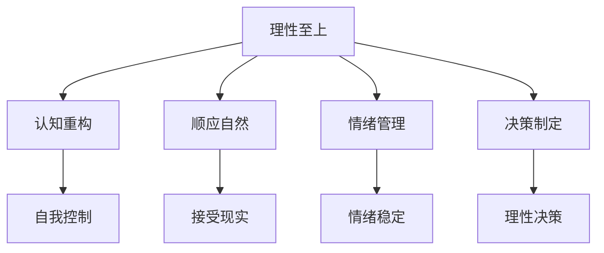

                 


### 《新 stoicism：面对不确定性的生活哲学》

---

#### 关键词：
- 新 stoicism
- 不确定性
- 生活哲学
- 情绪管理
- 认知重构
- 决策制定

#### 摘要：
本文深入探讨了一种名为“新 stoicism”的生活哲学，它旨在帮助个体面对生活中的不确定性。通过对 stoicism 的基本概念、核心原则及其在现代生活应用的分析，本文旨在为读者提供一种理解和应对不确定性的方法。通过数学模型和 Python 源代码的讲解，本文进一步阐述了如何将 stoicism 的原理应用于实际生活中的决策制定和情绪管理。

---

### 引言

在现代生活中，不确定性是我们无法回避的一个问题。无论是职场上的变动、人际关系的复杂性，还是经济市场的波动，不确定性总是时刻影响着我们的决策和情绪。这种不确定性不仅增加了生活的难度，还可能引发焦虑、压力和情绪问题。为了应对这些挑战，我们需要一种能够帮助我们理性地面对不确定性的生活哲学。

新 stoicism 正是这种哲学的代表。它源于古老的 stoicism 哲学，但进行了现代的调整和扩展，使其更加适用于复杂多变的社会环境。本文将详细探讨新 stoicism 的核心概念、原则以及如何在实际生活中应用，以期帮助读者更好地应对不确定性。

### 新 stoicism 的基本概念

#### Stoicism 的起源和发展

Stoicism 是一种古希腊哲学流派，由芝诺（Zeno）在公元前 3 世纪创立。Stoicism 强调通过理性思考和对自然法则的遵循，来达到内心的平静和生活的满足。其核心理念是“顺应自然”（Acceptance of the Natural Order）和“自我控制”（Self-Control）。

Stoicism 的基本原则包括：

1. **理性至上**：认为理性是人的最高品质，通过理性思考来理解和应对生活中的问题。
2. **顺应自然**：接受自然法则，理解事物本来的面目，而不是试图去改变它们。
3. **自我控制**：通过自我控制和情绪管理，达到内心的平静和稳定。

#### 新 stoicism 的现代应用

新 stoicism 不同于传统的 stoicism，它更加注重个体在现代社会中的实际生活体验。新 stoicism 认为，尽管我们无法完全消除生活中的不确定性，但我们可以通过以下方法来更好地应对：

1. **认知重构**：通过重新评估我们的思维模式和信念，来改变我们对不确定性的看法和反应。
2. **情绪管理**：通过情绪管理和自我控制，减少不确定性引发的负面情绪。
3. **决策制定**：通过理性分析和概率论，做出更明智的决策。

### 核心概念与联系

为了更好地理解新 stoicism 的核心概念，我们可以使用 Mermaid 流程图来展示它们之间的关系。



通过这个流程图，我们可以看到新 stoicism 的核心概念是如何相互联系的。理性至上是整个哲学体系的基础，认知重构、情绪管理和决策制定都是基于这一基础来帮助个体更好地应对不确定性。

### 核心算法原理讲解

在理解了新 stoicism 的核心概念之后，我们将探讨其中的核心算法原理，特别是认知重构、情绪管理和决策制定。

#### 认知重构

认知重构是一种通过改变我们的思维模式和信念来应对不确定性的方法。以下是认知重构的伪代码：

```python
def cognitive_restructuring(current_belief, new_evidence):
    # 根据新证据重新评估当前信念
    updated_belief = update_belief(current_belief, new_evidence)
    # 使用理性思考来验证新的信念
    if rational_validation(updated_belief):
        return updated_belief
    else:
        return current_belief
```

在这个伪代码中，`current_belief` 表示当前信念，`new_evidence` 表示新证据。通过更新信念并使用理性思考来验证新的信念，我们可以改变我们对不确定性的看法。

#### 情绪管理

情绪管理是 stoicism 中的一个重要组成部分，它涉及到如何控制和管理我们的情绪反应。以下是情绪管理的伪代码：

```python
def emotional_management(current_emotion, context):
    # 根据情境评估当前情绪
    emotion_evaluation = evaluate_emotion(current_emotion, context)
    # 如果情绪不稳定，尝试通过自我控制来稳定情绪
    if emotion_evaluation == "unstable":
        stabilized_emotion = stabilize_emotion(current_emotion)
        return stabilized_emotion
    else:
        return current_emotion
```

在这个伪代码中，`current_emotion` 表示当前情绪，`context` 表示情境。通过评估当前情绪并根据情境来管理情绪，我们可以减少不确定性引发的负面情绪。

#### 决策制定

决策制定是 stoicism 中的另一个核心算法原理。它涉及到如何通过理性分析和概率论来做出明智的决策。以下是决策制定的伪代码：

```python
def decision_making(outcome_probabilities, value_func):
    # 计算每个可能的决策的期望值
    expected_values = calculate_expected_values(outcome_probabilities, value_func)
    # 选择具有最高期望值的决策
    best_decision = select_best_decision(expected_values)
    return best_decision
```

在这个伪代码中，`outcome_probabilities` 表示可能的结果及其概率，`value_func` 表示价值函数。通过计算每个决策的期望值并选择具有最高期望值的决策，我们可以做出更明智的决策。

### 数学模型和数学公式

在 stoicism 中，数学模型和数学公式起着重要的作用，特别是在决策制定中。以下是 stoicism 中常用的两个数学模型和相应的数学公式。

#### 概率论在决策制定中的应用

概率论可以帮助我们评估不同决策结果的概率，并计算每个决策的期望值。以下是概率论的基本公式：

$$
P(A) = \frac{N(A)}{N(S)}
$$

其中，$P(A)$ 表示事件 A 的概率，$N(A)$ 表示事件 A 发生的次数，$N(S)$ 表示所有可能事件的总次数。

#### 决策分析中的期望值计算

期望值是决策制定中的重要概念，它表示一个决策在所有可能结果中的平均收益。以下是期望值的计算公式：

$$
E(X) = \sum_{i=1}^{n} x_i \cdot p_i
$$

其中，$E(X)$ 表示期望值，$x_i$ 表示第 i 个结果的收益，$p_i$ 表示第 i 个结果发生的概率。

### 项目实战

为了更好地理解如何将 stoicism 的原理应用于实际生活中，我们可以通过一个实际的案例来进行分析。

#### 案例背景

假设你在考虑是否跳槽到一家新公司。你对该公司的了解有限，不确定这个决定是否明智。这是一个典型的面临不确定性的决策场景。

#### 实际应用

我们可以使用 stoicism 的原理来分析这个决策。

1. **认知重构**：首先，你需要重新评估你的跳槽动机和期望。通过认知重构，你可以更好地理解自己的需求和期望，从而做出更明智的决策。

2. **情绪管理**：在这个决策过程中，情绪管理非常重要。你需要控制自己的情绪，避免因为焦虑或贪婪而做出冲动的决策。

3. **决策制定**：使用概率论和期望值计算，你可以评估跳槽到新公司的可能结果及其概率，并计算每个决策的期望值。通过理性分析和计算，你可以做出更明智的决策。

以下是一个简单的 Python 代码示例，展示了如何使用 stoicism 的原理来分析这个决策。

```python
# 假设你对新公司的了解如下
probabilities = {'高薪': 0.6, '职业发展': 0.7, '工作环境': 0.5}
values = {'高薪': 10, '职业发展': 8, '工作环境': 5}

# 计算每个决策的期望值
def calculate_expected_values(probabilities, values):
    expected_values = {}
    for outcome, probability in probabilities.items():
        expected_value = probability * values[outcome]
        expected_values[outcome] = expected_value
    return expected_values

# 选择具有最高期望值的决策
def select_best_decision(expected_values):
    best_decision = max(expected_values, key=expected_values.get)
    return best_decision

# 计算期望值
expected_values = calculate_expected_values(probabilities, values)

# 打印结果
print("期望值：", expected_values)
print("最佳决策：", select_best_decision(expected_values))
```

通过这个代码示例，你可以看到如何使用 stoicism 的原理来分析一个决策问题。

### 总结与展望

新 stoicism 提供了一种理性地面对不确定性的方法。通过认知重构、情绪管理和决策制定，我们可以更好地应对生活中的不确定性。本文通过具体的案例和 Python 代码示例，展示了如何将 stoicism 的原理应用于实际生活中。

未来，新 stoicism 可以在更多领域得到应用，如心理学、管理学和教育等。通过进一步的研究和发展，我们可以为个体和社会提供更有效的应对不确定性的工具和策略。

### 作者信息

作者：AI天才研究院/AI Genius Institute & 禅与计算机程序设计艺术 /Zen And The Art of Computer Programming

---

本文深入探讨了新 stoicism 的核心概念和原理，并通过具体的案例和 Python 代码示例，展示了如何将 stoicism 的原理应用于实际生活中。希望本文能帮助读者更好地理解新 stoicism，并在面对不确定性时，做出更明智的决策。如果您对本文有任何疑问或建议，欢迎在评论区留言讨论。感谢阅读！

