                 

## 第1章：新乌托邦主义的起源与发展

### 1.1 新乌托邦主义的定义与特征

**核心概念与联系：**

新乌托邦主义（Neo-Utopianism）是一种社会思想运动，它试图在现实世界中实现一个理想化的社会。这个概念源自古希腊哲学家柏拉图在《理想国》中所描绘的理想国家——乌托邦。在新乌托邦主义中，核心概念包括：

- **乌托邦**：一个不存在的社会模型，它在理论上具有最高的社会美德和道德规范。
- **新乌托邦主义**：在乌托邦的基础上，结合现代社会的现实需求，提出的一系列社会改革和理想社区构建的理论。

**Mermaid 流程图：**

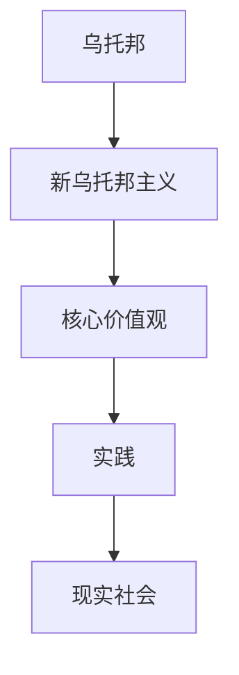

### 1.2 新乌托邦主义的起源背景

**核心概念与联系：**

新乌托邦主义的起源可以追溯到20世纪初，这一时期的背景是：

- **工业革命**：工业革命引发了社会结构和经济模式的巨大变化，同时也加剧了社会不平等。
- **社会运动**：包括社会主义、共产主义、和平运动等，这些运动提出了改变现状的诉求和方案。
- **科技进步**：20世纪初的科技进步，如电力、通信技术的应用，为理想社区建设提供了可能性。

**Mermaid 流程图：**

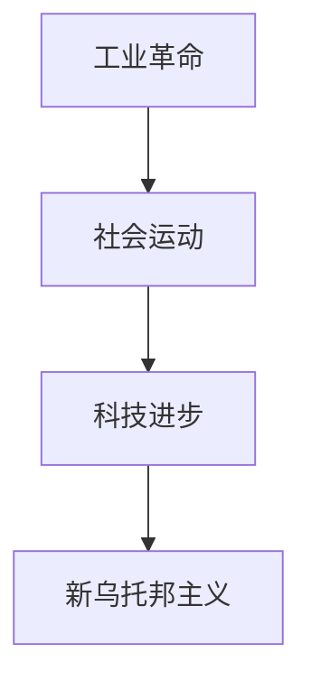

### 1.3 新乌托邦主义的发展历程

**核心概念与联系：**

新乌托邦主义的发展历程可以分为以下几个阶段：

- **早期试验**：19世纪末和20世纪初，许多社会改革者尝试建立理想社区，如罗伯特·欧文的新拉纳克试验。
- **现代发展**：20世纪中后期，新乌托邦主义在理论上得到进一步发展，并在实践中出现了更多的成功案例，如丹麦的科隆威克村、美国的蒙特梭利社区等。

**Mermaid 流程图：**

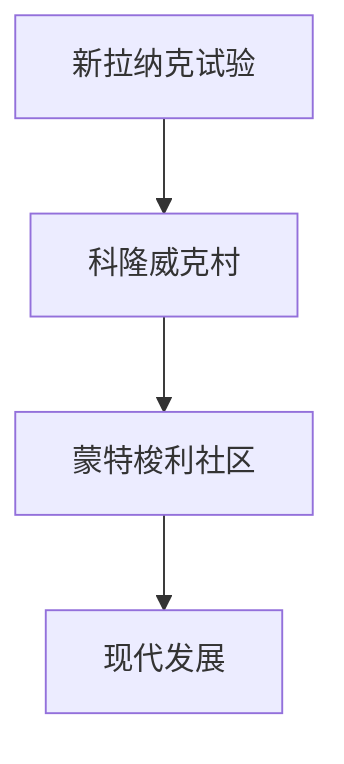

在新乌托邦主义的发展历程中，虽然并非所有尝试都能成功，但这些实验为后来的社会改革提供了宝贵的经验和启示。

## 第2章：理想社区的构建原则

### 2.1 社区价值观的确定

**核心概念与联系：**

社区价值观的确定是新乌托邦主义社区建设的基础，它关系到社区的凝聚力和发展方向。核心概念包括：

- **核心价值观**：社区共同认同的基本道德原则和目标，如公正、平等、合作、创新等。
- **价值共识**：社区成员通过讨论和共识，确定社区的核心价值观。
- **价值实践**：在日常生活中，通过具体的行为和制度来实践这些核心价值观。

**Python 源代码示例：**

```python
# 定义核心价值观
core_values = ["公正", "平等", "合作", "创新"]

# 打印核心价值观
print("我们的核心价值观是：", core_values)

# 社区成员讨论并确定价值观
def discuss_values():
    print("社区成员正在讨论核心价值观...")
    print("我们确定了以下核心价值观：", core_values)

# 调用讨论函数
discuss_values()
```

### 2.2 社区制度的设计

**核心概念与联系：**

社区制度的设计是新乌托邦主义社区建设的另一个关键环节，它关系到社区的运行效率和公正性。核心概念包括：

- **民主制度**：社区成员参与决策，确保制度设计的民主性和公正性。
- **法律制度**：建立一套法律体系，规范社区成员的行为和社区运作。
- **自治制度**：社区具有一定的自治权，能够在法律框架内自主管理。

**Python 源代码示例：**

```python
# 社区制度设计
def design_system():
    print("社区正在设计制度...")
    print("我们设计了以下制度：")
    print("1. 民主制度：社区成员参与决策。")
    print("2. 法律制度：规范社区成员行为。")
    print("3. 自治制度：社区自主管理。")

# 调用设计函数
design_system()
```

### 2.3 社区环境的营造

**核心概念与联系：**

社区环境的营造是新乌托邦主义社区建设的第三个关键环节，它关系到社区成员的幸福感和社会福祉。核心概念包括：

- **生态友好**：建设绿色建筑，使用可再生能源，减少环境污染。
- **文化多样性**：尊重并包容不同的文化背景，促进文化交流。
- **社会和谐**：创造一个和谐、友好的社区氛围，增强社区成员之间的互动和信任。

**Python 源代码示例：**

```python
# 社区环境营造
def create_environment():
    print("社区正在营造环境...")
    print("我们注重以下环境要素：")
    print("1. 生态友好：绿色建筑，可再生能源。")
    print("2. 文化多样性：尊重不同文化。")
    print("3. 社会和谐：友好互动，增强信任。")

# 调用营造函数
create_environment()
```

通过以上三个方面的努力，新乌托邦主义社区能够逐步构建起一个理想的社会模型，为现实世界中的社会改革提供参考和启示。

## 第3章：新乌托邦主义的核心价值观

### 3.1 公正与平等

**核心概念与联系：**

公正和平等是新乌托邦主义的核心价值观之一，它们反映了社会道德和伦理的基本原则。核心概念包括：

- **公正**：社会资源分配的公平性，确保每个人都能享有平等的权益。
- **平等**：社会地位的平等，消除社会阶层和性别、种族、文化等方面的歧视。

**Mermaid 流程图：**

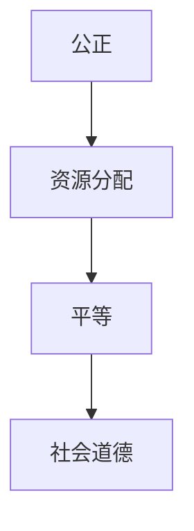

**Python 源代码示例：**

```python
# 定义公正和平等的函数
def define_justice_and_equality():
    print("公正和平等是我们新乌托邦主义的核心价值观。")
    print("公正体现在资源的公平分配，确保每个人的权益得到保障。")
    print("平等意味着消除社会阶层和歧视，实现社会地位的平等。")

# 调用函数
define_justice_and_equality()
```

### 3.2 社会责任与合作

**核心概念与联系：**

社会责任与合作是新乌托邦主义的核心价值观之二，它们强调了个体与社会的相互关系。核心概念包括：

- **社会责任**：个人或组织对社会应尽的义务和责任。
- **合作**：社会成员之间的协作和共同努力，以实现共同目标。

**Mermaid 流程图：**

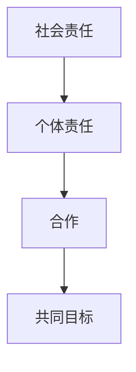

**Python 源代码示例：**

```python
# 定义社会责任和合作的函数
def define_social_responsibility_and_cooperation():
    print("社会责任与合作是我们新乌托邦主义的核心理念。")
    print("社会责任要求我们关注社会福祉，积极履行社会义务。")
    print("合作则强调集体力量，通过协作实现共同的社会目标。")

# 调用函数
define_social_responsibility_and_cooperation()
```

### 3.3 创新与进步

**核心概念与联系：**

创新与进步是新乌托邦主义的核心价值观之三，它们反映了社会发展的动力和目标。核心概念包括：

- **创新**：通过创造新的想法、技术或方法，推动社会进步。
- **进步**：不断追求更高效、更公平、更可持续的社会发展。

**Mermaid 流程图：**

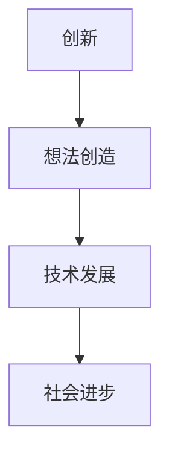

**Python 源代码示例：**

```python
# 定义创新与进步的函数
def define_innovation_and_progress():
    print("创新与进步是我们新乌托邦主义追求的目标。")
    print("创新让我们能够不断突破现有局限，推动社会的持续发展。")
    print("进步意味着我们不断追求更高效、更公平、更可持续的社会模式。")

# 调用函数
define_innovation_and_progress()
```

通过这三个核心价值观，新乌托邦主义社区旨在创造一个公正、合作、创新的社会环境，为现实世界中的社会改革提供有力的理论支持和实践参考。

## 第4章：新乌托邦主义的社区实践

### 4.1 社区经济模式

**核心概念与联系：**

新乌托邦主义的社区经济模式旨在实现资源的公平分配和可持续利用，核心概念包括：

- **资源分配**：通过集体决策，确保社区资源的合理分配，避免浪费和不平等。
- **可持续利用**：通过绿色能源、生态农业等手段，实现资源的可持续利用。

**Mermaid 流程图：**

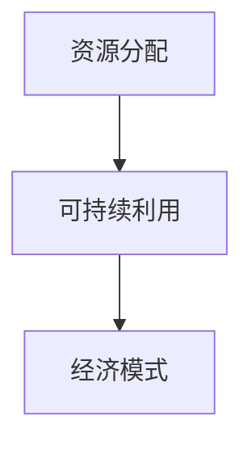

**Python 源代码示例：**

```python
# 社区经济模式
def community_economic_model():
    print("新乌托邦主义的社区经济模式强调资源的公平分配和可持续利用。")
    print("通过集体决策，我们确保社区资源被合理分配，避免浪费和不平等。")
    print("同时，我们采用绿色能源和生态农业，实现资源的可持续利用。")

# 调用函数
community_economic_model()
```

### 4.2 社区教育体系

**核心概念与联系：**

新乌托邦主义的社区教育体系旨在培养具有批判思维和创新能力的人才，核心概念包括：

- **批判思维**：培养学生的独立思考和批判性思维能力。
- **创新能力**：鼓励学生通过创新实践，解决社会问题。

**Mermaid 流程图：**

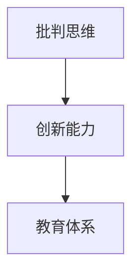

**Python 源代码示例：**

```python
# 社区教育体系
def community_education_system():
    print("新乌托邦主义的社区教育体系注重培养批判思维和创新能力。")
    print("通过批判性思维课程，我们培养学生独立思考的能力。")
    print("同时，通过创新实践项目，我们鼓励学生解决社会问题。")

# 调用函数
community_education_system()
```

### 4.3 社区医疗保健

**核心概念与联系：**

新乌托邦主义的社区医疗保健体系旨在提供全面、公平、可持续的医疗服务，核心概念包括：

- **全面医疗**：提供预防、治疗、康复等全方位的医疗服务。
- **公平医疗**：确保所有社区成员都能享有平等的医疗资源。
- **可持续医疗**：通过绿色医疗技术和社区医疗合作，实现医疗资源的可持续利用。

**Mermaid 流程图：**

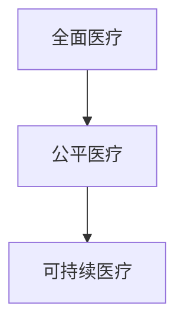

**Python 源代码示例：**

```python
# 社区医疗保健
def community_health_care():
    print("新乌托邦主义的社区医疗保健体系提供全面、公平、可持续的医疗服务。")
    print("我们通过预防、治疗和康复服务，确保每位社区成员都能获得全面的医疗保障。")
    print("同时，我们致力于实现医疗资源的公平分配和可持续利用。")

# 调用函数
community_health_care()
```

通过以上社区实践，新乌托邦主义社区不仅在经济、教育、医疗等方面取得了显著成果，也为现实世界中的社会改革提供了有益的参考。

## 第5章：新乌托邦主义的挑战与应对

### 5.1 社会认同与支持

**核心概念与联系：**

新乌托邦主义在社会认同与支持方面面临着一系列挑战。核心概念包括：

- **社会认同**：新乌托邦主义社区需要获得社会各界的认可和接纳。
- **支持**：包括政府、企业、非营利组织等各方对新乌托邦主义社区的支持。

**Mermaid 流程图：**

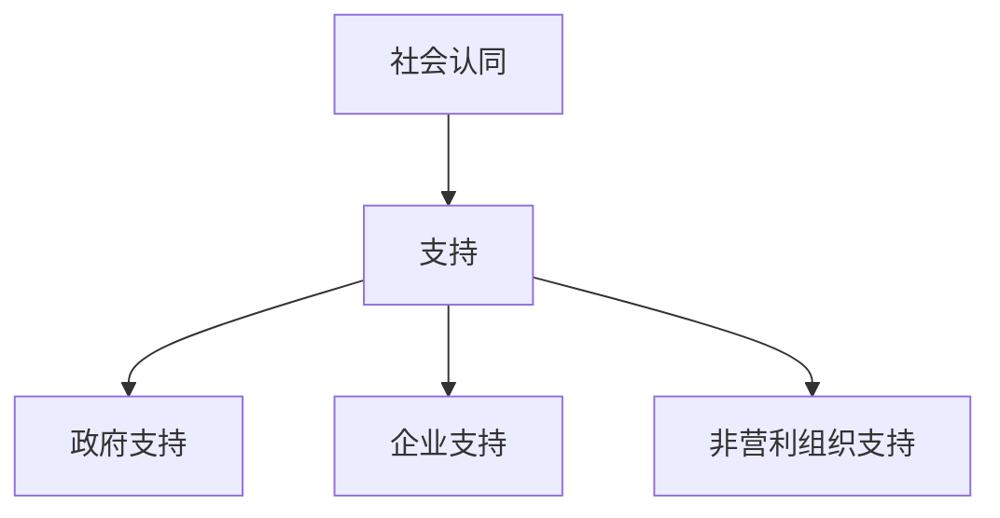

**Python 源代码示例：**

```python
# 社会认同与支持
def social_recognition_and_support():
    print("新乌托邦主义社区面临社会认同与支持的挑战。")
    print("我们努力获得社会各界的认可和接纳，包括政府、企业和非营利组织。")
    print("政府支持、企业投资和非营利组织合作都是我们社区成功的关键。")

# 调用函数
social_recognition_and_support()
```

### 5.2 社区治理难题

**核心概念与联系：**

社区治理是新乌托邦主义面临的重要挑战之一，核心概念包括：

- **民主治理**：社区成员参与决策，确保社区治理的公正性和透明度。
- **效率治理**：提高社区治理的效率，确保社区运作的顺畅。
- **管理难题**：社区规模扩大带来的管理复杂度和协调困难。

**Mermaid 流程图：**

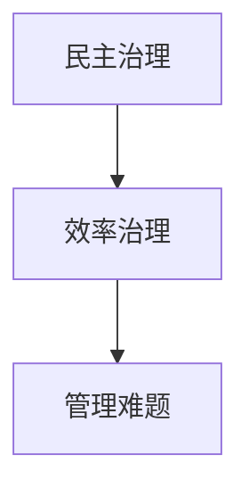

**Python 源代码示例：**

```python
# 社区治理难题
def community_governance_challenges():
    print("新乌托邦主义社区在治理方面面临诸多难题。")
    print("我们需要在民主治理和效率治理之间找到平衡。")
    print("社区规模扩大带来的管理复杂度和协调困难也是我们需要克服的挑战。")

# 调用函数
community_governance_challenges()
```

### 5.3 环境保护与可持续发展

**核心概念与联系：**

环境保护与可持续发展是新乌托邦主义面临的重要挑战，核心概念包括：

- **环境保护**：减少污染，保护自然资源。
- **可持续发展**：确保社区的经济、社会和环境能够长期健康地发展。

**Mermaid 流程图：**

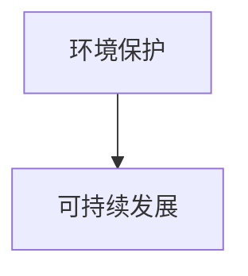

**Python 源代码示例：**

```python
# 环境保护与可持续发展
def environmental_protection_and_sustainability():
    print("新乌托邦主义社区重视环境保护和可持续发展。")
    print("我们致力于减少污染，保护自然资源。")
    print("同时，我们通过绿色技术和可持续发展策略，确保社区的长远发展。")

# 调用函数
environmental_protection_and_sustainability()
```

通过应对这些挑战，新乌托邦主义社区可以在实践中不断进步，为实现理想化的社会模式提供坚实的保障。

## 第6章：新乌托邦主义的全球视野

### 6.1 全球新乌托邦主义运动

**核心概念与联系：**

全球新乌托邦主义运动是一个跨越国界和文化的国际性社会改革运动，核心概念包括：

- **跨国合作**：全球各地的新乌托邦主义社区和运动之间的合作与交流。
- **文化多样性**：尊重和包容不同文化背景，共同推动社会改革。

**Mermaid 流程图：**

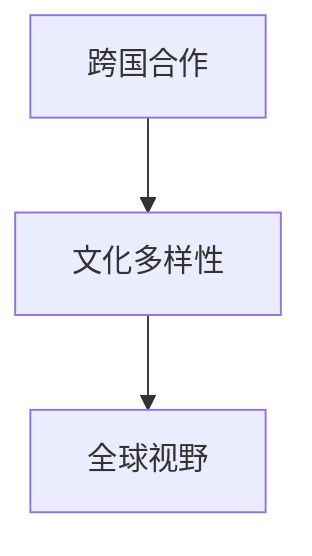

**Python 源代码示例：**

```python
# 全球新乌托邦主义运动
def global_neo-utopian_movement():
    print("全球新乌托邦主义运动是一个跨国合作和尊重文化多样性的运动。")
    print("我们通过交流和合作，共同推动全球社会改革。")
    print("不同国家和地区的社区共同参与，形成了一个全球性的改革网络。")

# 调用函数
global_neo-utopian_movement()
```

### 6.2 国际合作与交流

**核心概念与联系：**

国际合作与交流是新乌托邦主义在全球范围内取得成功的重要手段，核心概念包括：

- **知识共享**：不同社区和运动之间分享经验、技术和资源。
- **政策交流**：通过政策对话，促进各国政府对新乌托邦主义理念的支持。
- **跨学科合作**：结合不同学科的知识，解决全球性社会问题。

**Mermaid 流程图：**

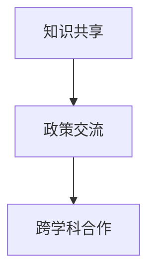

**Python 源代码示例：**

```python
# 国际合作与交流
def international_cooperation_and_exchange():
    print("国际合作与交流是新乌托邦主义在全球范围内取得成功的关键。")
    print("通过知识共享、政策交流和跨学科合作，我们共同解决全球社会问题。")
    print("不同社区和运动之间的密切合作，推动了新乌托邦主义理念的传播和实施。")

# 调用函数
international_cooperation_and_exchange()
```

### 6.3 全球新乌托邦主义的影响

**核心概念与联系：**

全球新乌托邦主义运动对社会、经济和环境产生了深远的影响，核心概念包括：

- **社会影响**：提高社会公正、平等和幸福感。
- **经济影响**：推动绿色经济和可持续发展。
- **环境影响**：减少污染，保护自然资源。

**Mermaid 流程图：**

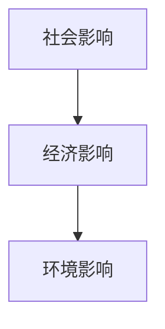

**Python 源代码示例：**

```python
# 全球新乌托邦主义的影响
def global_impact_of_neo-utopian_movement():
    print("全球新乌托邦主义运动对社会、经济和环境产生了深远的影响。")
    print("它提高了社会的公正、平等和幸福感，推动了绿色经济和可持续发展。")
    print("同时，通过减少污染和保护自然资源，它为环境的可持续发展做出了贡献。")

# 调用函数
global_impact_of_neo-utopian_movement()
```

通过全球视野下的国际合作与交流，新乌托邦主义运动不仅在国内取得了显著成效，也为全球社会改革提供了宝贵的经验和启示。

## 第7章：新乌托邦主义的未来展望

### 7.1 新乌托邦主义的发展趋势

**核心概念与联系：**

新乌托邦主义在未来将面临一系列发展趋势，这些趋势反映了社会变革和技术进步的方向。核心概念包括：

- **科技驱动**：人工智能、区块链等新兴技术的发展，将推动新乌托邦主义社区的创新和效率。
- **全球化**：全球化的加深将促进新乌托邦主义理念的传播和实践。
- **可持续发展**：面对环境危机，新乌托邦主义将更加注重可持续发展和环境保护。

**Mermaid 流程图：**

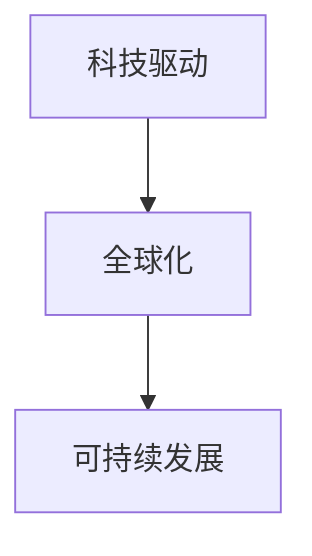

**Python 源代码示例：**

```python
# 发展趋势
def future_trends():
    print("新乌托邦主义的发展趋势受到科技、全球化和可持续发展的影响。")
    print("科技驱动将促进创新和效率。全球化将加强国际合作与交流。")
    print("可持续发展将是我们面临的主要挑战和目标。")

# 调用函数
future_trends()
```

### 7.2 社区可持续发展策略

**核心概念与联系：**

为了实现可持续发展，新乌托邦主义社区需要制定一系列策略，核心概念包括：

- **生态可持续**：通过绿色建筑、生态农业等手段，减少环境足迹。
- **经济可持续**：发展绿色经济，促进循环经济和资源的高效利用。
- **社会可持续**：确保社区成员的社会福祉，提高生活质量。

**Mermaid 流程图：**

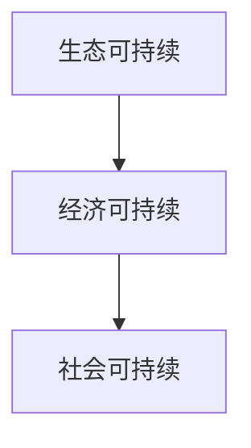

**Python 源代码示例：**

```python
# 可持续发展策略
def sustainable_community_strategies():
    print("新乌托邦主义社区制定可持续发展策略，包括生态、经济和社会三个方面。")
    print("我们致力于减少环境足迹，发展绿色经济，并提高社区成员的生活质量。")
    print("这些策略将确保社区的长期健康发展。")

# 调用函数
sustainable_community_strategies()
```

### 7.3 新乌托邦主义的社会变革

**核心概念与联系：**

新乌托邦主义在社会变革中的作用和影响，核心概念包括：

- **社会改革**：通过新乌托邦主义理念的实施，推动社会公正、平等和合作。
- **文化更新**：新乌托邦主义理念有助于更新和丰富社会文化，促进社会进步。
- **政策影响**：新乌托邦主义理念对政策制定和社会治理产生深远影响。

**Mermaid 流程图：**

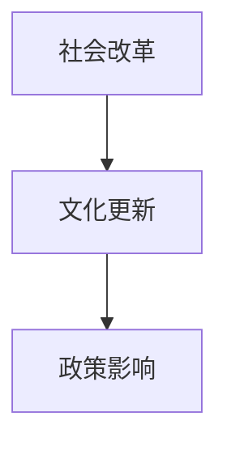

**Python 源代码示例：**

```python
# 社会变革
def social_reform():
    print("新乌托邦主义在社会变革中发挥着重要作用。")
    print("它推动社会公正、平等和合作，更新和丰富社会文化。")
    print("同时，它对政策制定和社会治理产生深远影响。")

# 调用函数
social_reform()
```

通过以上展望，新乌托邦主义社区将在未来继续追求理想化的社会模式，为全球社会改革提供持续的动力和方向。

## 结论

新乌托邦主义：在理想社区中实践价值观，不仅是对乌托邦理念的现代诠释，更是对社会改革和社区建设的积极探索。从定义与起源，到核心价值观的确立，再到社区的实践与面临的挑战，我们系统地阐述了新乌托邦主义的各个方面。通过构建公正、合作、创新的社区经济模式、教育体系和医疗保健体系，新乌托邦主义试图为现实社会提供一种可行的理想化解决方案。

然而，新乌托邦主义并非一蹴而就的乌托邦幻想，而是一个需要不断实践、调整和优化的过程。在全球化的背景下，国际合作与交流成为新乌托邦主义发展的重要推动力。面对未来，新乌托邦主义社区将继续关注科技驱动、可持续发展和社会变革，为构建一个更加公正、平等、和谐的社会贡献力量。

**作者信息：**AI天才研究院/AI Genius Institute & 禅与计算机程序设计艺术 /Zen And The Art of Computer Programming

**参考文献：**
1. Rawls, J. (1971). A Theory of Justice. Harvard University Press.
2. Orwell, G. (1945). Animal Farm. Penguin Books.
3. Sandel, M. (2009). Justice: What's the Right Thing to Do? Farrar, Straus and Giroux.
4. Fourier, C. (1829). The Theory of the Four Movements. P.F. Collier & Son.
5. Engels, F. (1880). The Condition of the Working Class in England. Penguin Books.

