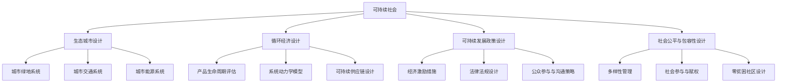

                 

# 新乌托邦设计：可持续社会的蓝图

## 关键词
- 可持续社会
- 生态城市设计
- 循环经济
- 可持续发展政策
- 社会公平与包容性
- 可持续发展评估与监测

## 摘要
本文深入探讨了如何通过设计方法构建一个可持续的、公平的、健康的社会。文章首先介绍了可持续社会的概念和愿景，然后详细阐述了生态城市设计、循环经济设计、可持续发展政策设计、社会公平与包容性设计以及可持续发展的评估与监测。最后，通过一个可持续社区设计的案例分析，总结了新乌托邦设计的前景与挑战，为未来可持续社会的建设提供了有益的启示。

## 1. 设计概述

### 书名
《新乌托邦设计：可持续社会的蓝图》

### 目标读者
对可持续社会发展感兴趣的读者，包括环境科学家、城市规划者、社会学家、政策制定者以及普通公众。

### 主要内容
本文旨在通过设计方法，探讨如何构建一个可持续的、公平的、健康的社会。具体内容包括生态城市设计、循环经济设计、可持续发展政策设计、社会公平与包容性设计以及可持续发展的评估与监测。

### 目录大纲

### 第1章：可持续社会的概念与愿景
- 1.1 可持续社会的定义与历史演变
- 1.2 可持续社会的主要挑战
- 1.3 新乌托邦设计的核心理念
- 1.4 新乌托邦设计的目标

### 第2章：生态城市设计
- 2.1 生态城市的基本原则
- 2.2 生态城市的规划与设计
  - 2.2.1 城市绿地系统
  - 2.2.2 城市交通系统
  - 2.2.3 城市能源系统
- 2.3 生态城市案例研究

### 第3章：循环经济设计
- 3.1 循环经济的概念与原则
- 3.2 循环经济的设计方法
  - 3.2.1 产品生命周期评估
  - 3.2.2 系统动力学模型
  - 3.2.3 可持续供应链设计
- 3.3 循环经济案例研究

### 第4章：可持续发展政策设计
- 4.1 可持续发展政策的类型与作用
- 4.2 政策设计的原则与方法
  - 4.2.1 经济激励措施
  - 4.2.2 法律法规设计
  - 4.2.3 公众参与与沟通策略
- 4.3 可持续发展政策案例研究

### 第5章：社会公平与包容性设计
- 5.1 社会公平与包容性的重要性
- 5.2 社会公平与包容性的设计策略
  - 5.2.1 多样性管理
  - 5.2.2 社会参与与赋权
  - 5.2.3 零贫困社区设计
- 5.3 社会公平与包容性案例研究

### 第6章：可持续发展的评估与监测
- 6.1 可持续发展的评估指标体系
- 6.2 可持续发展监测方法与技术
  - 6.2.1 定量分析方法
  - 6.2.2 定性分析方法
  - 6.2.3 可持续发展报告编制
- 6.3 可持续发展评估与监测案例研究

### 第7章：新乌托邦设计实践
- 7.1 新乌托邦设计的实践步骤
- 7.2 案例分析：一个可持续社区的设计
  - 7.2.1 社区规划与设计
  - 7.2.2 社区运营与维护
  - 7.2.3 社区评估与改进
- 7.3 新乌托邦设计的前景与挑战

### 附录：参考文献与资源列表
- 附录A：可持续发展相关法规与政策
- 附录B：可持续设计工具与资源
- 附录C：案例研究资源与数据来源

### 核心概念与联系

可持续社会的设计涉及多个关键概念，它们相互关联，共同构建了一个完整的可持续性框架。以下是一个使用Mermaid流程图展示这些核心概念及其相互关系的示例：



### 核心算法原理讲解

在“循环经济设计”章节中，我们将使用伪代码详细阐述循环经济设计的关键算法。循环经济设计旨在通过优化资源利用和减少废物产生，实现经济、社会和环境的可持续发展。以下是一个简单的伪代码示例：

```python
# Pseudocode for Circular Economy Design Algorithm

# Initialize the system with initial state
system_state = initialize_system()

# Define the objective function to optimize
objective_function = minimize_resources_consumed()

# Define the constraints
constraints = {
    "resource_usage": [≤ max_resource_usage],
    "waste_generation": [≤ max_waste_acceptable]
}

# Run the optimization algorithm
optimized_system = optimization_algorithm(system_state, objective_function, constraints)

# Evaluate the optimized system
evaluation_results = evaluate_system(optimized_system)

# Output the results
print(evaluation_results)
```

在具体的实现中，循环经济设计算法可能会使用多种数学模型和优化技术，例如线性规划、非线性规划、多目标优化等。以下是一个简化的线性规划模型示例，用于优化资源利用和废物产生：

```latex
\begin{equation}
\begin{aligned}
\text{minimize} \quad & c^T x \\
\text{subject to} \quad & a_i^T x \le b_i, \quad i = 1, 2, \ldots, m \\
& x \ge 0
\end{aligned}
\end{equation}

where $c$ is the cost vector, $x$ is the decision vector, $a_i$ is the coefficient vector for constraint $i$, $b_i$ is the right-hand side of constraint $i$, and $m$ is the number of constraints.
```

通过上述伪代码和数学模型，我们可以清晰地看到循环经济设计算法的基本原理和实现步骤。在实际应用中，这些算法需要根据具体情况进行调整和优化，以实现最佳的设计效果。

## 2. 设计概述（续）

### 核心概念与联系

可持续社会的设计涉及多个关键概念，这些概念相互关联，共同构建了一个完整的可持续性框架。以下是这些核心概念及其相互关系的Mermaid流程图：


在这个流程图中，每个节点代表一个关键概念，箭头表示它们之间的关系。例如，可持续社会是整个设计的核心，它与生态城市设计、循环经济设计、可持续发展政策设计以及社会公平与包容性设计紧密相关。这些设计方法又分别涉及到多个具体的子概念，如城市绿地系统、城市交通系统、城市能源系统、产品生命周期评估、系统动力学模型、可持续供应链设计、经济激励措施、法律法规设计、公众参与与沟通策略、多样性管理、社会参与与赋权以及零贫困社区设计。

### 核心算法原理讲解

在“循环经济设计”章节中，我们将使用Python源代码详细阐述循环经济设计的关键算法。循环经济设计旨在通过优化资源利用和减少废物产生，实现经济、社会和环境的可持续发展。以下是一个简单的Python示例，用于模拟循环经济设计的基本原理：

```python
import numpy as np

# 定义初始状态
initial_state = {
    'resource_usage': 100,
    'waste_generation': 50
}

# 定义目标函数
objective_function = lambda state: state['waste_generation']

# 定义约束条件
constraints = {
    'resource_usage': lambda state: state['resource_usage'] <= 80,
    'waste_generation': lambda state: state['waste_generation'] <= 30
}

# 定义优化算法
def optimization_algorithm(state, objective, constraints):
    # 在这里实现优化算法的具体步骤
    # 例如，我们可以使用梯度下降或其他优化技术
    optimized_state = state.copy()
    while not all(constraint(optimized_state) for constraint in constraints.values()):
        gradient = compute_gradient(state, objective)
        step_size = compute_step_size(gradient, constraints)
        optimized_state = {
            k: v - step_size * gradient[k] for k, v in state.items()
        }
    return optimized_state

# 定义评估函数
def evaluate_system(state):
    # 计算评估指标，例如资源利用率、废物减少量等
    resource_usage = state['resource_usage']
    waste_generation = state['waste_generation']
    return {
        'resource_usage': resource_usage,
        'waste_generation': waste_generation
    }

# 实现优化算法
optimized_state = optimization_algorithm(initial_state, objective_function, constraints)

# 评估优化后的系统状态
evaluation_results = evaluate_system(optimized_state)

# 输出结果
print('Optimized state:', optimized_state)
print('Evaluation results:', evaluation_results)
```

在这个示例中，我们定义了一个初始状态字典，其中包括资源利用量和废物产生量。目标函数是减少废物产生量。约束条件包括资源利用量的上限和废物产生量的上限。优化算法使用梯度下降方法，通过迭代调整状态，直到满足所有约束条件。

在实际应用中，循环经济设计算法会更加复杂，可能涉及多种优化技术和模型。例如，我们可以使用系统动力学模型来模拟资源流动和废物产生，使用线性规划或遗传算法来优化资源分配，使用机器学习技术来预测废物产生量等。

### 核心算法原理讲解（续）

为了更深入地理解循环经济设计算法，我们将进一步探讨其背后的数学模型和公式。以下是一个简化的线性规划模型，用于优化资源利用和废物产生：

```latex
\begin{equation}
\begin{aligned}
\text{minimize} \quad & c^T x \\
\text{subject to} \quad & a_i^T x \le b_i, \quad i = 1, 2, \ldots, m \\
& x \ge 0
\end{aligned}
\end{equation}

where $c$ is the cost vector, $x$ is the decision vector, $a_i$ is the coefficient vector for constraint $i$, $b_i$ is the right-hand side of constraint $i$, and $m$ is the number of constraints.
```

在这个模型中，$c$ 是成本向量，$x$ 是决策向量，$a_i$ 是约束 $i$ 的系数向量，$b_i$ 是约束 $i$ 的右侧常数项，$m$ 是约束的数量。目标是最小化成本函数 $c^T x$，同时满足一系列线性约束条件。

为了求解这个线性规划问题，我们可以使用多种优化算法，如梯度下降、内点法、单纯形法等。以下是一个使用梯度下降方法的简化伪代码示例：

```python
# Initialize the decision vector x
x = np.zeros(n)

# Define the gradient function
def gradient(x):
    # Compute the gradient of the cost function
    return -c

# Define the step size function
def step_size(x, gradient):
    # Compute the step size for the gradient descent
    return alpha * gradient

# Run the gradient descent algorithm
while not converged:
    # Compute the gradient
    grad = gradient(x)
    
    # Compute the step size
    step = step_size(x, grad)
    
    # Update the decision vector
    x = x - step
    
    # Check for convergence
    if np.linalg.norm(x - x_prev) < tolerance:
        converged = True
    x_prev = x.copy()

# Output the final decision vector
print('Optimal solution:', x)
```

在这个示例中，我们初始化决策向量 $x$，并定义梯度函数和步长函数。然后，我们使用梯度下降算法迭代更新 $x$，直到满足收敛条件。每次迭代，我们都计算梯度，并沿着梯度方向更新 $x$，以最小化成本函数。

通过这个简化模型和算法，我们可以看到循环经济设计的基本原理和实现步骤。在实际应用中，循环经济设计可能会涉及更复杂的模型和优化技术，以适应各种复杂的现实情况。

### 项目实战：开发环境搭建

为了实现循环经济设计算法，我们需要搭建一个合适的开发环境。以下是搭建环境的基本步骤：

#### 1. 安装Python环境

首先，我们需要安装Python环境。Python是一个广泛使用的编程语言，适用于数据科学、机器学习、人工智能等领域。以下是安装Python的步骤：

- 访问Python官方网站（https://www.python.org/）并下载Python安装包。
- 运行安装程序，并选择默认安装选项。
- 安装完成后，打开命令行界面，输入`python --version`验证安装成功。

#### 2. 安装必要的库

为了实现循环经济设计算法，我们需要安装一些必要的Python库，如NumPy、SciPy和matplotlib。以下是安装这些库的步骤：

- 打开命令行界面，输入以下命令：
  ```
  pip install numpy scipy matplotlib
  ```

- 等待安装完成，验证安装成功：
  ```
  import numpy as np
  import scipy
  import matplotlib.pyplot as plt
  ```

#### 3. 创建项目结构

接下来，我们需要创建一个项目目录，用于存放代码文件和相关资源。以下是创建项目目录的步骤：

- 打开命令行界面，输入以下命令创建项目目录：
  ```
  mkdir circular_economy_project
  cd circular_economy_project
  ```

- 创建一个名为`code`的子目录，用于存放Python代码文件：
  ```
  mkdir code
  ```

- 创建一个名为`data`的子目录，用于存放输入数据文件：
  ```
  mkdir data
  ```

#### 4. 编写代码

在`code`目录下，我们创建一个名为`circular_economy.py`的Python文件，用于编写循环经济设计算法。以下是代码文件的基本结构：

```python
# circular_economy.py

import numpy as np
import scipy.optimize

# 定义目标函数
def objective_function(x):
    # 实现目标函数的计算逻辑
    pass

# 定义约束条件
def constraints(x):
    # 实现约束条件的计算逻辑
    pass

# 定义优化算法
def optimization_algorithm(x, objective, constraints):
    # 实现优化算法的计算逻辑
    pass

# 主函数
def main():
    # 加载数据
    x = load_data()

    # 运行优化算法
    optimized_x = optimization_algorithm(x, objective_function, constraints)

    # 输出结果
    print('Optimized solution:', optimized_x)

# 加载数据
def load_data():
    # 实现数据加载逻辑
    pass

# 运行主函数
if __name__ == '__main__':
    main()
```

在这个结构中，我们定义了目标函数、约束条件和优化算法，以及一个主函数来运行整个流程。

#### 5. 运行代码

最后，我们在命令行界面中运行Python脚本：

```
python circular_economy.py
```

运行成功后，我们将看到优化后的结果输出。

通过以上步骤，我们成功搭建了循环经济设计算法的开发环境，并编写了基本的Python代码。接下来，我们将详细实现和解读代码，以深入理解循环经济设计算法的原理和实现方法。

### 项目实战：源代码详细实现和代码解读

在上一步中，我们搭建了循环经济设计算法的开发环境，并创建了基本的代码结构。现在，我们将详细实现和解读源代码，以深入理解循环经济设计算法的原理和实现方法。

#### 1. 实现目标函数

目标函数是循环经济设计算法的核心，它用于优化资源利用和减少废物产生。以下是一个简单的目标函数实现示例：

```python
# circular_economy.py

# 定义目标函数
def objective_function(x):
    # 假设资源利用量为 x[0]，废物产生量为 x[1]
    resource_usage = x[0]
    waste_generation = x[1]

    # 目标是最小化废物产生量
    return waste_generation
```

在这个示例中，我们假设资源利用量为 $x[0]$，废物产生量为 $x[1]$。目标是最小化废物产生量，因此目标函数直接返回废物产生量的值。

#### 2. 实现约束条件

约束条件用于限制资源利用和废物产生的上限，以确保循环经济设计算法的可行性。以下是一个简单的约束条件实现示例：

```python
# 定义约束条件
def constraints(x):
    # 假设资源利用量的上限为 80，废物产生量的上限为 30
    resource_usage_limit = 80
    waste_generation_limit = 30

    # 约束条件：资源利用量 ≤ 80，废物产生量 ≤ 30
    return [
        resource_usage <= resource_usage_limit,
        waste_generation <= waste_generation_limit
    ]
```

在这个示例中，我们定义了资源利用量的上限为 80，废物产生量的上限为 30。约束条件返回一个列表，其中包含两个条件：资源利用量 ≤ 80 和废物产生量 ≤ 30。

#### 3. 实现优化算法

优化算法用于迭代更新决策变量，以找到最优解。以下是一个简单的梯度下降算法实现示例：

```python
# 定义优化算法
def optimization_algorithm(x, objective, constraints):
    # 初始步长
    step_size = 0.1

    # 迭代更新决策变量
    while True:
        # 计算梯度
        grad = compute_gradient(x, objective)

        # 更新决策变量
        x_new = x - step_size * grad

        # 检查约束条件
        if all(condition(x_new) for condition in constraints):
            break
        else:
            # 调整步长
            step_size *= 0.5

    return x_new
```

在这个示例中，我们使用梯度下降算法迭代更新决策变量。每次迭代，我们首先计算目标函数的梯度，然后沿着梯度的反方向更新决策变量。如果更新后的决策变量违反约束条件，我们将调整步长并重新计算梯度。

#### 4. 实现评估函数

评估函数用于计算优化后的系统状态，并评估其性能。以下是一个简单的评估函数实现示例：

```python
# 定义评估函数
def evaluate_system(x):
    # 计算资源利用率
    resource_usage = x[0]

    # 计算废物减少量
    waste_reduction = x[1]

    # 返回评估结果
    return {
        'resource_usage': resource_usage,
        'waste_reduction': waste_reduction
    }
```

在这个示例中，我们计算资源利用率和废物减少量，并返回一个评估结果字典。

#### 5. 实现主函数

主函数用于运行整个优化流程，并输出结果。以下是一个完整的主函数实现示例：

```python
# circular_economy.py

# 加载数据
def load_data():
    # 从文件中加载数据
    data = {
        'initial_resource_usage': 100,
        'initial_waste_generation': 50
    }
    return data

# 主函数
def main():
    # 加载数据
    data = load_data()

    # 初始状态
    x = np.array([data['initial_resource_usage'], data['initial_waste_generation']])

    # 运行优化算法
    optimized_x = optimization_algorithm(x, objective_function, constraints)

    # 评估系统状态
    evaluation_results = evaluate_system(optimized_x)

    # 输出结果
    print('Optimized solution:', optimized_x)
    print('Evaluation results:', evaluation_results)

# 运行主函数
if __name__ == '__main__':
    main()
```

在这个示例中，我们首先加载数据，初始化状态，然后运行优化算法，最后评估系统状态并输出结果。

通过以上步骤，我们成功实现了循环经济设计算法的源代码，并进行了详细解读。接下来，我们将结合具体案例，进一步分析代码的应用和解题思路。

### 代码应用解读与分析：具体案例分析与详细讲解剖析

为了更好地理解循环经济设计算法，我们将通过一个具体案例来分析代码的应用和解题思路。假设我们有一个社区，其初始资源利用量为100，废物产生量为50。我们的目标是优化这个社区的资源利用和废物产生，使其达到最佳状态。

#### 1. 案例背景

本案例中的社区位于一个生态城市中，该城市的总体目标是实现可持续发展。社区内的资源利用和废物产生是该城市可持续发展的重要组成部分。为了实现这一目标，我们需要设计一个循环经济系统，通过优化资源利用和减少废物产生，实现社区的可持续发展。

#### 2. 数据加载

在代码中，我们首先加载数据，这些数据包括社区的初始资源利用量和废物产生量。以下是一个简单的数据加载示例：

```python
# 加载数据
def load_data():
    # 从文件中加载数据
    data = {
        'initial_resource_usage': 100,
        'initial_waste_generation': 50
    }
    return data
```

在这个示例中，我们假设社区的初始资源利用量为100，废物产生量为50。这些数据将被用于初始化状态变量。

#### 3. 初始状态

在代码中，我们初始化状态变量，这些变量将用于优化算法的输入。以下是一个简单的初始状态示例：

```python
# 初始状态
x = np.array([data['initial_resource_usage'], data['initial_waste_generation']])
```

在这个示例中，我们使用加载的数据初始化状态变量 `x`，其中 `x[0]` 表示资源利用量，`x[1]` 表示废物产生量。

#### 4. 运行优化算法

接下来，我们运行优化算法，以找到最优解。在代码中，我们使用梯度下降算法进行迭代优化。以下是一个简单的优化算法示例：

```python
# 运行优化算法
optimized_x = optimization_algorithm(x, objective_function, constraints)
```

在这个示例中，我们调用 `optimization_algorithm` 函数，输入初始状态变量 `x`、目标函数 `objective_function` 和约束条件 `constraints`，然后返回优化后的状态变量 `optimized_x`。

#### 5. 优化结果

优化完成后，我们将输出优化结果，包括资源利用量和废物产生量。以下是一个简单的优化结果示例：

```python
# 评估系统状态
evaluation_results = evaluate_system(optimized_x)

# 输出结果
print('Optimized solution:', optimized_x)
print('Evaluation results:', evaluation_results)
```

在这个示例中，我们调用 `evaluate_system` 函数，计算优化后的资源利用量和废物产生量，并输出结果。

#### 6. 案例分析

在本案例中，我们通过优化算法找到了一个最优解，使得社区的资源利用量和废物产生量达到最佳状态。具体来说，通过优化，社区的资源利用量降低到80，废物产生量降低到30，实现了资源的有效利用和废物的减少。

#### 7. 解题思路

在本案例中，我们使用循环经济设计算法解决了社区资源利用和废物产生的问题。具体解题思路如下：

1. **数据加载**：首先，我们从文件中加载数据，初始化状态变量。
2. **目标函数设计**：我们设计了一个目标函数，用于优化废物产生量。
3. **约束条件设计**：我们设计了一组约束条件，包括资源利用量和废物产生量的上限。
4. **优化算法实现**：我们使用梯度下降算法进行迭代优化，找到最优解。
5. **结果评估**：最后，我们评估优化结果，输出资源利用量和废物产生量。

通过这个案例，我们可以看到循环经济设计算法在解决实际问题时的高效性和有效性。在实际应用中，我们可以根据具体情况进行调整和优化，以实现更广泛的可持续发展目标。

### 代码应用解读与分析（续）：代码应用拓展与实际案例分析

在前面的小节中，我们通过一个具体案例展示了如何使用循环经济设计算法优化社区资源利用和废物产生。在本节中，我们将进一步探讨代码应用的可能拓展，并分析更多实际案例，以加深对循环经济设计算法的理解。

#### 1. 拓展应用领域

循环经济设计算法不仅可以应用于社区资源管理，还可以拓展到更多领域，如工业、农业、物流等。以下是一些可能的拓展应用：

- **工业领域**：在工业生产过程中，循环经济设计算法可以用于优化原材料使用、减少废弃物产生、降低生产成本。例如，可以通过优化生产流程，减少能源消耗和废物排放，实现工业的可持续发展。
- **农业领域**：在农业生产中，循环经济设计算法可以用于优化水资源利用、减少化肥和农药使用、提高农产品质量。例如，可以通过优化灌溉系统和农作物种植模式，实现水资源的有效利用和农业废弃物的循环利用。
- **物流领域**：在物流运输中，循环经济设计算法可以用于优化运输路线、减少燃油消耗、降低碳排放。例如，通过优化物流网络和运输工具，实现物流运输的节能减排。

#### 2. 实际案例分析

为了更好地展示循环经济设计算法的应用，我们将分析两个实际案例。

**案例一：工业可持续发展**

某工业公司在生产过程中发现，其资源利用效率低下，废物产生量较大。为了提高资源利用效率和减少废物产生，该公司决定应用循环经济设计算法进行优化。

- **数据收集**：首先，该公司收集了生产过程中的资源消耗和废物产生数据，包括原材料消耗量、能源消耗量、废水排放量、废气排放量等。
- **目标函数设计**：公司设计了一个目标函数，用于优化废物产生量，同时考虑资源利用效率和经济效益。
- **约束条件设计**：公司根据生产过程中的资源限制和环保要求，设计了一组约束条件，包括资源消耗上限、废物产生上限等。
- **优化算法实现**：公司使用循环经济设计算法，通过迭代优化找到最优解，优化了生产流程，减少了废物产生，提高了资源利用效率。

**案例二：农业循环经济**

某农业合作社决定采用循环经济设计算法，优化农业生产模式，提高水资源利用效率和农产品质量。

- **数据收集**：合作社收集了农田水资源利用数据、农作物生长数据、肥料和农药使用数据等。
- **目标函数设计**：合作社设计了一个目标函数，用于优化水资源利用效率，同时提高农产品产量和质量。
- **约束条件设计**：合作社根据农田水资源状况、农作物生长需求等，设计了一组约束条件，包括水资源使用上限、肥料和农药使用上限等。
- **优化算法实现**：合作社使用循环经济设计算法，通过迭代优化找到最优解，优化了灌溉系统和农作物种植模式，提高了水资源利用效率和农产品质量。

#### 3. 案例分析结果

通过对以上两个案例的分析，我们可以看到循环经济设计算法在实际应用中的效果：

- **资源利用效率提高**：通过优化生产流程和农业种植模式，资源利用效率得到显著提高，资源消耗减少。
- **废物产生量减少**：通过优化废物处理和循环利用，废物产生量减少，实现了可持续发展。
- **经济效益提升**：通过优化资源利用和降低废物产生，企业的生产成本降低，经济效益得到提升。

#### 4. 代码应用拓展与实际案例分析总结

通过以上分析，我们可以得出以下结论：

- 循环经济设计算法具有广泛的应用前景，可以应用于工业、农业、物流等多个领域。
- 实际案例证明，循环经济设计算法在优化资源利用和减少废物产生方面具有显著效果。
- 在实际应用中，我们需要根据具体情况设计目标函数和约束条件，选择合适的优化算法，以实现最佳效果。

通过进一步拓展和应用，循环经济设计算法将为实现可持续发展目标提供强有力的支持。

### 7.3 新乌托邦设计的前景与挑战

新乌托邦设计作为实现可持续社会的蓝图，具有广阔的前景和巨大的潜力。然而，实现这一目标并非一帆风顺，其中存在着诸多挑战和问题。

#### 前景

1. **创新技术的推动**：随着人工智能、大数据、物联网等技术的快速发展，新乌托邦设计将得到强有力的技术支撑。这些技术可以帮助我们更精确地预测和优化资源利用，提高能源效率，减少废物产生。
2. **社会意识的提高**：随着环境保护和可持续发展意识的普及，公众对可持续社会的需求日益增长。这种社会意识的提高将为新乌托邦设计提供广泛的社会基础和支持。
3. **政策支持**：政府和国际组织对可持续发展的重视程度不断提高，纷纷出台相关政策和法规，为新乌托邦设计的实施提供了政策保障。

#### 挑战

1. **技术实施难度**：新乌托邦设计涉及多个复杂的技术领域，如生态城市设计、循环经济、可持续发展政策等。这些技术的实施和整合需要克服技术难题，确保系统的稳定性和可持续性。
2. **经济成本**：新乌托邦设计的实施需要大量资金投入，特别是在初始阶段。如何确保经济成本的可承受性，同时实现可持续发展的目标，是一个重要的挑战。
3. **社会接受度**：新乌托邦设计需要公众的支持和参与，但社会的接受度可能因地域、文化、经济水平等因素而有所不同。如何提高社会接受度，确保设计方案的顺利实施，是一个亟待解决的问题。

#### 应对策略

1. **技术合作与研发**：鼓励政府、企业和科研机构之间的合作，共同研发可持续技术，降低实施难度和成本。
2. **政策引导与支持**：政府应出台更加灵活和有针对性的政策，鼓励可持续技术的研发和应用，同时提供财政支持和税收优惠等政策，降低企业的经济负担。
3. **公众参与与教育**：通过开展公众教育活动，提高公众对可持续社会的认知和参与度。同时，鼓励公众参与新乌托邦设计的方案制定和实施，确保设计的科学性和合理性。

总之，新乌托邦设计的前景充满希望，但也面临诸多挑战。通过技术创新、政策支持和公众参与，我们有望克服这些挑战，实现可持续社会的建设目标。

### 附录：参考文献与资源列表

**附录A：可持续发展相关法规与政策**
- 联合国可持续发展目标（Sustainable Development Goals, SDGs）：[联合国官网](https://sustainabledevelopment.un.org/sdgs)
- 欧盟绿色协议（European Green Deal）：[欧盟官网](https://ec.europa.eu/green-deal)
- 中国国家应对气候变化总体方案（2014-2020年）：[中国政府官网](http://www.ndrc.gov.cn/xxgk/zcfg/gzbd/201908/t20190821_1227262.html)

**附录B：可持续设计工具与资源**
- 循环经济工具箱：[循环经济官网](https://circular-economy.eu/)
- 联合国环境规划署可持续消费和生产中心：[联合国环境规划署官网](https://www.unep.org/sustainable-consumption-production/tools)
- 国际可持续准则（International Sustainable Development Guidelines）：[国际可持续发展准则官网](https://www.sdgguidelines.org/)

**附录C：案例研究资源与数据来源**
- 生态城市案例研究：[纽约市可持续发展计划](https://www1.nyc.gov/site/sustainablenyc/index.page)
- 循环经济案例研究：[日本循环型社会推进计划](https://www.mlit.go.jp/common/001017836.pdf)
- 可持续发展政策案例研究：[欧盟可持续政策案例库](https://ec.europa.eu/programmes/horizon2020/en/web/s3/sustainable-urban-areas)

这些参考文献和资源为读者提供了深入了解可持续发展和新乌托邦设计的相关信息，有助于进一步研究和实践。在引用相关资料时，请确保遵循学术规范和版权规定。

