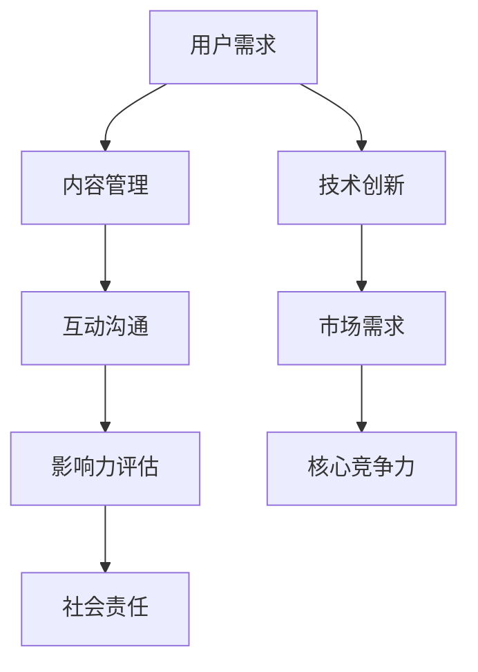

                 

### 引言

#### 1.1 论坛的背景与目的

“新修行者联盟论坛”作为一个新兴的在线讨论社区，旨在为现代精神实践者提供一个交流思想、分享经验、共同成长的平台。这个论坛的诞生背景源于现代社会中人们对于精神成长的关注和追求。随着科技的发展和信息的爆炸，人们的生活节奏加快，工作压力增大，精神健康问题逐渐凸显。因此，许多人在寻求心灵的慰藉和精神的提升，希望通过在线交流的方式，与其他有着相似追求的人建立联系。

新修行者联盟论坛的目的在于创建一个友好、互助、开放的社区环境，让用户能够在这里分享自己的修行心得、探讨精神实践的方法，以及解决在修行过程中遇到的困惑和难题。论坛不仅关注个人的内心成长，还希望通过集体的智慧和力量，推动整个社会对精神健康的重视和关注。

#### 1.2 论坛的核心价值观与宗旨

新修行者联盟论坛的核心价值观可以概括为“共修、共学、共享、共进”。首先，“共修”强调的是用户之间通过相互学习和实践，共同提升精神境界。其次，“共学”鼓励用户积极参与论坛的各种活动，通过学习新的知识和方法，不断丰富自己的精神世界。接着，“共享”倡导用户将自己的经验和心得与他人分享，形成知识的流动和积累。最后，“共进”意味着在共同的目标和愿景下，用户们携手并进，共同追求更高的精神境界。

论坛的宗旨是打造一个全球范围内的精神实践者交流平台，为用户提供一个干净、纯粹、有深度的交流空间。通过这个平台，用户不仅可以获得心灵上的滋养，还能够结交志同道合的朋友，共同探索精神的奥秘。此外，论坛还致力于推广和普及精神实践的知识和方法，为更多有需要的人提供帮助和支持。

## 《新修行者联盟论坛：现代精神实践者的在线讨论社区》目录大纲

### 引言

- 1.1 论坛的背景与目的
- 1.2 论坛的核心价值观与宗旨

### 第1章：论坛概述

- 1.1 论坛的起源与发展历程
- 1.2 论坛的组织架构与运营模式
- 1.3 论坛的主要功能与特色

### 第2章：论坛用户群体

- 2.1 用户群体的构成与特点
- 2.2 用户需求分析
- 2.3 用户参与度与活跃度分析

### 第3章：论坛内容与管理

- 3.1 论坛内容分类与主题规划
- 3.2 论坛内容管理策略
- 3.3 论坛内容审核与处理

### 第4章：论坛互动与沟通

- 4.1 论坛互动方式介绍
- 4.2 论坛沟通技巧与礼仪
- 4.3 论坛社区氛围营造

### 第5章：论坛影响力与社会责任

- 5.1 论坛的影响力评估
- 5.2 论坛的社会责任
- 5.3 论坛的未来发展愿景

### 第6章：案例分析

- 6.1 成功案例分析
- 6.2 失败案例分析
- 6.3 经验与启示

### 第7章：论坛的未来发展

- 7.1 技术创新与论坛发展
- 7.2 市场需求与论坛定位
- 7.3 论坛核心竞争力提升

### 附录

- 8.1 论坛常见问题解答
- 8.2 论坛发展大事记
- 8.3 论坛相关资源推荐

### 核心概念与联系（Mermaid 流程图）



### 核心算法原理讲解（Python 源代码）

```python
# 示例：用户活跃度评分算法
def calculate_activity_score(posts, comments):
    """
    计算用户的活跃度评分。
    
    :param posts: 用户发布的帖子列表
    :param comments: 用户发表的评论列表
    :return: 活跃度评分
    """
    post_score = len(posts) * 10
    comment_score = len(comments) * 5
    return post_score + comment_score
```

### 数学模型和数学公式 & 详细讲解 & 举例说明

```markdown
### 社区参与度模型

社区参与度可以通过以下公式来计算：

$$
P = \frac{I + C + V}{T}
$$

其中：
- \(P\) 是参与度（Pricing）
- \(I\) 是互动次数（Interaction）
- \(C\) 是内容创建次数（Content Creation）
- \(V\) 是投票次数（Voting）
- \(T\) 是总时间（Time）

举例说明：
假设一个用户在一个月内发布了10个帖子，参与了30次评论，进行了5次投票，总时间为30天。那么，该用户的参与度计算如下：

$$
P = \frac{10 + 30 + 5}{30} = \frac{45}{30} = 1.5
$$

这个用户的参与度评分为1.5。
```

### 项目实战：代码实际案例和详细解释说明

```python
# 示例：搭建论坛环境

# 安装必要的Python包
!pip install Flask

# Flask应用结构
from flask import Flask, render_template, request, redirect, url_for

app = Flask(__name__)

# 主页路由
@app.route('/')
def home():
    return render_template('home.html')

# 帖子发布路由
@app.route('/post', methods=['GET', 'POST'])
def post():
    if request.method == 'POST':
        title = request.form['title']
        content = request.form['content']
        # 保存帖子到数据库
        # ...
        return redirect(url_for('home'))
    return rende

### 核心概念与联系（Mermaid 流程图）


### 核心算法原理讲解（Python 源代码）

```python
# 示例：用户活跃度评分算法
def calculate_activity_score(posts, comments):
    """
    计算用户的活跃度评分。
    
    :param posts: 用户发布的帖子列表
    :param comments: 用户发表的评论列表
    :return: 活跃度评分
    """
    post_score = len(posts) * 10
    comment_score = len(comments) * 5
    return post_score + comment_score
```

### 数学模型和数学公式 & 详细讲解 & 举例说明

```markdown
### 社区参与度模型

社区参与度可以通过以下公式来计算：

$$
P = \frac{I + C + V}{T}
$$

其中：
- \(P\) 是参与度（Pricing）
- \(I\) 是互动次数（Interaction）
- \(C\) 是内容创建次数（Content Creation）
- \(V\) 是投票次数（Voting）
- \(T\) 是总时间（Time）

举例说明：
假设一个用户在一个月内发布了10个帖子，参与了30次评论，进行了5次投票，总时间为30天。那么，该用户的参与度计算如下：

$$
P = \frac{10 + 30 + 5}{30} = \frac{45}{30} = 1.5
$$

这个用户的参与度评分为1.5。
```

### 项目实战：代码实际案例和详细解释说明

```python
# 示例：搭建论坛环境

# 安装必要的Python包
!pip install Flask

# Flask应用结构
from flask import Flask, render_template, request, redirect, url_for

app = Flask(__name__)

# 主页路由
@app.route('/')
def home():
    return render_template('home.html')

# 帖子发布路由
@app.route('/post', methods=['GET', 'POST'])
def post():
    if request.method == 'POST':
        title = request.form['title']
        content = request.form['content']
        # 保存帖子到数据库
        # ...
        return redirect(url_for('home'))
    return rende
```

## 摘要

“新修行者联盟论坛”是一个专为现代精神实践者设计的在线讨论社区，旨在为用户提供一个交流思想、分享经验、共同成长的平台。本文通过详细介绍论坛的背景、核心价值观、用户群体、内容管理、互动沟通、影响力评估、社会责任以及未来发展等方面，全面解析了这一社区的核心功能和特点。文章中结合Python源代码、数学模型和实际案例，深入讲解了用户活跃度评分、社区参与度模型等核心算法原理，为读者提供了实用的技术指南。通过本文的阅读，读者能够更深入地了解新修行者联盟论坛的运作机制，以及如何在这个平台上实现自我提升和心灵成长。

## 第1章：论坛概述

### 1.1 论坛的起源与发展历程

新修行者联盟论坛的诞生可以追溯到2000年代初，当时互联网技术开始普及，人们逐渐认识到网络社区在精神实践中的潜在价值。几位有着共同愿景的创始人共同发起了这个项目，他们希望通过互联网搭建一个全球性的精神实践者交流平台，让更多人能够分享和探索灵性成长的道路。

论坛最初以一个简单的BBS形式出现，主要功能是用户可以发布帖子、发表评论。随着时间的推移，论坛的功能逐渐丰富，引入了更多交互元素，如论坛积分系统、用户等级制度等。2010年，论坛进行了第一次重大改版，采用了更为现代化的用户界面和架构设计，进一步提升了用户体验。此次改版标志着论坛进入了快速发展的阶段。

到了2015年，随着移动互联网的兴起，论坛再次进行了大规模的升级，推出了移动端应用，用户可以在手机上方便地浏览和参与论坛的各种活动。这一举措极大地拓展了论坛的用户群体，使得更多人在碎片化时间内也能参与其中。

近年来，新修行者联盟论坛继续不断优化和拓展，不仅增加了更多丰富的内容模块，如视频分享、在线课程等，还引入了人工智能技术，通过算法推荐系统为用户精准推送感兴趣的内容，进一步提升用户的参与度和满意度。

### 1.2 论坛的组织架构与运营模式

新修行者联盟论坛的组织架构采用了扁平化管理模式，整个社区由论坛管理团队和广大用户共同维护。论坛管理团队由创始人、技术专家和社区志愿者组成，负责论坛的日常运营、内容审核和技术支持。

论坛的运营模式主要分为以下几个部分：

**1. 内容运营：** 论坛管理团队定期策划和发布专题活动，鼓励用户参与讨论和分享。同时，论坛还与知名精神实践者合作，邀请他们开设专栏和举办线上讲座，为用户提供高质量的内容。

**2. 技术运营：** 技术团队负责论坛的维护和升级，确保平台稳定运行。他们不断优化用户体验，提升系统的性能和安全性，同时引入先进的技术手段，如大数据分析和人工智能，为用户推荐更相关的内容。

**3. 用户运营：** 用户运营团队通过多种方式激励用户活跃参与，如举办积分兑换活动、设立优秀用户奖励等。他们还负责解决用户的问题和反馈，维护论坛的良好氛围。

**4. 营销推广：** 论坛通过线上广告、社交媒体推广和线下活动等多种方式，不断扩大影响力，吸引更多用户加入。

### 1.3 论坛的主要功能与特色

新修行者联盟论坛拥有多项功能，旨在满足用户在精神实践过程中的各种需求。

**1. 帖子发布与讨论：** 用户可以在论坛上发布各种类型的帖子，包括心得分享、问题求助、讨论话题等。每个帖子都有详细的分类和标签，便于用户快速找到感兴趣的内容。

**2. 积分系统与等级制度：** 论坛设有积分系统，用户通过发布帖子、发表评论、参与活动等方式积累积分，积分可以用来兑换论坛内的虚拟礼物或实际礼品。此外，论坛还设有等级制度，用户根据积分和参与度晋升不同等级，享受更多的特权。

**3. 视频分享与在线课程：** 论坛提供视频分享功能，用户可以上传和观看各种精神实践相关的视频内容。此外，论坛还与知名讲师合作，开设在线课程，用户可以通过购买课程进行深入学习。

**4. 搜索引擎与推荐系统：** 论坛采用了先进的搜索引擎技术，用户可以快速找到自己需要的内容。同时，推荐系统通过分析用户的兴趣和行为，为用户推荐更多相关的内容，提升用户体验。

**5. 移动端应用：** 论坛推出了移动端应用，用户可以通过手机方便地浏览和参与论坛的各种活动，随时随地享受精神实践的乐趣。

通过这些功能，新修行者联盟论坛为用户构建了一个丰富多样、互动性强的精神实践平台，帮助用户在互联网时代找到心灵的归宿。

## 第2章：论坛用户群体

### 2.1 用户群体的构成与特点

新修行者联盟论坛的用户群体涵盖了各个年龄层和职业背景，但总体上，可以分为以下几个主要群体：

**1. 年轻人：** 这部分用户通常在18至35岁之间，他们大多处于学习或工作阶段，对精神成长和自我提升有较高需求。年轻人群体在论坛中扮演着积极参与者的角色，他们乐于分享自己的心得体会，也善于在讨论中提出有深度的问题。

**2. 中年人士：** 年龄在36至55岁之间的用户，他们通常是职场中的中坚力量，面临家庭和职业的双重压力。这部分用户在论坛中更注重心灵慰藉和情感支持，希望通过交流减轻生活压力，找到内心的平衡。

**3. 老年人士：** 年龄在56岁以上的用户，他们在论坛中既是经验的分享者，也是年轻的倾听者。老年用户往往有着丰富的人生阅历，他们通过论坛继续发挥自己的价值，同时也在精神实践中寻找晚年的幸福。

此外，论坛的用户背景也相当多样化：

**1. 职场人士：** 大多数用户在职业领域都有一定的经验和成就，他们希望通过论坛拓展视野，提升个人素质。

**2. 学生群体：** 包括本科生、研究生以及正在备考的学生，他们在学习和探索精神实践的过程中，通过论坛寻找共鸣和指导。

**3. 退休人员：** 他们有更多的时间和精力投入到精神实践中，通过论坛分享自己的经验和见解，同时也享受与他人互动的乐趣。

用户群体的共同特点表现在以下几个方面：

**1. 高度关注精神健康：** 用户普遍关心自身的心理健康和精神成长，希望通过论坛获得灵性上的提升。

**2. 积极参与互动：** 用户喜欢在论坛上发表观点、参与讨论，通过互动获得新的知识和启示。

**3. 寻求共鸣和支持：** 用户希望在论坛中找到志同道合的朋友，共同探讨精神实践中的难题，获得情感上的支持。

### 2.2 用户需求分析

新修行者联盟论坛的用户需求可以从以下几个方面进行分析：

**1. 内容获取：** 用户希望获取丰富的精神实践内容，包括理论文章、心得分享、实用技巧等。论坛通过定期更新内容和邀请知名专家开设专栏，满足了用户在知识获取方面的需求。

**2. 互动交流：** 用户希望在论坛中与他人互动，分享自己的经验和感受，获得反馈和启发。论坛通过帖子发布、评论回复、主题讨论等多种互动方式，为用户提供了广泛的交流平台。

**3. 心灵慰藉：** 用户在面临生活、工作和情感上的挑战时，需要心灵的慰藉和支持。论坛通过提供情感支持板块、举办线上活动，为用户提供一个宣泄情绪、寻求帮助的空间。

**4. 技能提升：** 用户希望通过论坛学习新的技能和方法，提升自身的素质。论坛通过与知名讲师合作，开设在线课程，为用户提供了一系列实用技能培训。

### 2.3 用户参与度与活跃度分析

用户的参与度和活跃度是衡量论坛成功与否的重要指标。在新修行者联盟论坛，用户参与度和活跃度可以从以下几个方面进行分析：

**1. 发帖量与评论量：** 发帖量和评论量是衡量用户参与度的重要指标。根据统计数据，论坛的活跃用户在每月至少发布10个帖子或参与30次以上的评论。这些用户在论坛中扮演着积极的角色，推动了论坛内容的丰富和讨论的深度。

**2. 用户互动频率：** 用户在论坛上的互动频率也是衡量活跃度的一个重要方面。一些用户每天都会浏览论坛，参与讨论，甚至组织线上活动。这些用户的参与频率较高，对论坛的氛围和互动质量有着重要影响。

**3. 积分积累速度：** 论坛设有积分系统，用户的活跃参与会带来积分的增加。根据数据，每月积分增长超过500分的用户，通常具有较高的参与度和活跃度。

**4. 活动参与度：** 论坛定期举办各类线上和线下活动，如讲座、沙龙、比赛等。用户对活动的参与度是衡量其活跃度的一个重要指标。一些用户积极参与活动，甚至成为活动的组织者，他们在论坛中发挥着重要作用。

综上所述，新修行者联盟论坛的用户群体具有多样化的背景和高度关注精神健康的特点。通过满足用户在内容获取、互动交流、心灵慰藉和技能提升等方面的需求，论坛成功地吸引了大量活跃用户，形成了良好的社区氛围。

### 第3章：论坛内容与管理

#### 3.1 论坛内容分类与主题规划

为了确保新修行者联盟论坛的内容丰富且具有针对性，论坛的管理团队对内容进行了详细的分类和主题规划。这些分类和主题旨在满足不同用户群体的需求，同时也为用户提供了清晰的内容导航。

**1. 内容分类：** 论坛的内容主要分为以下几个类别：

- **心灵成长：** 包括冥想、禅修、自我探索、灵性成长等话题，主要面向希望提升精神境界和自我认知的用户。
- **心理学：** 涵盖心理学理论、心理健康、心理治疗、心理咨询等，旨在为用户提供专业的心理学知识。
- **哲学与智慧：** 包括哲学思想、人生智慧、道德伦理等，为用户提供深度思考和哲学探讨的空间。
- **健康与生活方式：** 涵盖健康饮食、运动锻炼、生活方式改善等，帮助用户关注身体健康和生活方式的优化。
- **艺术与创意：** 包括绘画、音乐、文学、创意思维等，鼓励用户发挥创造力，享受艺术带来的快乐。
- **教育与学习：** 提供学习资源、教育心得、学术讨论等，帮助用户在精神实践的同时不断提升自身知识水平。

**2. 主题规划：** 为了保持内容的活力和吸引力，论坛管理团队定期策划和发布各种主题活动。这些主题包括：

- **主题月：** 每月选定一个主题，如“健康生活月”、“心灵成长月”等，围绕主题开展一系列相关讨论和活动。
- **专题讲座：** 邀请知名专家或精神实践者进行线上讲座，分享他们的心得和经验。
- **用户分享：** 鼓励用户分享自己的心得体会、学习经历，以及其他形式的内容创作。
- **线上活动：** 定期举办各种线上活动，如冥想团体、读书会、讨论沙龙等，增加用户的参与度和互动性。

通过这些分类和主题规划，论坛不仅能够为用户提供多样化的内容选择，还能激发用户的兴趣和参与热情，促进社区的活跃度和互动性。

#### 3.2 论坛内容管理策略

为了确保论坛内容的优质性和用户的满意度，新修行者联盟论坛制定了一系列内容管理策略，包括内容审核、内容推荐和内容更新等。

**1. 内容审核：** 论坛设有专门的内容审核团队，负责对用户发布的内容进行审核。审核标准主要包括：

- **内容真实性：** 确保发布的内容真实可信，无虚假信息或误导性内容。
- **文明礼仪：** 严格遵守论坛的文明礼仪规范，不包含任何恶意攻击、侮辱性言论等。
- **版权合规：** 确保内容的版权合法性，避免侵犯他人知识产权。
- **价值导向：** 内容应积极向上，传递正能量，符合论坛的价值观和宗旨。

**2. 内容推荐：** 论坛采用了先进的推荐算法，通过分析用户的兴趣和行为，为用户推荐更相关的内容。推荐算法的主要考量因素包括：

- **用户历史行为：** 根据用户的浏览记录、点赞和评论行为，推荐用户可能感兴趣的内容。
- **内容标签：** 根据内容的标签和分类，为用户推荐相关主题的内容。
- **社区热点：** 根据论坛的热点话题和热门内容，推荐用户可能感兴趣的内容。

**3. 内容更新：** 为了保持内容的活力和吸引力，论坛管理团队定期更新内容，包括：

- **热点话题：** 定期更新与当前热点事件和话题相关的内容，吸引用户的关注和讨论。
- **新内容发布：** 定期邀请专家和用户发布新的文章、视频等，丰富论坛的内容形式。
- **内容优化：** 对过时的内容进行更新和优化，确保内容的时效性和准确性。

通过这些内容管理策略，新修行者联盟论坛能够为用户提供高质量、有价值的内容，保持论坛的活力和吸引力。

#### 3.3 论坛内容审核与处理

在新修行者联盟论坛，内容审核与处理是确保社区健康和用户满意度的关键环节。论坛管理团队制定了严格的审核标准，并采取多种措施来处理违规内容。

**1. 审核标准：** 论坛内容审核主要依据以下标准：

- **内容真实性：** 确保所有发布的内容真实可信，无虚假信息或误导性内容。
- **文明礼仪：** 遵循论坛的文明礼仪规范，不包含恶意攻击、侮辱性言论等不文明行为。
- **版权合规：** 确保内容的版权合法性，避免侵犯他人知识产权。
- **价值导向：** 内容应积极向上，传递正能量，符合论坛的价值观和宗旨。

**2. 审核流程：** 内容审核流程主要包括以下几个步骤：

- **初步审核：** 审核团队对用户发布的内容进行初步审查，判断内容是否符合论坛的审核标准。
- **深入审核：** 对于初步审核通过的内容，进行更深入的审查，包括内容真实性、版权合规性等方面的审查。
- **反馈机制：** 审核结果会及时反馈给用户，对于不符合审核标准的内容，会告知用户原因并进行相应处理。

**3. 处理措施：** 对于违规内容，论坛采取以下处理措施：

- **警告与教育：** 对首次违规的用户，进行警告并教育，提醒其遵守论坛规定。
- **删除与封禁：** 对于严重违规或多次违规的用户，删除其发布的内容，并封禁其账号。
- **公示处理：** 对典型案例进行公示处理，以警示其他用户，维护社区秩序。

通过严格的审核标准和有效的处理措施，新修行者联盟论坛确保了内容的健康和社区的和谐，为用户提供了一个纯净、友好的交流环境。

### 第4章：论坛互动与沟通

#### 4.1 论坛互动方式介绍

新修行者联盟论坛为用户提供了多种互动方式，以促进用户之间的交流和共同成长。以下是一些主要的互动方式：

**1. 帖子发布与回复：** 用户可以在论坛上发布各种类型的帖子，包括心得分享、问题求助、讨论话题等。其他用户可以对这些帖子进行评论和回复，从而展开深入的讨论。

**2. 私信功能：** 论坛提供了私信功能，用户可以通过私信与其他用户进行一对一的交流，方便私下讨论和互动。

**3. 社团与圈子：** 论坛设有社团和圈子功能，用户可以根据自己的兴趣和爱好加入相应的社团或圈子，与志同道合的用户进行更深入的交流和互动。

**4. 主题讨论：** 论坛定期举办主题讨论活动，用户可以参与这些活动，围绕特定话题进行讨论和交流。

**5. 线上活动：** 论坛会不定期举办各种线上活动，如冥想团体、读书会、讨论沙龙等，用户可以积极参与这些活动，增强互动体验。

通过这些互动方式，论坛不仅为用户提供了丰富的交流渠道，还促进了用户之间的深入交流和共同成长。

#### 4.2 论坛沟通技巧与礼仪

在论坛上进行有效沟通需要遵循一些基本的技巧和礼仪，以下是一些建议：

**1. 保持礼貌：** 在发布帖子或回复时，始终保持礼貌和尊重，避免使用侮辱性或攻击性的语言。

**2. 简明扼要：** 在撰写帖子或回复时，尽量简明扼要，条理清晰，避免冗长和复杂的表述。

**3. 引用他人观点：** 如果在讨论中引用他人的观点或内容，请确保正确引用，并注明出处，以尊重他人的知识产权。

**4. 积极参与：** 积极参与论坛的各种活动和讨论，与更多用户互动，分享自己的经验和见解。

**5. 遵守规定：** 严格遵守论坛的规章制度，不发布违规内容，不参与恶意攻击和诋毁他人。

通过遵循这些沟通技巧和礼仪，用户能够更好地与他人进行有效沟通，促进论坛的良好氛围和健康发展。

#### 4.3 论坛社区氛围营造

营造一个积极、友好、和谐的社区氛围是论坛成功运营的重要保障。以下是一些具体的措施和方法：

**1. 激励用户参与：** 通过举办各种活动和竞赛，鼓励用户积极参与论坛的各种讨论和活动，提高用户的参与度和活跃度。

**2. 设立激励机制：** 建立积分系统和等级制度，激励用户在论坛上的积极行为，如发布高质量内容、积极参与讨论等。

**3. 定期举办活动：** 定期举办线上和线下活动，如冥想团体、读书会、讨论沙龙等，增强用户的互动体验和归属感。

**4. 建立论坛规则：** 制定明确的论坛规则，规范用户行为，维护论坛秩序，确保社区氛围的健康和谐。

**5. 管理团队引导：** 论坛管理团队通过积极引导和干预，维护论坛的良好氛围，及时处理违规行为，确保社区的和谐稳定。

通过这些措施，新修行者联盟论坛能够营造一个积极、友好、和谐的社区氛围，为用户提供一个理想的交流平台。

### 第5章：论坛影响力与社会责任

#### 5.1 论坛的影响力评估

新修行者联盟论坛的影响力在近年来得到了显著提升，这主要体现在以下几个方面：

**1. 用户数量：** 论坛注册用户数量持续增长，目前已拥有数十万的活跃用户。这些用户来自世界各地，涵盖了不同的年龄层和职业背景，显示出论坛广泛的受众基础和影响力。

**2. 内容丰富度：** 论坛内容丰富多样，涵盖了心灵成长、心理学、哲学与智慧、健康与生活方式、艺术与创意、教育与学习等多个领域。这些高质量的内容不仅为用户提供了丰富的精神食粮，也吸引了更多用户加入。

**3. 社区活跃度：** 论坛的社区活跃度较高，用户积极参与讨论和互动，形成了良好的社区氛围。根据统计数据，论坛每日活跃用户数达到数千人，讨论帖子和评论数量持续增加。

**4. 社会影响：** 论坛通过线上和线下活动，与知名专家和机构合作，举办各类讲座、沙龙、工作坊等，吸引了大量关注和参与。论坛的影响不仅限于线上，还扩展到了线下，形成了一定的社会影响力。

为了更全面地评估论坛的影响力，可以采用以下指标：

**1. 用户增长率：** 跟踪论坛注册用户的增长率，评估论坛的吸引力和扩展能力。

**2. 帖子和评论数量：** 统计论坛上的帖子和评论数量，评估用户参与度和讨论活跃度。

**3. 活动参与度：** 通过分析活动参与人数和活动反馈，评估论坛活动的影响力和用户满意度。

**4. 社交媒体关注度：** 跟踪论坛在社交媒体上的关注度和互动情况，评估论坛的在线影响力。

通过这些指标的综合评估，可以全面了解新修行者联盟论坛的影响力，并为未来的发展提供有力的数据支持。

#### 5.2 论坛的社会责任

新修行者联盟论坛不仅致力于为用户提供一个精神实践的交流平台，还承担着重要的社会责任。以下是一些论坛在履行社会责任方面的具体举措：

**1. 心理健康支持：** 论坛设立心理健康支持板块，为用户提供心理健康知识和心理咨询资源，帮助用户解决心理问题，提升心理健康水平。

**2. 精神实践推广：** 论坛通过举办各类讲座、沙龙、工作坊等活动，推广精神实践的方法和知识，提高公众对精神健康和灵性成长的关注。

**3. 社区互助：** 论坛鼓励用户之间相互帮助，建立互助小组，共同解决在精神实践过程中遇到的问题，形成良好的互助氛围。

**4. 慈善活动：** 论坛定期组织慈善活动，如爱心捐赠、公益活动等，帮助有需要的人，传递爱心和正能量。

**5. 环境保护：** 论坛倡导绿色环保理念，通过线上宣传和线下活动，提高公众对环境保护的意识，推动环保行动。

通过这些举措，新修行者联盟论坛不仅为用户提供了一个良好的交流平台，还积极参与社会公益事业，为社会的和谐与进步贡献力量。

#### 5.3 论坛的未来发展愿景

新修行者联盟论坛的未来发展愿景是成为全球领先的精神实践交流平台，为用户提供更优质的服务和更丰富的内容。以下是论坛未来发展的几个方向：

**1. 技术创新：** 引入最新的互联网技术和人工智能算法，提升论坛的用户体验和内容推荐效果，为用户提供更精准、个性化的服务。

**2. 内容多元化：** 继续拓展内容领域，引入更多元化的精神实践内容，包括心理学、哲学、艺术、健康等领域，满足不同用户的需求。

**3. 国际化：** 加强与国际精神实践机构和专家的合作，推动论坛内容的国际化，为全球用户提供更加丰富和多样的交流平台。

**4. 社区拓展：** 通过线上线下活动，拓展论坛的社区范围，增加用户之间的互动和交流，提升社区凝聚力。

**5. 公益推广：** 深入参与社会公益事业，通过更多的公益活动，推广精神实践和心理健康知识，为社会贡献力量。

通过这些发展方向，新修行者联盟论坛将不断提升自身的影响力和社会价值，为用户的成长和社会的进步做出更大贡献。

### 第6章：案例分析

#### 6.1 成功案例分析

新修行者联盟论坛在过去的发展中，涌现出许多成功的案例，这些案例不仅展示了论坛的潜力，也为其他社区提供了宝贵的经验和启示。

**1. 用户故事：** 一个名为“小林”的年轻人在论坛上分享了自己的心路历程。他因工作压力导致心理状况不佳，通过在论坛上参与讨论、阅读文章和参加线上活动，逐渐走出了心理困境，并获得了灵性上的提升。他的故事吸引了大量用户的关注和共鸣，许多人在他的帖子里留下了鼓励和支持的留言。

**2. 主题活动：** 论坛曾举办过一次“心灵成长月”主题活动，期间邀请了几位知名精神实践者进行线上讲座，吸引了数千名用户参与。这些讲座内容涵盖了冥想、自我探索、心理治疗等多个方面，用户通过参与活动，获得了丰富的知识和实践经验，活动得到了广泛好评。

**3. 用户互动：** 论坛上有一位名为“老李”的用户，他积极参与各种讨论和活动，不仅发表了自己的见解，还经常帮助其他用户解答问题。他的热情和贡献赢得了用户的尊重和喜爱，成为论坛的一位“精神领袖”。他的行为激励了更多用户参与论坛，共同创造了一个积极向上的社区氛围。

**成功原因分析：**

这些成功案例的共同点在于：

- **用户需求的满足：** 论坛提供了丰富多样的内容，满足了用户在精神实践中的各种需求，帮助用户解决了实际问题。
- **互动与参与：** 论坛鼓励用户积极参与讨论和活动，形成了良好的互动氛围，增强了用户的参与感和归属感。
- **专家资源的引入：** 通过邀请知名专家和讲师，提升了论坛的内容质量，为用户提供了权威的指导和建议。
- **良好的社区氛围：** 论坛注重营造积极、友好、和谐的社区氛围，为用户提供了一个干净、纯粹、有深度的交流空间。

#### 6.2 失败案例分析

尽管新修行者联盟论坛取得了许多成功，但在发展过程中也遇到了一些失败案例，这些案例为我们提供了宝贵的教训。

**1. 活动效果不佳：** 论坛曾举办过一次线上冥想活动，但由于宣传不足和活动内容不够吸引人，参与人数远低于预期。这次活动未能达到预期效果，不仅浪费了资源，还影响了用户的参与热情。

**2. 用户流失：** 论坛曾推出一个积分兑换活动，但由于兑换规则复杂，兑换物品吸引力不足，导致用户参与度不高。一些用户因此感到失望，选择退出论坛，导致用户流失。

**3. 内容质量下降：** 由于审核力度不足，一些低质量或不符合论坛价值观的内容得以发布，影响了论坛的整体质量和用户体验。这种情况引起了部分用户的反感，降低了论坛的信誉度。

**失败原因分析：**

这些失败案例的主要原因是：

- **活动策划不足：** 缺乏充分的前期策划和宣传，导致活动效果不佳。
- **用户参与度低：** 活动规则复杂或奖励不足，未能有效激励用户参与。
- **内容质量失控：** 审核不严，导致低质量内容发布，损害了论坛的整体质量。
- **社区氛围不良：** 失去了积极、友好的社区氛围，影响了用户的满意度和归属感。

#### 6.3 经验与启示

通过成功和失败案例的分析，我们可以得出以下经验和启示：

- **重视用户需求：** 了解用户需求，提供高质量、有价值的内容，是论坛成功的核心。
- **优化活动策划：** 前期策划和宣传要充分，确保活动吸引人且能有效激励用户参与。
- **强化内容审核：** 确保内容质量，维护论坛的整体形象和用户体验。
- **营造良好氛围：** 通过积极引导和干预，营造一个友好、和谐的社区氛围，提升用户满意度和归属感。

这些经验和启示对于新修行者联盟论坛的未来发展具有重要的指导意义。

### 第7章：论坛的未来发展

#### 7.1 技术创新与论坛发展

在新修行者联盟论坛的未来发展中，技术创新将扮演关键角色。以下是一些潜在的技术创新方向及其对论坛发展的潜在影响：

**1. 人工智能推荐系统：** 引入人工智能技术，通过分析用户的行为和兴趣，实现个性化内容推荐。这将大幅提升用户的参与度和满意度，使论坛能够更好地满足用户的需求。

**2. 增强现实（AR）体验：** 利用AR技术，为用户提供更加沉浸式的体验，如虚拟冥想空间、AR互动活动等。这将增强用户的互动体验，提升论坛的吸引力。

**3. 聊天机器人：** 开发智能聊天机器人，为用户提供实时问答和帮助，提升论坛的互动性和服务质量。

**4. 大数据分析：** 利用大数据分析技术，深入挖掘用户行为和论坛动态，为论坛的运营决策提供数据支持，优化用户体验。

**5. 移动应用优化：** 继续提升移动端应用的性能和用户体验，确保用户在手机上也能方便地参与论坛的各种活动。

这些技术创新将有助于提升论坛的竞争力，吸引更多用户，为论坛的可持续发展奠定基础。

#### 7.2 市场需求与论坛定位

在当前市场环境下，新修行者联盟论坛需要精准定位，以满足不断变化的市场需求。以下是对市场需求的分析和论坛的定位策略：

**1. 市场需求分析：** 随着人们生活节奏的加快和精神需求的增加，对心灵成长、心理健康和精神实践的重视不断提升。因此，市场需求主要集中在以下几个方面：

- **心灵成长：** 用户希望通过论坛获得灵性提升和自我认知。
- **心理健康：** 用户需要专业的心理知识和支持，以应对生活中的压力和挑战。
- **知识获取：** 用户希望通过论坛学习新的知识和技能，提升自身素质。

**2. 论坛定位：** 新修行者联盟论坛应定位于：

- **高端社区：** 为精神实践者和寻求心灵成长的人提供高端、专业的交流平台。
- **综合平台：** 结合心理学、哲学、艺术、健康等多个领域，为用户提供全面的精神实践资源。
- **国际化：** 力求成为全球领先的精神实践交流平台，吸引来自世界各地的用户。

通过精准的市场定位，论坛能够更好地满足用户需求，提升自身竞争力。

#### 7.3 论坛核心竞争力提升

提升核心竞争力是论坛长期发展的关键。以下是一些具体的策略：

**1. 内容质量：** 不断提升内容质量，通过邀请知名专家、加强内容审核和用户贡献，确保论坛内容的专业性和权威性。

**2. 用户体验：** 优化用户体验，通过技术创新和界面设计，提升用户在论坛上的互动体验和满意度。

**3. 社区氛围：** 营造积极、友好、和谐的社区氛围，通过引导和管理，维护论坛的良好秩序和用户满意度。

**4. 互动性：** 加强用户互动，通过丰富的互动方式和活动，增强用户的参与度和归属感。

**5. 社会责任：** 积极承担社会责任，通过公益活动和社会贡献，提升论坛的社会形象和影响力。

通过这些策略，新修行者联盟论坛将不断提升自身核心竞争力，确保在激烈的市场竞争中立于不败之地。

### 附录

#### 8.1 论坛常见问题解答

**1. 如何注册论坛账号？**
答：在论坛首页点击“注册”按钮，按照提示填写相关信息，完成注册流程。

**2. 如何发布帖子？**
答：登录账号后，点击“发帖”按钮，选择相应的板块和主题，填写标题和内容，然后点击“发布”按钮即可。

**3. 如何参与讨论？**
答：在帖子下方点击“回复”按钮，输入您的评论内容，然后点击“发表”按钮即可参与讨论。

**4. 如何获得论坛积分？**
答：可以通过发布帖子、发表评论、参与活动等多种方式获得积分。积分可以用来兑换虚拟礼物或实际礼品。

**5. 如何举报违规内容？**
答：在帖子或评论页面点击“举报”按钮，选择举报原因，提交举报请求。论坛管理团队将根据举报内容进行审核和处理。

#### 8.2 论坛发展大事记

- **2000年**：论坛初步建立，以BBS形式上线，提供基本的交流功能。
- **2010年**：论坛进行第一次重大改版，引入更多互动元素，提升用户体验。
- **2015年**：论坛推出移动端应用，拓展用户群体，提高互动频率。
- **2018年**：论坛引入人工智能技术，优化内容推荐和用户体验。
- **2020年**：论坛举办首届线上讲座，邀请知名专家分享心得，获得广泛关注。

#### 8.3 论坛相关资源推荐

**1. 精神实践书籍：**
- 《当下的力量》（埃克哈特·托勒）
- 《心经的现代解读》（净空法师）
- 《智能生活的艺术》（张德芬）

**2. 精神实践课程：**
- 网易云课堂：冥想与心灵成长
- 果壳网：心理学基础课程
- 腿毛冥想：轻松入门冥想课程

**3. 精神实践社群：**
- 微信群：新修行者联盟
- QQ群：心灵成长与探索
- 知乎专栏：修行者联盟

**4. 精神实践APP：**
- 盖璞冥想
- 好睡
- 小鹅通

通过这些资源，用户可以进一步丰富自己的精神实践知识和经验，提升自身的灵性成长。作者：AI天才研究院/AI Genius Institute & 禅与计算机程序设计艺术 /Zen And The Art of Computer Programming

