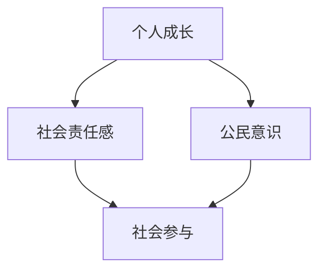
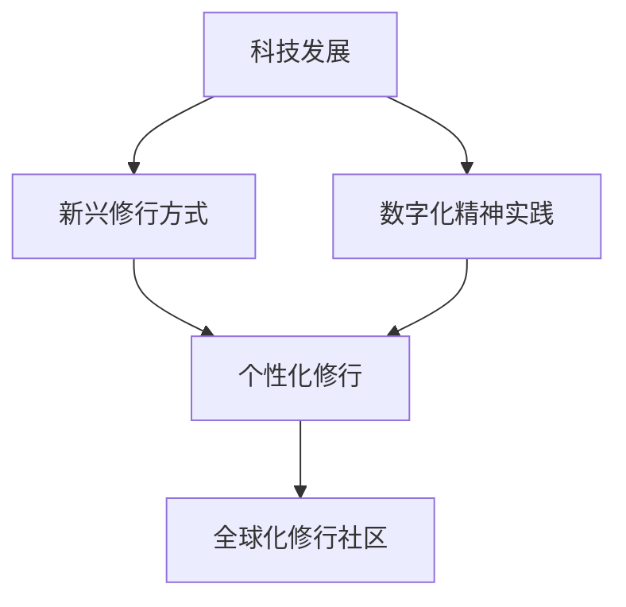

                 

# 新修行者联盟：现代精神实践者的在线网络

> 关键词：在线修行、社区构建、冥想、认知行为疗法、正念、自我成长、社会参与、未来趋势

> 摘要：本文旨在探讨现代精神实践者如何通过在线网络构建新的修行者联盟，以应对现代社会中的精神需求与挑战。文章首先介绍了现代精神实践者的崛起背景和网络时代的精神实践特点，随后分析了在线修行社区的运作模式和管理策略。接着，文章深入探讨了冥想与呼吸练习、冥想与认知行为疗法、正念与生活实践等现代精神实践的方法与实践，并探讨了在线修行者的成长与自我实现路径。最后，文章提出了现代精神实践的未来方向和趋势，为现代精神实践者提供了实践指南。

## 目录大纲

### 第一部分：在线修行者的现状与挑战

#### 第1章：现代精神实践者的崛起

1.1 现代社会的精神需求

1.2 网络时代的精神实践

1.3 修行者在网络空间的角色与影响

#### 第2章：在线修行社区的运作模式

2.1 社区构建的基本要素

2.2 在线修行社区的类型与特点

2.3 社区管理与运营策略

### 第二部分：现代精神实践的方法与实践

#### 第3章：冥想与呼吸练习

3.1 冥想的基本原理

3.2 呼吸练习的实践方法

3.3 冥想与呼吸练习的实际应用

#### 第4章：冥想与认知行为疗法

4.1 认知行为疗法的基本原理

4.2 冥想对认知行为疗法的影响

4.3 冥想在临床实践中的应用

#### 第5章：正念与生活实践

5.1 正念的基本概念

5.2 正念在生活实践中的应用

5.3 正念练习与心理健康的提升

### 第三部分：在线修行者的成长与自我实现

#### 第6章：个人成长与自我探索

6.1 成长心理学的基本原理

6.2 自我探索的方法与技巧

6.3 成长与自我实现的路径

#### 第7章：社会参与与社区贡献

7.1 社会参与的意义与形式

7.2 社区贡献的途径与方式

7.3 社会参与与个人成长的互动关系

### 第四部分：未来展望与趋势

#### 第8章：现代精神实践的未来方向

8.1 技术发展与精神实践

8.2 新兴修行方式的探索

8.3 现代精神实践的未来趋势

## 附录

### 附录A：推荐阅读书目与资源

A.1 精神实践相关书籍推荐

A.2 网络修行资源推荐

A.3 修行社区互动平台推荐

### 附录B：术语表

B.1 现代精神实践相关术语解释

## 第一部分：在线修行者的现状与挑战

### 第1章：现代精神实践者的崛起

#### 1.1 现代社会的精神需求

在现代社会，人们面临着前所未有的精神压力。工作压力、人际关系紧张、经济压力等问题不断困扰着现代人。根据世界卫生组织（WHO）的数据，心理健康问题已经成为全球范围内的一个重要健康挑战。精神需求不仅体现在心理层面，还涉及情感、人际关系、自我认同等多个方面。

随着科技的发展，人们的生活方式发生了巨大变化。互联网的普及使得人们能够随时随地获取信息，社交网络使得人际关系更加紧密。然而，这种紧密的联系也带来了新的问题，例如社交媒体上的负面评论、网络暴力等，这些都对人们的心理健康造成了影响。

#### 1.2 网络时代的精神实践

在这样的大背景下，精神实践成为了现代人寻求心灵安宁和健康的重要途径。冥想、正念、瑜伽等传统修行方法在现代社会得到了广泛的推广和应用。这些方法不仅能够帮助人们缓解压力，还能够提升心理韧性，增强自我意识。

网络时代为精神实践提供了新的平台。在线修行社区、社交媒体上的修行团体、在线课程等，使得修行者可以跨越时空的限制，随时随地参与修行活动。这种在线修行的方式不仅方便，而且能够吸引更多的人参与进来。

#### 1.3 修行者在网络空间的角色与影响

在网络空间中，修行者扮演着多重角色。首先，他们是修行实践者，通过在线课程、社区分享等方式，与他人交流修行经验，共同进步。其次，他们是精神导师，通过在线咨询、讲座等形式，帮助他人解决心理问题，提供精神支持。最后，他们是社区管理者，负责维护在线修行社区的秩序，促进社区的和谐发展。

修行者在网络空间中的影响力不可小觑。他们的存在不仅能够帮助更多的人获得精神上的慰藉，还能够推动社会对心理健康问题的关注和认识。通过在线修行，修行者不仅能够提升自己的精神境界，还能够为社会的精神健康做出贡献。

### 第2章：在线修行社区的运作模式

#### 2.1 社区构建的基本要素

在线修行社区的构建需要考虑多个基本要素，包括社区定位、目标人群、核心内容、互动机制等。

首先，社区定位是构建在线修行社区的第一步。社区定位决定了社区的目标和方向，例如，是专注于冥想、正念，还是瑜伽等。明确的定位有助于吸引具有共同兴趣的修行者。

其次，目标人群是社区的核心。了解目标人群的需求和兴趣，有助于社区提供更具针对性的内容和活动。

核心内容是社区的核心价值所在。高质量的修行内容，如冥想指导、正念课程等，能够吸引和留住修行者。

互动机制是社区活力的重要保障。通过线上讨论、问答、分享等形式，修行者能够互相交流心得，共同进步。

#### 2.2 在线修行社区的类型与特点

在线修行社区可以分为多种类型，每种类型都有其独特的特点。

第一种类型是冥想社区。冥想社区主要提供冥想指导和练习，帮助修行者掌握冥想技巧，提升冥想效果。冥想社区通常具有以下特点：

- 定期冥想引导
- 冥想心得分享
- 冥想技巧讨论
- 专业冥想师指导

第二种类型是正念社区。正念社区注重正念在日常生活中的应用，帮助修行者培养正念意识，提升生活质量。正念社区通常具有以下特点：

- 正念课程分享
- 正念实践心得
- 正念生活技巧
- 专业正念师指导

第三种类型是综合修行社区。这类社区不仅提供冥想和正念的内容，还包括瑜伽、禅修等多种修行方法。综合修行社区通常具有以下特点：

- 多元修行内容
- 互动交流平台
- 专业修行导师
- 定期修行活动

#### 2.3 社区管理与运营策略

社区管理与运营策略是确保在线修行社区持续健康发展的关键。以下是一些有效的管理策略：

- 设立明确的社区规则，确保社区秩序和氛围良好。
- 建立专业的管理团队，负责社区的日常运营和活动策划。
- 定期举办线上活动，增加社区活力和成员的参与度。
- 提供丰富的修行资源，如在线课程、电子书籍等，满足修行者的需求。
- 与专业修行机构和导师合作，提升社区的专业水平。

通过有效的社区管理和运营策略，在线修行社区能够吸引更多的修行者参与，为他们的精神成长提供有力支持。

### 第二部分：现代精神实践的方法与实践

#### 第3章：冥想与呼吸练习

#### 3.1 冥想的基本原理

冥想是一种古老的心灵修炼方法，旨在通过专注和意识控制来达到内心的宁静和清晰。冥想的基本原理可以概括为以下几点：

- **专注力训练**：冥想通过专注一个特定的对象（如呼吸、声音、视觉焦点等），帮助修行者提升专注力和注意力。
- **意识流动**：冥想有助于意识流动，使修行者能够更好地感知内在的体验，从而增进对自我和外部世界的理解。
- **神经调节**：冥想通过调节大脑的神经活动，降低应激反应，提升情绪稳定性和心理韧性。
- **生理反应**：冥想能够影响身体的生理反应，如降低心率和血压，改善呼吸模式，提高免疫力。

#### 3.2 呼吸练习的实践方法

呼吸练习是冥想的重要组成部分，它通过调整呼吸来达到身体和心理的平衡。以下是一些常见的呼吸练习方法：

- **腹式呼吸**：这种方法强调深吸气，使腹部膨胀，然后缓慢呼气，使腹部收缩。腹式呼吸有助于放松身体，减轻紧张。
- **4-7-8呼吸法**：这种方法要求吸气4秒，保持呼吸7秒，然后呼气8秒。这种呼吸模式有助于迅速放松身体，减少焦虑。
- **呼吸同步冥想**：在冥想过程中，修行者尝试将呼吸与冥想对象的观察同步，例如，每次吸气时关注呼吸进出鼻孔的感觉，每次呼气时关注身体的放松。

#### 3.3 冥想与呼吸练习的实际应用

冥想和呼吸练习在实际应用中具有广泛的功效，以下是一些具体的应用场景：

- **缓解压力**：通过定期冥想和呼吸练习，可以显著降低压力水平，改善睡眠质量。
- **提高注意力**：专注力训练有助于提升工作和学习中的注意力集中度，提高效率。
- **增强情绪稳定性**：冥想有助于调节情绪，减少焦虑和抑郁情绪。
- **改善身体健康**：呼吸练习能够改善呼吸模式，增强心肺功能，提高免疫力。

为了更好地理解和应用冥想与呼吸练习，以下是一个简单的冥想练习示例：

```python
# 冥想练习示例：呼吸同步冥想

import time

# 设置冥想时间
meditation_time = 10  # 10分钟

# 开始冥想
print("准备开始冥想，请找一个舒适的姿势，闭上眼睛。")
print("我们将会进行呼吸同步冥想，请注意你的呼吸。")

for minute in range(meditation_time):
    print(f"现在是第 {minute + 1} 分钟，深吸一口气，慢慢地。")
    time.sleep(5)  # 模拟深吸气5秒
    print("现在，慢慢地呼气。")
    time.sleep(5)  # 模拟深呼气5秒
    print("保持呼吸平稳，专注于呼吸的感觉。")

print("冥想结束，感谢您的参与。")
```

通过这个简单的示例，修行者可以初步体验冥想与呼吸练习的实践方法。

### 第4章：冥想与认知行为疗法

#### 4.1 认知行为疗法的基本原理

认知行为疗法（Cognitive Behavioral Therapy，简称CBT）是一种心理治疗方法，旨在通过改变不合理的思维和行为模式来改善心理问题。CBT的基本原理包括以下几点：

- **认知重构**：CBT帮助患者识别和挑战不合理的思维模式，如灾难化思维、以偏概全等，从而重建更为合理的认知结构。
- **行为激活**：通过行为激活，患者被鼓励参与实际的活动，以改变消极的行为模式，提高生活质量。
- **情绪调节**：CBT帮助患者学会情绪调节技巧，如放松训练、认知重构等，以减轻情绪困扰。

#### 4.2 冥想对认知行为疗法的影响

冥想作为一种精神实践，对认知行为疗法具有积极的影响。具体来说，冥想对CBT的影响体现在以下几个方面：

- **增强认知功能**：研究表明，冥想能够提升注意力和记忆等认知功能，从而有助于患者在CBT过程中更好地理解和应用认知重构技巧。
- **减轻情绪困扰**：冥想能够降低应激水平，减轻焦虑和抑郁情绪，为CBT的实施提供更为稳定的心境。
- **提高自我觉察**：冥想帮助患者培养自我觉察的能力，更好地了解自己的思维和行为模式，从而更有效地进行认知重构。
- **增强行为激活**：通过冥想，患者能够更好地调节情绪，从而更有动力参与实际的活动，提高行为激活的效果。

#### 4.3 冥想在临床实践中的应用

冥想不仅在CBT中具有重要作用，也在临床实践中得到了广泛应用。以下是一些冥想在临床实践中的应用实例：

- **抑郁症治疗**：冥想能够减轻抑郁症患者的情绪困扰，提高治疗的有效性。
- **焦虑症治疗**：冥想有助于降低焦虑水平，提高患者的心理韧性。
- **创伤后应激障碍（PTSD）治疗**：冥想有助于减轻PTSD患者的应激反应，改善生活质量。
- **慢性疼痛管理**：冥想能够缓解慢性疼痛患者的疼痛感，提高生活质量。

为了更好地理解冥想在临床实践中的应用，以下是一个简单的冥想练习示例，适用于抑郁症治疗：

```python
# 冥想练习示例：缓解抑郁症

import time

# 设置冥想时间
meditation_time = 20  # 20分钟

# 开始冥想
print("准备开始冥想，请找一个舒适的姿势，闭上眼睛。")
print("我们将会进行放松冥想，专注于呼吸和身体的感觉。")

for minute in range(meditation_time):
    print(f"现在是第 {minute + 1} 分钟，深吸一口气，慢慢地。")
    time.sleep(5)  # 模拟深吸气5秒
    print("现在，慢慢地呼气。")
    time.sleep(5)  # 模拟深呼气5秒
    print("专注于身体的感觉，特别是放松的地方。")
    time.sleep(10)  # 感受身体10秒

print("冥想结束，感谢您的参与。")
```

通过这个简单的示例，抑郁症患者可以尝试在日常生活中进行冥想练习，以缓解情绪困扰。

### 第5章：正念与生活实践

#### 5.1 正念的基本概念

正念（Mindfulness）是一种专注于当前时刻、接纳当下的心理状态和实践方法。正念的基本概念包括以下几点：

- **专注当下**：正念要求修行者将注意力集中在当前时刻，不评判、不抗拒，只是观察和体验。
- **接纳当下**：正念强调接纳当下的现实，无论是不愉快的体验还是愉快的体验，都保持开放和接纳的态度。
- **非评判性**：正念要求修行者不对体验进行评判，而是以平等、客观的态度去观察和理解。
- **身体意识**：正念强调对身体感觉的关注，通过感知身体的变化来增强对当前时刻的体验。

#### 5.2 正念在生活实践中的应用

正念在日常生活中具有广泛的应用，以下是一些常见的应用场景：

- **工作压力管理**：正念练习可以帮助职场人士提高专注力，减少工作压力，提升工作效率。
- **情绪调节**：正念练习有助于调节情绪，减少焦虑和抑郁情绪，提高心理韧性。
- **健康促进**：正念练习能够改善身体健康，如降低血压、改善睡眠质量等。
- **人际关系**：正念练习有助于提高人际沟通能力，增强对他人的理解和接纳。

为了更好地理解正念在生活实践中的应用，以下是一个简单的正念练习示例，适用于工作压力管理：

```python
# 正念练习示例：缓解工作压力

import time

# 设置冥想时间
meditation_time = 10  # 10分钟

# 开始冥想
print("准备开始冥想，请找一个舒适的姿势，闭上眼睛。")
print("我们将会进行呼吸同步冥想，专注于呼吸和当前的工作压力。")

for minute in range(meditation_time):
    print(f"现在是第 {minute + 1} 分钟，深吸一口气，慢慢地。")
    time.sleep(5)  # 模拟深吸气5秒
    print("现在，慢慢地呼气。")
    time.sleep(5)  # 模拟深呼气5秒
    print("专注于呼吸的感觉，感受身体和心灵的变化。")
    time.sleep(10)  # 感受呼吸和身体变化10秒

print("冥想结束，感谢您的参与。现在，您可以更加专注地投入到工作中。")
```

通过这个简单的示例，职场人士可以在工作间隙进行正念练习，以缓解工作压力，提高专注力。

#### 5.3 正念练习与心理健康的提升

正念练习不仅有助于缓解压力，还能够提升心理健康。以下是一些具体的效果：

- **情绪调节**：正念练习能够帮助个体更好地管理情绪，减少焦虑和抑郁情绪，提高心理韧性。
- **心理灵活性**：正念练习有助于个体提高心理灵活性，更好地应对生活中的挑战。
- **自我意识**：正念练习能够提高个体的自我意识，帮助个体更好地了解自己的内心世界。
- **心理健康改善**：长期的正念练习能够改善心理健康，降低心理疾病的风险。

为了更好地理解正念练习对心理健康的提升，以下是一个简单的正念练习示例，适用于提高心理韧性：

```python
# 正念练习示例：提高心理韧性

import time

# 设置冥想时间
meditation_time = 15  # 15分钟

# 开始冥想
print("准备开始冥想，请找一个舒适的姿势，闭上眼睛。")
print("我们将会进行身体扫描冥想，专注于身体的每一个部位。")

for minute in range(meditation_time):
    print(f"现在是第 {minute + 1} 分钟，从脚开始，感受每一个部位的感觉。")
    time.sleep(10)  # 模拟感受身体部位10秒
    print("保持专注，不要评判，只是观察。")
    time.sleep(5)  # 感受呼吸和身体变化5秒

print("冥想结束，感谢您的参与。现在，您可以更好地应对生活中的挑战。")
```

通过这个简单的示例，修行者可以在日常生活中进行正念练习，以提高心理韧性，改善心理健康。

### 第三部分：在线修行者的成长与自我实现

#### 第6章：个人成长与自我探索

#### 6.1 成长心理学的基本原理

个人成长与自我探索是现代精神实践的重要组成部分。成长心理学提供了许多有关个人成长的理论和方法，以下是一些基本原理：

- **自我决定理论**：自我决定理论认为，个体的成长和发展取决于自我决定的程度。人们需要在自由和自主的环境中，积极探索自己的兴趣和目标，以实现个人成长。
- **积极心理学**：积极心理学关注个体的积极体验和优势，强调通过培养积极的情感、认知和行为模式，促进个人成长和幸福。
- **自我概念**：自我概念是指个体对自己的认知和评价。积极的自我概念有助于个体建立自信，面对挑战，实现个人成长。
- **情感智力**：情感智力是指个体识别、理解和管理自己情感的能力。高情感智力有助于个体更好地应对生活中的挑战，实现个人成长。

#### 6.2 自我探索的方法与技巧

自我探索是个人成长的重要步骤。以下是一些自我探索的方法和技巧：

- **日记记录**：通过日记记录自己的思想、情感和行为，可以帮助个体更好地了解自己，发现内在的动机和需求。
- **心理咨询**：心理咨询是一种专业的自我探索方法，通过与心理咨询师的交流，个体可以深入探讨自己的内心世界，解决心理问题。
- **冥想与正念**：冥想和正念练习有助于提高个体的自我觉察和自我理解，从而更好地进行自我探索。
- **兴趣爱好**：通过探索自己的兴趣爱好，个体可以更好地了解自己的兴趣和价值观，从而实现个人成长。

#### 6.3 成长与自我实现的路径

个人成长与自我实现是一个持续的过程，以下是一些关键的步骤和路径：

- **自我认知**：通过自我探索，个体可以更好地了解自己的优点和缺点，从而设定合理的个人目标和成长路径。
- **目标设定**：设定明确、具体的目标有助于个体集中精力，制定行动计划，实现自我成长。
- **行动与反思**：通过行动和反思，个体可以不断调整自己的成长路径，发现新的机遇和挑战。
- **持续学习**：持续学习是个人成长的重要保障。通过不断学习新的知识和技能，个体可以不断提高自己的能力和竞争力。

为了更好地理解个人成长与自我实现的路径，以下是一个简单的个人成长计划示例：

```python
# 个人成长计划示例

# 设定目标
goals = [
    "学习一门新语言",
    "阅读20本自我成长书籍",
    "每周进行三次正念冥想",
    "参加一次心理咨询",
]

# 行动与反思
for goal in goals:
    print(f"开始实施：{goal}")
    # 实施行动计划
    # ...
    # 反思与总结
    print(f"反思：{goal} 的实施情况，发现问题和改进点。")

# 持续学习
print("持续学习，不断进步。")
```

通过这个简单的示例，个体可以制定一个具体的个人成长计划，以实现自我成长和自我实现。

#### 第7章：社会参与与社区贡献

#### 7.1 社会参与的意义与形式

社会参与是指个体在社会中积极参与、贡献自己的力量，以促进社会和谐与进步。社会参与的意义在于：

- **促进个人成长**：通过社会参与，个体可以锻炼自己的能力和技能，提高社会责任感和公民意识。
- **促进社会进步**：社会参与有助于解决社会问题，推动社会变革，促进社会的发展和进步。
- **建立人际关系**：通过社会参与，个体可以结识更多志同道合的人，建立广泛的人际关系。

社会参与的形式多种多样，以下是一些常见的形式：

- **志愿服务**：志愿服务是一种无私奉献的行为，通过为他人和社会提供服务，实现个人价值和社区贡献。
- **公益活动**：公益活动是指为了某个社会公益目标而组织的活动，如环保活动、慈善捐款等。
- **社区参与**：社区参与是指个体在社区中积极参与社区事务，如社区治理、社区活动组织等。
- **网络公益**：网络公益是指通过网络平台，如社交媒体、在线论坛等，参与社会公益活动，传播正能量。

#### 7.2 社区贡献的途径与方式

社区贡献是指个体在社区中积极参与、为社区的发展和进步做出贡献。以下是一些常见的社区贡献途径与方式：

- **志愿服务**：参与志愿服务，为社区提供实际的帮助和支持，如为社区老年人提供陪伴、为社区环境进行清洁等。
- **公益活动**：组织或参与公益活动，如慈善捐款、环保活动等，以促进社区的发展和进步。
- **社区治理**：积极参与社区治理，如参与社区委员会、社区议政会等，为社区发展提供建议和意见。
- **社区互动**：通过社区互动，如社区活动组织、社区论坛交流等，增进社区成员之间的了解和友谊，促进社区和谐。

为了更好地理解社区贡献的途径与方式，以下是一个简单的社区贡献计划示例：

```python
# 社区贡献计划示例

# 设定目标
contributions = [
    "每月参与一次志愿服务",
    "每年组织一次公益活动",
    "积极参与社区治理",
    "每周参与社区互动",
]

# 行动与贡献
for contribution in contributions:
    print(f"开始实施：{contribution}")
    # 实施贡献行动计划
    # ...
    # 反思与总结
    print(f"反思：{contribution} 的实施情况，发现问题和改进点。")

# 持续贡献
print("持续贡献，为社区发展做出更多贡献。")
```

通过这个简单的示例，个体可以制定一个具体的社区贡献计划，为社区的发展和进步做出贡献。

#### 7.3 社会参与与个人成长的互动关系

社会参与与个人成长之间存在密切的互动关系。通过社会参与，个体可以锻炼自己的能力和技能，提高社会责任感和公民意识，从而实现个人成长。同时，个人成长也为社会参与提供了坚实的基础，使个体能够更加有效地参与社会事务，为社会发展做出贡献。

为了更好地理解社会参与与个人成长的互动关系，以下是一个简单的互动关系模型：



通过这个模型，我们可以看到，个人成长与社会参与之间存在相互促进的关系。个人成长提高了个体的社会责任感和公民意识，使个体更加愿意参与社会事务；而社会参与则为个人成长提供了实践平台，使个体能够在参与社会事务的过程中锻炼自己的能力和技能，实现个人成长。

### 第四部分：未来展望与趋势

#### 第8章：现代精神实践的未来方向

现代精神实践在未来的发展中，将受到技术进步和社会变迁的深刻影响。以下是一些未来的趋势和方向：

#### 8.1 技术发展与精神实践

随着科技的不断进步，虚拟现实（VR）和增强现实（AR）技术有望为精神实践提供全新的平台和体验。通过VR和AR，修行者可以进入虚拟的修行空间，进行沉浸式的冥想和正念练习。此外，人工智能（AI）技术的应用也将极大地提升精神实践的个性化和精准化水平。例如，AI可以通过数据分析，为修行者提供定制化的冥想和正念指导，从而提高修行效果。

#### 8.2 新兴修行方式的探索

未来，随着对精神实践的研究不断深入，可能会出现更多新兴的修行方式。例如，量子冥想、能量冥想等新修行方法可能会被提出，并得到广泛的关注和应用。这些新兴修行方式可能会结合最新的科学研究成果，提供更加有效和创新的修行体验。

#### 8.3 现代精神实践的未来趋势

未来，现代精神实践将呈现出以下几个趋势：

- **多元化**：随着不同文化和思想的交融，现代精神实践将更加多元化，吸收各种传统和新兴的修行方法。
- **数字化**：数字技术将深入融合到精神实践中，为修行者提供更加便捷和高效的修行体验。
- **个性化**：通过大数据和人工智能的应用，精神实践将更加个性化，满足不同修行者的需求和期望。
- **全球化**：随着互联网的普及，精神实践将跨越地域和文化的限制，形成全球性的修行社区。

为了更好地理解现代精神实践的未来方向，以下是一个简单的未来趋势模型：



通过这个模型，我们可以看到，技术发展将推动现代精神实践朝着多元化、数字化、个性化和全球化的方向发展。

### 附录

#### 附录A：推荐阅读书目与资源

A.1 精神实践相关书籍推荐

- 《正念：此刻是一颗苹果》（Jon Kabat-Zinn著）
- 《冥想的艺术》（Chade-Meng Tan著）
- 《认知行为疗法：基础与应用》（Judith S. Beck著）

A.2 网络修行资源推荐

- 正念冥想APP（Headspace、Insight Timer等）
- 网络修行社区（Reddit的Meditation板块、Facebook的Meditation for Wellness小组等）

A.3 修行社区互动平台推荐

- Slack（用于专业修行者和导师之间的交流）
- Discord（用于全球修行者的互动和活动）

#### 附录B：术语表

B.1 现代精神实践相关术语解释

- **冥想**：一种集中注意力和意识的方法，通过专注于一个特定的对象或活动，以达到内心的平静和清晰。
- **正念**：一种专注于当前时刻、接纳当下的心理状态和实践方法。
- **认知行为疗法**：一种心理治疗方法，旨在通过改变不合理的思维和行为模式来改善心理问题。
- **自我决定**：个体在成长和发展过程中，自主做出选择和决定的能力。
- **情感智力**：个体识别、理解和管理自己情感的能力。

### 作者信息

作者：AI天才研究院/AI Genius Institute & 禅与计算机程序设计艺术 /Zen And The Art of Computer Programming

