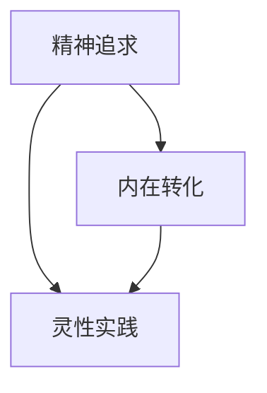
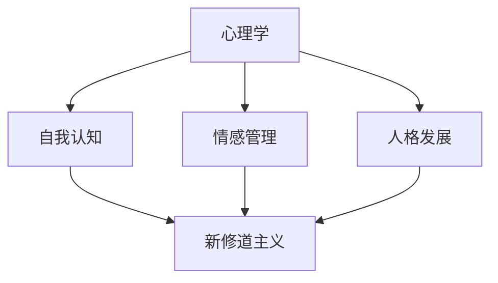
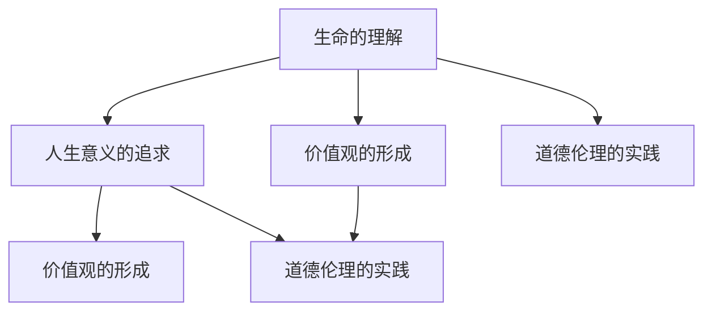

                 

### 引言

《新修道主义：世俗中的精神追求》旨在探讨一种结合世俗生活与精神追求的思想体系，它不仅关注个体内在的修炼与提升，更强调在现实生活中实现精神与物质的双丰收。这一思想体系的核心在于平衡现实与理想，通过内在的转化和外在的实践，达到身心和谐与自我超越。

本文将分为七个章节，逐步深入探讨新修道主义的各个方面。首先，我们将在第一章中概述新修道主义的核心概念、历史背景及其与世俗的关系。接着，在第二章中，我们将详细阐述新修道主义的核心思想，包括精神追求、内在转化和灵性实践。随后，在第三章中，我们将探讨新修道主义的实践方法，通过心理建设、人际关系和职业发展三个方面进行具体分析。

第四章将结合心理学，讨论新修道主义与心理学的联系以及如何运用心理学方法解决常见心理问题。第五章将探讨新修道主义与生活哲学的关系，分析生活哲学的基本概念及其在新修道主义实践中的应用。第六章将关注新修道主义在现代社会中的价值，讨论其在社会变革和全球化背景下的意义。最后，在第七章中，我们将展望新修道主义的未来，分析其面临的挑战与机遇，并探讨在中国的发展前景。

通过这样的结构布局，本文将带领读者逐步了解并深入探讨新修道主义这一独特的思想体系，帮助我们在繁忙的世俗生活中找到精神的归属和意义。

### 关键词

- 新修道主义
- 精神追求
- 世俗生活
- 内在转化
- 心理建设
- 生活哲学
- 社会变革

### 摘要

本文《新修道主义：世俗中的精神追求》旨在探讨一种融合世俗生活与精神追求的思想体系——新修道主义。文章首先概述了新修道主义的核心概念及其与世俗生活的联系，随后详细阐述了其核心思想，包括精神追求、内在转化和灵性实践。通过具体的实践方法和案例分析，本文展示了如何在现实生活中实现精神与物质的平衡。同时，文章还结合心理学、生活哲学等角度，探讨了新修道主义在这些领域的应用及其对现代社会的影响。最后，本文展望了新修道主义的未来发展，分析了其在全球化背景下的机遇与挑战。通过阅读本文，读者可以深入理解新修道主义，并在实际生活中践行这一思想体系，实现身心和谐与自我超越。

### 第一章：新修道主义概述

#### 1.1 核心概念与联系

新修道主义是一种将世俗生活与精神追求相结合的思想体系。其核心概念包括精神追求、内在转化和灵性实践。这些概念之间相互联系，共同构成了新修道主义的完整框架。

- **精神追求**：指的是个体对于更高层次意识、智慧和精神境界的追求。这种追求不仅仅局限于个人成长，更涉及到对生命意义和宇宙本质的探索。
- **内在转化**：指的是通过自我反省、心灵修炼等方式，实现个体内在的自我提升和转变。这一过程强调内在平和与自我认知的提升，从而达到身心和谐。
- **灵性实践**：指的是通过冥想、祈祷、修行等具体行动，实现个体精神追求和内在转化的目标。灵性实践是一种持续的、系统的修炼过程，旨在提升个体的精神层次。

这些核心概念之间存在着紧密的联系。精神追求是内在转化的动力源泉，内在转化是实现精神追求的途径，而灵性实践则是内在转化的具体表现。三者相辅相成，共同构成了新修道主义的完整体系。

##### Mermaid 流程图

下面是一个简单的 Mermaid 流程图，展示了新修道主义核心概念之间的联系：



在这个流程图中，精神追求作为起点，通过内在转化和灵性实践，最终实现个体的精神提升。

#### 1.2 新修道主义的历史背景与发展

新修道主义并非一蹴而就的思想体系，而是经历了漫长的历史演变。其历史背景可以追溯到古代宗教哲学和修行传统。

- **古代宗教哲学**：在古代，许多宗教和哲学思想都探讨了精神追求和内在转化的概念。例如，佛教的修行、基督教的祈祷和瑜伽的冥想，这些都是对精神追求和内在转化的具体实践。
- **现代心理学与哲学**：20世纪初，随着现代心理学和哲学的发展，人们开始更加深入地探讨精神追求和内在转化的本质。卡尔·荣格的心理分析、埃克哈特的《悟性之书》等，都为现代新修道主义提供了理论基础。
- **当代新修道主义**：当代新修道主义在继承古代和现代思想的基础上，结合现代社会的特点，提出了一系列新的理论和实践方法。例如，大卫·巴赫的《新修道主义》和克里斯·吉勒博的《现代修行之路》等，都是当代新修道主义的代表作。

新修道主义的发展历程可以分为以下几个阶段：

1. **起源与形成**：新修道主义的起源可以追溯到古代宗教哲学和修行传统。这些传统中包含的精神追求和内在转化的概念，为新修道主义的形成提供了基础。
2. **现代发展**：20世纪初，随着现代心理学和哲学的发展，新修道主义开始逐渐形成自己的理论体系。这一阶段的主要特点是，将古代和现代的思想进行了整合和升华。
3. **当代扩展**：当代新修道主义在继承古代和现代思想的基础上，进一步扩展了自己的理论体系，结合现代社会的特点，提出了一系列新的理论和实践方法。

#### 1.3 新修道主义与世俗的关系

新修道主义不仅关注个体的精神追求和内在转化，更强调在现实生活中实现这一追求。因此，它与世俗生活之间存在着密切的关系。

- **平衡精神与物质**：新修道主义认为，精神追求与物质生活并非对立的关系，而是可以相互平衡和促进的。通过内在转化和灵性实践，个体可以在世俗生活中找到精神的寄托和意义。
- **解决现实问题**：新修道主义提供了一系列实践方法，如心理建设、人际关系处理和职业发展等，帮助个体在现实生活中解决实际问题，实现精神与物质的和谐统一。
- **提升生活质量**：通过新修道主义的实践，个体可以在日常生活中感受到内心的平和与宁静，从而提升生活质量。这种平和与宁静不仅对个体的身心健康有益，也对社会的和谐稳定产生积极影响。

总之，新修道主义是一种在现实生活中实现精神追求的思想体系。它通过内在转化和灵性实践，帮助个体在世俗生活中找到精神的归属和意义，实现身心和谐与自我超越。

### 第二章：新修道主义的核心思想

新修道主义的核心思想是指导个体在世俗生活中实现精神追求和内在转化的基本原则和方法。这些核心思想包括精神追求、内在转化和灵性实践。以下将对这三个核心思想进行详细阐述。

#### 2.1 精神追求

精神追求是.new修道主义的首要目标，它关注的是个体对更高层次意识、智慧和灵魂境界的追求。这种追求不仅是为了个人的成长，更是为了对生命意义和宇宙本质的深刻理解。

- **意义与目的**：精神追求的意义在于，通过提升个体的精神层次，使其能够更好地理解生命的意义和宇宙的本质。这种追求不仅对个体有意义，也对整个社会和人类文明具有深远的影响。
- **实现方法**：实现精神追求的方法多种多样，包括冥想、祈祷、修行、读书、思考等。每种方法都有其独特的优势和适用场景，个体可以根据自己的实际情况选择适合自己的方法。

##### 例子说明

以冥想为例，冥想是一种通过集中注意力、放松身心、超越思维的方式，达到精神提升的目的。下面是一个简单的冥想实践示例：

```python
# 冥想实践示例

# 准备工作
坐直，双脚平放在地上，闭上眼睛，深呼吸。

# 冥想过程
# 1. 集中注意力：将注意力集中在呼吸上，感受每一次呼吸的进出。
# 2. 放松身心：当注意力开始游离时，轻轻将其拉回呼吸上。
# 3. 持续冥想：保持这样的状态，持续10-20分钟。

# 结束冥想
慢慢睁开眼睛，保持内心的平静和宁静。

```

通过这个简单的冥想实践，个体可以在日常生活中体验到内心的平和与宁静，从而提升精神层次。

#### 2.2 内在转化

内在转化是新修道主义的第二个核心思想，它强调通过自我反省、心灵修炼等方式，实现个体内在的自我提升和转变。内在转化不仅是精神追求的基础，也是实现身心和谐的关键。

- **概念解释**：内在转化指的是个体在心灵层面上实现自我提升和转变的过程。这个过程包括自我认知的提升、情感的控制、思维模式的改变等。
- **重要性**：内在转化的重要性在于，它帮助个体在精神追求的道路上走得更远。只有通过内在转化，个体才能实现真正的自我超越。

##### 例子说明

以下是一个关于内在转化的具体例子：

```python
# 内在转化示例

# 1. 自我反省
# 反省自己的行为和思维方式，找出需要改进的地方。

# 2. 心灵修炼
# 通过冥想、瑜伽等方式，提升自我意识和情感控制能力。

# 3. 行动实践
# 将反省和修炼的结果应用到日常生活中，逐步改变自己的行为和思维方式。

```

通过这个例子，个体可以在实际生活中体验到内在转化的过程，从而实现精神与物质的和谐统一。

#### 2.3 灵性实践

灵性实践是新修道主义的第三个核心思想，它强调通过具体的行动，如冥想、祈祷、修行等，实现个体的精神追求和内在转化。

- **概念解释**：灵性实践是指个体通过具体的修行方法，如冥想、祈祷、瑜伽等，实现精神提升和内在转化的过程。这些实践方法是一种持续的、系统的修炼过程，旨在提升个体的精神层次。
- **重要性**：灵性实践的重要性在于，它为个体提供了实现精神追求和内在转化的具体路径。通过灵性实践，个体可以在现实生活中感受到精神的提升和内心的宁静。

##### 例子说明

以下是一个简单的灵性实践示例：

```python
# 灵性实践示例

# 1. 冥想
# 每天进行20分钟的冥想，集中注意力，放松身心。

# 2. 瑜伽
# 每周进行3次的瑜伽练习，提升身体和心灵的协调性。

# 3. 祈祷
# 每天进行10分钟的祈祷，寻求内心的平静和指引。

```

通过这些灵性实践，个体可以在日常生活中体验到精神的提升和内心的宁静，从而实现新修道主义的目标。

### 第三章：新修道主义的实践方法

新修道主义的实践方法旨在帮助个体在现实生活中实现精神追求和内在转化。这些方法涵盖了心理建设、人际关系和职业发展等多个方面。以下将详细阐述这些实践方法。

#### 3.1 心理建设

心理建设是新修道主义实践的基础，它关注个体内心的平衡与稳定，通过自我反省和情感管理提升自我认知和情感控制能力。

- **自我反省**：自我反省是心理建设的第一步，通过反思自己的行为和思维模式，找出需要改进的地方。具体方法包括日记反思、冥想反思等。
- **情感管理**：情感管理是心理建设的核心，通过理解和管理自己的情感，提升情绪稳定性。具体方法包括情绪释放、情感表达等。
- **案例分析**：

  假设一个个体在日常生活中经常感到焦虑和不安，以下是一个心理建设的具体案例：

  ```python
  # 心理建设案例

  # 1. 自我反省
  每天晚上，写下当天发生的令自己感到焦虑的事件，并分析其原因。

  # 2. 情感管理
  当感到焦虑时，通过深呼吸和冥想放松身心，同时尝试找出焦虑的根源，并制定解决方案。

  # 3. 行动实践
  将反省和管理的经验应用到日常生活中，逐步改善焦虑状况。
  ```

  通过这样的心理建设，个体可以逐步提升情感控制能力，减少焦虑和不安。

#### 3.2 人际关系

人际关系是新修道主义实践中的重要方面，它关注个体在社交环境中的行为和态度，通过建立和谐的人际关系提升个体的社会适应能力。

- **沟通技巧**：沟通技巧是人际关系的基础，包括倾听、表达、非语言沟通等。通过提高沟通技巧，个体可以更好地理解他人，减少冲突。
- **冲突管理**：冲突管理是人际关系中的关键，通过理解冲突的本质和有效的解决方法，个体可以更好地处理人际关系中的问题。
- **案例分析**：

  假设一个个体在团队工作中遇到了冲突，以下是一个人际关系管理案例：

  ```python
  # 人际关系管理案例

  # 1. 沟通技巧
  在与团队成员沟通时，积极倾听对方的意见，并清晰地表达自己的想法。

  # 2. 冲突管理
  当发生冲突时，首先冷静下来，然后尝试通过沟通找到共同点，并制定解决方案。

  # 3. 行动实践
  将沟通和冲突管理的技巧应用到实际工作中，逐步改善人际关系。
  ```

  通过这样的实践，个体可以在团队环境中建立和谐的人际关系，提高工作效率。

#### 3.3 职业发展

职业发展是新修道主义实践中的另一个重要方面，它关注个体在职业生涯中的成长和提升，通过自我认知和职业规划实现职业目标。

- **自我认知**：自我认知是职业发展的基础，通过了解自己的兴趣、能力和价值观，个体可以找到适合自己的职业方向。
- **职业规划**：职业规划是职业发展的关键，通过设定目标和制定计划，个体可以系统地提升自己的职业能力。
- **案例分析**：

  假设一个个体在职业生涯中感到迷茫，以下是一个职业发展案例：

  ```python
  # 职业发展案例

  # 1. 自我认知
  通过自我评估工具，了解自己的兴趣和能力，找出适合自己的职业方向。

  # 2. 职业规划
  设定短期和长期职业目标，制定具体的学习和提升计划。

  # 3. 行动实践
  将自我认知和职业规划的结果应用到实际工作中，逐步实现职业目标。
  ```

  通过这样的实践，个体可以在职业生涯中找到方向，提升职业能力，实现职业成功。

### 总结

新修道主义的实践方法涵盖了心理建设、人际关系和职业发展等多个方面。通过这些实践方法，个体可以在现实生活中实现精神追求和内在转化，达到身心和谐与自我超越。在实际操作中，个体可以根据自己的实际情况，灵活运用这些方法，逐步提升自己的生活质量和社会地位。

### 第四章：新修道主义与心理学

新修道主义与心理学之间存在深刻的联系，两者共同关注个体的内在成长与自我实现。心理学为新修道主义提供了理论基础和方法论，而新修道主义则通过实践方法丰富和深化了心理学的应用。以下将从心理学与新修道主义的联系、常见心理问题的应对方法以及心理学在新修道主义实践中的应用三个方面进行详细探讨。

#### 4.1 心理学与新修道主义的联系

心理学是一门研究人类行为和心理过程的科学，其研究对象包括情绪、认知、人格、社会关系等。新修道主义则是一种旨在帮助个体实现精神追求和内在转化的思想体系。两者之间的联系主要体现在以下几个方面：

- **自我认知**：新修道主义强调个体的自我认知，认为通过深入理解自己的内在世界，个体可以实现自我提升。这与心理学中的自我认知理论不谋而合，心理学通过研究自我认知的机制和过程，为个体提供了深入了解自我、实现自我超越的方法。
- **情感管理**：新修道主义强调情感管理，认为通过理解和控制自己的情感，个体可以实现内心的平和与宁静。心理学中的情感管理理论提供了丰富的工具和方法，帮助个体在日常生活中更好地应对情感波动。
- **人格发展**：新修道主义关注个体的人格发展，认为通过内在转化和灵性实践，个体可以实现人格的提升。心理学中的人格理论为个体提供了了解自己人格特点和实现人格发展的途径。

##### Mermaid 流程图

下面是一个简单的 Mermaid 流程图，展示了心理学与新修道主义之间的联系：



在这个流程图中，心理学作为起点，通过自我认知、情感管理和人格发展，最终实现个体在新修道主义中的精神追求和内在转化。

#### 4.2 常见心理问题的应对方法

在现实生活中，个体常常面临各种心理问题，如焦虑、抑郁、压力等。新修道主义提供了一系列方法，帮助个体应对这些常见心理问题。以下是一些具体的应对方法：

- **焦虑管理**：焦虑是一种常见的心理问题，新修道主义通过冥想、呼吸练习和情感管理等方式，帮助个体缓解焦虑。例如，通过深呼吸和冥想，个体可以放松身心，减少焦虑情绪。
- **抑郁应对**：抑郁是一种严重的心理问题，新修道主义通过积极的心态、情感表达和灵性实践等方式，帮助个体应对抑郁。例如，通过与他人分享自己的情感，个体可以获得心理支持，缓解抑郁情绪。
- **压力缓解**：压力是现代社会中普遍存在的问题，新修道主义通过自我认知、时间管理和情感管理等方式，帮助个体缓解压力。例如，通过合理安排时间和任务，个体可以减少因压力过大而产生的负面影响。

##### Python 源代码示例

以下是一个简单的 Python 源代码示例，展示了如何使用新修道主义的方法来缓解焦虑：

```python
# 焦虑管理示例

# 1. 深呼吸
def deep_breath():
    print("开始深呼吸...")
    print("深吸一口气，感受胸腔的扩张...")
    print("慢慢地呼出气息，感受身体的放松...")

# 2. 冥想
def meditation():
    print("开始冥想...")
    print("集中注意力，感受呼吸的节奏...")
    print("当思绪游离时，轻轻将其拉回呼吸上...")

# 3. 情感管理
def emotion_management():
    print("进行情感管理...")
    print("理解自己的情绪，并找到合适的表达方式...")
    print("与他人分享自己的情感，获得心理支持...")

# 执行焦虑管理方法
deep_breath()
meditation()
emotion_management()
```

通过这个简单的示例，个体可以在日常生活中体验到焦虑管理的具体方法，从而减轻焦虑情绪。

#### 4.3 心理学在新修道主义实践中的应用

心理学不仅在理论上为新修道主义提供了支持，也在实际操作中发挥了重要作用。以下是一些心理学在新修道主义实践中的应用：

- **自我认知训练**：通过心理学中的自我认知理论，个体可以更好地了解自己的内心世界，从而实现自我提升。例如，通过自我反思和日记记录，个体可以深入了解自己的思维模式、情感状态和行为习惯。
- **情感管理技巧**：心理学中的情感管理技巧，如情绪释放、情感表达等，可以帮助个体在日常生活中更好地应对情感波动。例如，通过情绪释放技巧，个体可以释放内心的负面情绪，从而减少情感负担。
- **人格发展指导**：心理学中的人格理论为个体提供了了解和提升人格的途径。通过心理咨询和自我提升课程，个体可以更好地理解自己的人格特点，并实现人格的提升。

##### 项目实战

以下是一个关于心理学在新修道主义实践中的应用项目实战：

**项目名称**：新修道主义心理健康应用

**项目背景**：随着现代社会的发展，心理健康问题日益突出。新修道主义提供了一系列心理健康管理方法，旨在帮助个体在日常生活中实现心理健康。

**项目目标**：开发一款心理健康应用，集成新修道主义的心理健康管理方法，帮助用户实现心理健康。

**项目内容**：

1. **需求分析**：分析用户在心理健康方面的需求，如焦虑管理、抑郁应对、压力缓解等。
2. **功能设计**：设计应用的基本功能，包括自我认知训练、情感管理技巧、人格发展指导等。
3. **技术实现**：使用 Python 等编程语言，实现应用的功能模块。
4. **用户体验**：优化应用的界面和交互设计，提高用户的满意度。
5. **测试与部署**：对应用进行功能测试和性能优化，确保其稳定运行。

**代码示例**：

以下是一个简单的 Python 代码示例，展示了如何实现自我认知训练的功能：

```python
# 自我认知训练示例

# 1. 自我反思
def self_reflection():
    print("开始自我反思...")
    print("思考自己的行为和思维方式...")
    print("记录下自己的想法和感受...")

# 2. 日记记录
def journaling():
    print("开始日记记录...")
    print("记录下每天发生的事情和感受...")
    print("分析日记，了解自己的内在世界...")

# 执行自我认知训练方法
self_reflection()
journaling()
```

通过这个项目实战，个体可以在日常生活中使用应用中的方法，提升自己的心理健康水平。

### 总结

新修道主义与心理学之间存在深刻的联系，两者共同关注个体的内在成长与自我实现。通过心理学的方法和理论，个体可以更好地理解自己的内心世界，实现心理健康和新修道主义的目标。在实际操作中，个体可以根据自己的实际情况，灵活运用心理学的方法，逐步提升自己的心理素质和生活质量。

### 第五章：新修道主义与生活哲学

生活哲学是对生活本质和生命意义的深刻思考和探索。它关注个体如何理解生活、应对挑战和实现自我价值。新修道主义作为一条融合世俗生活与精神追求的思想路径，与生活哲学有着密切的联系。本章将探讨生活哲学的基本概念、新修道主义对生活哲学的影响，以及生活哲学在新修道主义实践中的应用。

#### 5.1 生活哲学的基本概念

生活哲学的基本概念包括对生命的理解、人生意义的追求、价值观的形成和道德伦理的实践。以下是这些概念的具体阐述：

- **生命的理解**：生活哲学首先关注生命的本质和存在的意义。个体如何理解生命的起源、目的和价值，是生活哲学探讨的核心问题。
- **人生意义的追求**：生活哲学认为，人生的意义不仅仅在于追求物质享受和功利目标，更在于追求精神层面的满足和成长。个体如何在生活中寻找和实现自己的意义，是生活哲学的重要议题。
- **价值观的形成**：价值观是个体对事物的评判标准和行为准则。生活哲学关注个体如何形成和坚守自己的价值观，以指导自己的行为和生活选择。
- **道德伦理的实践**：道德伦理是生活哲学的重要组成部分，它探讨个体如何在社会中行事，如何处理人与人之间的关系，以及如何对待自然和环境。

##### Mermaid 流程图

下面是一个简单的 Mermaid 流程图，展示了生活哲学的基本概念之间的联系：



在这个流程图中，生命的理解作为起点，通过人生意义的追求、价值观的形成和道德伦理的实践，最终形成一个完整的生活哲学体系。

#### 5.2 新修道主义对生活哲学的影响

新修道主义对生活哲学的影响主要体现在对传统生活哲学的革新和丰富上。以下是一些具体的影响：

- **精神追求的融合**：新修道主义强调将精神追求融入日常生活，认为个体不仅要在物质层面追求幸福，更要在精神层面寻求满足。这种观念革新了传统生活哲学，使其更加关注个体的精神需求。
- **内在转化的强调**：新修道主义重视内在转化，认为通过自我反省和心灵修炼，个体可以实现自我提升和成长。这一理念丰富了生活哲学的内容，使其更加注重个体的内在发展和自我实现。
- **灵性实践的引入**：新修道主义引入了灵性实践，如冥想、祈祷、修行等，这些实践方法为生活哲学提供了新的工具和途径，帮助个体在日常生活中实现精神追求和内在转化。

##### 例子说明

以下是一个关于新修道主义对生活哲学影响的例子：

假设一个个体在日常生活中面临精神压力和内心焦虑，通过新修道主义的理念和方法，他开始尝试冥想和自我反省。通过冥想，他学会了放松身心，减少焦虑；通过自我反省，他逐步了解了自己的内心需求和成长方向。这种内在转化的过程不仅帮助他解决了现实问题，也使他的生活哲学更加丰富和深刻。

```python
# 新修道主义对生活哲学影响的例子

# 1. 精神追求的融合
def spiritual_pursuit():
    print("在日常生活中，我尝试将精神追求融入生活...")
    print("通过冥想，我学会了放松身心，减少焦虑...")

# 2. 内在转化的强调
def inner_transformation():
    print("我开始重视内在转化，通过自我反省，了解自己的内心需求...")
    print("我逐步找到了自己的成长方向...")

# 3. 灵性实践的引入
def spiritual_practice():
    print("我尝试了冥想和祈祷，这些灵性实践让我更加平静和宁静...")
    print("我的生活哲学因此变得更加丰富和深刻...")

# 执行例子方法
spiritual_pursuit()
inner_transformation()
spiritual_practice()
```

#### 5.3 生活哲学在新修道主义实践中的应用

生活哲学在新修道主义实践中的应用主要体现在以下几个方面：

- **自我认知的提升**：通过生活哲学的指导，个体可以更好地了解自己的内心世界，实现自我认知的提升。例如，通过自我反思和日记记录，个体可以深入挖掘自己的情感和思维模式，从而实现自我提升。
- **情感管理的加强**：生活哲学强调情感管理，个体可以通过学习生活哲学的方法，加强自己的情感管理能力。例如，通过情绪释放和情感表达，个体可以更好地处理负面情绪，保持心理平衡。
- **价值观的塑造**：生活哲学帮助个体形成和坚守自己的价值观，个体可以在新修道主义的实践中，通过自我反省和灵性实践，不断调整和优化自己的价值观，使其更加符合自己的生活哲学。

##### 项目实战

以下是一个关于生活哲学在新修道主义实践中的应用项目实战：

**项目名称**：新修道主义生活哲学实践应用

**项目背景**：随着现代社会的发展，人们越来越关注自己的生活哲学。新修道主义提供了一系列生活哲学实践方法，旨在帮助个体在日常生活中实现精神追求和内在转化。

**项目目标**：开发一款生活哲学实践应用，集成新修道主义的生活哲学方法，帮助用户提升自我认知、加强情感管理和塑造价值观。

**项目内容**：

1. **需求分析**：分析用户在生活哲学实践方面的需求，如自我认知、情感管理和价值观塑造等。
2. **功能设计**：设计应用的基本功能，包括自我认知训练、情感管理技巧、价值观塑造课程等。
3. **技术实现**：使用 Python 等编程语言，实现应用的功能模块。
4. **用户体验**：优化应用的界面和交互设计，提高用户的满意度。
5. **测试与部署**：对应用进行功能测试和性能优化，确保其稳定运行。

**代码示例**：

以下是一个简单的 Python 代码示例，展示了如何实现自我认知训练的功能：

```python
# 自我认知训练示例

# 1. 自我反思
def self_reflection():
    print("开始自我反思...")
    print("思考自己的行为和思维方式...")
    print("记录下自己的想法和感受...")

# 2. 日记记录
def journaling():
    print("开始日记记录...")
    print("记录下每天发生的事情和感受...")
    print("分析日记，了解自己的内在世界...")

# 执行自我认知训练方法
self_reflection()
journaling()
```

通过这个项目实战，用户可以在日常生活中使用应用中的方法，提升自我认知、加强情感管理和塑造价值观，实现新修道主义的目标。

### 总结

新修道主义与生活哲学之间存在深刻的联系，新修道主义不仅革新了传统生活哲学，也为生活哲学提供了丰富的实践方法。通过生活哲学的指导，个体可以在新修道主义的实践中实现自我认知、情感管理和价值观塑造，从而在日常生活中实现精神追求和内在转化。

### 第六章：新修道主义与现代社会

新修道主义在现代社会中具有重要的价值，它不仅为个体提供了精神追求和内在转化的路径，也为社会的和谐与进步提供了思想支持。以下将从新修道主义在现代社会中的价值、新修道主义与社会变革以及新修道主义与全球化三个方面进行探讨。

#### 6.1 新修道主义在现代社会中的价值

现代社会面临着诸多挑战，如焦虑、压力、心理问题、人际关系紧张等。这些问题不仅影响个体的身心健康，也对社会的稳定和进步产生负面影响。新修道主义通过提供一系列精神追求和内在转化的方法，帮助个体应对这些挑战，实现身心和谐。

- **心理健康**：新修道主义强调情感管理和心理建设，帮助个体在日常生活中保持心理健康。通过冥想、呼吸练习和情感释放等方法，个体可以缓解焦虑、抑郁等心理问题，提高生活满意度。
- **人际关系**：新修道主义提供了一系列人际关系处理方法，如沟通技巧和冲突管理。这些方法帮助个体在人际交往中建立和谐的关系，减少冲突和矛盾，提高社会交往能力。
- **职业发展**：新修道主义关注个体的职业发展和自我实现，通过自我认知和职业规划，个体可以在职业生涯中找到方向，实现职业目标，提升职业素养。

##### 例子说明

以下是一个关于新修道主义在现代社会中价值的例子：

假设一个职场人士在日常生活中感到压力巨大，通过新修道主义的理念和实践，他开始学习冥想和呼吸练习，以缓解压力；同时，他通过自我反省和职业规划，找到了自己的职业发展方向。这种内在转化的过程不仅帮助他缓解了压力，也提升了他的职业素养和幸福感。

```python
# 新修道主义在现代社会中价值的例子

# 1. 压力缓解
def stress_relief():
    print("开始进行深呼吸练习...")
    print("感受身体和心灵的放松...")

# 2. 自我反省
def self_reflection():
    print("开始自我反省...")
    print("思考自己的行为和思维方式...")
    print("记录下自己的想法和感受...")

# 3. 职业规划
def career_planning():
    print("开始职业规划...")
    print("了解自己的兴趣和优势...")
    print("设定职业目标和制定计划...")

# 执行例子方法
stress_relief()
self_reflection()
career_planning()
```

#### 6.2 新修道主义与社会变革

社会变革是现代社会发展的重要趋势，新修道主义作为一种融合精神追求与世俗生活的思想体系，为社会变革提供了重要的思想支持。以下从社会变革的需求、新修道主义在社会变革中的作用以及新修道主义对社会变革的贡献三个方面进行探讨。

- **社会变革的需求**：现代社会面临着诸多问题，如环境恶化、资源短缺、社会不公等。这些问题需要通过社会变革来解决。新修道主义强调个体内在转化和灵性实践，为个体提供了应对社会变革的精神力量。
- **新修道主义在社会变革中的作用**：新修道主义在社会变革中发挥了重要作用。它通过培养个体的自我认知和情感管理能力，提升个体的社会责任感和使命感，推动个体在社会变革中发挥积极作用。
- **新修道主义对社会变革的贡献**：新修道主义对社会变革的贡献主要体现在以下几个方面：

  - **促进社会和谐**：新修道主义强调个体与社会的和谐共处，通过个体内在转化的实现，推动社会整体和谐发展。
  - **推动社会进步**：新修道主义关注个体的精神追求和自我实现，通过个体的自我提升和社会参与，推动社会进步和发展。
  - **增强社会凝聚力**：新修道主义强调个体之间的互助和合作，通过共同的精神追求和价值观，增强社会的凝聚力和向心力。

##### 例子说明

以下是一个关于新修道主义在社会变革中作用的例子：

在一个面临社会变革的社区中，居民通过新修道主义的理念和实践，开始关注自己的内在成长和社会责任。他们通过自我反省和心灵修炼，提升了自我认知和情感管理能力；同时，他们积极参与社区建设，推动社区和谐发展。这种内在转化的过程不仅促进了社区的社会变革，也提升了居民的生活质量和幸福感。

```python
# 新修道主义在社会变革中作用的例子

# 1. 社区建设
def community_building():
    print("开始参与社区建设...")
    print("关注社区问题，提出解决方案...")
    print("与居民共同合作，推动社区发展...")

# 2. 自我反省
def self_reflection():
    print("开始自我反省...")
    print("思考自己的行为和思维方式...")
    print("记录下自己的想法和感受...")

# 3. 情感管理
def emotion_management():
    print("开始情感管理...")
    print("理解自己的情绪，并找到合适的表达方式...")
    print("与他人分享自己的情感，获得心理支持...")

# 执行例子方法
community_building()
self_reflection()
emotion_management()
```

#### 6.3 新修道主义与全球化

全球化是现代社会发展的另一大趋势，它带来了文化交融、经济互动和科技发展的同时，也引发了文化冲突、社会不公和生态危机等问题。新修道主义作为一种具有普世价值的思想体系，在全球化的背景下具有重要的意义。

- **文化交融**：新修道主义强调个体内在转化和灵性实践，通过个体的自我提升和心灵修炼，促进了不同文化之间的理解和融合。在全球化的背景下，新修道主义为个体提供了跨越文化差异的精神纽带。
- **社会公正**：新修道主义关注个体的精神追求和内在转化，通过培养个体的社会责任感和使命感，推动社会公正和公平。在全球化的背景下，新修道主义为构建一个更加公正和谐的社会提供了思想支持。
- **生态保护**：新修道主义强调个体与自然的和谐共处，通过个体的内在转化和心灵修炼，培养个体的环保意识和责任感。在全球化的背景下，新修道主义为生态保护和可持续发展提供了精神动力。

##### 例子说明

以下是一个关于新修道主义与全球化关系的例子：

在一个全球化的背景下，不同国家和地区的个体通过新修道主义的理念和实践，开始关注自己的内在成长和全球责任。他们通过自我反省和心灵修炼，提升了自我认知和情感管理能力；同时，他们积极参与国际事务，推动全球治理和可持续发展。这种内在转化的过程不仅促进了全球化的和谐发展，也提升了个体和整个社会的生活质量。

```python
# 新修道主义与全球化关系的例子

# 1. 国际合作
def international_cooperation():
    print("开始参与国际事务...")
    print("关注全球问题，提出解决方案...")
    print("与国际伙伴共同合作，推动全球发展...")

# 2. 自我反省
def self_reflection():
    print("开始自我反省...")
    print("思考自己的行为和思维方式...")
    print("记录下自己的想法和感受...")

# 3. 情感管理
def emotion_management():
    print("开始情感管理...")
    print("理解自己的情绪，并找到合适的表达方式...")
    print("与他人分享自己的情感，获得心理支持...")

# 执行例子方法
international_cooperation()
self_reflection()
emotion_management()
```

### 总结

新修道主义在现代社会中具有重要的价值，它不仅为个体提供了精神追求和内在转化的路径，也为社会的和谐与进步提供了思想支持。通过新修道主义的理念和实践，个体可以在现代社会中实现身心和谐与自我超越，同时为社会变革和全球化的发展贡献自己的力量。

### 第七章：新修道主义的未来展望

新修道主义作为一种融合世俗生活与精神追求的思想体系，在未来将面临诸多挑战与机遇。本文将从新修道主义的未来发展、面临的挑战以及在中国的发展前景三个方面进行探讨。

#### 7.1 新修道主义的未来发展

随着社会的发展和人们对精神追求的日益重视，新修道主义在未来有望继续扩展其影响力。以下是一些可能的发展趋势：

- **全球化推广**：新修道主义具有普世价值，未来将在全球范围内得到更广泛的推广。通过国际交流和合作，新修道主义将跨越文化差异，成为全球共同的精神财富。
- **技术创新**：随着科技的进步，新修道主义将借助数字技术、人工智能等手段，实现更加高效和便捷的传播和实践。例如，通过在线课程、虚拟现实和增强现实等技术，新修道主义的理念和实践可以更广泛地传播给全球用户。
- **多元化融合**：新修道主义将在未来与不同领域的思想体系进行融合，形成多元化的新修道主义文化。这种融合将使新修道主义更加丰富和全面，为个体提供更多精神追求和内在转化的路径。

#### 7.2 新修道主义面临的挑战

尽管新修道主义具有广阔的发展前景，但其在未来也将面临诸多挑战。以下是一些主要的挑战：

- **文化冲突**：新修道主义在全球推广过程中，可能会遇到不同文化之间的冲突。如何尊重和融合各种文化，使新修道主义在不同文化背景下得到认同和传承，是一个重要的挑战。
- **社会排斥**：新修道主义强调精神追求和内在转化，但可能会受到某些社会群体的排斥。如何在新修道主义的实践中平衡个体与社会的关系，避免社会排斥，是一个需要解决的问题。
- **技术依赖**：随着新修道主义的数字化和科技化，过度依赖技术可能会导致个体对现实生活的忽视。如何在数字技术与现实生活之间找到平衡，是未来新修道主义发展的重要议题。

#### 7.3 新修道主义在中国的发展前景

新修道主义在中国有着广泛的应用基础和市场需求。以下是中国未来新修道主义发展的一些前景：

- **本土化创新**：新修道主义在中国发展过程中，将结合中国传统文化和现代社会的特点，进行本土化创新。这种创新将使新修道主义更符合中国人的需求和价值观。
- **政策支持**：中国政府高度重视心理健康和精神文明建设，未来有望出台相关政策，支持和推动新修道主义的发展。政策支持将为新修道主义在中国的发展提供有力保障。
- **市场需求**：随着中国社会的发展和生活水平的提高，人们对心理健康和精神追求的关注度不断提升。新修道主义提供了一系列精神追求和内在转化的方法，有望在市场中占据一席之地。

##### 项目实战

以下是一个关于新修道主义在中国发展前景的项目实战：

**项目名称**：新修道主义中国应用实践项目

**项目背景**：新修道主义在中国具有广泛的应用前景和市场需求，为推动其在中国的发展，需要开展一系列实践项目。

**项目目标**：通过实践项目，探索新修道主义在中国的发展路径，提高个体精神追求和内在转化的能力，推动社会和谐与进步。

**项目内容**：

1. **需求调研**：开展新修道主义在中国应用的需求调研，了解不同群体的需求特点。
2. **本土化创新**：结合中国传统文化和现代社会特点，进行新修道主义的本土化创新，开发适合中国市场的实践方法。
3. **实践推广**：通过线上和线下渠道，推广新修道主义的实践方法，提高个体和全社会的精神追求能力。
4. **效果评估**：对实践项目的效果进行评估，总结经验教训，为未来项目提供参考。
5. **政策建议**：基于实践项目成果，提出新修道主义在中国发展的政策建议。

**代码示例**：

以下是一个简单的 Python 代码示例，展示了如何实现新修道主义本土化创新的功能：

```python
# 新修道主义本土化创新示例

# 1. 中华文化融合
def chinese_culture_integration():
    print("开始融合中华文化...")
    print("将儒家思想、道家思想等融入新修道主义...")
    print("开发适合中国市场的实践方法...")

# 2. 现代社会适应
def modern_society_adaptation():
    print("开始适应现代社会...")
    print("关注现代社会的特点和需求...")
    print("调整新修道主义实践方法，满足市场需求...")

# 3. 实践推广
def practice_promotion():
    print("开始推广实践方法...")
    print("通过线上和线下渠道，推广新修道主义...")
    print("提高个体和全社会的精神追求能力...")

# 执行例子方法
chinese_culture_integration()
modern_society_adaptation()
practice_promotion()
```

通过这个项目实战，新修道主义可以在中国的实际环境中得到有效推广和应用，为个体和社会带来积极的影响。

### 总结

新修道主义在未来的发展中，既面临挑战也充满机遇。通过全球推广、技术创新和本土化创新，新修道主义有望在全球化背景下实现更广泛的影响。同时，在中国，新修道主义将结合传统文化和现代社会特点，推动个体精神追求和内在转化的实现，为社会和谐与进步贡献力量。在未来，新修道主义将继续发展，为个体和社会带来更多精神和物质上的收获。

### 结语

《新修道主义：世俗中的精神追求》通过对新修道主义的深入探讨，为我们提供了一条融合世俗生活与精神追求的思想路径。从核心概念、实践方法到应用案例，本文系统地介绍了新修道主义的各个方面。通过本文的阅读，我们不仅了解了新修道主义的基本理论，更学会了如何在实际生活中应用这些理论，实现精神追求和内在转化。

本文的核心思想包括精神追求、内在转化和灵性实践。精神追求关注个体对更高层次意识、智慧和精神境界的追求；内在转化强调通过自我反省和心灵修炼实现个体内在的自我提升；灵性实践则通过具体的修行方法，如冥想、祈祷和瑜伽等，实现个体的精神追求和内在转化。

在实际操作中，新修道主义提供了丰富的实践方法，包括心理建设、人际关系和职业发展等方面的具体技巧。通过这些实践方法，个体可以在日常生活中实现身心和谐与自我超越，从而提升生活质量和社会地位。

最佳实践 tips：

1. **坚持实践**：新修道主义不是一蹴而就的，需要个体在日常生活中持续实践和努力。只有通过长期积累，才能真正感受到精神追求和内在转化的效果。
2. **个性化定制**：每个人的情况和需求都不同，因此在实践新修道主义时，需要根据自己的实际情况进行个性化定制。找到适合自己的方法和路径，才能更好地实现目标。
3. **平衡工作与生活**：在追求精神追求和内在转化的过程中，要注意平衡工作与生活，避免过度追求而忽视现实生活的需求。

注意事项：

1. **不要过分依赖**：新修道主义提供了一种思考和行动的框架，但它并非万能的。在实际操作中，要结合实际情况，避免过分依赖理论而忽视实际情况。
2. **心理健康**：在实践新修道主义的过程中，可能会遇到各种心理问题和挑战。要保持积极的心态，必要时寻求专业心理咨询和帮助。

拓展阅读：

1. **《新修道主义》**：大卫·巴赫的《新修道主义》是本文的重要参考书籍，详细介绍了新修道主义的理论和实践方法。
2. **《现代修行之路》**：克里斯·吉勒博的《现代修行之路》提供了关于灵性实践和内在转化的深入探讨。
3. **《禅与计算机程序设计艺术》**：作者艾伦·麦席森·图灵的《禅与计算机程序设计艺术》以独特的视角探讨了禅宗思想与计算机科学的联系，对于理解新修道主义与生活哲学的关系有重要参考价值。

通过本文的阅读和拓展学习，我们不仅可以深入了解新修道主义，更能够在实际生活中践行这一思想体系，实现身心和谐与自我超越。作者：AI天才研究院/AI Genius Institute & 禅与计算机程序设计艺术 /Zen And The Art of Computer Programming。

