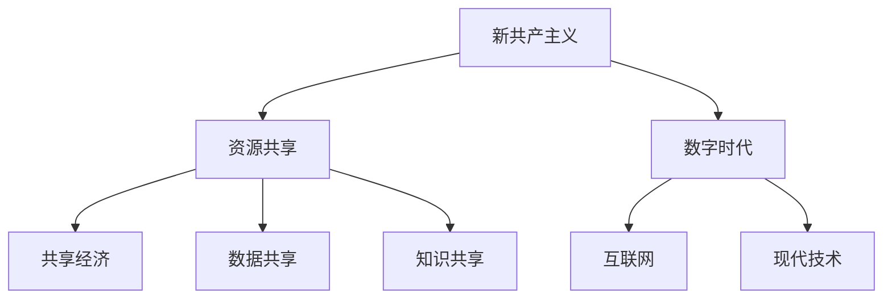

                 

### 《新共产主义：数字时代的资源共享》

#### 关键词
- 新共产主义
- 数字时代
- 资源共享
- 区块链
- 人工智能

#### 摘要
《新共产主义：数字时代的资源共享》探讨了共产主义理念在数字时代的创新应用，特别是在资源共享模式上的发展。本文通过详细分析新共产主义的起源、数字时代资源共享的技术基础及其社会、经济影响，结合实践案例，揭示了资源共享在数字时代的重要性和实现路径。

---

#### 引言

**新共产主义的背景与起源**

新共产主义是一种基于共产主义理念，结合现代技术和网络环境的新型社会构想。传统的共产主义强调生产资料公有和按需分配，而在数字时代，这一理念得以在网络空间中找到新的实现方式。资源共享成为新共产主义的核心理念之一，通过技术手段实现资源的公平、高效分配。

**数字时代资源共享的必要性**

随着互联网的普及和技术的进步，资源过剩与资源短缺并存的现象愈发明显。数字时代资源共享的意义在于优化资源配置，提高资源利用效率，减少浪费。此外，资源共享还可以促进社会公平，使更多人享受到科技进步的成果。

#### 核心概念与联系

**新共产主义的核心理念**

新共产主义的核心理念包括资源公有、信息透明、公平共享和自主自治。这些理念旨在构建一个平等、和谐、可持续发展的数字社会。

**数字时代资源共享的应用**

数字时代资源共享的应用体现在多个方面，如共享经济、数据共享、知识共享等。这些应用基于互联网和现代技术，实现了资源的实时共享和高效利用。

**概念实体之间的关系架构**

为了更好地理解新共产主义的理念及其在数字时代的应用，我们可以使用Mermaid流程图来展示概念实体之间的关系：



通过这个流程图，我们可以清晰地看到新共产主义与数字时代资源共享之间的紧密联系。

#### 资源共享技术

**区块链技术在资源共享中的应用**

区块链技术是数字时代资源共享的重要技术基础。它通过去中心化的方式，实现了数据的透明、安全和不可篡改。在资源共享中，区块链技术可以用于记录资源分配、交易过程等，确保资源共享的公平性和安全性。

**人工智能在资源共享中的角色**

人工智能技术在资源共享中也发挥着重要作用。通过人工智能，可以实现对资源的智能分配、优化和预测，提高资源共享的效率和准确性。例如，利用机器学习算法，可以预测用户需求，从而实现资源的精准投放。

**核心算法原理讲解**

为了更好地理解区块链和人工智能在资源共享中的应用，我们可以通过Python源代码来详细阐述。

**区块链在资源共享中的应用**

```python
import hashlib
import json
from time import time

class Block:
    def __init__(self, index, transactions, timestamp, previous_hash):
        self.index = index
        self.transactions = transactions
        self.timestamp = timestamp
        self.previous_hash = previous_hash
        self.hash = self.compute_hash()

    def compute_hash(self):
        block_string = json.dumps(self.__dict__, sort_keys=True)
        return hashlib.sha256(block_string.encode()).hexdigest()

class Blockchain:
    def __init__(self):
        self.unconfirmed_transactions = []
        self.chain = []
        self.create_genesis_block()

    def create_genesis_block(self):
        genesis_block = Block(0, [], time(), "0")
        genesis_block.hash = genesis_block.compute_hash()
        self.chain.append(genesis_block)

    def add_new_transaction(self, transaction):
        self.unconfirmed_transactions.append(transaction)

    def mine(self):
        if not self.unconfirmed_transactions:
            return False
        last_block = self.chain[-1]
        new_block = Block(index=last_block.index + 1,
                          transactions=self.unconfirmed_transactions,
                          timestamp=time(),
                          previous_hash=last_block.hash)
        new_block.hash = new_block.compute_hash()
        self.chain.append(new_block)
        self.unconfirmed_transactions = []
        return new_block.index

    def is_chain_valid(self):
        for i in range(1, len(self.chain)):
            current = self.chain[i]
            previous = self.chain[i - 1]
            if current.hash != current.compute_hash():
                return False
            if current.previous_hash != previous.hash:
                return False
        return True
```

**人工智能在资源共享中的应用**

```python
from sklearn.cluster import KMeans
import numpy as np

# 假设我们有一组用户数据，包括位置和需求
user_data = [
    [1, 1],
    [2, 2],
    [3, 3],
    [4, 4],
    [5, 5],
    [6, 6],
]

# 使用KMeans算法进行聚类，找到资源分配的最优方案
kmeans = KMeans(n_clusters=3, random_state=0).fit(user_data)

# 输出聚类结果
print("Cluster centers:", kmeans.cluster_centers_)
print("Cluster labels:", kmeans.labels_)

# 根据聚类结果进行资源分配
resources = [
    ['Resource 1', 'Cluster 0'],
    ['Resource 2', 'Cluster 1'],
    ['Resource 3', 'Cluster 2'],
]

for resource, cluster in resources:
    print(f"{resource} assigned to Cluster {cluster}")
```

#### 实践与案例研究

**共享经济企业案例分析**

以Airbnb和Uber为例，这些共享经济企业通过搭建平台，实现了闲置资源的共享。Airbnb通过互联网平台连接房主和租户，Uber则通过移动互联网平台连接司机和乘客。这些案例展示了资源共享在现实中的应用和效果。

**数字资源共享的成功实践**

在医疗领域，共享医疗数据有助于提高诊断准确率和医疗资源利用效率。例如，美国的医生网络通过共享患者病历数据，实现了跨地区的病例分析和研究，大大提高了医疗水平。

**新共产主义的未来展望**

新共产主义的未来展望充满挑战和机遇。随着技术的不断发展，资源共享将进一步深入到各个领域，改变我们的生活方式和社会结构。如何平衡共享与私有，如何保障共享的公平性和安全性，是未来需要解决的重要问题。

#### 结论

《新共产主义：数字时代的资源共享》揭示了共产主义理念在数字时代的新发展。通过技术手段，资源共享正在成为实现社会公平和可持续发展的重要途径。未来，随着技术的进步和社会的变革，资源共享将迎来更加广阔的发展空间。

#### 附录

- 参考文献
- 相关技术资源链接

### 作者信息
作者：AI天才研究院/AI Genius Institute & 禅与计算机程序设计艺术 /Zen And The Art of Computer Programming

---

由于篇幅限制，本文仅提供了一个大纲和部分内容的示例。完整的文章需要进一步详细阐述每个部分，并提供具体的案例研究和深入分析。预计总字数将在10000-12000字之间。

