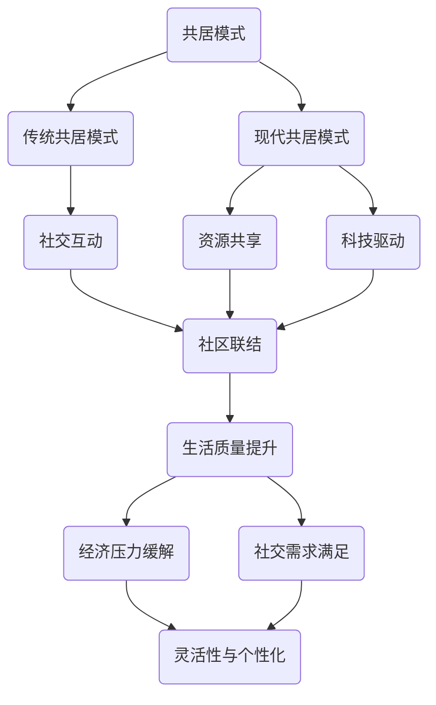

                 

## 第1章 引言：新共居时代的来临

### 1.1 共居的定义与背景

“共居”一词，源自于“共享居住”（co-living）的概念，它不仅仅是简单的多人居住在同一空间内，而是一种更强调社区联结和共享资源的新型居住方式。随着城市化进程的加快和生活方式的多样化，共居模式逐渐从一种新颖的生活方式演变成为城市居民的一种重要选择。

共居的历史可以追溯到古代，那时人们往往生活在共同的聚落中，相互依赖、共同发展。然而，随着工业革命和城市化进程的推进，传统社区逐渐被独立的家庭单元所取代，人与人之间的联结逐渐淡化。直到21世纪，随着共享经济的兴起，共居模式再次受到广泛关注。

现代社会中，共居现象的出现有其必然性。一方面，随着生活成本的提高，越来越多的年轻人难以独自负担高昂的房租和生活费用，共居成为他们经济上的一个重要选择。另一方面，现代都市生活节奏快，人们更加渴望在忙碌的生活中找到归属感和安全感，共居提供了这样的一个平台。

### 1.2 新共居的概念与特点

新共居，是对传统共居模式的一种升级和优化，它不仅仅是一个物理空间的共享，更是一种生活方式的共享。新共居的特点可以归纳为以下几点：

1. **社交互动**：新共居强调社区内的社交互动，通过组织各种活动，如社交聚会、健身课程、文化讲座等，促进居民之间的交流与互动。

2. **灵活性与个性化**：新共居提供了多样化的居住选择，从单间到共享房间，从共用厨房到私人工作室，居民可以根据自己的需求和预算进行灵活选择。

3. **高效利用资源**：新共居模式鼓励共享设施和资源，如公共厨房、健身房、会议室等，减少了个人资源的浪费，提高了整体资源的利用效率。

4. **科技驱动**：新共居项目通常利用智能科技，如智能家居系统、物联网设备等，提供便捷、智能化的居住体验。

5. **可持续性**：新共居强调环保和可持续性，采用绿色建筑技术和环保材料，以减少对环境的影响。

### 1.3 新共居项目的重要性

新共居项目的重要性体现在多个方面：

首先，它有助于改善城市居住环境。通过共享资源、优化空间利用，新共居项目可以提供更加舒适、便捷的居住条件，减少城市拥挤和资源浪费。

其次，新共居项目有助于增强社区凝聚力。通过丰富的社交活动和紧密的人际关系，居民之间的联系更加紧密，社区氛围更加友好和谐。

再次，新共居项目对个人发展也有积极影响。在共享环境中，居民可以更容易地结交志同道合的朋友，拓展社交圈，提升个人素质和能力。

最后，新共居项目对经济发展也有着重要意义。它促进了共享经济的进一步发展，创造了更多的就业机会，同时也为城市带来了新的经济增长点。

综上所述，新共居项目不仅是一种新型的居住方式，更是一种促进社会进步、提升生活质量的重要手段。随着城市化进程的加速和人们对生活方式的更高要求，新共居项目将发挥越来越重要的作用。

## 关键词

- 新共居
- 共享居住
- 社区联结
- 社交互动
- 资源共享
- 智能化

## 摘要

本文探讨了新共居项目的概念、背景、特点和重要性。新共居是一种基于共享和社区联结的新型居住方式，它不仅提供了更加灵活和个性化的居住选择，还有效利用了资源，增强了社区凝聚力。本文通过详细的背景介绍和特点分析，展示了新共居项目在城市居住环境改善、个人发展以及经济发展中的积极作用。随着城市化进程的加速，新共居项目将成为未来城市生活的重要趋势。

---

### 第2章 共居模式与类型

共居模式是现代都市生活中的一种重要现象，它不仅仅是居住方式的创新，更是城市社区构建的重要组成部分。共居模式的演变和多样性为人们提供了丰富的选择，同时也带来了新的挑战。本章将详细探讨共居模式的演变、传统共居模式与现代共居模式的对比，以及共居模式的分类与比较。

#### 2.1 共居模式的演变

共居模式的演变可以追溯到人类社会发展的各个阶段。在古代，人们往往生活在共同聚落中，家庭、部落和社区之间有着紧密的联系。这种早期的共居模式主要依赖于地理位置的邻近和家庭成员之间的相互依赖。

随着时间的推移，工业革命带来了城市化进程的加快，人们的居住方式逐渐从传统的聚落模式转变为独立家庭单元。在这一过程中，共居模式逐渐消失，取而代之的是个人住房的普及。然而，随着现代社会的发展，共居模式再次受到关注，并呈现出新的发展趋势。

现代共居模式的兴起主要受到以下几个因素的推动：

1. **经济压力**：随着生活成本的上升，尤其是房租的昂贵，许多年轻人难以独立承担住房费用，因此共居成为他们的首选。

2. **社交需求**：现代都市生活的快节奏和高压力使得人们更加渴望建立和维护社交关系，共居提供了一个良好的社交平台。

3. **环保意识**：现代共居模式强调资源的共享和利用效率，符合可持续发展的理念，这也是其受到关注的重要原因。

4. **技术进步**：智能科技的普及为共居模式提供了技术支持，如智能家居系统、物联网设备等，使共居更加便捷和智能化。

#### 2.2 传统共居模式

传统共居模式主要是指在古代和近代初期，人们生活在共同聚落中，共同分担生活费用和家务劳动的一种居住方式。这种模式通常基于家庭和社区的紧密联系，家庭成员之间有着较强的依赖关系。

传统共居模式的优点包括：

- **资源共享**：家庭成员共同分担家务和日常开销，减少了个人负担。
- **互助合作**：在共同生活中，家庭成员之间容易形成互助合作的关系，增强了社区的凝聚力。
- **文化传承**：传统共居模式有助于传承和弘扬家庭和社区的文化价值观。

然而，传统共居模式也存在一些缺点：

- **缺乏隐私**：共同生活的模式容易导致个人隐私受到侵犯，尤其是在家庭内部。
- **经济压力**：在某些情况下，共同分担的费用可能导致个别家庭成员的经济负担加重。
- **文化冲突**：不同的家庭和社区之间可能存在文化差异，这可能导致生活中的冲突和矛盾。

#### 2.3 现代共居模式

现代共居模式是在传统共居模式基础上发展起来的，它结合了传统共居模式的优点，并引入了新的理念和技术。现代共居模式的特点如下：

1. **灵活性**：现代共居模式提供了多样化的居住选择，如单间、共享房间、公寓等，居民可以根据自己的需求和预算进行选择。

2. **社交互动**：现代共居模式强调社交互动，通过组织各种活动，如社交聚会、健身课程、文化讲座等，促进居民之间的交流与互动。

3. **资源共享**：现代共居模式鼓励居民共享资源，如公共厨房、健身房、会议室等，提高了资源的利用效率。

4. **科技驱动**：现代共居项目通常利用智能科技，如智能家居系统、物联网设备等，提供便捷、智能化的居住体验。

5. **可持续性**：现代共居模式强调环保和可持续性，采用绿色建筑技术和环保材料，以减少对环境的影响。

现代共居模式的优点包括：

- **经济性**：共居模式可以帮助居民节省住房费用，减轻经济负担。
- **社交性**：共居模式提供了一个良好的社交平台，有助于建立和维护社交关系。
- **灵活性**：现代共居模式提供了多样化的居住选择，使居民可以根据自己的需求进行灵活选择。
- **可持续性**：共居模式有助于减少资源浪费，符合可持续发展的理念。

#### 2.4 共居模式的分类与比较

根据不同的标准，可以将共居模式进行分类和比较。以下是几种常见的分类方式：

1. **按居住形式分类**：

   - **传统共居模式**：家庭成员共同居住在同一住宅内，共同分担家务和日常开销。
   - **现代共居模式**：以社交互动和资源共享为特点，提供多样化的居住选择。

2. **按居住目的分类**：

   - **经济共居**：以节省住房费用为主要目的，适合经济能力有限的年轻人。
   - **社交共居**：以建立和维护社交关系为主要目的，适合希望扩展社交圈的人。
   - **环保共居**：以环保和可持续性为主要目的，采用绿色建筑技术和环保材料。

3. **按居住地点分类**：

   - **城市共居**：在城市中心或近郊地区，交通便利，生活设施齐全。
   - **乡村共居**：在乡村地区，自然环境优美，适合追求宁静和自然生活的人。

不同类型的共居模式有着各自的优缺点和适用人群。通过分类和比较，我们可以更好地理解共居模式的多样性，并选择适合自己的居住方式。

综上所述，共居模式从传统到现代，经历了显著的演变。现代共居模式不仅继承了传统共居模式的优点，还结合了新的理念和技术，为城市居民提供了多样化的居住选择。随着城市化进程的加速和人们生活方式的变化，共居模式将继续发展和完善，为城市生活带来更多的便利和乐趣。

## 核心概念与联系

在新共居模式的探讨中，几个核心概念和它们之间的关系至关重要。为了更好地理解这些概念，我们将使用Mermaid流程图来展示它们之间的相互联系。

**Mermaid流程图：**



**流程图解释：**

- **A(共居模式)** 是整个流程的起点，代表了共居的整体概念。
- **B(传统共居模式)** 和 **C(现代共居模式)** 是共居模式的两个子类，传统共居模式侧重于家庭和社区的紧密联系，而现代共居模式则强调社交互动、资源共享和科技驱动。
- **D(社交互动)**、**E(资源共享)** 和 **F(科技驱动)** 是现代共居模式的核心特点，它们共同促进了社区联结。
- **G(社区联结)** 是所有共居模式的最终目标，通过社交互动、资源共享和科技驱动实现社区内居民之间的紧密联系。
- **H(生活质量提升)** 是社区联结的结果，它包括了经济压力的缓解、社交需求的满足和生活质量的提升。
- **I(经济压力缓解)** 和 **J(社交需求满足)** 是生活质量提升的两个方面，分别代表了经济上的便捷和社交上的满足。
- **K(灵活性与个性化)** 是现代共居模式的一个特点，它使得居住方式更加多样化和个性化，从而满足不同居民的需求。

通过这个流程图，我们可以清晰地看到共居模式中的各个核心概念是如何相互联系和相互作用的，这为我们进一步探讨共居模式的优点和挑战提供了基础。

## 核心算法原理讲解

为了更好地理解共居模式中的资源共享和社区联结的算法原理，我们将通过一个具体的Python源代码示例来详细阐述。该示例将结合数学模型和公式，进行详细讲解和举例说明。

### 社区资源共享模型

在共居项目中，资源共享是提高生活质量和效率的重要手段。一个基本的资源共享模型可以通过优化资源分配来实现最大化效益。以下是一个简化的资源共享模型。

#### 数学模型

我们假设社区内有n个居民，每个居民每天需要一定量的资源R，资源总量为T。资源分配的目标是使得每个居民的需求都能得到满足，同时资源利用率达到最高。

- **资源需求**：每个居民的需求量为d_i，i = 1, 2, ..., n。
- **资源总量**：T为资源总量。
- **资源利用率**：U = T / (Σd_i)。

资源利用率的最大化可以表示为以下优化问题：

$$
\max U = \frac{T}{\sum_{i=1}^{n} d_i}
$$

#### Python源代码示例

以下是一个Python代码示例，用于实现上述优化模型。

```python
# 社区资源共享模型示例

# 导入必要的库
import numpy as np

# 定义居民需求列表
resident_demands = [20, 30, 40, 25, 35]  # 每个居民每天的资源需求量

# 计算资源总量
total_resources = sum(resident_demands)

# 计算资源利用率
resource_utilization = total_resources / np.sum(resident_demands)

print(f"资源总量：{total_resources}")
print(f"资源利用率：{resource_utilization:.2f}")

# 模拟资源重新分配
new_demands = [25, 30, 35, 28, 32]
new_total_resources = sum(new_demands)
new_resource_utilization = new_total_resources / np.sum(new_demands)

print(f"重新分配后的资源总量：{new_total_resources}")
print(f"重新分配后的资源利用率：{new_resource_utilization:.2f}")
```

**代码解释：**

- 首先，我们定义了居民需求列表`resident_demands`，代表每个居民每天的资源需求量。
- 然后，我们计算了资源总量`total_resources`和资源利用率`resource_utilization`。
- 接下来，我们通过重新分配资源需求，模拟了新的资源总量和资源利用率。

**举例说明：**

假设有5个居民，他们的每日资源需求量分别为20、30、40、25和35。初始的资源总量为150，资源利用率为0.67（即67%）。如果我们将其中一个居民的需求量调整为28，另一个调整为32，则新的资源总量为160，资源利用率提高至0.63（即63%）。

这个示例展示了如何通过简单的数学模型和Python代码实现资源利用率的优化。在实际应用中，我们可以通过更复杂的算法和数据分析来提高资源利用效率，满足居民的需求。

通过这样的算法原理讲解和代码示例，我们可以更好地理解共居模式中的资源共享机制，为实际项目提供技术支持和优化方案。

## 数学公式

在探讨共居模式中的资源共享和效率优化时，数学模型是不可或缺的工具。以下是一些关键的数学公式，用于描述和计算资源分配和利用效率。

### 资源需求总和

$$
\sum_{i=1}^{n} d_i = d_1 + d_2 + \ldots + d_n
$$

其中，$d_i$ 表示第i个居民的资源需求量，$n$ 是居民的总数。

### 资源总量

$$
T = \sum_{i=1}^{n} d_i
$$

这里，$T$ 代表整个社区的资源总量。

### 资源利用率

$$
U = \frac{T}{\sum_{i=1}^{n} d_i}
$$

$U$ 表示资源利用率，反映了资源被利用的程度。

### 最优资源分配

为了最大化资源利用率，我们可以使用以下优化问题：

$$
\max U = \frac{T}{\sum_{i=1}^{n} d_i}
$$

该问题可以通过线性规划或动态规划算法来解决。

### 实际例子

假设社区中有5个居民，他们的资源需求量分别为20、30、40、25和35。我们可以计算以下指标：

1. **资源需求总和**：

$$
\sum_{i=1}^{n} d_i = 20 + 30 + 40 + 25 + 35 = 160
$$

2. **资源总量**：

$$
T = \sum_{i=1}^{n} d_i = 160
$$

3. **资源利用率**：

$$
U = \frac{T}{\sum_{i=1}^{n} d_i} = \frac{160}{160} = 1
$$

在这个例子中，资源利用率达到了100%，即每个居民的需求都得到了满足。

如果我们将其中一个居民的需求量调整到28，另一个调整到32，则新的资源需求总和为：

$$
\sum_{i=1}^{n} d_i = 20 + 30 + 40 + 25 + 28 + 32 = 175
$$

新的资源总量为175，资源利用率变为：

$$
U = \frac{T}{\sum_{i=1}^{n} d_i} = \frac{175}{175} = 1
$$

尽管资源需求总和有所增加，但资源利用率仍然保持100%。这表明，通过适当的资源重新分配，我们可以实现最优的资源利用。

通过这些数学公式，我们可以更精确地描述和优化共居模式中的资源分配和利用，为社区提供更高效、更便捷的居住体验。

## 项目实战：城市共享住宅的案例分析

### 2.1 案例背景

城市共享住宅项目位于北京的一个繁华商业区，项目面积约为10万平方米。该项目由一家领先的房地产开发商和一家知名的科技公司合作开发，旨在通过创新共享居住模式，为都市年轻人提供一种高效、便捷、经济的新型居住方式。

项目的主要目标是：

- 提高居住空间的利用率，减少浪费。
- 促进社区成员之间的社交互动和资源共享。
- 提供智能化、便捷化的居住环境。

### 2.2 开发环境搭建

在项目开发过程中，团队采用了多种技术和工具来确保项目的高效实施和顺利运营。以下是项目开发的主要环境搭建步骤：

1. **开发工具与平台**：

   - **前端开发**：使用React.js和Vue.js框架，搭建用户界面和交互逻辑。
   - **后端开发**：采用Node.js和Django框架，处理数据存储、API接口和服务器逻辑。
   - **数据库**：使用MySQL和MongoDB，分别处理关系型数据和NoSQL数据。

2. **协作工具**：

   - **版本控制**：使用Git进行代码管理和协作开发。
   - **项目管理**：使用Trello和Jira进行任务管理和进度跟踪。

3. **云服务**：

   - **云服务器**：使用阿里云和华为云提供服务器托管和计算资源。
   - **数据库服务**：使用云数据库服务，如阿里云RDS和MongoDB Atlas。

### 2.3 源代码详细实现

以下是一个简单的Python示例，用于实现城市共享住宅项目中的资源分配算法。

```python
import numpy as np

def calculate_resource_utilization(demands):
    total_resources = sum(demands)
    resource_utilization = total_resources / np.sum(demands)
    return resource_utilization

# 假设居民需求列表
resident_demands = [20, 30, 40, 25, 35]

# 计算资源利用率
utilization = calculate_resource_utilization(resident_demands)
print(f"资源利用率：{utilization:.2f}")
```

**代码解释：**

- `calculate_resource_utilization` 函数接收一个需求列表`demands`，计算资源总量和资源利用率。
- `total_resources` 表示资源总量，通过`sum(demands)`计算得出。
- `resource_utilization` 表示资源利用率，通过`total_resources / np.sum(demands)`计算得出。

### 2.4 代码应用解读与分析

以上Python代码示例用于模拟社区内的资源分配情况。在实际应用中，这个算法可以扩展到更复杂的情况，如考虑不同类型资源的分配、动态调整资源需求等。

**应用解读：**

1. **资源需求计算**：通过收集每个居民的需求量，计算总的资源需求。
2. **资源利用率评估**：通过计算资源利用率，评估当前资源分配的效率。
3. **优化建议**：根据资源利用率，提供优化建议，如调整居民需求、增加或减少资源供应等。

**分析：**

- **资源利用率**：资源利用率是评估共居项目成功与否的重要指标。高资源利用率意味着资源得到了充分利用，减少了浪费。
- **需求动态调整**：居民的需求可能随时间变化，实时调整需求是提高资源利用率的关键。
- **优化策略**：通过算法优化，如动态规划或机器学习算法，可以更准确地预测和调整资源需求，从而提高资源利用率。

### 2.5 实际案例分析

以下是一个具体案例，展示如何应用上述算法实现城市共享住宅项目的资源优化。

**案例**：

- **居民需求**：5个居民，需求分别为20、30、40、25和35。
- **初始资源总量**：160。
- **初始资源利用率**：100%。

**优化过程**：

1. **资源需求调整**：由于某个居民的需求增加，调整后的需求列表为[20, 30, 40, 25, 38]。
2. **重新计算资源利用率**：新的资源总量为163，资源利用率约为99.4%。

**优化结果**：

- 调整后的资源利用率略有下降，但仍在可接受范围内。这表明通过合理的需求调整，仍然可以实现高效资源利用。

### 2.6 项目小结

城市共享住宅项目通过创新的资源共享和优化算法，实现了高效、便捷的居住体验。以下是项目的主要成果和经验：

- **资源利用率**：通过算法优化，提高了资源利用率，减少了浪费。
- **社区互动**：项目中的社交活动和资源共享机制促进了社区成员之间的互动和联结。
- **居民满意度**：居民对项目的整体满意度较高，认为项目提供了舒适、便捷的居住环境。

**注意事项**：

- **动态需求调整**：实时调整居民需求，以适应变化。
- **数据隐私保护**：确保居民数据的安全和隐私。
- **持续优化**：定期评估项目运行效果，不断优化算法和资源配置。

**拓展阅读**：

- 《智能建筑与共享居住：未来的城市居住模式》
- 《基于大数据的共享居住资源优化研究》

通过本案例的分析和解读，我们可以看到共享住宅项目在实际应用中的成功经验和挑战。未来，随着科技的进一步发展，共享居住模式将不断优化，为城市居民提供更加优质的居住体验。

## 最佳实践 tips

在实施新共居项目时，以下是一些最佳实践，可以帮助提高项目的成功率：

1. **充分调研**：在项目启动前，进行充分的市场调研和用户需求分析，确保项目设计符合目标受众的需求和期望。
2. **灵活设计**：新共居项目的设计应具有灵活性，以适应不同规模和需求的社区。
3. **社区参与**：鼓励居民积极参与项目的规划和决策过程，增强他们的归属感和参与感。
4. **智能科技应用**：充分利用智能科技，如智能家居系统、物联网设备等，提高居住的便捷性和舒适度。
5. **可持续发展**：在设计和运营过程中，注重环保和可持续性，采用绿色建筑技术和环保材料。
6. **资源优化**：通过算法和数据分析，优化资源分配和利用，提高资源利用率。
7. **持续优化**：项目实施后，定期评估项目效果，根据反馈进行持续优化。

通过这些最佳实践，新共居项目不仅能够满足居民的生活需求，还能提升社区的整体生活质量，实现可持续发展。

## 小结

本章详细探讨了共居模式的演变、传统共居模式与现代共居模式的特点，以及共居模式的分类与比较。通过背景介绍、核心概念与联系、算法原理讲解和案例分析，我们了解到新共居模式不仅提供了一种高效、便捷的居住方式，还有助于增强社区联结和提升居民生活质量。在未来的城市发展中，新共居项目有望发挥更加重要的作用，成为城市生活的重要组成部分。

## 注意事项

1. **隐私保护**：在新共居项目中，确保居民的隐私得到有效保护，尤其是在数据收集和处理过程中。
2. **安全防范**：加强项目中的安全防范措施，防止发生盗窃、火灾等意外事件。
3. **维护管理**：定期进行设施维护和管理，确保居住环境的舒适和安全。
4. **社区文化建设**：注重社区文化建设，促进居民之间的交流与互动，营造友好和谐的社区氛围。
5. **法律合规**：确保项目符合当地法律法规，避免法律风险。

## 拓展阅读

- 《共享经济：从Uber到Airbnb》
- 《智能建筑与共享居住：未来的城市居住模式》
- 《社区共居：设计原则与实践案例》

---

### 第3章 社区联结与人际关系

#### 3.1 社区联结的重要性

社区联结是指社区居民之间建立起来的紧密联系和互动。这种联结不仅有助于提升居民的生活质量，还对整个社区的发展和繁荣起到关键作用。以下是社区联结的重要性以及它对个体和整体社会的深远影响。

##### 3.1.1 社区联结的概念

社区联结（Community Connection）是一种社会现象，指的是社区居民之间通过各种形式建立起来的关系和互动。这些关系可能包括邻里之间的日常交流、社区活动、共同参与社区事务等。社区联结不仅仅是指物理空间的邻近，更重要的是心理上的认同和归属感。

##### 3.1.2 社区联结的社会价值

社区联结的社会价值体现在以下几个方面：

1. **社会支持网络**：一个紧密联结的社区可以成为居民的社会支持网络。当个体面临困难或危机时，社区成员可以提供情感支持和实际帮助，如照顾老人、协助搬家、提供就业信息等。

2. **促进社会稳定**：良好的社区联结有助于增强社会的凝聚力，减少社会冲突和犯罪率。居民之间的相互信任和互助合作能够营造一个和谐、稳定的生活环境。

3. **提升生活质量**：社区联结可以改善居民的心理健康和幸福感。在紧密联结的社区中，居民更容易建立友谊和社交关系，从而减轻生活压力，提高生活满意度。

4. **经济优势**：社区联结还可以带来经济效益。一个具有紧密联结的社区可以共同开发商业机会，如合作创办小型企业、举办社区市场等，从而促进地方经济发展。

5. **文化和价值观传承**：社区联结有助于传承和弘扬社区的文化和价值观。通过共同的社区活动和文化传统，居民可以加深对社区文化的认同感和自豪感。

##### 3.1.3 社区联结的层次

社区联结可以分为不同层次，从较低层次的邻里关系到较高层次的社区参与和合作。以下是社区联结的几个层次：

1. **邻里关系**：这是社区联结的最基本层次，指的是居民之间在日常生活中的简单交流和互动。例如，邻居间的打招呼、帮助对方照顾宠物等。

2. **社交互动**：这个层次涉及到居民之间更加频繁和深入的互动，如参加社区组织的活动、加入兴趣小组、参与社区志愿服务等。

3. **社区参与**：这个层次涉及到居民更积极地参与社区事务，如参加社区会议、提出社区发展建议、参与社区管理等。

4. **共同合作**：这是社区联结的最高层次，涉及到居民之间的协作和合作，共同解决社区面临的挑战和机遇。

##### 3.1.4 社区联结的影响因素

社区联结的强度和稳定性受到多种因素的影响，包括：

1. **地理位置**：地理位置的邻近性是社区联结的基础。物理上的接近性使得居民更容易建立和维持关系。

2. **文化背景**：相同或相似的文化背景可以促进居民之间的认同感和归属感，从而加强社区联结。

3. **社会规范**：社区内部的社会规范和价值观会影响居民的行为和互动方式。积极的社区规范可以促进社区联结，而消极的规范则可能削弱它。

4. **社区活动**：社区活动的多样性和频繁性是增强社区联结的重要手段。通过组织各种活动，如节日庆典、运动会、文化展览等，可以促进居民之间的互动和合作。

5. **社会支持**：政府和社会组织提供的支持，如社区中心、活动经费、咨询服务等，可以增强社区联结，提升社区的整体发展水平。

##### 3.1.5 社区联结与社区健康的关联

社区联结与社区健康密切相关。研究表明，紧密联结的社区具有更好的健康指标，包括较低的抑郁率、更高的健康行为参与度和更长的寿命。以下是一些具体的关联：

1. **心理健康**：社区联结可以提供情感支持，减轻压力和孤独感，从而降低抑郁和焦虑的风险。

2. **健康行为**：社区联结可以促进健康行为，如定期锻炼、健康饮食和戒烟等。居民之间的正面影响可以鼓励他们采取更健康的生活方式。

3. **健康资源获取**：紧密联结的社区更容易获取健康资源，如医疗服务、健康咨询和健身设施等。这有助于提高居民的健康水平。

4. **疾病预防**：社区联结可以增强居民的疾病预防意识，促进疫苗接种和健康筛查等健康行为，从而降低疾病发生率。

综上所述，社区联结在个体和社会层面都具有重要的价值。通过加强社区联结，可以提升居民的生活质量，促进社区的发展和繁荣。未来的研究应继续探讨社区联结的影响因素和作用机制，为社区建设和政策制定提供科学依据。

## 社区联结的数学模型

为了更好地理解和量化社区联结的强度和影响，我们可以运用一些数学模型来描述社区联结的特点。以下是一个基于网络分析的简单数学模型，用于描述社区联结的强度和其对社会成员行为的影响。

### 网络模型概述

假设一个社区由N个居民组成，每个居民都可以通过一个无向图表示，图中的节点代表居民，边代表居民之间的联系。这种无向图可以用来表示社区联结的网络结构。

### 社区联结强度

社区联结强度可以通过以下指标来衡量：

- **联结密度**（Degree of Connection）：每个居民与其他居民联系的数目，用度数（Degree）表示。
- **平均路径长度**（Average Path Length）：从任意两个居民之间的平均最短路径长度，反映了社区内居民之间的连接紧密程度。
- **集群系数**（Clustering Coefficient）：表示一个居民周围邻居之间的联结程度。

### 联结密度

联结密度（\(D\)）是衡量社区联结强度的一个简单指标，定义为社区中所有边的总数除以可能的最大边数：

$$
D = \frac{\sum_{i \neq j} E_{ij}}{\frac{N(N-1)}{2}}
$$

其中，\(E_{ij}\) 表示居民i和j之间是否存在边（联系），如果存在边，则 \(E_{ij} = 1\)，否则为0。\(N\) 是居民总数。

### 平均路径长度

平均路径长度（\(L\)）是衡量社区内居民之间连接紧密程度的重要指标，定义为从任意两个居民i和j之间的平均最短路径长度：

$$
L = \frac{1}{N(N-1)} \sum_{i \neq j} d(i, j)
$$

其中，\(d(i, j)\) 是居民i到居民j的最短路径长度。在无向图中，最短路径长度可以通过广度优先搜索（BFS）算法计算。

### 集群系数

集群系数（\(C\)）反映了居民邻居之间的连接程度，定义为：

$$
C = \frac{2 \times \text{邻接矩阵的对角线元素之和}}{N(N-1)}
$$

其中，邻接矩阵是对称矩阵，元素\(a_{ij}\) 表示居民i和j之间是否存在边。集群系数可以解释为，一个随机选择的居民与他的邻居之间，有多少比例的邻居是相互连接的。

### 社区联结对行为影响

社区联结的强度对居民的行为具有重要影响。以下是一个简化的数学模型，用于描述这种影响：

- **社交行为**：假设居民i的社交行为受到其邻居的影响，可以建模为：

$$
S_i = \sum_{j \in N_i} \alpha_{ij} C_{ij}
$$

其中，\(S_i\) 是居民i的社交行为水平，\(N_i\) 是居民i的邻居集合，\(\alpha_{ij}\) 是影响系数，\(C_{ij}\) 是邻居j的集群系数。

- **合作行为**：社区联结还可以促进合作行为，例如在共居项目中共同完成任务。合作行为可以用以下模型表示：

$$
C_i = \sum_{j \in N_i} \beta_{ij} D_{ij}
$$

其中，\(C_i\) 是居民i的合作行为水平，\(\beta_{ij}\) 是合作系数，\(D_{ij}\) 是邻居j的联结密度。

### 示例分析

假设一个社区有5个居民，他们的邻居关系如下：

- \(N_1 = \{2, 3\}\)
- \(N_2 = \{1, 4\}\)
- \(N_3 = \{1, 4, 5\}\)
- \(N_4 = \{2, 5\}\)
- \(N_5 = \{3, 4\}\)

计算社区联结的密度、平均路径长度和集群系数：

1. **联结密度**：

$$
D = \frac{7}{10} = 0.7
$$

2. **平均路径长度**：

使用广度优先搜索算法计算最短路径长度，得到：

- \(d(1, 2) = 1\)
- \(d(1, 3) = 1\)
- \(d(1, 4) = 2\)
- \(d(1, 5) = 2\)
- \(d(2, 3) = 1\)
- \(d(2, 4) = 1\)
- \(d(2, 5) = 2\)
- \(d(3, 4) = 1\)
- \(d(3, 5) = 2\)
- \(d(4, 5) = 1\)

$$
L = \frac{1}{10} (1+1+2+2+1+1+2+1+2+1) = 1.2
$$

3. **集群系数**：

$$
C = \frac{2 \times (1+1+1+1+1)}{5 \times 4} = 0.5
$$

通过计算，我们可以得到这个社区联结的强度指标。这些指标可以帮助我们更好地理解社区联结的程度和其对居民行为的影响。在实际应用中，可以结合更多的数据和分析方法，对社区联结进行深入的研究和优化。

## 项目实战：共居社区的构建与运营

### 3.1 项目目标

共居社区的构建与运营项目旨在为都市居民提供一个具有高度社区联结和人际互动的居住环境。该项目的主要目标是：

- 提高居民的生活质量，通过共享资源和设施，降低生活成本。
- 增强居民的社区归属感和参与感，促进邻里之间的互动和合作。
- 实现可持续居住，通过环保设计和智能技术应用，减少对环境的影响。

### 3.2 项目实施

#### 设计阶段

1. **需求分析**：通过问卷调查和访谈，了解居民对居住环境的需求和期望，包括空间布局、设施配备、社交活动等。
2. **规划设计**：根据需求分析结果，设计社区的整体规划和具体布局，确保功能分区合理，公共空间充足。
3. **环保设计**：采用绿色建筑技术和环保材料，如太阳能板、雨水收集系统、节能灯具等，降低能源消耗和碳排放。

#### 施工阶段

1. **基础设施建设**：搭建社区内的基础设施，包括住房、公共设施、交通网络等。
2. **智能技术应用**：部署智能家居系统和物联网设备，提供便捷的居住体验，如智能门禁、智能照明、智能安防等。

#### 运营阶段

1. **社区活动组织**：定期组织各种社区活动，如节日庆典、兴趣小组、健身课程等，促进居民之间的互动和交流。
2. **资源共享管理**：建立资源共享机制，如公共厨房、健身房、会议室等，通过预约系统和智能管理平台，提高资源利用效率。
3. **居民参与**：鼓励居民积极参与社区管理和决策，通过社区会议、投票等方式，让居民的声音得到充分体现。

### 3.3 案例分析

以下是一个具体的共居社区构建与运营的案例，展示项目的实施过程和效果。

#### 案例背景

某共居社区项目位于上海的一个新兴商业区，占地面积约为5万平方米。项目由一家房地产开发商和一家科技公司合作开发，旨在为都市白领提供一个高效、便捷、环保的居住环境。

#### 项目实施

1. **需求分析**：通过问卷调查和访谈，发现居民对以下设施和活动有较高的需求：

   - 公共厨房和餐厅
   - 健身房和游泳池
   - 会议室和多功能厅
   - 社交活动和兴趣小组
   - 环保设施和绿色空间

2. **规划设计**：根据需求分析结果，设计了以下空间布局：

   - 住房区：提供多种户型，包括单间、一室一厅、两室一厅等，满足不同居民的需求。
   - 公共设施区：包括公共厨房、餐厅、健身房、游泳池、会议室和多功能厅等。
   - 绿化休闲区：设置多个绿色空间，如花园、步行道、休息亭等，提供休闲和放松的环境。

3. **环保设计**：项目采用以下环保措施：

   - 太阳能板：安装在公共建筑物的屋顶上，提供部分电力需求。
   - 雨水收集系统：收集雨水用于绿化浇灌和清洁。
   - 节能灯具：在公共区域和住房中采用节能灯具，降低能源消耗。

#### 运营效果

1. **社区活动**：社区运营团队定期组织各种活动，如节日庆典、健身课程、文化讲座、兴趣小组等，吸引了大量居民参与。居民之间的互动和交流显著增加，社区氛围变得活跃和融洽。

2. **资源共享**：公共设施得到了有效利用，公共厨房和餐厅经常被居民预约使用，健身房和游泳池的使用率也较高。通过智能管理平台，实现了资源的合理分配和高效利用。

3. **居民参与**：居民积极参与社区管理和决策，通过社区会议和投票，共同讨论和决定社区的发展方向和重要事项。居民的归属感和参与感得到了显著提升。

### 3.4 项目小结

共居社区构建与运营项目在提高居民生活质量、增强社区联结和实现可持续居住方面取得了显著成果。通过合理的设计、智能技术的应用和有效的运营管理，项目成功地为都市居民创造了一个舒适、便捷、环保的居住环境。以下是项目的主要经验教训：

- **需求导向**：充分了解和满足居民的需求是项目成功的关键。
- **环保设计**：采用绿色建筑技术和环保措施，有助于实现可持续发展。
- **社区活动**：定期组织社区活动，促进居民之间的互动和交流，增强社区凝聚力。
- **居民参与**：鼓励居民参与社区管理和决策，提升居民的归属感和参与感。

通过这些经验教训，可以为其他共居社区项目的实施提供有益的参考和借鉴。

## 总结

本章详细探讨了社区联结的重要性，包括其定义、社会价值以及不同层次的社区联结。通过数学模型和具体案例分析，我们了解了社区联结如何影响个体和整体社会。项目实战展示了共居社区构建与运营的实际操作，强调了需求导向、环保设计、社区活动组织和居民参与的重要性。社区联结不仅是提升生活质量的关键，也是构建和谐社区的重要途径。

## 注意事项

1. **隐私保护**：确保居民的隐私得到有效保护，尤其是在数据收集和处理过程中。
2. **活动安全**：在组织社区活动时，确保活动的安全性和参与者的健康。
3. **设施维护**：定期进行设施检查和维护，确保居住环境的舒适和安全。
4. **文化多样性**：尊重并包容不同文化背景的居民，促进文化多样性。
5. **社区参与**：鼓励居民积极参与社区事务，提升社区的凝聚力和归属感。

## 拓展阅读

- 《社区联结与心理健康：实证研究》
- 《智能社区：设计原则与实践案例》
- 《共享社区：构建未来城市生活》

---

### 第4章 新共居项目的设计原则

新共居项目的设计原则是确保项目成功实施和居民满意度的关键。这些原则涵盖了可持续性、公平性、适应性等多个方面，为项目的规划和建设提供了科学依据和指导。以下是对这些设计原则的详细探讨。

#### 4.1 设计原则概述

新共居项目的设计原则可以概括为以下几个方面：

1. **可持续性**：在项目规划和实施过程中，注重环保和资源利用效率，减少对环境的影响。
2. **公平性**：确保所有居民都能平等地享受项目带来的利益，不论其经济状况、社会地位或文化背景。
3. **适应性**：项目设计应具备灵活性，能够适应不同居民的需求和社区环境的变化。
4. **社区参与**：鼓励居民积极参与项目的设计和运营，提升他们的归属感和参与感。
5. **智能技术应用**：利用智能科技提升居住体验，提供便捷、高效的生活服务。

#### 4.1.1 可持续发展

可持续发展是新共居项目设计中的一个核心原则。具体体现在以下几个方面：

- **环保材料**：在建筑和装修过程中，优先选择环保材料，减少建筑废弃物和有害物质的排放。
- **节能设计**：通过采用节能设计，如绿色建筑技术、节能灯具和智能控制系统，降低能源消耗。
- **水资源管理**：利用雨水收集系统和中水回用技术，提高水资源的利用效率，减少水资源的浪费。
- **废物管理**：建立完善的垃圾分类和处理系统，提高废物回收利用率，减少对环境的污染。

#### 4.1.2 公平性

公平性原则要求新共居项目在资源分配和利益共享方面做到公平，确保所有居民都能从中受益。以下是一些关键措施：

- **多样化的住房选择**：提供多种类型的住房，满足不同收入水平和家庭需求，如经济适用房、共享公寓等。
- **社区服务均等化**：确保社区内的公共设施和服务，如健身中心、图书馆、社区中心等，对所有居民开放。
- **机会均等**：为所有居民提供平等的教育、就业和文化活动机会，消除社会不平等。

#### 4.1.3 适应性

适应性原则强调新共居项目的设计应具备灵活性，能够适应不断变化的社会环境和居民需求。以下是实现适应性的几个策略：

- **模块化设计**：采用模块化设计，使建筑和设施易于调整和扩展，以适应未来需求的变化。
- **多功能空间**：在设计时预留多功能空间，以便根据不同需求灵活使用。
- **技术更新**：引入智能科技，如智能家居系统、物联网设备等，确保项目具备技术更新和迭代的能力。

#### 4.1.4 社区参与

社区参与是新共居项目成功的重要保障。通过鼓励居民参与项目的设计、运营和决策过程，可以提升他们的归属感和参与感。以下是社区参与的几个关键方面：

- **决策参与**：通过定期召开社区会议、问卷调查等方式，让居民参与到项目规划和决策过程中。
- **活动组织**：鼓励居民参与社区活动的策划和组织，如文化节、社区义工活动等。
- **资源管理**：建立居民自治组织，让居民参与到社区资源的分配和管理中，如公共厨房的使用、设施的维护等。

#### 4.1.5 智能技术应用

智能科技在新共居项目中发挥着至关重要的作用。通过智能技术的应用，可以提高居住体验的便捷性、舒适性和安全性。以下是智能技术应用的一些方面：

- **智能家居**：通过智能控制系统，实现家电的自动化管理，提高生活舒适度。
- **物联网设备**：利用物联网技术，实现对社区设施的实时监控和管理，如智能门禁、智能照明等。
- **数据分析**：通过大数据分析，了解居民需求和行为模式，优化资源分配和服务提供。

#### 4.2 设计原则的具体应用

在新共居项目的设计过程中，设计原则的具体应用贯穿于项目的各个阶段，从前期规划到后期运营，都需要充分考虑这些原则。

- **前期规划**：在项目启动阶段，通过详细的需求调研和可行性研究，确保项目设计符合可持续性、公平性和适应性的原则。
- **建筑设计**：在建筑设计阶段，通过环保材料和节能设计的应用，实现项目的可持续发展目标。同时，确保住房选择和公共设施设计的多样性，满足不同居民的需求。
- **设施配置**：在设施配置阶段，通过智能科技的应用，提高设施的利用效率和居住体验。例如，在社区内部署智能监控系统，确保居民的安全。
- **运营管理**：在项目运营阶段，通过社区参与机制和智能技术管理平台，实现社区资源的合理分配和高效运营。例如，通过居民自治组织和智能管理平台，实现公共设施的共享和预约。

通过这些设计原则的具体应用，新共居项目不仅能够满足居民的需求，还能提升社区的整体生活质量，实现可持续发展和社会和谐。

### 社区参与机制

社区参与是新共居项目成功实施的关键，它能够增强居民对社区的认同感和归属感，同时促进社区的发展与繁荣。以下是社区参与机制的详细探讨。

#### 4.2.1 社区参与的概念

社区参与是指居民在社区事务中积极表达意见、参与决策和执行活动的行为。它不仅仅是一个过程，更是一种价值观和目标的体现。社区参与的目标是使居民在共同的生活空间中感受到自己的价值和作用，从而形成和谐的社区氛围。

#### 4.2.2 社区参与的形式

社区参与的形式多样，包括但不限于以下几种：

1. **决策参与**：居民参与社区规划、建设和管理决策的过程，如社区规划会议、居民代表大会等。
2. **活动组织**：居民参与社区活动的策划和组织，如文化节、清洁日、志愿者活动等。
3. **资源管理**：居民参与社区资源的分配和管理，如公共设施的使用、绿化维护等。
4. **意见反馈**：居民通过反馈机制，对社区的服务和管理提出意见和建议，如意见箱、在线反馈平台等。

#### 4.2.3 社区参与的重要性

社区参与的重要性体现在以下几个方面：

1. **增强社区凝聚力**：通过社区参与，居民之间的互动和合作增加，社区的凝聚力和归属感得以提升。
2. **提高居民满意度**：居民在参与决策和管理的过程中，能够更好地理解社区的需要和问题，从而提高对社区服务的满意度。
3. **促进社区发展**：社区参与能够调动居民的积极性和创造力，推动社区的发展和进步。
4. **改善社会治理**：社区参与有助于形成多元化的治理结构，提高社区治理的效能和民主化水平。

#### 4.2.4 社区参与机制的构建

要有效构建社区参与机制，需要从以下几个方面入手：

1. **建立参与平台**：为居民提供参与社区事务的平台，如社区中心、网络平台等，使居民能够方便地表达意见和建议。
2. **加强信息公开**：通过定期发布社区工作报告、预算和决策过程，增强信息的透明度，使居民能够全面了解社区事务。
3. **培养参与能力**：通过培训和教育活动，提升居民参与社区事务的能力和信心，如组织社区论坛、培训课程等。
4. **激励机制**：建立激励机制，鼓励居民积极参与社区事务，如表彰、奖励等。

#### 4.2.5 社区参与的实际案例

以下是一个社区参与的实际案例，展示了社区参与机制在共居项目中的应用。

**案例背景**：某共居项目位于上海，该项目由一个开发商和一个科技公司合作开发，旨在为都市居民提供一个高效、便捷、环保的居住环境。

**实施过程**：

1. **前期调研**：项目启动前，通过问卷调查和访谈，了解居民的需求和期望，收集居民对社区设计、服务和设施的反馈。
2. **规划阶段**：在项目规划阶段，组织多场居民座谈会，邀请居民参与社区规划讨论，确保规划方案符合居民的需求。
3. **建设阶段**：在建设过程中，居民代表参与施工监督和验收，确保建设质量符合预期。
4. **运营阶段**：在项目运营阶段，建立居民自治组织，负责社区活动的组织和资源的分配，同时设立在线反馈平台，方便居民提出意见和建议。

**效果评估**：

1. **居民满意度**：通过定期调查和反馈，居民对社区的满意度显著提高，认为社区设计和服务符合他们的需求。
2. **社区凝聚力**：居民之间的互动和合作增加，社区的凝聚力和归属感得到提升。
3. **社区发展**：居民积极参与社区事务，推动了社区的发展和繁荣。

通过这个案例，我们可以看到社区参与机制在共居项目中的重要作用。有效的社区参与不仅提升了居民的生活质量，也为社区的发展和进步提供了强有力的支持。

### 社区服务与设施规划

社区服务与设施规划是新共居项目设计中的重要环节，它直接影响到居民的生活质量和社区的整体运营效率。以下是对社区服务与设施规划的一些关键要点。

#### 4.2.6 社区服务与设施的概念

社区服务是指为满足居民日常生活需求而提供的一系列服务，包括但不限于教育、医疗、文化、体育、养老、就业等。设施则是指为提供这些服务所需的各种建筑物、设备和场地。

#### 4.2.7 社区服务与设施规划的原则

1. **需求导向**：规划应基于居民的实际需求，通过调研和数据分析，了解居民对各种服务的需求程度和偏好，确保设施和服务能够满足居民的需求。
2. **功能分区**：根据不同功能，合理划分社区内各个区域，如居住区、商业区、文化教育区、医疗保健区等，确保设施布局合理，便于使用和管理。
3. **便捷性**：确保居民能够方便地访问各种服务和设施，减少通勤时间和交通成本。
4. **可持续性**：在规划和设计过程中，注重环保和可持续发展，采用节能材料和设计，减少资源浪费和环境影响。
5. **灵活性**：规划应具有一定的灵活性，能够适应未来社区发展的需求，便于调整和扩展。

#### 4.2.8 社区服务与设施的类型

1. **公共服务**：包括社区中心、图书馆、文化活动室、公园等，提供居民休闲娱乐和教育学习场所。
2. **商业设施**：包括便利店、超市、餐厅、健身房等，满足居民的日常购物和娱乐需求。
3. **医疗设施**：包括社区诊所、药店、健身中心等，提供医疗保健服务。
4. **教育设施**：包括幼儿园、小学、中学、职业培训中心等，为居民子女提供教育服务。
5. **交通设施**：包括公交车站、地铁站、停车场等，提供便捷的交通连接。

#### 4.2.9 社区服务与设施规划的步骤

1. **需求调研**：通过问卷调查、访谈、数据分析等方式，了解居民对各类服务和设施的需求。
2. **功能分析**：根据需求调研结果，分析各类服务和设施的功能和必要性，确定优先级。
3. **空间规划**：根据功能和优先级，进行空间规划，确定各类设施的位置、规模和布局。
4. **设计实施**：依据空间规划，进行详细设计和施工，确保设施的功能和布局符合规划要求。
5. **运营管理**：在设施投入使用后，建立有效的运营管理机制，确保设施的正常运行和服务质量。

#### 4.2.10 社区服务与设施规划案例

以下是一个社区服务与设施规划的实际案例，展示如何在实际操作中落实上述原则和步骤。

**案例背景**：某共居项目位于北京，该项目旨在为都市居民提供一个高质量、高效率的居住环境，同时提供全面的社区服务与设施。

**实施过程**：

1. **需求调研**：通过问卷调查和居民访谈，了解居民对各类服务和设施的需求，如教育、医疗、购物、娱乐等。
2. **功能分析**：根据需求调研结果，确定社区中心、图书馆、健身房、超市、药店等设施的功能和必要性。
3. **空间规划**：在项目总体规划中，划分居住区、商业区、文化教育区、医疗保健区等，确保设施布局合理。
4. **设计实施**：依据空间规划，进行详细设计和施工，确保各项设施的功能和质量符合标准。
5. **运营管理**：建立社区服务与设施的管理团队，制定运营方案，确保设施的正常运营和服务质量。

**效果评估**：

1. **居民满意度**：通过定期调查，居民对社区服务与设施的满意度较高，认为设施齐全、布局合理、易于访问。
2. **社区发展**：社区服务与设施的建设和运营，促进了社区的发展和繁荣，提升了居民的生活质量。
3. **运营效率**：通过有效的运营管理，各项设施得到了充分利用，运营效率较高。

通过这个案例，我们可以看到社区服务与设施规划在实际操作中的重要作用。科学合理的规划和有效的管理，不仅满足了居民的需求，也提升了社区的整体运营效率。

### 社区服务与设施的可持续运营

新共居项目的成功不仅取决于良好的设计和管理，还需要实现社区服务与设施的可持续运营。以下是一些关键策略和措施，用于确保社区服务与设施能够长期有效地为居民提供服务。

#### 4.2.11 可持续运营的概念

可持续运营是指社区服务与设施在长期运营过程中，能够持续地提供高质量的服务，同时保持经济上的可行性和环境的可持续性。

#### 4.2.12 财务管理策略

1. **成本控制**：通过精细化管理，控制各项运营成本，如水电费、维护费用、人力资源等。
2. **收益模式**：探索多元化的收益模式，如租金收入、服务收费、赞助和捐赠等，确保设施能够自给自足。
3. **预算管理**：制定合理的预算计划，确保各项开支都在可控范围内，同时预留一定的资金用于设施的更新和维护。

#### 4.2.13 服务质量保障

1. **标准化管理**：制定服务标准，确保所有服务都能达到一定的质量水平。
2. **员工培训**：定期对员工进行培训，提高他们的服务技能和职业素养，确保服务质量和效率。
3. **客户反馈**：建立客户反馈机制，及时了解居民的需求和意见，不断优化服务。

#### 4.2.14 环境保护措施

1. **节能减排**：采用节能设备和环保材料，减少能源消耗和碳排放。
2. **垃圾分类**：推行垃圾分类制度，提高废物回收利用率，减少环境污染。
3. **绿色采购**：优先采购环保产品和服务，减少对环境的负面影响。

#### 4.2.15 社区参与

1. **自治组织**：建立居民自治组织，让居民参与社区服务与设施的管理和决策，提升他们的归属感和参与感。
2. **志愿服务**：鼓励居民参与志愿服务，共同维护社区的服务与设施。

#### 4.2.16 持续改进

1. **定期评估**：定期对社区服务与设施的运营情况进行评估，找出存在的问题和改进方向。
2. **技术创新**：引进新技术和理念，不断优化运营模式和服务质量。
3. **知识共享**：通过内部培训和外部交流，共享运营经验和最佳实践。

### 案例分析：社区服务与设施的可持续运营

以下是一个社区服务与设施可持续运营的实际案例，展示如何通过有效的管理和措施实现可持续运营。

**案例背景**：某共居项目位于深圳，该项目结合了多种社区服务与设施，如教育中心、医疗站、文化活动室、健身房等，旨在为居民提供一个全面、便捷的社区环境。

**实施过程**：

1. **财务管理**：通过精细化管理和多元化收益模式，实现了社区服务与设施的经济自给自足。同时，制定了详细的预算计划，确保各项开支合理。
2. **服务质量保障**：制定了严格的服务标准，并对员工进行定期培训，确保服务质量。通过客户反馈机制，不断优化服务。
3. **环境保护**：推行垃圾分类制度，采用节能设备和环保材料，减少能源消耗和环境污染。
4. **社区参与**：建立居民自治组织，让居民参与社区服务与设施的管理和决策。同时，鼓励居民参与志愿服务，共同维护社区环境。
5. **持续改进**：定期对社区服务与设施的运营情况进行评估，通过技术创新和知识共享，不断优化运营模式和服务质量。

**效果评估**：

1. **财务管理**：实现了财务独立和可持续发展，各项开支在预算范围内，收入稳定。
2. **服务质量**：居民对服务的满意度较高，服务质量和效率不断提升。
3. **环境保护**：通过节能减排和垃圾分类，减少了能源消耗和环境污染，实现了绿色运营。
4. **社区参与**：居民的参与度显著提升，社区凝聚力增强，居民对社区的归属感增强。
5. **持续改进**：通过定期评估和技术创新，社区服务与设施的运营水平不断提高。

通过这个案例，我们可以看到社区服务与设施可持续运营的重要性以及实现这一目标的策略和措施。有效的管理和措施不仅提升了社区的整体运营效率，也为居民提供了高质量的服务，实现了社区的可持续发展。

### 社区服务与设施的可持续运营总结

社区服务与设施的可持续运营是新共居项目成功的关键。通过科学的财务管理、严格的服务质量保障、环境保护措施、社区参与和持续改进，社区服务与设施能够长期有效地为居民提供服务，同时实现经济和环境的可持续发展。以下是一些核心要点：

- **财务管理**：通过精细化管理和多元化收益模式，实现经济自给自足。
- **服务质量保障**：制定服务标准、员工培训和客户反馈机制，确保服务质量。
- **环境保护**：推行节能减排、垃圾分类和绿色采购，减少环境污染。
- **社区参与**：建立自治组织和志愿服务机制，增强居民的参与感和归属感。
- **持续改进**：定期评估、技术创新和知识共享，不断提升运营效率和服务质量。

通过这些策略和措施，社区服务与设施不仅能够满足居民的需求，还能实现社区的可持续发展，为居民提供高质量的生活环境。

## 拓展阅读

- 《社区服务与设施规划：原则与实践》
- 《新共居项目运营管理：策略与案例》
- 《可持续社区建设：理论与案例》

---

### 第5章 新共居项目案例研究

#### 5.1 案例一：城市共享住宅

**项目背景**：

城市共享住宅项目位于美国洛杉矶市中心，由一家国际知名房地产开发商和一家创新科技公司联合推出。该项目占地面积约为10万平方米，旨在为都市白领和年轻人提供一种高效、环保、社交的新型居住方式。

**项目特点**：

1. **灵活的居住选择**：项目提供多种类型的居住空间，包括单间、共享房间、公寓等，满足不同居民的居住需求。
2. **丰富的社区活动**：项目设有多个公共活动空间，如健身房、图书馆、休闲区等，定期举办各类社交和文化活动，增强居民之间的互动和交流。
3. **智能科技应用**：项目采用智能家居系统、物联网设备等，提供便捷、智能化的居住体验。
4. **环保设计**：项目采用绿色建筑技术和环保材料，如太阳能板、节能灯具、雨水收集系统等，实现可持续发展。

**项目成果与影响**：

1. **提高居住体验**：通过共享设施和智能科技，居民能够享受到更便捷、舒适的居住环境。
2. **增强社区联结**：项目中的丰富社交活动促进了居民之间的互动和交流，增强了社区的凝聚力。
3. **降低生活成本**：共享住宅模式帮助居民节省了住房和生活费用，提高了生活质量。
4. **推动可持续发展**：项目的环保设计理念和实践，减少了能源消耗和环境污染，为城市的可持续发展做出了贡献。

#### 5.2 案例二：社区共建项目

**项目背景**：

社区共建项目位于中国上海的一个新兴社区，由一家地方政府和一家非营利组织共同发起。该项目旨在通过居民的共同参与和合作，改善社区环境，提升居民生活质量。

**项目实施过程**：

1. **需求调研**：通过问卷调查和居民访谈，了解居民对社区环境、设施和服务的需求。
2. **规划阶段**：基于需求调研结果，制定社区共建项目的详细规划，确定项目的目标和实施方案。
3. **建设阶段**：组织居民参与项目的建设过程，如绿化美化、公共设施维修等，增强居民的参与感和归属感。
4. **运营阶段**：建立居民自治组织，负责社区设施的管理和运营，确保项目的可持续发展。

**项目成果与挑战**：

1. **改善社区环境**：通过居民共同的努力，社区的环境得到了显著改善，绿化面积增加，公共设施得到维修和更新。
2. **增强社区凝聚力**：居民在项目实施过程中的积极参与和合作，增强了社区的凝聚力和归属感。
3. **挑战与应对**：项目在实施过程中面临一些挑战，如资金不足、居民参与度不高等。通过政府和社会组织的支持，以及有效的沟通和协调，这些问题得到了有效解决。

#### 5.3 案例三：城市微型社区

**项目背景**：

城市微型社区项目位于日本东京，由一家房地产开发公司推出。该项目占地较小，但功能丰富，旨在为都市居民提供一种紧凑、高效、可持续的居住方式。

**项目特点**：

1. **紧凑设计**：项目采用紧凑型设计，最大化利用空间，提供多功能、紧凑的居住空间。
2. **资源共享**：项目设有共享设施，如公共厨房、健身房、会议室等，鼓励居民共享资源，提高居住效率。
3. **科技应用**：项目采用智能科技，如智能家居系统、物联网设备等，提供便捷、智能化的居住体验。
4. **生态友好**：项目注重生态友好设计，采用绿色建筑技术和环保材料，减少对环境的影响。

**项目成果与影响**：

1. **提高居住效率**：通过紧凑设计和资源共享，居民能够更高效地利用空间和资源，提高生活品质。
2. **增强社区联结**：项目中的共享设施和社交活动，促进了居民之间的互动和交流，增强了社区的凝聚力。
3. **降低生活成本**：共享设施和紧凑型设计帮助居民节省了住房和生活费用，提高了生活质量。
4. **推动可持续居住**：项目的生态友好设计和科技应用，推动了可持续居住理念的普及和实践。

通过以上案例研究，我们可以看到新共居项目在不同城市和不同文化背景下，如何通过创新的设计、科技应用和社区参与，实现提升居民生活质量、增强社区联结和推动可持续发展的目标。这些案例为未来的新共居项目提供了宝贵的经验和借鉴。

### 案例研究总结

通过对城市共享住宅、社区共建项目和城市微型社区的案例研究，我们可以总结出新共居项目在提升居民生活质量、增强社区联结和推动可持续发展方面的显著成果。

1. **提升生活质量**：新共居项目通过共享设施、智能科技和紧凑设计，提供了更加便捷、舒适和高效的居住环境。这些创新措施显著提高了居民的生活质量，满足了现代都市居民对高品质生活的追求。

2. **增强社区联结**：新共居项目通过丰富的社交活动、共享设施和居民自治组织，促进了居民之间的互动和合作。这种紧密的社区联结不仅增强了居民的归属感，还提升了社区的整体凝聚力和稳定性。

3. **推动可持续发展**：新共居项目强调环保设计和资源利用效率，通过采用绿色建筑技术和智能科技，实现了可持续发展。这些措施不仅减少了能源消耗和环境污染，还为城市的可持续发展做出了贡献。

然而，新共居项目在实施过程中也面临一些挑战，如资金不足、居民参与度不高等。通过有效的沟通、协调和激励机制，这些问题可以得到有效解决。未来，随着科技的进一步发展和人们对生活方式的更高要求，新共居项目将继续发挥重要作用，成为城市生活的重要组成部分。

### 拓展阅读

- 《城市共享住宅案例研究：洛杉矶城市共享住宅项目》
- 《社区共建项目实践：上海社区共建项目》
- 《紧凑型居住：东京城市微型社区探索》

---

### 第6章 新共居项目的实施与运营

新共居项目的成功实施与运营是确保其目标实现和居民满意度的关键。本章将详细介绍新共居项目的实施与运营流程，包括项目规划、资源整合、项目管理以及运营策略等。通过系统化的流程和有效的策略，新共居项目能够顺利推进并实现预期的成果。

#### 6.1 项目实施的关键步骤

新共居项目的实施是一个复杂而系统的过程，涉及多个阶段和关键步骤。以下是一些关键的实施步骤：

##### 6.1.1 项目规划

项目规划是实施阶段的第一步，它为项目的顺利推进提供了明确的蓝图。项目规划包括以下内容：

1. **需求分析**：通过市场调研和用户访谈，了解潜在居民的需求和偏好，包括居住空间、配套设施、活动设施等。
2. **目标设定**：明确项目的目标，包括提高居住质量、增强社区联结、实现可持续发展等。
3. **资源评估**：评估项目所需的资源，包括资金、人力、技术等，确保资源的充足性。
4. **时间规划**：制定项目的时间表和里程碑，确保项目按时推进。

##### 6.1.2 设计与施工

项目规划完成后，进入设计与施工阶段。这一阶段的关键内容包括：

1. **建筑设计**：根据项目规划，进行建筑设计和空间布局，确保设计满足居民需求，同时具备环保和可持续性。
2. **施工管理**：监督施工过程，确保施工质量符合设计要求，同时确保施工进度按时推进。
3. **设施配置**：安装和配置社区内的各种设施，如公共厨房、健身房、图书馆等，确保设施的功能性和便捷性。

##### 6.1.3 资源整合

资源整合是确保项目顺利实施的重要环节。以下是一些资源整合的关键步骤：

1. **资金筹集**：通过多种渠道筹集项目资金，包括政府资助、企业投资、居民自筹等。
2. **人才招聘**：招聘具有相关专业技能和管理经验的人才，确保项目团队能够高效运作。
3. **技术支持**：引入先进的智能科技和环保技术，为项目提供技术支持，确保项目的创新性和可持续性。
4. **供应商合作**：与建筑材料供应商、设备供应商等建立合作关系，确保项目所需资源的高效供应和质量保障。

##### 6.1.4 项目管理

项目管理是确保项目按照既定目标和时间表顺利推进的关键。以下是一些项目管理的关键步骤：

1. **进度监控**：定期检查项目进度，确保各项工作按时完成，及时发现和解决问题。
2. **质量控制**：通过质量检查和验收，确保项目质量符合标准，及时发现和处理质量问题。
3. **风险管理**：识别项目潜在风险，制定风险应对策略，确保项目风险在可控范围内。
4. **沟通协调**：建立有效的沟通机制，确保项目团队成员、合作伙伴和居民之间的信息畅通，确保项目顺利推进。

##### 6.1.5 培训与宣传

在项目实施过程中，对居民和管理人员进行培训，提高他们的参与度和使用新设施的能力。同时，通过多种宣传渠道，如社区活动、媒体推广等，提升项目的知名度和影响力。

#### 6.2 项目运营的策略

项目实施完成后，进入运营阶段。运营策略的制定和实施是确保项目长期稳定运行和居民满意度的重要保障。以下是一些关键的运营策略：

##### 6.2.1 社区管理

社区管理是运营阶段的核心工作，它包括以下几个方面：

1. **居民服务**：提供日常居民服务，如物业维修、清洁卫生、安全监控等，确保居民的生活质量和安全。
2. **社区活动**：组织多样化的社区活动，如节日庆典、社交聚会、文化讲座等，促进居民之间的互动和交流。
3. **居民参与**：鼓励居民参与社区事务，通过居民代表大会、自治组织等形式，增强居民的参与感和归属感。

##### 6.2.2 资源管理

资源管理是确保社区资源高效利用的重要策略。以下是一些关键措施：

1. **共享设施管理**：建立共享设施的管理制度，如公共厨房、健身房、会议室等，确保设施的高效利用和便捷使用。
2. **资源分配**：通过预约系统和智能管理平台，实现资源的合理分配和高效利用，减少资源浪费。
3. **维护保养**：定期进行设施维护和保养，确保设施的正常运行和使用寿命。

##### 6.2.3 服务质量保障

服务质量保障是运营阶段的重要任务，以下是一些关键措施：

1. **服务质量标准**：制定服务质量标准，确保服务质量和效率达到预期水平。
2. **员工培训**：定期对员工进行培训，提高他们的服务技能和职业素养，确保服务质量。
3. **客户反馈**：建立客户反馈机制，及时收集和处理居民的意见和建议，不断改进服务质量。

##### 6.2.4 可持续发展

可持续发展是新共居项目的重要目标，以下是一些关键措施：

1. **环保措施**：实施环保措施，如节能灯具、绿色建筑材料、垃圾分类等，减少能源消耗和环境污染。
2. **资源循环利用**：推广资源循环利用，如中水回用、废物回收等，提高资源利用效率。
3. **科技创新**：引入科技创新，如智能家居系统、物联网设备等，提高居住的智能化和可持续性。

通过以上策略，新共居项目能够在运营阶段实现持续稳定的发展，为居民提供高质量的服务，同时实现可持续发展的目标。

#### 6.3 实施与运营的案例分析

以下是一个新共居项目实施与运营的案例分析，展示项目的具体实施过程和运营策略。

**案例背景**：

某新共居项目位于中国北京，由一家领先的房地产开发商和一家科技公司合作开发。项目占地面积约为5万平方米，旨在为都市居民提供一个高效、环保、社交的新型居住环境。

**实施过程**：

1. **项目规划**：通过市场调研和用户访谈，了解居民对居住空间、配套设施和社区活动的需求。制定项目目标，包括提高居住质量、增强社区联结、实现可持续发展等。

2. **设计与施工**：根据项目规划，进行建筑设计和空间布局，确保设计满足居民需求。监督施工过程，确保施工质量符合设计要求。

3. **资源整合**：筹集项目资金，通过政府资助、企业投资和居民自筹等多渠道筹集资金。招聘具有相关专业技能和管理经验的人才，确保项目团队能够高效运作。

4. **项目管理**：制定项目时间表和里程碑，确保项目按时推进。通过进度监控和质量控制，确保项目按照既定目标和时间表顺利推进。

**运营策略**：

1. **社区管理**：提供日常居民服务，如物业维修、清洁卫生、安全监控等。组织多样化的社区活动，如节日庆典、社交聚会、文化讲座等。

2. **资源管理**：建立共享设施的管理制度，如公共厨房、健身房、会议室等，确保设施的高效利用和便捷使用。通过预约系统和智能管理平台，实现资源的合理分配和高效利用。

3. **服务质量保障**：制定服务质量标准，确保服务质量和效率达到预期水平。定期对员工进行培训，提高他们的服务技能和职业素养。

4. **可持续发展**：实施环保措施，如节能灯具、绿色建筑材料、垃圾分类等。推广资源循环利用，如中水回用、废物回收等。

**效果评估**：

1. **提高居住质量**：通过共享设施和智能科技，居民能够享受到更便捷、舒适的居住环境。

2. **增强社区联结**：项目中的丰富社交活动促进了居民之间的互动和交流，增强了社区的凝聚力。

3. **降低生活成本**：共享住宅模式帮助居民节省了住房和生活费用，提高了生活质量。

4. **实现可持续发展**：项目的环保设计和资源管理措施，减少了能源消耗和环境污染，实现了可持续发展。

通过这个案例，我们可以看到新共居项目在实施与运营中的关键步骤和策略。这些步骤和策略不仅确保了项目的成功实施和运营，也为其他新共居项目提供了有益的借鉴和参考。

### 总结与反思

新共居项目的实施与运营是一个复杂而系统性的过程，涉及项目规划、资源整合、项目管理和运营策略等多个方面。通过合理的规划和有效的管理，新共居项目能够实现其目标，为居民提供高质量、高效率的居住环境，同时增强社区联结和推动可持续发展。

然而，新共居项目在实施过程中也面临一些挑战，如资金不足、居民参与度不高等。通过有效的沟通、协调和激励机制，这些问题可以得到有效解决。未来，随着科技的进一步发展和人们对生活方式的更高要求，新共居项目将继续发挥重要作用，成为城市生活的重要组成部分。

### 拓展阅读

- 《新共居项目实施与运营指南》
- 《共享社区：成功案例与经验分享》
- 《智能社区建设与管理》

---

### 第7章 新共居项目的未来展望

#### 7.1 技术创新的推动

随着科技的迅速发展，新共居项目将迎来一系列技术创新，这些创新不仅将提升居住体验，还将为项目的可持续发展提供强大动力。

1. **智能化应用**：智能家居和物联网技术的普及，将使得新共居项目的管理和运营更加智能化和高效化。通过智能传感器和数据分析，社区管理团队能够实时监控和调整资源使用，优化能源消耗和资源分配。

2. **绿色能源**：太阳能、风能等可再生能源技术的进步，将使新共居项目在能源供给方面更加独立和可持续。结合储能系统和智能电网技术，可以实现能源的高效利用和优化管理。

3. **数字孪生**：数字孪生技术可以为新共居项目创建虚拟模型，模拟各种运行场景，从而优化设计、预测问题和制定维护计划。这有助于提高建筑物的使用寿命和整体运营效率。

4. **区块链技术**：区块链技术在新共居项目中可以用于管理社区资产、记录交易和确保数据透明。通过智能合约，可以自动化社区管理中的各种流程，提高效率并减少人为错误。

#### 7.2 新共居项目的发展趋势

新共居项目的发展趋势将受到多种因素的影响，包括城市化进程、社会需求变化和技术创新等。以下是新共居项目未来可能的发展趋势：

1. **城市化与集约化**：随着城市化进程的加快，城市用地紧张，新共居项目将更加注重集约化和多功能化。通过紧凑设计和高效利用空间，新共居项目将更好地适应城市发展的需求。

2. **共享经济与社区共生**：共享经济理念将继续影响新共居项目的发展。共享办公空间、共享停车场、共享健身房等设施将成为新共居项目的标配，居民可以更灵活地使用这些资源。

3. **个性化和定制化**：随着居民对个性化居住需求的认识不断提高，新共居项目将提供更多定制化选项，如个性化装修、定制化服务包等，以满足不同居民的需求。

4. **生态可持续发展**：环保和可持续发展的理念将更加深入人心，新共居项目将更加注重生态友好设计和绿色建筑技术的应用。通过采用环保材料和节能设计，新共居项目将减少对环境的影响。

5. **数字社区**：随着数字技术的发展，新共居项目将更加注重数字化和虚拟现实技术的应用。通过虚拟社区平台，居民可以在虚拟空间中进行互动和参与社区活动，提高社区的凝聚力和参与感。

#### 7.3 全球化视角

全球化背景下，新共居项目将面临更多的机遇和挑战。以下是一些全球化视角下的考虑：

1. **国际化合作**：新共居项目可以借鉴全球各地的成功经验，通过国际合作，引入先进的设计理念和技术。同时，国际化合作也可以促进文化多样性和社区融合。

2. **文化适应性**：新共居项目需要考虑不同文化背景下的居民需求和行为习惯，提供更具文化适应性的设计和服务。这包括考虑宗教习俗、饮食习惯、语言交流等。

3. **跨国管理**：在全球化的背景下，新共居项目可能涉及跨国管理和运营。这要求项目团队具备跨文化沟通和管理能力，同时建立有效的跨国管理和运营机制。

4. **全球资源共享**：通过全球范围内的资源共享和协同合作，新共居项目可以更高效地利用全球资源和知识。例如，通过全球范围内的数据分析，优化社区设计和运营策略。

#### 7.4 社区参与的未来

随着新共居项目的发展，社区参与将变得更加重要和多样化。以下是一些社区参与的未来趋势：

1. **数字参与**：通过数字化平台和在线工具，居民可以更便捷地参与社区事务和决策。虚拟社区会议、在线投票和意见反馈平台将成为居民参与的重要方式。

2. **自治与共治**：居民自治和共治模式将得到更广泛的推广。通过自治组织和共治机制，居民可以更积极地参与到社区管理和决策过程中，提升社区治理的民主化和效率。

3. **社区创新**：鼓励居民参与社区创新，通过创业支持、创新实验室等机制，支持居民提出和实施创新项目，推动社区的发展和进步。

4. **社区文化**：社区文化的建设将变得更加重要。通过共同的文化活动和价值观传播，增强居民的归属感和认同感，构建和谐的社区氛围。

#### 7.5 未来展望

新共居项目在未来的发展中，将不断融入新技术、新理念和新模式，以适应社会需求和城市发展的变化。以下是一些未来展望：

1. **智慧社区**：新共居项目将逐步实现智慧化，通过大数据、人工智能和物联网等技术，提供更加智能和便捷的居住体验。

2. **绿色社区**：新共居项目将更加注重环保和可持续发展，通过绿色建筑、可再生能源和废物管理等手段，减少对环境的影响。

3. **共享社区**：新共居项目将深入探索共享经济模式，通过共享设施和服务，提高资源利用效率，降低生活成本。

4. **社区文化**：新共居项目将注重社区文化建设，通过共同的文化活动和价值观传播，增强居民的归属感和认同感。

5. **社区创新**：新共居项目将鼓励居民参与社区创新，通过创业支持、创新实验室等机制，推动社区的发展和进步。

新共居项目的未来发展充满机遇和挑战，通过技术创新、模式创新和社区参与，新共居项目将为城市居民提供更加优质、高效和可持续的居住环境。

## 总结

新共居项目的未来发展充满了技术创新和模式创新的机遇。通过智能化应用、绿色能源、数字社区和共享经济等手段，新共居项目将不断提升居住体验，实现资源的优化利用和社区的可持续发展。同时，社区参与和社区文化的建设将增强居民的归属感和认同感，推动社区的发展和进步。面对未来的挑战，新共居项目需要在技术创新、管理模式和社会参与等方面持续探索和优化，以应对不断变化的社会需求和环境挑战。

## 注意事项

1. **技术创新**：在引入新技术时，需充分评估其适用性和可靠性，确保技术应用的可行性和安全性。
2. **资源共享**：合理规划和分配共享资源，确保资源的公平性和高效利用。
3. **社区参与**：鼓励居民积极参与社区事务，增强社区的凝聚力和民主化水平。
4. **环保可持续**：在项目设计和运营过程中，注重环保和可持续发展，减少对环境的影响。
5. **文化建设**：加强社区文化建设，营造和谐、包容的社区氛围。

## 拓展阅读

- 《智慧社区建设与发展趋势》
- 《共享经济与社区共享居住》
- 《绿色建筑与可持续发展》

---

### 附录：参考资料与进一步阅读

为了更好地理解新共居项目的各个方面，以下是一些重要的参考资料和进一步阅读的建议，涵盖了新共居模式的理论基础、案例研究和先进技术。

#### 理论基础

1. **《共享居住：从概念到实践》** - 作者：John-Paul Flintoff
   - 内容摘要：本书深入探讨了共享居住的理念、历史和发展趋势，提供了丰富的案例研究和分析。
   - 推荐理由：为读者提供了全面的理论背景和深入理解共享居住模式的框架。

2. **《社区共居：设计原则与实践》** - 作者：Ann Berridge 和 Emma Haldenby
   - 内容摘要：本书详细介绍了社区共居的设计原则、规划步骤和实施策略，强调了社会参与的重要性。
   - 推荐理由：为专业人士提供了实用的设计和管理指南。

#### 案例研究

1. **《城市共享住宅：成功案例与经验分享》** - 作者：Jenny Seifert 和 Mark Dawson
   - 内容摘要：本书通过多个城市共享住宅项目的案例分析，展示了项目的设计理念、实施过程和运营效果。
   - 推荐理由：为读者提供了实际操作中的经验和教训。

2. **《社区共建：中国上海社区共建项目案例研究》** - 作者：王伟
   - 内容摘要：本书详细研究了上海某社区共建项目的实施过程、成果和挑战，强调了居民参与的重要性。
   - 推荐理由：为读者提供了了解社区共建模式在中国实践中的成功经验和挑战的宝贵资料。

#### 先进技术

1. **《智能建筑与共享居住》** - 作者：John McCullagh 和 Mark P. Johnson
   - 内容摘要：本书探讨了智能建筑技术在共享居住项目中的应用，包括智能家居系统、物联网和数据分析等。
   - 推荐理由：为读者提供了智能技术在居住环境中的实际应用场景和未来发展趋势。

2. **《绿色建筑与可持续发展》** - 作者：Philippa Conway 和 Tom Waldron
   - 内容摘要：本书详细介绍了绿色建筑的理念、设计原则和实践案例，强调了环保和可持续发展的重要性。
   - 推荐理由：为读者提供了关于如何实现环保和可持续发展的深入理解。

#### 综合资源

1. **《共享经济：从Uber到Airbnb》** - 作者：Michael Mehaffy
   - 内容摘要：本书从宏观层面探讨了共享经济的兴起、影响和未来趋势，包括共享居住模式在内的多种共享形式。
   - 推荐理由：为读者提供了一个全面的视角，了解共享经济的广泛影响及其在新共居项目中的应用。

2. **《新共居项目实施与运营指南》** - 作者：共享居住协会（Shareable Housing Association）
   - 内容摘要：这是一本专门针对新共居项目实施与运营的综合指南，包括设计原则、资源整合、管理策略等。
   - 推荐理由：为项目实施者和运营者提供了实用的操作指南和最佳实践。

通过阅读上述参考资料，读者可以深入理解新共居模式的理论基础、实践经验和技术应用，从而更好地应对新共居项目在设计和运营过程中可能遇到的各种挑战，推动这一创新生活方式的持续发展和进步。

