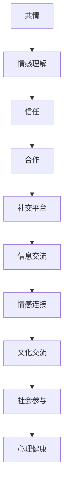

                 

# 《新共情时代社交平台：促进跨文化理解的工具》

## 关键词
社交平台、共情时代、跨文化理解、互动工具、文化工具、语言工具、评估与反馈

## 摘要
随着全球化进程的加快，共情时代已经成为当今社会的重要特征。社交平台作为连接人们情感和思维的纽带，在促进跨文化理解方面发挥着关键作用。本文将从共情时代的背景与特点、社交平台的发展历程、核心功能与运营策略、促进跨文化理解的工具，以及成功案例分析等方面，详细探讨新共情时代社交平台如何成为促进跨文化理解的强大工具。

---

## 《新共情时代社交平台：促进跨文化理解的工具》目录大纲

### 第一部分：共情时代与社交平台

#### 第1章：共情时代的背景与特点
##### 1.1 共情时代的起源
##### 1.2 共情与社交的关系
##### 1.3 社交平台在共情时代的地位

#### 第2章：社交平台的发展历程
##### 2.1 早期社交平台的诞生
##### 2.2 社交平台的演变
##### 2.3 当前社交平台的主要形式

#### 第3章：共情时代社交平台的核心功能
##### 3.1 共情互动功能
##### 3.2 跨文化沟通功能
##### 3.3 社交平台的价值创造

#### 第4章：共情时代社交平台的运营策略
##### 4.1 内容策略
##### 4.2 用户策略
##### 4.3 营销策略

### 第二部分：促进跨文化理解的工具

#### 第5章：语言工具
##### 5.1 翻译工具
##### 5.2 语言学习工具
##### 5.3 语言障碍与解决方法

#### 第6章：文化工具
##### 6.1 文化交流平台
##### 6.2 文化知识库
##### 6.3 跨文化意识培养

#### 第7章：互动工具
##### 7.1 虚拟现实工具
##### 7.2 虚拟助手与AI交互
##### 7.3 多媒体互动工具

#### 第8章：跨文化理解评估与反馈
##### 8.1 评估指标体系
##### 8.2 反馈机制
##### 8.3 跨文化理解提升策略

### 第三部分：案例研究

#### 第9章：成功案例分析
##### 9.1 案例一：某全球社交平台的跨文化沟通实践
##### 9.2 案例二：某语言学习平台的跨文化教育实践
##### 9.3 案例三：某虚拟现实平台的跨文化体验设计

#### 第10章：未来展望
##### 10.1 共情时代社交平台的趋势
##### 10.2 跨文化理解工具的创新方向
##### 10.3 挑战与机遇

### 附录A：共情时代社交平台相关资源
##### A.1 开源软件与工具
##### A.2 行业报告与论文
##### A.3 教育与培训资源

---

### 第1章：共情时代的背景与特点

#### 1.1 共情时代的起源

共情（Empathy）是一种心理过程，指的是个体能够从他人的视角出发，理解并感受他人的情感与体验。共情时代的起源可以追溯到人类文明的发展历程，但随着科技、通信和全球化进程的加速，共情的重要性愈发凸显。

在过去的几千年里，人们主要通过面对面的交流来建立共情。然而，随着互联网的普及，人们的生活发生了翻天覆地的变化。社交平台成为连接个体之间情感和思维的桥梁，使得共情不再局限于面对面交流，而是扩展到了全球范围内。

#### 1.2 共情与社交的关系

共情与社交密切相关。共情是社交的核心，它使得个体能够理解他人的感受，从而建立起信任和合作关系。在社交平台上，共情的作用更为明显，因为它使得用户能够跨越地域和文化障碍，建立起跨国界的社交关系。

共情时代的社交平台不仅提供信息交流的渠道，更成为人们表达情感、分享生活、建立信任和形成社区的重要场所。因此，共情与社交的关系是共情时代社交平台发展的重要基石。

#### 1.3 社交平台在共情时代的地位

在共情时代，社交平台不仅是人们日常生活的组成部分，更成为促进社会和谐、推动文化交融的重要工具。以下是一些社交平台在共情时代的重要地位：

1. **促进情感连接**：社交平台帮助人们跨越时空，建立起情感上的联系。这种情感连接是共情的基础，使得人们能够更好地理解彼此。
   
2. **推动文化交流**：社交平台为不同文化背景的人们提供了交流的平台，有助于消除文化偏见和误解，促进文化理解与融合。

3. **支持社会参与**：社交平台鼓励用户参与公共事务、分享观点和表达情感，有助于提升社会的民主参与度和透明度。

4. **促进心理健康**：社交平台为用户提供了一个表达情感、寻求支持和获得慰藉的空间，有助于改善心理健康。

总之，社交平台在共情时代扮演着不可或缺的角色，它不仅改变了人们的社交方式，更成为促进跨文化理解和社会和谐的重要工具。

#### 图 1.1 共情与社交的关系

#### 1.4 社交平台的发展历程

社交平台的发展历程可以分为以下几个阶段：

1. **早期社交平台**：1990年代，互联网刚刚兴起，早期的社交平台如Friendster和MySpace，主要提供用户间的基本联系和交流功能。

2. **社交媒体时代**：2000年代，社交媒体平台如Facebook、Twitter和Instagram，开始广泛应用，人们开始分享生活、表达情感和建立社交网络。

3. **移动社交时代**：随着智能手机的普及，移动社交平台如微信、WhatsApp和微信，使得社交变得更加便捷和实时。

4. **共情社交时代**：近年来，社交平台开始注重共情功能，如情绪识别、情感互动和心理健康支持，以满足用户在共情时代的需求。

### 第2章：社交平台的发展历程

#### 2.1 早期社交平台的诞生

早期的社交平台起源于20世纪90年代，当时互联网刚刚开始普及。这些平台的主要功能是帮助用户建立联系、分享信息和进行基本的社交互动。

**Friendster**（2003年）：作为第一个真正意义上的社交网络平台，Friendster允许用户创建个人资料、添加好友和分享信息。它的成功引发了社交网络的热潮。

**MySpace**（2003年）：MySpace是另一个早期社交平台的代表，它以其自定义的个人主页和音乐分享功能而闻名。MySpace曾一度成为全球最大的社交网络平台。

这些早期社交平台的出现，为后来的社交媒体时代奠定了基础。它们的主要特点包括用户个人资料的建立、好友关系的建立和信息分享等。

#### 2.2 社交平台的演变

随着时间的推移，社交平台的功能和形式不断演变。2000年代是社交媒体的黄金时代，许多新的平台涌现，并对人们的社交习惯产生了深远影响。

**Facebook**（2004年）：Facebook是这一时期最具代表性的社交平台。它引入了新闻源、动态更新、点赞和分享等功能，使得社交互动变得更加丰富和多样化。Facebook的成功引发了其他社交平台的模仿和竞争。

**Twitter**（2006年）：Twitter以其简洁的140个字符限制和实时更新功能而著称。Twitter鼓励用户快速分享观点和新闻，成为信息传播的重要渠道。

**Instagram**（2010年）：Instagram是一个以图片和视频为中心的社交平台。它使得用户能够通过视觉内容进行表达和互动，成为社交媒体视觉化的代表。

这些平台的演变，不仅改变了人们的社交方式，也推动了社交媒体的多样化和个性化。

#### 2.3 当前社交平台的主要形式

当前，社交平台的形式更加多样化和专业化，主要可以分为以下几类：

1. **通用社交平台**：如Facebook、Instagram和微信等，这些平台面向广泛的用户群体，提供全面的社交功能。

2. **专业社交平台**：如LinkedIn、GitHub和Dribbble等，这些平台专注于特定领域，为专业人士提供交流、分享和招聘的机会。

3. **垂直社交平台**：如Tinder、Bumble和Hinge等，这些平台专注于约会和交友，为用户提供特定的社交场景。

4. **即时通讯平台**：如WhatsApp、微信和Telegram等，这些平台以即时通讯为核心，提供文字、语音和视频聊天功能。

5. **内容分享平台**：如YouTube、Reddit和Medium等，这些平台以内容分享为核心，鼓励用户生成和分享各种类型的内容。

这些不同类型的社交平台，满足了用户在共情时代多样化的社交需求，共同推动了社交平台的发展。

### 第3章：共情时代社交平台的核心功能

#### 3.1 共情互动功能

在共情时代，社交平台的核心功能之一是提供共情互动的机会。这些功能不仅帮助用户建立情感上的联系，还促进了彼此的理解和信任。

**情绪识别**：许多社交平台引入了情绪识别技术，通过分析用户的文字、语音和表情，识别用户的情绪状态。例如，Facebook的Emotion AI项目就是通过分析用户的帖子、评论和互动，识别用户的情绪，并据此推荐相关的内容。

**情感互动**：社交平台通过聊天、评论、点赞和分享等功能，鼓励用户表达情感和回应他人的情感。这些互动不仅增强了用户之间的情感联系，还促进了共情和理解。

**心理健康支持**：一些社交平台还提供了心理健康支持功能，如情绪日记、心理测试和在线咨询等。这些功能帮助用户管理和改善自己的心理健康，同时也为用户提供了一个表达情感、寻求支持和获得慰藉的空间。

#### 3.2 跨文化沟通功能

共情时代的社交平台不仅致力于满足用户的情感需求，还致力于促进跨文化沟通和理解。

**语言翻译**：社交平台通常提供了自动翻译功能，帮助用户跨越语言障碍，理解不同语言的内容。例如，WhatsApp和微信等平台都提供了多种语言的翻译功能。

**跨文化教育**：一些社交平台还提供了跨文化教育资源，如文化知识库、文化体验活动和跨文化课程等。这些资源帮助用户了解和尊重不同文化，从而促进跨文化理解和交流。

**文化展示**：社交平台鼓励用户分享自己的文化经验和观点，通过图片、视频和文字等形式，展示不同的文化。这些展示不仅增强了用户之间的文化理解，也促进了文化的多样性和包容性。

#### 3.3 社交平台的价值创造

除了共情互动和跨文化沟通功能，社交平台还在多个方面创造了价值。

**经济价值**：社交平台为用户提供了展示自我、推广产品和开展商业活动的机会。通过广告、赞助和电子商务等功能，社交平台成为许多企业的重要营销渠道和收入来源。

**社会价值**：社交平台帮助人们建立社交网络，促进社会参与和公共事务的讨论。它们成为人们表达观点、分享知识和支持社会变革的重要工具。

**文化价值**：社交平台为用户提供了展示和传承文化的机会，促进了文化的多样性和创新。通过内容创作和共享，用户能够自由表达自己的文化观点，推动文化的融合和创新。

### 第4章：共情时代社交平台的运营策略

#### 4.1 内容策略

内容策略是共情时代社交平台成功的关键之一。以下是一些有效的内容策略：

**用户生成内容**：鼓励用户生成内容，如图片、视频和文字等，可以增加平台的互动性和用户粘性。同时，用户生成内容能够提供多样化的内容，满足不同用户的需求。

**高质量内容推荐**：利用机器学习和人工智能技术，推荐用户感兴趣的内容，提高用户满意度和留存率。

**内容多样性**：提供多样化的内容，如教育、娱乐、新闻和生活方式等，可以满足用户在共情时代多样化的需求。

#### 4.2 用户策略

用户策略是社交平台成功的关键因素之一。以下是一些有效的用户策略：

**个性化推荐**：利用用户行为数据，为用户提供个性化的内容推荐和社交建议，提高用户满意度和忠诚度。

**用户互动**：鼓励用户之间的互动，如评论、点赞和分享等，可以增加用户粘性，提高用户参与度。

**用户参与**：通过举办活动、竞赛和调查等方式，鼓励用户参与平台的运营和改进，提高用户归属感和忠诚度。

#### 4.3 营销策略

有效的营销策略可以帮助社交平台扩大用户基础和市场份额。以下是一些常见的营销策略：

**社交媒体广告**：利用社交媒体平台，如Facebook、Instagram和Twitter等，进行精准广告投放，提高品牌知名度和用户转化率。

**合作伙伴关系**：与其他品牌和平台建立合作伙伴关系，共同推广产品和品牌，扩大影响力。

**内容营销**：通过创作高质量的内容，如博客、视频和报告等，吸引潜在用户，提高品牌影响力。

### 第5章：语言工具

#### 5.1 翻译工具

翻译工具是促进跨文化沟通的重要工具之一。以下是一些常见的翻译工具：

**Google翻译**：Google翻译是一款功能强大的在线翻译工具，支持多种语言之间的翻译。

**DeepL翻译**：DeepL翻译是一款基于神经网络的翻译工具，翻译质量较高。

**有道翻译**：有道翻译是一款支持多种语言翻译的在线翻译工具，界面简洁易用。

#### 5.2 语言学习工具

语言学习工具可以帮助用户学习新的语言，提高跨文化沟通能力。以下是一些常见的语言学习工具：

**Duolingo**：Duolingo是一款免费的语言学习应用程序，提供多种语言的课程。

**Rosetta Stone**：Rosetta Stone是一款知名的付费语言学习软件，采用沉浸式教学方法。

**Babbel**：Babbel是一款付费的语言学习应用程序，提供多种语言的学习课程。

#### 5.3 语言障碍与解决方法

语言障碍是跨文化沟通中的常见问题。以下是一些解决方法：

**学习外语**：通过学习外语，提高自己的跨文化沟通能力。

**使用翻译工具**：利用翻译工具，帮助理解和表达不同语言的内容。

**寻求帮助**：在跨文化沟通中遇到困难时，可以寻求翻译或专业人士的帮助。

### 第6章：文化工具

#### 6.1 文化交流平台

文化交流平台是促进跨文化理解的重要工具。以下是一些常见的文化交流平台：

**Cultural Exchange Platforms**：如InterPals、HelloTalk和Tandem等，这些平台允许用户与其他国家的用户交流，学习语言和文化。

**Language Exchange Programs**：如Language Exchange Network、Translators Without Borders和Teaching English as a Foreign Language (TEFL)等，这些项目提供语言交换的机会，帮助用户学习新的语言和文化。

**Cross-cultural Forums**：如Culture Shock、Cross-cultural Communication和Global Crossroads等，这些论坛提供跨文化交流的平台，讨论文化差异和挑战。

#### 6.2 文化知识库

文化知识库是积累和传播文化知识的重要工具。以下是一些常见的文化知识库：

**Encyclopedias**：如Encyclopedia Britannica、Encyclopedia of Culture and Society和Encyclopedia of Global Studies等，这些百科全书提供了丰富的文化知识和信息。

**Digital Libraries**：如Google Books、Internet Archive和Project Gutenberg等，这些数字图书馆提供了大量的文化书籍和文献，供用户免费阅读。

**Online Databases**：如JSTOR、Project MUSE和EBSCOhost等，这些在线数据库提供了大量的学术期刊和文化研究文献。

#### 6.3 跨文化意识培养

跨文化意识培养是提高跨文化理解能力的重要途径。以下是一些跨文化意识培养的方法：

**Cultural Awareness Training**：参加文化意识培训课程，学习不同文化的价值观和行为规范。

**Reading and Learning**：阅读相关的文化书籍、文章和研究报告，了解不同文化的背景和特点。

**Experience**：通过旅行、交流和文化活动，亲身体验不同文化，提高跨文化意识。

### 第7章：互动工具

#### 7.1 虚拟现实工具

虚拟现实工具是促进跨文化理解和体验的重要工具。以下是一些虚拟现实工具：

**VRChat**：VRChat是一个社交虚拟现实平台，允许用户创建和体验虚拟世界，与其他用户互动。

**AltspaceVR**：AltspaceVR是一个虚拟现实社交平台，提供多种虚拟场景和活动，用户可以在其中交流和体验。

**High Fidelity**：High Fidelity是一个开源的虚拟现实平台，提供高度沉浸的虚拟世界，用户可以在其中创建和交互。

#### 7.2 虚拟助手与AI交互

虚拟助手与AI交互是提升用户体验和跨文化理解的重要工具。以下是一些虚拟助手与AI交互的工具：

**Chatbots**：如Facebook Messenger、Slack和Google Assistant等，这些聊天机器人可以回答用户的问题，提供信息和帮助。

**Virtual Personal Assistants**：如Apple Siri、Amazon Alexa和Google Assistant等，这些虚拟助手可以执行任务、提供建议和帮助用户管理日常事务。

**AI-powered Language Models**：如OpenAI GPT-3、Google BERT和Facebook BlenderBot等，这些AI语言模型可以生成文本、回答问题和进行对话。

#### 7.3 多媒体互动工具

多媒体互动工具可以帮助用户以多种方式表达和体验文化。以下是一些多媒体互动工具：

**Video Conferencing Tools**：如Zoom、Microsoft Teams和Google Meet等，这些视频会议工具允许用户通过视频进行远程交流和互动。

**Photo and Video Sharing Platforms**：如Instagram、Pinterest和YouTube等，这些平台允许用户分享照片和视频，展示和分享文化内容。

**Virtual Reality Games**：如VRChat、Samsung Gear VR和Google Cardboard等，这些虚拟现实游戏允许用户在虚拟环境中互动和体验文化。

### 第8章：跨文化理解评估与反馈

#### 8.1 评估指标体系

跨文化理解评估与反馈需要一套全面的指标体系来衡量和理解跨文化理解的程度。以下是一些常用的评估指标：

**语言能力**：包括词汇量、语法和发音等。

**文化知识**：包括对文化背景、习俗、价值观和社会结构的了解。

**情感智力**：包括对他人的情感识别、同理心和情感管理能力。

**交流能力**：包括口头和书面交流的技巧，以及跨文化沟通的适应性。

**适应能力**：包括在陌生文化环境中的适应能力和解决问题的能力。

#### 8.2 反馈机制

有效的反馈机制可以帮助用户了解自己的跨文化理解程度，并不断改进。以下是一些反馈机制：

**自我评估**：用户可以通过在线问卷、测试和自我反思来评估自己的跨文化理解能力。

**他人评估**：通过他人的观察和反馈，用户可以获得更全面的跨文化理解评价。

**反馈循环**：建立反馈循环机制，将用户评估结果和反馈应用于平台改进和用户教育。

#### 8.3 跨文化理解提升策略

为了提升跨文化理解，以下是一些有效的策略：

**教育培训**：提供跨文化培训课程，帮助用户提高文化知识和交流能力。

**文化交流活动**：组织文化交流活动，如文化节、讲座和研讨会等，促进不同文化之间的互动和理解。

**跨文化体验**：鼓励用户参与跨文化体验，如旅行、交流项目和跨文化社区等，亲身体验不同文化。

### 第9章：成功案例分析

#### 9.1 案例一：某全球社交平台的跨文化沟通实践

某全球社交平台通过以下措施，成功促进了跨文化沟通：

**多语言支持**：提供多种语言的界面和翻译功能，帮助用户跨越语言障碍。

**文化展示**：鼓励用户分享自己的文化经验和观点，通过图片、视频和文字等形式，展示不同的文化。

**跨文化活动**：举办跨文化活动和挑战，鼓励用户参与和体验不同文化。

#### 9.2 案例二：某语言学习平台的跨文化教育实践

某语言学习平台通过以下措施，成功促进了跨文化教育：

**沉浸式教学**：采用沉浸式教学方式，帮助用户在真实的文化环境中学习语言。

**文化课程**：提供文化课程，帮助用户了解目标文化的价值观、习俗和社会结构。

**文化交流**：组织线上和线下的文化交流活动，促进不同文化背景的用户互动和理解。

#### 9.3 案例三：某虚拟现实平台的跨文化体验设计

某虚拟现实平台通过以下措施，成功设计了跨文化体验：

**虚拟文化场景**：创建虚拟的文化场景，让用户能够亲身体验不同文化。

**文化互动**：设计互动环节，让用户能够与其他文化背景的用户互动。

**文化教育**：提供文化教育内容，帮助用户了解和尊重不同文化。

### 第10章：未来展望

#### 10.1 共情时代社交平台的趋势

随着技术的进步和社会的发展，共情时代社交平台将继续发展，以下是未来的趋势：

**智能化**：社交平台将更加智能化，通过人工智能和大数据技术，提供个性化的内容和互动。

**沉浸式体验**：虚拟现实和增强现实技术将使社交平台提供更加沉浸式的体验，促进跨文化理解和交流。

**多元化**：社交平台将更加多元化，不仅满足用户的情感需求，还将涵盖更多领域，如教育、娱乐和职业等。

#### 10.2 跨文化理解工具的创新方向

跨文化理解工具的创新方向包括：

**AI辅助**：利用人工智能技术，提高跨文化沟通和理解的能力。

**沉浸式体验**：通过虚拟现实和增强现实技术，提供更加真实的跨文化体验。

**教育整合**：将跨文化教育整合到日常教育中，提高用户的跨文化素养。

#### 10.3 挑战与机遇

共情时代社交平台在促进跨文化理解方面面临着以下挑战和机遇：

**挑战**：

- 技术障碍：如何克服语言和技术障碍，提高跨文化沟通效率。
- 文化偏见：如何消除文化偏见和误解，促进文化理解。
- 数据隐私：如何在保障用户数据隐私的前提下，提供有效的跨文化服务。

**机遇**：

- 全球化：全球化进程为跨文化理解提供了广阔的机遇。
- 科技进步：科技的进步为跨文化理解提供了新的工具和方法。
- 教育普及：教育普及提高了用户的跨文化素养，为跨文化理解创造了更好的环境。

### 附录A：共情时代社交平台相关资源

#### A.1 开源软件与工具

- **OpenCV**：用于计算机视觉的开源库，可用于实现图像处理和识别功能。
- **TensorFlow**：用于机器学习的开源库，可用于实现情感识别和翻译等功能。
- **React**：用于构建用户界面的开源库，可用于实现社交平台的前端开发。

#### A.2 行业报告与论文

- **《社交媒体对跨文化理解的影响》**：探讨了社交媒体如何影响跨文化理解。
- **《跨文化沟通的挑战与策略》**：分析了跨文化沟通的挑战和有效的沟通策略。
- **《人工智能在跨文化教育中的应用》**：研究了人工智能在跨文化教育中的潜在应用。

#### A.3 教育与培训资源

- **Coursera**：提供了大量的在线课程，涵盖了跨文化交流、文化研究和心理学等领域。
- **edX**：提供了由世界顶级大学开设的在线课程，涵盖了跨文化交流、文化研究和人工智能等领域。
- **Khan Academy**：提供了免费的教育资源，包括语言学习、文化知识和数学等。

### 结束语

共情时代社交平台在促进跨文化理解方面发挥着重要作用。通过共情互动、跨文化沟通工具和多元化的运营策略，社交平台不仅帮助用户建立情感上的联系，还促进了文化的多样性和包容性。随着科技的进步和社会的发展，共情时代社交平台将继续发展，为跨文化理解提供更多的工具和机会。让我们一起期待这个新共情时代的到来，共同促进全球社会的和谐与发展。

---

### 作者信息

作者：AI天才研究院/AI Genius Institute & 禅与计算机程序设计艺术 /Zen And The Art of Computer Programming

