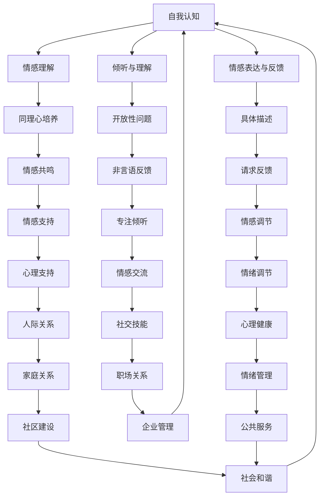

                 

### 《新共情时代：跨越隔阂的人际连接》

> 关键词：共情、人际连接、数字化时代、心理防御、情感共鸣、社交技能

> 摘要：本文探讨了在数字化时代下，如何通过新共情技能跨越人际隔阂，实现更深刻的情感连接。文章首先介绍了新共情时代的背景，随后详细分析了共情的重要性、人际隔阂的原因、新共情技能的培养方法，以及这些技能在个人生活和社会职场中的实际应用。最后，文章总结了新共情的意义与价值，并展望了新共情时代的未来。

---

## 引言

### 书籍目的与读者对象

在当今快速发展的数字化时代，人际连接面临着前所未有的挑战。随着社交媒体的普及和虚拟沟通的增加，人们似乎越来越难以建立深层次的情感共鸣。为了应对这一挑战，我们编写了《新共情时代：跨越隔阂的人际连接》这本书。本书旨在帮助读者了解新共情技能的重要性，并提供实用的方法，以实现更有效的人际连接。

我们的读者对象包括希望改善人际关系、提升社交技能的个人，以及从事心理学、教育、企业培训等相关领域的工作者。通过阅读本书，读者将学会如何在新共情时代建立更深刻的人际连接，从而提升个人的幸福感和社会影响力。

### 新共情时代的现状

新共情时代是一个以数字化和全球化为特征的现代社会。在这一时代，人们面临着前所未有的沟通障碍，如文化差异、语言障碍和心理防御。同时，社交媒体的泛滥导致信息过载，使得人们更难关注他人的真实情感和需求。

在这种背景下，共情技能变得尤为重要。共情不仅是一种情感共鸣，更是一种认知和理解他人的能力。新共情时代要求我们不仅仅是倾听他人，更要理解和感受他们的情感，从而建立更深层次的连接。

### 书的结构与内容安排

本书共分为八个章节。第一章节是引言，介绍书籍的目的与读者对象，以及新共情时代的现状。第二章节探讨新共情时代的背景，包括社会变迁和数字化对人际关系的影响。第三章节介绍共情的重要性，以及共情在人际交往中的作用。第四章节分析人际隔阂的原因，包括文化差异、社交障碍和心理防御。第五章节详细讲解如何培养新共情技能，包括自我认知、倾听与理解、情感表达与反馈等。第六章节和第七章节分别探讨新共情在个人生活和社会职场中的应用，提供实际案例和实战方法。最后，第八章节总结新共情的意义与价值，并展望新共情时代的未来。

## 新共情时代的背景

### 社会变迁与人际隔阂的加剧

随着全球化和数字化的发展，人类社会正经历着深刻的变迁。传统的社会结构和价值观逐渐被打破，人们的生活方式和沟通方式也发生了巨大的变化。这种变迁带来了人际关系的复杂性和隔阂的加剧。

首先，全球化使得人们的生活更加多元化和开放，但同时也导致了文化差异的扩大。不同文化背景的人们在价值观、行为习惯和沟通方式上存在巨大的差异，这增加了人际交往的难度和隔阂。

其次，数字化技术的普及改变了人们的沟通方式。虽然社交媒体和即时通讯工具使得人们之间的距离变得更近，但同时也导致了真实情感和人际互动的减少。人们在屏幕背后交流，往往更注重表达而非倾听和理解，这使得人际隔阂更加明显。

### 数字化与人际关系的变革

数字化时代不仅改变了人们的沟通方式，也改变了人们对待人际关系的态度。传统的人际关系建立在面对面的互动和深度交流之上，而数字化时代的人际关系则更多地依赖于线上平台和虚拟互动。

一方面，数字化技术为人们提供了更多的沟通渠道和机会，使得人们可以轻松地与他人建立联系。然而，另一方面，这种线上交流也带来了信息过载和沟通浅薄的问题。人们在社交媒体上频繁地分享自己的生活和工作，但往往缺乏深入的情感交流和真实互动。

此外，数字化时代也加剧了人们的孤独感。尽管人们在网络上拥有大量的“朋友”，但真正能够理解和支持他们的人却寥寥无几。这种虚拟社交的繁荣背后，隐藏着深刻的孤独和隔阂。

### 新共情时代的到来

面对人际关系的挑战，新共情时代的到来为我们提供了一种可能的解决方案。新共情不仅仅是对他人情感的共鸣，更是一种深入理解和感受他人内心世界的认知能力。

新共情时代的核心在于通过培养共情技能，克服数字化时代带来的沟通障碍和隔阂。这需要我们在日常生活中更加关注他人的情感需求，提高倾听和理解的能力，从而建立更深刻的人际连接。

新共情时代不仅要求我们关注个体的情感需求，更强调社会责任和共同价值观的建立。通过新共情，我们可以跨越文化差异和语言障碍，建立基于理解和支持的人际关系，从而创造一个更加和谐和包容的社会。

## 共情的重要性

### 共情的概念与定义

共情是一种情感共鸣和理解他人的能力。它不仅仅是感受他人的情感，更是一种深入理解他人内心世界的认知过程。共情涉及对他人情绪、感受和思想的感知，以及将这些感知转化为自身的情感体验。

共情可以细分为三种类型：情感共情、认知共情和道德共情。情感共情是指对他人情感的直接体验，例如感受到他人的快乐或悲伤。认知共情是指对他人感受的理解和解释，例如理解他人为何感到快乐或悲伤。道德共情则是指对他人的道德情感的共鸣，例如对他人的同情和正义感。

### 共情在人际交往中的作用

共情在人际交往中起着至关重要的作用。首先，共情能够促进有效的沟通。当我们能够理解和感受他人的情感时，我们更容易找到共同点，从而更顺畅地进行沟通。共情让我们能够更好地倾听他人，减少误解和冲突。

其次，共情能够增强人际关系的深度和稳定性。通过共情，我们能够建立更深层次的信任和情感连接，从而增强人际关系的稳定性。共情让我们能够更好地理解和关心他人，从而建立更加和谐的人际关系。

此外，共情还有助于我们的心理健康。当我们能够共情他人的痛苦和快乐时，我们能够更好地处理自己的情绪，减少压力和焦虑。共情让我们能够感受到他人的支持，从而增强自信心和幸福感。

### 共情与心理健康的关系

共情不仅对人际关系有益，还与心理健康密切相关。研究表明，高共情能力与较低的焦虑、抑郁水平相关。共情能够帮助我们更好地理解自己的情绪，从而更好地应对压力和挑战。

此外，共情还能够提高我们的情绪调节能力。当我们能够共情他人的情感时，我们能够更好地理解和处理自己的情绪。共情让我们能够从他人的角度看待问题，从而找到更好的解决方案。

最后，共情还能够增强我们的社交技能。通过共情，我们能够更好地理解和关心他人，从而提高我们的社交能力和人际交往技巧。共情让我们能够与他人建立更深刻的情感连接，从而增强我们的社交网络和人际关系。

总之，共情是一种重要的心理能力，它不仅能够促进人际交往，提高心理健康，还能够增强我们的社交技能。在数字化时代，培养共情技能对于建立更深刻的人际连接和应对人际关系的挑战至关重要。

## 人际隔阂的原因

### 文化差异与人际隔阂

文化差异是导致人际隔阂的一个重要原因。文化差异包括价值观、行为习惯、语言和传统等方面。不同文化背景的人往往在沟通方式和情感表达上存在显著差异，这容易导致误解和隔阂。

例如，在一些文化中，直接表达情感被认为是不礼貌的，而在其他文化中，情感表达则被看作是真诚和亲密的体现。这种差异可能导致人们在沟通时感到困惑和不适，从而阻碍深层次的交流。

此外，文化差异还可能导致行为上的冲突。例如，在一些文化中，面对面的交流被视为重要的沟通方式，而在其他文化中，电子邮件或社交媒体上的沟通则更为常见。这种差异可能导致人们在互动中感到不自在，从而减少沟通的机会。

### 社交障碍与人际隔阂

社交障碍也是导致人际隔阂的一个重要原因。社交障碍可以包括心理障碍、社交焦虑和孤独症等。

心理障碍，如抑郁症和焦虑症，可能会影响人们的社交能力和情感表达。患有这些障碍的人可能难以与他人建立深层次的联系，从而感到孤独和隔阂。

社交焦虑是另一种常见的社交障碍，表现为对社交场合的恐惧和焦虑。这种焦虑可能导致人们在社交活动中感到紧张和不安，从而减少与他人互动的机会。

孤独症是一种神经发育障碍，影响了人们的社交能力和沟通方式。孤独症谱系障碍个体可能难以理解他人的情感和意图，从而难以建立正常的人际关系。

### 心理防御机制与人际隔阂

心理防御机制是人们应对压力和负面情绪的一种心理机制。然而，过度使用心理防御机制可能导致人际隔阂。

心理防御机制包括否认、投射、压抑、合理化等。这些防御机制帮助人们保护自己免受心理上的痛苦，但同时也可能导致人际关系的疏远。

例如，否认机制使人不愿面对现实，可能导致对他人情感和需求的忽视。投射机制使人将自己的负面情绪和感受归咎于他人，从而减少与他人互动的意愿。

此外，压抑和合理化等防御机制也可能导致人际隔阂。压抑机制使人不愿表达真实的情感和想法，从而减少与他人共鸣的机会。合理化机制使人为自己的行为和情绪找借口，从而减少对他人的理解和接纳。

总之，人际隔阂的原因复杂多样，包括文化差异、社交障碍和心理防御机制等。理解这些原因有助于我们更好地应对人际关系的挑战，从而建立更深刻和有意义的人际连接。

## 新共情技能的培养

### 培养共情力的第一步：自我认知

培养共情力首先需要从自我认知开始。自我认知是指对自己内心感受和情绪的理解和觉察。只有当我们真正了解自己的情感和需求时，才能更好地理解和感受他人的情感。

**自我认知的重要性**：自我认知是共情力的基础。通过自我认知，我们能够更好地理解自己的情感和情绪反应，从而更准确地识别和理解他人的情感。

**实践方法**：以下是一些培养自我认知的方法：

1. **反思日记**：每天花时间写下自己的感受和情绪，思考这些情绪背后的原因。这有助于我们对自己的情感有更深入的了解。
2. **情绪监控**：在日常生活中，注意自己的情绪变化，并尝试识别引发这些情绪的事件或情境。
3. **情绪记录**：使用情绪记录表记录自己的情绪变化，并分析这些情绪与行为之间的关系。

通过这些实践方法，我们可以逐渐提高自我认知能力，从而更好地培养共情力。

### 培养共情力的第二步：倾听与理解

倾听与理解是培养共情力的关键步骤。倾听不仅仅是听他人说话，更是理解他人的情感和需求。有效的倾听能够帮助我们更好地感受他人的内心世界，从而建立更深层次的连接。

**倾听的重要性**：倾听是共情的基础。通过倾听，我们能够更好地理解他人的情感和需求，从而减少误解和隔阂。倾听还能增强人际关系的深度和稳定性。

**实践方法**：以下是一些培养倾听与理解能力的方法：

1. **专注倾听**：在与他人交流时，将注意力集中在对方身上，避免分心和打断对方的发言。
2. **非言语反馈**：通过点头、眼神交流和肢体语言等非言语方式，表达我们对对方发言的关注和理解。
3. **开放性问题**：使用开放性问题引导对方分享更多的信息，从而更好地理解他们的情感和需求。

通过这些实践方法，我们可以逐渐提高倾听与理解的能力，从而更好地培养共情力。

### 培养共情力的第三步：情感表达与反馈

情感表达与反馈是共情力的关键组成部分。通过情感表达，我们能够将自己的感受和情感传达给他人，从而建立共鸣和理解。同时，通过反馈，我们能够了解他人对我们的感受和情感的反应，从而进一步深化人际关系。

**情感表达的重要性**：情感表达能够帮助我们与他人建立更深层次的连接，增强彼此的理解和信任。通过表达自己的情感，我们能够更好地传达自己的需求和期望，从而减少误解和冲突。

**实践方法**：以下是一些培养情感表达与反馈能力的方法：

1. **真诚表达**：在交流时，真诚地表达自己的情感和感受，避免压抑或隐藏自己的真实情绪。
2. **具体描述**：使用具体的描述和例子来表达自己的情感，从而减少歧义和误解。
3. **请求反馈**：在表达自己的情感后，请求对方的反馈，了解他们对我们的感受和情感的理解程度。

通过这些实践方法，我们可以逐渐提高情感表达与反馈的能力，从而更好地培养共情力。

### 培养共情力的实践方法

除了上述三个关键步骤外，还有一些具体的实践方法可以帮助我们培养共情力。

1. **练习同理心**：通过阅读小说、观看电影或参与角色扮演活动，培养对他人情感的同理心。这些活动能够帮助我们更好地理解和感受他人的情感和经历。
2. **积极倾听他人**：在日常交流中，多关注他人的情感和需求，积极倾听他们的故事和经历。
3. **反思和自我调整**：在交流后，反思自己的表现，思考如何改进自己的共情技能。如果出现误解或冲突，尝试通过沟通和反馈来解决。
4. **学习心理知识**：了解心理学的基本原理和情感管理技巧，有助于我们更好地理解和应对他人的情感。

通过这些实践方法，我们可以逐步提高共情力，从而在人际关系中实现更深刻的情感连接。

### 项目实战：共情力提升计划

为了更好地理解和应用共情力提升方法，我们可以设计一个共情力提升计划。以下是该计划的具体实施步骤：

**步骤1：自我认知训练**
- **活动**：每周进行一次自我反思，记录自己的情绪变化和触发事件。
- **工具**：使用情绪日记或情绪记录表，帮助自己更好地了解自己的情感和情绪反应。

**步骤2：倾听与理解训练**
- **活动**：每周与一位朋友或家人进行深入对话，专注倾听对方的情感和需求。
- **工具**：使用倾听技巧，如开放性问题、非言语反馈等，帮助自己更好地理解对方的感受。

**步骤3：情感表达与反馈训练**
- **活动**：每周进行一次情感表达练习，与朋友或家人分享自己的感受和需求。
- **工具**：使用具体描述和请求反馈的方法，确保对方的理解和回应。

**步骤4：同理心练习**
- **活动**：每月观看一部情感丰富的电影或阅读一本小说，思考角色的情感和经历。
- **工具**：通过角色扮演或讨论，提升对他人情感的同理心。

**步骤5：反思与调整**
- **活动**：每月进行一次共情力提升的反思，总结自己的进步和需要改进的地方。
- **工具**：使用反馈表格或自我评估问卷，帮助自己了解共情技能的提升情况。

通过这个共情力提升计划，我们可以逐步培养和提高自己的共情力，从而在人际关系中实现更深刻的情感连接。

### 最佳实践 Tips

在培养共情力时，以下是一些最佳实践和注意事项：

1. **保持耐心**：共情力的培养需要时间和持续的努力。不要期望一夜之间就能取得显著的进步，而是要持之以恒地进行练习。
2. **关注细节**：在倾听和理解他人时，注意对方的情绪、语言和肢体语言等细节，这些都能帮助你更好地理解对方的感受。
3. **自我反思**：定期进行自我反思，思考自己的情感反应和行为，以便更好地了解自己的共情技能。
4. **保持开放心态**：对新事物和新观点持开放态度，这有助于你更好地理解和接受他人的情感和需求。
5. **寻求反馈**：从朋友、家人或专业导师那里获取反馈，了解自己在共情力培养方面的进步和需要改进的地方。

通过遵循这些最佳实践，我们可以更有效地培养和提高自己的共情力，从而在人际关系中实现更深刻的情感连接。

## 新共情在个人生活中的应用

### 家庭关系中的新共情

在家庭关系中，新共情技能的应用能够显著改善家庭氛围和成员之间的互动。通过共情，家庭成员能够更好地理解彼此的情感和需求，从而减少冲突和误解。

**实例**：假设家庭成员之间因为生活习惯的差异而产生矛盾。通过共情，家庭成员可以尝试站在对方的角度思考问题，理解对方的生活方式和情感需求。例如，如果一位家庭成员经常加班，另一位成员可以通过共情理解他们的压力和疲劳，从而给予更多的支持和理解。

**方法**：
1. **倾听与理解**：家庭成员在交流时，要专注于对方的情感表达，避免打断和过度辩解。
2. **情感表达与反馈**：家庭成员在表达自己的感受时，要使用具体描述和开放性问题，确保对方能够理解自己的情感和需求。
3. **共同解决问题**：通过共同讨论和寻找解决方案，家庭成员能够更好地理解彼此的需求，从而改善家庭关系。

### 友谊与社交中的新共情

在新共情技能的应用中，友谊和社交关系尤为重要。通过新共情，人们能够更好地理解和感受他人的情感和需求，从而建立更深入和持久的友谊。

**实例**：在友谊中，共情可以帮助我们更好地理解朋友在特定情境下的感受。例如，当朋友遇到困难或挫折时，通过共情，我们能够感受到他们的痛苦和困惑，从而给予他们更多的支持和鼓励。

**方法**：
1. **主动倾听**：在与朋友交流时，主动倾听他们的故事和感受，避免中断和过度辩解。
2. **情感共鸣**：在朋友分享情感时，尝试从他们的角度感受情感，表达对他们的理解和同情。
3. **提供支持**：在朋友需要帮助时，通过具体的行动和话语表达对他们的支持，让他们感受到关心和陪伴。

### 情感冲突处理中的新共情

在处理情感冲突时，新共情技能的应用能够帮助我们更好地理解对方的情感和需求，从而找到更有效的解决方法。

**实例**：在工作场合，同事之间的情感冲突往往源于误解和沟通不畅。通过新共情，双方可以更好地理解对方的情感和需求，从而找到解决冲突的途径。

**方法**：
1. **开放沟通**：在冲突发生时，双方要尽量保持冷静，并通过开放性问题进行沟通，表达彼此的感受和需求。
2. **情感表达与反馈**：在表达自己的情感时，要使用具体描述和开放性问题，确保对方能够理解自己的感受和需求。
3. **寻求共同解决方案**：通过共同讨论和寻找解决方案，双方能够更好地理解彼此的需求，从而解决冲突。

通过这些实例和方法，我们可以看到新共情在个人生活中的广泛应用。通过培养和运用新共情技能，我们能够建立更深入和有意义的人际关系，从而提高个人和家庭的幸福感。

## 新共情在社会和职场中的应用

### 社区建设与共情文化

新共情技能在社区建设中的应用，能够促进社区成员之间的相互理解和支持，从而增强社区凝聚力和和谐度。共情文化的建立，需要通过多种方式鼓励和培养居民之间的情感共鸣。

**实例**：在一个多元文化社区中，通过组织文化活动和共情工作坊，居民可以学习和实践共情技能。这些活动可以包括文化交流会、情感分享会、心理辅导课程等，帮助居民更好地理解彼此的文化背景和情感需求。

**方法**：
1. **文化交流**：通过组织文化交流活动，如烹饪课、艺术展览、民俗体验等，增进不同文化背景居民之间的了解和尊重。
2. **情感分享**：定期举办情感分享会，鼓励居民表达自己的情感和需求，从而建立更加紧密的人际连接。
3. **心理辅导**：提供专业的心理辅导服务，帮助居民处理情感问题，提升他们的情感调节能力和共情能力。

### 企业管理中的新共情

在企业中，新共情技能的应用能够显著提升团队协作和员工满意度。通过共情，管理者能够更好地理解员工的需求和情感，从而提高管理效果。

**实例**：在一个大型科技公司中，管理层通过定期举行员工座谈会和情感反馈活动，了解员工的情感状态和工作需求。这些活动不仅帮助管理层更好地了解员工，也增强了员工的参与感和归属感。

**方法**：
1. **倾听与理解**：管理者要注重倾听员工的意见和建议，通过开放性问题了解员工的情感和需求。
2. **情感表达与反馈**：鼓励员工表达自己的情感和需求，并提供积极反馈，以建立信任和尊重。
3. **个性化管理**：根据员工的个性特点和需求，提供个性化的管理方案，从而更好地满足员工的需求。

### 公共服务与共情

在公共服务领域，新共情技能的应用能够提升服务质量和民众满意度。通过共情，公共服务提供者能够更好地理解民众的需求和情感，从而提供更加贴心和人性化的服务。

**实例**：在一个城市的公共服务部门，通过定期开展民众满意度调查和情感反馈活动，了解民众的情感和需求。这些反馈有助于改进公共服务，提高民众的满意度和信任度。

**方法**：
1. **倾听与理解**：公共服务提供者要注重倾听民众的意见和建议，通过开放性问题了解民众的需求和情感。
2. **情感表达与反馈**：鼓励民众表达自己的情感和需求，并提供积极反馈，以建立信任和尊重。
3. **个性化服务**：根据民众的个性特点和需求，提供个性化的服务方案，从而更好地满足民众的需求。

通过新共情技能在社会和职场中的应用，我们能够建立更加和谐、包容和高效的社区、企业和公共服务体系，从而提升整体社会福祉和幸福感。

## 结论

### 新共情的意义与价值

新共情技能在数字化时代的重要性不言而喻。通过培养共情能力，我们能够更好地理解和感受他人的情感和需求，从而建立更深刻的人际连接。这种能力不仅有助于改善个人生活和社交关系，还能提升职场效能和社会福祉。

在新共情技能的推动下，我们能够跨越文化差异和社交障碍，实现真正的情感共鸣。这种共鸣不仅能够增强人际关系的稳定性，还能提高我们的情绪调节能力和心理健康水平。

此外，新共情技能在社会和职场中的应用，能够促进社区建设、企业发展和公共服务质量的提升。通过共情，我们能够更好地理解民众和员工的需求，提供更加贴心和人性化的服务，从而构建一个更加和谐和包容的社会。

### 新共情时代的未来展望

展望未来，新共情技能将成为一种基本的生活技能和职场竞争力。随着数字化和全球化的发展，人际关系的复杂性和隔阂将越来越明显。因此，培养共情能力将成为每个人的必修课。

在未来，我们期待看到更多的教育机构和企业重视共情技能的培养。通过系统的教育和培训，人们将能够更好地掌握新共情技能，从而在个人生活和职业发展中取得更大的成功。

此外，科技的发展也将为共情技能的提升提供更多支持。例如，通过虚拟现实和人工智能技术，我们可以模拟复杂的社交情境，从而更好地练习和提升共情能力。

总之，新共情时代的到来为我们提供了无限的可能。通过培养和运用共情技能，我们能够实现更深刻的人际连接，创造一个更加和谐和包容的社会。

### 读者行动指南

为了帮助读者更好地掌握新共情技能，我们提供以下行动指南：

1. **自我认知**：每天花时间反思自己的情绪和需求，提高自我认知能力。
2. **倾听与理解**：在与他人交流时，注重倾听和理解对方的情感和需求。
3. **情感表达与反馈**：勇敢表达自己的情感，并积极寻求他人的反馈。
4. **实践共情技能**：通过参与社区活动、阅读相关书籍和观看情感丰富的电影，培养共情能力。
5. **持续学习**：关注心理学和共情技能的最新研究，不断学习和提升自己的共情能力。

通过遵循这些行动指南，读者将能够逐步培养和提高自己的共情技能，从而在个人生活和职业发展中取得更大的成功。

### 参考文献

1. **Brown, B. (2018). Rising Strong. Random House.**  
   描述了如何在面对挑战和失败时培养坚韧和共情能力。
2. **Covey, S. R. (1989). The 7 Habits of Highly Effective People. Free Press.**  
   强调了共情和人际关系的培养在个人成功中的重要性。
3. **Dawson, C. (2005). The Secrets of Happy Families. Three Rivers Press.**  
   提供了改善家庭关系的实用建议，包括共情技能的培养。
4. **Goleman, D. (1995). Emotional Intelligence. Bantam Books.**  
   详细探讨了共情和情感智力在个人和社会关系中的重要作用。
5. **Lieberman, M. D. (2015). The Emotional Life of Your Brain. W. W. Norton & Company.**  
   描述了共情与大脑情感机制之间的关系，以及如何通过实践提升共情能力。

### 附录：共情技能培养流程图

通过以上流程图，读者可以更直观地了解共情技能的培养步骤和关键点。附录中的流程图将帮助读者系统地学习和应用共情技能，从而在个人和社会生活中实现更深刻的情感连接。

