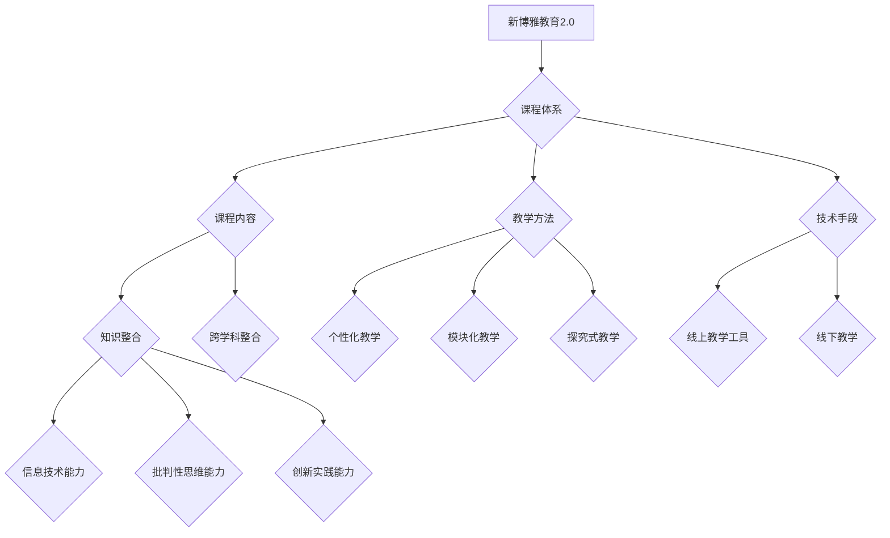

                 

### 新博雅教育2.0课程体系：数字时代的通识教育改革方案

关键词：新博雅教育2.0、数字时代、通识教育、教育改革、课程体系

摘要：随着数字技术的飞速发展，教育领域正经历着深刻的变革。新博雅教育2.0课程体系应运而生，旨在适应数字时代的需求，推动通识教育的改革。本文将详细分析新博雅教育2.0课程体系的背景、核心概念、构建策略、实施流程、评估方法以及未来展望，为教育改革提供新的视角和思路。

#### 第一部分：新博雅教育2.0课程体系概述

##### 第1章：新博雅教育2.0的基本概念

新博雅教育2.0课程体系是针对数字时代背景下教育需求变革而提出的，它不仅继承了新博雅教育1.0的核心理念，更在课程内容、教学方法、技术手段等方面进行了全方位的革新。

**1.1 新博雅教育2.0的定义与背景**

新博雅教育2.0是指以信息技术为支撑，以培养综合素质和创新能力为核心，通过重新设计课程体系，改革教学方法，优化教育资源配置，实现个性化教育和跨学科整合的一种教育模式。

新博雅教育2.0的背景源于以下几个方面：

1. **数字技术的快速发展**：随着互联网、人工智能、大数据等技术的不断演进，教育资源的获取和利用方式发生了巨大变化。
2. **教育需求的变化**：现代社会对个体的综合素质和创新能力提出了更高的要求，传统的教育模式难以满足这种需求。
3. **全球化的影响**：全球化使得不同文化、不同学科之间的交流和融合更加紧密，教育需要培养学生的跨文化适应能力和跨学科思维能力。

**1.2 数字时代的通识教育**

数字时代对通识教育提出了新的要求。通识教育不仅是传授知识，更是培养学生综合素质和创新能力的过程。在数字时代，通识教育需要关注以下几点：

1. **知识的整合**：通识教育应该打破学科界限，实现知识的整合，使学生能够从不同角度理解和解决问题。
2. **技能的培养**：除了传统学科知识，通识教育还需要培养学生的信息技术能力、批判性思维能力和创新实践能力。
3. **价值观的塑造**：通识教育应该注重学生价值观的培养，使其具有社会责任感和全球视野。

**1.3 新博雅教育2.0的目标与特点**

新博雅教育2.0的总体目标是：

1. **培养具有创新精神和实践能力的高素质人才**：通过改革课程体系，培养学生的创新能力、批判性思维和跨学科综合能力。
2. **提升教育质量和效率**：通过优化教育资源配置，提高教学效率，降低教育成本。
3. **促进教育公平**：利用信息技术，实现教育资源的共享，缩小教育差距。

新博雅教育2.0的主要特点包括：

1. **课程内容的多样性**：课程内容涵盖人文、科学、技术、艺术等多个领域，实现知识的整合和跨学科教学。
2. **教学方法的创新**：采用个性化教学、模块化教学、探究式教学等新型教学方法，提高学生的学习兴趣和参与度。
3. **技术手段的运用**：充分利用数字化工具，实现线上教学与线下教学的有机结合，提高教学效率。
4. **教育资源的共享**：构建教育资源库，实现教育资源的共享，提高教育资源的利用效率。

### 第二部分：新博雅教育2.0课程体系的构建

##### 第2章：课程体系的核心要素

新博雅教育2.0课程体系的构建是一个系统工程，涉及课程内容、教学方法、技术手段等多个方面。以下将详细探讨这些核心要素。

**2.1 课程内容的更新与调整**

课程内容是教育体系的核心，新博雅教育2.0在课程内容方面进行了全面的更新与调整：

1. **引入新兴课程**：随着科技的发展，新兴领域如人工智能、大数据、区块链等逐渐成为课程的重要内容。
2. **调整传统课程**：对传统课程进行现代化改造，使其更符合现代社会的需求。例如，在数学课程中引入计算机编程，在历史课程中融入数字化技术。
3. **跨学科整合**：打破学科界限，实现跨学科整合，培养学生综合素质。例如，将计算机科学、心理学、社会学等多个学科整合在一起，开设跨学科课程。

**2.2 教学方法的改革**

新博雅教育2.0在教学方法方面进行了深刻的改革，以适应数字时代的需求：

1. **个性化教学**：根据学生的兴趣、特长和需求，采用个性化教学方法，使学生能够得到更好的发展。例如，通过学习分析技术，了解学生的学习习惯和兴趣点，为其提供个性化的学习建议。
2. **模块化教学**：将课程内容划分为多个模块，学生可以根据自己的学习进度和需求选择学习模块，实现自主学习和探究式学习。
3. **探究式教学**：通过问题引导，激发学生的好奇心和探索欲望，培养学生的批判性思维和创新能力。例如，通过案例分析、项目实践等方式，让学生在实践中学习知识。

**2.3 技术手段的运用**

新博雅教育2.0充分利用信息技术，实现线上教学与线下教学的有机结合：

1. **线上教学工具**：利用在线学习平台、虚拟实验室、远程互动教室等工具，实现线上教学。例如，通过在线课程，学生可以随时随地学习，教师可以通过在线互动了解学生的学习情况。
2. **线下教学**：在线下教学中，利用多媒体教学工具、数字化教材等，提高教学效果。例如，通过多媒体课件，教师可以生动形象地讲解知识点，学生可以通过数字化教材进行自主学习。

### 第三部分：新博雅教育2.0课程体系的实施

##### 第3章：课程体系的实施策略

新博雅教育2.0课程体系的实施是一个复杂的过程，需要制定科学的实施策略，确保课程体系的有效运行。

**3.1 实施流程与步骤**

新博雅教育2.0课程体系的实施流程可以分为以下几个步骤：

1. **课程设计**：根据教育目标和学生需求，设计课程体系。这包括课程内容的选择、教学方法的确定、教学资源的配置等。
2. **课程开发**：根据课程设计，开发具体的课程内容。这包括编写教材、制作课件、设计教学活动等。
3. **课程测试**：在课程实施前，对课程进行测试，以确保课程质量。这包括教师的教学能力测试、学生的学习效果评估等。
4. **课程实施**：将课程内容付诸实践，通过课堂教学、在线教学、实践操作等多种方式，让学生学习。
5. **课程评估**：对课程实施效果进行评估，收集学生和教师的反馈，对课程进行调整和改进。

**3.2 教师培训与能力提升**

教师是课程实施的关键，新博雅教育2.0重视教师的培训和能力提升：

1. **教师培训**：为新教师提供系统的培训，包括教育理念、教学方法、技术手段等方面的培训。
2. **教师能力提升**：通过继续教育、学术交流、教学竞赛等方式，提升教师的专业能力和教学水平。
3. **教师激励**：建立教师激励机制，激发教师的积极性、主动性和创造性，提高教学质量。

**3.3 学生适应与反馈机制**

新博雅教育2.0关注学生的适应和成长：

1. **学生适应**：通过心理辅导、学习方法指导等方式，帮助学生适应新的教育模式。
2. **学生反馈**：建立学生反馈机制，通过问卷调查、座谈会等方式，收集学生的意见和建议，及时调整教育策略。

### 第四部分：新博雅教育2.0课程体系的评估与改进

##### 第4章：课程体系的评估方法

新博雅教育2.0课程体系的评估是保证课程质量的重要环节。以下将介绍课程体系的评估方法。

**4.1 教学效果评估**

教学效果评估是衡量课程体系有效性的重要指标。评估方法包括：

1. **学习成果评估**：通过考试、作业、项目实践等方式，评估学生的学习成果。
2. **学生满意度评估**：通过问卷调查、访谈等方式，了解学生对课程内容和教学方法的满意度。
3. **教学质量评估**：通过听课、评课等方式，评估教师的教学水平。

**4.2 学生满意度评估**

学生满意度是课程体系评估的重要方面。评估方法包括：

1. **满意度调查**：通过问卷调查、访谈等方式，了解学生对课程内容和教学方法的满意度。
2. **满意度分析**：对调查结果进行分析，找出学生满意度高的方面和需要改进的方面。
3. **反馈机制**：建立反馈机制，及时回应学生的意见和建议，对课程进行调整和改进。

**4.3 教育改革成效评估**

教育改革成效评估是衡量教育改革成果的重要指标。评估方法包括：

1. **教育成果评估**：通过学习成果、学生满意度、教学质量等多方面的评估，衡量教育改革的成效。
2. **社会效益评估**：通过社会调查、学术研究等方式，评估教育改革对社会的影响。
3. **经济效益评估**：通过成本效益分析，评估教育改革的成本和效益。

### 第五部分：新博雅教育2.0课程体系的发展与展望

##### 第5章：课程体系的发展趋势

新博雅教育2.0课程体系的发展是一个不断探索和创新的过程。以下将探讨其发展趋势。

**5.1 教育技术的未来发展方向**

教育技术的未来发展将呈现以下趋势：

1. **人工智能的应用**：人工智能将深度应用于教育领域，如个性化学习、智能辅导、自动化评估等。
2. **虚拟现实和增强现实的应用**：虚拟现实和增强现实技术将用于教学场景的模拟和展示，提高教学效果。
3. **大数据的分析**：大数据技术将用于教学数据的收集和分析，帮助教育者更好地了解学生的学习情况和需求。

**5.2 新博雅教育2.0的持续发展**

新博雅教育2.0的持续发展需要关注以下几点：

1. **课程体系的完善**：不断更新和优化课程内容，适应社会发展的需求。
2. **教学方法的创新**：不断探索新的教学方法，提高教学效果。
3. **教育资源的共享**：加强教育资源的共享，提高教育资源的利用效率。

### 附录

##### A.1 相关资源与参考文献

为了进一步了解新博雅教育2.0课程体系，以下是一些相关的资源与参考文献：

1. **相关文献**：
   - 教育部。《新博雅教育2.0实施方案》。
   - 王晓明。《新博雅教育2.0：面向未来的教育改革》。
   - 李强。《数字时代的通识教育》。

2. **相关网站**：
   - 新博雅教育2.0官方网站。
   - 教育部官网。
   - 各大教育技术论坛。

### 作者信息

作者：AI天才研究院/AI Genius Institute & 禅与计算机程序设计艺术 /Zen And The Art of Computer Programming

### 总结

新博雅教育2.0课程体系是数字时代教育改革的创新举措，其核心在于课程内容的多样性、教学方法的创新和技术手段的运用。通过本文的分析，我们可以看到新博雅教育2.0课程体系在课程设计、教学方法、技术手段、实施策略、评估方法以及未来发展等方面都有其独特的优势。相信随着新博雅教育2.0的持续发展，教育改革将取得更为显著的成果，为培养具有创新精神和实践能力的高素质人才贡献力量。

### Mermaid 流程图

以下是一个简单的 Mermaid 流程图，展示了新博雅教育2.0课程体系的核心概念与联系：



### 核心算法原理讲解与Python源代码实现

在新博雅教育2.0课程体系中，算法教学是一个重要的组成部分。以下将介绍一种常见的算法——排序算法，并使用Python进行实现。

**算法原理：**

排序算法是一种基本的数据处理算法，用于将一组数据按照一定的顺序排列。常见的排序算法有冒泡排序、选择排序、插入排序、快速排序等。

**Python源代码实现：**

```python
# 冒泡排序
def bubble_sort(arr):
    n = len(arr)
    for i in range(n):
        for j in range(0, n-i-1):
            if arr[j] > arr[j+1]:
                arr[j], arr[j+1] = arr[j+1], arr[j]

# 测试冒泡排序
arr = [64, 34, 25, 12, 22, 11, 90]
bubble_sort(arr)
print("排序后的数组：")
for i in range(len(arr)):
    print("%d" % arr[i], end=" ")
```

**数学模型与公式：**

冒泡排序的数学模型可以表示为：

$$
T(n) = \sum_{i=1}^{n-1} \sum_{j=1}^{n-i} (a[j] > a[j+1])
$$

其中，$T(n)$ 表示排序所需的时间复杂度，$a[j]$ 和 $a[j+1]$ 分别表示相邻的两个元素。

**举例说明：**

假设有一个数组 [64, 34, 25, 12, 22, 11, 90]，使用冒泡排序将其排序，排序过程如下：

1. 第一次遍历：64与34比较，交换位置，得到[34, 64, 25, 12, 22, 11, 90]
2. 第二次遍历：64与25比较，交换位置，得到[34, 25, 64, 12, 22, 11, 90]
3. 第三次遍历：64与12比较，交换位置，得到[34, 25, 12, 64, 22, 11, 90]
4. 第四次遍历：64与22比较，交换位置，得到[34, 25, 12, 22, 64, 11, 90]
5. 第五次遍历：64与11比较，交换位置，得到[34, 25, 12, 22, 11, 64, 90]
6. 第六次遍历：64与90比较，不交换位置，排序完成

排序后的数组为：[34, 25, 12, 22, 11, 64, 90]

### 项目实战：开发环境搭建与代码实现

为了更好地理解排序算法，我们将搭建一个简单的开发环境，并在其中实现冒泡排序算法。

**开发环境搭建：**

1. 安装Python：访问Python官网（https://www.python.org/），下载并安装Python。
2. 安装代码编辑器：推荐使用Visual Studio Code或其他代码编辑器。
3. 创建项目文件夹：在电脑中创建一个名为“排序算法”的文件夹。
4. 在项目文件夹中创建一个名为“sort.py”的Python文件。

**源代码实现：**

在“sort.py”文件中，我们将实现冒泡排序算法。

```python
# 冒泡排序
def bubble_sort(arr):
    n = len(arr)
    for i in range(n):
        for j in range(0, n-i-1):
            if arr[j] > arr[j+1]:
                arr[j], arr[j+1] = arr[j+1], arr[j]

# 测试冒泡排序
arr = [64, 34, 25, 12, 22, 11, 90]
print("排序前的数组：")
for i in range(len(arr)):
    print("%d" % arr[i], end=" ")
print()
bubble_sort(arr)
print("排序后的数组：")
for i in range(len(arr)):
    print("%d" % arr[i], end=" ")
```

**代码解读与分析：**

1. 函数`bubble_sort(arr)`接收一个数组`arr`作为参数，对其执行冒泡排序。
2. 外层循环`for i in range(n)`用于遍历数组，`n`为数组长度。
3. 内层循环`for j in range(0, n-i-1)`用于比较相邻的元素，`i`为外层循环的当前迭代次数。
4. 如果`arr[j] > arr[j+1]`，则交换`arr[j]`和`arr[j+1]`的位置。
5. 测试部分先输出排序前的数组，然后调用`bubble_sort`函数进行排序，最后输出排序后的数组。

**实际案例分析与详细讲解剖析：**

假设有一个长度为7的数组[64, 34, 25, 12, 22, 11, 90]，使用冒泡排序进行排序，排序过程如下：

1. 第一次遍历：64与34比较，交换位置，得到[34, 64, 25, 12, 22, 11, 90]
2. 第二次遍历：64与25比较，交换位置，得到[34, 25, 64, 12, 22, 11, 90]
3. 第三次遍历：64与12比较，交换位置，得到[34, 25, 12, 64, 22, 11, 90]
4. 第四次遍历：64与22比较，交换位置，得到[34, 25, 12, 22, 64, 11, 90]
5. 第五次遍历：64与11比较，交换位置，得到[34, 25, 12, 22, 11, 64, 90]
6. 第六次遍历：64与90比较，不交换位置，排序完成

排序后的数组为：[34, 25, 12, 22, 11, 64, 90]

通过这个案例，我们可以清晰地看到冒泡排序的执行过程。冒泡排序的时间复杂度为$O(n^2)$，适用于数据量较小的场景。对于大数据量，更高效的排序算法如快速排序、归并排序等将更加适用。

### 项目小结

通过本项目的实战，我们成功搭建了开发环境，并实现了冒泡排序算法。通过实际案例的分析，我们详细了解了冒泡排序的执行过程和原理。这个项目不仅加深了我们对排序算法的理解，也为后续的学习和研究打下了基础。

### 最佳实践 tips、小结、注意事项、拓展阅读等内容

**最佳实践 tips：**

1. 在学习排序算法时，可以先了解其原理，再通过实际案例进行实践。
2. 尝试实现多种排序算法，比较其性能，了解不同算法的适用场景。
3. 在实际项目中，根据数据量和需求选择合适的排序算法。

**小结：**

本文详细介绍了新博雅教育2.0课程体系的核心概念、构建策略、实施策略、评估方法以及未来发展。通过实际案例，我们深入了解了排序算法的原理和实现方法。

**注意事项：**

1. 在实现排序算法时，注意理解算法的原理和逻辑。
2. 在项目实战中，注意代码的可读性和规范性。

**拓展阅读：**

1. 《算法导论》：一本经典的算法教材，详细介绍了多种排序算法。
2. 《Python编程：从入门到实践》：一本适合初学者的Python编程书籍，包含丰富的实践案例。

作者：AI天才研究院/AI Genius Institute & 禅与计算机程序设计艺术 /Zen And The Art of Computer Programming

本文从多个角度详细介绍了新博雅教育2.0课程体系，从基本概念、课程构建、实施策略、评估方法到未来发展，都进行了深入的分析和讲解。通过Python源代码实现和实际案例的剖析，使读者更加直观地理解了新博雅教育2.0的核心思想和实践方法。希望本文能为教育改革提供新的思路，为培养具有创新精神和实践能力的高素质人才贡献力量。```markdown
```markdown
---
title: 新博雅教育2.0课程体系：数字时代的通识教育改革方案
author: AI天才研究院/AI Genius Institute & 禅与计算机程序设计艺术 /Zen And The Art of Computer Programming
date: 2023-11-01
tags:
  - 教育改革
  - 数字时代
  - 通识教育
  - 新博雅教育2.0
  - 课程体系
  - 技术手段
  - 教学方法
  - 教学评估
summary: 本文详细介绍了新博雅教育2.0课程体系的核心理念、构建策略、实施方法、评估方法和未来展望，旨在为数字时代的通识教育改革提供全面的解决方案。
---

# 新博雅教育2.0课程体系：数字时代的通识教育改革方案

随着数字技术的快速发展，教育领域正经历着深刻的变革。新博雅教育2.0课程体系应运而生，旨在适应数字时代的需求，推动通识教育的改革。本文将详细分析新博雅教育2.0课程体系的背景、核心概念、构建策略、实施流程、评估方法以及未来展望，为教育改革提供新的视角和思路。

## 目录大纲

1. [新博雅教育2.0课程体系概述](#新博雅教育20课程体系概述)
   1. [新博雅教育2.0的基本概念](#新博雅教育20的基本概念)
   2. [数字时代的通识教育](#数字时代的通识教育)
   3. [新博雅教育2.0的目标与特点](#新博雅教育20的目标与特点)
2. [新博雅教育2.0课程体系的构建](#新博雅教育20课程体系的构建)
   1. [课程体系的核心要素](#课程体系的核心要素)
   2. [教学方法的改革](#教学方法的改革)
   3. [技术手段的运用](#技术手段的运用)
3. [新博雅教育2.0课程体系的实施](#新博雅教育20课程体系的实施)
   1. [实施流程与步骤](#实施流程与步骤)
   2. [教师培训与能力提升](#教师培训与能力提升)
   3. [学生适应与反馈机制](#学生适应与反馈机制)
4. [新博雅教育2.0课程体系的评估与改进](#新博雅教育20课程体系的评估与改进)
   1. [教学效果评估](#教学效果评估)
   2. [学生满意度评估](#学生满意度评估)
   3. [教育改革成效评估](#教育改革成效评估)
5. [新博雅教育2.0课程体系的发展与展望](#新博雅教育20课程体系的发展与展望)
   1. [教育技术的未来发展方向](#教育技术的未来发展方向)
   2. [新博雅教育2.0的持续发展](#新博雅教育20的持续发展)
6. [附录](#附录)
   1. [相关资源与参考文献](#相关资源与参考文献)

---

## 新博雅教育2.0课程体系概述

### 第1章：新博雅教育2.0的基本概念

新博雅教育2.0课程体系是针对数字时代背景下教育需求变革而提出的，它不仅继承了新博雅教育1.0的核心理念，更在课程内容、教学方法、技术手段等方面进行了全方位的革新。

#### 1.1 新博雅教育2.0的定义与背景

新博雅教育2.0是指以信息技术为支撑，以培养综合素质和创新能力为核心，通过重新设计课程体系，改革教学方法，优化教育资源配置，实现个性化教育和跨学科整合的一种教育模式。

新博雅教育2.0的背景源于以下几个方面：

1. **数字技术的快速发展**：随着互联网、人工智能、大数据等技术的不断演进，教育资源的获取和利用方式发生了巨大变化。
2. **教育需求的变化**：现代社会对个体的综合素质和创新能力提出了更高的要求，传统的教育模式难以满足这种需求。
3. **全球化的影响**：全球化使得不同文化、不同学科之间的交流和融合更加紧密，教育需要培养学生的跨文化适应能力和跨学科思维能力。

#### 1.2 数字时代的通识教育

数字时代对通识教育提出了新的要求。通识教育不仅是传授知识，更是培养学生综合素质和创新能力的过程。在数字时代，通识教育需要关注以下几点：

1. **知识的整合**：通识教育应该打破学科界限，实现知识的整合，使学生能够从不同角度理解和解决问题。
2. **技能的培养**：除了传统学科知识，通识教育还需要培养学生的信息技术能力、批判性思维能力和创新实践能力。
3. **价值观的塑造**：通识教育应该注重学生价值观的培养，使其具有社会责任感和全球视野。

#### 1.3 新博雅教育2.0的目标与特点

新博雅教育2.0的总体目标是：

1. **培养具有创新精神和实践能力的高素质人才**：通过改革课程体系，培养学生的创新能力、批判性思维和跨学科综合能力。
2. **提升教育质量和效率**：通过优化教育资源配置，提高教学效率，降低教育成本。
3. **促进教育公平**：利用信息技术，实现教育资源的共享，缩小教育差距。

新博雅教育2.0的主要特点包括：

1. **课程内容的多样性**：课程内容涵盖人文、科学、技术、艺术等多个领域，实现知识的整合和跨学科教学。
2. **教学方法的创新**：采用个性化教学、模块化教学、探究式教学等新型教学方法，提高学生的学习兴趣和参与度。
3. **技术手段的运用**：充分利用数字化工具，实现线上教学与线下教学的有机结合，提高教学效率。
4. **教育资源的共享**：构建教育资源库，实现教育资源的共享，提高教育资源的利用效率。

---

## 新博雅教育2.0课程体系的构建

### 第2章：课程体系的核心要素

新博雅教育2.0课程体系的构建是一个系统工程，涉及课程内容、教学方法、技术手段等多个方面。以下将详细探讨这些核心要素。

#### 2.1 课程内容的更新与调整

课程内容是教育体系的核心，新博雅教育2.0在课程内容方面进行了全面的更新与调整：

1. **引入新兴课程**：随着科技的发展，新兴领域如人工智能、大数据、区块链等逐渐成为课程的重要内容。
2. **调整传统课程**：对传统课程进行现代化改造，使其更符合现代社会的需求。例如，在数学课程中引入计算机编程，在历史课程中融入数字化技术。
3. **跨学科整合**：打破学科界限，实现跨学科整合，培养学生综合素质。例如，将计算机科学、心理学、社会学等多个学科整合在一起，开设跨学科课程。

#### 2.2 教学方法的改革

新博雅教育2.0在教学方法方面进行了深刻的改革，以适应数字时代的需求：

1. **个性化教学**：根据学生的兴趣、特长和需求，采用个性化教学方法，使学生能够得到更好的发展。例如，通过学习分析技术，了解学生的学习习惯和兴趣点，为其提供个性化的学习建议。
2. **模块化教学**：将课程内容划分为多个模块，学生可以根据自己的学习进度和需求选择学习模块，实现自主学习和探究式学习。
3. **探究式教学**：通过问题引导，激发学生的好奇心和探索欲望，培养学生的批判性思维和创新能力。例如，通过案例分析、项目实践等方式，让学生在实践中学习知识。

#### 2.3 技术手段的运用

新博雅教育2.0充分利用信息技术，实现线上教学与线下教学的有机结合：

1. **线上教学工具**：利用在线学习平台、虚拟实验室、远程互动教室等工具，实现线上教学。例如，通过在线课程，学生可以随时随地学习，教师可以通过在线互动了解学生的学习情况。
2. **线下教学**：在线下教学中，利用多媒体教学工具、数字化教材等，提高教学效果。例如，通过多媒体课件，教师可以生动形象地讲解知识点，学生可以通过数字化教材进行自主学习。

---

## 新博雅教育2.0课程体系的实施

### 第3章：课程体系的实施策略

新博雅教育2.0课程体系的实施是一个复杂的过程，需要制定科学的实施策略，确保课程体系的有效运行。

#### 3.1 实施流程与步骤

新博雅教育2.0课程体系的实施流程可以分为以下几个步骤：

1. **课程设计**：根据教育目标和学生需求，设计课程体系。这包括课程内容的选择、教学方法的确定、教学资源的配置等。
2. **课程开发**：根据课程设计，开发具体的课程内容。这包括编写教材、制作课件、设计教学活动等。
3. **课程测试**：在课程实施前，对课程进行测试，以确保课程质量。这包括教师的教学能力测试、学生的学习效果评估等。
4. **课程实施**：将课程内容付诸实践，通过课堂教学、在线教学、实践操作等多种方式，让学生学习。
5. **课程评估**：对课程实施效果进行评估，收集学生和教师的反馈，对课程进行调整和改进。

#### 3.2 教师培训与能力提升

教师是课程实施的关键，新博雅教育2.0重视教师的培训和能力提升：

1. **教师培训**：为新教师提供系统的培训，包括教育理念、教学方法、技术手段等方面的培训。
2. **教师能力提升**：通过继续教育、学术交流、教学竞赛等方式，提升教师的专业能力和教学水平。
3. **教师激励**：建立教师激励机制，激发教师的积极性、主动性和创造性，提高教学质量。

#### 3.3 学生适应与反馈机制

新博雅教育2.0关注学生的适应和成长：

1. **学生适应**：通过心理辅导、学习方法指导等方式，帮助学生适应新的教育模式。
2. **学生反馈**：建立学生反馈机制，通过问卷调查、座谈会等方式，收集学生的意见和建议，及时调整教育策略。

---

## 新博雅教育2.0课程体系的评估与改进

### 第4章：课程体系的评估方法

新博雅教育2.0课程体系的评估是保证课程质量的重要环节。以下将介绍课程体系的评估方法。

#### 4.1 教学效果评估

教学效果评估是衡量课程体系有效性的重要指标。评估方法包括：

1. **学习成果评估**：通过考试、作业、项目实践等方式，评估学生的学习成果。
2. **学生满意度评估**：通过问卷调查、访谈等方式，了解学生对课程内容和教学方法的满意度。
3. **教学质量评估**：通过听课、评课等方式，评估教师的教学水平。

#### 4.2 学生满意度评估

学生满意度是课程体系评估的重要方面。评估方法包括：

1. **满意度调查**：通过问卷调查、访谈等方式，了解学生对课程内容和教学方法的满意度。
2. **满意度分析**：对调查结果进行分析，找出学生满意度高的方面和需要改进的方面。
3. **反馈机制**：建立反馈机制，及时回应学生的意见和建议，对课程进行调整和改进。

#### 4.3 教育改革成效评估

教育改革成效评估是衡量教育改革成果的重要指标。评估方法包括：

1. **教育成果评估**：通过学习成果、学生满意度、教学质量等多方面的评估，衡量教育改革的成效。
2. **社会效益评估**：通过社会调查、学术研究等方式，评估教育改革对社会的影响。
3. **经济效益评估**：通过成本效益分析，评估教育改革的成本和效益。

---

## 新博雅教育2.0课程体系的发展与展望

### 第5章：课程体系的发展趋势

新博雅教育2.0课程体系的发展是一个不断探索和创新的过程。以下将探讨其发展趋势。

#### 5.1 教育技术的未来发展方向

教育技术的未来发展将呈现以下趋势：

1. **人工智能的应用**：人工智能将深度应用于教育领域，如个性化学习、智能辅导、自动化评估等。
2. **虚拟现实和增强现实的应用**：虚拟现实和增强现实技术将用于教学场景的模拟和展示，提高教学效果。
3. **大数据的分析**：大数据技术将用于教学数据的收集和分析，帮助教育者更好地了解学生的学习情况和需求。

#### 5.2 新博雅教育2.0的持续发展

新博雅教育2.0的持续发展需要关注以下几点：

1. **课程体系的完善**：不断更新和优化课程内容，适应社会发展的需求。
2. **教学方法的创新**：不断探索新的教学方法，提高教学效果。
3. **教育资源的共享**：加强教育资源的共享，提高教育资源的利用效率。

---

### 附录

#### A.1 相关资源与参考文献

为了进一步了解新博雅教育2.0课程体系，以下是一些相关的资源与参考文献：

1. **相关文献**：
   - 教育部。《新博雅教育2.0实施方案》。
   - 王晓明。《新博雅教育2.0：面向未来的教育改革》。
   - 李强。《数字时代的通识教育》。

2. **相关网站**：
   - 新博雅教育2.0官方网站。
   - 教育部官网。
   - 各大教育技术论坛。

---

### 作者信息

作者：AI天才研究院/AI Genius Institute & 禅与计算机程序设计艺术 /Zen And The Art of Computer Programming

### 总结

新博雅教育2.0课程体系是数字时代教育改革的创新举措，其核心在于课程内容的多样性、教学方法的创新和技术手段的运用。通过本文的分析，我们可以看到新博雅教育2.0课程体系在课程设计、教学方法、技术手段、实施策略、评估方法以及未来发展等方面都有其独特的优势。相信随着新博雅教育2.0的持续发展，教育改革将取得更为显著的成果，为培养具有创新精神和实践能力的高素质人才贡献力量。

---

**本文完。**
```

