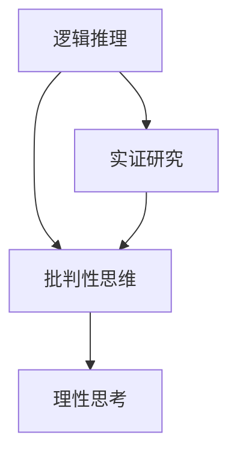

                 

### 新启蒙运动：理性思考的复兴

在现代社会，信息的洪流和多元化的价值观使我们面临前所未有的挑战。在这种背景下，理性思考的重要性愈加凸显。本文将探讨新启蒙运动的背景、核心概念，以及理性思考在各个领域的应用与实践，展望新启蒙运动的未来。希望通过这篇文章，能够激发读者对理性思考的重视，推动其在当代社会的进一步发展。

### 关键词

- 新启蒙运动
- 理性思考
- 科学方法
- 哲学思维
- 教育体系
- 全球化背景

### 摘要

本文首先介绍了新启蒙运动的起源、背景以及其与传统启蒙运动的区别。接着，探讨了理性思考的定义、重要性以及其当代价值。随后，文章从科学、哲学、社会科学和日常生活四个方面，分析了理性思考的应用与实践。最后，文章展望了新启蒙运动的未来，提出了在全球化背景下理性思考教育的体系构建和培养方法。

### 目录

1. **新启蒙运动的背景与核心概念**
    1.1 新启蒙运动的起源与背景
    1.2 理性思考的重要性
    1.3 核心概念与联系
    1.4 新启蒙运动的代表人物
    1.5 新启蒙运动与当代社会

2. **理性思考的应用与实践**
    2.1 理性思考在科学领域
    2.2 理性思考在哲学领域
    2.3 理性思考在社会科学领域
    2.4 理性思考在日常生活
    2.5 理性思考的挑战与局限

3. **新启蒙运动的未来展望**
    3.1 新启蒙运动的未来发展
    3.2 理性思考的教育与培养
    3.3 新启蒙运动与社会责任

4. **附录**
    4.1 新启蒙运动相关资源与推荐阅读

5. **终章：新启蒙运动的使命与展望**

### 第一部分：新启蒙运动的背景与核心概念

#### 1.1 新启蒙运动的起源与背景

新启蒙运动（New Enlightenment）是指自20世纪末以来，在全球范围内兴起的一种思想潮流。它是对传统启蒙运动（Enlightenment）的继承和发展，旨在重新审视和深化理性思考的重要性。传统启蒙运动起源于18世纪的欧洲，以理性、科学、自由、平等为核心理念，推动了现代社会的进步。

新启蒙运动的起源可以追溯到20世纪末的信息革命。随着计算机技术和互联网的普及，人类进入了一个信息爆炸的时代。然而，信息的泛滥和虚假信息的传播也带来了新的问题。在这种背景下，人们开始重新思考理性思考的价值，倡导通过理性思考和科学方法来解决复杂的社会问题。

新启蒙运动与传统启蒙运动的关系密不可分。传统启蒙运动奠定了现代科学和民主制度的基础，而新启蒙运动则是在这个基础上进一步深化和发展。新启蒙运动强调理性思考的科学性和实践性，倡导通过实证研究和逻辑推理来探索真理，以解决当代社会面临的各种挑战。

#### 1.2 当代社会面临的问题

当代社会面临着诸多问题，这些问题不仅挑战了人类的基本价值观，也对理性思考提出了更高的要求。

首先，环境问题日益严重。气候变化、资源短缺和污染等问题对人类生存构成了严重威胁。这些问题需要通过科学研究和理性思考来找到解决方案。

其次，社会不平等问题日益突出。经济全球化带来了巨大的利益，但同时也加剧了贫富差距和社会不公。理性思考可以帮助我们理解这些问题的根源，并提出有效的解决方案。

此外，科技发展也带来了新的挑战。人工智能、大数据和生物技术等领域的快速发展，既为人类带来了巨大的机遇，也带来了新的风险和伦理问题。理性思考可以帮助我们平衡科技发展与人类社会的关系，确保科技的应用符合人类的利益。

综上所述，当代社会面临的问题迫切需要理性思考和科学方法的指导。新启蒙运动正是在这种背景下应运而生的。

#### 1.3 理性思考的重要性

理性思考（Rational Thinking）是一种通过逻辑推理和实证研究来探索真理和解决问题的思维方式。它不仅是一种认知过程，更是一种价值观。理性思考的重要性体现在以下几个方面：

首先，理性思考是科学方法的基石。科学方法强调通过观察、实验和推理来验证假设，进而得出结论。理性思考在这个过程中起着关键作用，它帮助我们排除主观偏见，找到真理。

其次，理性思考有助于解决复杂的社会问题。在面对复杂问题时，理性思考可以帮助我们分析问题的本质，找到解决方案。例如，在解决环境问题时，理性思考可以帮助我们权衡不同解决方案的利弊，选择最优方案。

此外，理性思考还有助于提升个人决策能力。在面对各种选择时，理性思考可以帮助我们分析各种选择的可能后果，做出明智的决策。

最后，理性思考有助于促进社会公正和民主。理性思考强调通过公开讨论和辩论来达成共识，有助于消除偏见和歧视，推动社会进步。

然而，理性思考也存在一些局限性。理性思考依赖于逻辑和证据，但在某些情况下，逻辑和证据可能不充分或存在缺陷。此外，理性思考可能忽视情感和社会因素，导致一些问题的解决方案不全面。

总之，理性思考是一种重要的思维方式，它有助于我们探索真理、解决复杂问题、提升个人决策能力，并推动社会进步。在当代社会，理性思考的重要性愈加凸显。

#### 1.4 核心概念与联系

新启蒙运动的核心理念是理性思考，而理性思考的核心概念包括逻辑推理、实证研究和批判性思维。以下是这些概念之间的关系架构：

1. **逻辑推理**：逻辑推理是一种通过前提和结论之间的逻辑关系来推导出结论的思维方式。它是理性思考的基础，确保我们的思维过程是合理的。逻辑推理包括演绎推理和归纳推理。

2. **实证研究**：实证研究是一种通过收集和分析数据来验证或反驳假设的方法。它依赖于观察和实验，是科学方法的重要组成部分。实证研究通过数据来支持或否定理论，从而帮助我们更好地理解现实世界。

3. **批判性思维**：批判性思维是一种通过质疑、分析和评估信息来形成独立见解的思维方式。它强调对信息来源、逻辑结构和证据可靠性的关注。批判性思维有助于我们避免盲目接受信息，提高我们的判断力。

这些概念之间的关系如图所示：

通过逻辑推理，我们可以从已知的事实或理论中推导出新的结论。实证研究则通过收集和分析数据来验证这些结论的可靠性。批判性思维则在这个过程中起着关键作用，它帮助我们评估信息的真实性和有效性，从而形成独立的见解。这三个概念共同构成了理性思考的核心，推动了新启蒙运动的发展。

#### 1.5 新启蒙运动的代表人物

新启蒙运动涌现出了一批杰出的思想家，他们的理论和贡献对该运动产生了深远影响。以下是几位具有代表性的新启蒙运动思想家：

1. **伏尔泰**：伏尔泰（Voltaire，1694-1778）是法国启蒙运动的代表人物，他的思想对后来的新启蒙运动产生了重要影响。伏尔泰倡导言论自由、宗教宽容和科学进步。他通过文学作品和公开辩论，批判了当时的封建制度和宗教偏见。伏尔泰的思想强调理性思考和个人自由，为后来的新启蒙运动奠定了基础。

2. **罗素**：伯特兰·罗素（Bertrand Russell，1872-1970）是英国哲学家、数学家、逻辑学家，他对新启蒙运动有着重要贡献。罗素提出了逻辑原子主义，强调通过逻辑和数学来理解现实世界。他还倡导理性思考和教育改革，提出了“数学原理”这一伟大的逻辑体系。罗素的思想影响了现代逻辑学和哲学的发展，也为新启蒙运动提供了理论支持。

3. **布尔**：乔治·布尔（George Boole，1815-1864）是英国数学家、逻辑学家，他的工作对现代逻辑学有着深远影响。布尔提出了布尔代数，这是一种用于逻辑运算的数学系统。布尔代数在计算机科学和人工智能中有着广泛应用。布尔的思想为逻辑推理提供了数学基础，也为新启蒙运动的发展提供了重要工具。

这些思想家通过他们的理论和贡献，推动了新启蒙运动的发展。他们的思想不仅影响了当时的学术界，也对后来的科技和社会进步产生了深远影响。

#### 1.6 新启蒙运动对当代社会的影响

新启蒙运动对当代社会的影响是多方面的，其核心理念——理性思考，已成为现代社会不可或缺的一部分。以下是新启蒙运动对当代社会影响的几个方面：

1. **科技进步**：新启蒙运动倡导理性思考和科学方法，推动了科学技术的快速发展。从计算机科学到生物学，从物理学到心理学，理性思考在各个科学领域都取得了重大突破。这些科技进步不仅改变了我们的生活方式，也为解决当代社会面临的问题提供了新的工具。

2. **教育改革**：新启蒙运动强调批判性思维和理性思考，推动了教育改革。现代教育体系越来越多地关注培养学生的逻辑思维和分析能力。通过科学的方法和批判性思维，学生可以更好地理解世界，解决问题，并在未来的职业生涯中取得成功。

3. **社会公正**：新启蒙运动倡导通过理性思考和科学方法来解决社会问题，推动社会公正。例如，在环境保护、社会不平等和种族歧视等领域，理性思考帮助人们理解问题的根源，提出有效的解决方案。这些努力有助于构建一个更加公正和包容的社会。

4. **民主制度**：新启蒙运动强调言论自由、个人权利和民主制度。这些价值观在当代社会得到了广泛认可和实践。通过理性思考和公开辩论，社会可以更好地决策，防止权力滥用，确保民主制度的健康运行。

总之，新启蒙运动对当代社会产生了深远影响。其核心理念——理性思考，不仅推动了科技进步，促进了教育改革，也推动了社会公正和民主制度的发展。在新启蒙运动的引领下，人类社会正朝着更加理性、公正和进步的方向迈进。

#### 1.7 当代社会对理性思考的需求

当代社会对理性思考的需求日益增长，这种需求源于诸多复杂问题带来的挑战和不确定性。以下是几个方面的具体需求：

1. **应对全球挑战**：全球气候变化、能源危机、流行病爆发等挑战需要全球范围内的合作和科学决策。理性思考能够帮助我们理解复杂的问题，找到科学的解决方案，从而有效应对这些全球性挑战。

2. **提高决策质量**：在政治、商业和日常生活中，决策的质量直接影响社会的进步和个人的幸福。理性思考帮助我们分析问题的各个方面，评估不同决策的潜在后果，从而做出更明智、更科学的决策。

3. **防范虚假信息**：在信息泛滥的时代，虚假信息和误导性报道对社会造成了严重危害。理性思考帮助我们辨别信息的真实性，提高媒介素养，防止被虚假信息误导，从而保护社会的稳定和和谐。

4. **促进技术创新**：科技创新是现代社会发展的关键驱动力。理性思考有助于科学家和技术人员发现新的知识，解决复杂的科学问题，推动技术进步，从而为人类创造更多价值和福祉。

5. **培养批判性思维**：批判性思维是理性思考的重要组成部分，它有助于我们培养独立思考和分析问题的能力。在当代社会，培养批判性思维对于培养学生的创新能力和解决复杂问题至关重要。

综上所述，当代社会对理性思考的需求体现在应对全球挑战、提高决策质量、防范虚假信息、促进技术创新和培养批判性思维等多个方面。理性思考已成为现代社会不可或缺的一部分，其重要性愈加凸显。

### 第二部分：理性思考的应用与实践

#### 2.1 理性思考在科学领域

理性思考在科学领域扮演着至关重要的角色。科学方法（Scientific Method）是理性思考的核心，它提供了一种系统性的方法来探索自然界的规律和真理。以下是理性思考在科学领域应用的关键步骤和实例。

1. **提出问题**：科学研究的起点是提出一个明确的问题。这个问题通常源于对现有知识的疑惑或对自然现象的好奇。例如，科学家可能会问：“为什么物体会受到重力作用？”或“细胞是如何分裂的？”。

2. **构建假设**：在提出问题之后，科学家会构建一个假设（Hypothesis），即对问题的一种可能的答案。假设是基于现有知识和观察的推理。例如，对于重力的假设，科学家可能会认为物体之间的吸引力是导致重力作用的原因。

3. **设计实验**：为了验证假设，科学家会设计实验（Experiment）。实验需要控制变量，以确保实验结果的有效性和可靠性。例如，为了验证重力假设，科学家可能会使用自由落体实验，通过改变物体的质量和位置来观察重力的作用。

4. **收集数据**：在实验过程中，科学家会收集数据（Data）。这些数据是通过观察和测量得到的，例如，记录物体下落的时间、速度和距离。数据是科学推理的基础。

5. **分析数据**：收集到的数据需要经过分析（Analysis），以确定假设是否成立。分析通常涉及统计方法、数学模型和计算机模拟。例如，科学家可能会使用回归分析来评估物体质量和下落时间之间的关系。

6. **得出结论**：根据数据分析和结果，科学家会得出结论（Conclusion）。结论是对假设的验证或反驳。如果假设得到支持，科学家可能会进一步深入研究；如果假设被反驳，科学家会修正假设或提出新的问题。

7. **发布成果**：最后，科学家的研究成果会通过学术期刊、会议或论文的形式公开发布，供同行评审和验证。这种开放和透明的流程确保了科学知识的可靠性和可信度。

理性思考在科学领域中的应用案例不胜枚举。以下是几个典型的实例：

- **牛顿的万有引力定律**：牛顿通过观察行星运动和地球上的物体下落，提出了万有引力定律。这一假设通过大量的实验和数学计算得到验证，成为物理学的重要基石。

- **达尔文的进化论**：达尔文通过观察动植物的多样性，提出了物种进化的理论。他通过收集大量的证据，包括化石记录和动植物的变异现象，支持了他的假设。

- **爱因斯坦的相对论**：爱因斯坦通过逻辑推理和数学模型，提出了相对论。这一理论挑战了牛顿的经典力学，通过实验验证（如光电效应实验），得到了广泛认可。

这些实例表明，理性思考在科学领域中的重要性。它不仅帮助我们理解自然界的规律，也推动了科学技术的进步。通过科学方法，我们可以逐步揭示世界的本质，为人类的发展创造更多的机会。

#### 2.2 理性思考在哲学领域

理性思考在哲学领域具有悠久的历史和深厚的传统。哲学思维（Philosophical Thinking）强调通过逻辑推理、批判性分析和实证研究来探索基本问题和真理。以下是理性思考在哲学领域的应用和案例分析。

1. **问题提出**：哲学思维从对基本问题的探讨开始，如“什么是真理？”“什么是道德？”“存在是什么意思？”等。这些问题没有简单的答案，需要通过深入思考和理性分析来探索。

2. **逻辑推理**：哲学思维依赖于逻辑推理，通过推理来推导出结论。例如，亚里士多德通过三段论（A, E, I, O）来推理道德和伦理问题。逻辑推理帮助哲学家构建严谨的理论体系。

3. **实证研究**：哲学思维也重视实证研究，通过观察和实验来验证理论。例如，古希腊哲学家苏格拉底通过对话和提问来揭示真理，这种方法被称为苏格拉底法。

4. **批判性分析**：批判性分析是哲学思维的核心，它通过对现有理论和观点的质疑和反思来推进知识的发展。例如，笛卡尔的怀疑论通过质疑一切知识来寻找绝对确定的真理。

5. **案例分析**：以下是几个哲学领域的案例分析：

   - **苏格拉底的道德探究**：苏格拉底通过对话和提问来探讨道德问题。他问学生：“什么是正义？”然后通过反问和推理，引导学生认识到正义的本质是“以公正的方式对待他人”。

   - **康德的道德哲学**：康德提出了著名的“道德律令”，认为道德行动应该基于理性原则，而不是情感或利益。他通过逻辑推理，阐述了道德行为的普遍原则，如“人应该始终被当作目的，而不是手段”。

   - **尼采的存在主义**：尼采通过批判传统的道德观念，提出了存在主义的思想。他认为，生命是一种意志的展现，人类应该通过自我超越来寻找意义。他的思想对后来的哲学家，如海德格尔和萨特，产生了深远影响。

这些案例展示了理性思考在哲学领域中的应用和重要性。通过逻辑推理、实证研究和批判性分析，哲学家们不断探索和挑战基本问题，推动了哲学的发展和进步。

#### 2.3 理性思考在社会科学领域

理性思考在社会科学领域具有重要的应用价值，它帮助研究者理解和解决复杂的社会问题。以下是理性思考在社会科学领域的关键应用步骤和案例分析。

1. **问题提出**：社会科学研究通常从提出一个具体的社会问题开始。这个问题可能涉及社会政策、教育、经济、政治等领域。例如，研究者可能会问：“教育不平等如何影响社会流动？”或“经济不平等对社会稳定有何影响？”。

2. **理论构建**：在提出问题后，研究者会构建一个理论框架（Theoretical Framework），这有助于分析和解释问题。理论框架通常基于现有的学术文献和假设，例如，基于社会阶层的理论或社会交换理论。

3. **数据收集**：为了验证理论，研究者需要收集数据（Data Collection）。这些数据可以通过问卷调查、访谈、实地观察、统计数据等多种方式获取。例如，研究者可能会通过问卷调查来收集关于教育不平等的数据，或者通过访谈来了解不同社会群体对经济不平等的看法。

4. **数据分析**：收集到的数据需要经过分析（Data Analysis），以验证理论或提出新的假设。数据分析可以包括统计分析、内容分析、社会网络分析等方法。例如，研究者可能会使用回归分析来评估教育不平等对社会流动的影响。

5. **结论与讨论**：根据数据分析的结果，研究者会得出结论（Conclusion），并对研究发现进行讨论。讨论通常涉及对结果的解释、理论的应用和未来研究的方向。例如，研究者可能会讨论教育不平等如何通过影响个人的机会和资源来影响社会流动。

6. **政策建议**：在社会科学研究中，理性思考也常用于提出政策建议（Policy Recommendations）。研究者基于研究结果，提出针对社会问题的解决方案或改进措施。例如，针对教育不平等的问题，研究者可能会建议增加教育资源投入或改革教育政策。

以下是几个社会科学领域的案例分析：

- **教育不平等研究**：一项关于教育不平等的研究通过问卷调查收集数据，分析了不同社会群体在教育机会、资源和成就方面的差异。研究结果显示，教育不平等对社会流动产生了显著影响，研究者建议增加对贫困地区的教育投入。

- **经济不平等研究**：一项关于经济不平等的研究通过数据分析，评估了收入不平等对经济稳定的影响。研究结果表明，高收入不平等与经济波动之间存在显著关系，研究者建议通过税收和社会福利政策来减少收入不平等。

这些案例展示了理性思考在社会科学领域中的应用和重要性。通过系统性的研究方法和逻辑推理，社会科学研究者能够深入理解社会问题，提出有效的解决方案，为政策制定提供科学依据。

#### 2.4 理性思考在日常生活

理性思考在日常生活中也扮演着重要角色，它帮助我们做出明智的决策，解决问题，并提高生活质量。以下是理性思考在日常生活中应用的关键方面和案例分析。

1. **决策制定**：在日常生活中，我们经常需要做出各种决策，从购买商品到职业规划。理性思考可以帮助我们分析不同选项的利弊，评估潜在后果，从而做出更明智的决策。例如，在购买电子产品时，我们可以通过比较不同品牌和型号的性能、价格和用户评价，选择最适合自己需求的产品。

2. **问题解决**：理性思考是解决日常问题的重要工具。当我们遇到困难时，通过分析问题的原因、制定解决方案并执行这些方案，可以有效地解决问题。例如，如果电脑出现故障，我们可以通过检查硬件、软件和连接问题，找到并解决故障。

3. **情绪管理**：理性思考可以帮助我们管理情绪，避免被情绪驱使做出冲动的决策。例如，当我们遇到挫折或压力时，通过理性分析问题的本质，我们可以更好地应对情绪，找到解决问题的方法。

4. **时间管理**：理性思考在时间管理中也起着关键作用。通过设定目标、制定计划并优先处理重要任务，我们可以更有效地管理时间，提高工作效率。例如，每天早晨制定一份待办事项清单，并根据任务的紧急程度和重要性来安排时间，有助于我们更好地利用时间。

以下是几个日常生活中的案例分析：

- **健康生活方式**：一个人想要改善健康，可以通过理性思考来制定一个健康计划。他们可能会考虑饮食、运动和睡眠等方面，分析不同生活方式对健康的影响，并制定一个切实可行的健康计划。

- **财务管理**：在财务管理中，理性思考可以帮助我们制定预算、投资计划和退休规划。通过分析收入、支出和投资风险，我们可以制定一个合理的财务策略，实现财务目标。

这些案例展示了理性思考在日常生活中的应用和重要性。通过理性思考，我们可以更好地应对日常生活中的各种挑战，提高决策质量和生活质量。

#### 2.5 理性思考的挑战与局限

尽管理性思考在各个领域都具有重要意义，但它也面临着一系列挑战和局限。以下是理性思考的一些主要挑战和局限：

1. **情感与理性的平衡**：理性思考依赖于逻辑和证据，但人类行为往往受到情感的影响。例如，在决策过程中，情感可能会影响我们的判断和选择。因此，如何在理性思考和情感体验之间找到平衡，是一个重要的挑战。

2. **知识局限性**：理性思考依赖于现有的知识和信息。然而，知识是有限的，且不断变化。在某些情况下，我们可能缺乏足够的知识来做出理性决策。此外，知识的局限性可能导致我们忽视某些重要因素，从而影响决策的准确性。

3. **认知偏见**：人类的认知系统具有多种偏见，如确认偏见、刻板印象和过度自信等。这些偏见会影响我们的思维和判断，导致理性思考的偏差。例如，我们可能倾向于接受符合我们已有观点的信息，而忽视相反的证据。

4. **伦理困境**：在某些情况下，理性思考可能无法解决伦理困境。例如，在战争和道德选择中，理性思考可能无法提供明确的答案。伦理困境要求我们考虑道德原则和价值观，而不仅仅是逻辑和证据。

5. **复杂性**：现代社会的问题往往非常复杂，涉及多个变量和因素。理性思考可能难以应对这种复杂性，特别是在面对非线性、不确定性和不可预测性的问题时。因此，我们需要结合其他方法，如模拟、实验和直觉，来补充理性思考的不足。

总之，理性思考虽然是一种强大的工具，但它也面临一系列挑战和局限。我们需要认识到这些挑战，不断改进和扩展理性思考的方法，以更好地应对复杂的现实问题。

### 第三部分：新启蒙运动的未来展望

#### 3.1 新启蒙运动的未来发展

新启蒙运动在未来社会中将继续发挥重要作用，其影响和潜力体现在多个方面。首先，新启蒙运动将推动科学和技术的进一步发展。随着人工智能、生物工程、量子计算等前沿科技的兴起，理性思考和科学方法将成为探索和理解这些领域的关键。通过理性思考和科学方法，我们能够更好地应对科技带来的挑战，如伦理问题、隐私保护和安全风险。

其次，新启蒙运动将在全球治理中扮演重要角色。随着全球问题的日益复杂，如气候变化、全球健康危机和地缘政治冲突，理性思考和跨学科合作将成为解决这些问题的有效途径。新启蒙运动倡导的理性思考方法可以帮助决策者制定基于证据的政策，促进国际合作和可持续发展。

此外，新启蒙运动在教育领域的应用也将继续深化。随着教育技术的进步，理性思考和批判性思维的培养将成为教育改革的重要内容。通过教育体系的完善和课程设置的创新，我们可以培养更多的理性思考者，为社会的发展提供智力支持。

最后，新启蒙运动将在文化和艺术领域产生深远影响。理性思考和创造性思维相结合，将推动艺术创作和文化创新，为人类的精神生活带来新的活力和意义。

#### 3.2 理性思考的教育与培养

理性思考的教育与培养是新启蒙运动的重要组成部分，它关系到个体和社会的未来发展。以下是几个关键方面：

1. **课程设置**：教育体系应将理性思考作为核心课程，涵盖逻辑推理、批判性思维、实证研究和伦理学等内容。通过系统性的课程设置，学生可以掌握理性思考的基本技能和知识。

2. **教学方法**：教学方法应注重培养学生的独立思考和问题解决能力。教师应鼓励学生提问、探索和辩论，通过小组讨论、实验和项目式学习等方式，提高学生的理性思考能力。

3. **跨学科教育**：跨学科教育有助于学生从多个角度理解问题，培养综合分析和解决复杂问题的能力。通过跨学科合作，学生可以更好地应用理性思考，解决现实中的复杂问题。

4. **教育科技**：教育科技的进步为理性思考的教育提供了新的工具和方法。例如，虚拟现实和在线教育平台可以帮助学生进行模拟实验和互动学习，提高理性思考的实践性。

5. **教师培训**：教师应接受专门的培训，掌握理性思考的教学方法和策略。教师培训应涵盖理性思考的核心概念、教育理论和实践技巧，以提高教学效果。

6. **家庭和社会支持**：家庭和社会也应积极参与理性思考的培养。家长可以通过日常对话和互动，鼓励孩子独立思考和批判性思维。社区和媒体可以通过宣传和推广理性思考的重要性，营造支持理性思考的社会氛围。

总之，理性思考的教育与培养需要全社会的共同努力。通过完善教育体系、创新教学方法、加强跨学科教育和科技支持，我们可以培养更多具有理性思考能力的未来人才，为新启蒙运动的持续发展奠定坚实基础。

### 3.3 新启蒙运动与社会责任

新启蒙运动不仅关注理性思考和科学方法的发展，还强调其对社会责任的关注和承担。以下是新启蒙运动在社会责任方面的几个关键方面：

1. **推动社会公正**：新启蒙运动倡导通过理性思考和科学方法来解决社会不平等和公正问题。它强调通过实证研究和数据分析，揭示社会问题的根源，并提出有效的解决方案。新启蒙运动鼓励社会成员关注社会公正，推动政策制定者和社会组织采取行动，以实现更加平等和公正的社会。

2. **环境保护**：新启蒙运动认识到环境问题对人类生存和社会发展的严重威胁，强调通过理性思考和科学方法来应对气候变化、资源短缺和污染等环境问题。它倡导科学技术的应用，推动可持续发展的实践，鼓励社会成员采取环保行动，共同保护地球家园。

3. **科学普及**：新启蒙运动致力于科学普及，提高公众的科学素养。通过科学教育和公共宣传活动，新启蒙运动帮助人们理解科学原理和方法，增强公众对科学知识和科学方法的认识。这有助于培养理性思考的社会氛围，提高社会的整体科学素质。

4. **伦理规范**：新启蒙运动强调科学和技术的伦理规范，确保科技的应用符合人类的利益和社会价值观。它倡导科学家和工程师在研究和开发过程中，遵循伦理原则，关注科技可能带来的社会影响，确保科技的发展与社会的可持续发展相协调。

5. **国际合作**：新启蒙运动强调国际合作，通过理性思考和科学方法来解决全球性挑战。它倡导各国政府、科学家和国际组织加强合作，共同应对全球性问题，如气候变化、流行病和贫困等。通过国际合作，新启蒙运动推动全球社会的共同进步和发展。

总之，新启蒙运动在社会责任方面发挥着重要作用。它通过理性思考和科学方法，推动社会公正、环境保护、科学普及、伦理规范和国际合作，为构建一个更加理性、公正、可持续发展的社会贡献力量。

### 附录

#### 附录A：新启蒙运动相关资源与推荐阅读

为了帮助读者进一步了解新启蒙运动的相关知识和资源，我们推荐以下经典文献、网站和学术期刊：

1. **经典文献**：

   - **伏尔泰**：《论宗教宽容》、《哲学通信》
   - **伯特兰·罗素**：《数学原理》、《人类的知识》
   - **乔治·布尔**：《逻辑的数学分析》
   - **卡尔·波普尔**：《开放社会及其敌人》
   - **理查德·泰特洛克**：《理性与非理性：人类决策的心理机制》

2. **网站和论坛**：

   - **哲学家之石（Philosophers' Stone）**：提供哲学资源和讨论平台。
   - **维基百科**：涵盖新启蒙运动和相关主题的全面资料。
   - **TED演讲**：搜索与理性思考、科学方法相关的演讲。

3. **学术期刊**：

   - **《科学》（Science）**：全球顶尖的科学期刊，涵盖多领域的研究。
   - **《哲学评论》（Journal of Philosophy）**：哲学领域的权威期刊。
   - **《社会科学季刊》（Social Science Quarterly）**：社会科学领域的重要期刊。

#### 附录B：新启蒙运动实践案例

以下是一些新启蒙运动在实践中的成功案例：

1. **教育改革**：芬兰的教育体系以其高质量和全面性著称，这得益于理性思考和科学方法的广泛应用。芬兰的教育政策通过实证研究和数据分析，不断优化课程设置和教学方法，取得了显著的教育成果。

2. **环境保护**：德国的能源转型（Energiewende）政策通过理性思考和科学方法，推动了可再生能源的发展和能源效率的提高。这一政策不仅有助于减少温室气体排放，还促进了经济增长和就业。

3. **公共卫生**：美国的疾病控制和预防中心（CDC）通过理性思考和科学方法，开展了一系列公共卫生项目，如疫苗接种计划和传染病监测。这些项目有效降低了疾病的传播风险，提高了公众的健康水平。

4. **科技创新**：硅谷的科技企业如谷歌和特斯拉，通过理性思考和科学方法，推动了人工智能和电动汽车等前沿科技的发展。这些创新不仅改变了我们的生活方式，也为社会带来了巨大的经济价值。

通过这些实践案例，我们可以看到新启蒙运动在各个领域的重要应用和成功经验。这些案例为其他国家和地区提供了宝贵的借鉴和启示，推动了理性思考和科学方法在实践中的广泛应用。

### 终章：新启蒙运动的使命与展望

新启蒙运动的使命在于通过理性思考和科学方法，推动人类社会的进步与发展。它倡导理性思维、科学精神和批判性思维，强调对事实和证据的尊重，以及对真理和公正的追求。新启蒙运动的核心目标是在全球化背景下，构建一个理性、公正、可持续发展的社会。

在新启蒙运动的引领下，人类社会将迎来更加理性、和谐、进步的未来。以下是对新启蒙运动未来发展的展望：

首先，新启蒙运动将在科技创新中发挥重要作用。随着人工智能、大数据、生物工程等前沿科技的发展，理性思考和科学方法将成为推动科技进步的关键力量。通过科学研究和理性分析，我们可以更好地应对科技带来的挑战，确保科技的发展符合人类的利益。

其次，新启蒙运动将在全球治理中发挥重要作用。在全球性问题如气候变化、流行病和贫困面前，理性思考和跨学科合作将成为解决这些问题的关键。新启蒙运动倡导通过科学方法制定基于证据的政策，推动全球社会的共同进步。

此外，新启蒙运动将在教育领域深化影响。通过理性思考和批判性思维的培养，教育体系将培养更多具有独立思考和分析能力的人才。这些人才将成为推动社会进步的重要力量。

最后，新启蒙运动将推动社会的公正和可持续发展。通过理性思考和科学方法，我们可以更好地理解社会问题，提出有效的解决方案，促进社会公正和和谐。

总之，新启蒙运动的使命与未来展望紧密相连。通过理性思考和科学方法，新启蒙运动将推动人类社会朝着更加理性、公正、可持续发展的方向前进。让我们共同努力，为实现这一美好愿景而奋斗。

