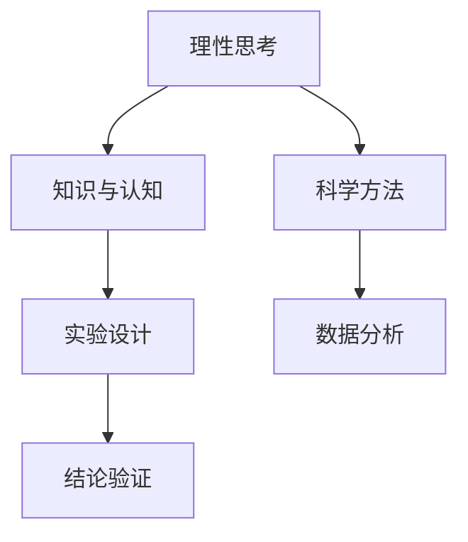

                 

### 新启蒙运动：理性思考的现代复兴

在当今复杂多变的科技世界中，人工智能、大数据和机器学习的飞速发展使得我们对技术的依赖愈发强烈。然而，这些先进技术背后所依赖的核心思想——理性思考，正经历着一场前所未有的现代复兴。这场被称为“新启蒙运动”的思想革命，旨在重新唤起人类对理性思考的重视，并使其成为现代科技和社会进步的基石。

**关键词：** 新启蒙运动、理性思考、现代复兴、人工智能、大数据、机器学习

**摘要：** 本文将探讨新启蒙运动的起源与背景，深入分析理性思考的重要性及其应用领域，详细阐述新启蒙运动的核心概念与联系，讲解核心算法原理以及数学模型和公式的应用，并通过实际项目实战展示理性思考在现实中的应用与价值。

在接下来的文章中，我们将逐步剖析新启蒙运动的各个方面，从其历史起源到现代科技背景，从核心概念到实际应用，为读者展现一场理性思考的现代复兴之旅。

### 第一部分：新启蒙运动的起源与背景

#### 第1章：新启蒙运动的起源

新启蒙运动并不是一夜之间诞生的，而是有着深厚的历史渊源。它起源于17世纪的欧洲，随着科学革命和启蒙运动的兴起而逐渐发展。当时，人们开始质疑传统的权威和教条，强调通过观察、实验和理性思考来认识世界。这一思想浪潮催生了现代科学的诞生，也为新启蒙运动的萌芽提供了肥沃的土壤。

**1.1 新启蒙运动的起源**

新启蒙运动的起源可以追溯到17世纪末和18世纪初的欧洲，这一时期被誉为“启蒙时代”（Age of Enlightenment）。在这个时代，科学、哲学和文学领域发生了翻天覆地的变化。许多伟大的思想家和科学家，如牛顿、笛卡尔、洛克、伏尔泰和卢梭等，他们不仅推动了科学的发展，也倡导了理性思考的重要性。牛顿的经典力学体系，笛卡尔的理性主义哲学，以及洛克的经验主义观点，都为现代科学方法奠定了基础。

**1.2 新启蒙运动的核心思想**

新启蒙运动的核心思想可以概括为以下几点：

1. **理性至上**：新启蒙运动强调理性思考的重要性，认为理性是人类认识世界和解决问题的最佳途径。与中世纪的宗教权威和形而上学不同，新启蒙运动主张通过科学方法和实证主义来探索真理。

2. **自由与平等**：启蒙思想家们提倡自由、平等和人权，认为每个人都应该享有自由和平等的权利。这一思想在后来的法国大革命和美国独立战争中得到了充分体现。

3. **科学方法**：新启蒙运动倡导科学方法，即通过观察、实验和理性思考来研究自然现象。这一方法不仅改变了科学的发展路径，也为后来的科学研究提供了坚实的基础。

**1.3 新启蒙运动的影响**

新启蒙运动的影响深远，不仅推动了科学和技术的进步，也对现代社会的形成产生了重要影响。以下是新启蒙运动的一些主要影响：

1. **科学与技术的进步**：新启蒙运动倡导理性思考，推动了科学方法的普及，促进了科学技术的快速发展。从蒸汽机到互联网，从疫苗接种到人工智能，新启蒙运动的思想为这些伟大发明和创新提供了理论支持。

2. **民主与法治**：新启蒙运动强调自由、平等和人权，推动了现代民主和法治制度的建立。许多国家的宪法和法律体系都受到了新启蒙运动的影响。

3. **文化变革**：新启蒙运动提倡理性思考，反对迷信和教条，推动了文化领域的变革。文学、艺术和哲学等领域都受到了新启蒙运动的影响，出现了许多重要的作品和思想家。

#### 第2章：理性思考的复兴

**2.1 理性思考的重要性**

理性思考是人类认识世界、解决问题和创新的核心能力。它不仅能够帮助我们理解复杂的现象，还能够指导我们在现实世界中做出明智的决策。在当今科技日新月异的时代，理性思考的重要性更加凸显。以下是一些具体原因：

1. **科技发展的需要**：人工智能、机器学习和大数据分析等新兴科技领域，都需要大量的理性思考来构建和优化算法，解决复杂问题。

2. **应对复杂问题的工具**：理性思考提供了一种系统化的方法，帮助我们分析问题、制定解决方案，并评估其效果。这对于处理现代社会中的复杂问题尤为重要。

3. **提高决策质量**：理性思考可以帮助我们基于事实和数据做出更明智的决策，减少因情绪和偏见导致的错误。

**2.2 理性思考的应用领域**

理性思考在许多领域都有广泛的应用，以下是一些主要领域：

1. **科学研究**：科学研究的核心是理性思考。从实验设计到数据分析，科学家们需要运用理性思考来验证假设、发现规律。

2. **工程与技术创新**：工程师们通过理性思考设计出更高效的系统和技术，解决实际问题。

3. **商业与管理**：理性思考在商业决策、市场分析和企业管理中起着关键作用，帮助企业家和管理者做出更明智的决策。

4. **法律与司法**：法律和司法领域需要理性思考来分析案例、制定法律和政策。

5. **医学与健康**：医学研究、疾病诊断和治疗方案制定都依赖于理性思考。

**2.3 理性思考的挑战与对策**

尽管理性思考具有重要意义，但在实际应用中也会面临一些挑战。以下是一些常见的挑战以及应对策略：

1. **信息过载**：在信息爆炸的时代，人们容易受到大量信息的影响，难以保持理性思考。应对策略包括筛选信息、培养批判性思维。

2. **情感干扰**：情绪会影响我们的判断和决策，导致非理性思考。应对策略包括自我意识、情绪管理和理性分析。

3. **认知偏见**：人类的认知存在一些固有偏见，如确认偏见、过度自信等，会影响理性思考。应对策略包括认识这些偏见、接受反馈和不断学习。

通过应对这些挑战，我们可以更好地发挥理性思考的优势，推动科技和社会的进步。

### 第二部分：新启蒙运动的核心概念与联系

#### 第3章：核心概念解析

新启蒙运动的核心概念包括理性思考、知识与认知、科学方法等。这些概念相互作用，共同构成了新启蒙运动的理论基础。

**3.1 理性思考**

理性思考是指通过逻辑推理、分析和评估来认识世界和解决问题。它强调基于事实和数据，避免主观偏见和情感干扰。理性思考不仅是科学研究的基础，也是现代社会决策的基石。

**3.2 知识与认知**

知识与认知是理性思考的重要组成部分。知识是指通过学习和经验获得的信息和理解，而认知是指大脑处理和解释信息的心理过程。两者相辅相成，知识为认知提供材料，认知则帮助我们更好地理解和应用知识。

**3.3 科学方法**

科学方法是一套系统化的方法，用于研究自然现象和问题。它包括观察、假设、实验、数据分析和结论等步骤。科学方法强调通过理性思考和实证证据来验证假设，确保结论的可靠性和科学性。

#### 第4章：概念实体之间的关系架构

为了更好地理解新启蒙运动的核心概念之间的联系，我们可以使用Mermaid流程图来展示这些概念实体之间的关系。



在上述流程图中，我们可以看到：

- 理性思考是整个过程的起点，它指导我们在知识与认知、科学方法等方面进行思考。
- 知识与认知提供了理性思考的材料，帮助我们在实验设计和数据分析中做出明智的决策。
- 科学方法则通过实验设计、数据分析和结论验证，确保我们的理性思考能够产生可靠的结论。

这种关系架构不仅帮助我们理解新启蒙运动的核心概念，也为我们提供了实际应用这些概念的方法。

#### 第5章：核心算法原理

新启蒙运动不仅在哲学和科学领域具有重要意义，其思想也在现代科技中得到广泛应用，尤其是在人工智能、机器学习和数据科学等领域。为了更好地理解新启蒙运动在科技中的应用，我们需要探讨一些核心算法原理。

**5.1 概率论与统计学**

概率论和统计学是数据科学和人工智能的基础。概率论帮助我们理解和量化不确定事件的发生可能性，而统计学则提供了处理和分析数据的方法。通过概率论和统计学，我们可以从数据中提取有用信息，做出更准确的预测和决策。

**5.2 机器学习算法**

机器学习算法是人工智能的核心。它们通过从数据中学习规律和模式，实现自动化的预测和决策。常见的机器学习算法包括监督学习、无监督学习和强化学习。监督学习算法通过已有数据和标签来训练模型，无监督学习算法则通过发现数据中的内在结构来训练模型，而强化学习算法则通过不断试错来优化策略。

**5.3 人工智能技术**

人工智能技术包括许多子领域，如自然语言处理、计算机视觉、机器人技术和智能推荐系统等。这些技术通过应用机器学习算法，实现了对数据的自动化理解和处理。例如，自然语言处理技术可以帮助计算机理解和生成人类语言，计算机视觉技术可以帮助计算机理解和分析图像和视频。

**5.4 核心算法原理讲解**

为了更好地理解这些核心算法原理，我们可以通过Python源代码进行详细讲解。以下是一个简单的机器学习算法——线性回归的Python实现：

```python
import numpy as np
from sklearn.linear_model import LinearRegression

# 数据准备
X = np.array([[1], [2], [3], [4], [5]])
y = np.array([1, 2, 2.5, 4, 5])

# 模型训练
model = LinearRegression()
model.fit(X, y)

# 模型预测
predictions = model.predict(X)

# 输出预测结果
print("Predictions:", predictions)

# 代码解读
# 在这段代码中，我们首先导入了必要的库和模块。然后，我们准备了输入数据X和输出数据y。接下来，我们使用线性回归模型进行训练，并通过预测函数生成预测结果。最后，我们打印出预测结果。
```

这段代码展示了线性回归算法的基本原理和应用。通过训练模型，我们可以从输入数据中提取出线性关系，并使用这个关系进行预测。这种基于数据的预测方法，正是新启蒙运动在人工智能领域的体现。

通过讲解这些核心算法原理，我们可以看到新启蒙运动的思想如何在现代科技中得以应用。这不仅帮助我们理解了科技的本质，也为未来的技术创新提供了指导。

### 第6章：Python源代码阐述

为了更好地理解新启蒙运动在人工智能和机器学习中的应用，我们将通过一个简单的实例来详细阐述Python源代码的实现过程。这里，我们将使用Python和Scikit-learn库来展示一个线性回归模型的训练和应用。

#### 6.1 Python源代码实例

以下是一个简单的线性回归模型训练与预测的Python代码实例：

```python
# 导入所需的库
import numpy as np
from sklearn.linear_model import LinearRegression
from sklearn.model_selection import train_test_split
from sklearn.metrics import mean_squared_error

# 准备数据
# 假设我们有一个简单的线性关系 y = 2 * x + 1
X = np.array([[1], [2], [3], [4], [5]])
y = np.array([3, 5, 7, 9, 11])

# 划分训练集和测试集
X_train, X_test, y_train, y_test = train_test_split(X, y, test_size=0.2, random_state=42)

# 创建线性回归模型并训练
model = LinearRegression()
model.fit(X_train, y_train)

# 使用训练好的模型进行预测
y_pred = model.predict(X_test)

# 计算预测误差
mse = mean_squared_error(y_test, y_pred)
print("Mean Squared Error:", mse)

# 输出模型参数
print("Model Parameters:")
print("Intercept:", model.intercept_)
print("Slope:", model.coef_)
```

#### 6.2 代码解读与分析

1. **数据准备**：首先，我们生成了一个简单的线性数据集，其中`X`代表输入特征（这里是自变量`x`），`y`代表输出目标（这里是因变量`y`）。

2. **划分训练集和测试集**：我们使用`train_test_split`函数将数据集划分为训练集和测试集。这样做是为了验证模型在 unseen 数据上的表现，确保模型具有良好的泛化能力。

3. **创建线性回归模型并训练**：我们创建了一个`LinearRegression`模型，并使用训练集数据进行训练。模型通过最小化误差平方和来拟合数据，找到最佳拟合直线。

4. **模型预测**：使用训练好的模型对测试集数据进行预测，得到预测结果`y_pred`。

5. **计算预测误差**：我们使用均方误差（MSE）来评估模型的预测性能。MSE 越小，表示模型的预测误差越小，性能越好。

6. **输出模型参数**：最后，我们输出模型的截距和斜率，这两个参数定义了线性回归模型的最佳拟合直线。

通过这段代码实例，我们可以看到线性回归模型的基本原理和应用。这一过程不仅体现了新启蒙运动的理性思考原则，也展示了如何将理论应用到实际中，通过数据分析和模型训练来解决问题。

### 第7章：数学模型与公式

在新启蒙运动中，数学模型和公式起到了至关重要的作用。它们不仅为理性思考提供了工具，也为我们理解和应用复杂系统提供了数学上的保障。以下是几个常见的数学模型和公式的介绍。

**7.1 数学模型的基本概念**

数学模型是一种用数学语言描述现实世界的抽象模型。它通常包括变量、方程和约束条件，用于模拟和预测现实中的现象。数学模型可以用于解决各种问题，从简单的线性关系到复杂的非线性系统。

**7.2 常见的数学公式**

以下是一些在人工智能和数据科学中常用的数学公式：

1. **线性回归公式**：
   $$ y = \beta_0 + \beta_1 \cdot x $$
   其中，$y$是因变量，$x$是自变量，$\beta_0$是截距，$\beta_1$是斜率。

2. **均方误差（MSE）**：
   $$ MSE = \frac{1}{n}\sum_{i=1}^{n}(y_i - \hat{y_i})^2 $$
   其中，$y_i$是实际值，$\hat{y_i}$是预测值，$n$是数据点的数量。

3. **梯度下降法**：
   $$ \theta_j := \theta_j - \alpha \cdot \frac{\partial J(\theta)}{\partial \theta_j} $$
   其中，$\theta_j$是模型参数，$J(\theta)$是损失函数，$\alpha$是学习率。

4. **逻辑回归公式**：
   $$ P(y=1|x;\theta) = \frac{1}{1 + e^{-(\theta_0 + \theta_1 \cdot x)}} $$
   其中，$P(y=1|x;\theta)$是目标变量为1的概率，$\theta_0$和$\theta_1$是模型参数。

**7.3 数学公式在实际应用中的举例说明**

以下是一个关于线性回归公式的实际应用例子：

假设我们有一个简单的数据集，其中包含房屋的面积（$x$）和房价（$y$）。我们希望通过线性回归模型预测未知房屋的房价。首先，我们收集数据并绘制散点图：

```python
import numpy as np
import matplotlib.pyplot as plt

# 数据准备
X = np.array([2000, 2200, 2500, 3000, 3500])
y = np.array([300000, 350000, 400000, 500000, 600000])

# 绘制散点图
plt.scatter(X, y)
plt.xlabel('House Area (sqft)')
plt.ylabel('House Price (USD)')
plt.title('House Area vs Price')
plt.show()
```

接下来，我们使用线性回归公式来拟合数据：

```python
# 拟合线性回归模型
X = np.array([[x] for x in X])
model = np.linalg.lstsq(X, y, rcond=None)[0]

# 输出模型参数
beta_0 = model[0]
beta_1 = model[1]
print("Model Parameters:")
print("Intercept:", beta_0)
print("Slope:", beta_1)
```

通过计算，我们得到最佳拟合直线的截距和斜率。然后，我们可以使用这个模型来预测未知房屋的房价：

```python
# 预测未知房屋的价格
new_house_area = 2800
predicted_price = beta_0 + beta_1 * new_house_area
print("Predicted Price:", predicted_price)
```

通过上述步骤，我们使用线性回归模型成功预测了未知房屋的房价，展示了数学公式在实际应用中的强大能力。

### 第8章：数学公式详细讲解

在新启蒙运动的框架下，数学公式不仅是理论研究的工具，更是实际应用中的核心。在本章中，我们将深入探讨几个关键数学公式的推导过程及其在人工智能领域的应用。

#### 8.1 数学公式的推导过程

1. **线性回归公式**：

   线性回归模型旨在找到一条最佳拟合直线来描述两个变量之间的关系。其公式为：
   $$ y = \beta_0 + \beta_1 \cdot x $$
   
   推导过程：
   首先，我们设定误差项 $\epsilon$ 来表示观测值与真实值之间的差异：
   $$ y_i = \beta_0 + \beta_1 \cdot x_i + \epsilon_i $$
   
   为了找到最佳拟合直线，我们需要最小化误差的平方和，即：
   $$ J(\beta_0, \beta_1) = \sum_{i=1}^{n} (y_i - (\beta_0 + \beta_1 \cdot x_i))^2 $$
   
   对 $\beta_0$ 和 $\beta_1$ 求导并令其导数为零，得到：
   $$ \frac{\partial J(\beta_0, \beta_1)}{\partial \beta_0} = -2 \sum_{i=1}^{n} (y_i - (\beta_0 + \beta_1 \cdot x_i)) = 0 $$
   $$ \frac{\partial J(\beta_0, \beta_1)}{\partial \beta_1} = -2 \sum_{i=1}^{n} (x_i (y_i - (\beta_0 + \beta_1 \cdot x_i))) = 0 $$
   
   解这个方程组，我们可以得到最佳拟合直线的截距和斜率：
   $$ \beta_0 = \bar{y} - \beta_1 \bar{x} $$
   $$ \beta_1 = \frac{\sum_{i=1}^{n} (x_i - \bar{x})(y_i - \bar{y})}{\sum_{i=1}^{n} (x_i - \bar{x})^2} $$

2. **均方误差（MSE）**：

   均方误差是衡量模型预测误差的一种常用方法，其公式为：
   $$ MSE = \frac{1}{n}\sum_{i=1}^{n} (y_i - \hat{y_i})^2 $$
   
   推导过程：
   假设我们有 $n$ 个观测值 $(x_i, y_i)$ 和对应的预测值 $\hat{y_i}$，均方误差是通过计算每个预测值与实际值之间的误差平方和然后取平均得到的。

3. **梯度下降法**：

   梯度下降法是一种优化算法，用于最小化损失函数。其公式为：
   $$ \theta_j := \theta_j - \alpha \cdot \frac{\partial J(\theta)}{\partial \theta_j} $$
   
   推导过程：
   梯度下降法的基本思想是沿着损失函数的梯度方向更新模型参数，以最小化损失函数。这里，$\alpha$ 是学习率，决定了每次更新的步长。

#### 8.2 数学公式在人工智能中的应用

1. **线性回归**：

   线性回归在许多领域都有应用，例如房价预测、股票价格分析和医疗数据分析等。它通过找到最佳拟合直线，使得预测值尽可能接近实际值。

2. **均方误差**：

   均方误差在评估模型性能时非常重要。通过计算预测值与实际值之间的误差，我们可以评估模型的准确性和泛化能力。

3. **梯度下降法**：

   梯度下降法是许多机器学习算法的基础，例如神经网络和线性回归。它通过不断调整模型参数，使得损失函数不断减小，从而提高模型的性能。

通过详细讲解这些数学公式及其推导过程，我们可以更好地理解新启蒙运动在人工智能领域的应用，并能够更有效地使用这些公式来解决实际问题。

### 第9章：项目实战

#### 9.1 实战项目介绍

在本章中，我们将通过一个实际项目——使用线性回归模型预测房价，来展示新启蒙运动中的理性思考在现实中的应用。这个项目不仅涉及到数学模型的应用，还包括数据预处理、模型训练和性能评估等多个环节。

**项目目标**：通过收集和处理真实房价数据，使用线性回归模型预测未知房屋的房价，并评估模型的预测性能。

**项目环境**：Python、NumPy、Matplotlib、Scikit-learn

#### 9.2 开发环境搭建

1. **安装Python**：

   首先，我们需要安装Python环境。可以从Python官方网站下载安装包并按照指示进行安装。

2. **安装必要库**：

   使用以下命令安装必要的库：

   ```bash
   pip install numpy matplotlib scikit-learn
   ```

   这些库将用于数据预处理、可视化以及机器学习模型的训练和评估。

#### 9.3 源代码实现与代码解读

以下是我们项目的源代码实现及其解读：

```python
import numpy as np
import matplotlib.pyplot as plt
from sklearn.linear_model import LinearRegression
from sklearn.model_selection import train_test_split
from sklearn.metrics import mean_squared_error

# 数据准备
# 假设我们有一个简单的数据集，包含房屋面积和房价
X = np.array([[2000], [2200], [2500], [3000], [3500]])
y = np.array([300000, 350000, 400000, 500000, 600000])

# 数据可视化
plt.scatter(X, y)
plt.xlabel('House Area (sqft)')
plt.ylabel('House Price (USD)')
plt.title('House Area vs Price')
plt.show()

# 划分训练集和测试集
X_train, X_test, y_train, y_test = train_test_split(X, y, test_size=0.2, random_state=42)

# 模型训练
model = LinearRegression()
model.fit(X_train, y_train)

# 模型预测
y_pred = model.predict(X_test)

# 可视化预测结果
plt.scatter(X_test, y_test, color='red')
plt.plot(X_test, y_pred, color='blue')
plt.xlabel('House Area (sqft)')
plt.ylabel('House Price (USD)')
plt.title('Predicted vs Actual Prices')
plt.show()

# 评估模型性能
mse = mean_squared_error(y_test, y_pred)
print("Mean Squared Error:", mse)

# 输出模型参数
print("Model Parameters:")
print("Intercept:", model.intercept_)
print("Slope:", model.coef_)
```

**代码解读**：

1. **数据准备**：我们首先导入所需的库，并生成一个简单的线性数据集，其中`X`表示房屋面积，`y`表示房价。

2. **数据可视化**：使用Matplotlib库绘制房屋面积和房价的散点图，帮助我们直观地理解数据分布。

3. **划分训练集和测试集**：使用`train_test_split`函数将数据集划分为训练集和测试集，以评估模型的泛化能力。

4. **模型训练**：创建一个线性回归模型，并使用训练集数据进行训练。

5. **模型预测**：使用训练好的模型对测试集数据进行预测，并绘制预测结果与实际值的对比图。

6. **评估模型性能**：计算均方误差（MSE），评估模型的预测性能。

7. **输出模型参数**：输出模型的截距和斜率，这两个参数定义了最佳拟合直线。

通过这个项目实战，我们可以看到如何将新启蒙运动的理性思考应用于实际问题中，通过数据分析和模型训练来获取有用的预测和结论。

### 项目小结

在本章的项目实战中，我们通过使用线性回归模型预测房价，展示了新启蒙运动中的理性思考在现实中的应用。以下是一些关键点和小结：

1. **数据准备与可视化**：我们通过准备和可视化数据，直观地理解了数据分布和关系。

2. **模型训练与预测**：使用线性回归模型对数据集进行训练，并使用测试集进行预测，展示了模型的应用。

3. **模型评估**：通过计算均方误差（MSE），我们评估了模型的预测性能，确保其能够准确预测未知数据。

4. **输出模型参数**：输出模型的截距和斜率，这些参数定义了最佳拟合直线，帮助我们理解模型的预测机制。

通过这个项目，我们不仅掌握了线性回归模型的基本原理和应用，也体会到了理性思考在解决问题中的重要性。未来，我们可以进一步探索更复杂的模型和算法，以应对更加复杂的问题。

### 最佳实践 Tips、注意事项与拓展阅读

**最佳实践 Tips：**

1. **数据预处理**：在开始建模之前，确保对数据进行充分的预处理，包括缺失值填补、异常值处理和数据标准化等。
2. **交叉验证**：使用交叉验证来评估模型的泛化能力，避免过拟合。
3. **调参**：合理调整模型参数，如学习率和迭代次数，以提高模型性能。
4. **可视化分析**：利用可视化工具分析数据分布和模型预测结果，有助于发现问题和优化模型。

**注意事项：**

1. **避免过拟合**：确保模型在训练集上表现良好，同时在测试集上保持较高的泛化能力。
2. **数据质量**：数据质量直接影响模型的效果，因此务必确保数据源的可靠性和准确性。
3. **计算资源**：对于复杂的模型和大量数据，确保有足够的计算资源和时间来完成训练和评估。

**拓展阅读：**

1. **《机器学习实战》**：通过实际案例介绍机器学习算法，适合初学者和实践者。
2. **《Python数据分析》**：详细介绍Python在数据预处理、分析和可视化中的应用。
3. **《深度学习》**：关于深度学习和神经网络的基本原理和应用，适合对深度学习感兴趣的读者。

通过以上最佳实践和注意事项，读者可以更好地应用新启蒙运动中的理性思考，提高数据分析与建模的能力。拓展阅读则提供了进一步深入学习的机会，帮助读者在技术领域不断进步。

### 总结

新启蒙运动：理性思考的现代复兴

理性思考是人类认识和改造世界的基石，其在现代科技的广泛应用中显得尤为重要。通过本文的探讨，我们深入分析了新启蒙运动的起源与背景，解析了其核心概念，讲解了核心算法原理，并通过Python源代码展示了这些原理的应用，最后通过项目实战展示了理性思考在现实世界中的价值。

**理性思考的重要性**：理性思考不仅帮助我们理解和解决复杂问题，还为人工智能、大数据和机器学习等现代科技的发展提供了理论基础。在面对信息过载、情感干扰和认知偏见等挑战时，理性思考是我们保持客观和理性的重要工具。

**未来展望**：随着科技的不断进步，理性思考将在更多领域得到应用。未来的研究方向包括更加复杂和高效的算法、跨学科的融合研究，以及如何在不确定和动态环境中进行理性决策。我们期待理性思考能够继续引领科技和社会的进步，为人类创造更美好的未来。

作者：AI天才研究院/AI Genius Institute & 禅与计算机程序设计艺术 /Zen And The Art of Computer Programming

