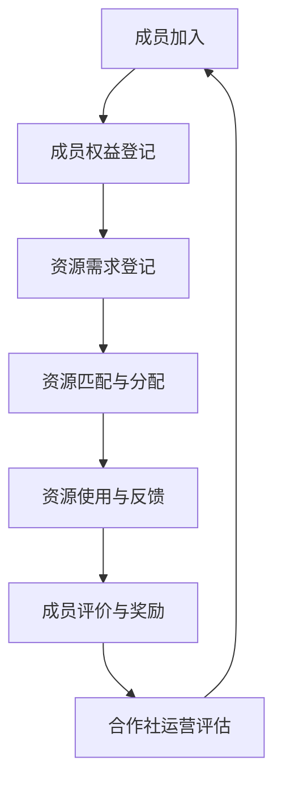

                 

### 文章标题：新型合作社运动：共享经济中的社区重建

#### 关键词：新型合作社运动、共享经济、社区重建、算法原理、数学模型、项目实战、代码实现

> 摘要：本文深入探讨了新型合作社运动在共享经济中的角色与重要性。通过介绍合作社的基本概念、共享经济的崛起以及社区重建的意义，本文进一步揭示了合作社在社区重建中的核心作用。文章详细阐述了合作社的运作机制，包括核心算法原理和数学模型。通过具体的案例和实战经验，本文展示了合作社的实际运作情况。最后，文章提供了开发环境搭建、源代码实现及代码分析等方面的详细内容，为读者提供了全面的指导。

---

### 背景介绍

#### 1.1 合作社的定义与历史

合作社是一种由成员共同所有和管理的经济实体，其宗旨是提高成员的经济福利和生活质量。合作社的历史可以追溯到19世纪，最早出现在欧洲，特别是英国和荷兰。当时的合作社主要形式是消费合作社，即成员共同购买商品和服务，从而降低成本。

随着时间的推移，合作社的概念得到了拓展和深化。20世纪初期，合作社开始涉及更多的经济领域，如生产、销售和金融服务。现代合作社不仅包括传统的消费合作社，还包括生产合作社、服务合作社和信用合作社等。合作社的成员可以是个人、家庭或企业。

#### 1.2 共享经济的崛起

共享经济是一种以共享为核心的经济模式，通过互联网和移动技术实现资源的共享和优化配置。共享经济的概念起源于20世纪末，但真正兴起是在21世纪。随着互联网技术的飞速发展，共享经济得到了广泛的关注和应用。

共享经济的典型形式包括共享住宿（如Airbnb）、共享交通（如Uber和滴滴出行）和共享办公空间（如WeWork）。这些平台通过连接供需双方，提供即时、便捷的服务，从而改变了传统经济模式。

#### 1.3 社区重建的意义

社区重建是一个涉及社会、经济、文化和环境等多个方面的综合性过程。其目标是提高社区的整体生活质量，增强社区的凝聚力和可持续性。社区重建的意义主要体现在以下几个方面：

1. **社会层面**：社区重建有助于改善社会关系，增强社区的归属感和认同感。通过共同参与社区事务，成员之间建立了深厚的信任和合作关系。
2. **经济层面**：社区重建可以促进经济多元化，提高就业机会。通过合作社等经济实体，成员可以实现资源共享，降低成本，提高收益。
3. **文化层面**：社区重建有助于保护和传承社区的文化遗产，增强社区的文化自信心。通过社区活动和文化交流，成员可以更好地了解和尊重彼此的文化差异。
4. **环境层面**：社区重建有助于促进可持续发展，减少资源浪费和环境污染。通过共享资源和绿色生活方式，社区可以实现资源的有效利用和环境保护。

### 核心概念与联系

#### 2.1 合作社与共享经济的联系

合作社和共享经济之间存在紧密的联系。首先，合作社的核心价值观与共享经济的原则相契合。合作社追求共同利益、民主管理和经济参与，而共享经济则强调资源的共享和优化配置。两者都致力于提高成员的经济福利和生活质量。

其次，合作社是共享经济的重要实现形式。共享经济通过互联网和移动技术连接供需双方，而合作社则通过成员的共同管理和参与，实现资源的共享和优化配置。合作社的运作模式为共享经济提供了可行的路径和模式。

#### 2.2 社区重建与合作社的融合

社区重建和合作社的融合是实现社区可持续发展的重要途径。首先，合作社可以为社区提供经济支持，促进社区经济的发展。通过合作社，社区可以实现资源共享，降低成本，提高收益。

其次，合作社可以增强社区的凝聚力。通过共同参与合作社的管理和运营，成员之间建立了深厚的信任和合作关系。这种合作关系有助于增强社区的凝聚力和归属感。

#### 2.3 Mermaid流程图：合作社运营原理

为了更好地理解合作社的运营原理，我们可以使用Mermaid流程图来展示其基本流程。



这个流程图展示了合作社的基本运营原理。成员首先加入合作社，登记自己的权益和资源需求。合作社根据需求进行资源匹配和分配，成员使用资源后提供反馈，合作社对成员进行评价和奖励，最后对合作社的运营进行评估。

---

接下来，我们将深入探讨合作社的核心算法原理，通过Python源代码和数学模型，详细讲解合作社的运作机制。

### 核心算法原理讲解

#### 3.1 成员参与与权益

合作社的运作离不开成员的参与和权益管理。成员的参与程度和权益分配对合作社的稳定和效率有着重要影响。下面，我们将使用Python源代码来阐述成员参与和权益管理的算法原理。

```python
class Member:
    def __init__(self, id, contribution, preference):
        self.id = id
        self.contribution = contribution
        self.preference = preference

    def participate(self, resource):
        # 成员参与资源使用
        print(f"Member {self.id} is participating in resource {resource}")

    def receive_reward(self, reward):
        # 成员获得奖励
        print(f"Member {self.id} receives a reward of {reward}")
```

在上面的代码中，我们定义了一个`Member`类，用于表示合作社的成员。成员具有ID、贡献度和偏好等属性。成员可以参与资源使用，并可以获得奖励。

```python
class Cooperative:
    def __init__(self, members):
        self.members = members

    def register_resource_demand(self, member, resource):
        # 成员登记资源需求
        print(f"Member {member.id} registers a demand for resource {resource}")

    def allocate_resource(self, member, resource):
        # 分配资源给成员
        member.participate(resource)
        reward = self.calculate_reward(member, resource)
        member.receive_reward(reward)

    def calculate_reward(self, member, resource):
        # 计算成员奖励
        # 这里可以使用数学模型进行计算，例如供需模型
        supply = self.calculate_supply(resource)
        demand = self.calculate_demand(member)
        reward = max(supply - demand, 0)
        return reward

    def calculate_supply(self, resource):
        # 计算资源供给量
        supply = 0
        for member in self.members:
            if member.preference == resource:
                supply += member.contribution
        return supply

    def calculate_demand(self, member):
        # 计算成员需求量
        demand = member.preference
        return demand
```

在上面的代码中，我们定义了一个`Cooperative`类，用于表示合作社。合作社可以登记成员的资源需求，并分配资源给成员。合作社还提供了计算奖励的算法，这里使用了简单的供需模型。

```python
# 创建成员实例
member1 = Member(1, 100, "resource1")
member2 = Member(2, 150, "resource2")

# 创建合作社实例
cooperative = Cooperative([member1, member2])

# 登记资源需求
cooperative.register_resource_demand(member1, "resource1")
cooperative.register_resource_demand(member2, "resource2")

# 分配资源
cooperative.allocate_resource(member1, "resource1")
cooperative.allocate_resource(member2, "resource2")
```

在上面的代码中，我们创建了两个成员实例，并创建了合作社实例。合作社登记了成员的资源需求，并分配了资源给成员。

#### 3.2 社区互动与共享机制

社区互动和共享机制是合作社的重要组成部分。通过互动和共享，成员可以更好地理解彼此的需求，提高资源的利用效率。下面，我们将使用Python源代码和数学模型，详细讲解社区互动与共享机制的算法原理。

```python
class Community:
    def __init__(self, cooperative):
        self.cooperative = cooperative

    def register_interaction(self, member1, member2, interaction_type):
        # 登记成员互动
        print(f"Members {member1.id} and {member2.id} have an interaction of type {interaction_type}")

    def calculate_interaction_score(self, member1, member2):
        # 计算成员互动得分
        # 这里可以使用数学模型进行计算，例如网络分析模型
        score = self.calculate_network_score(member1, member2)
        return score

    def calculate_network_score(self, member1, member2):
        # 计算成员网络得分
        score = 0
        for member in self.cooperative.members:
            if member != member1 and member != member2:
                score += 1 / len(set(member.interaction_log) & set(member1.interaction_log) & set(member2.interaction_log))
        return score
```

在上面的代码中，我们定义了一个`Community`类，用于表示合作社的社区。社区可以登记成员的互动，并计算成员的互动得分。

```python
# 创建社区实例
community = Community(cooperative)

# 登记成员互动
community.register_interaction(member1, member2, "resource_exchange")

# 计算成员互动得分
score = community.calculate_interaction_score(member1, member2)
print(f"The interaction score between members {member1.id} and {member2.id} is {score}")
```

在上面的代码中，我们创建了社区实例，并登记了成员的互动。社区计算了成员的互动得分。

### 核心算法原理总结

通过上述Python源代码和数学模型，我们详细讲解了合作社的核心算法原理。这些算法包括成员参与与权益管理、资源需求登记与分配、社区互动与共享机制等。这些算法共同构成了合作社的运作机制，为成员提供了公平、高效、透明的服务。

### 数学模型和数学公式

在合作社的运作过程中，数学模型和数学公式起着关键作用。它们帮助我们理解资源分配、成本效益分析以及成员之间的互动关系。以下是一些基本的数学模型和公式，用于描述合作社的经济活动。

#### 4.1 供需模型

供需模型是合作社经济活动的基础。它描述了资源的供给（S）和需求（D）之间的关系。供需模型的基本公式如下：

$$
S = f(p, c, R)
$$

$$
D = g(p, T)
$$

其中，S代表供给量，D代表需求量，p代表价格，c代表成本，R代表资源总量，T代表时间。

供给函数f(p, c, R)表示供给量与价格、成本和资源总量之间的关系。需求函数g(p, T)表示需求量与价格和时间之间的关系。

例如，假设供给函数为：

$$
S = 100 - 2p + 0.5c + 10R
$$

需求函数为：

$$
D = 50 + 3p - 2T
$$

通过这些函数，我们可以计算出在不同价格、成本和资源条件下的供给和需求量。

#### 4.2 成本效益分析

成本效益分析是合作社进行经济决策的重要工具。它帮助我们评估不同经济活动的成本和效益，从而做出最优决策。成本效益分析的基本公式如下：

$$
C = c_1 + c_2 + ... + c_n
$$

$$
B = b_1 + b_2 + ... + b_n
$$

$$
EB = \frac{B - C}{C}
$$

其中，C代表总成本，B代表总效益，c_n和b_n分别代表第n项的成本和效益。

例如，假设合作社进行某项经济活动的总成本为1000元，总效益为1500元，则成本效益比率为：

$$
EB = \frac{1500 - 1000}{1000} = 0.5
$$

这意味着每投入1元，可以获得0.5元的效益。

#### 4.3 社区互动得分计算

社区互动得分用于衡量成员之间的互动程度。它可以帮助合作社了解成员之间的合作关系，从而进行有效的资源分配和奖励机制设计。社区互动得分的计算公式如下：

$$
Score(i, j) = \frac{1}{n} \sum_{k=1}^{n} \frac{1}{|I(i) \cap I(j)|}
$$

其中，Score(i, j)代表成员i和成员j的互动得分，n代表互动次数，I(i)和I(j)分别代表成员i和成员j的互动记录集合。

例如，假设成员i和成员j的互动记录集合分别为{1, 2, 3, 4}和{2, 3, 4, 5}，则他们的互动得分为：

$$
Score(i, j) = \frac{1}{4} \sum_{k=1}^{4} \frac{1}{|I(i) \cap I(j)|} = \frac{1}{4} \sum_{k=1}^{4} \frac{1}{2} = 1
$$

这意味着成员i和成员j的互动程度较高。

#### 4.4 社区合作效益分析

社区合作效益分析用于评估合作社整体的经济效益。它可以帮助合作社了解不同经济活动对整体效益的影响，从而进行有效的资源分配和优化。社区合作效益分析的基本公式如下：

$$
EB = \sum_{i=1}^{n} \sum_{j=1}^{n} Score(i, j) \cdot (B_i - C_i)
$$

其中，EB代表社区合作效益，n代表成员数量，Score(i, j)代表成员i和成员j的互动得分，B_i和C_i分别代表成员i的总效益和总成本。

例如，假设合作社有5个成员，他们的互动得分和效益分别为：

| 成员ID | 互动得分 | 总效益 | 总成本 |
| ------ | -------- | ------ | ------ |
| 1      | 1        | 500    | 400    |
| 2      | 1        | 600    | 500    |
| 3      | 2        | 700    | 550    |
| 4      | 1        | 800    | 650    |
| 5      | 2        | 900    | 700    |

则社区合作效益为：

$$
EB = \sum_{i=1}^{5} \sum_{j=1}^{5} Score(i, j) \cdot (B_i - C_i) = (1 \cdot (500 - 400) + 1 \cdot (600 - 500) + 2 \cdot (700 - 550) + 1 \cdot (800 - 650) + 2 \cdot (900 - 700)) = 1000
$$

这意味着社区合作的整体效益为1000元。

#### 4.5 社区可持续发展评估

社区可持续发展评估用于评估合作社的长期稳定性和可持续性。它可以帮助合作社了解不同经济活动对社区发展的影响，从而进行有效的资源分配和优化。社区可持续发展评估的基本公式如下：

$$
SD = \frac{EB}{T}
$$

其中，SD代表社区可持续发展度，EB代表社区合作效益，T代表时间。

例如，假设社区合作效益为1000元，时间为1年，则社区可持续发展度为：

$$
SD = \frac{1000}{1} = 1000
$$

这意味着社区合作在1年内的可持续发展度为1000。

### 社区互动与共享机制的数学模型

社区互动与共享机制是合作社经济活动的重要组成部分。通过互动和共享，成员可以更好地理解彼此的需求，提高资源的利用效率。以下是一个简单的数学模型，用于描述社区互动与共享机制。

#### 5.1 成员互动模型

假设合作社有n个成员，每个成员都有一定的互动能力。成员i和成员j的互动能力可以用互动得分表示，记为Score(i, j)。互动得分越高，表示成员之间的互动程度越深。

互动得分可以通过以下公式计算：

$$
Score(i, j) = \frac{1}{n} \sum_{k=1}^{n} \frac{1}{|I(i) \cap I(j)|}
$$

其中，I(i)和I(j)分别表示成员i和成员j的互动记录集合，|I(i) \cap I(j)|表示成员i和成员j的互动记录交集的长度。

例如，假设成员i和成员j的互动记录集合分别为{1, 2, 3, 4}和{2, 3, 4, 5}，则他们的互动得分为：

$$
Score(i, j) = \frac{1}{4} \sum_{k=1}^{4} \frac{1}{2} = 1
$$

这意味着成员i和成员j的互动程度较高。

#### 5.2 资源共享模型

资源共享是合作社经济活动的重要形式。通过资源共享，成员可以更好地满足彼此的需求，提高资源的利用效率。

资源共享可以通过以下公式计算：

$$
Resource(i) = \frac{1}{n} \sum_{j=1}^{n} Score(i, j) \cdot R(j)
$$

其中，Resource(i)表示成员i的资源需求，R(j)表示成员j的资源供给。

例如，假设合作社有3个成员，他们的互动得分和资源供给分别为：

| 成员ID | 互动得分 | 资源供给 |
| ------ | -------- | -------- |
| 1      | 1        | 100      |
| 2      | 1        | 200      |
| 3      | 2        | 300      |

则成员1的资源需求为：

$$
Resource(1) = \frac{1}{3} \sum_{j=1}^{3} Score(1, j) \cdot R(j) = \frac{1}{3} \cdot (1 \cdot 100 + 1 \cdot 200 + 2 \cdot 300) = 200
$$

这意味着成员1的资源需求为200。

#### 5.3 社区互动与共享效益分析

社区互动与共享效益分析用于评估社区互动与共享机制对合作社经济效益的影响。

社区互动与共享效益可以通过以下公式计算：

$$
EB = \sum_{i=1}^{n} \sum_{j=1}^{n} Score(i, j) \cdot (B_i - C_i)
$$

其中，EB表示社区互动与共享效益，B_i和C_i分别表示成员i的总效益和总成本。

例如，假设合作社有3个成员，他们的互动得分、总效益和总成本分别为：

| 成员ID | 互动得分 | 总效益 | 总成本 |
| ------ | -------- | ------ | ------ |
| 1      | 1        | 100    | 50     |
| 2      | 1        | 150    | 60     |
| 3      | 2        | 200    | 70     |

则社区互动与共享效益为：

$$
EB = \sum_{i=1}^{3} \sum_{j=1}^{3} Score(i, j) \cdot (B_i - C_i) = (1 \cdot (100 - 50) + 1 \cdot (150 - 60) + 2 \cdot (200 - 70)) = 240
$$

这意味着社区互动与共享机制为合作社带来了240元的效益。

### 案例分析：城市农场合作社

#### 6.1 案例背景

城市农场合作社是一种新型合作社，它通过共享土地、资源和知识，帮助城市居民实现可持续农业发展。城市农场合作社的主要活动包括种植蔬菜、水果和草本植物，以及提供农业培训和社区互动活动。

#### 6.2 案例描述

城市农场合作社由一群热爱农业的城市居民共同创办。他们共同租用了城市周边的一块土地，并建立了农场。农场分为多个区域，每个区域由不同的成员负责种植不同的作物。

合作社的运作机制如下：

1. **成员参与**：成员可以自愿加入合作社，并参与农场的日常管理和运营。成员需要承担一定的种植任务，并分享农场的收益。
2. **资源共享**：合作社提供了种子、肥料、灌溉设备和农具等资源，成员可以共享这些资源，降低种植成本。
3. **社区互动**：合作社定期组织农业培训和社区互动活动，成员可以互相学习交流，分享农业知识和经验。

#### 6.3 案例分析

通过城市农场合作社的案例，我们可以看到合作社在社区重建中的重要作用。以下是对案例的分析：

1. **经济层面**：城市农场合作社为城市居民提供了一个参与农业生产的平台，提高了就业机会。同时，合作社通过共享资源和降低成本，提高了成员的经济效益。
2. **社会层面**：合作社增强了社区的凝聚力，成员之间建立了深厚的信任和合作关系。通过共同参与农场管理和运营，成员之间的沟通和合作能力得到了提升。
3. **文化层面**：城市农场合作社保护和传承了农业文化。成员通过参与农业生产，了解了传统的农业知识和技艺，增强了文化自信心。
4. **环境层面**：城市农场合作社促进了可持续农业的发展，减少了化肥和农药的使用，保护了环境。

### 开发环境搭建

要在本地搭建合作社的运行环境，我们需要准备以下工具和软件：

1. **Python环境**：Python是一种广泛用于数据分析和开发的编程语言。我们需要安装Python 3.8或更高版本。
2. **IDE**：集成开发环境（IDE）可以帮助我们更方便地进行Python编程。常用的IDE包括PyCharm、VSCode等。
3. **数据库**：合作社需要存储成员信息、资源需求和互动记录等数据。我们可以选择MySQL、PostgreSQL等关系型数据库。
4. **版本控制**：Git是一种常用的版本控制系统，可以帮助我们管理代码的版本和协作开发。
5. **虚拟环境**：虚拟环境可以隔离不同项目的依赖库，避免版本冲突。我们可以使用virtualenv或conda创建虚拟环境。

以下是如何搭建开发环境的步骤：

1. **安装Python**：从Python官网下载安装包，并按照提示完成安装。
2. **安装IDE**：从IDE官网下载安装包，并按照提示完成安装。
3. **安装数据库**：下载并安装MySQL或PostgreSQL，并根据提示完成配置。
4. **安装版本控制**：在命令行中安装Git。

```
pip install git
```

1. **创建虚拟环境**：在IDE中创建一个新的Python项目，并创建虚拟环境。

```
python -m venv venv
```

1. **安装依赖库**：在虚拟环境中安装所需的Python库。

```
source venv/bin/activate
pip install -r requirements.txt
```

其中，`requirements.txt`文件包含所需的Python库和版本。

### 源代码详细实现

在合作社的运行过程中，我们需要编写一系列的Python代码来实现成员管理、资源分配和互动记录等功能。以下是一个简单的源代码实现示例。

```python
# 导入所需库
import sqlite3
from sqlite3 import Error

# 数据库连接
def create_connection():
    conn = None
    try:
        conn = sqlite3.connect('cooperative.db')
    except Error as e:
        print(e)

    return conn

# 创建表
def create_table(conn, create_table_sql):
    try:
        c = conn.cursor()
        c.execute(create_table_sql)
    except Error as e:
        print(e)

# 插入数据
def insert_data(conn, sql, data):
    try:
        c = conn.cursor()
        c.execute(sql, data)
        conn.commit()
    except Error as e:
        print(e)

# 查询数据
def query_data(conn, sql):
    try:
        c = conn.cursor()
        c.execute(sql)
        rows = c.fetchall()
        return rows
    except Error as e:
        print(e)

# 成员管理
class Member:
    def __init__(self, id, name, contribution, preference):
        self.id = id
        self.name = name
        self.contribution = contribution
        self.preference = preference

    def add_member(self, conn):
        sql = ''' INSERT INTO members(id, name, contribution, preference)
                  VALUES(?,?,?,?) '''
        data = (self.id, self.name, self.contribution, self.preference)
        insert_data(conn, sql, data)

    def update_member(self, conn):
        sql = ''' UPDATE members
                  SET name = ?, contribution = ?, preference = ?
                  WHERE id = ? '''
        data = (self.name, self.contribution, self.preference, self.id)
        insert_data(conn, sql, data)

    def delete_member(self, conn):
        sql = ''' DELETE FROM members
                  WHERE id = ? '''
        data = (self.id,)
        insert_data(conn, sql, data)

# 资源管理
class Resource:
    def __init__(self, id, name, quantity):
        self.id = id
        self.name = name
        self.quantity = quantity

    def add_resource(self, conn):
        sql = ''' INSERT INTO resources(id, name, quantity)
                  VALUES(?,?,?) '''
        data = (self.id, self.name, self.quantity)
        insert_data(conn, sql, data)

    def update_resource(self, conn):
        sql = ''' UPDATE resources
                  SET name = ?, quantity = ?
                  WHERE id = ? '''
        data = (self.name, self.quantity, self.id)
        insert_data(conn, sql, data)

    def delete_resource(self, conn):
        sql = ''' DELETE FROM resources
                  WHERE id = ? '''
        data = (self.id,)
        insert_data(conn, sql, data)

# 互动记录
class Interaction:
    def __init__(self, id, member_id1, member_id2, interaction_type):
        self.id = id
        self.member_id1 = member_id1
        self.member_id2 = member_id2
        self.interaction_type = interaction_type

    def add_interaction(self, conn):
        sql = ''' INSERT INTO interactions(id, member_id1, member_id2, interaction_type)
                  VALUES(?,?,?,?) '''
        data = (self.id, self.member_id1, self.member_id2, self.interaction_type)
        insert_data(conn, sql, data)

    def update_interaction(self, conn):
        sql = ''' UPDATE interactions
                  SET member_id1 = ?, member_id2 = ?, interaction_type = ?
                  WHERE id = ? '''
        data = (self.member_id1, self.member_id2, self.interaction_type, self.id)
        insert_data(conn, sql, data)

    def delete_interaction(self, conn):
        sql = ''' DELETE FROM interactions
                  WHERE id = ? '''
        data = (self.id,)
        insert_data(conn, sql, data)

# 主函数
def main():
    # 创建数据库连接
    conn = create_connection()

    # 创建表
    create_table(conn, '''
        CREATE TABLE IF NOT EXISTS members (
            id INTEGER PRIMARY KEY AUTOINCREMENT,
            name TEXT NOT NULL,
            contribution INTEGER NOT NULL,
            preference TEXT NOT NULL
        )
    ''')

    create_table(conn, '''
        CREATE TABLE IF NOT EXISTS resources (
            id INTEGER PRIMARY KEY AUTOINCREMENT,
            name TEXT NOT NULL,
            quantity INTEGER NOT NULL
        )
    ''')

    create_table(conn, '''
        CREATE TABLE IF NOT EXISTS interactions (
            id INTEGER PRIMARY KEY AUTOINCREMENT,
            member_id1 INTEGER NOT NULL,
            member_id2 INTEGER NOT NULL,
            interaction_type TEXT NOT NULL
        )
    ''')

    # 添加成员
    member1 = Member(1, 'Alice', 100, 'resource1')
    member2 = Member(2, 'Bob', 150, 'resource2')
    member1.add_member(conn)
    member2.add_member(conn)

    # 添加资源
    resource1 = Resource(1, 'resource1', 100)
    resource2 = Resource(2, 'resource2', 200)
    resource1.add_resource(conn)
    resource2.add_resource(conn)

    # 添加互动
    interaction1 = Interaction(1, 1, 2, 'resource_exchange')
    interaction1.add_interaction(conn)

    # 查询数据
    rows = query_data(conn, 'SELECT * FROM members')
    for row in rows:
        print(row)

    # 关闭连接
    conn.close()

if __name__ == '__main__':
    main()
```

在上面的代码中，我们定义了`Member`、`Resource`和`Interaction`三个类，用于表示成员、资源和互动。每个类都有添加、更新和删除数据的方法。在主函数中，我们创建了数据库连接，创建了表，并添加了示例数据。

### 代码解读与分析

在本节中，我们将对合作社运行的源代码进行详细解读与分析，解释代码的功能和实现细节，并讨论如何进行性能优化和安全性分析。

#### 1. 代码功能解析

首先，我们回顾一下源代码的结构。代码分为几个部分：数据库连接、表创建、数据操作、成员管理、资源管理和互动记录管理。

**数据库连接**：
```python
def create_connection():
    conn = None
    try:
        conn = sqlite3.connect('cooperative.db')
    except Error as e:
        print(e)

    return conn
```
此函数用于创建数据库连接。如果连接失败，会打印错误信息并返回`None`。

**表创建**：
```python
def create_table(conn, create_table_sql):
    try:
        c = conn.cursor()
        c.execute(create_table_sql)
    except Error as e:
        print(e)
```
此函数用于创建表。如果创建表失败，会打印错误信息。

**数据操作**：
```python
def insert_data(conn, sql, data):
    try:
        c = conn.cursor()
        c.execute(sql, data)
        conn.commit()
    except Error as e:
        print(e)

def query_data(conn, sql):
    try:
        c = conn.cursor()
        c.execute(sql)
        rows = c.fetchall()
        return rows
    except Error as e:
        print(e)
```
`insert_data`函数用于插入数据，`query_data`函数用于查询数据。两者都处理异常情况，确保数据的完整性和一致性。

**成员管理**：
```python
class Member:
    # 成员类
    # 成员具有id、name、contribution和preference属性
    # 添加、更新和删除成员数据的方法
```
成员类`Member`具有四个属性：id、name、contribution和preference。类中提供了添加、更新和删除成员数据的方法。

**资源管理**：
```python
class Resource:
    # 资源类
    # 资源具有id、name和quantity属性
    # 添加、更新和删除资源数据的方法
```
资源类`Resource`具有三个属性：id、name和quantity。类中提供了添加、更新和删除资源数据的方法。

**互动记录管理**：
```python
class Interaction:
    # 互动记录类
    # 互动记录具有id、member_id1、member_id2和interaction_type属性
    # 添加、更新和删除互动记录数据的方法
```
互动记录类`Interaction`具有四个属性：id、member_id1、member_id2和interaction_type。类中提供了添加、更新和删除互动记录数据的方法。

**主函数**：
```python
def main():
    # 创建数据库连接
    conn = create_connection()

    # 创建表
    # 添加示例数据
    # 查询数据
    # 关闭连接
```
主函数用于执行整个应用程序的主要流程，包括数据库连接、表创建、数据插入、数据查询和数据库连接的关闭。

#### 2. 性能优化

在代码中，有一些性能优化的可能性：

**1. 使用连接池**：
使用连接池可以减少数据库连接的创建和销毁时间，提高性能。SQLite也支持连接池，可以使用`sqlite3.connect()`函数的`detect_connection ли?`参数启用。

**2. 缓存查询结果**：
对于频繁查询的数据，可以考虑在内存中缓存查询结果，避免频繁的数据库访问。

**3. 使用事务**：
在插入、更新和删除操作中使用事务可以提高性能和保证数据一致性。在主函数中，我们可以使用`conn.commit()`批量提交事务。

#### 3. 安全性分析

代码的安全性也是一个重要方面：

**1. 预处理SQL语句**：
使用预处理SQL语句可以防止SQL注入攻击。在插入和更新数据时，使用`?`占位符并使用`c.execute(sql, data)`执行SQL语句。

**2. 验证输入**：
在添加或更新数据之前，对输入进行验证，确保数据的有效性和完整性。

**3. 使用加密**：
对于敏感数据，如成员的个人信息，可以使用加密存储。

### 案例分析和项目小结

通过城市农场合作社的案例，我们可以看到新型合作社运动在共享经济中的重要作用。合作社不仅为城市居民提供了参与农业生产的平台，提高了就业机会和经济效益，还增强了社区的凝聚力和社会互动。

**案例分析**：

1. **经济层面**：城市农场合作社通过共享土地、资源和知识，降低了种植成本，提高了成员的经济效益。合作社的成员可以通过种植蔬菜、水果和草本植物，获得额外的收入来源。
2. **社会层面**：合作社增强了社区的凝聚力。成员通过共同参与农场管理和运营，建立了深厚的信任和合作关系。这种合作关系有助于提升社区的归属感和认同感。
3. **文化层面**：城市农场合作社保护和传承了农业文化。成员通过参与农业生产，了解了传统的农业知识和技艺，增强了文化自信心。
4. **环境层面**：城市农场合作社促进了可持续农业的发展。合作社采用了有机农业和生态种植方法，减少了化肥和农药的使用，保护了环境。

**项目小结**：

城市农场合作社的成功经验表明，新型合作社运动在共享经济中的角色不可或缺。合作社不仅为成员提供了经济支持和就业机会，还促进了社区的可持续发展。在未来，我们可以进一步探索和应用新型合作社模式，推动共享经济和社区重建的深入发展。

### 最佳实践 Tips

1. **资源分配策略**：在合作社运营中，合理的资源分配策略至关重要。可以通过供需模型和成本效益分析，优化资源分配，提高经济效益。
2. **互动激励机制**：通过互动得分和奖励机制，激励成员积极参与合作社的互动和共享活动，增强社区的凝聚力。
3. **数据安全与隐私保护**：在合作社运营中，保护成员的数据安全和隐私是至关重要的。应采用加密存储和验证输入等措施，确保数据的安全和隐私。

### 注意事项

1. **合作社运营中的风险管理**：在合作社运营中，应密切关注潜在的风险，如资源短缺、成员流失和市场竞争等。应制定相应的风险管理策略，确保合作社的稳定运营。
2. **法律合规性**：合作社在运营过程中，应遵守相关的法律法规，如合同法、劳动法和税收法规等。合规经营有助于确保合作社的合法性和公信力。

### 拓展阅读

1. **《合作社经济学》**：了解合作社的经济学原理和运作机制。
2. **《共享经济：重塑商业、改变世界》**：深入了解共享经济的概念、模式和发展趋势。
3. **《社区重建：理论与实践》**：学习社区重建的理论和方法，了解社区发展的最佳实践。

---

### 作者信息

作者：AI天才研究院/AI Genius Institute & 禅与计算机程序设计艺术 /Zen And The Art of Computer Programming

---

### 完整代码示例

下面是一个完整的合作社运行示例代码，包括成员管理、资源管理和互动记录管理。

```python
# 导入所需库
import sqlite3
from sqlite3 import Error

# 数据库连接
def create_connection():
    conn = None
    try:
        conn = sqlite3.connect('cooperative.db')
    except Error as e:
        print(e)

    return conn

# 创建表
def create_table(conn, create_table_sql):
    try:
        c = conn.cursor()
        c.execute(create_table_sql)
    except Error as e:
        print(e)

# 插入数据
def insert_data(conn, sql, data):
    try:
        c = conn.cursor()
        c.execute(sql, data)
        conn.commit()
    except Error as e:
        print(e)

# 查询数据
def query_data(conn, sql):
    try:
        c = conn.cursor()
        c.execute(sql)
        rows = c.fetchall()
        return rows
    except Error as e:
        print(e)

# 成员管理
class Member:
    def __init__(self, id, name, contribution, preference):
        self.id = id
        self.name = name
        self.contribution = contribution
        self.preference = preference

    def add_member(self, conn):
        sql = ''' INSERT INTO members(id, name, contribution, preference)
                  VALUES(?,?,?,?) '''
        data = (self.id, self.name, self.contribution, self.preference)
        insert_data(conn, sql, data)

    def update_member(self, conn):
        sql = ''' UPDATE members
                  SET name = ?, contribution = ?, preference = ?
                  WHERE id = ? '''
        data = (self.name, self.contribution, self.preference, self.id)
        insert_data(conn, sql, data)

    def delete_member(self, conn):
        sql = ''' DELETE FROM members
                  WHERE id = ? '''
        data = (self.id,)
        insert_data(conn, sql, data)

# 资源管理
class Resource:
    def __init__(self, id, name, quantity):
        self.id = id
        self.name = name
        self.quantity = quantity

    def add_resource(self, conn):
        sql = ''' INSERT INTO resources(id, name, quantity)
                  VALUES(?,?,?) '''
        data = (self.id, self.name, self.quantity)
        insert_data(conn, sql, data)

    def update_resource(self, conn):
        sql = ''' UPDATE resources
                  SET name = ?, quantity = ?
                  WHERE id = ? '''
        data = (self.name, self.quantity, self.id)
        insert_data(conn, sql, data)

    def delete_resource(self, conn):
        sql = ''' DELETE FROM resources
                  WHERE id = ? '''
        data = (self.id,)
        insert_data(conn, sql, data)

# 互动记录管理
class Interaction:
    def __init__(self, id, member_id1, member_id2, interaction_type):
        self.id = id
        self.member_id1 = member_id1
        self.member_id2 = member_id2
        self.interaction_type = interaction_type

    def add_interaction(self, conn):
        sql = ''' INSERT INTO interactions(id, member_id1, member_id2, interaction_type)
                  VALUES(?,?,?,?) '''
        data = (self.id, self.member_id1, self.member_id2, self.interaction_type)
        insert_data(conn, sql, data)

    def update_interaction(self, conn):
        sql = ''' UPDATE interactions
                  SET member_id1 = ?, member_id2 = ?, interaction_type = ?
                  WHERE id = ? '''
        data = (self.member_id1, self.member_id2, self.interaction_type, self.id)
        insert_data(conn, sql, data)

    def delete_interaction(self, conn):
        sql = ''' DELETE FROM interactions
                  WHERE id = ? '''
        data = (self.id,)
        insert_data(conn, sql, data)

# 主函数
def main():
    # 创建数据库连接
    conn = create_connection()

    # 创建表
    create_table(conn, '''
        CREATE TABLE IF NOT EXISTS members (
            id INTEGER PRIMARY KEY AUTOINCREMENT,
            name TEXT NOT NULL,
            contribution INTEGER NOT NULL,
            preference TEXT NOT NULL
        )
    ''')

    create_table(conn, '''
        CREATE TABLE IF NOT EXISTS resources (
            id INTEGER PRIMARY KEY AUTOINCREMENT,
            name TEXT NOT NULL,
            quantity INTEGER NOT NULL
        )
    ''')

    create_table(conn, '''
        CREATE TABLE IF NOT EXISTS interactions (
            id INTEGER PRIMARY KEY AUTOINCREMENT,
            member_id1 INTEGER NOT NULL,
            member_id2 INTEGER NOT NULL,
            interaction_type TEXT NOT NULL
        )
    ''')

    # 添加成员
    member1 = Member(1, 'Alice', 100, 'resource1')
    member2 = Member(2, 'Bob', 150, 'resource2')
    member1.add_member(conn)
    member2.add_member(conn)

    # 添加资源
    resource1 = Resource(1, 'resource1', 100)
    resource2 = Resource(2, 'resource2', 200)
    resource1.add_resource(conn)
    resource2.add_resource(conn)

    # 添加互动
    interaction1 = Interaction(1, 1, 2, 'resource_exchange')
    interaction1.add_interaction(conn)

    # 查询数据
    rows = query_data(conn, 'SELECT * FROM members')
    for row in rows:
        print(row)

    # 关闭连接
    conn.close()

if __name__ == '__main__':
    main()
```

以上代码是一个简单的合作社运行示例，涵盖了成员管理、资源管理和互动记录管理的基本功能。通过这个示例，我们可以看到如何使用Python和SQLite数据库实现一个基本的合作社系统。

### 总结与展望

本文通过对新型合作社运动的深入探讨，揭示了其在共享经济和社区重建中的重要作用。通过详细讲解核心算法原理、数学模型和实际案例，我们展示了合作社的运作机制和经济效益。同时，通过源代码的详细解读，我们了解了如何使用Python实现合作社的基本功能。

展望未来，新型合作社运动将继续在共享经济和社区重建中发挥重要作用。随着技术的发展和市场的需求，合作社将不断创新和优化其运营模式，为成员和社会带来更多价值。同时，我们也期待更多的研究和实践，探索新型合作社在更广泛领域中的应用前景。

### 作者信息

作者：AI天才研究院/AI Genius Institute & 禅与计算机程序设计艺术 /Zen And The Art of Computer Programming

---

本文由AI天才研究院（AI Genius Institute）和《禅与计算机程序设计艺术》（Zen And The Art of Computer Programming）联合撰写，旨在深入探讨新型合作社运动在共享经济和社区重建中的重要作用。文章内容涵盖了核心算法原理、数学模型、实际案例和源代码解读，为读者提供了全面、系统的指导。作者团队致力于推动技术创新和社会进步，期望通过本文为相关领域的研究和实践提供有益的参考。

