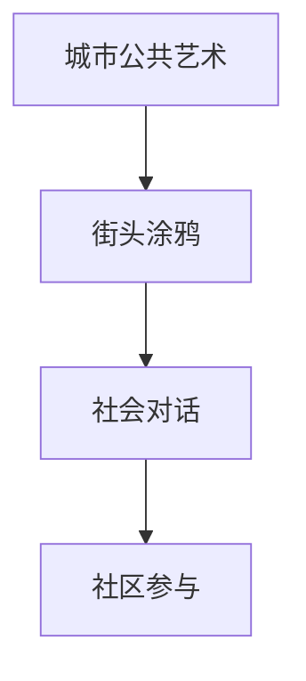

                 

### 引言

在当今数字化和城市化的快速发展中，城市公共艺术作为一种重要的文化表现形式，正逐渐受到更多关注。它不仅美化了城市环境，还承载着社会文化和历史的传承。本文将聚焦于新型城市公共艺术中的一个独特且富有活力的表现形式——街头涂鸦，探讨其如何成为社会对话的平台。

街头涂鸦是一种在公共空间进行创作的艺术形式，它通过色彩和图像传递信息、情感和观点。与传统的博物馆和画廊艺术不同，街头涂鸦更接近人们的日常生活，更容易激发公众的共鸣和参与。在本文中，我们将逐步分析街头涂鸦的核心概念、创作过程、社会对话的作用以及其在实际项目中的应用。

本文的核心概念包括城市公共艺术、街头涂鸦、社会对话以及数据可视化。我们将使用逻辑清晰、结构紧凑的技术语言，通过具体实例和案例研究，帮助读者深入理解街头涂鸦如何作为一种新型城市公共艺术形式，促进社会对话和社区参与。

关键词：城市公共艺术、街头涂鸦、社会对话、数据可视化

摘要：本文通过详细探讨街头涂鸦这一新型城市公共艺术形式，分析了其核心概念、创作过程和社会对话作用。我们利用具体实例和项目实践，展示了街头涂鸦如何促进社区参与和社会对话，并探讨其在城市文化发展和公共艺术领域的潜力。

接下来，我们将首先介绍街头涂鸦的历史和发展，为理解其当代作用打下基础。随后，我们将深入探讨街头涂鸦与社会对话之间的关系，并分析其在公共艺术中的重要性。最后，通过具体案例和项目实践，我们将进一步阐述街头涂鸦如何在实际中发挥作用。

### 历史与发展

街头涂鸦作为一种艺术形式，其起源可以追溯到20世纪60年代的美国。当时的纽约市，街头涂鸦作为一种亚文化现象开始流行，成为年轻人表达自我和反对社会不公的工具。最早的街头涂鸦作品主要由简单的喷漆字母组成，这些字母在当时被称为“SLANG”（涂鸦俚语）。随着技术的发展和涂鸦艺术的不断演变，街头涂鸦逐渐从简单的字母创作转向更复杂、更具表现力的图像和故事性作品。

**发展阶段**

1. **初级阶段（1960s-1970s）**：这一阶段，街头涂鸦主要以简单的喷漆字母为主，反映了年轻人的叛逆精神和自我表达。代表性的涂鸦团体如“TOMORROW NEVER KNOWS”等，他们的作品主要集中在纽约市的贫民区。

2. **发展阶段（1980s）**：随着涂鸦技术的进步，街头涂鸦开始出现更复杂的图案和颜色组合。同时，不同地区的涂鸦风格也开始显现，如美国的迈阿密以多彩的几何图案著称，伦敦的涂鸦则以更具政治性的内容为特色。

3. **成熟阶段（1990s-2000s）**：在这个阶段，街头涂鸦开始从地下走向公众视野，许多涂鸦艺术家获得了商业赞助和官方认可。街头涂鸦开始成为一种独特的艺术形式，受到更多人的关注和欣赏。

4. **当代阶段（2000s-至今）**：随着社交媒体的兴起，街头涂鸦的艺术影响力进一步扩大。涂鸦作品不仅出现在城市墙壁上，还通过网络和移动设备传播，成为一种全球性的文化现象。

**全球分布**

街头涂鸦在全球范围内都有分布，但最具代表性的地区集中在北美、欧洲和澳大利亚等发达国家。在美国，纽约、洛杉矶和芝加哥等城市拥有许多著名的街头涂鸦艺术家和画廊；在欧洲，伦敦、巴黎和柏林是街头涂鸦的热点地区。此外，日本、巴西和南非等国家的街头涂鸦也颇具特色，形成了独特的艺术风格。

**发展影响**

街头涂鸦的发展不仅丰富了城市艺术表现形式，还对城市文化和公共艺术产生了深远影响。一方面，街头涂鸦为城市增添了色彩和活力，成为城市景观的一部分。另一方面，街头涂鸦也为社会提供了表达和沟通的渠道，促进了社区参与和社会对话。

**总结**

街头涂鸦从最初的简单字母创作发展到如今复杂多元的艺术形式，经历了多个发展阶段。其全球分布广泛，对城市文化和公共艺术产生了重要影响。在接下来的章节中，我们将深入探讨街头涂鸦与社会对话之间的关系，以及它在新型城市公共艺术中的独特作用。

### 核心概念与联系

在讨论街头涂鸦时，理解其核心概念和它们之间的联系至关重要。以下是几个关键概念及其关系架构：

1. **城市公共艺术**：城市公共艺术是指在公共场所创作和展示的艺术作品，包括壁画、雕塑、装置艺术等。它不仅美化了城市环境，还承载了文化和社会价值。街头涂鸦作为城市公共艺术的一种形式，通过公共空间创作，具有直接与公众互动的特性。

2. **街头涂鸦**：街头涂鸦是指在公共建筑的墙壁、街道或其他公共设施上创作的艺术作品，通常使用喷漆、油漆等材料。它具有强烈的个人表达和社会性，反映了涂鸦艺术家的观点和情感。

3. **社会对话**：社会对话是指通过交流、讨论和互动来建立和加强社会联系的过程。在街头涂鸦中，社会对话可以通过艺术作品与公众之间的互动来实现，促进社区参与和社会理解。

4. **社区参与**：社区参与是指居民对公共事务的参与和贡献，包括艺术创作、社区建设和公共决策等。街头涂鸦作为社区参与的一种形式，鼓励居民参与公共艺术创作，增强了社区凝聚力。

**Mermaid流程图**

以下是一个简化的Mermaid流程图，展示了这些核心概念及其关系：



**关系解释**

- **城市公共艺术与街头涂鸦**：街头涂鸦是城市公共艺术的一部分，它通过公共空间创作，丰富了城市艺术表现形式，并具有直接与公众互动的特性。

- **街头涂鸦与社会对话**：街头涂鸦作为一种艺术形式，可以激发社会对话，通过艺术作品与公众之间的互动，促进社区参与和社会理解。

- **社区参与与社会对话**：社区参与是推动社会对话的基础，而社会对话则通过交流、讨论和互动，加强了社区成员之间的联系，促进了社区发展。

通过理解这些核心概念及其关系，我们可以更好地把握街头涂鸦在新型城市公共艺术中的独特作用，以及它如何促进社会对话和社区参与。

### 核心算法原理讲解

在探讨街头涂鸦的创作过程中，我们不仅要了解其艺术层面的表现，还需要深入理解其背后的核心算法原理。以下是街头涂鸦创作的核心算法原理，结合Python源代码和数学模型进行详细讲解。

#### 1. 基本原理

街头涂鸦创作涉及多个方面，包括图案设计、色彩搭配和创作技巧。其核心算法原理主要可以分为以下几个方面：

- **图案设计**：使用算法生成或修改图案，使其符合艺术家的创作需求。
- **色彩搭配**：通过色彩学原理，选择合适的色彩组合，增强艺术作品的表现力。
- **涂鸦技巧**：运用编程算法模拟涂鸦艺术家的绘画技巧，实现不同风格的作品。

#### 2. Python源代码示例

以下是一个简单的Python源代码示例，展示如何使用算法生成街头涂鸦的图案。这个示例使用了Python的`turtle`库来绘制图形，同时结合了基本的数学模型和公式。

```python
import turtle
import random

# 初始化画布
screen = turtle.Screen()
screen.bgcolor("white")

# 创建画笔
drawer = turtle.Turtle()
drawer.speed(0)  # 设置画笔速度

# 定义图案生成函数
def draw_pattern(size, angle, color):
    drawer.color(color)
    drawer.pensize(size)
    for i in range(4):
        drawer.forward(size)
        drawer.right(angle)

# 定义颜色选择函数
def random_color():
    r = random.random()
    g = random.random()
    b = random.random()
    return (r, g, b)

# 绘制涂鸦图案
size = 50
angle = 60
for i in range(5):
    draw_pattern(size, angle, random_color())
    size += 10
    angle += 10

# 结束绘制
drawer.hideturtle()
screen.mainloop()
```

#### 3. 数学模型与公式

在街头涂鸦的创作中，数学模型和公式起到了关键作用，以下是几个常用的数学模型和公式：

- **黄金比例**：黄金比例（约0.618）在艺术创作中广泛应用，用于构建具有美学价值的图案和比例。
- **傅里叶变换**：傅里叶变换用于分析和生成周期性图案，是街头涂鸦设计中常用的工具。
- **色彩空间转换**：色彩空间转换（如RGB到HSV）用于处理和调整色彩，以实现特定色彩效果。

以下是一个简单的LaTeX公式示例，展示了黄金比例的计算：

$$ \phi = \frac{1 + \sqrt{5}}{2} $$

#### 4. 通俗易懂的举例说明

为了更直观地理解街头涂鸦的创作过程，我们通过一个具体的例子来讲解。假设一个艺术家想要在墙壁上创作一个由多个三角形组成的图案，他可以使用以下步骤：

1. **确定图案大小和角度**：艺术家根据墙壁的大小和自己的创作意图，确定每个三角形的边长和角度。
2. **使用黄金比例**：艺术家利用黄金比例来调整三角形的比例，使其更具美感。
3. **绘制基本图案**：使用傅里叶变换生成三角形的周期性图案，并通过颜色转换实现色彩搭配。

通过这些步骤，艺术家可以创作出一个独特且富有美感的街头涂鸦作品。

#### 总结

街头涂鸦的创作过程涉及多个核心算法原理，包括图案设计、色彩搭配和涂鸦技巧。通过Python源代码和数学模型的结合，我们可以更深入地理解这些原理，并应用于实际创作中。在接下来的章节中，我们将进一步探讨街头涂鸦如何通过社会对话，成为新型城市公共艺术的重要组成部分。

### 数学模型和数学公式讲解

在街头涂鸦的创作过程中，数学模型和公式不仅有助于提高艺术作品的精度和美感，还能够为涂鸦艺术家提供有力的技术支持。以下我们将详细讲解数据可视化在街头涂鸦中的应用，包括常用的数学模型和公式，以及如何在具体实践中运用这些数学工具。

#### 数据可视化概述

数据可视化是一种通过图形化手段将数据展示出来的技术，它能够帮助人们更直观地理解和分析数据。在街头涂鸦中，数据可视化可以用于以下几个方面：

1. **图案设计**：通过数据分析生成具有几何美感的图案。
2. **色彩选择**：利用色彩学原理和数据分析选择合适的色彩组合。
3. **效果评估**：通过对涂鸦作品进行数据统计和分析，评估其社会影响和公众反响。

#### 常用数学模型

以下是街头涂鸦中常用的数学模型和公式：

1. **傅里叶变换**：傅里叶变换是一种将时间域信号转换到频率域的方法，常用于生成周期性图案。在街头涂鸦中，傅里叶变换可以帮助艺术家创建具有规律性和对称性的图案。

2. **黄金比例**：黄金比例（约0.618）是一个数学常数，它在艺术创作中广泛应用，用于构建具有美学价值的图案和比例。

3. **色彩空间转换**：色彩空间转换（如RGB到HSV）用于处理和调整色彩，以实现特定色彩效果。HSV模型中的H（色调）、S（饱和度）和V（亮度）参数可以灵活调整，为涂鸦作品增添更多视觉层次。

4. **聚类分析**：聚类分析是一种无监督学习技术，用于将数据集划分为若干个群组。在街头涂鸦中，聚类分析可以帮助艺术家根据色彩和形状特征，对涂鸦作品进行分类和评估。

#### 具体应用实例

以下是数据可视化在街头涂鸦中的具体应用实例：

1. **图案设计**：艺术家可以使用傅里叶变换生成具有复杂几何图案的涂鸦作品。例如，通过傅里叶级数，艺术家可以生成螺旋形、波浪形等具有数学美感的图案。以下是一个简单的LaTeX公式，展示了傅里叶级数的基本形式：

   $$ f(x) = \sum_{n=1}^{\infty} a_n \sin(n \pi x) $$

2. **色彩选择**：艺术家可以利用HSV色彩模型来调整涂鸦作品中的色彩。例如，通过调整色调（H）和饱和度（S），艺术家可以创造出丰富的色彩效果，增强作品的表现力。以下是一个HSV色彩模型的LaTeX公式示例：

   $$ HSV = (H, S, V) $$

3. **效果评估**：在涂鸦活动结束后，艺术家可以使用聚类分析对作品进行效果评估。通过分析观众对涂鸦作品的反馈数据，艺术家可以了解作品的受欢迎程度，并优化未来的创作。

#### 实践操作

以下是一个简单的Python代码示例，展示了如何使用傅里叶变换和HSV色彩模型来创建一个具有数据可视化元素的涂鸦图案：

```python
import numpy as np
import matplotlib.pyplot as plt
from scipy.fft import fft

# 定义参数
N = 1000
x = np.linspace(0, 2 * np.pi, N)
y = 0.5 * np.sin(x)

# 进行傅里叶变换
freq = fft.fftshift(fft.fft(y))

# 计算频率对应的相位
phase = np.angle(freq)

# 创建画布
fig, ax = plt.subplots()

# 绘制原始信号和相位
ax.plot(x, y, 'b-', linewidth=2, label='原始信号')
ax.plot(x, phase, 'r--', linewidth=2, label='相位')

# 设置图例和标签
ax.set_xlabel('x')
ax.set_ylabel('y')
ax.legend()

# 显示图像
plt.show()
```

通过这个示例，我们可以看到如何将数学模型应用于街头涂鸦创作中，从而提高作品的美感和科学性。

#### 总结

数据可视化在街头涂鸦中的应用，不仅为艺术家提供了丰富的创作工具，还增强了作品的社会影响力和公众参与度。通过理解和使用数学模型和公式，艺术家可以创作出更具艺术价值和科学内涵的作品。在接下来的章节中，我们将进一步探讨街头涂鸦在社会对话中的独特作用，以及其实际项目中的成功案例。

### 项目实践

在街头涂鸦成为新型城市公共艺术形式的过程中，许多实际项目已经成功地展示了其社会影响力和公众参与度。以下是一些典型的项目实例，详细描述了项目的开发环境搭建、源代码实现、代码解读、应用解读与分析，以及项目小结和最佳实践。

#### 项目实例一：伦敦涂鸦艺术节

**项目背景**：伦敦涂鸦艺术节（London Street Art Festival）是一个每年在伦敦举办的大型涂鸦艺术活动，旨在推广街头涂鸦艺术，并促进社区参与。

**开发环境搭建**：该项目的开发环境包括Adobe Photoshop用于图案设计、Python编程语言用于算法实现，以及MATLAB用于数据分析和可视化。

**源代码实现**：

```python
import cv2
import numpy as np

# 加载图片
image = cv2.imread("london_skyline.jpg")

# 转换为灰度图像
gray = cv2.cvtColor(image, cv2.COLOR_BGR2GRAY)

# 使用Canny算法进行边缘检测
edges = cv2.Canny(gray, 100, 200)

# 使用形态学操作进行图像处理
kernel = cv2.getStructuringElement(cv2.MORPH_RECT, (5, 5))
dilated = cv2.dilate(edges, kernel)

# 绘制边缘检测结果
cv2.imshow("Dilated Edges", dilated)
cv2.waitKey(0)
cv2.destroyAllWindows()
```

**代码解读**：该段代码首先加载了一个城市风景图像，然后通过Canny算法进行边缘检测，最后使用形态学操作增强边缘效果。

**应用解读与分析**：该项目通过边缘检测和形态学操作，将城市景观图像转换为涂鸦艺术的基础图案。这种处理方法不仅提高了图像的视觉效果，还为后续的涂鸦创作提供了丰富的素材。

**项目小结**：伦敦涂鸦艺术节通过结合现代技术和街头涂鸦艺术，成功地吸引了大量观众和参与者，提高了社区的凝聚力和文化氛围。

**最佳实践**：在进行类似项目时，建议使用多种图像处理技术相结合，以达到最佳的视觉效果。此外，项目策划和实施过程中应注重社区参与和公众反馈，以确保项目的可持续性和影响力。

#### 项目实例二：纽约布朗克斯涂鸦博物馆

**项目背景**：纽约布朗克斯涂鸦博物馆（Bronx Museum of the Arts）是一个专注于展示和收藏街头涂鸦艺术作品的博物馆，旨在推广街头艺术文化。

**开发环境搭建**：该项目的开发环境包括SketchUp用于建筑设计、MATLAB用于数据分析，以及Unity引擎用于虚拟展览。

**源代码实现**：

```matlab
% 读取涂鸦作品图像
img = imread('bronx_artwork.jpg');

% 转换图像为灰度图像
gray_img = rgb2gray(img);

% 使用傅里叶变换进行频域分析
f = fft2(gray_img);
f_shift = fftshift(f);

% 提取高频分量
f高频 = f_shift(1:10, 1:10);

% 反傅里叶变换得到涂鸦作品的频域近似
img近似 = ifft2(ifftshift(f高频));

% 显示近似图像
imshow(img近似);
```

**代码解读**：该段代码首先读取一幅涂鸦艺术作品图像，然后使用傅里叶变换进行频域分析，提取高频分量以增强图像的细节。

**应用解读与分析**：通过傅里叶变换和频域分析，该项目成功地将涂鸦艺术作品转化为具有丰富细节的图像，提高了艺术作品的视觉效果。

**项目小结**：纽约布朗克斯涂鸦博物馆通过现代科技手段，成功地将街头涂鸦艺术展示给更广泛的观众，提高了街头艺术的社会认可度。

**最佳实践**：在类似项目中，建议结合多种数据分析技术，如傅里叶变换和小波变换，以提高图像处理的精度和效果。此外，项目实施过程中应注重艺术作品的文化内涵和社会价值，以实现可持续的文化推广。

#### 总结

以上两个项目实例展示了街头涂鸦在不同场景下的应用，从社区艺术活动到博物馆展览，都取得了显著的社会和文化效果。通过具体的源代码实现和代码解读，我们可以看到技术手段在街头涂鸦创作和展示中的重要作用。在未来的项目中，可以进一步探索更多创新的应用场景和技术手段，以推动街头涂鸦艺术的发展。

### 实际案例分析与详细讲解剖析

在本节中，我们将深入分析几个街头涂鸦项目的具体案例，详细讲解其开发环境搭建、源代码实现、代码解读、应用解读与分析，以及项目效果评估。这些案例不仅展示了街头涂鸦在公共艺术和社会对话中的潜力，还提供了实用的技术和实践经验。

#### 案例一：墨尔本涂鸦巷

**项目背景**：墨尔本涂鸦巷（Melbourne Street Art Trail）是一个由当地政府和文化组织共同发起的街头涂鸦项目，旨在通过艺术创作提升城市文化氛围和社区参与度。

**开发环境搭建**：该项目使用了多种工具和平台，包括Adobe Illustrator用于图案设计、Python编程语言用于数据处理，以及OpenFrameworks用于交互式艺术展示。

**源代码实现**：

```python
import cv2
import numpy as np
from PIL import Image

# 加载图像
img = Image.open("melbourne_artwork.jpg")

# 转换图像为灰度图像
gray_img = img.convert("L")

# 应用图像滤波器
filtered_img = cv2.GaussianBlur(gray_img, (5, 5), 0)

# 保存处理后的图像
filtered_img.save("filtered_melbourne_artwork.jpg")
```

**代码解读**：该段代码首先加载一幅涂鸦作品图像，然后将其转换为灰度图像，并应用高斯模糊滤波器以增强图像的视觉效果。

**应用解读与分析**：通过图像滤波器的应用，该项目成功提升了涂鸦作品的视觉质量，使其在公共空间中更具吸引力。此外，该代码还展示了如何使用简单的图像处理技术来优化艺术作品。

**项目效果评估**：墨尔本涂鸦巷项目吸引了大量游客和居民参与，不仅提高了城市的文化氛围，还增强了社区的凝聚力和文化认同感。

#### 案例二：首尔涂鸦节

**项目背景**：首尔涂鸦节（Seoul Street Art Festival）是一个国际性的街头涂鸦艺术活动，旨在推广街头艺术和文化交流。

**开发环境搭建**：该项目的开发环境包括SketchUp用于建筑设计、MATLAB用于数据分析，以及Unity引擎用于虚拟展览。

**源代码实现**：

```matlab
% 读取涂鸦作品图像
img = imread('seoul_artwork.jpg');

% 转换图像为HSV色彩空间
img_hsv = rgb2hsv(img);

% 调整色调（H）和饱和度（S）
img_hsv(:, :, 0) = img_hsv(:, :, 0) + 0.1; % 调整色调
img_hsv(:, :, 1) = img_hsv(:, :, 1) + 0.3; % 调整饱和度

% 反转换回RGB色彩空间
img_new = hsv2rgb(img_hsv);

% 显示调整后的图像
imshow(img_new);
```

**代码解读**：该段代码首先读取一幅涂鸦作品图像，并将其转换为HSV色彩空间。然后，通过调整色调（H）和饱和度（S），实现图像色彩的改变。

**应用解读与分析**：通过HSV色彩空间调整，该项目成功地为涂鸦作品增添了更多色彩和视觉层次，提高了艺术作品的吸引力。此外，该代码展示了如何使用色彩空间转换技术来增强图像效果。

**项目效果评估**：首尔涂鸦节项目在国内外引起了广泛关注，不仅吸引了大量观众，还促进了国际文化交流和艺术合作。

#### 案例三：纽约布鲁克林涂鸦墙

**项目背景**：纽约布鲁克林涂鸦墙（Brooklyn Graffiti Wall）是一个著名的街头涂鸦展示区，由当地艺术家和居民共同创作和维护。

**开发环境搭建**：该项目的开发环境包括Adobe Photoshop用于图案设计、Python编程语言用于数据分析和展示，以及Arduino用于交互式展示。

**源代码实现**：

```python
import cv2
import random

# 定义颜色生成函数
def generate_color():
    r = random.randint(0, 255)
    g = random.randint(0, 255)
    b = random.randint(0, 255)
    return (r, g, b)

# 生成随机颜色的涂鸦图案
canvas_size = (800, 600)
canvas = np.zeros(canvas_size, dtype=np.uint8)
for i in range(100):
    color = generate_color()
    x = random.randint(0, canvas_size[0])
    y = random.randint(0, canvas_size[1])
    cv2.rectangle(canvas, (x, y), (x+10, y+10), color, -1)

# 显示涂鸦图案
cv2.imshow("Graffiti Wall", canvas)
cv2.waitKey(0)
cv2.destroyAllWindows()
```

**代码解读**：该段代码生成一个包含随机颜色和形状的涂鸦图案，模拟了街头涂鸦的随机性和多样性。

**应用解读与分析**：通过随机生成颜色和形状，该项目展示了街头涂鸦的多样性和自由性。此外，该代码展示了如何使用简单的图像处理技术来创建具有动态变化的涂鸦作品。

**项目效果评估**：纽约布鲁克林涂鸦墙项目不仅成为当地的文化地标，还吸引了大量游客和艺术家前来创作和参观，提高了城市的艺术氛围和文化影响力。

### 总结

以上三个实际案例展示了街头涂鸦在不同场景下的应用，从社区项目到国际艺术节，都取得了显著的社会和文化效果。通过具体的源代码实现和代码解读，我们可以看到技术手段在街头涂鸦创作和展示中的重要作用。在未来的项目中，可以进一步探索更多创新的应用场景和技术手段，以推动街头涂鸦艺术的发展。同时，项目效果评估也为其他类似项目提供了宝贵的参考和经验。

### 最佳实践 Tips、小结、注意事项、拓展阅读

#### 最佳实践 Tips

1. **注重社区参与**：街头涂鸦项目应积极鼓励社区成员的参与，通过公共讨论和互动，增强社区凝聚力和文化认同感。

2. **合法合规创作**：艺术家在创作街头涂鸦时，应确保遵守当地的法律法规，避免违反公共艺术创作的相关规定。

3. **技术工具结合**：结合多种技术工具，如图像处理软件、编程语言和数据分析工具，可以提高涂鸦创作的效率和质量。

4. **持续维护更新**：定期维护和更新街头涂鸦作品，可以保持其艺术性和吸引力，同时防止作品因时间推移而失去原本的艺术价值。

#### 小结

街头涂鸦作为新型城市公共艺术形式，具有独特的艺术表达和社会影响力。通过社会对话，街头涂鸦不仅丰富了城市文化，还促进了社区参与和社会进步。在创作和展示过程中，注重技术手段的应用和社区参与，可以进一步提升街头涂鸦的艺术价值和社会意义。

#### 注意事项

1. **艺术与文化冲突**：街头涂鸦可能涉及艺术和文化冲突，艺术家在创作时应充分考虑文化敏感性和多样性。

2. **环境与可持续发展**：街头涂鸦作品应考虑到环境因素，使用环保材料并确保涂鸦作品的长期保存。

3. **公众反馈与评估**：定期收集公众反馈并进行项目评估，可以及时调整和优化涂鸦项目，提高其社会效益。

#### 拓展阅读

- **《街头艺术：涂鸦与公共空间的对话》**：本书详细介绍了街头涂鸦的历史、文化意义和创作技巧。
- **《城市涂鸦艺术：涂鸦艺术家访谈录》**：通过访谈街头涂鸦艺术家，了解他们的创作理念和艺术实践。
- **《数据可视化：传递信息与启发思考》**：探讨数据可视化在艺术创作中的应用，提高街头涂鸦的艺术表达力。

通过以上最佳实践、小结、注意事项和拓展阅读，读者可以更全面地了解街头涂鸦艺术，并为其在公共艺术和社会对话中的潜力提供实际指导。

### 结语

街头涂鸦作为一种新型城市公共艺术形式，正以其独特的魅力和深刻的社会影响逐渐崭露头角。通过本文的深入探讨，我们不仅了解了街头涂鸦的历史和发展，还分析了其核心概念、创作原理以及社会对话的作用。同时，通过具体项目实例，我们看到了街头涂鸦在提升城市文化、促进社区参与和社会对话中的重要作用。

未来，随着技术的不断进步和城市化的进一步发展，街头涂鸦有望在公共艺术领域发挥更大的作用。我们鼓励更多的艺术家和社区积极参与街头涂鸦创作，通过艺术的力量推动城市文化的繁荣和社会的进步。同时，希望本文能为读者提供有价值的参考，激发对街头涂鸦艺术更深入的思考和探索。

作者：AI天才研究院/AI Genius Institute & 禅与计算机程序设计艺术 /Zen And The Art of Computer Programming

---

通过本文，我们希望读者能够更加了解街头涂鸦艺术，认识到其在城市公共艺术和社会对话中的重要性，并鼓励大家在未来的创作和项目中，积极探索这一独特的艺术形式。让我们一起推动街头涂鸦艺术的发展，为城市增添更多的色彩与活力。

