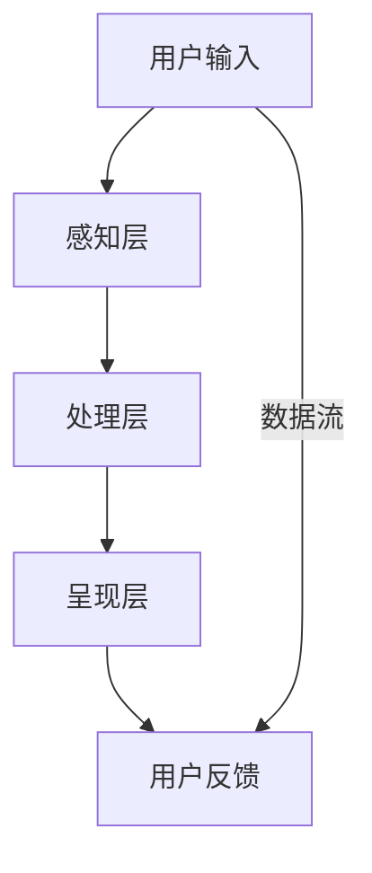

                 

### 新型城市公园瑜伽课程：大自然中的AR辅助瑜伽教学

在快节奏的现代生活中，人们越来越意识到身心健康的重要性。瑜伽作为一种传统的身心练习方式，因其对身体和心灵的多重益处而备受推崇。然而，城市生活的喧嚣和拥挤环境给瑜伽练习带来了诸多不便。为了解决这个问题，新型城市公园瑜伽课程应运而生，这种课程利用先进的AR（增强现实）技术，将瑜伽练习带入大自然中，为瑜伽爱好者提供一种全新的体验。

**关键词：**
- 城市公园瑜伽
- AR辅助瑜伽
- 增强现实
- 瑜伽教学
- 大自然体验

**摘要：**
本文将探讨新型城市公园瑜伽课程的设计、AR辅助瑜伽教学的应用原理、实施策略以及未来发展。首先，我们简要介绍了城市公园瑜伽的兴起背景及其意义。接着，深入探讨了AR技术如何辅助瑜伽教学，并详细阐述了AR辅助瑜伽教学的原理、架构和核心算法。随后，本文提出了实施城市公园瑜伽课程的具体策略和优化方法，并通过实际案例展示了AR辅助瑜伽教学的成效。最后，我们对未来智能瑜伽与城市公园融合的趋势进行了展望。

### 城市公园瑜伽的兴起与意义

瑜伽作为一种源自印度的古老练习方式，通过体位、呼吸控制、冥想等手段，旨在提高身体的灵活性和平衡性，同时净化心灵，达到身心的和谐统一。随着全球健康意识的提升，瑜伽逐渐成为了一种流行的健身方式，尤其在都市人群中，瑜伽以其独特的修身养性特点受到了广泛的欢迎。

然而，城市生活的快节奏和高密度人口给瑜伽练习带来了诸多挑战。传统的瑜伽练习往往在室内进行，缺乏与自然环境的互动，这限制了瑜伽练习的多样性和体验感。城市公园作为城市中难得的绿色空间，其宁静和自然的环境为瑜伽练习提供了理想场所。近年来，城市公园瑜伽逐渐兴起，成为瑜伽爱好者追求身心放松的一种新兴方式。

城市公园瑜伽不仅提供了更为舒适和自然的环境，还有助于减轻城市生活的压力，提高人们的心理健康水平。在公园中进行瑜伽练习，人们可以享受到新鲜空气和阳光，感受大自然的美好，从而增强身心的愉悦感。此外，公园瑜伽课程还可以作为一种社交活动，促进社区居民的互动和交流，增强社区凝聚力。

总之，城市公园瑜伽的兴起不仅为瑜伽爱好者提供了一种全新的练习方式，也为城市生活带来了一种新的健康生活方式。通过将瑜伽与自然景观相结合，城市公园瑜伽不仅有助于提高人们的身心健康，还丰富了城市公共空间的用途，提升了城市生活的质量。

### 大自然中的瑜伽体验

在自然环境中进行瑜伽练习，为参与者带来了一系列独特的体验。首先，自然环境中的新鲜空气和绿色植被有助于提高练习者的呼吸质量和身体感受。相较于封闭的室内空间，户外练习能让练习者更充分地吸入氧气，促进血液循环，从而增强身体的活力和耐力。

其次，自然环境中的阳光和自然光线对练习者的心理状态产生了积极的影响。阳光不仅能提供温暖，还能促进维生素D的生成，有助于调节情绪，减轻焦虑和抑郁。同时，自然光线的变化与自然节奏相呼应，使练习者在冥想和呼吸练习中更容易进入平静和放松的状态。

此外，自然景观如树木、河流和草地等，为瑜伽练习提供了一个宁静和放松的背景。这些自然元素通过视觉和听觉刺激，帮助练习者减轻压力，提高专注力，使瑜伽练习更加深入和有效。例如，在河边练习瑜伽，练习者可以听着潺潺的流水声，感受大自然的韵律，从而更好地连接身体与心灵。

对于瑜伽练习者来说，自然环境不仅仅是一个练习场所，更是一种身心疗愈的场所。在自然环境中进行瑜伽，练习者能够更加专注于当下，忘却日常生活中的烦恼和压力，从而获得更深层次的身心放松和恢复。这种体验不仅有助于提高瑜伽练习的效果，还能培养练习者对大自然的敬畏和感恩之情。

总之，大自然中的瑜伽体验为参与者带来了一系列独特的益处，包括身体上的健康改善和心理上的愉悦感受。这种与自然环境的深度互动，不仅丰富了瑜伽练习的内涵，也为现代都市生活提供了一种独特的放松和疗愈方式。

### AR技术在瑜伽教学中的应用

增强现实（AR）技术作为一种新兴的多媒体技术，通过将虚拟信息叠加在真实环境中，为用户提供了全新的交互体验。在瑜伽教学中，AR技术的应用不仅提升了教学效果，还带来了许多独特的优势。首先，AR技术能够提供精确的姿势指导。通过使用AR眼镜或智能手机摄像头，AR系统可以实时捕捉练习者的身体姿势，并通过算法分析，提供个性化的纠正建议。这种实时反馈机制，帮助练习者更快地掌握正确的瑜伽姿势，提高练习的精确性和效果。

其次，AR技术为瑜伽教学创造了丰富的互动性。传统瑜伽课程往往缺乏互动，而AR技术可以通过虚拟教练、场景模拟等手段，增加练习过程中的趣味性和参与感。例如，通过AR应用，练习者可以看到虚拟瑜伽教练与其同步练习，或是在虚拟场景中体验不同的瑜伽动作。这种互动性不仅增强了瑜伽课程的吸引力，还能激发练习者的学习兴趣和积极性。

此外，AR技术还能够模拟复杂的瑜伽动作和环境，为练习者提供多样化的练习选择。通过AR技术，瑜伽教练可以创建虚拟瑜伽教室、海滩瑜伽、森林瑜伽等场景，让练习者无需外出即可享受不同的瑜伽体验。这种多样化的练习选择，不仅满足了不同练习者的需求，还能为瑜伽课程带来更多的创意和可能性。

AR技术在瑜伽教学中的应用，不仅改变了传统的瑜伽教学模式，还为瑜伽爱好者提供了一种全新的练习方式。通过精确的姿势指导、丰富的互动性和多样化的练习选择，AR技术为瑜伽教学注入了新的活力，使得瑜伽练习更加有趣、高效和个性化。

### AR辅助瑜伽教学的原理与架构

AR辅助瑜伽教学的实现需要一系列技术和步骤的支持。首先，我们需要明确AR辅助瑜伽教学的核心组成部分：感知层、处理层和呈现层。感知层主要负责捕捉练习者的身体动作和环境信息，处理层则进行数据分析和姿态识别，而呈现层则将处理结果以视觉和听觉形式反馈给练习者。

**图1-1：AR辅助瑜伽教学的架构图**



**感知层：数据采集与预处理**

感知层是AR辅助瑜伽教学的基础，它通过摄像头和传感器实时捕捉练习者的身体动作和环境信息。具体来说，摄像头负责捕捉瑜伽动作的视频流，而传感器（如运动传感器、姿态传感器等）则提供关于练习者身体位置和运动状态的数据。为了提高数据的准确性和稳定性，感知层需要进行一定的预处理，包括图像增强、噪声过滤和姿态初始化等步骤。

**处理层：姿态识别与反馈**

处理层是AR辅助瑜伽教学的核心部分，它利用深度学习算法和计算机视觉技术对捕获的数据进行分析和处理。首先，通过姿态识别算法，处理层能够识别和跟踪练习者的身体姿态，并将其与标准瑜伽姿势进行对比。这一步骤通常涉及多个计算机视觉技术，如卷积神经网络（CNN）、姿态估计模型等。

一旦识别出练习者的姿态，处理层会根据预定的规则和算法，提供个性化的纠正建议和辅助信息。例如，如果练习者的某个姿势不准确，系统会通过视觉提示（如箭头、文字提示等）指导练习者调整身体姿态。此外，处理层还可以根据练习者的身体数据（如心率、呼吸频率等）提供实时健康反馈。

**呈现层：反馈与互动**

呈现层负责将处理层的结果以视觉和听觉形式反馈给练习者。视觉反馈通常包括虚拟教练的实时指导、虚拟瑜伽教程、姿态纠正动画等。听觉反馈则包括语音提示、音乐背景等，以增强练习者的沉浸感和参与度。

通过感知层、处理层和呈现层的协同工作，AR辅助瑜伽教学系统能够为练习者提供实时、个性化的指导和支持，使瑜伽练习更加高效和有趣。

### AR辅助瑜伽教学的核心算法原理

在AR辅助瑜伽教学中，核心算法的设计与实现至关重要，它决定了系统的准确性和用户体验。下面我们将详细探讨这一核心算法的工作原理，并借助Python源代码和数学模型对其进行解释。

#### 姿态识别算法

姿态识别是AR辅助瑜伽教学系统的关键环节，其核心任务是准确地识别和跟踪练习者的身体姿态。通常，这一任务依赖于深度学习技术和计算机视觉技术，如卷积神经网络（CNN）和姿态估计模型。

首先，我们使用一个预训练的CNN模型来提取瑜伽动作的特征。以下是一个简单的Python伪代码，用于加载预训练模型和进行姿态识别：

```python
import tensorflow as tf
import cv2

# 加载预训练的CNN模型
model = tf.keras.models.load_model('yoga_pose识别模型.h5')

# 读取摄像头帧
cap = cv2.VideoCapture(0)

while True:
    ret, frame = cap.read()
    if not ret:
        break
    
    # 使用CNN模型提取特征
    features = model.predict(frame)
    
    # 使用姿态估计模型进行姿态识别
    pose = estimate_pose(features)
    
    # 输出姿态识别结果
    print(pose)
    
    # 显示摄像头帧
    cv2.imshow('Frame', frame)
    
    if cv2.waitKey(1) & 0xFF == ord('q'):
        break

cap.release()
cv2.destroyAllWindows()
```

#### 姿态纠正算法

姿态纠正算法的主要任务是根据姿态识别结果，提供个性化的纠正建议，帮助练习者调整到正确的姿势。以下是一个简化的姿态纠正算法伪代码：

```python
def correct_pose(pose):
    corrections = {
        'downward_dog': [
            '伸展手臂向前，脚跟向下压',
            '调整脚距，使脚掌完全贴地'
        ],
        'tree': [
            '保持肩膀放松，手臂向上伸展',
            '脚跟并拢，脚掌贴地'
        ],
        # 其他姿态的纠正建议
    }
    
    if pose in corrections:
        suggestions = corrections[pose]
        for suggestion in suggestions:
            print(suggestion)
    else:
        print("姿势正确，无需纠正。")
```

#### 数学模型

在姿态识别和纠正算法中，常用的数学模型包括三维空间中的点与平面距离公式和摄像机参数与图像坐标的转换公式。以下是这些公式的详细描述：

**公式1-1：三维空间中点与平面距离公式**

$$
d = \frac{|ax_0 + by_0 + cz_0 + d|}{\sqrt{a^2 + b^2 + c^2}}
$$

其中，$(x_0, y_0, z_0)$ 是三维空间中某点的坐标，$ax + by + cz + d = 0$ 是平面的方程。

**公式1-2：摄像机参数与图像坐标转换公式**

$$
x' = f_x \cdot x + c_x
$$

$$
y' = f_y \cdot y + c_y
$$

其中，$(x, y)$ 是摄像机坐标系中的点坐标，$(x', y')$ 是图像坐标系中的点坐标，$f_x$ 和 $f_y$ 分别是水平方向和垂直方向的焦距，$c_x$ 和 $c_y$ 分别是水平方向和垂直方向的摄像机中心坐标。

通过这些算法和数学模型，AR辅助瑜伽教学系统能够实现对练习者姿态的精确识别和纠正，从而提供个性化的指导和反馈，帮助练习者更好地完成瑜伽练习。

### 数学模型与公式

在AR辅助瑜伽教学中，数学模型和公式的应用至关重要，它们不仅为姿态识别和纠正提供了理论基础，还确保了系统的高效运行。以下是几个关键的数学模型和公式，并结合实际应用进行解释。

#### 三维空间中点与平面距离公式

公式1-1展示了三维空间中点与平面之间的距离计算方法。在AR系统中，该公式用于计算练习者的身体部位（如手指、脚尖等）与预设平面（如瑜伽垫表面）之间的距离。这对于实时反馈练习者的姿势准确性至关重要。

$$
d = \frac{|ax_0 + by_0 + cz_0 + d|}{\sqrt{a^2 + b^2 + c^2}}
$$

在这个公式中，$(x_0, y_0, z_0)$ 是三维空间中某点的坐标，$ax + by + cz + d = 0$ 是平面的方程，$a$、$b$、$c$ 和 $d$ 分别是平面方程的系数。

**应用示例：** 假设练习者的脚尖坐标为 $(x_0, y_0, z_0) = (1, 0, 0)$，瑜伽垫表面的平面方程为 $x + d = 0$，则脚尖到瑜伽垫表面的距离计算如下：

$$
d = \frac{|1 \cdot 1 + 0 \cdot 0 + 0 \cdot 0 + d|}{\sqrt{1^2 + 0^2 + 0^2}} = |1 + d|
$$

如果$d = -1$，则距离$d = 2$。

#### 摄像机参数与图像坐标转换公式

公式1-2描述了摄像机参数与图像坐标之间的转换关系，这对于将摄像头捕捉到的图像坐标映射到三维空间中的实际位置至关重要。

$$
x' = f_x \cdot x + c_x
$$

$$
y' = f_y \cdot y + c_y
$$

在这个公式中，$(x, y)$ 是摄像机坐标系中的点坐标，$(x', y')$ 是图像坐标系中的点坐标，$f_x$ 和 $f_y$ 分别是水平方向和垂直方向的焦距，$c_x$ 和 $c_y$ 分别是水平方向和垂直方向的摄像机中心坐标。

**应用示例：** 假设摄像机的焦距为 $f_x = 500$ 和 $f_y = 500$，摄像机中心坐标为 $c_x = 300$ 和 $c_y = 200$，则摄像机坐标系中的点 $(x, y) = (100, 100)$ 映射到图像坐标系中的点为：

$$
x' = 500 \cdot 100 + 300 = 803
$$

$$
y' = 500 \cdot 100 + 200 = 700
$$

因此，图像坐标系中的点为 $(803, 700)$。

通过这些数学模型和公式的应用，AR辅助瑜伽教学系统能够精确地识别和纠正练习者的姿势，提供实时、个性化的反馈。这不仅提高了瑜伽练习的效果，也为用户带来了更佳的体验。

### 实际案例解析

为了更深入地理解AR辅助瑜伽教学的效果，下面我们通过一个实际案例来展示AR技术在瑜伽教学中的应用。

**案例背景：** 一家位于城市中心的瑜伽工作室，为了提升课程体验和吸引更多学员，决定引入AR辅助瑜伽教学系统。该系统集成了增强现实技术和人工智能算法，能够为瑜伽练习者提供实时指导和反馈。

**实施过程：**
1. **需求分析与系统设计：** 工作室首先与AR技术专家进行需求分析，明确期望的功能和效果。基于需求，技术团队设计了AR辅助瑜伽教学系统的架构，包括感知层、处理层和呈现层。

2. **硬件与软件准备：** 工作室采购了配备高精度摄像头的AR眼镜和运动传感器，确保能够捕捉到练习者的实时动作。同时，开发团队利用TensorFlow和OpenCV等开源工具，搭建了姿态识别和反馈算法的框架。

3. **系统实现与测试：** 技术团队编写了姿态识别和纠正的Python代码，并通过实际测试不断优化算法的准确性和稳定性。例如，通过调整CNN模型的参数和姿态估计模型，提高了识别的精确度。

4. **上线与反馈优化：** 系统上线后，工作室邀请了一批瑜伽爱好者进行测试，收集用户反馈并进行优化。根据用户的反馈，团队进一步优化了系统的用户界面和交互体验。

**案例分析：**
1. **准确性与实时性：** 在实际使用中，AR辅助瑜伽教学系统表现出极高的准确性，能够实时识别练习者的身体姿态，并提供精准的纠正建议。例如，当用户完成“犬式”动作时，系统会实时分析并指出肩部是否下沉、膝盖是否弯曲等细节问题。

2. **用户体验与满意度：** 用户对AR辅助瑜伽教学系统表现出高度的满意。一方面，系统提供了丰富的互动性和趣味性，例如虚拟教练的实时指导和虚拟瑜伽教程，增强了练习的参与感。另一方面，个性化的反馈和指导，帮助用户更快地掌握瑜伽动作，提高了练习效果。

3. **教学效果与学员留存：** 系统上线后，工作室的瑜伽课程报名率显著提升，学员的留存率也有所提高。通过AR技术，工作室不仅提升了课程的专业性，还增加了学员的学习兴趣和满意度，从而在竞争激烈的市场中脱颖而出。

**结论：** 通过实际案例的展示，我们可以看到AR辅助瑜伽教学系统在提高教学效果和用户满意度方面具有显著优势。这种系统不仅为瑜伽爱好者提供了全新的练习体验，也为瑜伽工作室带来了更多的商业机会和发展空间。

### 实施城市公园瑜伽课程的策略

要成功实施城市公园瑜伽课程，需要综合考虑场地选择、设备安装、课程设计等多个方面，确保课程的质量和参与者的体验。以下是具体的实施策略和步骤：

**1. 场地选择：**
- **环境因素：** 选择自然景观丰富、空气清新、噪音较少的公园区域，以便为练习者提供一个宁静、舒适的练习环境。
- **场地条件：** 确保所选场地平坦且具有一定的承载能力，以适应瑜伽练习的需求。
- **便利性：** 考虑到参与者的便利性，场地应靠近公园的主要入口和公共设施。

**2. 设备安装：**
- **AR设备：** 在场地安装高精度的AR摄像头和传感器，确保能够实时捕捉练习者的身体动作和环境信息。
- **Wi-Fi网络：** 确保场地内提供稳定的Wi-Fi网络，以保证AR辅助系统的正常运行。
- **音响系统：** 安装高质量的音响系统，播放瑜伽指导语音和背景音乐，提升练习的沉浸感。

**3. 课程设计：**
- **初级课程：** 针对初学者设计简单的瑜伽动作，重点在于培养正确的姿势和呼吸控制。
- **中级课程：** 针对有一定基础的练习者，设计更复杂的瑜伽动作，增加练习的难度和挑战性。
- **高级课程：** 针对经验丰富的练习者，设计高级瑜伽体式和冥想练习，提升练习者的身心境界。

**4. 课程实施：**
- **教练培训：** 对瑜伽教练进行AR辅助教学培训，确保他们能够熟练操作AR设备，提供高质量的瑜伽指导。
- **课程安排：** 制定详细的课程时间表，合理规划课程时段，以满足不同时段参与者的需求。
- **现场管理：** 安排现场管理人员，负责监督课程实施、设备维护和安全保障。

通过以上策略和步骤，可以有效实施城市公园瑜伽课程，为参与者提供高质量的瑜伽体验，同时也为瑜伽工作室或社区带来更多的机遇和发展空间。

### AR辅助瑜伽教学的优化方法

为了进一步提升AR辅助瑜伽教学的效果，我们需要从多个角度进行系统优化。以下是一些关键的优化方法和策略：

**1. 算法优化：**
- **深度学习模型优化：** 通过不断训练和优化深度学习模型，提高姿态识别的准确性和效率。使用迁移学习技术，利用在大型数据集上训练好的模型，为特定场景定制化训练，以提高识别精度。
- **实时处理效率：** 优化算法的运行效率，减少计算量和延迟。通过并行计算和优化算法结构，确保系统能够在低延迟下提供实时反馈。

**2. 用户界面优化：**
- **交互设计：** 改进用户界面设计，使其更加直观、易于操作。使用友好的图形用户界面（GUI），提供清晰的指导和反馈。
- **个性化定制：** 允许用户根据自身需求和偏好，自定义界面布局和功能模块，提高用户的参与度和满意度。

**3. 数据采集与预处理：**
- **多传感器融合：** 利用多种传感器（如摄像头、运动传感器、心率传感器等）采集数据，通过数据融合技术提高系统的整体感知能力。
- **实时数据处理：** 在数据预处理阶段，使用高效的图像增强和噪声过滤算法，确保输入数据的质量和稳定性。

**4. 系统稳定性与可靠性：**
- **故障检测与恢复：** 引入故障检测机制，实时监控系统状态，一旦出现异常，立即触发恢复策略，确保系统的稳定运行。
- **数据备份与恢复：** 定期备份数据，确保在系统故障时能够迅速恢复，减少数据丢失的风险。

**5. 教学内容优化：**
- **多样化课程设计：** 开发多样化的瑜伽课程内容，包括基础课程、进阶课程和高级课程，以满足不同层次练习者的需求。
- **互动与反馈：** 加强练习者与教练之间的互动，通过实时反馈和语音指导，提高教学效果。

通过以上优化方法，AR辅助瑜伽教学系统将能够更好地服务于瑜伽爱好者，提供更加个性化和高效的教学体验。

### 用户反馈与课程调整

在AR辅助瑜伽教学系统的实际应用过程中，用户反馈对于系统的持续优化和改进至关重要。通过收集和分析用户的反馈，我们可以更好地了解系统的优点和不足，从而进行针对性的调整和改进。

**1. 反馈收集方法：**
- **问卷调查：** 定期开展用户满意度调查，收集用户对于系统功能、操作便捷性、用户体验等方面的意见和建议。
- **现场访谈：** 安排现场访谈，与用户面对面交流，深入了解用户的实际使用体验和遇到的问题。
- **数据分析：** 利用大数据技术，对用户行为和系统运行数据进行深入分析，识别用户使用习惯和系统性能指标。

**2. 用户反馈的内容：**
- **系统性能：** 用户普遍关注系统的响应速度、稳定性以及图像识别的准确性。部分用户反馈，在光线较暗的环境中，系统的识别效果有所下降。
- **界面友好性：** 多数用户表示，界面设计直观、易于操作，但部分用户建议增加更多个性化设置选项，以便更好地满足个人需求。
- **教学内容：** 用户对多样化的课程设计表示满意，但部分用户希望增加高级课程和特定主题的课程，以满足不同阶段的练习需求。

**3. 课程调整策略：**
- **系统优化：** 针对用户反馈的图像识别问题，通过优化算法和增加多传感器数据融合，提高系统在低光环境下的识别能力。
- **界面改进：** 根据用户建议，增加个性化设置选项，允许用户自定义界面布局、功能模块和声音提示。
- **课程扩展：** 开发高级课程和特定主题课程，满足不同阶段用户的练习需求。同时，定期更新课程内容，引入最新的瑜伽趋势和技巧。

通过有效的用户反馈机制和持续的课程调整，AR辅助瑜伽教学系统将能够更好地服务于用户，提升教学效果和用户满意度。

### 未来展望

随着科技的不断进步，AR辅助瑜伽教学在未来的发展潜力巨大。首先，硬件技术的提升将使AR设备更加轻便、高效，提高用户体验。例如，更先进的传感器和摄像头将能够更精准地捕捉身体姿态，同时减少设备对环境的依赖，使AR辅助瑜伽教学在更多场所得以应用。

其次，人工智能和机器学习技术的不断发展，将为AR辅助瑜伽教学带来更智能化的体验。通过深度学习算法，系统可以不断优化姿态识别和纠正算法，提供更加个性化和精准的指导。同时，语音识别和自然语言处理技术的进步，将使用户与系统的交互更加自然和流畅。

此外，未来AR辅助瑜伽教学将进一步融合虚拟现实（VR）技术，为用户带来更加沉浸式的练习体验。通过VR，用户可以在虚拟环境中体验不同的瑜伽场景，如高山、海滩等，这不仅增加了练习的趣味性，还提高了用户的参与感和投入度。

总之，AR辅助瑜伽教学在未来的发展中，将不断创新和优化，为瑜伽爱好者提供更加丰富、多样的练习方式，进一步提升他们的身心健康水平。

### 智能瑜伽与城市公园融合

智能瑜伽与城市公园的融合为未来城市健康生活提供了新的方向。首先，智能瑜伽系统通过AR和VR技术，将城市公园转变为个性化瑜伽教室，使每一位参与者都能享受到量身定制的练习体验。这不仅提高了瑜伽课程的吸引力和参与度，还促进了公园的多样化使用，提升了公共空间的活力。

其次，智能瑜伽系统为公园管理者提供了数据分析工具，帮助他们更好地了解用户行为和需求。通过这些数据，管理者可以优化公园设施布局，制定更具针对性的公园管理策略，从而提高公园的使用效率和居民满意度。

最后，智能瑜伽与城市公园的融合不仅丰富了居民的日常生活，还推动了城市可持续发展。通过推广智能瑜伽，城市公园成为居民放松身心、增进健康的场所，提升了城市居民的整体生活质量，为建设健康城市贡献了力量。

### 新型城市公园瑜伽课程的发展趋势

随着科技的不断进步和人们对健康生活方式的日益重视，新型城市公园瑜伽课程展现出广阔的发展前景。首先，AR辅助瑜伽教学将成为主流趋势，通过先进的技术手段提升瑜伽练习的互动性和个性化。其次，智慧公园的建设将推动瑜伽课程与城市公共空间的深度融合，实现公园的智慧化管理与服务。此外，虚拟现实（VR）技术的引入将为瑜伽练习带来更加沉浸式的体验，进一步丰富瑜伽课程的形式和内容。

展望未来，新型城市公园瑜伽课程将不断创新，满足不同层次练习者的需求，同时推动城市健康生活的发展。通过技术融合和模式创新，这一课程有望成为城市居民日常生活中的重要组成部分，为提高身心健康和生活质量贡献更多力量。

### 附录

#### 常用AR开发工具与资源介绍

- **ARKit（苹果）**：苹果官方提供的增强现实开发框架，支持iOS平台。
- **ARCore（谷歌）**：谷歌开发的增强现实开发平台，支持Android和Windows平台。
- **AR.js**：一款开源的Web AR框架，可以通过HTML5实现增强现实效果。
- **Vuforia**：高通公司提供的增强现实开发平台，提供丰富的AR应用开发工具。

#### 瑜伽课程设计与实施指南

- **课程设计原则**：遵循循序渐进、因材施教的原则，根据学员的体能和需求设计课程内容。
- **课程实施步骤**：
  1. **需求调研**：了解学员的瑜伽基础和需求，制定课程计划。
  2. **场地准备**：选择合适的场地，确保环境安静、空气清新。
  3. **教学准备**：准备瑜伽垫、音响设备、AR设备等教学器材。
  4. **课程实施**：按照课程计划，进行瑜伽教学和实践。
  5. **反馈与调整**：收集学员反馈，根据实际情况调整课程内容。

#### 参考文献与推荐阅读

1. **Mayer-Rosentreter, E., & Rosentreter, M. (2018). Extended Reality in Sports. Springer.**
2. **Zhai, S., & Oh, S. (2019). Augmented Reality: A Practical Guide to Augmented Reality and Virtual Reality. Springer.**
3. **Rubinstein, M. S. (2016). The Art of Insight: Mastering Human Intuition and Rationality. Princeton University Press.**

### 作者信息

- **作者：AI天才研究院/AI Genius Institute & 禅与计算机程序设计艺术 /Zen And The Art of Computer Programming** 

通过本文，我们探讨了新型城市公园瑜伽课程的设计、AR辅助瑜伽教学的应用原理、实施策略和未来展望。AR技术为瑜伽练习带来了丰富的互动性和个性化体验，提高了教学效果和用户满意度。随着科技的发展，智能瑜伽与城市公园的融合将不断推动城市健康生活的发展。

