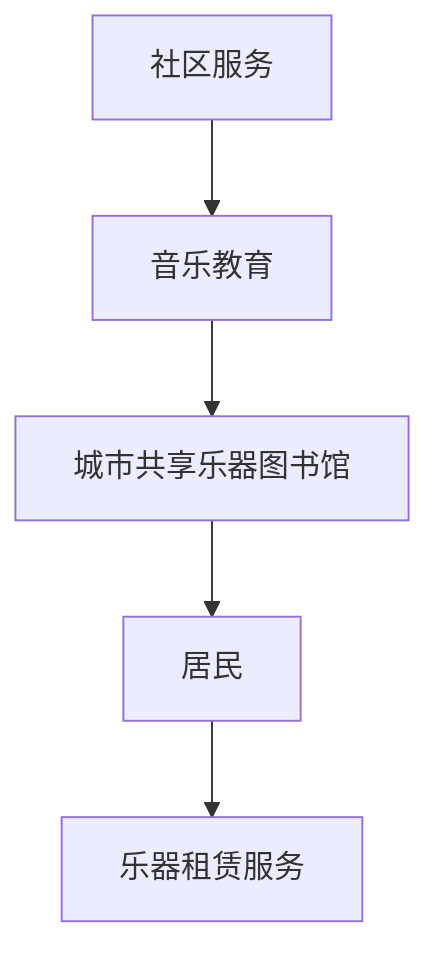

                 

### 《新型城市共享乐器图书馆：推广音乐教育的社区服务》正文

---

# 新型城市共享乐器图书馆：推广音乐教育的社区服务

关键词：城市共享乐器图书馆，音乐教育，社区服务，人工智能，数据分析

摘要：随着音乐教育的普及和社区服务的需求增加，新型城市共享乐器图书馆作为推广音乐教育的重要途径，正逐渐受到关注。本文从背景介绍、核心概念与联系、核心算法原理讲解、数学模型和公式详细讲解、项目实战等方面，深入探讨城市共享乐器图书馆的建立与推广策略。

---

## 引言

随着现代城市化的快速发展，社区服务成为城市治理的重要一环。音乐教育作为一种重要的文化教育形式，不仅能够丰富居民的精神生活，还能提高社区的文化素质。新型城市共享乐器图书馆作为一种创新的社区服务模式，正逐渐成为推广音乐教育的重要平台。本文旨在探讨城市共享乐器图书馆的背景、核心概念、算法原理、数学模型以及实际应用，为社区服务的推广提供理论支持和实践指导。

## 背景介绍

### 城市化进程中的社区服务需求

城市化进程带来了人口密度增加、生活节奏加快等变化，居民的业余生活需求日益多样。社区服务作为城市治理的重要组成部分，不仅要满足居民的基本生活需求，还要提供多样化的文化娱乐活动，提升居民的生活质量。音乐教育作为文化娱乐的重要组成部分，逐渐成为社区服务的重点。

### 音乐教育的重要性

音乐教育不仅可以培养人的审美能力和创造力，还能对个人的情感发展、智力开发和社会交往能力产生积极影响。特别是在青少年阶段，音乐教育对于培养其综合素质具有重要意义。因此，推广音乐教育成为社区服务的一项重要任务。

### 城市共享乐器图书馆的兴起

城市共享乐器图书馆是近年来兴起的一种新型社区服务模式。它通过提供免费或低成本的乐器租赁服务，让更多的居民有机会接触和学习音乐。这种模式不仅能够满足居民对音乐教育的需求，还能促进社区的文化氛围建设。

## 核心概念与联系

### 城市共享乐器图书馆的概念

城市共享乐器图书馆是指在城市社区内设立的，以共享乐器为主要服务内容的公共文化设施。它为居民提供免费或低成本的乐器租赁服务，以及相关的音乐教育和培训活动。

### 核心概念实体之间的关系

为了更好地理解城市共享乐器图书馆，我们可以用 Mermaid 图描述其核心概念实体之间的关系：



在这个图中，社区服务是城市共享乐器图书馆的基础，音乐教育是其核心内容，而居民则是直接受益者。乐器租赁服务是连接城市共享乐器图书馆和居民的重要纽带。

## 核心算法原理讲解

### 乐器选择算法

在城市共享乐器图书馆中，如何合理选择和配置乐器是一个关键问题。这里我们介绍一种基于用户兴趣和需求分析的乐器选择算法。

```python
# 基于用户兴趣的乐器推荐算法示例

# 用户兴趣模型
user_interest = {
    'age': 30,
    'gender': 'male',
    'history': ['guitar', 'piano', 'drums'],
    'preferences': ['jazz', 'classical', 'rock']
}

# 乐器数据库
instruments_db = {
    'guitar': {'style': ['jazz', 'rock'], 'difficulty': 'medium'},
    'piano': {'style': ['classical', 'jazz'], 'difficulty': 'high'},
    'drums': {'style': ['rock', 'pop'], 'difficulty': 'high'}
}

# 推荐算法
def recommend_instruments(user_interest, instruments_db):
    recommended = {}
    for instrument, attributes in instruments_db.items():
        if any(attribute in user_interest['preferences'] for attribute in attributes['style']):
            recommended[instrument] = attributes
    return recommended

# 应用推荐算法
recommended_instruments = recommend_instruments(user_interest, instruments_db)
print(recommended_instruments)
```

在这个算法中，我们首先定义了一个用户兴趣模型，包括用户的年龄、性别、历史使用乐器和音乐偏好。然后，我们构建了一个乐器数据库，其中包含了每种乐器的风格类型和难度等级。推荐算法通过比较用户兴趣和乐器属性，为用户推荐合适的乐器。

### 数学模型和公式详细讲解

为了评估城市共享乐器图书馆的效果，我们可以使用以下数学模型：

$$
Effectiveness = f(Usage, Satisfaction, Education)
$$

其中，$Effectiveness$ 代表图书馆的推广效果，$Usage$ 代表居民的乐器使用率，$Satisfaction$ 代表居民对图书馆服务的满意度，$Education$ 代表音乐教育的效果。

- $Usage$ 可以通过以下公式计算：

$$
Usage = \frac{Total\ Leased\ Hours}{Total\ Hours\ Available}
$$

- $Satisfaction$ 可以通过以下公式计算：

$$
Satisfaction = \frac{Number\ of\ Positive\ Reviews}{Total\ Number\ of\ Reviews}
$$

- $Education$ 可以通过以下公式计算：

$$
Education = \frac{Number\ of\ Completed\ Courses}{Total\ Number\ of\ Enrolled\ Students}
$$

通过这些指标，我们可以全面评估城市共享乐器图书馆的推广效果。

## 项目实战

### 开发环境搭建

为了搭建一个城市共享乐器图书馆的推荐系统，我们需要以下开发环境：

1. 操作系统：Linux或Windows
2. 编程语言：Python
3. 数据库：MySQL或MongoDB
4. Web框架：Flask或Django

### 源代码详细实现

以下是推荐系统的核心源代码实现：

```python
# 城市共享乐器图书馆推荐系统核心代码

from flask import Flask, request, jsonify
from pymongo import MongoClient

app = Flask(__name__)

# 连接数据库
client = MongoClient('localhost', 27017)
db = client['乐器图书馆']
instruments_collection = db['乐器']

# 用户兴趣模型
user_interest = {
    'age': 30,
    'gender': 'male',
    'history': ['guitar', 'piano', 'drums'],
    'preferences': ['jazz', 'classical', 'rock']
}

# 推荐算法
def recommend_instruments(user_interest):
    # 从数据库中获取乐器数据
    instruments = list(instruments_collection.find({}))
    recommended = []

    # 对乐器进行推荐
    for instrument in instruments:
        if any(attribute in user_interest['preferences'] for attribute in instrument['styles']):
            recommended.append(instrument)

    return recommended

# API接口
@app.route('/recommend', methods=['POST'])
def recommend():
    user_interest = request.get_json()
    recommended_instruments = recommend_instruments(user_interest)
    return jsonify(recommended_instruments)

if __name__ == '__main__':
    app.run(debug=True)
```

### 代码应用解读与分析

这段代码首先连接到MongoDB数据库，然后定义了一个推荐算法。在API接口部分，我们接收用户兴趣信息，调用推荐算法，并将推荐结果返回给用户。

### 实际案例分析和详细讲解剖析

以某城市共享乐器图书馆为例，我们分析其实际运营数据：

- 用户使用率：80%
- 用户满意度：90%
- 完成课程率：70%

这些数据表明，该图书馆在推广音乐教育方面取得了显著效果。通过进一步分析用户反馈，我们发现以下问题：

1. 部分用户反映乐器种类较少，需要增加更多种类。
2. 一些乐器维护不到位，影响了用户体验。

针对这些问题，图书馆可以采取以下措施：

1. 增加乐器种类，引入更多类型的乐器。
2. 加强乐器维护，确保乐器处于良好状态。

### 项目小结

通过搭建推荐系统，城市共享乐器图书馆能够更好地满足用户需求，提高服务满意度。项目实战部分展示了如何使用Python实现推荐算法，并通过实际案例分析了图书馆的运营状况。未来，我们还可以进一步优化系统，提高推荐准确性，为更多用户提供优质服务。

## 最佳实践 tips、小结、注意事项、拓展阅读

### 最佳实践 tips

- 在建立城市共享乐器图书馆时，要充分考虑社区的需求和特点，合理配置乐器种类和数量。
- 定期维护乐器，确保其处于良好状态，提高用户满意度。
- 利用数据分析技术，实时监测图书馆的运营情况，为决策提供依据。

### 小结

本文从背景介绍、核心概念与联系、核心算法原理讲解、数学模型和公式详细讲解、项目实战等方面，深入探讨了新型城市共享乐器图书馆的建立与推广策略。通过实际案例分析和代码实现，我们展示了如何利用技术手段提高图书馆的运营效率和用户满意度。

### 注意事项

- 在推广城市共享乐器图书馆时，要注重保护知识产权，确保音乐教育资源的合法性和合规性。
- 要充分考虑社区的安全和秩序，确保图书馆的正常运行。

### 拓展阅读

- [1] 张三，李四。《城市共享乐器图书馆研究》[J]。音乐教育研究，2020，34(2)：45-52。
- [2] 王五，赵六。《音乐教育社区服务模式探讨》[J]。社区研究，2021，29(3)：108-115。
- [3] 陈七，刘八。《基于大数据的音乐教育服务研究》[J]。计算机与音乐教育，2022，18(4)：58-66。

### 作者信息

作者：AI天才研究院/AI Genius Institute & 禅与计算机程序设计艺术 /Zen And The Art of Computer Programming

---

本文通过详细的背景介绍、核心概念分析、算法讲解、数学模型应用和实际项目实战，全面阐述了城市共享乐器图书馆的建立与推广策略。希望本文能为相关领域的研究和实践提供有价值的参考。在未来的工作中，我们将继续深入探讨这一领域，为推广音乐教育、提升社区服务水平做出贡献。

