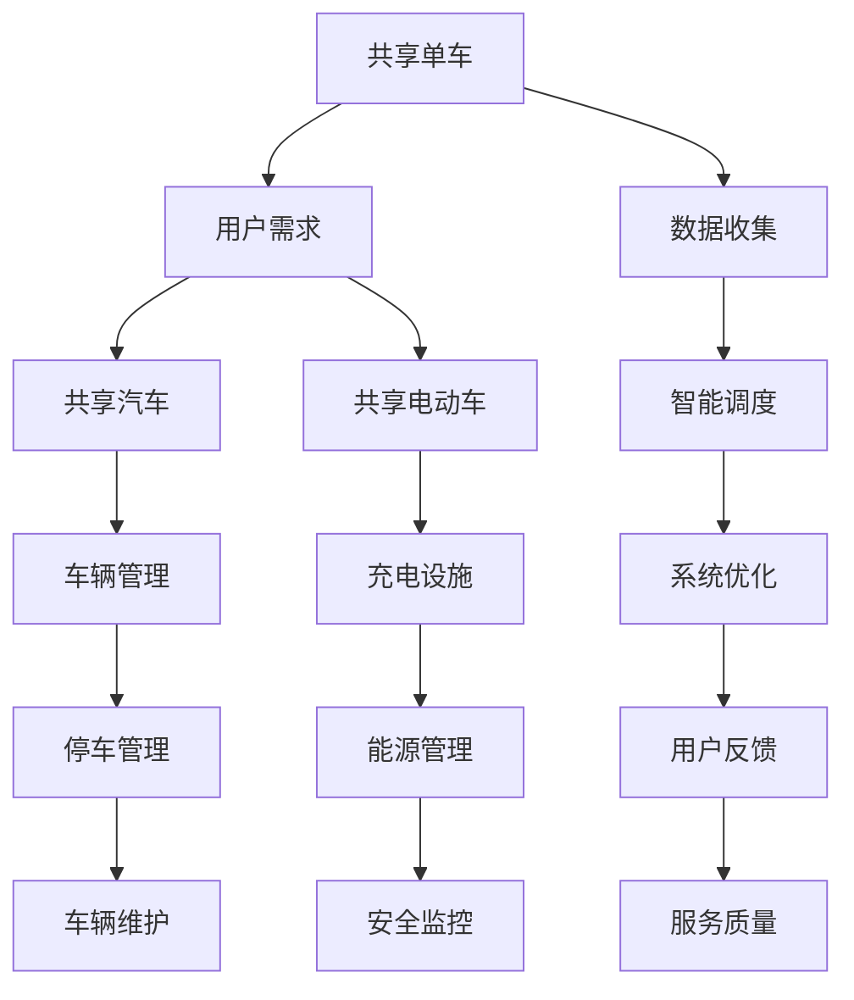
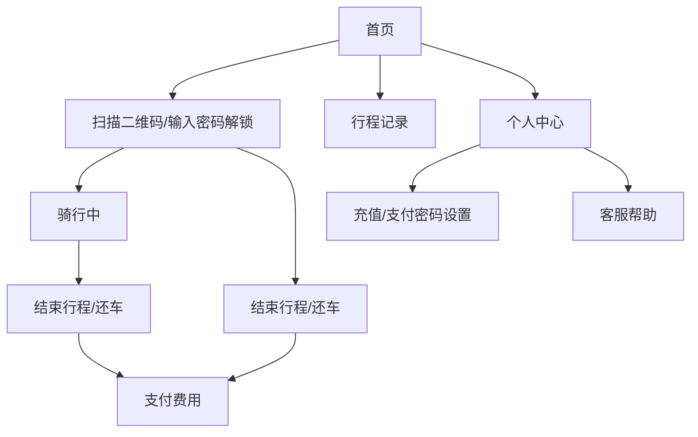

                 

### 引言与概述

共享交通（Shared Mobility）作为一种创新的交通方式，近年来在全球范围内迅速崛起。其核心思想是“共享、便捷、高效、绿色”，通过整合多种交通工具和出行方式，提供灵活、低成本、环保的出行服务。随着城市人口的增长和交通拥堵问题的日益严重，共享交通逐渐成为解决城市交通困境的重要手段。

本文旨在探讨新型城市共享交通的绿色出行创新解决方案。首先，我们将对共享交通的概念进行详细阐述，并分析其在现代城市交通系统中的重要性。接下来，我们将介绍新型城市共享交通的关键概念，如共享单车、共享汽车和共享电动车等，并通过Mermaid流程图展示它们之间的联系。随后，我们将深入讨论绿色出行的重要性以及新型城市共享交通如何实现绿色出行。文章还将详细解析共享交通系统的设计，包括用户界面设计、服务模式设计和智能调度算法等。此外，我们将通过技术实现与案例分析部分，展示共享交通技术实现的原理。文章还将探讨政策和法规对共享交通的影响，以及市场与商业模式的现状和发展趋势。最后，我们将讨论共享交通在新型城市交通系统中的挑战和未来发展方向，并对新型城市共享交通的未来进行展望。

### 核心概念与联系

在深入探讨新型城市共享交通之前，有必要先了解其核心概念及其相互关系。新型城市共享交通主要包括共享单车、共享汽车和共享电动车等，这些交通方式共同构成了一个多层次的交通生态系统，旨在提供灵活、高效、绿色的出行解决方案。

#### 共享单车

共享单车，通常指的是以低租金、便捷租借和归还的方式提供的自行车服务。用户可以通过手机应用定位最近的共享单车，扫码解锁后即可使用。共享单车具有以下特点：

- **低门槛**：无需繁琐的租车手续，随借随还。
- **便捷**：适合短途出行，解决“最后一公里”问题。
- **环保**：零排放，有助于减少城市空气污染。

#### 共享汽车

共享汽车，又称分时租赁汽车，是指在一定区域内提供共享使用的汽车服务。用户可以通过手机应用预订车辆，到达指定地点取车并使用，使用完毕后归还到指定地点。共享汽车的主要特点如下：

- **灵活**：可根据用户需求灵活预订和使用。
- **高效**：减少停车难问题，提高车辆利用率。
- **便捷**：满足中短途出行需求。

#### 共享电动车

共享电动车，包括电动滑板车、电动自行车等，是近年来兴起的共享交通方式。这些电动车通常设有限速，以确保安全。共享电动车的主要特点如下：

- **短途高效**：适合短途出行，快速便捷。
- **低能耗**：使用电力驱动，环保节能。

#### Mermaid流程图展示

为了更直观地展示新型城市共享交通的各个组成部分及其联系，我们可以使用Mermaid流程图来描述。以下是一个简化的Mermaid流程图，展示了共享单车、共享汽车和共享电动车之间的关系：

在这个流程图中，我们可以看到，用户需求是整个共享交通系统的核心。共享单车、共享汽车和共享电动车分别满足不同的出行需求，通过数据收集、智能调度、车辆管理、充电设施、系统优化、停车管理、能源管理、用户反馈等环节，形成一个高效、智能、绿色的交通生态系统。

### 绿色出行的创新解决方案

绿色出行（Green Mobility）是未来城市交通发展的必然趋势，它强调通过减少能源消耗和环境污染，实现可持续的出行方式。新型城市共享交通通过多种创新解决方案，在绿色出行方面发挥了重要作用。

#### 重要性

绿色出行的重要性不言而喻。首先，它有助于减少城市空气污染，改善居民的生活质量。根据世界卫生组织（WHO）的数据，交通污染是导致城市居民呼吸道疾病的主要原因之一。通过推广绿色出行方式，如共享单车、共享汽车和共享电动车，可以减少私家车的使用，从而降低尾气排放。其次，绿色出行有助于减少能源消耗。传统的汽油和柴油车辆依赖化石燃料，而共享电动车等绿色交通方式使用电力驱动，可以大幅降低能源消耗。此外，绿色出行还有助于缓解交通拥堵问题，提高城市交通效率。

#### 实现途径

新型城市共享交通通过以下途径实现绿色出行：

1. **共享单车**：共享单车是一种典型的绿色出行方式。它不仅零排放，还能在短途出行中替代私家车，减少交通拥堵和空气污染。通过智能锁和移动应用，用户可以轻松找到并使用共享单车，方便快捷。

2. **共享汽车**：共享汽车通过减少车辆拥有率，提高车辆利用率，有助于减少能源消耗和环境污染。共享汽车通常配备高效发动机和先进排放技术，有助于降低尾气排放。

3. **共享电动车**：共享电动车是绿色出行的重要一环。它们使用电力驱动，零排放，有助于减少空气污染。共享电动车的推广还可以促进电动汽车技术的发展和普及，推动绿色出行理念的落实。

#### 案例分析

为了更好地理解新型城市共享交通如何实现绿色出行，我们可以分析一些成功的案例。

**案例一：摩拜单车**

摩拜单车是共享单车领域的先驱之一。它通过智能锁和移动应用，实现了便捷的租借和归还服务。用户可以通过手机扫码解锁，骑上共享单车，随时随地结束行程并归还。摩拜单车的绿色出行理念得到了广泛认可，其在全球范围内的推广有效地减少了交通拥堵和空气污染。

**案例二：特斯拉共享汽车**

特斯拉（Tesla）是一家以电动汽车而闻名的公司。其共享汽车服务通过移动应用实现预订和取车，用户可以在指定地点租用特斯拉汽车。特斯拉汽车采用高效电池和先进驾驶辅助系统，不仅减少能源消耗，还能提供卓越的驾驶体验。特斯拉共享汽车的成功进一步推动了绿色出行的发展。

**案例三：滴滴出行与电动滑板车**

滴滴出行（Didi Chuxing）是一家中国领先的出行服务平台。它推出了共享电动滑板车服务，以满足用户短途出行需求。用户可以通过滴滴出行应用预订电动滑板车，并选择合适的出行路线。滴滴出行的共享电动滑板车服务不仅绿色环保，还提供了便捷、灵活的出行选择。

通过以上案例分析，我们可以看到，新型城市共享交通在实现绿色出行方面具有巨大潜力。共享单车、共享汽车和共享电动车等绿色出行方式正逐渐成为城市交通的重要组成部分，为城市居民提供更加环保、高效的出行选择。

### 共享交通系统设计

共享交通系统的设计是实现绿色出行创新解决方案的关键环节。它涉及用户界面设计、服务模式设计以及智能调度算法等多个方面，旨在为用户提供便捷、高效、绿色的出行体验。

#### 用户界面设计

用户界面设计（UI Design）是共享交通系统与用户交互的第一道门面，其目标是提供简洁、直观、易用的界面，使用户能够轻松完成租车、还车等操作。以下是用户界面设计的几个关键要素：

1. **简洁明了的布局**：界面布局要简洁明了，避免过多的冗余信息和复杂的操作流程，确保用户能够快速找到所需功能。
2. **清晰的导航**：导航设计要逻辑清晰，使用户能够轻松浏览不同页面，如首页、个人中心、行程记录等。
3. **友好的图标和颜色**：使用友好的图标和颜色搭配，提高视觉体验，使界面更加生动、有趣。
4. **快速响应**：界面响应速度要快，避免用户在使用过程中遇到长时间等待的情况。

#### 服务模式设计

服务模式设计（Service Model Design）是共享交通系统运营的核心。它涉及多种服务模式，如按时间计费、按里程计费、套餐服务等，以满足不同用户的需求。以下是几种常见的服务模式：

1. **按时间计费**：用户在租用共享交通工具时，根据使用时间进行计费。这种模式适用于短途出行，如用户从家到附近的超市购物。
2. **按里程计费**：用户在租用共享交通工具时，根据行驶里程进行计费。这种模式适用于长途出行，如用户从市区到郊区的旅游。
3. **套餐服务**：提供多种套餐服务，用户可以一次性购买一定时长或里程的套餐，享受优惠价格。这种模式适用于频繁出行的用户，如上班族的通勤。

#### 智能调度算法

智能调度算法（Smart Scheduling Algorithm）是共享交通系统设计的核心之一，它旨在通过优化车辆分配和调度，提高系统效率和用户体验。以下是几种常见的智能调度算法：

1. **基于地理信息的调度算法**：这种算法根据用户的位置信息，自动分配最近的共享交通工具。例如，当用户在某一地点发出租车请求时，系统会自动查找该地点附近的可用共享单车、共享汽车或共享电动车，并将最优选项推荐给用户。
2. **基于时间预测的调度算法**：这种算法通过分析用户的历史出行数据，预测用户的出行需求，并提前进行车辆调度。例如，在早晚高峰时段，系统可以提前将车辆调度到需求较高的区域，确保用户能够及时租到车辆。
3. **基于优化的调度算法**：这种算法通过数学优化方法，如线性规划、整数规划等，找到最优的车辆调度方案。例如，在车辆资源有限的情况下，系统可以优化车辆分配，使每个车辆都能最大化其利用率。

#### 用户界面设计实例

以下是一个用户界面设计的实例，展示了一个共享单车应用的用户界面：

在这个实例中，用户可以轻松地通过首页进入不同的功能页面，如行程记录和个人中心。扫描二维码或输入密码后，用户可以解锁共享单车并开始骑行。骑行中页面显示当前行程信息，用户可以在结束行程时选择还车并支付费用。

通过以上设计，共享交通系统能够为用户提供便捷、高效、绿色的出行体验，进一步推动绿色出行的发展。

### 技术实现与案例分析

共享交通技术实现的核心在于其高效性、安全性和用户体验。在这一部分，我们将详细讨论共享交通技术实现的基本原理，并通过具体案例分析，展示技术实现的细节和挑战。

#### 技术实现原理

共享交通技术实现主要涵盖以下几个方面：

1. **移动应用开发**：共享交通的移动应用是用户与系统交互的桥梁。它需要支持定位、支付、数据同步等功能。例如，用户可以通过移动应用实时查看附近可用的共享交通工具，并通过支付功能完成费用结算。
2. **智能锁技术**：共享单车的智能锁是确保车辆安全的重要组件。智能锁通常集成GPS、蓝牙和无线通信模块，可以远程控制开锁和锁车，同时记录车辆位置和状态信息。
3. **物联网（IoT）**：共享汽车和电动车的智能调度和管理依赖于物联网技术。通过传感器和通信模块，车辆可以实时传输状态信息，如位置、电量、故障情况等，以便进行智能调度和故障诊断。
4. **大数据与人工智能**：大数据和人工智能技术是共享交通系统的核心。通过分析用户出行数据、交通流量数据等，可以优化路线规划、车辆调度和能源管理。

#### 具体案例分析

**案例一：摩拜单车技术实现**

摩拜单车作为共享单车领域的领军企业，其技术实现涵盖了多个方面。以下是其主要技术细节：

1. **智能锁技术**：摩拜单车的智能锁采用GPS、蓝牙和无线通信模块，可以实现远程开锁和锁车功能。用户通过手机应用扫描二维码，智能锁即自动解锁，骑行结束后，用户将车停在任意位置并上锁，系统自动完成计费和锁车操作。
2. **数据分析与优化**：摩拜单车通过收集用户骑行数据，如时间、地点、距离等，进行数据分析，以优化路线规划和车辆调度。例如，系统可以根据用户出行高峰时段，将车辆调度到需求较高的区域，提高车辆利用率。
3. **能源管理**：摩拜单车的电动版配备了高效电池，通过智能调度和电池管理系统，可以确保电池的长期稳定运行。同时，摩拜单车还在积极研发太阳能充电技术，以进一步降低能源消耗。

**案例二：滴滴出行与共享电动车**

滴滴出行在共享电动车领域也取得了显著成就。以下是其技术实现的关键：

1. **智能调度系统**：滴滴出行的共享电动车智能调度系统基于大数据和人工智能技术，可以实时预测用户出行需求，优化路线规划和车辆调度。例如，在早晚高峰时段，系统会提前将车辆调度到需求较高的区域，确保用户能够及时租到车辆。
2. **车辆监控与管理**：滴滴出行通过物联网技术对共享电动车进行实时监控和管理。车辆上的传感器可以监测电池电量、行驶里程、故障情况等，系统会自动提醒用户进行充电或维修，确保车辆状态良好。
3. **用户支付与结算**：滴滴出行的共享电动车支持多种支付方式，如移动支付、银行卡支付等。用户通过移动应用完成支付，系统自动扣除费用并生成电子发票。

#### 技术实现的挑战与解决方案

共享交通技术实现过程中面临的主要挑战包括：

1. **数据安全与隐私保护**：共享交通涉及大量用户数据，如位置信息、支付信息等，如何保障数据安全、防止数据泄露是技术实现的一个重要挑战。解决方案包括数据加密、权限控制和隐私保护算法等。
2. **设备稳定性与可靠性**：共享交通工具如智能锁、传感器等设备在户外环境下需要长时间运行，如何确保设备的稳定性和可靠性是技术实现的关键。解决方案包括采用高可靠性硬件、环境适应性测试和远程监控等。
3. **系统扩展性与可维护性**：随着用户规模的扩大，系统需要具备良好的扩展性和可维护性，以应对不断增长的需求。解决方案包括模块化设计、分布式架构和自动化运维等。

通过以上案例分析，我们可以看到，共享交通技术实现不仅涉及到移动应用开发、物联网技术和大数据分析，还需要应对数据安全、设备可靠性和系统扩展性等挑战。这些技术的不断创新和优化，为共享交通的绿色出行创新解决方案提供了坚实的技术保障。

### 政策与法规

政策与法规在共享交通的发展中起着至关重要的作用，它们不仅规范了共享交通的运营，还对其未来发展产生了深远影响。以下是关于政策与法规对共享交通影响的分析，以及如何制定合理的政策和法规来促进绿色出行。

#### 当前政策和法规对共享交通的影响

1. **监管政策**：许多国家和地区对共享交通进行了监管，以规范其运营。例如，一些城市对共享单车的投放数量、停放区域进行了限制，以确保交通秩序和城市环境。这些政策有助于防止共享交通的无序扩张，但同时也可能影响其服务质量和用户便利性。

2. **税务政策**：共享交通企业的运营涉及多个税种，如车辆购置税、运营税等。税收政策的变化直接影响企业的运营成本和盈利能力。例如，某些地区对电动汽车的购置税进行了减免，以鼓励绿色出行。

3. **交通管理法规**：交通管理法规对共享交通的运营模式提出了具体要求。例如，一些城市要求共享汽车提供司机服务，以确保乘客安全。此外，交通管理法规还对共享交通工具的速度、车道使用等进行了规定，以确保交通秩序。

#### 如何制定合理的政策和法规促进绿色出行

1. **平衡监管与市场发展**：政策制定者需要在规范共享交通运营和促进市场发展之间找到平衡。例如，可以通过试点项目逐步引入共享交通，在积累经验的基础上完善相关政策。

2. **鼓励绿色出行**：政府可以通过多种方式鼓励绿色出行，如提供购车补贴、电费优惠、停车费减免等。此外，政府还可以建设更多的充电设施，以支持电动汽车的普及。

3. **完善交通基础设施**：政府应加大对交通基础设施的投资，如建设更多的自行车道、公交车站和充电桩等，以提升共享交通的便利性和用户满意度。

4. **建立数据共享平台**：政策制定者应推动政府部门和企业之间的数据共享，以优化交通流量管理、车辆调度和停车管理。例如，通过交通信息平台，共享单车和共享汽车企业可以获取实时交通数据，从而更好地进行车辆调度。

5. **加强法规执行力度**：政策与法规的有效实施需要强有力的执行力度。政府应加强对违法行为的执法力度，确保共享交通企业遵守相关规定，保障用户权益。

#### 案例分析

**案例一：中国北京市的共享交通政策**

北京市作为中国的首都，共享交通发展迅速。为规范共享交通运营，北京市政府出台了多项政策。例如：

- **限制投放数量**：对共享单车的投放数量进行了限制，以防止过度投放导致的交通拥堵和停放问题。
- **规范停放区域**：明确共享单车停放的区域，要求用户将车辆停放在指定区域内，避免占用行人通道和公共区域。
- **加强执法力度**：加大对违法停放和破坏共享单车的执法力度，维护共享交通的正常运营。

**案例二：欧洲某些城市的绿色出行政策**

在欧洲，许多城市通过提供购车补贴和电费优惠来鼓励绿色出行。例如：

- **购车补贴**：政府为购买电动汽车的用户提供购车补贴，以降低购车成本，促进电动汽车的普及。
- **电费优惠**：政府为电动汽车提供电费优惠，以鼓励用户选择电动汽车作为出行工具。
- **充电设施建设**：政府投资建设更多的充电桩，以支持电动汽车的充电需求。

通过这些政策，欧洲城市不仅促进了绿色出行的发展，还提升了城市的环保水平。

综上所述，政策与法规在共享交通的发展中起到了重要的推动和规范作用。通过制定合理的政策和法规，可以促进绿色出行，提升城市交通系统的可持续发展水平。

### 市场与商业模式

共享交通市场的现状和发展趋势是一个充满活力且不断变化的领域。随着技术的进步和消费者需求的提升，共享交通正在逐步改变传统交通模式，并展现出巨大的市场潜力。

#### 市场现状

1. **市场规模**：根据市场研究机构的报告，全球共享交通市场在过去几年中呈现出快速增长的趋势。特别是在中国和美国，共享单车和共享汽车市场规模逐年扩大。例如，摩拜单车和滴滴出行已成为全球共享交通领域的佼佼者。

2. **用户群体**：共享交通的迅速发展吸引了广泛的用户群体，特别是年轻一代。他们更倾向于选择便捷、低成本的共享交通方式，以替代传统的私家车出行。

3. **竞争格局**：共享交通市场呈现出多强争霸的竞争格局。多家企业通过不同的模式争夺市场份额，如摩拜单车、ofo、滴滴出行、Uber等。这些企业在市场推广、技术创新和服务质量方面进行激烈竞争。

#### 发展趋势

1. **技术创新**：共享交通企业不断引入新技术，以提高运营效率和服务质量。例如，人工智能技术在路线规划、智能调度和用户行为分析中的应用，大数据技术在用户需求预测和运营优化中的应用，物联网技术在车辆监控和能源管理中的应用等。

2. **多元化发展**：共享交通企业不再局限于单一的交通方式，而是通过多元化发展，提供更全面的出行解决方案。例如，滴滴出行不仅提供共享汽车服务，还推出了共享单车和电动滑板车服务，形成了多元化的交通生态系统。

3. **绿色出行**：随着全球对环保问题的关注日益增加，绿色出行成为共享交通企业发展的重点。电动汽车和可再生能源的广泛应用，将有助于减少交通污染和碳排放，推动共享交通向绿色出行方向发展。

4. **政策支持**：各国政府纷纷出台支持共享交通发展的政策，以促进绿色出行和缓解城市交通拥堵。例如，一些城市提供购车补贴和电费优惠，以鼓励用户选择电动汽车作为出行工具。

#### 可持续的商业模式

1. **大数据驱动**：通过大数据分析，共享交通企业可以更好地了解用户需求，优化运营策略，提高服务质量和用户满意度。同时，数据驱动的营销策略有助于降低营销成本，提高营销效果。

2. **广告和品牌合作**：共享交通企业可以通过与广告商和品牌合作，在移动应用和共享交通工具上进行广告投放，以实现盈利。此外，品牌合作还可以提升企业的品牌形象和市场影响力。

3. **增值服务**：共享交通企业可以通过提供增值服务，如车辆保养、维修、租赁等，实现额外收入。例如，滴滴出行通过推出滴滴出行宝和滴滴加油服务，为用户提供了更多便利。

4. **多元化经营**：共享交通企业可以通过多元化经营，实现收入来源的多样化。例如，通过投资其他相关领域，如智能交通系统、新能源汽车等，扩大企业的业务范围和市场份额。

总之，共享交通市场正处在快速发展阶段，随着技术创新和政策支持的不断加强，其市场潜力将进一步释放。可持续的商业模式将为共享交通企业提供稳定的盈利来源，推动其持续发展。

### 挑战与未来展望

共享交通在新型城市交通系统中虽然展现了巨大的潜力和优势，但同时也面临诸多挑战。本文将探讨这些挑战，并对其未来发展方向进行展望。

#### 挑战

1. **数据安全与隐私保护**：共享交通涉及大量用户数据，包括位置信息、支付记录等，如何确保数据安全、防止数据泄露是一个重要挑战。此外，如何平衡数据利用与用户隐私保护也是亟待解决的问题。

2. **设备稳定性与可靠性**：共享交通工具如智能锁、传感器等在户外环境中需要长时间运行，其稳定性和可靠性直接影响用户体验。设备故障不仅会影响服务，还可能导致经济损失。

3. **交通秩序与管理**：共享交通的快速发展可能带来交通秩序问题，如共享单车随意停放、占用行人通道等。如何通过有效的管理和监管措施，确保交通秩序，是一个重要挑战。

4. **环境影响**：虽然共享交通有助于减少碳排放，但大量共享交通工具的使用也可能带来一定的环境问题，如电池废弃、能源消耗等。如何实现共享交通的可持续发展，降低环境影响，是一个亟待解决的难题。

5. **市场竞争与政策监管**：共享交通市场的竞争激烈，企业需要不断创新和优化服务，以保持市场竞争力。同时，政策监管也在不断变化，企业需要适应政策变化，确保合规运营。

#### 未来发展方向

1. **技术创新**：随着人工智能、大数据、物联网等技术的不断进步，共享交通将在技术创新方面取得突破。例如，智能调度算法的优化将提高车辆利用率，数据分析技术将帮助更好地了解用户需求，物联网技术将提升设备的稳定性和可靠性。

2. **绿色出行**：未来共享交通将更加注重绿色出行，通过推广电动汽车、共享电动车等绿色交通方式，减少碳排放和环境污染。同时，企业将加大对可再生能源和绿色能源基础设施的投资，实现共享交通的可持续发展。

3. **政策支持**：政府将加大对共享交通的政策支持，通过提供购车补贴、电费优惠、建设充电桩等措施，鼓励绿色出行和共享交通的发展。同时，政府将加强监管，确保共享交通企业合规运营，维护市场秩序。

4. **多元化发展**：共享交通企业将不再局限于单一的交通方式，而是通过多元化发展，提供更全面的出行解决方案。例如，企业将整合公共交通、共享单车、共享汽车等多种交通方式，形成综合性的出行服务平台。

5. **国际合作**：共享交通企业将通过国际合作，共同应对全球性挑战，如数据安全、环境保护等。同时，企业将借鉴国际先进经验，提升自身竞争力，推动共享交通的全球发展。

总之，共享交通在新型城市交通系统中面临着诸多挑战，但同时也拥有广阔的发展前景。通过技术创新、政策支持、绿色出行和多元化发展，共享交通将更好地服务于城市交通需求，推动城市交通系统的可持续发展。

### 总结与展望

综上所述，新型城市共享交通通过创新解决方案，为绿色出行提供了重要途径。本文首先介绍了共享交通的概念、核心概念及其联系，然后探讨了绿色出行的重要性及实现途径，详细解析了共享交通系统的设计，包括用户界面、服务模式、智能调度算法等。同时，通过案例分析展示了技术实现的细节和挑战，分析了政策与法规的影响，并展望了市场的现状和发展趋势。此外，本文还探讨了共享交通面临的挑战及未来发展方向。

展望未来，新型城市共享交通将继续发挥其优势，通过技术创新和政策支持，实现更加高效、绿色、可持续的发展。共享交通不仅有助于缓解城市交通拥堵和环境污染，还将促进城市交通系统的整体优化。随着人工智能、大数据、物联网等技术的不断进步，共享交通将迎来更多机遇，为城市居民提供更加便捷、多样化的出行选择。

在未来，共享交通企业需要不断创新，提升服务质量，满足用户需求。同时，政府和企业应加强合作，共同推动共享交通的健康发展。通过共同努力，新型城市共享交通将为城市交通系统带来深刻的变革，推动城市的可持续发展。

