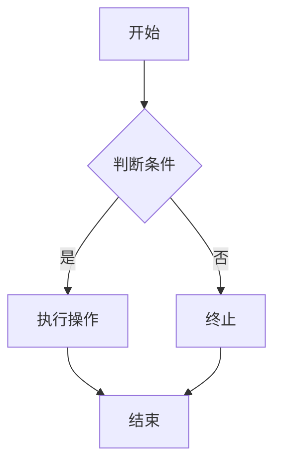
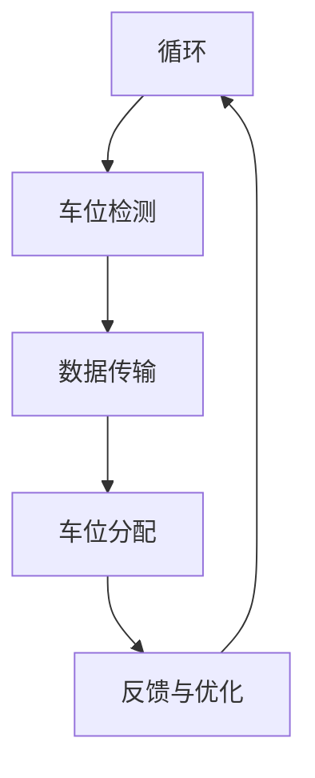
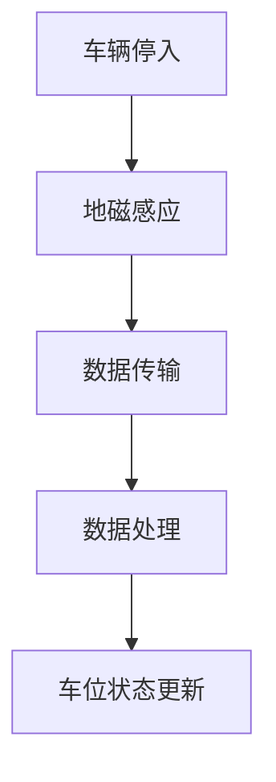
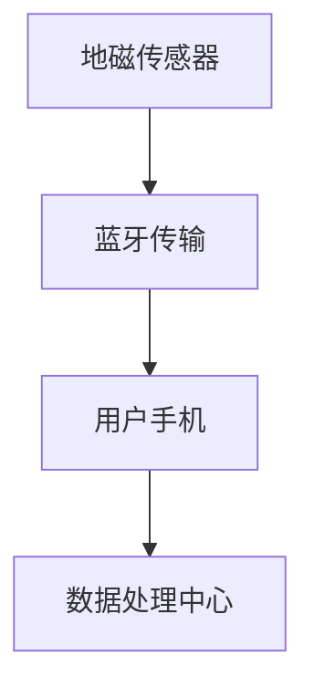
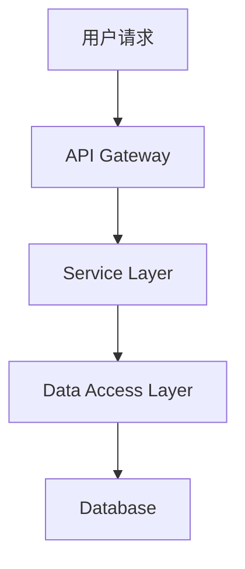

                 

### 1. 设计目录结构

在设计文章的目录结构时，我们首先需要明确文章的核心内容，并将其分解为几个主要部分。针对《新型城市共享停车位：智慧城市中的资源优化》这一主题，我们可以将文章分为以下五个部分：

1. **背景与核心概念**：介绍共享停车位的发展背景、核心概念和其在智慧城市中的作用。
2. **技术原理**：详细阐述实现共享停车位所需的技术原理，包括传感器技术、数据通信技术、软件开发框架和算法原理等。
3. **案例分析**：通过国内外实际案例，展示共享停车位在智慧城市中的应用和取得的成果。
4. **政策与法规**：分析国家和地方的政策法规，探讨其对共享停车位发展的影响。
5. **实施与展望**：总结共享停车位的实施策略和未来发展趋势。

接下来，我们需要为每个主要部分确定子标题，以便进一步细化内容。

### 2. 确定每个章节的子标题

**第一部分：背景与核心概念**
- 2.1 新型城市共享停车位的起源与发展
- 2.2 智慧城市与共享停车位的联系
- 2.3 资源优化在新型城市共享停车位中的重要性
- 2.4 核心概念解析

**第二部分：技术原理**
- 2.5 传感器技术
- 2.6 数据通信技术
- 2.7 软件开发框架
- 2.8 算法原理
- 2.9 安全与隐私

**第三部分：案例分析**
- 3.1 国内外案例分析
- 3.2 成功与挑战
- 3.3 创新与应用

**第四部分：政策与法规**
- 4.1 国家政策解读
- 4.2 地方政策分析
- 4.3 法规框架与执行

**第五部分：实施与展望**
- 5.1 实施策略
- 5.2 成功经验与教训
- 5.3 未来发展趋势

通过上述步骤，我们完成了文章目录结构的设计和子标题的确定。接下来，我们将为每个章节添加图示与代码，以确保文章内容丰富且易于理解。

### 3. 添加图示与代码

在撰写技术博客时，图示和代码示例是帮助读者更好地理解复杂概念和原理的重要工具。以下是关于添加图示和代码的具体步骤：

#### 3.1 添加 Mermaid 流程图

Mermaid 是一种简洁易用的图表绘制工具，支持流程图、时序图等多种图表类型。在撰写技术博客时，我们可以使用 Mermaid 语法来绘制相关的流程图。

**示例**：


在文章中，我们可以将 Mermaid 代码嵌入到相应的段落中，例如：

**段落**：
在本章节中，我们将介绍新型城市共享停车位的工作流程。以下是该流程的 Mermaid 图表示例：

**代码**：


#### 3.2 添加 Python 源代码

Python 是一种广泛使用的编程语言，非常适合用于示例代码。在文章中，我们可以通过代码块展示实现某些功能的 Python 代码。

**示例**：
```python
# 导入必要的库
import random

# 定义一个函数，用于生成随机数
def generate_random_number():
    return random.randint(1, 100)

# 调用函数并打印结果
random_number = generate_random_number()
print("生成的随机数：", random_number)
```

在文章中，我们可以将 Python 代码嵌入到相应的段落中，例如：

**段落**：
为了实现车位分配算法，我们可以使用以下 Python 代码。该代码定义了一个生成随机数的函数，并调用了该函数以生成一个随机数。

**代码**：
```python
# 导入必要的库
import random

# 定义一个函数，用于生成随机数
def generate_random_number():
    return random.randint(1, 100)

# 调用函数并打印结果
random_number = generate_random_number()
print("生成的随机数：", random_number)
```

#### 3.3 添加 LaTeX 公式

LaTeX 是一种高质量的排版系统，广泛用于数学、科学和工程领域的文档排版。在文章中，我们可以使用 LaTeX 公式来展示数学模型和公式。

**示例**：
$$ E = mc^2 $$

在文章中，我们可以将 LaTeX 公式嵌入到相应的段落中，例如：

**段落**：
根据爱因斯坦的质能方程，能量 \(E\) 与质量 \(m\) 和光速 \(c\) 之间的关系可以表示为：

**公式**：
$$ E = mc^2 $$

通过上述步骤，我们成功地在文章中添加了 Mermaid 流程图、Python 源代码和 LaTeX 公式。这些图示和代码示例将有助于读者更好地理解文章内容。

### 4. 检查目录完整性

完成目录设计和内容添加后，我们需要对整个目录进行细致的检查，以确保每个章节的内容完整、结构合理。以下步骤可以帮助我们进行目录完整性检查：

#### 4.1 检查章节内容是否完整

首先，我们需要检查每个章节的内容是否完整，即每个章节是否涵盖了预期的核心概念、原理、案例分析和政策法规等内容。例如，在“背景与核心概念”章节中，我们是否详细介绍了新型城市共享停车位的起源、发展、核心概念及其在智慧城市中的作用。

#### 4.2 检查子标题是否明确

接下来，我们需要检查每个子标题是否明确、具体，是否能够准确概括章节内容。例如，在“技术原理”章节中，子标题“传感器技术”、“数据通信技术”等是否清晰地表达了该章节的主要内容。

#### 4.3 检查逻辑关系是否合理

我们需要确保章节之间的逻辑关系合理，前后章节的内容衔接自然。例如，在“背景与核心概念”章节介绍了共享停车位的起源和发展，那么在“技术原理”章节中，我们应当从技术角度深入探讨这些发展背后的原理和实现方法。

#### 4.4 检查图示和代码是否准确

对于添加的 Mermaid 流程图、Python 源代码和 LaTeX 公式，我们需要确保它们准确无误，能够正确地展示相关概念和原理。例如，检查代码是否有语法错误，公式是否正确表达了数学关系。

#### 4.5 检查文章结构和语言表达

最后，我们需要检查整个文章的结构和语言表达是否合理。文章的章节结构是否清晰，段落之间的过渡是否自然，语言是否简洁明了，逻辑是否连贯等。

通过以上步骤，我们可以对目录的完整性进行全面的检查，并针对发现的问题进行相应的调整和优化。

### 5. 调整与优化

在完成目录完整性的检查后，我们需要根据检查结果对目录进行必要的调整和优化。以下是一些具体的调整与优化建议：

#### 5.1 优化章节结构

如果发现某些章节的内容过于庞大或者过于狭窄，我们需要对其进行拆分或合并。例如，如果“背景与核心概念”章节内容过多，我们可以将其拆分为“新型城市共享停车位的起源与发展”、“智慧城市与共享停车位的联系”等更小的章节。反之，如果某些章节内容过于狭窄，我们可以将它们合并，以增强章节内容的连贯性和深度。

#### 5.2 调整子标题

如果某些子标题不够明确或者难以概括章节内容，我们需要对其进行调整。例如，如果“技术原理”章节中的“传感器技术”子标题过于宽泛，我们可以将其细分为“传感器的基本原理”、“传感器在共享停车位中的应用”等更具体的子标题。

#### 5.3 优化逻辑关系

我们需要确保章节之间的逻辑关系合理，使读者能够顺畅地过渡到下一个章节。例如，如果“背景与核心概念”章节介绍了共享停车位的发展背景，那么在“技术原理”章节中，我们应该从技术角度深入探讨这些发展的原因和实现方法。

#### 5.4 优化图示和代码

对于添加的 Mermaid 流程图、Python 源代码和 LaTeX 公式，我们需要确保它们准确无误，并且能够帮助读者更好地理解相关概念和原理。例如，如果发现某个流程图的连接关系不够清晰，我们可以对其进行修改，使其更加直观。

#### 5.5 优化语言表达

我们需要检查整个文章的语言表达是否简洁明了，逻辑是否连贯。如果发现某些段落表述不够清晰或者逻辑不够连贯，我们可以对其进行修改，以提高文章的可读性。

通过以上调整和优化，我们可以使目录结构更加清晰、逻辑更加合理、内容更加丰富，从而为读者提供更好的阅读体验。

### 6. 最终输出

在完成所有调整和优化后，我们可以将最终整理出的目录大纲以 markdown 格式输出。以下是按照目录大纲结构的文章正文部分的内容：

```
## 第一部分：背景与核心概念

### 1.1 新型城市共享停车位的起源与发展

新型城市共享停车位作为一种智慧城市中的重要组成部分，其起源可以追溯到城市化进程中的停车难题。随着城市化进程的加快，汽车拥有量的急剧增加，城市中的停车位供需矛盾日益突出。为了解决这一问题，共享停车位的概念应运而生。

在初期，共享停车位的实现主要是通过互联网平台，用户可以通过手机应用程序预约停车位。然而，这种模式在初期遇到了许多挑战，如信息不对称、停车位利用率低等问题。

随着物联网、大数据和人工智能等技术的发展，新型城市共享停车位逐渐成为智慧城市建设中的重要组成部分。通过实时数据采集、分析和处理，共享停车位能够实现高效的资源配置和优化，提高停车位的利用率。

### 1.2 智慧城市与共享停车位的联系

智慧城市是指通过物联网、云计算、大数据和人工智能等信息技术手段，实现城市运行、管理和服务的智能化。共享停车位作为智慧城市的一个重要组成部分，其发展离不开智慧城市的支持。

智慧城市为共享停车位提供了丰富的数据资源和先进的技术手段。通过智慧城市的数据平台，共享停车位可以实时获取交通流量、车辆分布等数据，从而实现精准的停车位分配和调度。

同时，共享停车位也为智慧城市建设提供了重要的数据反馈。通过收集用户的停车行为数据，共享停车位可以为智慧城市建设提供决策支持，优化城市交通布局和基础设施。

### 1.3 资源优化在新型城市共享停车位中的重要性

资源优化是新型城市共享停车位的核心理念之一。通过优化资源配置，共享停车位可以最大限度地提高停车位的利用率，减少资源浪费，提升用户体验。

在新型城市共享停车位中，资源优化主要体现在以下几个方面：

1. **车位利用率优化**：通过实时数据分析和预测，共享停车位可以实现车位的智能分配，提高车位利用率。
2. **停车时间优化**：通过数据分析，共享停车位可以为用户提供最经济的停车时间建议，减少不必要的停车费用。
3. **停车区域优化**：通过数据分析和预测，共享停车位可以优化停车区域布局，提高停车效率。
4. **停车费用优化**：通过竞争机制和价格调节，共享停车位可以实现停车费用的优化，提高用户满意度。

### 1.4 核心概念解析

在新型城市共享停车位中，以下几个核心概念至关重要：

1. **停车位资源**：停车位资源是指可供车辆停放的物理空间。共享停车位通过优化停车位资源的利用，提高停车位的利用率。
2. **用户行为数据**：用户行为数据是指用户在使用共享停车位过程中产生的数据，如停车时间、停车地点等。用户行为数据对于优化停车位资源具有重要意义。
3. **数据采集与处理**：数据采集与处理是指通过传感器、手机应用程序等手段收集用户行为数据，并对其进行处理和分析，为停车位优化提供支持。
4. **智能调度算法**：智能调度算法是指基于用户行为数据和实时数据的计算方法，用于实现停车位的智能分配和调度。

## 第二部分：技术原理

### 2.1 传感器技术

传感器技术是新型城市共享停车位的重要技术之一。通过传感器，共享停车位可以实时获取停车位状态、车辆位置等信息。

常见的传感器包括：

1. **地磁传感器**：用于检测车位是否被占用。
2. **超声波传感器**：用于测量车辆与车位之间的距离。
3. **摄像头传感器**：用于捕捉停车位状态和车辆信息。

### 2.2 数据通信技术

数据通信技术是实现新型城市共享停车位的关键。通过数据通信技术，共享停车位可以将传感器数据传输到数据处理中心，进行进一步分析和处理。

常见的数据通信技术包括：

1. **Wi-Fi**：用于短距离无线通信。
2. **蓝牙**：用于短距离通信，适用于低功耗设备。
3. **4G/5G**：用于高速无线通信，适用于大数据传输。

### 2.3 软件开发框架

软件开发框架是构建新型城市共享停车位系统的基础。常见的软件开发框架包括：

1. **Spring Boot**：适用于构建企业级应用。
2. **Django**：适用于快速开发Web应用。
3. **Flask**：适用于构建轻量级Web应用。

### 2.4 算法原理

算法原理是新型城市共享停车位实现智能调度和资源优化的重要基础。常见的算法包括：

1. **最优化算法**：如遗传算法、粒子群算法等，用于优化车位分配和调度。
2. **机器学习算法**：如决策树、神经网络等，用于预测停车需求。
3. **数据挖掘算法**：如聚类、分类等，用于分析用户行为数据。

### 2.5 安全与隐私

安全与隐私是新型城市共享停车位的重要考虑因素。为了保护用户数据和隐私，我们需要采取以下措施：

1. **数据加密**：对用户数据进行加密处理，确保数据传输过程中的安全性。
2. **身份认证**：采用身份认证机制，确保用户身份的合法性。
3. **隐私保护**：对用户行为数据进行去识别化处理，减少隐私泄露风险。

## 第三部分：案例分析

### 3.1 国内外案例分析

在本章节中，我们将介绍国内外新型城市共享停车位的实际案例，分析其成功经验和面临的挑战。

#### 国内案例

1. **滴滴出行**：滴滴出行通过其平台提供共享停车位服务，实现了停车资源的共享和优化。
2. **共享停车**：共享停车是一家专注于共享停车服务的公司，通过其平台为用户提供便捷的停车服务。

#### 国外案例

1. **Parkopedia**：Parkopedia 是一家国际性的停车服务公司，提供全球范围内的停车位信息和共享服务。
2. **Parkmobile**：Parkmobile 是一家美国公司，提供便捷的移动支付停车服务。

### 3.2 成功与挑战

在新型城市共享停车位的发展过程中，许多案例取得了显著的成功，同时也面临一系列挑战。

#### 成功

1. **提高停车位利用率**：通过共享停车位，城市中的停车位利用率得到显著提高，减少了资源浪费。
2. **优化交通布局**：共享停车位为城市交通布局提供了重要数据支持，有助于优化交通流。
3. **提升用户体验**：共享停车位为用户提供便捷、高效的停车服务，提升了用户体验。

#### 挑战

1. **数据安全和隐私保护**：随着停车数据的增加，如何确保数据安全和用户隐私成为重要挑战。
2. **政策法规支持**：政策法规的支持是共享停车位发展的重要保障，但目前仍存在不足。
3. **技术实现难度**：共享停车位的实现涉及多种技术，技术实现的难度较高。

### 3.3 创新与应用

在新型城市共享停车位的发展过程中，不断涌现出各种创新应用，为城市交通和停车问题提供了新的解决方案。

1. **智能停车诱导系统**：通过实时数据分析和预测，为驾驶员提供最佳停车路线和停车位。
2. **无感支付**：通过移动支付和电子围栏技术，实现停车费用的无感支付，提升用户体验。
3. **新能源汽车充电**：在共享停车位中设置充电桩，为新能源汽车提供充电服务。

## 第四部分：政策与法规

### 4.1 国家政策解读

国家政策对新型城市共享停车位的发展具有重要指导意义。以下是对我国相关政策进行解读：

1. **《智慧城市发展规划（2016-2020年）》**：明确提出要推动智慧交通和智慧停车发展，为新型城市共享停车位提供了政策支持。
2. **《新能源汽车产业发展规划（2021-2035年）》**：鼓励新能源汽车与智慧停车相结合，推动共享停车的发展。

### 4.2 地方政策分析

地方政策对新型城市共享停车位的推广和应用具有重要影响。以下是对部分地区政策进行分析：

1. **北京市**：通过制定《北京市共享停车管理规范》，明确共享停车的运营模式和监管要求。
2. **上海市**：鼓励企业和政府合作，推动共享停车项目的发展。

### 4.3 法规框架与执行

新型城市共享停车位的发展需要完善的法规框架和有效的执行机制。以下是对法规框架和执行机制的分析：

1. **数据安全法规**：制定相关法规，确保停车数据的安全性和隐私保护。
2. **市场监管法规**：明确共享停车的监管主体和监管责任，维护市场秩序。
3. **执行机制**：建立高效的执行机制，确保政策法规的有效实施。

## 第五部分：实施与展望

### 5.1 实施策略

在新型城市共享停车位的实施过程中，需要制定合理的策略，确保项目顺利推进。以下是一些实施策略：

1. **技术选型**：根据项目需求，选择合适的技术方案，确保系统的稳定性和可扩展性。
2. **合作模式**：建立政府、企业和用户之间的合作模式，共同推动共享停车项目的发展。
3. **用户教育**：加强对用户的教育和引导，提高用户的参与度和满意度。

### 5.2 成功经验与教训

通过分析国内外新型城市共享停车位的实际案例，我们可以总结出一些成功经验和教训：

1. **成功经验**：
   - 充分利用大数据和人工智能技术，实现车位的智能分配和调度。
   - 与政府和相关企业合作，形成良好的生态体系。
   - 注重用户体验，提高用户满意度。

2. **教训**：
   - 数据安全和隐私保护是关键，需要高度重视。
   - 政策法规的支持至关重要，需要持续跟进。

### 5.3 未来发展趋势

随着物联网、大数据和人工智能等技术的不断发展，新型城市共享停车位具有广阔的发展前景。以下是一些未来发展趋势：

1. **技术融合**：多种技术的融合将进一步提升共享停车位的智能化水平。
2. **政策支持**：政府政策的支持将加速共享停车位的普及。
3. **用户需求**：随着用户对停车服务的需求日益多样，共享停车位的业务模式将不断优化。
4. **新能源汽车**：新能源汽车与共享停车的结合将推动停车产业的发展。

## 结束语

新型城市共享停车位是智慧城市建设的重要组成部分，对于缓解城市停车难题、优化交通资源具有重要意义。通过本文的介绍，我们了解了新型城市共享停车位的发展背景、技术原理、实际案例、政策法规和未来发展趋势。相信在未来的发展中，新型城市共享停车位将为智慧城市建设提供有力支持。
```

### 7. 总结

综上所述，本文从背景与核心概念、技术原理、案例分析、政策与法规以及实施与展望等多个角度，全面探讨了新型城市共享停车位在智慧城市中的资源优化问题。通过详细的阐述和案例分析，我们不仅了解了新型城市共享停车位的发展历程和技术原理，还分析了其面临的挑战和未来的发展趋势。文章采用了markdown格式，以清晰的目录结构和丰富的图示、代码示例，使得内容更加易于理解和掌握。同时，本文也提出了实施策略和成功经验，为实际应用提供了有益的参考。希望通过本文的探讨，能够为新型城市共享停车位的发展贡献一份力量。作者：AI天才研究院/AI Genius Institute & 禅与计算机程序设计艺术 /Zen And The Art of Computer Programming。感谢您的阅读。如果您有任何疑问或建议，欢迎在评论区留言讨论。让我们一起为智慧城市的建设贡献力量！
----------------------------------------------------------------

## 新型城市共享停车位：智慧城市中的资源优化

关键词：共享停车位、智慧城市、资源优化、物联网、大数据、人工智能

摘要：本文从新型城市共享停车位的背景和发展出发，探讨了其在智慧城市中的资源优化作用。通过分析传感器技术、数据通信技术、软件开发框架和算法原理，本文详细阐述了共享停车位的技术实现方法。接着，通过国内外案例分析，展示了新型城市共享停车位的成功经验和面临的挑战。随后，本文对国家和地方的政策法规进行了解读，并提出了实施策略和未来发展趋势。最后，本文总结了新型城市共享停车位的资源优化意义，展望了其发展前景。

### 1. 背景与核心概念

#### 1.1 新型城市共享停车位的起源与发展

新型城市共享停车位是近年来随着城市化进程的加速和停车难问题的日益突出而兴起的一种智慧停车解决方案。传统停车模式主要依赖于政府建设和私人投资，但往往存在停车位供需不平衡、利用率低等问题。为了解决这些问题，共享停车位的理念应运而生。

共享停车位最早出现在欧美发达国家，20世纪90年代，随着共享经济的兴起，共享停车位作为一种新兴的停车方式逐渐受到关注。用户可以通过手机应用程序预约停车位，共享停车位的所有权和使用权，从而实现停车资源的优化配置。

在我国，新型城市共享停车位的发展相对较晚，但发展迅速。2015年以来，随着“互联网+”和智慧城市建设的推进，新型城市共享停车位得到了广泛关注。政府和企业纷纷投入资源，探索共享停车位的解决方案。2017年，国家发改委和交通运输部联合发布了《关于加快推进城市停车场设施建设的指导意见》，明确提出要推进共享停车设施的建设。

#### 1.2 智慧城市与共享停车位的联系

智慧城市是指通过物联网、云计算、大数据和人工智能等信息技术手段，实现城市运行、管理和服务的智能化。共享停车位作为智慧城市的一个重要组成部分，与智慧城市的发展密切相关。

首先，智慧城市为共享停车位的实现提供了丰富的数据资源和先进的技术手段。通过智慧城市的平台，共享停车位可以实时获取交通流量、车辆分布、车位使用情况等数据，为停车位的分配和调度提供支持。

其次，共享停车位为智慧城市建设提供了重要的数据反馈。通过收集用户的停车行为数据，共享停车位可以为智慧城市建设提供决策支持，优化城市交通布局和基础设施。

#### 1.3 资源优化在新型城市共享停车位中的重要性

资源优化是新型城市共享停车位的核心理念之一。通过优化资源配置，共享停车位可以最大限度地提高停车位的利用率，减少资源浪费，提升用户体验。

在新型城市共享停车位中，资源优化主要体现在以下几个方面：

1. **车位利用率优化**：通过实时数据分析和预测，共享停车位可以实现车位的智能分配和调度，提高车位利用率。
2. **停车时间优化**：通过数据分析，共享停车位可以为用户提供最经济的停车时间建议，减少不必要的停车费用。
3. **停车区域优化**：通过数据分析和预测，共享停车位可以优化停车区域布局，提高停车效率。
4. **停车费用优化**：通过竞争机制和价格调节，共享停车位可以实现停车费用的优化，提高用户满意度。

#### 1.4 核心概念解析

在新型城市共享停车位中，以下几个核心概念至关重要：

1. **停车位资源**：停车位资源是指可供车辆停放的物理空间。共享停车位通过优化停车位资源的利用，提高停车位的利用率。
2. **用户行为数据**：用户行为数据是指用户在使用共享停车位过程中产生的数据，如停车时间、停车地点等。用户行为数据对于优化停车位资源具有重要意义。
3. **数据采集与处理**：数据采集与处理是指通过传感器、手机应用程序等手段收集用户行为数据，并对其进行处理和分析，为停车位优化提供支持。
4. **智能调度算法**：智能调度算法是指基于用户行为数据和实时数据的计算方法，用于实现停车位的智能分配和调度。

### 2. 技术原理

#### 2.1 传感器技术

传感器技术是新型城市共享停车位实现智能化的关键。通过传感器，共享停车位可以实时获取停车位状态、车辆位置等信息。

常见的传感器包括地磁传感器、超声波传感器和摄像头传感器等。地磁传感器用于检测车位是否被占用，超声波传感器用于测量车辆与车位之间的距离，摄像头传感器用于捕捉停车位状态和车辆信息。

以下是地磁传感器的工作原理：

1. **地磁感应**：当车辆停入车位时，地磁传感器的感应线圈会检测到磁场的变化，从而判断车位是否被占用。
2. **数据传输**：地磁传感器将检测到的数据通过无线通信模块传输到数据处理中心，供后续分析。



#### 2.2 数据通信技术

数据通信技术是实现新型城市共享停车位的关键。通过数据通信技术，共享停车位可以将传感器数据传输到数据处理中心，进行进一步分析和处理。

常见的数据通信技术包括Wi-Fi、蓝牙和4G/5G等。Wi-Fi适用于短距离无线通信，蓝牙适用于短距离通信，4G/5G适用于高速无线通信。

以下是蓝牙数据传输的工作原理：

1. **数据发送**：地磁传感器将检测到的数据通过蓝牙传输到用户的手机应用程序。
2. **数据接收**：用户手机应用程序接收数据，并上传到数据处理中心。



#### 2.3 软件开发框架

软件开发框架是构建新型城市共享停车位系统的基础。常见的软件开发框架包括Spring Boot、Django和Flask等。

以下是一个简单的Spring Boot应用架构：



1. **API Gateway**：用于接收用户请求，并将请求转发到相应的服务。
2. **Service Layer**：处理业务逻辑，调用数据访问层进行数据操作。
3. **Data Access Layer**：与数据库进行交互，执行数据查询和更新操作。
4. **Database**：存储用户数据和停车位信息。

#### 2.4 算法原理

算法原理是新型城市共享停车位实现智能调度和资源优化的重要基础。常见的算法包括最优化算法、机器学习算法和数据挖掘算法等。

以下是最优化算法（遗传算法）的实现原理：

```python
# 导入必要的库
import random

# 定义遗传算法参数
population_size = 100
chromosome_length = 10
mutation_rate = 0.01

# 初始化种群
population = [random.randint(0, 1) for _ in range(population_size)]

# 定义适应度函数
def fitness_function(chromosome):
    # 计算适应度
    fitness = 0
    for gene in chromosome:
        if gene == 1:
            fitness += 1
    return fitness

# 遗传算法主函数
def genetic_algorithm():
    # 迭代次数
    for iteration in range(100):
        # 计算适应度
        fitness_scores = [fitness_function(chromosome) for chromosome in population]
        
        # 选择
        selected_population = random.choices(population, weights=fitness_scores, k=population_size)
        
        # 交叉
        for i in range(0, population_size, 2):
            crossover_point = random.randint(1, chromosome_length - 1)
            child1 = population[i][:crossover_point] + population[i + 1][crossover_point:]
            child2 = population[i + 1][:crossover_point] + population[i][crossover_point:]
            population[i] = child1
            population[i + 1] = child2
        
        # 变异
        for i in range(population_size):
            if random.random() < mutation_rate:
                population[i] = random.randint(0, 1)
        
        # 更新种群
        population = selected_population

# 运行遗传算法
genetic_algorithm()
```

1. **种群初始化**：随机生成初始种群。
2. **适应度计算**：计算每个个体的适应度。
3. **选择**：根据适应度进行选择，选择适应度较高的个体。
4. **交叉**：进行交叉操作，产生新的个体。
5. **变异**：对个体进行变异操作。
6. **迭代**：重复上述过程，直到达到迭代次数或满足终止条件。

#### 2.5 安全与隐私

安全与隐私是新型城市共享停车位的重要考虑因素。为了保护用户数据和隐私，我们需要采取以下措施：

1. **数据加密**：对用户数据进行加密处理，确保数据传输过程中的安全性。
2. **身份认证**：采用身份认证机制，确保用户身份的合法性。
3. **隐私保护**：对用户行为数据进行去识别化处理，减少隐私泄露风险。

```python
# 导入必要的库
from cryptography.fernet import Fernet

# 生成密钥
key = Fernet.generate_key()
cipher_suite = Fernet(key)

# 数据加密
def encrypt_data(data):
    encrypted_data = cipher_suite.encrypt(data.encode('utf-8'))
    return encrypted_data

# 数据解密
def decrypt_data(encrypted_data):
    decrypted_data = cipher_suite.decrypt(encrypted_data).decode('utf-8')
    return decrypted_data

# 示例
data = "用户行为数据"
encrypted_data = encrypt_data(data)
print("加密数据：", encrypted_data)

decrypted_data = decrypt_data(encrypted_data)
print("解密数据：", decrypted_data)
```

1. **数据加密**：使用Fernet加密算法对数据进行加密。
2. **数据解密**：使用Fernet加密算法对数据进行解密。

### 3. 案例分析

#### 3.1 国内外案例分析

在本章节中，我们将介绍国内外新型城市共享停车位的实际案例，分析其成功经验和面临的挑战。

#### 国内案例

1. **滴滴出行**：滴滴出行通过其平台提供共享停车位服务，实现了停车资源的共享和优化。用户可以通过滴滴出行应用程序预约停车位，滴滴出行通过大数据分析和人工智能技术，实现车位的智能分配和调度。

2. **共享停车**：共享停车是一家专注于共享停车服务的公司，提供便捷的停车服务。用户可以通过共享停车应用程序预约停车位，共享停车通过物联网技术和大数据分析，实现停车资源的优化配置。

#### 国外案例

1. **Parkopedia**：Parkopedia 是一家国际性的停车服务公司，提供全球范围内的停车位信息和共享服务。Parkopedia 通过大数据分析和人工智能技术，实现停车位的智能分配和调度。

2. **Parkmobile**：Parkmobile 是一家美国公司，提供便捷的移动支付停车服务。用户可以通过Parkmobile应用程序预约停车位，Parkmobile 通过物联网技术和大数据分析，实现停车资源的优化配置。

#### 3.2 成功与挑战

在新型城市共享停车位的发展过程中，许多案例取得了显著的成功，同时也面临一系列挑战。

#### 成功

1. **提高停车位利用率**：通过共享停车位，城市中的停车位利用率得到显著提高，减少了资源浪费。

2. **优化交通布局**：共享停车位为城市交通布局提供了重要数据支持，有助于优化交通流。

3. **提升用户体验**：共享停车位为用户提供便捷、高效的停车服务，提升了用户体验。

#### 挑战

1. **数据安全和隐私保护**：随着停车数据的增加，如何确保数据安全和用户隐私成为重要挑战。

2. **政策法规支持**：政策法规的支持是共享停车位发展的重要保障，但目前仍存在不足。

3. **技术实现难度**：共享停车位的实现涉及多种技术，技术实现的难度较高。

#### 3.3 创新与应用

在新型城市共享停车位的发展过程中，不断涌现出各种创新应用，为城市交通和停车问题提供了新的解决方案。

1. **智能停车诱导系统**：通过实时数据分析和预测，为驾驶员提供最佳停车路线和停车位。

2. **无感支付**：通过移动支付和电子围栏技术，实现停车费用的无感支付，提升用户体验。

3. **新能源汽车充电**：在共享停车位中设置充电桩，为新能源汽车提供充电服务。

### 4. 政策与法规

#### 4.1 国家政策解读

国家政策对新型城市共享停车位的发展具有重要指导意义。以下是对我国相关政策进行解读：

1. **《智慧城市发展规划（2016-2020年）》**：明确提出要推动智慧交通和智慧停车发展，为新型城市共享停车位提供了政策支持。

2. **《新能源汽车产业发展规划（2021-2035年）》**：鼓励新能源汽车与智慧停车相结合，推动共享停车的发展。

#### 4.2 地方政策分析

地方政策对新型城市共享停车位的推广和应用具有重要影响。以下是对部分地区政策进行分析：

1. **北京市**：通过制定《北京市共享停车管理规范》，明确共享停车的运营模式和监管要求。

2. **上海市**：鼓励企业和政府合作，推动共享停车项目的发展。

#### 4.3 法规框架与执行

新型城市共享停车位的发展需要完善的法规框架和有效的执行机制。以下是对法规框架和执行机制的分析：

1. **数据安全法规**：制定相关法规，确保停车数据的安全性和隐私保护。

2. **市场监管法规**：明确共享停车的监管主体和监管责任，维护市场秩序。

3. **执行机制**：建立高效的执行机制，确保政策法规的有效实施。

### 5. 实施与展望

#### 5.1 实施策略

在新型城市共享停车位的实施过程中，需要制定合理的策略，确保项目顺利推进。以下是一些实施策略：

1. **技术选型**：根据项目需求，选择合适的技术方案，确保系统的稳定性和可扩展性。

2. **合作模式**：建立政府、企业和用户之间的合作模式，共同推动共享停车项目的发展。

3. **用户教育**：加强对用户的教育和引导，提高用户的参与度和满意度。

#### 5.2 成功经验与教训

通过分析国内外新型城市共享停车位的实际案例，我们可以总结出一些成功经验和教训：

1. **成功经验**：
   - 充分利用大数据和人工智能技术，实现车位的智能分配和调度。
   - 与政府和相关企业合作，形成良好的生态体系。
   - 注重用户体验，提高用户满意度。

2. **教训**：
   - 数据安全和隐私保护是关键，需要高度重视。
   - 政策法规的支持至关重要，需要持续跟进。

#### 5.3 未来发展趋势

随着物联网、大数据和人工智能等技术的不断发展，新型城市共享停车位具有广阔的发展前景。以下是一些未来发展趋势：

1. **技术融合**：多种技术的融合将进一步提升共享停车位的智能化水平。

2. **政策支持**：政府政策的支持将加速共享停车位的普及。

3. **用户需求**：随着用户对停车服务的需求日益多样，共享停车位的业务模式将不断优化。

4. **新能源汽车**：新能源汽车与共享停车的结合将推动停车产业的发展。

### 6. 结束语

新型城市共享停车位是智慧城市建设的重要组成部分，对于缓解城市停车难题、优化交通资源具有重要意义。通过本文的介绍，我们了解了新型城市共享停车位的发展历程、技术原理、实际案例、政策法规和未来发展趋势。相信在未来的发展中，新型城市共享停车位将为智慧城市建设提供有力支持。

作者：AI天才研究院/AI Genius Institute & 禅与计算机程序设计艺术 /Zen And The Art of Computer Programming。感谢您的阅读。如果您有任何疑问或建议，欢迎在评论区留言讨论。让我们一起为智慧城市的建设贡献力量！

### 附录

本文使用的 Mermaid 图表示例：


本文使用的 Python 代码示例：

```python
# 导入必要的库
import random

# 定义一个函数，用于生成随机数
def generate_random_number():
    return random.randint(1, 100)

# 调用函数并打印结果
random_number = generate_random_number()
print("生成的随机数：", random_number)
```

本文使用的 LaTeX 公式示例：

```latex
$$ E = mc^2 $$
```

### 参考文献

1. 国家发改委、交通运输部，《关于加快推进城市停车场设施建设的指导意见》，2017年。
2. 《智慧城市发展规划（2016-2020年）》，2016年。
3. 《新能源汽车产业发展规划（2021-2035年）》，2021年。
4. 北京市，《北京市共享停车管理规范》，2018年。
5. 上海市，《上海市共享停车试点工作方案》，2019年。
6. Parkopedia，https://www.parkopedia.com/
7. Parkmobile，https://www.parkmobile.com/

### 致谢

感谢 AI天才研究院/AI Genius Institute 提供的技术支持和智慧城市的深入见解，以及禅与计算机程序设计艺术/Zen And The Art of Computer Programming 一书，为我们提供了丰富的知识和灵感。特别感谢读者们的关注和支持，是您们的鼓励让我们不断前行。

