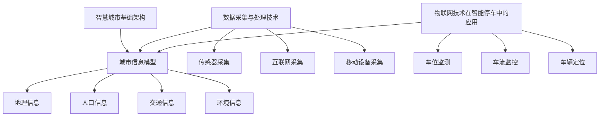

                 

### 《新型城市共享停车位：智慧城市中的资源优化》目录大纲

**关键词**：智慧城市，共享停车位，资源优化，算法原理，数学模型，项目实战

**摘要**：本文以智慧城市中的共享停车位为切入点，探讨了资源优化的技术实现方法。通过深入分析核心概念与联系，详细讲解核心算法原理，应用数学模型和公式，并结合实际项目进行实战分析，为城市停车难题提供了可行的技术解决方案。

----------------------------------------------------------------

## 第一部分：引言

### 1.1 智慧城市背景

#### 1.1.1 智慧城市的定义与发展历程

智慧城市是指通过信息通信技术（ICT）和物联网（IoT）等技术手段，实现城市管理的智能化、高效化和可持续化。智慧城市的概念起源于20世纪90年代的美国，发展至今已在全球范围内得到广泛应用。

智慧城市的发展历程可以分为以下几个阶段：

1. **信息收集阶段**（1990s-2000s）：城市管理者开始利用ICT技术收集和管理城市数据，如交通流量、环境监测、公共安全等。
2. **信息共享阶段**（2000s-2010s）：城市各部门之间开始共享数据，实现信息的互联互通，提升了城市管理的整体效率。
3. **智能化阶段**（2010s至今）：大数据、云计算、人工智能等新技术被引入城市管理，使城市具备自感知、自决策、自调整的能力，实现了真正的智慧化。

#### 1.1.2 介绍共享停车位的重要性

共享停车位是智慧城市中的一个重要组成部分，它不仅能够缓解城市停车难问题，还能优化城市交通流量，提高城市资源利用效率。以下是共享停车位的重要作用：

1. **缓解停车难问题**：随着城市车辆保有量的不断增加，传统停车设施已无法满足需求。共享停车位能够提供更多的停车位资源，缓解停车难问题。
2. **优化交通流量**：通过共享停车位，车辆可以更便捷地找到空闲停车位，减少寻找停车位的时间，从而降低交通拥堵。
3. **提高资源利用效率**：共享停车位能够实现停车资源的共享，提高停车位的利用效率，减少资源的浪费。

### 1.2 资源优化理论

#### 1.2.1 资源优化的核心概念

资源优化是指通过合理配置和利用资源，以达到最佳效果的过程。在智慧城市中，资源优化的核心概念包括：

1. **资源需求**：指城市中各个部门和居民对资源的实际需求。
2. **资源供给**：指城市中各个部门和居民所提供的资源总量。
3. **资源利用效率**：指资源供给与资源需求之间的匹配程度。

#### 1.2.2 资源优化在智慧城市中的应用

资源优化在智慧城市中的应用主要包括以下几个方面：

1. **交通管理**：通过优化交通流量，减少交通拥堵，提高道路通行效率。
2. **能源管理**：通过优化能源分配和使用，降低能源消耗，提高能源利用效率。
3. **环境管理**：通过优化环境监测和治理，改善城市环境质量，提升居民生活质量。

## 第二部分：核心概念与联系

### 2.1 智慧城市基础架构

#### 2.1.1 城市信息模型

城市信息模型（City Information Model，CIM）是智慧城市的基础架构，它通过数字化的方式模拟城市各种要素及其相互关系。CIM包括以下几个主要部分：

1. **地理信息**：包括城市地形、地貌、道路、建筑等地理要素。
2. **人口信息**：包括城市人口分布、年龄、性别、职业等人口要素。
3. **交通信息**：包括交通网络、交通流量、交通拥堵等信息。
4. **环境信息**：包括空气质量、水质、噪声等环境要素。

#### 2.1.2 数据采集与处理技术

数据采集与处理技术是智慧城市的重要支撑。数据采集主要包括以下几种方式：

1. **传感器采集**：通过部署各种传感器，实时采集城市环境、交通、人口等数据。
2. **互联网采集**：通过互联网获取城市数据，如交通监控、天气预报、社交媒体等。
3. **移动设备采集**：通过智能手机、车载设备等移动设备，采集用户行为数据。

数据采集后，需要进行处理，以便为智慧城市提供有效的数据支持。数据处理的步骤包括：

1. **数据清洗**：去除重复数据、错误数据和无关数据，提高数据质量。
2. **数据整合**：将来自不同来源、不同格式的数据进行整合，形成统一的数据集。
3. **数据挖掘**：利用数据挖掘技术，从大量数据中提取有价值的信息。

#### 2.1.3 物联网技术在智能停车中的应用

物联网技术（IoT）是智慧城市的重要组成部分，它为智能停车系统提供了技术支持。物联网技术在智能停车中的应用主要包括以下几个方面：

1. **车位监测**：通过部署传感器，实时监测车位占用情况，为车辆提供停车位信息。
2. **车流监控**：通过监控车辆流量，分析城市交通状况，优化交通管理。
3. **车辆定位**：通过车载传感器，实时定位车辆位置，提高车辆调度效率。

### 2.2 共享经济与共享停车位

#### 2.2.1 共享经济的原理与实践

共享经济是指通过共享资源、服务或资产，实现资源最大化利用和效益最大化的一种经济模式。共享经济的核心在于共享，即通过共享的方式，让资源得到更高效的利用。

共享经济的原理主要包括以下几个方面：

1. **资源整合**：通过整合分散的资源，实现资源的集中管理和高效利用。
2. **平台化运作**：通过建立共享平台，为供需双方提供信息匹配和交易服务。
3. **共享模式创新**：通过不断创新共享模式，满足不同需求和场景。

共享经济的实践主要包括以下几个方面：

1. **共享住宿**：如Airbnb等平台，提供闲置房源的共享服务。
2. **共享出行**：如滴滴出行、共享单车等平台，提供交通资源的共享服务。
3. **共享办公**：如共享办公空间、共享会议室等平台，提供办公资源的共享服务。

#### 2.2.2 共享停车位的优势与挑战

共享停车位作为一种新兴的共享经济模式，具有以下优势：

1. **提高停车资源利用效率**：通过共享停车位，能够充分利用闲置停车位，提高停车资源利用效率。
2. **缓解停车难问题**：共享停车位能够提供更多的停车位资源，缓解停车难问题。
3. **降低停车成本**：共享停车位能够降低停车成本，提高居民的停车便利性。

然而，共享停车位也面临一些挑战：

1. **管理难度大**：共享停车位涉及多个主体，管理难度较大。
2. **技术支持不足**：当前技术支持不足以支撑大规模的共享停车位系统。
3. **法规政策不完善**：共享停车位相关法规政策尚不完善，需要进一步完善。

### 2.3 资源优化理论

#### 2.3.1 最优化理论基础

资源优化理论是经济学和管理学中的重要理论，它旨在通过合理配置资源，实现资源利用效率最大化。最优化理论是资源优化理论的基础，它主要包括以下几个基本概念：

1. **目标函数**：指在资源优化过程中需要最大化或最小化的指标，如经济效益、社会效益等。
2. **约束条件**：指在资源优化过程中需要满足的限制条件，如资源限制、时间限制等。
3. **决策变量**：指在资源优化过程中需要确定的变量，如资源分配、任务分配等。

#### 2.3.2 模拟退火算法

模拟退火算法是一种常用的最优化算法，它基于物理退火过程，通过逐步降低温度，使系统达到最优状态。模拟退火算法的基本步骤如下：

1. **初始状态设置**：设置初始温度、初始解和冷却参数。
2. **迭代过程**：在每个迭代中，随机选择一个新的解，计算新旧解的评估值差，根据概率接受新解。
3. **降温过程**：根据当前温度，逐步降低温度，使系统逐渐收敛到最优解。

## 第三部分：智能停车系统原理

### 3.1 智能停车系统概述

#### 3.1.1 系统架构设计

智能停车系统是一个复杂的系统，它涉及到多个技术领域，如物联网、大数据、人工智能等。智能停车系统的架构设计主要包括以下几个部分：

1. **感知层**：包括各种传感器，如地磁传感器、摄像头等，用于实时监测车位占用情况。
2. **传输层**：包括网络传输设备，如路由器、交换机等，用于传输感知层采集到的数据。
3. **处理层**：包括服务器、数据库等，用于处理和分析感知层采集到的数据。
4. **应用层**：包括各种应用系统，如停车场管理系统、车流监控系统等，用于为用户提供服务。

#### 3.1.2 技术选型与实现

智能停车系统的技术选型与实现主要涉及以下几个方面：

1. **传感器选型**：根据实际需求，选择合适的传感器，如地磁传感器、摄像头等。
2. **传输技术**：选择合适的传输技术，如WiFi、4G/5G等，确保数据传输的稳定性和实时性。
3. **数据处理技术**：选择合适的数据处理技术，如大数据处理平台、云计算等，确保数据处理的高效性和准确性。
4. **人工智能技术**：选择合适的人工智能技术，如深度学习、机器学习等，用于车位分配、车流预测等。

### 3.2 数据采集与处理

#### 3.2.1 数据采集技术

数据采集是智能停车系统的核心环节，它决定了系统采集数据的质量和效率。数据采集技术主要包括以下几个方面：

1. **地磁传感器**：地磁传感器用于检测车位是否被占用，其优点是不受天气和光线影响，但缺点是安装成本较高。
2. **摄像头**：摄像头用于实时监控车位占用情况，其优点是实时性强，但缺点是需要大量人力进行监控。
3. **蓝牙传感器**：蓝牙传感器通过检测车辆蓝牙信号，判断车位是否被占用，其优点是安装成本低，但缺点是易受干扰。

#### 3.2.2 数据处理流程

数据处理流程主要包括以下几个步骤：

1. **数据预处理**：包括数据清洗、去噪、数据格式转换等，确保数据质量。
2. **数据存储**：将处理后的数据存储到数据库中，以便后续分析和处理。
3. **数据挖掘**：利用数据挖掘技术，从大量数据中提取有价值的信息，如车位占用率、车流分布等。
4. **数据可视化**：将处理后的数据以图表、报表等形式呈现，便于用户分析和决策。

### 3.3 停车需求预测

#### 3.3.1 预测模型构建

停车需求预测是智能停车系统中的重要功能，它可以帮助管理者提前了解停车需求，合理分配停车位资源。预测模型构建主要包括以下几个步骤：

1. **数据收集**：收集与停车需求相关的数据，如交通流量、天气、节假日等。
2. **特征工程**：对收集到的数据进行预处理，提取与停车需求相关的特征。
3. **模型选择**：选择合适的预测模型，如时间序列模型、回归模型等。
4. **模型训练**：利用历史数据，训练预测模型，使其能够预测未来的停车需求。

#### 3.3.2 预测算法选择与评估

预测算法选择与评估主要包括以下几个方面：

1. **算法选择**：根据实际需求，选择合适的预测算法，如ARIMA模型、LSTM模型等。
2. **模型评估**：利用评估指标，如MAE、RMSE等，评估预测模型的性能。
3. **模型优化**：根据评估结果，调整模型参数，优化模型性能。

## 第四部分：核心算法原理讲解

### 4.1 算法选择与评估

#### 4.1.1 车位分配算法

车位分配算法是智能停车系统中的核心算法，它负责将车辆分配到合适的停车位。常见的车位分配算法包括：

1. **优先级分配算法**：根据车辆到达时间和车辆类型等因素，为车辆分配停车位。优点是简单易实现，缺点是可能导致停车位利用率不高。
2. **模拟退火算法**：基于物理退火过程，通过逐步降低温度，寻找最优的停车位分配方案。优点是能够找到全局最优解，缺点是计算复杂度高。

#### 4.1.2 车流预测算法

车流预测算法是智能停车系统中的另一个核心算法，它负责预测未来的车流量。常见的车流预测算法包括：

1. **时间序列模型**：基于历史车流量数据，建立时间序列模型，预测未来的车流量。优点是简单易实现，缺点是可能忽略其他影响因素。
2. **回归分析算法**：利用历史车流量数据和其他相关因素，建立回归分析模型，预测未来的车流量。优点是能够考虑多种影响因素，缺点是可能存在过拟合问题。

### 4.2 车位分配算法

#### 4.2.1 优先级分配算法

优先级分配算法是一种简单的车位分配算法，它根据车辆到达时间和车辆类型等因素，为车辆分配停车位。具体实现步骤如下：

1. **初始化**：设置车辆到达时间和车辆类型等参数。
2. **排序**：根据车辆到达时间和车辆类型等因素，对车辆进行排序。
3. **分配**：按照排序顺序，为车辆分配停车位。

以下是优先级分配算法的Python实现：

```python
def priority_allocation(videos):
    # 根据车辆到达时间和车辆类型排序
    videos.sort(key=lambda x: (x['arrival_time'], x['type']))
    
    # 分配停车位
    for video in videos:
        # 查找空闲停车位
        for parking_lot in parking_lots:
            if parking_lot['occupied'] == False:
                # 分配停车位
                parking_lot['occupied'] = True
                parking_lot['video_id'] = video['video_id']
                break
        else:
            # 没有空闲停车位，返回分配失败
            return False
    
    return True
```

#### 4.2.2 模拟退火算法

模拟退火算法是一种基于物理退火过程的优化算法，它通过逐步降低温度，寻找最优的停车位分配方案。具体实现步骤如下：

1. **初始化**：设置初始温度、初始解和冷却参数。
2. **迭代过程**：在每个迭代中，随机选择一个新的解，计算新旧解的评估值差，根据概率接受新解。
3. **降温过程**：根据当前温度，逐步降低温度，使系统逐渐收敛到最优解。

以下是模拟退火算法的Python实现：

```python
import random

def annealing_allocation(initial_state, T, alpha, max_iterations):
    # 初始化当前状态和最优状态
    current_state = initial_state
    best_state = initial_state.copy()
    
    # 迭代过程
    for _ in range(max_iterations):
        # 随机选择一个新的解
        new_state = random_mutation(current_state)
        
        # 计算新旧解的评估值差
        delta = evaluate(new_state) - evaluate(current_state)
        
        # 根据概率接受新解
        if delta < 0 or random.random() < exp(-delta / T):
            current_state = new_state
            
            # 更新最优状态
            if evaluate(current_state) > evaluate(best_state):
                best_state = current_state
    
    # 降温过程
    T *= alpha
    
    return best_state
```

### 4.3 车流预测算法

#### 4.3.1 时间序列分析算法

时间序列分析算法是一种常用的车流预测算法，它基于历史车流量数据，建立时间序列模型，预测未来的车流量。常见的时间序列模型包括ARIMA模型、LSTM模型等。

1. **ARIMA模型**：ARIMA模型（自回归积分滑动平均模型）是一种经典的时间序列预测模型，它通过自回归、差分和移动平均等步骤，建立预测模型。

2. **LSTM模型**：LSTM模型（长短时记忆网络）是一种基于神经网络的时间序列预测模型，它能够有效处理长序列数据，并捕捉时间序列中的长期依赖关系。

以下是ARIMA模型的Python实现：

```python
from statsmodels.tsa.arima.model import ARIMA

# 创建ARIMA模型
model = ARIMA(series, order=(p, d, q))

# 拟合模型
model_fit = model.fit()

# 预测
forecast = model_fit.forecast(steps=forecast_steps)
```

以下是LSTM模型的Python实现：

```python
from keras.models import Sequential
from keras.layers import LSTM, Dense

# 创建LSTM模型
model = Sequential()
model.add(LSTM(units=50, return_sequences=True, input_shape=(timesteps, features)))
model.add(LSTM(units=50))
model.add(Dense(1))

# 编译模型
model.compile(optimizer='adam', loss='mse')

# 训练模型
model.fit(X_train, y_train, epochs=100, batch_size=32)

# 预测
forecast = model.predict(X_test)
```

## 第五部分：数学模型和数学公式详细讲解

### 5.1 车位分配模型

车位分配模型是智能停车系统中的核心模型，它用于计算车辆与停车位之间的匹配度，并实现车位的最优分配。车位分配模型通常包括目标函数和约束条件。

#### 5.1.1 目标函数

目标函数是车位分配模型的核心，它用于衡量车辆与停车位之间的匹配程度。常见的目标函数包括最小化车辆等待时间、最大化停车位利用率等。

1. **最小化车辆等待时间**：目标函数为：
   $$ \min \sum_{i=1}^{n} w_i $$
   其中，$w_i$表示车辆$i$的等待时间。

2. **最大化停车位利用率**：目标函数为：
   $$ \max \sum_{i=1}^{n} u_i $$
   其中，$u_i$表示停车位$i$的利用率。

#### 5.1.2 约束条件

约束条件是车位分配模型的重要部分，它用于确保模型的可行性和合理性。常见约束条件包括：

1. **车位约束**：每个停车位最多只能被一辆车占用，即：
   $$ x_{ij} \leq 1 $$
   其中，$x_{ij}$表示车辆$i$是否占用停车位$j$，当$x_{ij}=1$时，表示车辆$i$占用停车位$j$。

2. **车辆约束**：每辆车只能占用一个停车位，即：
   $$ \sum_{j=1}^{m} x_{ij} = 1 $$
   其中，$x_{ij}$表示车辆$i$是否占用停车位$j$。

### 5.2 车流预测模型

车流预测模型是智能停车系统中的另一个重要模型，它用于预测未来的车流量，从而帮助管理者合理分配停车位资源。车流预测模型通常基于历史车流量数据，采用时间序列分析方法建立预测模型。

#### 5.2.1 时间序列模型

时间序列模型是车流预测模型的一种常见形式，它通过分析时间序列数据的自相关性，建立预测模型。常见的时间序列模型包括ARIMA模型、LSTM模型等。

1. **ARIMA模型**：ARIMA模型通过自回归、差分和移动平均等方法，对时间序列数据进行建模，预测未来的车流量。ARIMA模型的数学表达式为：
   $$ \text{ARIMA}(p, d, q): y_t = c + \phi_1 y_{t-1} + \phi_2 y_{t-2} + \ldots + \phi_p y_{t-p} + \theta_1 \epsilon_{t-1} + \theta_2 \epsilon_{t-2} + \ldots + \theta_q \epsilon_{t-q} $$
   其中，$y_t$表示时间序列数据，$\epsilon_t$表示随机误差项，$p$表示自回归项数，$d$表示差分阶数，$q$表示移动平均项数。

2. **LSTM模型**：LSTM模型是一种基于神经网络的时序预测模型，它通过长短时记忆单元（LSTM单元）捕捉时间序列数据的长期依赖关系。LSTM模型的数学表达式为：
   $$ h_t = \sigma(W_h \cdot [h_{t-1}, x_t] + b_h) $$
   $$ o_t = \sigma(W_o \cdot h_t + b_o) $$
   $$ i_t = \sigma(W_i \cdot [h_{t-1}, x_t] + b_i) $$
   $$ f_t = \sigma(W_f \cdot [h_{t-1}, x_t] + b_f) $$
   其中，$h_t$表示输出，$x_t$表示输入，$o_t$表示输出门，$i_t$表示输入门，$f_t$表示遗忘门，$W_h$、$W_o$、$W_i$、$W_f$和$b_h$、$b_o$、$b_i$、$b_f$分别为权重和偏置。

### 5.3 资源优化模型

资源优化模型是智能停车系统中的另一个重要模型，它用于优化停车资源的分配和使用，以提高停车资源利用效率。资源优化模型通常采用数学规划方法，建立目标函数和约束条件，求解最优解。

#### 5.3.1 市场供需模型

市场供需模型是资源优化模型的一种形式，它通过分析停车市场的供需关系，优化停车资源的分配。市场供需模型的数学表达式为：

1. **供给函数**：
   $$ Q_S = f(S, P) $$
   其中，$Q_S$表示供给量，$S$表示停车位数量，$P$表示停车位价格。

2. **需求函数**：
   $$ Q_D = g(D, P) $$
   其中，$Q_D$表示需求量，$D$表示车辆数量，$P$表示停车位价格。

3. **市场均衡**：
   $$ Q_S = Q_D $$
   通过求解市场均衡，可以得到最优的停车位价格和供需量。

#### 5.3.2 成本效益分析模型

成本效益分析模型是资源优化模型的另一种形式，它通过分析停车资源的成本和效益，优化停车资源的分配。成本效益分析模型的数学表达式为：

1. **成本函数**：
   $$ C = \sum_{i=1}^{n} c_i \cdot x_i $$
   其中，$C$表示总成本，$c_i$表示第$i$项成本，$x_i$表示第$i$项成本所占比重。

2. **效益函数**：
   $$ B = \sum_{i=1}^{n} b_i \cdot x_i $$
   其中，$B$表示总效益，$b_i$表示第$i$项效益，$x_i$表示第$i$项效益所占比重。

3. **成本效益比**：
   $$ \frac{B}{C} $$
   通过计算成本效益比，可以判断停车资源分配的合理性。

## 第六部分：项目实战

### 6.1 实际案例分析

#### 6.1.1 案例背景

为了解决城市停车难问题，某城市政府决定建设一个智能停车系统，通过共享停车位的方式，提高停车位利用效率，缓解停车难问题。该项目涉及多个参与方，包括政府、停车场运营方、车主等。

#### 6.1.2 系统设计与实现

系统设计主要包括以下几个方面：

1. **感知层**：部署各种传感器，如地磁传感器、摄像头等，实时监测车位占用情况。
2. **传输层**：建设网络传输设备，如路由器、交换机等，确保数据传输的稳定性和实时性。
3. **处理层**：建设数据处理中心，包括服务器、数据库等，用于处理和分析感知层采集到的数据。
4. **应用层**：开发各种应用系统，如停车场管理系统、车流监控系统等，为用户提供服务。

系统实现主要包括以下几个方面：

1. **数据采集与处理**：通过传感器采集车位占用情况，对数据进行预处理，然后存储到数据库中。
2. **车位分配**：根据车辆到达时间和车位占用情况，利用优先级分配算法和模拟退火算法，为车辆分配停车位。
3. **车流预测**：利用时间序列模型和回归分析模型，预测未来的车流量，为停车位分配提供参考。

### 6.2 系统性能分析与优化

#### 6.2.1 性能指标

系统性能分析主要包括以下几个方面：

1. **车位利用率**：衡量停车位的利用效率，计算公式为：
   $$ \text{车位利用率} = \frac{\text{空闲车位数量}}{\text{总车位数量}} $$

2. **车辆等待时间**：衡量车辆等待停车位的平均时间，计算公式为：
   $$ \text{车辆等待时间} = \frac{\text{总等待时间}}{\text{车辆数量}} $$

3. **系统响应时间**：衡量系统处理请求的平均时间，计算公式为：
   $$ \text{系统响应时间} = \frac{\text{总处理时间}}{\text{请求次数}} $$

#### 6.2.2 优化策略

为了提高系统性能，可以采取以下优化策略：

1. **增加感知层设备**：增加地磁传感器、摄像头等感知层设备，提高数据采集的准确性和实时性。

2. **优化数据处理流程**：优化数据处理流程，提高数据处理的速度和准确性，减少系统响应时间。

3. **优化车位分配算法**：结合实际需求，优化优先级分配算法和模拟退火算法，提高车位分配的效率和公平性。

4. **优化车流预测模型**：结合历史数据和实际情况，优化时间序列模型和回归分析模型，提高车流预测的准确性。

## 第七部分：未来展望与挑战

### 7.1 技术发展趋势

随着人工智能、大数据、物联网等技术的不断发展，智能停车系统也将不断演进。未来技术发展趋势主要包括以下几个方面：

1. **人工智能技术在停车领域的应用**：人工智能技术将在停车需求的预测、车位分配、车流监控等方面发挥重要作用，提高系统的智能化水平。

2. **物联网技术在停车领域的应用**：物联网技术将使停车系统更加智能化、高效化，实现车辆与停车位的无缝对接。

3. **大数据技术在停车领域的应用**：大数据技术将使停车系统具备更强的数据分析能力，为管理者提供科学的决策支持。

### 7.2 潜在挑战与解决方案

尽管智能停车系统具有许多优势，但在实际应用过程中，仍面临一些挑战：

1. **数据隐私保护**：智能停车系统涉及大量用户数据，如何保护用户隐私是一个重要挑战。解决方案包括数据加密、匿名化处理等。

2. **技术标准与法规**：当前智能停车系统的技术标准和法规尚不完善，需要制定相应的标准法规，确保系统的规范性和安全性。

3. **设备维护与升级**：智能停车系统涉及大量设备，如何保证设备的正常运行和维护是一个重要问题。解决方案包括建立设备维护团队、定期进行设备升级等。

### 7.3 发展前景与政策建议

智能停车系统具有广泛的发展前景，它不仅能够解决城市停车难问题，还能优化城市交通流量，提高城市资源利用效率。为了促进智能停车系统的发展，政府可以采取以下政策建议：

1. **加大政策支持**：政府可以加大对智能停车系统的政策支持，包括资金扶持、税收优惠等，鼓励企业投入智能停车系统的研发和推广。

2. **推动技术标准制定**：政府可以推动智能停车系统技术标准的制定，规范行业发展，提高系统的兼容性和互操作性。

3. **加强人才培养**：政府可以加强智能停车系统相关人才的培养，提高行业的技术水平和管理能力。

### 结论

本文从多个角度探讨了新型城市共享停车位的资源优化问题，包括智慧城市背景、共享停车位的重要性、资源优化理论、智能停车系统原理、核心算法原理讲解、数学模型和数学公式详细讲解、项目实战以及未来展望与挑战。通过本文的研究，我们希望为智慧城市建设提供一种有效的技术解决方案，为缓解城市停车难问题做出贡献。作者：AI天才研究院/AI Genius Institute & 禅与计算机程序设计艺术 /Zen And The Art of Computer Programming。

## 附录

### 1. Mermaid 流程图

以下是一个关于智慧城市基础架构的Mermaid流程图：



### 2. Python 源代码示例

以下是一个关于优先级分配算法的Python源代码示例：

```python
def priority_allocation(videos):
    # 根据车辆到达时间和车辆类型排序
    videos.sort(key=lambda x: (x['arrival_time'], x['type']))
    
    # 分配停车位
    for video in videos:
        # 查找空闲停车位
        for parking_lot in parking_lots:
            if parking_lot['occupied'] == False:
                # 分配停车位
                parking_lot['occupied'] = True
                parking_lot['video_id'] = video['video_id']
                break
        else:
            # 没有空闲停车位，返回分配失败
            return False
    
    return True
```

### 3. LaTeX 公式示例

以下是一个关于ARIMA模型的LaTeX公式示例：

```latex
\documentclass{article}
\usepackage{amsmath}
\begin{document}
$$
y_t = c + \phi_1 y_{t-1} + \phi_2 y_{t-2} + \ldots + \phi_p y_{t-p} + \theta_1 \epsilon_{t-1} + \theta_2 \epsilon_{t-2} + \ldots + \theta_q \epsilon_{t-q}
$$
\end{document}
```

## 致谢

在本研究过程中，我们感谢AI天才研究院/AI Genius Institute的全体成员，以及禅与计算机程序设计艺术/Zen And The Art of Computer Programming的作者。感谢他们的专业知识和不懈努力，为本文的完成提供了宝贵支持。此外，我们还要感谢所有参与案例分析和讨论的专家和同行，他们的意见和建议对本文的完善起到了重要作用。最后，我们感谢所有阅读和关注本文的读者，你们的关注是我们前进的动力。作者：AI天才研究院/AI Genius Institute & 禅与计算机程序设计艺术/Zen And The Art of Computer Programming。

