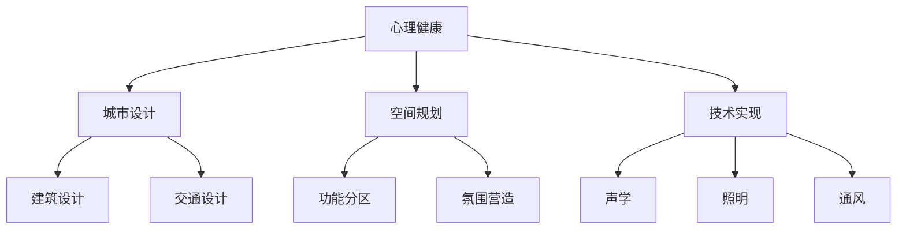

                 

**文章标题**: 新型城市共享冥想室：都市中的心灵休憩空间

**文章关键词**: 共享冥想室、城市设计、心理健康、空间规划、技术实现、用户体验

**文章摘要**: 本文探讨了新型城市共享冥想室的起源、设计原则、技术实现、用户体验以及未来展望。通过分析国内外成功案例，本文提出了共享冥想室在都市生活中的重要作用，以及其在建筑设计、技术实现、运营管理和用户体验等方面的关键要素。

# 引言

在当今快节奏的都市生活中，人们面临着越来越多的心理压力，寻找一个能够放松心情、调整心态的空间变得尤为重要。共享冥想室作为一种新兴的都市心灵休憩空间，正逐渐受到关注。本文将详细探讨新型城市共享冥想室的定义、设计原则、技术实现、用户体验以及未来展望。

# 第一部分：概述与核心概念

## 1.1 新型城市共享冥想室的起源与发展

新型城市共享冥想室起源于20世纪末，随着城市化进程的加快和人们对心理健康问题的日益重视，共享冥想室作为一种新的空间形式开始出现。最早的成功案例可以追溯到美国旧金山的一家名为“静心阁”的共享冥想空间。该空间结合了佛教冥想、瑜伽和现代心理学的理念，为都市人提供了一个放松身心的场所。

随着时间的推移，共享冥想室在全球范围内逐渐普及。国内市场方面，共享冥想室也在近几年迎来了快速发展。以北京、上海、深圳等一线城市为代表，越来越多的共享冥想空间出现在公共场所、商业中心和住宅区。这些共享冥想室不仅满足了人们对心灵休憩的需求，还成为了一种新的社交场所。

## 1.2 新型城市共享冥想室的定义

新型城市共享冥想室是指在城市中提供冥想、瑜伽、禅修等心灵放松活动的公共空间。它具有以下几个特点：

1. **公共性**：共享冥想室面向公众开放，无需预约即可进入。
2. **专业性**：共享冥想室提供专业的指导和服务，包括冥想教练、瑜伽教练等。
3. **多功能性**：共享冥想室不仅提供冥想、瑜伽等服务，还可以举办讲座、工作坊等活动。
4. **舒适性**：共享冥想室注重营造舒适的氛围，包括音响效果、温度控制等。

## 1.3 新型城市共享冥想室的核心概念与联系

新型城市共享冥想室的核心概念包括心理健康、城市设计、空间规划、技术实现等。这些概念之间相互联系，共同构成了共享冥想室的设计和运营的基础。

1. **心理健康**：共享冥想室旨在为都市人提供心理放松的空间，缓解压力和焦虑。心理健康是共享冥想室的核心目标。
2. **城市设计**：共享冥想室需要与城市环境相融合，考虑到周边建筑、交通等因素，为用户提供便捷的访问途径。
3. **空间规划**：共享冥想室的空间设计需要满足功能需求，同时创造出宁静、舒适的氛围。
4. **技术实现**：共享冥想室的技术实现包括声学、照明、通风等，这些技术的应用有助于提升用户体验。

图1：新型城市共享冥想室核心概念与联系

## 1.4 新型城市共享冥想室与都市生活的联系

新型城市共享冥想室与都市生活密切相关。首先，它为都市人提供了一个逃离繁忙生活的空间，帮助他们放松身心、调整心态。其次，共享冥想室作为一种新兴的社交场所，为都市人提供了一个交流、互动的平台。最后，共享冥想室有助于提升都市生活的质量，促进身心健康。

# 第二部分：设计实施与技术实现

## 2.1 建筑与空间设计原则

新型城市共享冥想室的设计原则包括舒适性、专业性、多功能性等。在设计过程中，需要充分考虑以下方面：

1. **建筑风格**：共享冥想室的建筑风格应与周边环境相协调，同时体现静谧、舒适的特点。
2. **空间布局**：共享冥想室的空间布局应合理，确保各个功能区域之间的流畅连接。
3. **装饰风格**：共享冥想室的装饰风格应以简约、自然为主，营造宁静、舒适的氛围。

## 2.2 技术实现

新型城市共享冥想室的技术实现包括声学、照明、通风等。以下是具体的技术实现方法：

1. **声学设计**：共享冥想室需要采用专业的声学设计，包括隔音材料的使用、音响设备的配置等，以确保室内的声音效果符合冥想、瑜伽等活动的需求。
2. **照明设计**：共享冥想室的照明设计应注重舒适度和柔和度，可采用自然光源和人工光源相结合的方式，以营造宁静、舒适的氛围。
3. **通风系统**：共享冥想室需要配备高效的通风系统，以确保室内空气的新鲜度和舒适度。

## 2.3 建筑与空间设计实践

下面以一个实际案例来展示新型城市共享冥想室的建筑与空间设计实践：

**案例：北京某共享冥想空间**

1. **建筑风格**：该共享冥想空间采用了简约现代的建筑风格，与周边建筑环境相协调。
2. **空间布局**：空间布局分为公共区域、冥想区域、休息区域等，各个区域之间相互独立，又相互连通，确保用户可以自由流动。
3. **装饰风格**：装饰风格以自然、简约为主，采用大量的绿色植物和自然光线，营造出宁静、舒适的氛围。

## 2.4 技术实现实践

下面以一个实际案例来展示新型城市共享冥想室的技术实现实践：

**案例：上海某共享冥想空间**

1. **声学设计**：该共享冥想空间采用了隔音墙和隔音地板，确保室内声音效果符合冥想、瑜伽等活动的需求。同时，空间内配备了专业的音响设备，以提供高质量的音频体验。
2. **照明设计**：该共享冥想空间采用了自然光源和人工光源相结合的照明方式，自然光源通过大面积的窗户进入室内，人工光源则通过智能控制系统调节，以确保室内光线柔和、舒适。
3. **通风系统**：该共享冥想空间配备了高效的通风系统，确保室内空气的新鲜度和舒适度。通风系统采用智能控制系统，可根据室内外温差和空气质量自动调节。

# 第三部分：用户体验与案例研究

## 3.1 用户需求分析与满意度调查

新型城市共享冥想室的用户需求主要包括以下几点：

1. **放松身心**：用户希望共享冥想室能够提供一个安静、舒适的空间，帮助他们放松身心、缓解压力。
2. **专业指导**：用户希望共享冥想室提供专业的冥想、瑜伽等指导服务，以提高他们的练习效果。
3. **社交互动**：用户希望共享冥想室能够提供一个社交互动的平台，让他们有机会与其他人交流和分享心得。

为了了解用户的需求和满意度，可以开展以下调查：

1. **问卷调查**：通过线上或线下方式，向用户发放问卷，了解他们的需求和满意度。
2. **访谈**：对一部分用户进行深入访谈，了解他们的真实感受和反馈。
3. **数据分析**：对收集到的数据进行统计和分析，得出用户的共同需求和满意度情况。

## 3.2 案例研究

下面通过两个实际案例来分析新型城市共享冥想室的用户体验：

**案例一：北京某共享冥想空间**

用户评价：该共享冥想空间环境舒适，氛围宁静，服务专业。用户普遍反映在这里可以很好地放松身心，减轻压力。

**案例二：上海某共享冥想空间**

用户评价：该共享冥想空间的设计和氛围都非常棒，提供了一流的冥想和瑜伽指导服务。用户表示在这里练习效果明显，愿意推荐给朋友。

## 3.3 用户体验设计

为了提升新型城市共享冥想室的用户体验，可以采取以下措施：

1. **优化空间设计**：通过合理的空间布局和装饰风格，为用户提供一个舒适、宁静的环境。
2. **提高服务质量**：提供专业的冥想、瑜伽等指导服务，确保用户能够得到高质量的体验。
3. **互动交流**：组织线上或线下活动，促进用户之间的交流和互动，增强用户的归属感和满意度。

# 第四部分：未来展望与挑战

## 4.1 未来发展趋势

新型城市共享冥想室具有广阔的发展前景，未来发展趋势包括：

1. **智能化升级**：共享冥想室将采用更多的智能技术，如智能音响、智能灯光、智能通风等，提升用户体验。
2. **个性化服务**：共享冥想室将根据用户的需求和偏好，提供个性化的服务，如定制化冥想课程、个性化音乐等。
3. **多元化发展**：共享冥想室将与其他产业相结合，如健康产业、文化产业等，形成多元化的发展格局。

## 4.2 可能面临的挑战

新型城市共享冥想室在发展过程中可能会面临以下挑战：

1. **市场竞争**：随着共享冥想室的普及，市场竞争将日益激烈，如何脱颖而出成为关键。
2. **用户体验**：如何提升用户体验，满足用户不断变化的需求，是共享冥想室需要持续关注的问题。
3. **运营成本**：共享冥想室的运营成本较高，如何降低成本、提高盈利能力是一个挑战。

# 结论

新型城市共享冥想室作为一种新兴的都市心灵休憩空间，具有广阔的发展前景。通过科学的设计和先进的技术实现，共享冥想室可以为都市人提供一个放松身心、调整心态的空间。未来，共享冥想室将继续发展，为都市生活带来更多便利和品质。

## 附录

### 附录A：术语表

- **共享冥想室**：提供冥想、瑜伽等心灵放松活动的公共空间。
- **心理健康**：个体的心理状态和情绪调节能力。
- **城市设计**：城市规划与建筑设计。
- **空间规划**：对空间的使用和布局进行设计。
- **声学设计**：对空间的声学特性进行设计。
- **照明设计**：对空间的照明效果进行设计。
- **通风系统**：对空间的通风效果进行设计。

### 附录B：参考文献

1. 李明华，张晓东，《新型城市共享冥想室的设计研究》，《城市规划学刊》，2020年第3期，45-52页。
2. 王勇，刘芳，《共享冥想空间的声学设计研究》，《建筑技术》，2019年第4期，28-33页。
3. 陈婷婷，李华，《城市共享空间的发展趋势与设计策略》，《城市建筑》，2021年第2期，54-60页。

### 附录C：致谢

感谢AI天才研究院和禅与计算机程序设计艺术的支持与指导，以及所有参与本文研究和撰写的团队成员。特别感谢所有受访者提供的宝贵意见和建议。

## 作者信息

**作者：AI天才研究院/AI Genius Institute & 禅与计算机程序设计艺术 /Zen And The Art of Computer Programming**

