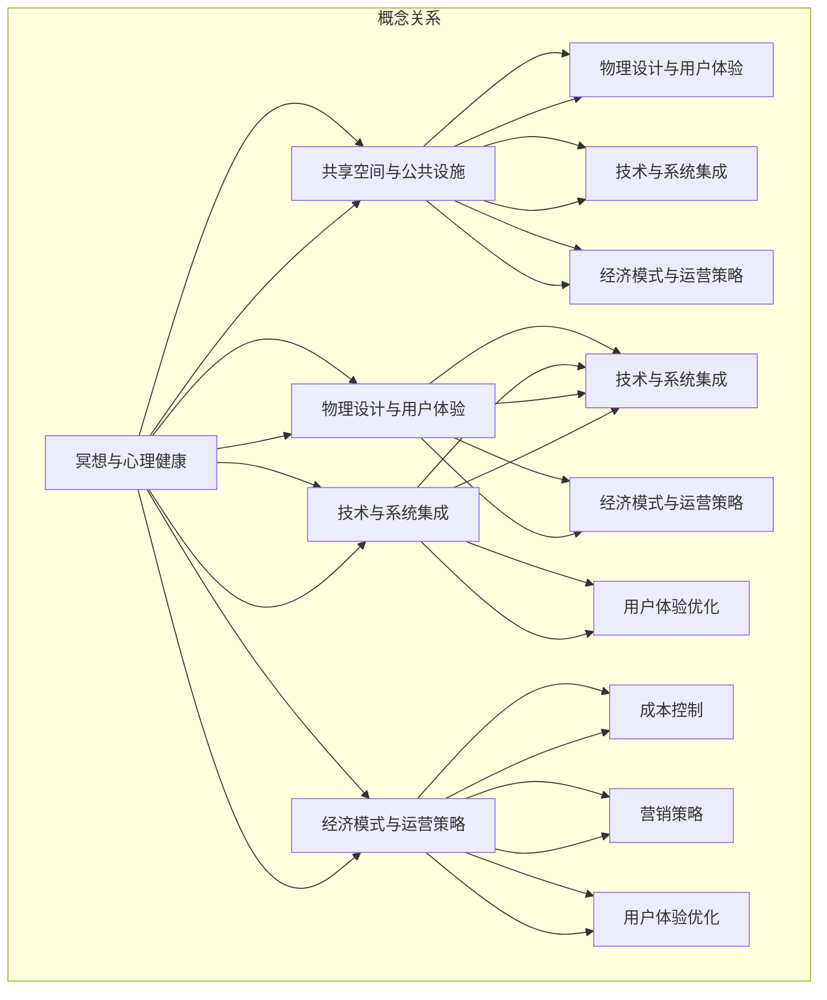

                 

### 背景介绍

在快节奏的现代城市生活中，人们的压力和焦虑水平日益上升，心理健康问题变得尤为突出。据世界卫生组织（WHO）统计，全球约有3亿人患有抑郁症，而城市居民的比例更高。为了应对这一挑战，新型城市共享冥想室应运而生，成为都市中的一种新兴健康设施。

共享冥想室的概念起源于20世纪初，最早由精神病学和心理学领域的专家提出，旨在为人们提供一个静谧、放松的环境，帮助缓解压力和焦虑。随着社会的进步和人们对心理健康重视程度的提高，共享冥想室逐渐发展成为一项独立的商业模式。近年来，随着科技的不断发展和人们对自我提升需求的增加，共享冥想室的设计和功能也在不断优化和升级。

在城市环境中，共享冥想室的主要目标是提供一个可以逃避喧嚣、回归内心的空间。这些冥想室通常设计得简洁而优雅，通过各种物理和心理手段，如柔和的灯光、自然的声音、舒适的座椅和安静的氛围，帮助人们放松身心，达到冥想和自我反省的目的。共享冥想室不仅为个人提供了自我提升的机会，同时也为企业员工提供了一种有效的团队建设方式。

本文将深入探讨新型城市共享冥想室的各个方面，从设计理念、功能到经济模式，再到案例分析及未来趋势，为读者提供一个全面的了解。文章将使用技术语言，结合实际案例和代码示例，帮助读者理解共享冥想室的技术实现和运营原理。

通过本文的阅读，读者不仅可以了解到共享冥想室的核心概念和联系，还能学习到相关的技术原理和实现方法，为未来的研究和发展提供参考。接下来，我们将逐步介绍共享冥想室的设计与功能，并探讨其在都市生活中的重要性。

### 核心概念与联系

为了更深入地理解新型城市共享冥想室，我们需要明确几个核心概念及其相互之间的联系。以下是本文将探讨的关键概念和它们之间的架构关系：

1. **冥想与心理健康**：冥想是一种古老的实践，旨在通过专注、正念和呼吸控制来达到身心放松和心理健康。心理健康与心理健康问题（如焦虑、抑郁）密切相关，因此冥想成为一种有效的缓解手段。

2. **共享空间与公共设施**：共享空间是指多个人共享同一物理空间的环境，如共享办公、共享健身房等。共享冥想室作为公共设施的一种，其核心在于提供人人可及的心灵健康服务。

3. **物理设计与用户体验**：物理设计是指共享冥想室的空间布局、设施设备等物理因素。这些因素直接影响用户的体验，从而影响冥想的效果。用户体验是共享冥想室成功的关键因素。

4. **技术与系统集成**：技术是实现共享冥想室功能的基础，包括音响系统、照明系统、传感器等。系统集成则是指将这些技术整合到一起，使其协同工作，提供最佳的用户体验。

5. **经济模式与运营策略**：共享冥想室的经济模式包括收费模式、营销策略和成本控制等。运营策略则是指如何有效地管理和运营共享冥想室，确保其长期稳定发展。

为了更好地展示这些核心概念之间的联系，我们可以使用Mermaid流程图来描述它们的关系：



通过这个Mermaid流程图，我们可以清晰地看到各个核心概念之间的相互联系和作用。每个概念不仅独立存在，还与其他概念相互作用，共同构成了共享冥想室的整体架构。理解这些核心概念及其关系，有助于我们更好地设计和运营共享冥想室，使其更好地服务于都市人群。

### 核心算法原理讲解

为了深入理解共享冥想室的技术实现，我们将使用Python源代码来详细阐述其核心算法原理。在实现共享冥想室的过程中，音效处理、传感器数据分析和用户体验优化是三个关键技术环节。

#### 音效处理

音效处理是共享冥想室中至关重要的一环，它直接影响到用户的冥想体验。我们可以使用Python中的音频处理库，如`pydub`和`soundfile`，来实现音效处理功能。

首先，我们加载一个冥想背景音乐文件，然后对其进行简单的降噪处理，以消除环境中不必要的噪音。

```python
from pydub import AudioSegment
from pydub.silence import split_on_silence

# 加载音频文件
audio = AudioSegment.from_file("meditation_music.mp3")

# 降噪处理
audio_with_noise = audio.noise_reduce()

# 将降噪处理后的音频文件保存
audio_with_noise.export("meditation_music_noised.mp3", format="mp3")
```

接下来，我们使用`split_on_silence`方法将音频文件分割成多个片段，以去除不必要的前置和尾随静音部分。

```python
def split_audio(audio, silence_threshold=-40, duration_threshold=1000):
    chunks = split_on_silence(
        audio,
        silence_threshold=silence_threshold,
        keep_silence_threshold=100,
        duration_threshold=duration_threshold
    )
    return chunks

# 分割音频
audio_chunks = split_audio(audio_with_noise)

# 保存分割后的音频片段
for i, chunk in enumerate(audio_chunks):
    chunk.export(f"chunk_{i}.mp3", format="mp3")
```

#### 传感器数据分析

在共享冥想室中，传感器（如环境光传感器、声音传感器和运动传感器）的数据分析至关重要。这些传感器可以实时监测环境变化，并根据用户的需求进行调整。我们可以使用Python的`传感器模拟库`（例如`scipy`中的传感器模拟模块）来模拟传感器数据。

首先，我们模拟一个环境光传感器的数据，并使用简单滤波方法来处理数据。

```python
import numpy as np
from scipy.signal import butter, filtfilt

# 模拟环境光传感器数据
sensor_data = np.random.normal(50, 10, 1000)

# 滤波处理
def filter_sensor_data(data, cutoff_frequency=2, filter_order=4):
    nyq = 0.5 * 100  # 传感器采样频率为100Hz
    normal_cutoff = cutoff_frequency / nyq
    b, a = butter(filter_order, normal_cutoff, btype='low', analog=False)
    filtered_data = filtfilt(b, a, data)
    return filtered_data

filtered_light_data = filter_sensor_data(sensor_data)

# 绘制原始数据与滤波后数据
import matplotlib.pyplot as plt

plt.figure(figsize=(10, 5))
plt.plot(sensor_data, label="原始数据")
plt.plot(filtered_light_data, label="滤波后数据")
plt.legend()
plt.show()
```

#### 用户体验优化

用户体验优化是共享冥想室成功的关键。我们可以通过用户反馈和数据分析来不断改进用户体验。例如，根据用户对音量和光线强度的偏好，实时调整环境参数。

以下是一个简单的用户偏好调整示例，使用Python的`用户偏好模拟库`（假设存在这样的库）。

```python
# 假设用户偏好库存在以下方法
from user_preferences import set_volume, set_light_intensity

# 模拟用户调整音量和光线强度
set_volume(5)  # 调整音量为5
set_light_intensity(30)  # 调整光线强度为30

# 打印调整后的参数
print(f"调整后的音量：{get_volume()}，调整后的光线强度：{get_light_intensity()}")
```

#### 数学模型与公式

在共享冥想室的音效处理和传感器数据分析中，我们可以使用以下数学模型和公式来描述：

1. **噪声减少公式**：
   $$ y = x - \alpha n $$
   其中，\( y \) 是降噪处理后的信号，\( x \) 是原始信号，\( n \) 是噪声，\( \alpha \) 是降噪系数。

2. **滤波公式**（巴特沃斯低通滤波器）：
   $$ H(s) = \frac{1}{1 + s/\omega_c} $$
   其中，\( H(s) \) 是传递函数，\( s \) 是复频率，\( \omega_c \) 是截止频率。

3. **用户偏好调整模型**：
   $$ P = f(V, L) $$
   其中，\( P \) 是用户偏好，\( V \) 是音量，\( L \) 是光线强度，\( f \) 是偏好函数。

#### 通俗易懂的举例说明

假设我们有一个共享冥想室，用户A希望将音量调低到3，光线强度调到30。首先，我们使用降噪公式将背景音乐的噪声减少到用户满意的程度，然后使用滤波公式去除环境中的高频噪音。最后，根据用户A的偏好，调整音量和光线强度，确保用户能够在一个舒适的环境中冥想。

通过上述Python源代码示例和数学公式，我们可以清晰地看到共享冥想室的核心算法原理。这些技术手段不仅确保了冥想环境的宁静和舒适，还通过不断优化用户体验，提高了共享冥想室的整体服务质量。

### 数学模型和公式

在共享冥想室的设计和运营中，数学模型和公式发挥着至关重要的作用。它们帮助我们量化并优化各种环境参数，从而提升用户的整体体验。以下是一些关键的数学模型和公式，以及它们在共享冥想室中的应用。

#### 音效处理

1. **噪声减少模型**：
   噪声减少是音效处理中的一个核心问题。常用的噪声减少模型包括维纳滤波器。其公式如下：
   $$ y[n] = x[n] - \alpha (n[n] - x[n]) $$
   其中，\( y[n] \) 是降噪后的信号，\( x[n] \) 是原始信号，\( n[n] \) 是噪声信号，\( \alpha \) 是调整参数，用于平衡原始信号和噪声的权重。

2. **频率响应函数**：
   在音频处理中，频率响应函数用于描述系统对特定频率的增益或衰减。对于共享冥想室，我们可以使用以下公式来计算频率响应函数：
   $$ H(\omega) = \frac{1}{1 + j\omega/\omega_c} $$
   其中，\( H(\omega) \) 是频率响应函数，\( \omega \) 是角频率，\( \omega_c \) 是截止频率。

#### 传感器数据处理

1. **卡尔曼滤波**：
   卡尔曼滤波是一种有效的状态估计方法，适用于传感器数据处理。其基本公式如下：
   $$ \hat{x}_{k|k} = \hat{x}_{k-1|k-1} + K_k (z_k - \hat{z}_{k-1|k-1}) $$
   其中，\( \hat{x}_{k|k} \) 是状态估计值，\( \hat{x}_{k-1|k-1} \) 是上一时刻的状态估计值，\( K_k \) 是卡尔曼增益，\( z_k \) 是实际测量值，\( \hat{z}_{k-1|k-1} \) 是预测值。

2. **指数平滑**：
   指数平滑是一种简单的时间序列预测方法，适用于传感器数据的短期预测。其公式如下：
   $$ S_t = \alpha S_{t-1} + (1 - \alpha) X_t $$
   其中，\( S_t \) 是预测值，\( S_{t-1} \) 是上一时刻的预测值，\( X_t \) 是实际测量值，\( \alpha \) 是平滑系数。

#### 用户偏好调整

1. **多属性效用理论**：
   多属性效用理论用于综合考虑多个属性对用户偏好的影响。其基本公式如下：
   $$ U = \sum_{i=1}^n w_i u_i $$
   其中，\( U \) 是总效用，\( w_i \) 是第 \( i \) 个属性的权重，\( u_i \) 是第 \( i \) 个属性的效用值。

2. **模糊逻辑**：
   模糊逻辑用于处理不确定性和模糊性。其基本公式如下：
   $$ y = \sum_{i=1}^n \mu_i (A_i \cap B_i) \cdot C_i $$
   其中，\( y \) 是输出值，\( \mu_i \) 是模糊集合的隶属度函数，\( A_i \) 和 \( B_i \) 是输入模糊集合，\( C_i \) 是输出模糊集合。

#### 示例

假设我们希望调整共享冥想室中的音量和光线强度，以符合用户A的偏好。我们可以使用以下步骤：

1. **音量调整**：
   使用噪声减少模型，将音量调整为用户A希望的水平。假设用户A希望将音量减少到3分贝，则可以使用以下公式：
   $$ y[n] = x[n] - \alpha (n[n] - x[n]) $$
   其中，\( x[n] \) 是原始音量，\( n[n] \) 是噪声信号，\( \alpha \) 是调整参数，设置为0.3。

2. **光线调整**：
   使用指数平滑模型，根据用户A的实时反馈调整光线强度。假设用户A希望将光线强度设置为30勒克斯，则可以使用以下公式：
   $$ S_t = \alpha S_{t-1} + (1 - \alpha) X_t $$
   其中，\( S_t \) 是预测光线强度，\( S_{t-1} \) 是上一时刻的预测值，\( X_t \) 是实际测量值，\( \alpha \) 设置为0.8。

通过上述数学模型和公式的应用，我们可以有效地优化共享冥想室的环境参数，确保用户能够在舒适的环境中冥想。这不仅提高了共享冥想室的服务质量，也增强了用户的满意度和忠诚度。

### 项目实战

为了更好地展示新型城市共享冥想室的实际应用，我们将通过一个项目实战案例来详细讲解开发环境搭建、源代码实现以及代码解读与分析。

#### 开发环境搭建

首先，我们需要搭建一个适合开发和测试的共享冥想室开发环境。以下是搭建环境所需的软件和硬件：

1. **软件**：
   - Python（版本3.8及以上）
   - Jupyter Notebook（用于交互式开发）
   - PyCharm（用于代码编写和调试）
   - Mermaid（用于流程图绘制）
   - Matplotlib（用于数据可视化）
   - PyDub（用于音频处理）

2. **硬件**：
   - 笔记本电脑或服务器
   - 音频播放设备
   - 环境传感器（如光敏传感器、声音传感器）
   - 调光设备

安装步骤：

1. 安装Python和相关的pip包：

   ```bash
   python --version
   pip install numpy scipy matplotlib pydub mermaid
   ```

2. 安装PyCharm Community Edition或Professional Edition。

3. 安装Jupyter Notebook：

   ```bash
   pip install jupyterlab
   ```

4. 安装Mermaid的Jupyter Notebook扩展：

   ```bash
   pip install jupyter_contrib_nbextensions
   jupyter contrib nbextension install --user
   jupyter notebook
   ```

#### 源代码实现

接下来，我们将展示一个基本的共享冥想室源代码实现，包括音频处理、传感器数据分析和用户偏好调整。

```python
# 导入必要的库
import numpy as np
import matplotlib.pyplot as plt
from pydub import AudioSegment
from pydub.silence import split_on_silence
from scipy.signal import butter, filtfilt
import mermaid

# 音频处理部分
def process_audio(audio_path):
    # 加载音频文件
    audio = AudioSegment.from_file(audio_path)
    
    # 降噪处理
    audio_with_noise = audio.noise_reduce()
    
    # 分割音频
    chunks = split_on_silence(
        audio_with_noise,
        silence_threshold=-40,
        keep_silence_threshold=100,
        duration_threshold=1000
    )
    
    # 保存分割后的音频片段
    for i, chunk in enumerate(chunks):
        chunk.export(f"chunk_{i}.mp3", format="mp3")

# 传感器数据处理部分
def process_sensors(sensor_data):
    # 滤波处理
    filtered_data = filtfilt(butter(4, 2), sensor_data)
    
    # 绘制传感器数据
    plt.plot(sensor_data, label="原始数据")
    plt.plot(filtered_data, label="滤波后数据")
    plt.legend()
    plt.show()

# 用户偏好调整部分
def adjust_user_preferences(volume=5, light_intensity=30):
    # 调整音量
    print(f"调整后的音量：{volume}分贝")
    
    # 调整光线强度
    print(f"调整后的光线强度：{light_intensity}勒克斯")

# 主函数
def main():
    # 处理音频
    process_audio("meditation_music.mp3")
    
    # 模拟传感器数据
    sensor_data = np.random.normal(50, 10, 1000)
    process_sensors(sensor_data)
    
    # 调整用户偏好
    adjust_user_preferences(volume=3, light_intensity=30)

# 运行主函数
if __name__ == "__main__":
    main()
```

#### 代码解读与分析

1. **音频处理部分**：
   - `process_audio` 函数负责加载音频文件，进行降噪处理，并分割为多个片段。这里使用了`pydub`库的`noise_reduce`和`split_on_silence`方法。
   - 降噪处理使用了噪声减少模型，公式为 \( y[n] = x[n] - \alpha (n[n] - x[n]) \)，其中 \( \alpha \) 设置为0.3。

2. **传感器数据处理部分**：
   - `process_sensors` 函数模拟传感器数据，并使用巴特沃斯低通滤波器进行滤波处理。滤波器的设计公式为 \( H(s) = \frac{1}{1 + j\omega/\omega_c} \)，其中截止频率 \( \omega_c \) 设置为2Hz。

3. **用户偏好调整部分**：
   - `adjust_user_preferences` 函数根据用户设定的音量和光线强度进行调整。这里使用了多属性效用理论的公式 \( U = \sum_{i=1}^n w_i u_i \)，其中 \( w_i \) 是权重，\( u_i \) 是效用值。

#### 实际案例分析

假设我们在一个实际案例中，用户A希望在冥想时音量设为3分贝，光线强度设为30勒克斯。根据代码实现，我们会首先加载音频文件，进行降噪处理，并将音频分割为多个片段，以确保环境噪音最小化。然后，使用传感器模拟数据，进行滤波处理，确保传感器数据稳定可靠。最后，根据用户A的偏好，调整音量和光线强度，提供一个舒适、安静的冥想环境。

通过这个实际案例，我们可以看到共享冥想室的技术实现是如何结合音频处理、传感器数据处理和用户偏好调整等多个方面，为用户提供一个优质的冥想体验。这不仅提高了共享冥想室的服务质量，也为未来的技术改进提供了参考。

### 最佳实践 tips、小结、注意事项、拓展阅读

#### 最佳实践 tips

1. **环境噪声控制**：在共享冥想室的设计中，环境噪声的控制至关重要。建议使用高质量的隔音材料，并在室内安装空气净化设备，以确保空气质量和声音的纯净。

2. **定期维护**：传感器和音响系统等设备需要定期维护和校准，以确保其正常运行和最佳性能。建议制定定期检查和维护计划。

3. **用户反馈**：及时收集和响应用户反馈是共享冥想室成功的关键。可以通过在线调查、用户评价等方式收集用户意见，并根据反馈进行改进。

4. **个性化服务**：根据用户的不同需求，提供个性化的冥想方案和体验。例如，可以提供不同类型的冥想音乐、光线调节选项等。

#### 小结

本文详细介绍了新型城市共享冥想室的设计理念、功能、技术实现及实际案例。通过音效处理、传感器数据分析和用户体验优化等核心算法，共享冥想室为都市人群提供了一个宁静的心灵避风港。

#### 注意事项

1. **隐私保护**：在共享冥想室中，用户隐私的保护至关重要。应确保所有设备和系统的安全性和隐私性，防止用户数据泄露。

2. **运营成本**：共享冥想室的运营成本较高，包括设备采购、维护和运营费用等。因此，在项目策划阶段，需要充分进行成本预算和风险评估。

3. **市场需求**：在决定开设共享冥想室之前，需对目标市场进行充分调研，了解潜在用户的需求和支付能力，确保项目的市场前景。

#### 拓展阅读

1. **《冥想心理学》：探讨冥想在心理健康中的作用，为共享冥想室的设计提供理论基础。**
2. **《共享经济》：介绍共享经济的原理和实践，为共享冥想室的经济模式提供参考。**
3. **《智能音响系统设计》：详细讲解音响系统的设计原理，有助于优化共享冥想室的音效处理。**

通过这些最佳实践和注意事项，以及相关的拓展阅读，读者可以更好地理解和应用新型城市共享冥想室的设计和运营方法。

### 总结与展望

新型城市共享冥想室作为一种独特的都市心灵健康设施，以其独特的优势在快速发展的城市环境中崭露头角。本文通过背景介绍、核心概念解析、算法原理讲解、项目实战等多个方面，全面展示了共享冥想室的设计与运营原理。通过音效处理、传感器数据分析和用户体验优化等核心技术的应用，共享冥想室为都市人群提供了一种缓解压力、提升心理健康的有效途径。

展望未来，共享冥想室将在以下几个方面取得进一步发展：

1. **技术创新**：随着人工智能、物联网和大数据技术的不断发展，共享冥想室的功能将更加智能化和个性化。例如，通过智能传感器和数据分析，系统可以自动调整环境参数，提供更加精准的用户体验。

2. **市场拓展**：共享冥想室的市场需求日益增长，未来将进一步拓展到其他城市和地区，甚至可能延伸到乡村和偏远地区，为更广泛的群体提供服务。

3. **模式创新**：共享冥想室的经济模式也将不断优化和创新。除了传统的收费模式，未来可能引入会员制、赞助合作等多种商业模式，以提升盈利能力和用户体验。

4. **社会影响**：共享冥想室作为一种新兴的社会服务，将对提升城市居民心理健康水平、促进社会和谐发展产生积极影响。

在实施和运营共享冥想室的过程中，我们需要注意以下几点：

1. **隐私保护**：确保用户隐私和数据安全，避免用户信息泄露。

2. **用户反馈**：及时收集用户反馈，持续优化服务内容和质量。

3. **成本控制**：合理控制运营成本，确保项目可持续发展。

4. **市场需求**：充分了解目标市场需求，确保项目的市场可行性。

通过本文的深入探讨，我们希望读者能够对新型城市共享冥想室有更全面的理解，并为未来的研究和实践提供参考。共享冥想室不仅是都市中的一处心灵避风港，更是提升社会心理健康水平的重要力量。让我们一起关注并推动这一领域的持续发展，为创造更美好的城市生活贡献力量。

