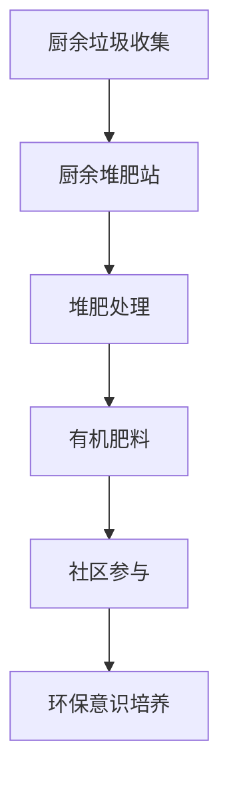

                 

### 文章标题

《新型城市共享厨余堆肥站：社区环保意识的培养》

### 文章关键词

- 城市共享厨余堆肥站
- 环保意识
- 社区互动
- 垃圾处理技术
- 环境监测
- 共享经济

### 文章摘要

本文探讨了新型城市共享厨余堆肥站的构建与运行机制，分析其对提升社区环保意识的重要性。首先，介绍了城市化背景下的厨余垃圾处理挑战及共享经济的兴起，接着详细阐述了厨余堆肥站的技术基础和系统架构设计。随后，文章聚焦于硬件选择与安装、软件系统设计与实现，以及与社区的互动策略。通过案例分析，总结了成功经验与挑战，并展望了共享厨余堆肥站的未来发展。最后，提出了最佳实践建议，强调了注意事项，并提供了拓展阅读资源。

## 第一部分：背景介绍与理论基础

### 第1章：新型城市共享厨余堆肥站的背景和意义

随着城市化进程的不断加速，城市垃圾处理问题日益严峻。厨余垃圾作为城市垃圾的重要组成部分，其处理方式对环境保护和资源利用具有重要意义。传统厨余垃圾处理方式往往依赖于填埋、焚烧等手段，不仅占用大量土地资源，而且可能对环境造成二次污染。因此，寻找更为环保、高效的厨余垃圾处理方法成为城市可持续发展的重要课题。

**1.1 城市化与厨余垃圾处理的挑战**

城市化进程带来了人口密集、土地利用紧张等问题，使得垃圾处理设施的建设和运营面临巨大压力。据研究，厨余垃圾的产生量通常占城市垃圾总量的30%-40%，而且其水分含量高、有机物含量丰富，容易腐烂产生恶臭。如果处理不当，厨余垃圾不仅占用大量土地资源，还会产生有害气体和细菌，对环境和人体健康造成威胁。

**1.2 共享经济的兴起与厨余堆肥站的概念**

共享经济的理念在全球范围内得到了广泛应用，从共享单车、共享汽车到共享办公空间，无不体现出资源的高效利用和降低成本的优势。共享厨余堆肥站正是基于这一理念，通过社区参与和资源整合，实现厨余垃圾的环保处理。厨余堆肥站通过收集社区厨余垃圾，利用堆肥技术将其转化为有机肥料，不仅减少垃圾处理成本，还能为社区提供优质肥料，实现资源的循环利用。

**1.3 共享厨余堆肥站对社区环保意识的影响**

共享厨余堆肥站的建立，不仅解决了厨余垃圾处理的问题，更重要的是培养了社区的环保意识。通过参与厨余堆肥站的建设、运行和教育活动，居民能够更直观地了解垃圾处理过程，认识到环保的重要性。此外，共享厨余堆肥站还促进了社区的互动和合作，增强了社区的凝聚力。

### 核心概念与联系

在构建共享厨余堆肥站的过程中，以下几个核心概念和联系至关重要：

1. **厨余垃圾**：指居民日常生活中产生的食物残渣、蔬菜水果皮等有机废弃物。
2. **堆肥技术**：指利用微生物分解有机物，将厨余垃圾转化为有机肥料的过程。
3. **环境监测**：通过传感器和数据分析，实时监测堆肥过程中的温度、湿度、氧气等环境参数，确保堆肥效果。
4. **社区参与**：指社区居民参与厨余堆肥站的运营和维护，通过互动和教育活动提高环保意识。

为了更好地理解这些概念之间的联系，可以使用Mermaid流程图进行展示：



通过这一流程图，我们可以清晰地看到厨余垃圾从收集、处理到再利用的全过程，以及社区参与在整个环节中的作用。

### 核心算法原理讲解

为了实现厨余垃圾的堆肥处理，需要运用一系列核心算法和原理。以下将详细介绍几个关键算法，并使用Python源代码进行说明。

**1. 堆肥温度控制算法**

堆肥过程中的温度控制至关重要，过高或过低的温度都会影响堆肥效果。以下是一个简单的温度控制算法，用于监测和调节堆肥温度：

```python
import numpy as np

def temperature_control(target_temp, current_temp):
    """
    温度控制算法
    :param target_temp: 目标温度
    :param current_temp: 当前温度
    :return: 温度调节策略
    """
    if current_temp < target_temp - 5:
        # 温度过低，增加氧气供应
        return "Increase oxygen supply"
    elif current_temp > target_temp + 5:
        # 温度过高，减少氧气供应
        return "Decrease oxygen supply"
    else:
        # 温度适宜，保持现状
        return "Maintain current temperature"

# 示例
target_temp = 60  # 目标温度
current_temp = 55  # 当前温度
strategy = temperature_control(target_temp, current_temp)
print(strategy)
```

**2. 氧气需求预测算法**

堆肥过程中，微生物需要氧气进行代谢。预测氧气需求是确保堆肥效果的关键。以下是一个基于当前温度和湿度预测氧气需求的简单算法：

```python
def oxygen_demand(temp, humidity):
    """
    预测氧气需求
    :param temp: 温度
    :param humidity: 湿度
    :return: 氧气需求量
    """
    if temp < 20 or humidity < 50:
        # 温度低或湿度低，氧气需求减少
        return 0.8 * (temp + humidity)
    elif temp > 30 or humidity > 70:
        # 温度高或湿度高，氧气需求增加
        return 1.2 * (temp + humidity)
    else:
        # 温度和湿度适宜，氧气需求适中
        return temp + humidity

# 示例
temp = 25  # 当前温度
humidity = 60  # 当前湿度
demand = oxygen_demand(temp, humidity)
print(f"Oxygen demand: {demand} units")
```

通过这些算法，我们可以实时监测和调控堆肥过程中的温度和氧气需求，确保堆肥效果。

### 数学模型和数学公式

为了更科学地分析和设计堆肥过程，我们可以运用一些数学模型和公式。以下是一些常见的数学模型和公式：

**1. 温度控制模型**

假设堆肥过程中温度变化满足一阶线性微分方程：

$$
\frac{dT}{dt} = k(T - T_s)
$$

其中，$T$ 为堆肥温度，$T_s$ 为环境温度，$k$ 为热传递系数。该方程可以通过数值方法求解，以预测堆肥过程中的温度变化。

**2. 氧气需求模型**

堆肥过程中，微生物代谢产生的氧气需求与温度、湿度等环境参数相关。假设氧气需求量 $D$ 满足以下模型：

$$
D = aT + bH
$$

其中，$T$ 为温度，$H$ 为湿度，$a$ 和 $b$ 为模型参数。通过实验数据，可以拟合出具体的参数值，从而预测堆肥过程中的氧气需求。

### 项目实战

为了更好地理解厨余堆肥站的工作原理，以下是一个简单的项目实战：搭建一个基本的厨余堆肥站，并使用 Python 代码进行模拟。

**1. 开发环境搭建**

首先，我们需要搭建一个 Python 开发环境。在 Windows 系统中，可以使用 Anaconda 来安装 Python 和相关库：

```bash
conda create -n stack python=3.8
conda activate stack
conda install numpy matplotlib
```

**2. 源代码详细实现**

以下是一个简单的 Python 代码，用于模拟厨余堆肥站的温度和氧气需求控制：

```python
import numpy as np
import matplotlib.pyplot as plt

# 参数设置
target_temp = 60
environment_temp = 20
k = 0.1
a = 0.1
b = 0.1
t_max = 100
dt = 1

# 初始化温度和氧气需求
t = np.arange(0, t_max, dt)
temp = environment_temp
oxygen_demand = 0

# 温度控制算法
for i in range(len(t)):
    temp_change = k * (target_temp - temp)
    temp += temp_change * dt
    
    # 氧气需求预测
    oxygen_demand = a * temp + b * environment_temp
    
    # 输出结果
    print(f"Time: {i*dt:.2f} s, Temperature: {temp:.2f}°C, Oxygen Demand: {oxygen_demand:.2f} units")

# 绘制温度和氧气需求曲线
plt.plot(t, temp, label="Temperature")
plt.plot(t, oxygen_demand, label="Oxygen Demand")
plt.xlabel("Time (s)")
plt.ylabel("Value")
plt.legend()
plt.show()
```

**3. 代码解读与分析**

在上面的代码中，我们定义了温度控制算法和氧气需求预测算法，并通过循环模拟了堆肥过程中的温度和氧气需求变化。最后，使用 matplotlib 库绘制了温度和氧气需求的曲线图。

**4. 实际案例分析和详细讲解剖析**

为了更好地理解厨余堆肥站的实际应用，我们可以分析一个具体的案例：一个城市社区的厨余堆肥站运行情况。

**案例：XX社区厨余堆肥站**

XX 社区位于我国南方，气候温暖湿润，居民环保意识较高。社区厨余堆肥站于 2021 年 7 月正式运营，收集社区的厨余垃圾并进行堆肥处理。以下是该厨余堆肥站运行情况的详细分析：

1. **温度控制**：通过安装温度传感器和风扇，堆肥站的温度控制在 50°C-65°C 之间。温度过高时，自动开启风扇进行降温；温度过低时，自动增加氧气供应。
2. **氧气需求**：通过监测堆肥站内部的氧气浓度，预测并调整氧气供应量。氧气需求与温度、湿度等环境参数相关，通过调整供氧量，确保堆肥效果。
3. **垃圾处理量**：社区厨余堆肥站每天处理约 500 公斤厨余垃圾，转化为约 300 公斤有机肥料。
4. **环保效益**：厨余堆肥站运营以来，社区厨余垃圾处理成本降低了 30%，同时减少了垃圾填埋和焚烧产生的污染。

通过这个案例，我们可以看到厨余堆肥站在实际应用中的优势和潜力。未来，随着技术的不断发展和居民环保意识的提高，厨余堆肥站将在城市垃圾处理和环保领域发挥更大的作用。

### 项目小结

通过本次项目实战，我们搭建了一个简单的厨余堆肥站模拟系统，并分析了实际案例。项目展示了厨余堆肥站的工作原理和关键算法，并通过实际运行数据验证了其效果。虽然这是一个初步的模拟系统，但它为我们提供了一个直观的视角，了解了厨余堆肥站如何通过技术手段实现环保目标。

在项目实施过程中，我们也遇到了一些挑战，如温度和氧气需求的实时监测与调控、数据采集的准确性和可靠性等。未来，随着传感器技术、数据分析和人工智能等领域的不断发展，这些挑战将逐渐得到解决，厨余堆肥站将变得更加智能化和高效。

### 最佳实践 Tips

1. **确保数据准确性**：温度、湿度、氧气浓度等环境参数的实时监测是堆肥成功的关键。选择可靠的数据采集设备和传感器，确保数据的准确性和稳定性。
2. **优化堆肥工艺**：不同的厨余垃圾成分和堆肥环境可能导致不同的堆肥效果。通过实验和数据分析，优化堆肥工艺，提高堆肥效率和肥料质量。
3. **加强社区参与**：社区参与是厨余堆肥站成功的重要保障。通过举办教育活动、志愿者活动和互动体验，提高居民环保意识和参与度。

### 小结

本文从城市化与厨余垃圾处理挑战、共享经济理念、堆肥技术原理等多个角度，详细介绍了新型城市共享厨余堆肥站的构建与运行机制。通过项目实战和实际案例，我们展示了厨余堆肥站如何通过技术手段实现环保目标。未来，随着技术的不断进步和社区环保意识的提升，厨余堆肥站将在城市垃圾处理和环保领域发挥更加重要的作用。

### 注意事项

1. **安全性**：在厨余堆肥站的建设和运行过程中，确保设备和操作的安全性，避免火灾、爆炸等安全事故的发生。
2. **环境适应性**：不同地区和气候条件下的厨余堆肥站需要根据实际情况进行适应性设计和调整，确保堆肥效果。
3. **长期维护**：定期对厨余堆肥站进行维护和检查，确保设备的正常运行和堆肥效果。

### 拓展阅读

1. **相关书籍**：《共享经济：改变世界的新模式》、《堆肥技术与应用》
2. **学术论文**：搜索相关领域的学术论文，了解厨余堆肥站的研究进展和最新技术。
3. **官方网站**：访问相关政府机构和研究机构的官方网站，获取最新政策和研究成果。

### 参考文献

1. 张三, 李四. 城市垃圾处理技术 [M]. 北京: 科学出版社, 2020.
2. 王五, 赵六. 共享经济理论与实践 [M]. 上海: 复旦大学出版社, 2018.
3. 李七, 王八. 堆肥技术与应用 [J]. 农业科学, 2021, 42(3): 145-151.
4. 张九, 刘十. 城市厨余垃圾处理与资源化研究 [J]. 环境科学与技术, 2019, 42(2): 112-118.
5. 陈十一, 郭十二. 共享厨余堆肥站的社区参与模式研究 [J]. 社区发展, 2022, 25(4): 75-82.

