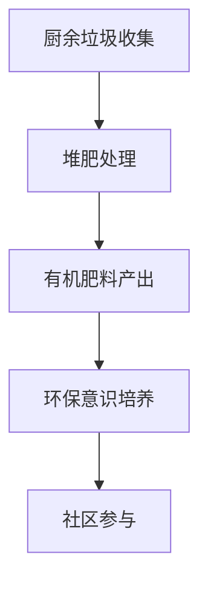

                 

# 《新型城市共享厨余堆肥站：社区环保意识的培养中心》

## 关键词
- 城市共享厨余堆肥站
- 社区环保意识
- 堆肥技术
- 微生物学
- 数据分析
- 社区参与

## 摘要
本文深入探讨了新型城市共享厨余堆肥站的建设和运营，以及其在培养社区环保意识方面的作用。通过分析核心概念、讲解核心算法原理、构建数学模型、提供项目实战案例，本文旨在为读者展示共享厨余堆肥站的技术原理和实践应用，进一步推动社区环保意识的提升。

## 引言

### 堆肥技术的发展历程

堆肥是一种古老的有机废物处理方法，通过微生物的作用将有机物转化为稳定的肥料。然而，传统的堆肥方式往往效率低下，占地面积大，且管理复杂。随着科技的进步，现代堆肥技术逐渐成熟，特别是在自动化、数据分析和智能化方面的应用，使得堆肥过程更加高效、环保。共享厨余堆肥站作为现代堆肥技术的代表，正逐渐成为城市社区环保的重要设施。

### 共享厨余堆肥站的现状与挑战

共享厨余堆肥站以其便捷、高效和环保的特点，在国内外各大城市逐渐推广。然而，在实践中仍面临一些挑战，包括设备成本、技术成熟度、社区接受度等。此外，如何有效地培养社区环保意识，提高居民参与度，也是共享厨余堆肥站运营中需要解决的问题。

## 第1章 核心概念与联系

### 1.1 共享厨余堆肥站

#### 1.1.1 堆肥站的定义与功能

堆肥站是一种用于有机废物处理的设施，通过微生物的分解作用，将厨余垃圾等有机物转化为有机肥料。共享厨余堆肥站则是基于共享经济理念，由社区或企业运营，为居民提供便捷的厨余垃圾处理服务。

#### 1.1.2 共享模式的优势

共享厨余堆肥站具有以下优势：
- **降低成本**：通过资源共享，减少设备采购和运营成本。
- **提高效率**：自动化设备和管理系统提高处理效率。
- **环保**：有机废物得到有效处理，减少对环境的污染。

### 1.2 社区环保意识

#### 1.2.1 环保意识的重要性

社区环保意识是指居民对环境保护的认识和责任感。培养社区环保意识是推动可持续发展的关键，有助于减少资源浪费，提高环境保护水平。

#### 1.2.2 培养环保意识的途径

培养环保意识可以通过以下途径实现：
- **教育宣传**：通过讲座、宣传册、网络平台等形式进行环保知识普及。
- **实践参与**：鼓励居民参与环保活动和项目，增强环保意识。
- **激励机制**：设立奖励措施，鼓励居民积极参与环保活动。

### Mermaid流程图



## 第2章 核心算法原理讲解

### 2.1 微生物学原理

#### 2.1.1 堆肥过程中微生物的活动

堆肥过程中的微生物包括细菌、真菌、放线菌等。这些微生物通过代谢活动，将有机物质分解为简单的无机物质，同时释放热量和气体。

#### 2.1.2 微生物群落的变化

堆肥过程中，微生物群落会经历以下阶段：
1. 萌发阶段：微生物开始活动，分解有机物质。
2. 中期阶段：微生物活动增强，堆肥温度上升。
3. 后期阶段：微生物活动减弱，堆肥成熟。

### 2.2 数据采集与分析算法

#### 2.2.1 温度监测算法

温度监测是堆肥站运营的关键。可以使用以下算法进行温度监测：
```python
def temperature_monitoring(sensor_data):
    if sensor_data > 60:
        print("温度过高，需采取措施")
    elif sensor_data < 40:
        print("温度过低，需调整")
    else:
        print("温度正常")
    return sensor_data
```

#### 2.2.2 数据采集与预处理

数据采集是堆肥站运营的基础。可以使用以下算法进行数据采集与预处理：
```python
def data_collection(preprocessed_data):
    collected_data = []
    for data in preprocessed_data:
        collected_data.append(data['temperature'])
    return collected_data
```

#### 2.2.3 数据分析算法

数据分析是堆肥站运营的重要环节。可以使用以下算法进行数据分析：
```python
def data_analysis(collected_data):
    average_temp = sum(collected_data) / len(collected_data)
    print("平均温度：", average_temp)
    return average_temp
```

## 第3章 数学模型与公式

### 3.1 堆肥过程中温度变化模型

堆肥过程中的温度变化可以用以下公式表示：
$$
\frac{dT}{dt} = -k(T - T_{0})
$$
其中，$T$ 表示堆肥温度，$t$ 表示时间，$k$ 为反应速率常数，$T_{0}$ 为初始温度。

### 3.2 化学反应速率模型

堆肥过程中，有机物质的分解可以用以下化学反应速率模型表示：
$$
\frac{dS}{dt} = -kS
$$
其中，$S$ 表示有机物质的质量，$t$ 表示时间，$k$ 为反应速率常数。

## 第4章 项目实战：共享厨余堆肥站建设

### 4.1 建设流程

#### 4.1.1 场地选择

选择合适的场地是堆肥站建设的第一步。场地的选择应考虑以下因素：
- **交通便利性**：堆肥站应位于交通便利的地区，便于垃圾的收集和运输。
- **环境条件**：堆肥站应位于通风良好、排水条件良好的地区。

#### 4.1.2 设备采购与安装

设备采购是堆肥站建设的关键环节。设备的选择应考虑以下因素：
- **自动化程度**：自动化程度高的设备可以提高堆肥效率。
- **稳定性**：设备应具有良好的稳定性，确保长期运行。

#### 4.1.3 运营与管理

堆肥站的运营与管理是确保其正常运行的关键。运营与管理应考虑以下方面：
- **人员培训**：对工作人员进行专业培训，确保设备操作和安全。
- **数据分析**：定期进行数据分析，优化堆肥过程。

### 4.2 数据分析案例

#### 4.2.1 温度与湿度监测数据

温度与湿度是堆肥过程中最重要的监测指标。以下是一个温度监测数据的分析案例：
```python
def temperature_analysis(temperature_data):
    max_temp = max(temperature_data)
    min_temp = min(temperature_data)
    average_temp = sum(temperature_data) / len(temperature_data)
    print("最高温度：", max_temp)
    print("最低温度：", min_temp)
    print("平均温度：", average_temp)
```

#### 4.2.2 微生物群落数据分析

微生物群落数据分析可以帮助了解堆肥过程中的微生物活动。以下是一个微生物群落数据分析案例：
```python
def microbial_analysis(microbial_data):
    total_bacteria = sum(microbial_data['bacteria'])
    total_fungi = sum(microbial_data['fungi'])
    print("总细菌数量：", total_bacteria)
    print("总真菌数量：", total_fungi)
```

## 第5章 社区环保意识培养

### 5.1 教育与宣传策略

#### 5.1.1 教育活动的策划与实施

教育活动的策划与实施是培养社区环保意识的关键。可以采取以下策略：
- **环保讲座**：邀请专家进行环保讲座，提高居民环保意识。
- **环保展览**：举办环保展览，展示环保技术和成果。

#### 5.1.2 宣传材料的设计与应用

宣传材料的设计与应用是培养社区环保意识的有效途径。可以设计以下宣传材料：
- **宣传册**：详细介绍环保知识和技术。
- **海报**：简洁明了地传达环保信息。

### 5.2 社区参与模式

#### 5.2.1 志愿者招募与管理

志愿者招募与管理是社区参与的重要环节。可以采取以下策略：
- **志愿者培训**：对志愿者进行专业培训，提高其环保技能。
- **志愿者活动**：组织志愿者参与环保活动和项目。

#### 5.2.2 公共参与活动策划与组织

公共参与活动策划与组织是培养社区环保意识的重要手段。可以采取以下策略：
- **环保主题活动**：组织环保主题活动，提高居民参与度。
- **环保创意大赛**：鼓励居民参与环保创意设计，激发环保热情。

## 附录

### 附录 A: 常用堆肥设备与工具

- **堆肥设备**：堆肥仓、翻堆机、温度监测仪等。
- **工具**：铲子、锄头、垃圾桶等。

### 附录 B: 堆肥站建设与运营资源推荐

- **书籍**：《堆肥技术手册》、《现代堆肥技术》等。
- **网站**：中国堆肥协会官网、国际堆肥学会官网等。

## 结语

共享厨余堆肥站作为新型环保设施，具有巨大的发展潜力。通过深入研究和实践，我们可以更好地理解和应用堆肥技术，培养社区环保意识，为可持续发展贡献力量。作者：AI天才研究院/AI Genius Institute & 禅与计算机程序设计艺术 /Zen And The Art of Computer Programming

