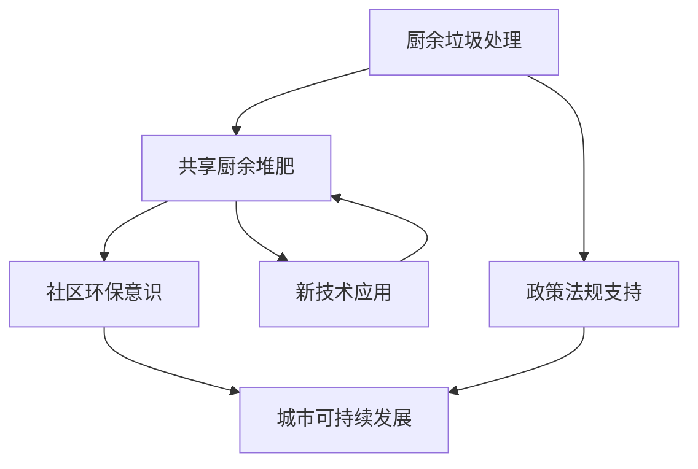

                 

# 《新型城市共享厨余堆肥：社区环保意识的培养》

## 关键词

- 城市厨余堆肥
- 社区环保意识
- 共享经济
- 可持续发展
- 微生物分解

## 摘要

本文深入探讨了新型城市共享厨余堆肥系统及其在培养社区环保意识方面的重要性。首先，我们分析了当前城市厨余垃圾处理的现状和挑战，介绍了传统处理方法的局限性以及城市厨余堆肥的必要性。接着，我们详细阐述了共享厨余堆肥的概念、原理和系统设计。随后，文章着重于社区环保意识的培养，从教育策略、社区参与和激励机制等方面进行了探讨。最后，文章总结了城市共享厨余堆肥的经济评估、政策支持及其未来发展趋势，为推进城市可持续发展提供了有益的思路和借鉴。

---

## 第一部分：城市共享厨余堆肥的背景与概念

### 第1章：城市厨余垃圾的处理现状与挑战

#### 1.1.1 厨余垃圾处理的传统方法及其局限性

城市厨余垃圾是日常生活中产生的一种重要垃圾类型。传统上，厨余垃圾的处理方法主要包括填埋、焚烧和堆肥等。其中，填埋是最常用的方法，但由于厨余垃圾的有机成分高，填埋过程中会产生渗滤液和甲烷等有害物质，对土壤和空气造成污染。焚烧虽然能够减少垃圾体积，但会产生大量的二氧化碳和其他有害气体，影响大气环境。堆肥是一种相对环保的处理方法，通过微生物分解有机物质，转化为有机肥料，但传统的堆肥方法对技术要求高，设备投资大，且处理效率较低。

#### 1.1.2 城市厨余堆肥的必要性

随着城市化进程的加快，城市厨余垃圾的产生量不断增加，传统的处理方法已经难以满足环保和资源循环利用的需求。城市厨余堆肥作为一种新型的处理技术，具有显著的环保和经济效益。首先，堆肥过程能够将厨余垃圾转化为有机肥料，减少垃圾量，降低填埋和焚烧的成本。其次，堆肥肥料可以用于绿化和农业，促进生态可持续发展。此外，城市厨余堆肥还能够提高土壤肥力，减少化肥使用，降低农业生产成本。

#### 1.1.3 城市厨余堆肥的优势与潜力

城市厨余堆肥具有多方面的优势。首先，它能够实现厨余垃圾的资源化利用，减少垃圾处理成本。其次，堆肥过程能够减少温室气体排放，降低环境污染。此外，城市厨余堆肥技术简单，易于操作，可以在社区层面进行推广。未来，随着技术的不断进步和成本的降低，城市厨余堆肥有望成为城市垃圾处理的重要手段。

### 第2章：共享厨余堆肥的概念与原理

#### 2.1.1 共享厨余堆肥的定义

共享厨余堆肥是指通过社区共享资源，利用堆肥设备和技术，将厨余垃圾转化为有机肥料的过程。它强调社区成员的参与和共享，旨在提高厨余垃圾处理效率，培养社区环保意识。

#### 2.1.2 共享厨余堆肥的运作模式

共享厨余堆肥的运作模式主要包括以下几个方面：

1. **厨余垃圾收集**：社区设置厨余垃圾收集点，居民将厨余垃圾倒入指定的收集容器中。

2. **厨余垃圾预处理**：厨余垃圾进入堆肥系统前，需要去除塑料、玻璃、金属等不可降解物质。

3. **堆肥制作**：厨余垃圾在堆肥设备中经过微生物分解，转化为有机肥料。

4. **有机肥料分配**：堆肥成熟后，将其分配给社区成员用于绿化和农业。

5. **社区参与与监督**：社区成员参与堆肥过程，监督堆肥设备的运行，共同维护社区环境。

#### 2.1.3 厨余堆肥的基本原理与过程

厨余堆肥的基本原理是利用微生物分解有机物质，转化为有机肥料。具体过程如下：

1. **初始阶段**：厨余垃圾被堆放在堆肥容器中，加入适量的水分和微生物菌剂。

2. **发酵阶段**：微生物在适宜的温度、湿度和氧气条件下，开始分解厨余垃圾，产生热量和有机酸等物质。

3. **成熟阶段**：堆肥温度逐渐降低，有机物质被彻底分解，形成有机肥料。

4. **后处理阶段**：堆肥经过筛选和消毒，去除杂质和有害物质，最终成为优质有机肥料。

### 第3章：城市共享厨余堆肥系统设计

#### 3.1.1 系统的组成部分与结构

城市共享厨余堆肥系统主要由以下几个部分组成：

1. **厨余垃圾收集系统**：包括收集容器、转运设备和收集点。

2. **厨余垃圾预处理系统**：包括筛分设备、破碎设备和清洗设备。

3. **堆肥制作系统**：包括堆肥容器、通风系统和加湿系统。

4. **有机肥料分配系统**：包括肥料储存设备和分配渠道。

5. **社区参与与管理系统**：包括社区参与机制、监督系统和反馈系统。

#### 3.1.2 堆肥设备的选型与配置

堆肥设备的选型与配置应根据具体需求进行。常见的堆肥设备包括静态堆肥设备、动态堆肥设备和好氧堆肥设备。静态堆肥设备结构简单，但处理效率较低；动态堆肥设备处理效率高，但设备成本较高；好氧堆肥设备适用于高温堆肥，但需要较高的氧气供应。

#### 3.1.3 系统运行管理与维护

城市共享厨余堆肥系统的运行管理主要包括以下几个方面：

1. **设备运行监测**：定期检查堆肥设备的工作状态，确保设备正常运行。

2. **环境监测**：监测堆肥过程中的温度、湿度和氧气含量，确保堆肥质量。

3. **垃圾管理**：合理调配厨余垃圾，确保堆肥原料的质量和数量。

4. **维护与保养**：定期对堆肥设备进行清洗、消毒和维修，延长设备使用寿命。

### 第4章：社区环保意识的重要性

#### 4.1.1 环保意识对社区可持续发展的意义

环保意识是社区可持续发展的重要基础。它不仅关系到社区成员的生活质量，还直接影响社区的经济、社会和生态环境。培养社区环保意识有助于提高居民的环保素养，推动社区绿色发展，实现可持续发展目标。

#### 4.1.2 社区环保意识现状分析

目前，我国社区环保意识相对薄弱，主要表现在以下几个方面：

1. **环保知识缺乏**：部分居民对环保知识了解有限，缺乏环保意识。

2. **环保行为不足**：社区居民在日常生活中对环保行为重视不够，如垃圾分类、节能减排等方面。

3. **环保参与度低**：社区居民对环保活动参与度不高，缺乏参与感和责任感。

#### 4.1.3 提升社区环保意识的必要性

提升社区环保意识对于推动社区可持续发展具有重要意义。首先，它有助于提高居民的环保素养，促进环保行为习惯的养成。其次，环保意识的提高能够增强社区居民的环保责任感和参与感，推动社区环保事业的发展。最后，培养社区环保意识有助于形成绿色生活方式，减少资源浪费，提高资源利用效率。

### 第5章：教育策略与活动设计

#### 5.1.1 环保教育的内容与方法

环保教育是培养社区环保意识的重要手段。环保教育的内容应包括环保知识、环保法律法规、环保行为规范等方面。环保教育的方法可以采用课堂教学、实践活动、宣传推广等多种形式，以提高居民的环保素养。

#### 5.1.2 社区环保活动的策划与执行

社区环保活动是培养社区环保意识的重要途径。社区环保活动应结合实际情况，策划和执行一系列有针对性的活动，如垃圾分类宣传、节能减排行动、植树造林等。在活动执行过程中，要注重参与性、互动性和实效性，以提高居民的环保参与度和行动力。

#### 5.1.3 创新环保教育模式

为了提高环保教育的效果，可以尝试创新环保教育模式，如环保主题公园、环保实践基地等。通过这些创新模式，使环保教育更加生动有趣，吸引更多居民参与。

### 第6章：社区参与与激励机制

#### 6.1.1 激发社区参与的策略

激发社区参与是培养社区环保意识的关键。可以采取以下策略：

1. **加强宣传推广**：通过媒体、网络、社区活动等多种渠道，加强环保知识的宣传推广。

2. **设立奖励机制**：对积极参与环保活动的社区居民给予一定的物质奖励或荣誉称号。

3. **开展互动活动**：组织环保主题的互动活动，提高居民的参与度和兴趣。

#### 6.1.2 建立社区共享厨余堆肥的激励机制

建立社区共享厨余堆肥的激励机制，可以鼓励居民积极参与厨余垃圾处理。具体措施包括：

1. **积分兑换**：居民参与厨余垃圾处理可以累积积分，用于兑换环保产品或服务。

2. **社区奖励**：对厨余垃圾处理效果良好的社区给予一定的奖励，激励社区成员的积极参与。

3. **公开表彰**：对积极参与厨余垃圾处理的居民和社区进行公开表彰，提高其荣誉感。

#### 6.1.3 社区成员的角色与责任

在社区厨余堆肥过程中，社区成员应扮演以下角色：

1. **参与者**：积极参与厨余垃圾处理，遵守环保规定，养成良好的环保行为习惯。

2. **监督者**：监督厨余垃圾处理的整个过程，确保堆肥质量。

3. **宣传者**：宣传环保知识，提高社区居民的环保意识。

### 第7章：成功案例与实践经验分享

#### 7.1.1 国内外社区厨余堆肥的实践经验

国内外社区厨余堆肥的实践经验表明，培养社区环保意识是提高厨余垃圾处理效率的重要途径。以下是几个成功的案例：

1. **日本东京**：日本东京市通过推广社区厨余堆肥，实现了厨余垃圾的零填埋目标。其经验是加强政策支持，提高环保意识，鼓励居民参与。

2. **英国伦敦**：英国伦敦市通过建立社区厨余堆肥中心，实现了厨余垃圾的资源化利用。其经验是提供优质服务，降低参与门槛，鼓励居民参与。

3. **中国杭州**：中国杭州通过实施“绿色社区”项目，推动了社区厨余堆肥的普及。其经验是创新教育模式，提高居民环保素养，增强参与度。

#### 7.1.2 社区环保意识培养的难点与解决方案

在培养社区环保意识过程中，面临以下难点：

1. **环保知识缺乏**：居民对环保知识了解有限，难以形成环保行为习惯。

解决方案：加强环保教育，提高居民环保素养。

2. **参与度低**：社区居民对环保活动参与度不高，缺乏参与感和责任感。

解决方案：创新环保活动形式，提高居民的参与度和兴趣。

3. **激励机制不足**：缺乏有效的激励机制，导致居民参与动力不足。

解决方案：建立奖励机制，提高居民的参与积极性。

#### 7.1.3 未来展望与挑战

未来，城市共享厨余堆肥有望成为推动社区环保意识培养的重要手段。然而，面临以下挑战：

1. **技术瓶颈**：堆肥技术需要进一步改进和完善，以提高处理效率和堆肥质量。

2. **政策支持**：需要加强政策支持，提高环保意识，推动厨余堆肥的普及。

3. **资金投入**：需要增加资金投入，保障堆肥设备的运行和维护。

4. **公众参与**：需要激发公众参与，提高社区环保意识。

### 第8章：经济评估与成本效益分析

#### 8.1.1 共享厨余堆肥的经济效益分析

共享厨余堆肥具有显著的经济效益。首先，通过资源化利用厨余垃圾，可以减少填埋和焚烧的成本。其次，堆肥肥料用于绿化和农业，可以降低生产成本，提高农作物产量。此外，共享厨余堆肥还可以创造就业机会，促进社区经济发展。

#### 8.1.2 成本效益分析的方法与步骤

进行共享厨余堆肥的成本效益分析，可以采用以下方法和步骤：

1. **确定分析范围**：明确共享厨余堆肥的项目范围，包括设备购置、运行维护、人员培训等。

2. **收集数据**：收集相关成本数据，包括设备成本、运行成本、人工成本等。

3. **计算成本**：根据数据计算总成本，包括初始投资成本和日常运行成本。

4. **计算效益**：计算共享厨余堆肥的效益，包括减少垃圾处理成本、提高农作物产量等。

5. **评估成本效益**：将效益与成本进行比较，评估共享厨余堆肥的经济效益。

#### 8.1.3 政策支持与融资策略

政策支持是推动共享厨余堆肥发展的重要保障。政府可以通过以下方式提供政策支持：

1. **财政补贴**：对共享厨余堆肥项目给予财政补贴，降低项目成本。

2. **税收优惠**：对参与共享厨余堆肥的居民和企业给予税收优惠，鼓励参与。

3. **融资支持**：提供融资支持，帮助企业解决资金问题。

4. **技术支持**：提供技术支持，帮助企业提高堆肥技术水平。

### 第9章：政策与法规的支持

#### 9.1.1 城市厨余堆肥相关的政策法规现状

目前，我国已经制定了一系列与城市厨余堆肥相关的政策法规，如《城市生活垃圾管理办法》、《厨余垃圾处理技术规范》等。这些法规明确了城市厨余垃圾处理的方针和标准，为推动厨余堆肥技术的发展提供了法律依据。

#### 9.1.2 政策对城市厨余堆肥推广的影响

政策对城市厨余堆肥的推广具有积极的推动作用。首先，政策支持可以降低项目成本，提高项目可行性。其次，政策引导可以引导企业和居民积极参与厨余堆肥，推动产业链的形成。此外，政策支持还可以提高厨余堆肥技术的研发和应用水平，推动行业健康发展。

#### 9.1.3 法规建设的完善与展望

未来，我国需要进一步完善城市厨余堆肥相关法规，以提高法规的针对性和可操作性。具体包括：

1. **完善标准体系**：制定和完善厨余垃圾处理的技术标准和操作规范，提高堆肥质量。

2. **加强执法力度**：加大对违法行为的执法力度，确保法规得到有效执行。

3. **推动政策创新**：探索新的政策模式，如PPP模式，推动厨余堆肥项目的实施。

4. **加强国际合作**：借鉴国际先进经验，推动我国城市厨余堆肥技术的发展。

### 第10章：城市共享厨余堆肥的未来发展趋势

#### 10.1.1 新技术对城市厨余堆肥的影响

未来，随着新技术的不断发展，城市厨余堆肥技术将得到进一步提升。例如，生物酶技术、智能化控制技术等有望应用于厨余堆肥，提高处理效率和堆肥质量。

#### 10.1.2 城市厨余堆肥与智慧城市建设的结合

智慧城市建设为城市厨余堆肥提供了新的发展机遇。通过智慧城市技术，可以实现厨余垃圾的实时监测、智能调控和精细管理，提高厨余堆肥系统的运行效率。

#### 10.1.3 国际合作与经验借鉴

国际合作是推动城市厨余堆肥发展的重要途径。通过借鉴国际先进经验，我国可以加快城市厨余堆肥技术的研发和应用，提高国际竞争力。

## 核心概念与联系

在《新型城市共享厨余堆肥：社区环保意识的培养》一书中，以下几个核心概念及其相互关系构成了理解全书的基础：

1. **厨余垃圾处理**：城市厨余垃圾处理是本书的核心议题，它涉及到垃圾的产生、收集、处理和资源化利用。厨余垃圾处理的效果直接影响社区的环境质量和可持续发展。

2. **共享厨余堆肥**：共享厨余堆肥是城市厨余垃圾处理的一种创新模式，通过社区共享资源，实现厨余垃圾的资源化利用。它强调社区成员的参与和共享，是培养社区环保意识的重要途径。

3. **社区环保意识**：社区环保意识是本书的另一个核心概念，它关系到居民对环境保护的认识和行为。培养社区环保意识是推动社区可持续发展的关键。

4. **城市可持续发展**：城市可持续发展是城市发展的长期目标，它涉及经济、社会和生态环境的协调发展。城市厨余堆肥是实现城市可持续发展的重要手段。

以下是一个简化的Mermaid流程图，展示了这些核心概念之间的联系：



## 核心算法原理讲解

在《新型城市共享厨余堆肥：社区环保意识的培养》一书中，核心算法原理讲解主要集中在厨余堆肥的微生物分解过程和温度控制上。以下是具体的算法原理和过程：

### 微生物分解过程

厨余堆肥的微生物分解过程可以概括为以下几个步骤：

1. **初始阶段**：
   - **预处理**：厨余垃圾被收集后，首先进行预处理，去除塑料、玻璃、金属等不可降解物质。
   - **水分调节**：厨余垃圾的水分含量应控制在60%到75%之间，以利于微生物的生长。

2. **发酵阶段**：
   - **微生物引入**：向厨余垃圾中引入适合的微生物菌剂，如嗜温菌、嗜热菌等。
   - **温度调节**：通过监测和调节堆肥温度，使其保持在最佳范围内（通常为50℃到65℃）。

3. **成熟阶段**：
   - **稳定化**：经过一段时间的发酵，厨余垃圾中的有机物质被分解，形成稳定的有机肥料。
   - **筛选和消毒**：将堆肥进行筛选，去除未分解的物质，并进行消毒处理，确保肥料的安全性。

### 温度控制算法

温度控制是厨余堆肥过程中至关重要的一环。以下是温度控制算法的简要描述：

1. **温度监测**：
   - **传感器安装**：在堆肥容器中安装温度传感器，实时监测堆肥温度。

2. **温度调节策略**：
   - **加热**：当堆肥温度低于50℃时，开启加热设备（如加热板）进行加热。
   - **通风**：当堆肥温度高于65℃时，开启通风设备，降低堆肥温度。

3. **温度调节算法**：
   ```python
   def regulate_temperature(current_temp, target_temp):
       if current_temp < target_temp:
           # 启动加热设备
           start_heating()
       elif current_temp > target_temp:
           # 启动通风设备
           start_ventilation()
       else:
           # 保持当前状态
           maintain_current_state()
   ```

### 数学模型和公式

在厨余堆肥过程中，常用的数学模型和公式包括：

1. **Bouyoucos公式**：用于计算堆肥中的水分含量。
   $$ \omega = \frac{1 - \rho}{1.25} $$
   其中，$\omega$ 表示水分含量，$\rho$ 表示堆肥的密度。

2. **温度分布模型**：用于预测堆肥中的温度分布。
   $$ T(t) = T_s + (T_0 - T_s) \cdot e^{-\alpha \cdot t} $$
   其中，$T(t)$ 表示时间$t$时的温度，$T_s$ 为堆肥表面的温度，$T_0$ 为堆肥内部温度，$\alpha$ 为温度衰减系数。

### 举例说明

假设有一个堆肥容器，初始温度为30℃，当前温度为50℃，目标温度为60℃。根据上述算法，调节温度的具体操作如下：

1. **初始阶段**：首先进行预处理，去除塑料等不可降解物质，并调节水分含量至适宜范围。
2. **发酵阶段**：引入微生物菌剂，并启动加热设备，将堆肥温度逐步提升至目标温度。
3. **成熟阶段**：维持堆肥温度在目标范围内，确保微生物正常分解有机物质。

通过上述步骤，可以确保堆肥过程的顺利进行，最终产出高质量的有机肥料。

## 项目实战

### 开发环境搭建

为了实现城市共享厨余堆肥系统，需要搭建一个完善的开发环境。以下是具体的搭建步骤：

1. **硬件环境**：选择合适的堆肥设备和传感器，如堆肥容器、温度传感器、湿度传感器等。
2. **软件环境**：选择合适的开发平台和编程语言，如Python、Java等。
3. **数据库环境**：选择合适的数据库系统，如MySQL、MongoDB等，用于存储和处理数据。

### 源代码实现

以下是堆肥温度控制模块的源代码实现：

```python
import RPi.GPIO as GPIO
import time

# 定义温度传感器GPIO引脚
TEMP_PIN = 21

# 初始化GPIO
GPIO.setmode(GPIO.BCM)
GPIO.setup(TEMP_PIN, GPIO.IN)

# 加热设备控制GPIO引脚
HEATER_PIN = 18
GPIO.setup(HEATER_PIN, GPIO.OUT)

def read_temperature():
    # 读取温度传感器数据
    temperature = GPIO.input(TEMP_PIN)
    return temperature

def start_heating():
    # 启动加热设备
    GPIO.output(HEATER_PIN, GPIO.HIGH)
    time.sleep(1)
    GPIO.output(HEATER_PIN, GPIO.LOW)

def start_ventilation():
    # 启动通风设备
    GPIO.output(HEATER_PIN, GPIO.HIGH)
    time.sleep(1)
    GPIO.output(HEATER_PIN, GPIO.LOW)

def regulate_temperature():
    current_temp = read_temperature()
    target_temp = 60

    if current_temp < target_temp:
        start_heating()
    elif current_temp > target_temp:
        start_ventilation()
    else:
        print("Temperature is optimal.")

# 运行温度调节程序
while True:
    regulate_temperature()
    time.sleep(1)
```

### 代码解读与分析

1. **温度读取**：通过GPIO接口读取温度传感器的数据。
2. **加热设备控制**：通过GPIO控制加热设备的开关，实现对堆肥温度的调节。
3. **温度调节函数**：根据当前温度与目标温度的比较，决定是否启动加热或通风设备。
4. **循环执行**：程序持续运行，对堆肥温度进行实时调节。

### 实际案例分析与详细讲解剖析

以下是一个实际案例，描述了城市共享厨余堆肥系统的运行过程：

1. **初始阶段**：厨余垃圾被收集后，进行预处理，去除不可降解物质，并调节水分含量至适宜范围。
2. **发酵阶段**：引入微生物菌剂，开始发酵过程。堆肥容器中的温度传感器实时监测堆肥温度。
3. **温度调节**：当堆肥温度低于50℃时，启动加热设备；当温度高于65℃时，启动通风设备。
4. **成熟阶段**：经过一段时间发酵，堆肥温度稳定在目标范围内，厨余垃圾被分解为有机肥料。
5. **有机肥料分配**：将成熟后的有机肥料分配给社区成员，用于绿化和农业。

### 项目小结

城市共享厨余堆肥系统的实施，不仅可以有效处理厨余垃圾，减少环境污染，还可以培养社区环保意识，促进社区可持续发展。通过技术手段和社区参与，实现厨余垃圾的资源化利用，为城市绿色发展提供有力支持。

## 最佳实践 Tips

1. **选择合适的堆肥设备**：根据实际情况，选择适合的堆肥设备，如静态堆肥设备、动态堆肥设备等。
2. **合理规划堆肥场地**：确保堆肥场地宽敞、通风，有利于堆肥过程的顺利进行。
3. **加强环保教育**：通过多种途径加强环保教育，提高居民的环保意识。
4. **建立激励机制**：设立奖励机制，鼓励居民积极参与厨余垃圾处理。
5. **定期维护设备**：定期对堆肥设备进行维护和保养，确保设备正常运行。

## 小结

城市共享厨余堆肥是一种创新的城市垃圾处理模式，通过资源化利用厨余垃圾，实现环境保护和社区可持续发展。培养社区环保意识是推动城市共享厨余堆肥发展的重要途径。未来，随着技术的不断进步和政策支持，城市共享厨余堆肥有望在更多城市得到广泛应用。

## 注意事项

1. **安全操作**：在堆肥过程中，注意安全操作，防止烫伤和中毒。
2. **设备维护**：定期对堆肥设备进行维护和检查，确保设备正常运行。
3. **环保意识**：提高居民的环保意识，鼓励居民积极参与厨余垃圾处理。
4. **政策支持**：争取政策支持，为城市共享厨余堆肥发展提供保障。

## 拓展阅读

1. **《城市厨余垃圾处理技术研究》**：本书详细介绍了城市厨余垃圾处理的现状、技术和未来发展趋势。
2. **《社区环保意识培养与实践》**：本书探讨了社区环保意识的重要性以及培养社区环保意识的方法和策略。
3. **《智慧城市与可持续发展》**：本书从智慧城市建设的角度，探讨了城市可持续发展的路径和模式。

作者：AI天才研究院/AI Genius Institute & 禅与计算机程序设计艺术 /Zen And The Art of Computer Programming
```

