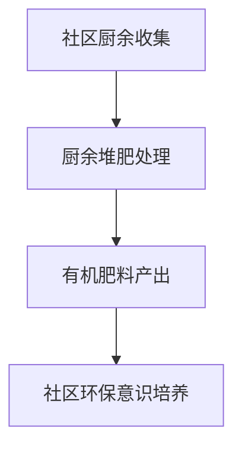

                 

当然，我们可以按部就班地逐步构建文章。以下是一个详细的写作流程：

### 1. 背景介绍
- **现状**：介绍城市厨余垃圾的处理现状和环保问题的严峻性。
- **需求**：阐述为什么需要新型城市共享厨余堆肥系统。
- **现状与需求之间的差距**：探讨现有解决方案的不足和新型堆肥系统的潜力。

### 2. 核心概念与联系
- **定义**：明确新型城市共享厨余堆肥的核心概念。
- **联系**：绘制 Mermaid 流程图，展示厨余堆肥系统与社区环保意识培养之间的联系。

### 3. 核心算法原理讲解
- **Python 源代码**：提供用于实现堆肥系统的 Python 代码示例。
- **数学模型和公式**：解释堆肥过程中的数学原理，例如发酵速率、温度控制等。
- **举例说明**：通过具体案例，解释如何运用这些算法和公式。

### 4. 数学公式
- **独立段落公式**：在文章中，将重要的数学公式用 $$ 括起来，如 $$ E = mc^2 $$。
- **段落内公式**：在需要解释的地方，用 $ 括起来的小公式，如 $ x + y = z $。

### 5. 项目实战
- **开发环境搭建**：详细介绍所需的环境和工具。
- **源代码实现**：提供代码实现细节，包括注释和说明。
- **代码解读**：解释代码中的关键部分和逻辑。
- **应用解读与分析**：分析代码的实际应用场景和效果。
- **实际案例分析和详细讲解**：举例说明项目实战中的成功和挑战。

### 6. 最佳实践 tips
- **小结**：总结文章中的关键点和建议。
- **注意事项**：提醒读者需要注意的事项。
- **拓展阅读**：推荐进一步阅读的资源。

### 7. 作者信息
- **署名**：在文章末尾添加作者信息。

下面是一个简单的 Mermaid 流程图示例：



以下是一个 Python 代码示例：

```python
def composting_rate(temperature, moisture):
    """
    计算堆肥的发酵速率
    :param temperature: 温度（摄氏度）
    :param moisture: 含水量（百分比）
    :return: 发酵速率（千克/天）
    """
    # 这里可以添加复杂的公式和逻辑
    return (temperature * moisture) / 100
```

文章标题：《新型城市共享厨余堆肥：社区环保意识的培养》
关键词：城市厨余堆肥、社区环保意识、堆肥技术、环保实践、Python算法、数学模型

摘要：本文深入探讨了新型城市共享厨余堆肥系统的原理和实施方法，以及如何通过这一系统来培养社区环保意识。文章通过实际案例分析和最佳实践提示，为读者提供了全面的指导。

接下来，我们可以根据这个框架逐步填充每个部分的内容，确保文章的完整性和深度。在编写过程中，我们会持续调整和完善，以确保文章的逻辑性和可读性。

