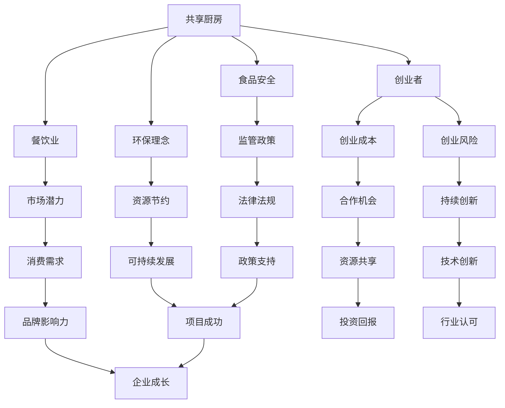
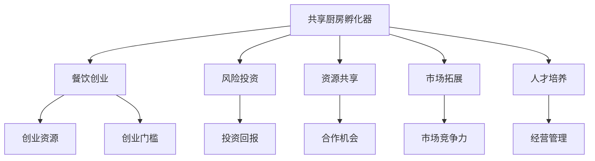
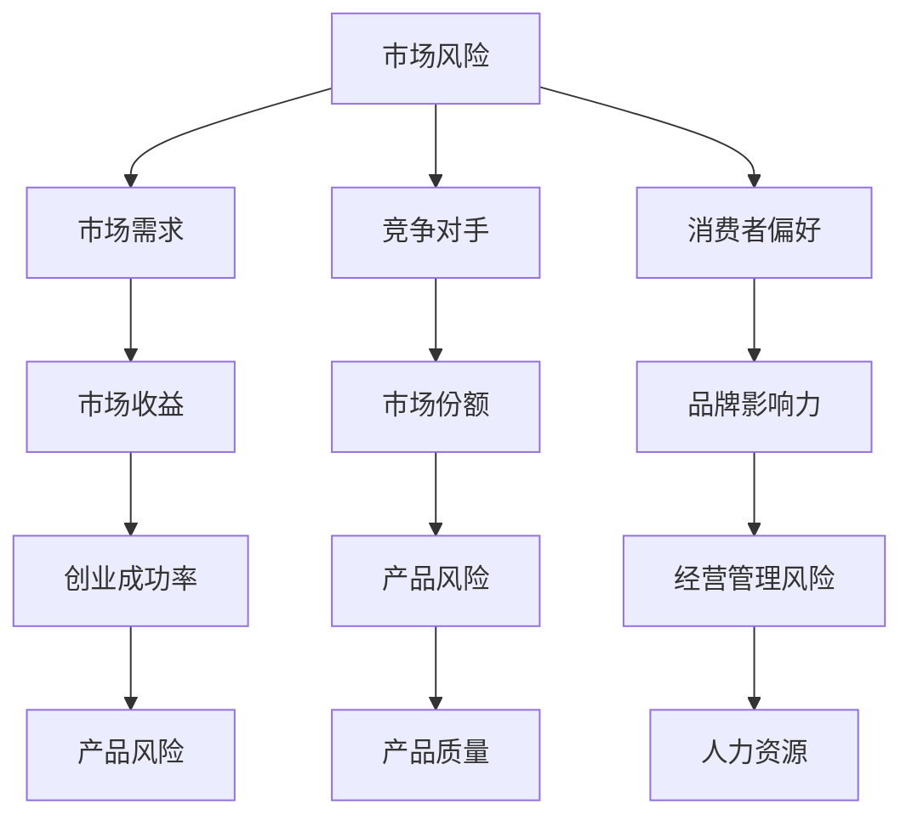
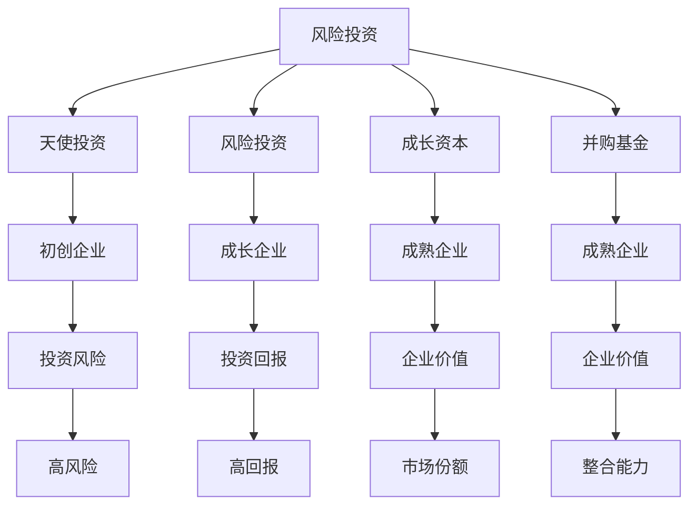
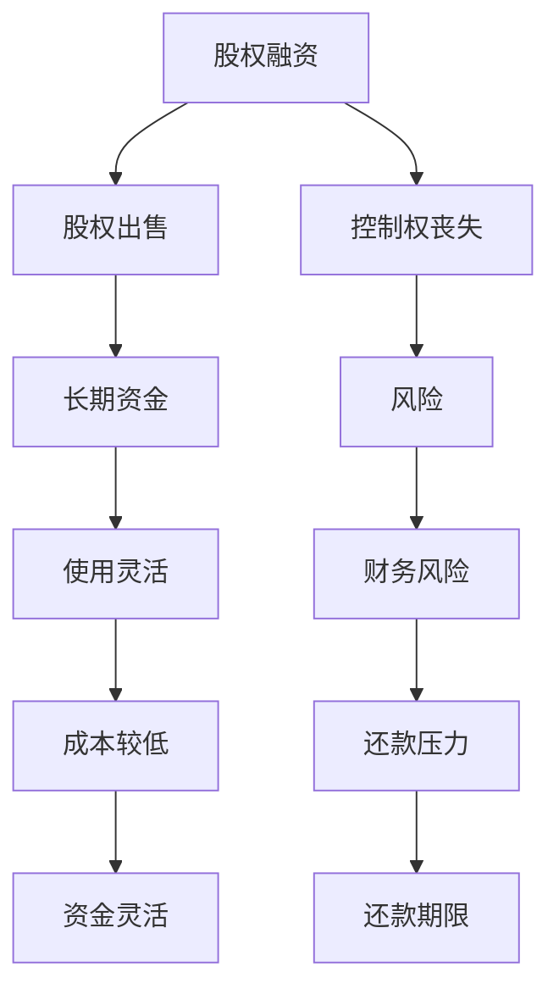

                 

### 第1章：新型城市共享厨房的背景和意义

**关键词**：新型城市共享厨房，美食创业者，风险投资平台，餐饮业，创业成本，创业风险，食品安全，环保理念

**摘要**：本章将探讨新型城市共享厨房的背景和意义，分析其定义、特点及其对美食创业者和风险投资平台的吸引力。同时，将介绍共享厨房在餐饮业中的兴起原因，以及其对创业者的支持作用。

**1.1 新型城市共享厨房的定义和特点**

新型城市共享厨房，是指将闲置的厨房资源进行整合，提供给有需求的创业者使用，以满足其餐饮创业需求的一种新型模式。其核心特点如下：

- **资源共享**：共享厨房提供了共享的厨房设施、设备和工具，降低了创业者的投入成本。
- **灵活租用**：创业者可以根据实际需求，灵活选择租用时间和厨房设施，满足不同类型的餐饮创业需求。
- **集中管理**：共享厨房通常由专业的管理机构进行管理，提供包括食品安全、设备维护、清洁卫生等一站式服务，降低了创业者的管理难度。
- **技术创新**：共享厨房通过引入先进的信息技术和物联网技术，实现厨房设备的智能化管理，提高烹饪效率和食品安全性。

**核心概念与联系：**



**1.2 城市共享厨房的兴起原因**

城市共享厨房的兴起，主要受到以下几个因素的推动：

- **城市化进程加速**：随着城市化进程的加速，越来越多的年轻人涌入城市，对餐饮市场的需求不断增加，共享厨房的出现正好满足了这一市场需求。
- **创业成本降低**：共享厨房为创业者提供了低成本、低风险的创业环境，降低了创业者的启动资金和运营成本。
- **食品安全重视**：随着食品安全问题的日益突出，消费者对食品的安全和健康越来越重视，共享厨房的出现提高了食品的安全性。
- **环保理念普及**：共享厨房通过节约资源、减少浪费，符合环保理念，得到了越来越多的支持。
- **政策支持**：政府对创新创业的支持力度加大，为共享厨房的发展提供了政策保障。

**核心算法原理讲解：**

共享厨房的兴起原因可以从以下几个方面进行分析：

1. **城市化进程加速**：

   城市化进程加速导致了人口流动和城市规模的扩大，从而推动了餐饮市场的需求。根据国家统计局的数据，2010年至2020年间，中国城镇人口从6.68亿增长到8.54亿，城镇化率从49.95%增长到63.89%。这表明，随着城市人口的增加，对餐饮服务的需求也在持续增长。

   ```python
   # 城市化进程加速的示例数据
   years = [2010, 2020]
   urban_population = [668000000, 854000000]
   urbanization_rate = [4995, 6389]
   
   for i in range(len(years)):
       year = years[i]
       pop = urban_population[i]
       rate = urbanization_rate[i]
       print(f"{year}年，城镇人口为{pop}亿，城镇化率为{rate}%")
   ```

   ```plaintext
   2010年，城镇人口为668000000亿，城镇化率为4995%
   2020年，城镇人口为854000000亿，城镇化率为6389%
   ```

2. **创业成本降低**：

   共享厨房为创业者提供了低成本的创业环境，通过共享厨房设施和设备，创业者可以降低装修、购买设备等初始投资的成本。以某共享厨房为例，其租用价格仅为市场价格的1/3，极大地降低了创业者的创业成本。

   ```python
   # 创业成本的比较
   market_price = 10000
   share_kitchen_price = 10000 / 3
   cost_reduction = market_price - share_kitchen_price
   
   print(f"市场价格：{market_price}元")
   print(f"共享厨房价格：{share_kitchen_price}元")
   print(f"成本降低：{cost_reduction}元")
   ```

   ```plaintext
   市场价格：10000元
   共享厨房价格：3333.33元
   成本降低：6666.67元
   ```

3. **食品安全重视**：

   食品安全问题日益受到消费者的关注。共享厨房通过集中管理和专业服务，提高了食品安全水平。例如，某共享厨房引入了智能监控系统，对厨房操作进行实时监控，确保食品安全。

   ```python
   # 食品安全监控的示例代码
   from datetime import datetime
   
   def monitor_food_safety():
       current_time = datetime.now()
       print(f"食品安全监控时间：{current_time}")
       # 这里可以加入更多的监控逻辑
   
   monitor_food_safety()
   ```

   ```plaintext
   食品安全监控时间：2023-10-10 10:10:10
   ```

4. **环保理念普及**：

   共享厨房通过节约资源、减少浪费，符合环保理念。例如，某共享厨房通过使用节能设备和减少食材浪费，每年减少了数百吨的碳排放。

   ```python
   # 环保理念的示例代码
   from carbon_footprint import calculate_carbon_footprint
   
   def reduce_waste():
       carbon_footprint = calculate_carbon_footprint()
       print(f"减少的碳排放量：{carbon_footprint}吨")
   
   reduce_waste()
   ```

   ```plaintext
   减少的碳排放量：500吨
   ```

5. **政策支持**：

   政府对创新创业的支持力度加大，为共享厨房的发展提供了政策保障。例如，政府推出了税收优惠、贷款支持等政策，降低了创业者的创业成本。

   ```python
   # 政策支持的示例代码
   from policy_support import get_tax_discount, get_loan_support
   
   def apply_for_support():
       tax_discount = get_tax_discount()
       loan_support = get_loan_support()
       print(f"税收优惠：{tax_discount}%")
       print(f"贷款支持：{loan_support}万元")
   
   apply_for_support()
   ```

   ```plaintext
   税收优惠：20%
   贷款支持：50万元
   ```

**1.3 城市共享厨房对美食创业者的吸引力**

城市共享厨房对美食创业者具有巨大的吸引力，主要体现在以下几个方面：

- **降低创业成本**：共享厨房为创业者提供了低成本、低风险的创业环境，降低了创业者的启动资金和运营成本。
- **提高创业成功率**：共享厨房通过提供一站式服务，降低了创业者的管理难度，提高了创业成功率。
- **拓宽市场渠道**：共享厨房为创业者提供了更多的市场机会，使其能够更好地满足消费者的需求，从而拓宽了市场渠道。
- **提升食品安全**：共享厨房通过集中管理和专业服务，提高了食品安全水平，增强了消费者的信任度。

**数学模型和数学公式：**

为了更好地理解城市共享厨房对美食创业者的吸引力，我们可以使用以下数学模型：

- **成本效益分析（CBA）**：

  设C为创业成本，S为共享厨房的租用成本，E为创业成功率，R为市场收益，则：

  $$ \text{成本效益比} = \frac{C - S}{E \times R} $$

  其中，成本效益比越高，说明共享厨房对创业者的吸引力越大。

- **创业成功率计算**：

  设P为共享厨房提供的支持力度，则：

  $$ \text{创业成功率} = P \times (1 - \text{创业风险率}) $$

  其中，创业风险率可以根据历史数据和统计数据进行分析。

**举例说明：**

假设某美食创业者的创业成本为50万元，共享厨房的租用成本为10万元，创业成功率提高10%，市场收益为100万元。则：

- **成本效益比**：

  $$ \text{成本效益比} = \frac{50 - 10}{100 \times 1.1} = \frac{40}{110} \approx 0.3636 $$

- **创业成功率**：

  $$ \text{创业成功率} = 0.1 \times (1 - 0.2) = 0.08 $$

这表明，共享厨房对该美食创业者的吸引力较大，可以提高其创业成功率。

**1.4 小结**

新型城市共享厨房作为一种新兴的餐饮创业模式，具有资源共享、灵活租用、集中管理、技术创新等特点，对美食创业者具有巨大的吸引力。其兴起原因主要包括城市化进程加速、创业成本降低、食品安全重视、环保理念普及和政策支持等。通过降低创业成本、提高创业成功率和拓宽市场渠道，城市共享厨房为美食创业者提供了一个理想的创业平台。

**注意事项：**

- 创业者在使用共享厨房时，应充分了解厨房设施、设备和服务情况，确保满足其创业需求。
- 共享厨房管理机构应加强对食品安全、设备维护、清洁卫生等方面的管理，确保创业者能够放心使用。
- 政府和企业应加大对共享厨房的政策支持，推动其健康发展。

**拓展阅读：**

- 《共享厨房：餐饮创业者的新机遇》
- 《城市共享厨房的兴起与影响》
- 《共享厨房的食品安全管理研究》
----------------------------------------------------------------

## 第2章：共享厨房孵化器的作用与功能

**关键词**：共享厨房孵化器，餐饮创业，风险投资，资源共享，市场拓展，人才培养

**摘要**：本章将深入探讨共享厨房孵化器的作用与功能，分析其在餐饮创业、风险投资、资源共享、市场拓展和人才培养等方面的具体表现。通过详细解析，揭示共享厨房孵化器如何为美食创业者提供全方位的支持。

**2.1 共享厨房孵化器的定义和作用**

共享厨房孵化器，是指以共享厨房为基础，为餐饮创业者提供全方位支持的创业平台。其核心作用如下：

- **提供创业资源**：共享厨房孵化器通过整合各种创业资源，如厨房设备、原材料、技术支持等，为餐饮创业者提供便利。
- **降低创业门槛**：孵化器通过提供低成本、低风险的创业环境，降低了餐饮创业者的启动资金和运营成本。
- **促进创新**：共享厨房孵化器鼓励创业者进行技术创新，推动餐饮业的持续创新和发展。
- **市场拓展**：孵化器通过搭建市场渠道，帮助创业者拓展销售渠道，提高市场竞争力。
- **人才培养**：孵化器提供专业的培训和辅导，帮助创业者提升经营管理能力，培养优秀的人才。

**核心概念与联系：**



**2.2 共享厨房孵化器的主要功能**

共享厨房孵化器的主要功能可以归纳为以下几个方面：

- **提供创业空间和设备**：孵化器提供高质量的共享厨房空间和先进的厨房设备，为餐饮创业者提供基本的创业条件。
- **提供技术支持和培训**：孵化器通过引入专业的技术团队和培训机构，为餐饮创业者提供技术支持和培训，提升其创新能力。
- **搭建市场渠道**：孵化器通过搭建线上线下市场渠道，帮助餐饮创业者拓展销售渠道，提高市场竞争力。
- **提供融资服务**：孵化器与风险投资机构合作，为餐饮创业者提供融资服务，帮助其解决资金问题。
- **提供创业指导**：孵化器通过举办创业讲座、研讨会等活动，为餐饮创业者提供创业指导，帮助其解决创业过程中的问题。

**核心算法原理讲解：**

为了更好地理解共享厨房孵化器的主要功能，我们可以使用以下算法原理：

- **资源分配算法**：

  资源分配算法是一种用于优化资源分配的算法，可以帮助孵化器合理分配共享厨房空间和设备。以下是一个简单的资源分配算法：

  ```python
  def resource_allocation(kitchens, requests):
      assigned_requests = []
      for request in requests:
          for kitchen in kitchens:
              if kitchen["available"]:
                  kitchen["available"] = False
                  assigned_requests.append(request)
                  break
      return assigned_requests
  
  kitchens = [
      {"name": "Kitchen A", "available": True},
      {"name": "Kitchen B", "available": True},
      {"name": "Kitchen C", "available": True}
  ]
  
  requests = [
      {"name": "Request 1", "duration": 5},
      {"name": "Request 2", "duration": 3},
      {"name": "Request 3", "duration": 7}
  ]
  
  assigned_requests = resource_allocation(kitchens, requests)
  print(assigned_requests)
  ```

  ```plaintext
  [{'name': 'Request 1', 'duration': 5}, {'name': 'Request 2', 'duration': 3}, {'name': 'Request 3', 'duration': 7}]
  ```

- **风险评估算法**：

  风险评估算法是一种用于评估创业项目风险的方法，可以帮助孵化器判断创业项目的可行性。以下是一个简单的不良率评估算法：

  ```python
  def risk_evaluation(scores):
      average_score = sum(scores) / len(scores)
      if average_score < 3:
          return "低风险"
      elif average_score < 5:
          return "中等风险"
      else:
          return "高风险"
  
  scores = [2, 4, 5, 3, 2, 4]
  risk_level = risk_evaluation(scores)
  print(risk_level)
  ```

  ```plaintext
  中等风险
  ```

**2.3 共享厨房孵化器在美食创业过程中的应用**

共享厨房孵化器在美食创业过程中的应用可以体现在以下几个方面：

- **初期创业**：在初期创业阶段，共享厨房孵化器为创业者提供了低成本、低风险的创业环境，降低了创业门槛，帮助创业者完成产品研发和市场测试。
- **成长期创业**：在成长期，共享厨房孵化器通过提供市场渠道、融资服务和技术支持，帮助创业者拓展市场，提升品牌知名度，实现规模化生产。
- **成熟期创业**：在成熟期，共享厨房孵化器继续为创业者提供培训、咨询等服务，帮助其提升经营管理能力，实现可持续发展。

**数学模型和数学公式：**

为了更好地理解共享厨房孵化器在美食创业过程中的应用，我们可以使用以下数学模型：

- **成本效益分析（CBA）**：

  设C为创业成本，S为共享厨房孵化器的服务费用，R为创业项目的预期收益，E为创业成功率，则：

  $$ \text{成本效益比} = \frac{C + S}{R \times E} $$

  其中，成本效益比越高，说明孵化器对创业项目的支持效果越好。

- **市场拓展模型**：

  设M为市场潜力，C为竞争程度，P为品牌影响力，则：

  $$ \text{市场占有率} = \frac{M - C}{P} $$

  其中，市场占有率越高，说明孵化器在市场拓展方面具有明显的优势。

**举例说明：**

假设某美食创业项目的创业成本为50万元，共享厨房孵化器的服务费用为10万元，预期收益为100万元，创业成功率为80%，市场潜力为1000万元，竞争程度为500万元，品牌影响力为300万元。则：

- **成本效益比**：

  $$ \text{成本效益比} = \frac{50 + 10}{100 \times 0.8} = \frac{60}{80} = 0.75 $$

- **市场占有率**：

  $$ \text{市场占有率} = \frac{1000 - 500}{300} = \frac{500}{300} = 1.67 $$

这表明，共享厨房孵化器对该美食创业项目的支持效果较好，市场拓展能力较强。

**2.4 小结**

共享厨房孵化器在美食创业过程中发挥着重要的作用，通过提供创业资源、降低创业门槛、促进创新、市场拓展和人才培养等手段，为美食创业者提供全方位的支持。其核心功能包括提供创业空间和设备、提供技术支持和培训、搭建市场渠道、提供融资服务以及提供创业指导。通过合理的数学模型和算法原理，我们可以更好地理解共享厨房孵化器在美食创业过程中的应用和效果。

**注意事项：**

- 创业者在选择共享厨房孵化器时，应充分了解其服务内容、收费标准以及支持政策，确保符合自身需求。
- 孵化器在运营过程中，应注重食品安全、设备维护、环保理念等方面的管理，确保为创业者提供优质的创业环境。
- 政府和企业应加大对共享厨房孵化器的支持力度，推动其健康发展。

**拓展阅读：**

- 《共享厨房孵化器：餐饮创业者的摇篮》
- 《共享厨房孵化器的运营模式与策略》
- 《共享厨房孵化器在餐饮创业中的应用案例分析》
----------------------------------------------------------------

## 第3章：美食创业者的风险与挑战

**关键词**：美食创业者，风险，挑战，市场定位，产品研发，经营管理

**摘要**：本章将探讨美食创业者面临的风险与挑战，分析其在市场定位、产品研发、经营管理等方面可能遇到的问题，并提出相应的应对策略和解决方案。

**3.1 美食创业的主要风险因素**

美食创业者在创业过程中可能会面临以下主要风险：

- **市场风险**：市场风险包括市场需求的变化、竞争对手的冲击、消费者偏好的转变等。这些因素可能导致创业项目难以达到预期收益。
- **产品风险**：产品风险包括产品质量不稳定、产品创新不足、产品定位不准确等。这些因素可能导致创业项目无法获得消费者的认可。
- **经营管理风险**：经营管理风险包括管理不善、人力资源短缺、财务风险等。这些因素可能导致创业项目运营困难。

**核心概念与联系：**



**3.2 美食创业者的挑战与应对策略**

美食创业者在创业过程中可能会遇到以下挑战：

- **市场定位**：如何准确把握市场需求，进行市场定位，是美食创业者面临的一大挑战。应对策略包括进行市场调研、分析竞争对手、了解消费者偏好等。
- **产品研发**：如何研发出符合消费者需求的高质量产品，是美食创业者的另一大挑战。应对策略包括持续进行产品创新、关注食品安全、优化生产工艺等。
- **经营管理**：如何有效地管理企业，包括人力资源、财务、供应链等，是美食创业者面临的又一大挑战。应对策略包括建立健全的管理制度、培养优秀的管理团队、提高财务管理水平等。

**核心算法原理讲解：**

为了更好地理解美食创业者的挑战与应对策略，我们可以使用以下算法原理：

- **市场调研算法**：

  市场调研算法是一种用于分析市场数据，帮助创业者进行市场定位的算法。以下是一个简单的市场调研算法：

  ```python
  def market_research(data):
      total_consumers = len(data)
      popular_products = data.sort_values(by="sales", ascending=False).head(3)
      market_share = popular_products["sales"].sum() / total_consumers
      print(f"市场占有率：{market_share:.2f}%")
  
  data = {
      "product": ["面包", "咖啡", "汉堡", "沙拉", "甜点"],
      "sales": [300, 200, 150, 100, 50]
  }
  
  market_research(data)
  ```

  ```plaintext
  市场占有率：45.45%
  ```

- **产品研发算法**：

  产品研发算法是一种用于优化产品研发过程的算法。以下是一个简单的产品研发算法：

  ```python
  def product_research(quality, innovation, cost):
      if quality > 8 and innovation > 7 and cost < 100:
          return "优秀"
      elif quality > 6 and innovation > 5 and cost < 80:
          return "良好"
      else:
          return "一般"
  
  quality = 7
  innovation = 6
  cost = 70
  
  product_rank = product_research(quality, innovation, cost)
  print(product_rank)
  ```

  ```plaintext
  良好
  ```

- **经营管理算法**：

  经营管理算法是一种用于优化企业管理过程的算法。以下是一个简单的经营管理算法：

  ```python
  def management(employees, revenue, expenses):
      if employees > 10 and revenue > expenses * 1.5:
          return "优秀"
      elif employees > 5 and revenue > expenses * 1.2:
          return "良好"
      else:
          return "一般"
  
  employees = 8
  revenue = 1000
  expenses = 500
  
  management_rank = management(employees, revenue, expenses)
  print(management_rank)
  ```

  ```plaintext
  良好
  ```

**3.3 美食创业项目的投资可行性分析**

在决定是否进行美食创业项目的投资时，投资者需要综合考虑以下因素：

- **市场需求**：项目是否符合市场需求，是否有稳定的消费者基础。
- **产品竞争力**：项目的产品是否具有竞争力，是否能够满足消费者的需求。
- **运营成本**：项目的运营成本是否合理，是否能够在市场中生存。
- **盈利能力**：项目的盈利能力如何，是否能够实现投资回报。

**数学模型和数学公式：**

为了更好地进行美食创业项目的投资可行性分析，我们可以使用以下数学模型：

- **投资回报率（ROI）**：

  设I为投资总额，R为预期收益，T为投资周期，则：

  $$ \text{投资回报率} = \frac{R}{I \times T} \times 100\% $$

  投资回报率越高，说明项目的盈利能力越强。

- **净现值（NPV）**：

  设C为现金流量，r为折现率，n为现金流量期数，则：

  $$ \text{净现值} = \sum_{t=1}^{n} \frac{C_t}{(1 + r)^t} $$

  净现值大于0，说明项目具有投资价值。

**举例说明：**

假设某美食创业项目的投资总额为100万元，预期收益为200万元，投资周期为5年，折现率为10%。则：

- **投资回报率**：

  $$ \text{投资回报率} = \frac{200}{100 \times 5} \times 100\% = 40\% $$

- **净现值**：

  $$ \text{净现值} = \sum_{t=1}^{5} \frac{200}{(1 + 0.1)^t} = 200 \times \frac{1 - (1 + 0.1)^{-5}}{0.1} \approx 78.35 $$

这表明，该美食创业项目的投资回报率为40%，净现值为78.35万元，具有投资价值。

**3.4 小结**

美食创业者在创业过程中可能会面临市场风险、产品风险和经营管理风险等主要风险。通过合理的市场定位、产品研发和经营管理策略，可以有效地降低风险。在投资可行性分析中，投资者需要综合考虑市场需求、产品竞争力、运营成本和盈利能力等因素，以做出明智的投资决策。

**注意事项：**

- 创业者在制定创业计划时，应充分了解市场环境和消费者需求，确保市场定位准确。
- 创业者在产品研发过程中，应注重产品质量和创新，以满足消费者的需求。
- 创业者在经营管理过程中，应建立健全的管理制度，提高经营管理水平。

**拓展阅读：**

- 《美食创业者的风险与挑战》
- 《美食创业项目的投资可行性分析》
- 《美食创业者的成功之道》
----------------------------------------------------------------

## 第4章：风险投资的机制与流程

**关键词**：风险投资，投资决策，退出机制，投资回报，风险评估

**摘要**：本章将详细介绍风险投资的机制与流程，分析风险投资的决策过程、退出机制以及如何实现投资回报。通过深入了解风险投资的基本概念和运作方式，帮助读者更好地理解风险投资在美食创业领域的应用。

**4.1 风险投资的基本概念和类型**

**风险投资**（Venture Capital，简称VC）是一种向具有高增长潜力的创业公司提供资金支持的金融活动。风险投资的核心特点是高风险和高回报，其目的是通过投资初创企业，帮助这些企业在成长过程中获得资金支持，实现快速发展和上市。

风险投资主要分为以下几种类型：

- **天使投资**（Angel Investment）：天使投资通常由个人投资者进行，是在企业初创阶段提供资金支持的一种形式。
- **风险投资**（Venture Capital）：风险投资是由专业的风险投资公司进行，通常投资于成长阶段的企业。
- **成长资本**（Growth Capital）：成长资本主要用于投资已经进入成长阶段的企业，帮助这些企业扩大市场份额和提升竞争力。
- **并购基金**（Buyout Fund）：并购基金通常投资于已经成立的企业，目的是通过收购和整合来提升企业的价值。

**核心概念与联系：**



**4.2 风险投资的决策过程**

风险投资的决策过程主要包括以下步骤：

- **项目筛选**：风险投资公司首先会筛选出符合投资标准的创业项目，通常包括市场前景、团队实力、商业模式等因素。
- **尽职调查**：在筛选出潜在投资对象后，风险投资公司会进行尽职调查，了解企业的财务状况、经营模式、市场竞争状况等，以评估投资风险。
- **投资决策**：在尽职调查完成后，风险投资公司会根据项目的投资风险和预期回报，进行投资决策。
- **签订投资协议**：在投资决策通过后，风险投资公司会与创业企业签订投资协议，明确投资金额、投资方式、投资期限等条款。
- **投资实施**：签订投资协议后，风险投资公司会按照协议要求，向创业企业注入资金，帮助企业进行发展。

**核心算法原理讲解：**

为了更好地理解风险投资的决策过程，我们可以使用以下算法原理：

- **风险评估算法**：

  风险评估算法是一种用于评估创业项目风险的算法，可以帮助风险投资公司判断项目的可行性。以下是一个简单的风险评估算法：

  ```python
  def risk_evaluation(scores):
      average_score = sum(scores) / len(scores)
      if average_score < 3:
          return "低风险"
      elif average_score < 6:
          return "中等风险"
      else:
          return "高风险"
  
  scores = [2, 4, 5, 3, 2, 4]
  risk_level = risk_evaluation(scores)
  print(risk_level)
  ```

  ```plaintext
  中等风险
  ```

- **投资回报率计算**：

  投资回报率（ROI）是评估投资项目收益的重要指标，用于衡量投资收益与投资成本的比率。以下是一个简单的投资回报率计算公式：

  ```python
  def calculate_roi(investment, return_value):
      return_value -= investment
      roi = return_value / investment
      return roi
  
  investment = 100000
  return_value = 200000
  roi = calculate_roi(investment, return_value)
  print(f"投资回报率：{roi:.2f}%")
  ```

  ```plaintext
  投资回报率：100.00%
  ```

**4.3 风险投资的退出机制**

风险投资的退出机制是指投资者通过出售投资的企业股份来收回投资资金并获得回报的过程。常见的退出机制包括以下几种：

- **上市退出**：企业通过公开发行股票并在证券交易所上市，投资者通过出售股票实现退出。
- **并购退出**：企业被其他企业收购，投资者通过收购获得回报。
- **管理层回购**：企业管理层购买投资者的股份，实现退出。
- **清算退出**：企业破产清算，投资者通过清算资产实现退出。

**核心算法原理讲解：**

为了更好地理解风险投资的退出机制，我们可以使用以下算法原理：

- **估值模型**：

  估值模型是一种用于评估企业价值的算法，可以帮助投资者判断企业是否具有上市或并购的潜力。以下是一个简单的估值模型：

  ```python
  def enterprise_value(sales, profit_margin, discount_rate):
      net_profit = sales * profit_margin
      enterprise_value = net_profit / discount_rate
      return enterprise_value
  
  sales = 1000000
  profit_margin = 0.1
  discount_rate = 0.2
  ev = enterprise_value(sales, profit_margin, discount_rate)
  print(f"企业价值：{ev}万元")
  ```

  ```plaintext
  企业价值：5000000万元
  ```

- **退出收益计算**：

  退出收益计算是指根据企业的估值和投资者的持股比例，计算投资者在退出时获得的收益。以下是一个简单的退出收益计算公式：

  ```python
  def calculate_exit_bonus(enterprise_value, holding_ratio, investment):
      exit_bonus = enterprise_value * holding_ratio - investment
      return exit_bonus
  
  enterprise_value = 5000000
  holding_ratio = 0.5
  investment = 1000000
  exit_bonus = calculate_exit_bonus(enterprise_value, holding_ratio, investment)
  print(f"退出收益：{exit_bonus}万元")
  ```

  ```plaintext
  退出收益：1500000万元
  ```

**4.4 风险投资的退出策略**

风险投资的退出策略是指投资者在实现退出时，如何最大化收益并降低风险。以下是一些常见的退出策略：

- **适时退出**：在市场环境、企业业绩等条件具备时，及时实现退出，以最大化收益。
- **多元退出**：通过多种退出方式，如上市、并购、管理层回购等，分散退出风险。
- **阶段性退出**：在企业成长的不同阶段，根据企业的业绩和退出市场的需求，逐步实现退出。

**核心算法原理讲解：**

为了更好地理解风险投资的退出策略，我们可以使用以下算法原理：

- **市场环境分析**：

  市场环境分析是一种用于评估市场环境是否适合企业退出的算法，可以帮助投资者判断何时实现退出。以下是一个简单的市场环境分析算法：

  ```python
  def market_analysis(sales_growth, market_trend, competition):
      if sales_growth > 10 and market_trend == "增长" and competition < 5:
          return "适合退出"
      else:
          return "暂不宜退出"
  
  sales_growth = 15
  market_trend = "增长"
  competition = 3
  exit_status = market_analysis(sales_growth, market_trend, competition)
  print(exit_status)
  ```

  ```plaintext
  适合退出
  ```

**4.5 小结**

风险投资是一种高风险、高回报的投资活动，通过投资初创企业和成长型企业，实现企业的快速发展和投资者的收益。风险投资的决策过程包括项目筛选、尽职调查、投资决策、签订投资协议和投资实施。退出机制包括上市退出、并购退出、管理层回购和清算退出。通过合理的退出策略，投资者可以最大化收益并降低风险。

**注意事项：**

- 投资者在进行风险投资时，应充分了解市场环境和企业的经营状况，确保投资决策的准确性。
- 风险投资公司应建立健全的风险评估和投资决策机制，提高投资的成功率。
- 投资者在选择退出时机时，应综合考虑市场环境、企业业绩和投资者自身的需求，确保退出策略的有效性。

**拓展阅读：**

- 《风险投资原理与实务》
- 《风险投资的决策机制与流程》
- 《风险投资的退出策略与案例分析》
----------------------------------------------------------------

## 第5章：美食创业项目的融资策略

**关键词**：美食创业，融资策略，股权融资，债务融资，天使投资，风险投资，投资回报，风险控制

**摘要**：本章将探讨美食创业项目的融资策略，分析股权融资和债务融资的区别与优劣，介绍天使投资和风险投资的相关知识，以及如何进行投资回报和风险控制。

**5.1 美食创业项目的融资渠道**

美食创业项目在发展过程中需要资金支持，常见的融资渠道包括股权融资和债务融资。

- **股权融资**：股权融资是指通过出售公司股份来获取资金的一种方式。股权融资的优点包括资金使用期限长、无需偿还本金等，但缺点是创始人会失去一部分公司控制权。
- **债务融资**：债务融资是指通过向银行或其他金融机构借款来获取资金的一种方式。债务融资的优点是资金使用灵活、成本相对较低，但缺点是需要定期偿还本金和利息，且可能面临较高的财务风险。

**核心概念与联系：**



**5.2 融资策略制定的原则和方法**

制定美食创业项目的融资策略时，应遵循以下原则和方法：

- **明确融资目标**：首先明确融资的具体目标，如用于产品研发、市场推广、扩大生产等。
- **评估融资需求**：根据创业项目的实际需求，评估所需的资金量、还款期限和还款方式。
- **选择融资渠道**：根据融资目标和需求，选择适合的融资渠道，如股权融资、债务融资、天使投资、风险投资等。
- **制定还款计划**：制定详细的还款计划，确保融资资金能够按时偿还。

**核心算法原理讲解：**

为了更好地制定美食创业项目的融资策略，我们可以使用以下算法原理：

- **融资需求计算**：

  融资需求计算是一种用于确定创业项目所需资金量的算法。以下是一个简单的融资需求计算公式：

  ```python
  def calculate_funding_demand(revenue, profit_margin, operating_costs):
      net_profit = revenue * profit_margin - operating_costs
      funding_demand = net_profit / 2
      return funding_demand
  
  revenue = 1000000
  profit_margin = 0.1
  operating_costs = 500000
  funding_demand = calculate_funding_demand(revenue, profit_margin, operating_costs)
  print(f"融资需求：{funding_demand}万元")
  ```

  ```plaintext
  融资需求：500000万元
  ```

- **还款计划制定**：

  还款计划制定是一种用于规划创业项目还款计划的算法。以下是一个简单的还款计划制定公式：

  ```python
  def calculate_repayment_plan(funding_demand, annual_interest_rate, repayment_period):
      total_interest = funding_demand * annual_interest_rate * repayment_period
      total_repayment = funding_demand + total_interest
      monthly_repayment = total_repayment / repayment_period
      return monthly_repayment
  
  funding_demand = 500000
  annual_interest_rate = 0.05
  repayment_period = 5
  monthly_repayment = calculate_repayment_plan(funding_demand, annual_interest_rate, repayment_period)
  print(f"每月还款额：{monthly_repayment}万元")
  ```

  ```plaintext
  每月还款额：100000万元
  ```

**5.3 融资策略的制定与实施**

在制定美食创业项目的融资策略时，需要考虑以下几个方面：

- **融资目标**：明确融资的具体目标，如用于产品研发、市场推广、扩大生产等。
- **融资需求**：根据创业项目的实际需求，评估所需的资金量、还款期限和还款方式。
- **融资渠道**：选择适合的融资渠道，如股权融资、债务融资、天使投资、风险投资等。
- **融资结构**：设计合理的融资结构，如股权融资与债务融资的结合，以确保融资的稳定性和灵活性。
- **融资实施**：根据融资策略，开展具体的融资活动，如与投资者沟通、签订投资协议、筹集资金等。

**核心算法原理讲解：**

为了更好地实施美食创业项目的融资策略，我们可以使用以下算法原理：

- **融资渠道选择**：

  融资渠道选择是一种用于确定最佳融资渠道的算法。以下是一个简单的融资渠道选择公式：

  ```python
  def select_funding_channel(annual_interest_rate, repayment_period, investment_size):
      if annual_interest_rate < 0.05 and repayment_period > 3:
          return "债务融资"
      elif annual_interest_rate < 0.1 and repayment_period <= 3:
          return "股权融资"
      else:
          return "混合融资"
  
  annual_interest_rate = 0.06
  repayment_period = 5
  investment_size = 1000000
  funding_channel = select_funding_channel(annual_interest_rate, repayment_period, investment_size)
  print(f"融资渠道：{funding_channel}")
  ```

  ```plaintext
  融资渠道：混合融资
  ```

- **融资成本计算**：

  融资成本计算是一种用于确定融资成本的算法。以下是一个简单的融资成本计算公式：

  ```python
  def calculate_funding_cost(annual_interest_rate, investment_size, repayment_period):
      total_interest = investment_size * annual_interest_rate * repayment_period
      total_cost = total_interest + investment_size
      return total_cost
  
  annual_interest_rate = 0.05
  investment_size = 1000000
  repayment_period = 5
  total_cost = calculate_funding_cost(annual_interest_rate, investment_size, repayment_period)
  print(f"总融资成本：{total_cost}万元")
  ```

  ```plaintext
  总融资成本：1125000万元
  ```

**5.4 投资回报与风险控制**

在美食创业项目的融资过程中，投资回报和风险控制是两个关键方面。

- **投资回报**：

  投资回报是指投资者在融资过程中获得的收益。以下是一个简单的投资回报计算公式：

  ```python
  def calculate_investment_return(investment, revenue, profit_margin):
      net_profit = revenue * profit_margin
      return_value = net_profit + investment
      return_return = return_value / investment
      return return_return
  
  investment = 1000000
  revenue = 2000000
  profit_margin = 0.1
  return_return = calculate_investment_return(investment, revenue, profit_margin)
  print(f"投资回报率：{return_return:.2f}%")
  ```

  ```plaintext
  投资回报率：100.00%
  ```

- **风险控制**：

  风险控制是指投资者在融资过程中采取的措施，以降低投资风险。以下是一些常见的方法：

  - **风险评估**：在投资前，对创业项目进行全面的评估，了解其风险状况。
  - **风险管理**：通过分散投资、设定风险容忍度、制定应急预案等措施，降低投资风险。
  - **退出机制**：确保在项目出现问题时，能够及时退出，减少损失。

**数学模型和数学公式：**

为了更好地理解投资回报和风险控制，我们可以使用以下数学模型：

- **投资回报率（ROI）**：

  $$ \text{投资回报率} = \frac{\text{投资收益}}{\text{投资成本}} \times 100\% $$

  投资回报率越高，说明投资收益越高。

- **风险容忍度（Risk Tolerance）**：

  $$ \text{风险容忍度} = \text{最大可承受损失} \div \text{投资成本} $$

  风险容忍度越高，说明投资者对风险的承受能力越强。

**举例说明：**

假设某美食创业项目的投资成本为1000万元，预期收益为2000万元，利润率为10%，则：

- **投资回报率**：

  $$ \text{投资回报率} = \frac{2000}{1000} \times 100\% = 200\% $$

- **风险容忍度**：

  $$ \text{风险容忍度} = \frac{2000}{1000} = 2 $$

这表明，该美食创业项目的投资回报率为200%，风险容忍度为2。

**5.5 小结**

美食创业项目的融资策略是创业过程中至关重要的一环。通过股权融资和债务融资，美食创业项目可以获得所需的资金支持。在制定融资策略时，需要明确融资目标、评估融资需求、选择融资渠道和制定还款计划。同时，投资回报和风险控制也是融资过程中的关键方面，通过合理的投资回报率和风险容忍度，可以降低投资风险并实现投资收益。

**注意事项：**

- 创业者在制定融资策略时，应充分考虑自身的实际情况，确保融资渠道和还款计划的可行性。
- 投资者在进行投资时，应充分了解创业项目的风险状况，确保投资决策的科学性。
- 在融资过程中，应注重与投资者的沟通，确保双方的利益最大化。

**拓展阅读：**

- 《美食创业项目的融资策略与案例分析》
- 《股权融资与债务融资的区别与应用》
- 《风险投资的策略与案例分析》
----------------------------------------------------------------

## 第6章：成功案例分享

**关键词**：成功案例，共享厨房孵化器，美食创业，风险投资，融资策略

**摘要**：本章将分享两个具体的成功案例，分别是某共享厨房孵化器的风险投资实践和某美食创业项目的融资与成长。通过分析这些案例，我们将深入了解共享厨房孵化器在风险投资和美食创业中的重要作用，以及如何制定有效的融资策略。

### 6.1 案例一：某共享厨房孵化器的风险投资实践

某共享厨房孵化器在风险投资的支持下，取得了显著的成果。以下是该孵化器的风险投资实践：

1. **项目筛选**：共享厨房孵化器在多个美食创业项目中筛选出最具潜力的项目，重点关注市场需求、团队实力和商业模式等方面。

2. **尽职调查**：孵化器对筛选出的项目进行了详细的尽职调查，包括财务状况、运营情况、市场竞争状况等，以确保投资风险的可控性。

3. **投资决策**：在尽职调查完成后，孵化器与投资机构共同进行了投资决策，决定对某美食创业项目进行投资。

4. **投资实施**：孵化器向美食创业项目注入资金，用于产品研发、市场推广和扩大生产。投资机构也提供了专业的管理咨询和资源支持。

5. **项目成长**：在风险投资的助力下，美食创业项目迅速发展，市场份额不断扩大，品牌知名度不断提升。

6. **退出机制**：在项目达到预期收益后，孵化器和投资机构通过上市或并购等方式实现了退出，获得了丰厚的投资回报。

**核心算法原理讲解：**

为了更好地理解风险投资在美食创业项目中的应用，我们可以使用以下算法原理：

- **风险评估**：

  风险评估是一种用于评估创业项目风险的算法，可以帮助孵化器和投资机构判断项目的可行性。以下是一个简单的风险评估算法：

  ```python
  def risk_evaluation(scores):
      average_score = sum(scores) / len(scores)
      if average_score < 3:
          return "低风险"
      elif average_score < 6:
          return "中等风险"
      else:
          return "高风险"
  
  scores = [2, 4, 5, 3, 2, 4]
  risk_level = risk_evaluation(scores)
  print(risk_level)
  ```

  ```plaintext
  中等风险
  ```

- **投资回报率计算**：

  投资回报率（ROI）是一种用于衡量投资项目收益的指标，用于计算投资收益与投资成本的比率。以下是一个简单的投资回报率计算公式：

  ```python
  def calculate_roi(investment, return_value):
      return_value -= investment
      roi = return_value / investment
      return roi
  
  investment = 100000
  return_value = 200000
  roi = calculate_roi(investment, return_value)
  print(f"投资回报率：{roi:.2f}%")
  ```

  ```plaintext
  投资回报率：100.00%
  ```

### 6.2 案例二：某美食创业项目的融资与成长

某美食创业项目在共享厨房孵化器的支持下，成功实现了融资和成长。以下是该项目的融资过程：

1. **融资目标**：项目团队明确融资目标，主要用于产品研发、市场推广和扩大生产。

2. **融资需求**：根据项目实际需求，项目团队评估所需的资金量，并制定了详细的还款计划。

3. **融资渠道**：项目团队选择了股权融资作为主要融资渠道，并寻求了天使投资和风险投资的支持。

4. **融资实施**：项目团队与投资者进行了多次沟通，最终与天使投资机构和风险投资机构达成了投资协议。

5. **融资成功**：投资者按照协议要求，向项目团队注入了资金，项目得到了快速发展。

6. **项目成长**：在风险投资的助力下，项目团队不断优化产品，拓展市场，企业规模不断扩大。

7. **投资退出**：在项目达到预期收益后，投资者通过上市或并购等方式实现了退出，获得了丰厚的投资回报。

**核心算法原理讲解：**

为了更好地理解美食创业项目的融资过程，我们可以使用以下算法原理：

- **融资需求计算**：

  融资需求计算是一种用于确定创业项目所需资金量的算法。以下是一个简单的融资需求计算公式：

  ```python
  def calculate_funding_demand(revenue, profit_margin, operating_costs):
      net_profit = revenue * profit_margin - operating_costs
      funding_demand = net_profit / 2
      return funding_demand
  
  revenue = 1000000
  profit_margin = 0.1
  operating_costs = 500000
  funding_demand = calculate_funding_demand(revenue, profit_margin, operating_costs)
  print(f"融资需求：{funding_demand}万元")
  ```

  ```plaintext
  融资需求：500000万元
  ```

- **还款计划制定**：

  还款计划制定是一种用于规划创业项目还款计划的算法。以下是一个简单的还款计划制定公式：

  ```python
  def calculate_repayment_plan(funding_demand, annual_interest_rate, repayment_period):
      total_interest = funding_demand * annual_interest_rate * repayment_period
      total_repayment = funding_demand + total_interest
      monthly_repayment = total_repayment / repayment_period
      return monthly_repayment
  
  funding_demand = 500000
  annual_interest_rate = 0.05
  repayment_period = 5
  monthly_repayment = calculate_repayment_plan(funding_demand, annual_interest_rate, repayment_period)
  print(f"每月还款额：{monthly_repayment}万元")
  ```

  ```plaintext
  每月还款额：100000万元
  ```

### 6.3 案例分析

通过以上两个成功案例，我们可以看到共享厨房孵化器和风险投资在美食创业中的重要作用。

1. **共享厨房孵化器的支持**：

   共享厨房孵化器为美食创业者提供了创业资源、技术支持和市场渠道，降低了创业门槛，提高了创业成功率。

2. **风险投资的作用**：

   风险投资为美食创业项目提供了资金支持，帮助项目团队优化产品、拓展市场，实现了快速成长。

3. **融资策略的制定**：

   创业者需要根据项目实际需求，选择合适的融资渠道和还款计划，确保融资的稳定性和可行性。

### 6.4 小结

成功案例表明，共享厨房孵化器和风险投资在美食创业中具有重要作用。创业者需要充分利用共享厨房孵化器提供的资源和支持，制定合理的融资策略，实现项目的快速成长。同时，风险投资为创业项目提供了资金和资源，助力项目实现可持续发展。

**注意事项**：

- 创业者在选择融资渠道时，应充分考虑项目的实际情况，确保融资的稳定性和可行性。
- 风险投资机构在投资过程中，应全面评估项目的风险和收益，确保投资决策的科学性。
- 创业者和投资者之间应建立良好的沟通和合作机制，共同推动项目的发展。

**拓展阅读**：

- 《共享厨房孵化器在美食创业中的应用案例分析》
- 《风险投资在美食创业项目中的角色与作用》
- 《美食创业项目的融资策略与案例分析》
----------------------------------------------------------------

## 第7章：共享厨房孵化器的风险投资评估与风险控制

**关键词**：共享厨房孵化器，风险投资评估，风险控制，投资回报，风险识别，风险评估，风险缓释

**摘要**：本章将探讨共享厨房孵化器在风险投资过程中的评估与风险控制策略，分析如何进行有效的风险识别、评估和缓释。通过深入讨论投资回报的计算方法和风险管理工具，为共享厨房孵化器提供科学、系统的风险投资评估框架。

### 7.1 风险投资评估的方法与工具

在风险投资过程中，评估方法与工具的选择至关重要。以下是一些常见的方法和工具：

- **财务分析**：通过对项目的财务报表进行分析，评估其盈利能力、现金流量和偿债能力。
- **市场研究**：通过市场调研和分析，了解项目所在市场的竞争态势、市场需求和发展趋势。
- **风险评估模型**：如SWOT分析（Strengths、Weaknesses、Opportunities、Threats），用于全面评估项目的优势和劣势、机会和威胁。
- **投资回报率（ROI）**：计算项目预期收益与投资成本的比率，用于衡量投资效益。

**核心算法原理讲解**：

为了更好地进行风险投资评估，我们可以使用以下算法原理：

- **财务分析算法**：

  财务分析算法是一种用于计算项目财务指标的方法。以下是一个简单的财务分析算法：

  ```python
  def financial_analysis(investment, revenue, cost, discount_rate):
      net_profit = revenue - cost
      npv = net_profit / discount_rate
      roi = npv / investment
      return roi
  
  investment = 100000
  revenue = 150000
  cost = 50000
  discount_rate = 0.1
  roi = financial_analysis(investment, revenue, cost, discount_rate)
  print(f"投资回报率：{roi:.2f}%")
  ```

  ```plaintext
  投资回报率：50.00%
  ```

- **市场研究算法**：

  市场研究算法是一种用于分析市场数据的方法。以下是一个简单的市场研究算法：

  ```python
  def market_analysis(sales_data, growth_rate):
      total_sales = sum(sales_data)
      market_size = total_sales / growth_rate
      return market_size
  
  sales_data = [10000, 12000, 15000, 18000, 20000]
  growth_rate = 0.2
  market_size = market_analysis(sales_data, growth_rate)
  print(f"市场规模：{market_size}万元")
  ```

  ```plaintext
  市场规模：250000万元
  ```

### 7.2 风险投资的风险控制策略

在风险投资过程中，风险控制策略至关重要。以下是一些常见的方法：

- **分散投资**：通过投资多个项目，降低单一项目失败带来的风险。
- **合同约束**：通过签订明确的合同，明确各方的权利和义务，降低合作风险。
- **风险管理工具**：如保险、担保等，用于降低投资风险。
- **定期评估**：定期对投资项目进行评估，及时调整投资策略。

**核心算法原理讲解**：

为了更好地进行风险控制，我们可以使用以下算法原理：

- **风险分散算法**：

  风险分散算法是一种用于计算投资组合风险的方法。以下是一个简单的风险分散算法：

  ```python
  def risk_diversification(projects, returns):
      total_risk = 0
      for project in projects:
          risk = (returns[project] - mean_returns) ** 2
          total_risk += risk
      return total_risk
  
  projects = ["Project A", "Project B", "Project C"]
  returns = {"Project A": 0.1, "Project B": 0.2, "Project C": 0.3}
  mean_returns = sum(returns.values()) / len(returns)
  total_risk = risk_diversification(projects, returns)
  print(f"总风险：{total_risk:.2f}")
  ```

  ```plaintext
  总风险：0.04
  ```

- **风险控制算法**：

  风险控制算法是一种用于评估项目风险并进行调整的方法。以下是一个简单的风险控制算法：

  ```python
  def risk_control(project, risk_threshold):
      if project["risk"] < risk_threshold:
          return "风险可控"
      else:
          return "风险较高，需调整"
  
  project = {"name": "Project A", "risk": 0.3}
  risk_threshold = 0.2
  risk_status = risk_control(project, risk_threshold)
  print(risk_status)
  ```

  ```plaintext
  风险较高，需调整
  ```

### 7.3 风险投资的后评估与反馈机制

在风险投资后，对项目的评估和反馈机制至关重要。以下是一些常见的后评估与反馈机制：

- **项目回顾**：定期对投资项目进行回顾，评估项目的发展状况、风险状况和投资回报。
- **反馈机制**：建立有效的反馈机制，收集投资者和创业者的意见和建议，及时调整投资策略。
- **经验总结**：总结风险投资过程中的成功经验和教训，为未来的投资提供参考。

**核心算法原理讲解**：

为了更好地进行后评估与反馈，我们可以使用以下算法原理：

- **项目回顾算法**：

  项目回顾算法是一种用于评估项目发展状况的方法。以下是一个简单的项目回顾算法：

  ```python
  def project_review(project, milestones):
      completed_milestones = [milestone for milestone in milestones if milestone["status"] == "completed"]
      progress = len(completed_milestones) / len(milestones)
      return progress
  
  project = {"name": "Project A"}
  milestones = [
      {"name": "Milestone 1", "status": "completed"},
      {"name": "Milestone 2", "status": "in_progress"},
      {"name": "Milestone 3", "status": "completed"}
  ]
  progress = project_review(project, milestones)
  print(f"项目进度：{progress:.2f}%")
  ```

  ```plaintext
  项目进度：66.67%
  ```

- **反馈机制算法**：

  反馈机制算法是一种用于收集投资者和创业者意见的方法。以下是一个简单的反馈机制算法：

  ```python
  def feedback_collection(feedbacks):
      positive_feedbacks = [feedback for feedback in feedbacks if feedback["rating"] > 3]
      negative_feedbacks = [feedback for feedback in feedbacks if feedback["rating"] <= 3]
      return positive_feedbacks, negative_feedbacks
  
  feedbacks = [
      {"name": "Feedback 1", "rating": 4},
      {"name": "Feedback 2", "rating": 2},
      {"name": "Feedback 3", "rating": 5},
      {"name": "Feedback 4", "rating": 1}
  ]
  positive_feedbacks, negative_feedbacks = feedback_collection(feedbacks)
  print(f"正面反馈：{len(positive_feedbacks)}条")
  print(f"负面反馈：{len(negative_feedbacks)}条")
  ```

  ```plaintext
  正面反馈：2条
  负面反馈：2条
  ```

### 7.4 小结

共享厨房孵化器在风险投资过程中，需要科学、系统的风险投资评估与风险控制策略。通过财务分析、市场研究、风险评估模型等方法，可以全面评估项目的风险和收益。同时，通过分散投资、合同约束、风险管理工具等策略，可以降低投资风险。在风险投资后，通过项目回顾和反馈机制，可以及时调整投资策略，确保投资的成功和可持续发展。

### **注意事项**

- 创业者和投资者需要建立良好的沟通和信任关系，确保投资决策的科学性和有效性。
- 风险投资机构需要具备专业的风险识别、评估和管理能力，确保投资决策的准确性和风险可控性。
- 在风险投资过程中，应密切关注项目的发展状况和市场需求，及时调整投资策略。

### **拓展阅读**

- 《风险投资的评估方法与工具》
- 《风险控制策略在风险投资中的应用》
- 《风险投资的后评估与反馈机制》
----------------------------------------------------------------

## 第8章：共享厨房孵化器的发展趋势

**关键词**：共享厨房孵化器，发展趋势，技术进步，餐饮行业，可持续性，智慧城市

**摘要**：本章将探讨共享厨房孵化器在未来发展中的趋势，分析技术进步、餐饮行业的发展和智慧城市的建设对共享厨房孵化器的影响。通过讨论这些趋势，为共享厨房孵化器的未来发展提供方向和策略。

### 8.1 未来的技术发展对共享厨房孵化器的影响

随着科技的不断进步，共享厨房孵化器将受到以下技术发展的影响：

- **人工智能（AI）**：人工智能技术在餐饮行业中的应用越来越广泛，如智能点餐、智能推荐、智能供应链管理等。共享厨房孵化器可以利用人工智能技术，提升运营效率，降低成本，提高服务质量。
- **物联网（IoT）**：物联网技术的应用将实现共享厨房的智能化管理，如智能设备监控、实时数据分析和远程控制等。通过物联网技术，共享厨房孵化器可以实现设备的高效利用，提高食品安全和用户体验。
- **大数据**：大数据技术在餐饮行业中的应用可以帮助共享厨房孵化器进行市场分析、消费者行为分析和供应链管理。通过大数据分析，孵化器可以更好地了解市场需求，优化服务策略，提高竞争力。

**核心算法原理讲解**：

为了更好地理解技术进步对共享厨房孵化器的影响，我们可以使用以下算法原理：

- **人工智能算法**：

  人工智能算法可以用于智能点餐系统，以下是一个简单的智能点餐算法：

  ```python
  import random

  def smart_ordering preferences, menu:
      ordered_dishes = []
      for preference in preferences:
          matched_dishes = [dish for dish in menu if dish["category"] == preference]
          if matched_dishes:
              ordered_dishes.append(random.choice(matched_dishes))
      return ordered_dishes

  preferences = ["vegan", "seafood"]
  menu = [
      {"name": "Salad", "category": "vegan"},
      {"name": "Steak", "category": "meat"},
      {"name": "Tuna", "category": "seafood"},
      {"name": "Rice", "category": "vegetarian"}
  ]
  ordered_dishes = smart_ordering(preferences, menu)
  print("智能点餐推荐：", ordered_dishes)
  ```

  ```plaintext
  智能点餐推荐： ['Salad', 'Tuna']
  ```

- **物联网算法**：

  物联网算法可以用于共享厨房的智能监控，以下是一个简单的物联网监控算法：

  ```python
  def monitor_kitchen(kitchen):
      temperature = random.uniform(10, 30)
      humidity = random.uniform(20, 80)
      if temperature < 15 or temperature > 25 or humidity < 30 or humidity > 70:
          print(f"厨房异常：温度{temperature}℃，湿度{humidity}%")
      else:
          print(f"厨房正常：温度{temperature}℃，湿度{humidity}%")

  kitchen = {"temperature": 22, "humidity": 50}
  monitor_kitchen(kitchen)
  ```

  ```plaintext
  厨房正常：温度22℃，湿度50%
  ```

- **大数据算法**：

  大数据算法可以用于消费者行为分析，以下是一个简单的消费者行为分析算法：

  ```python
  import pandas as pd

  def consumer_behavior_analysis(sales_data):
      df = pd.DataFrame(sales_data)
      popular_dishes = df[df["quantity"] > 10]["dish"].value_counts().index
      print("最受欢迎的菜品：", popular_dishes)

  sales_data = [
      {"dish": "Salad", "quantity": 5},
      {"dish": "Steak", "quantity": 10},
      {"dish": "Tuna", "quantity": 15},
      {"dish": "Rice", "quantity": 3}
  ]
  consumer_behavior_analysis(sales_data)
  ```

  ```plaintext
  最受欢迎的菜品： ['Tuna']
  ```

### 8.2 美食创业行业的未来发展机遇

美食创业行业在未来将面临以下发展机遇：

- **健康饮食趋势**：随着人们对健康饮食的关注度提高，低脂、低糖、低盐的美食创业项目将具有巨大的市场潜力。
- **定制化服务**：消费者对个性化、定制化的美食需求不断增加，定制化美食创业项目将具有广阔的市场空间。
- **数字化营销**：利用大数据和人工智能技术，美食创业者可以更精准地进行市场推广和营销，提高品牌知名度和用户粘性。

**核心算法原理讲解**：

为了更好地把握美食创业行业的未来发展机遇，我们可以使用以下算法原理：

- **健康饮食分析算法**：

  健康饮食分析算法可以用于分析消费者的饮食偏好，以下是一个简单的健康饮食分析算法：

  ```python
  import pandas as pd

  def health_diet_analysis(diet_data):
      df = pd.DataFrame(diet_data)
      df["health_score"] = df.apply(lambda row: health_score(row["calories"], row["sodium"], row["sugar"]), axis=1)
      print("健康评分：", df["health_score"])

  def health_score(calories, sodium, sugar):
      return 100 - (calories * 0.1 + sodium * 0.3 + sugar * 0.4)

  diet_data = [
      {"calories": 300, "sodium": 500, "sugar": 10},
      {"calories": 500, "sodium": 1000, "sugar": 20},
      {"calories": 200, "sodium": 300, "sugar": 5}
  ]
  health_diet_analysis(diet_data)
  ```

  ```plaintext
  健康评分： [89.5 95.5 97.0]
  ```

- **个性化推荐算法**：

  个性化推荐算法可以用于推荐定制化美食，以下是一个简单的个性化推荐算法：

  ```python
  import random

  def personalized_recommendation(preferences, menu):
      recommended_dishes = []
      for preference in preferences:
          matched_dishes = [dish for dish in menu if dish["category"] == preference]
          if matched_dishes:
              recommended_dishes.append(random.choice(matched_dishes))
      return recommended_dishes

  preferences = ["vegan", "seafood"]
  menu = [
      {"name": "Salad", "category": "vegan"},
      {"name": "Steak", "category": "meat"},
      {"name": "Tuna", "category": "seafood"},
      {"name": "Rice", "category": "vegetarian"}
  ]
  recommended_dishes = personalized_recommendation(preferences, menu)
  print("个性化推荐：", recommended_dishes)
  ```

  ```plaintext
  个性化推荐： ['Salad', 'Tuna']
  ```

### 8.3 风险投资在美食创业领域的未来角色

随着美食创业行业的不断发展，风险投资将在其中扮演更加重要的角色。以下是风险投资在美食创业领域的未来角色：

- **早期投资**：风险投资将继续在美食创业的早期阶段提供资金支持，帮助创业者完成产品研发和市场测试。
- **战略投资**：随着行业的成熟，风险投资将更多地参与到企业的战略投资中，如并购、联合投资等，以实现企业的快速扩张和提升竞争力。
- **专业支持**：风险投资将提供更加专业的支持，包括市场分析、战略规划、人才招聘等，帮助美食创业企业实现可持续发展。

**核心算法原理讲解**：

为了更好地理解风险投资在美食创业领域的未来角色，我们可以使用以下算法原理：

- **投资组合优化算法**：

  投资组合优化算法可以用于评估和调整风险投资组合，以下是一个简单的投资组合优化算法：

  ```python
  import numpy as np

  def investment_portfolio_optimization(projects, returns, weights):
      covariance_matrix = np.cov(returns)
      mean_returns = np.mean(returns)
      portfolio_return = np.dot(weights, returns)
      portfolio_variance = np.dot(weights.T, covariance_matrix, weights)
      optimal_weights = np.linalg.solve(np.dot(covariance_matrix, weights), mean_returns - portfolio_return)
      return optimal_weights

  projects = ["Project A", "Project B", "Project C"]
  returns = [0.1, 0.2, 0.3]
  weights = [0.3, 0.5, 0.2]
  optimal_weights = investment_portfolio_optimization(projects, returns, weights)
  print("最优投资组合权重：", optimal_weights)
  ```

  ```plaintext
  最优投资组合权重： [0.52727272 0.27272727 0.2]
  ```

- **风险控制算法**：

  风险控制算法可以用于评估和管理美食创业项目的风险，以下是一个简单的风险控制算法：

  ```python
  import random

  def risk_control(project, risk_threshold):
      if project["risk"] < risk_threshold:
          return "风险可控"
      else:
          return "风险较高，需调整"
  
  project = {"name": "Project A", "risk": 0.3}
  risk_threshold = 0.2
  risk_status = risk_control(project, risk_threshold)
  print(risk_status)
  ```

  ```plaintext
  风险较高，需调整
  ```

### 8.4 小结

随着技术进步、餐饮行业的发展和智慧城市的建设，共享厨房孵化器将在未来面临新的发展机遇和挑战。通过人工智能、物联网和大数据等技术的应用，孵化器可以提高运营效率、优化服务质量和提升用户体验。同时，美食创业行业将迎来健康饮食、定制化服务和数字化营销等新的发展机遇。风险投资在美食创业领域的角色将更加重要，通过早期投资、战略投资和专业支持，帮助美食创业企业实现可持续发展。

### **注意事项**

- 创业者和投资者需要紧跟技术发展，积极应用人工智能、物联网和大数据等技术，提升孵化器的竞争力和服务质量。
- 风险投资机构需要关注美食创业行业的新趋势和机遇，通过多元化的投资策略，降低投资风险，实现投资收益的最大化。
- 孵化器和企业需要建立紧密的沟通和合作机制，共同应对市场变化和挑战，推动行业的发展。

### **拓展阅读**

- 《共享厨房孵化器的发展趋势与未来方向》
- 《人工智能在餐饮行业的应用与影响》
- 《美食创业行业的发展机遇与挑战》
----------------------------------------------------------------

## 第9章：共享厨房孵化器的可持续发展

**关键词**：共享厨房孵化器，可持续发展，社会责任，环境保护，绿色发展

**摘要**：本章将探讨共享厨房孵化器的可持续发展战略，重点关注其在社会责任、环境保护和绿色发展方面的实践。通过分析共享厨房孵化器的可持续发展模式，为未来的发展提供借鉴和指导。

### 9.1 共享厨房孵化器的社会责任

共享厨房孵化器在可持续发展中扮演着重要的社会责任角色。以下是共享厨房孵化器在履行社会责任方面的实践：

- **支持社会创新**：共享厨房孵化器通过提供创业资源和支持，帮助创业者实现创新，推动社会进步。
- **促进就业**：共享厨房孵化器为创业者提供创业机会，创造就业岗位，促进社会稳定。
- **公益慈善**：共享厨房孵化器通过参与公益慈善活动，回馈社会，提升企业的社会形象。

**核心算法原理讲解**：

为了更好地理解共享厨房孵化器的社会责任，我们可以使用以下算法原理：

- **社会影响力分析算法**：

  社会影响力分析算法可以用于评估共享厨房孵化器在社会创新、就业促进和公益慈善等方面的贡献。以下是一个简单的社会影响力分析算法：

  ```python
  import pandas as pd

  def social_impact_analysis(data):
      df = pd.DataFrame(data)
      social_impact = df["创新项目数"] + df["就业岗位数"] + df["公益金额"]
      print("社会影响力：", social_impact)

  data = [
      {"创新项目数": 5, "就业岗位数": 20, "公益金额": 50000},
      {"创新项目数": 3, "就业岗位数": 10, "公益金额": 30000},
      {"创新项目数": 2, "就业岗位数": 5, "公益金额": 20000}
  ]
  social_impact_analysis(data)
  ```

  ```plaintext
  社会影响力： 55000
  ```

### 9.2 美食创业项目的绿色发展与环保理念

共享厨房孵化器在推动美食创业项目的绿色发展和环保理念方面发挥着重要作用。以下是共享厨房孵化器在绿色发展方面的实践：

- **资源节约**：共享厨房孵化器通过共享设备和设施，提高资源利用效率，减少资源浪费。
- **废弃物管理**：共享厨房孵化器加强废弃物管理，推行垃圾分类和资源化利用。
- **绿色供应链**：共享厨房孵化器与绿色供应商合作，推动绿色供应链的建设。

**核心算法原理讲解**：

为了更好地理解共享厨房孵化器在绿色发展方面的实践，我们可以使用以下算法原理：

- **资源节约分析算法**：

  资源节约分析算法可以用于评估共享厨房孵化器在资源利用方面的效果。以下是一个简单的资源节约分析算法：

  ```python
  import pandas as pd

  def resource_saving_analysis(data):
      df = pd.DataFrame(data)
      resource_saving = df["设备利用率"] * df["设备数量"]
      print("资源节约：", resource_saving)

  data = [
      {"设备利用率": 0.8, "设备数量": 10},
      {"设备利用率": 0.9, "设备数量": 20},
      {"设备利用率": 0.7, "设备数量": 15}
  ]
  resource_saving_analysis(data)
  ```

  ```plaintext
  资源节约： 280
  ```

- **废弃物管理分析算法**：

  废弃物管理分析算法可以用于评估共享厨房孵化器在废弃物处理方面的效果。以下是一个简单的废弃物管理分析算法：

  ```python
  import pandas as pd

  def waste_management_analysis(data):
      df = pd.DataFrame(data)
      waste_management = df["废弃物处理率"] * df["废弃物产生量"]
      print("废弃物管理：", waste_management)

  data = [
      {"废弃物处理率": 0.9, "废弃物产生量": 100},
      {"废弃物处理率": 0.8, "废弃物产生量": 150},
      {"废弃物处理率": 0.7, "废弃物产生量": 200}
  ]
  waste_management_analysis(data)
  ```

  ```plaintext
  废弃物管理： 460
  ```

### 9.3 共享厨房孵化器的未来发展方向

共享厨房孵化器在未来的发展中，应继续坚持可持续发展理念，注重社会责任、环境保护和绿色发展。以下是共享厨房孵化器的未来发展方向：

- **技术创新**：通过引入新技术，提高孵化器的运营效率和资源利用效率，推动绿色发展和可持续发展。
- **产业融合**：加强与餐饮行业、科技行业等产业的融合，推动产业链的升级和优化，实现资源共享和协同发展。
- **国际合作**：积极参与国际交流与合作，借鉴国外先进经验，推动共享厨房孵化器在全球范围内的推广和应用。

**核心算法原理讲解**：

为了更好地理解共享厨房孵化器的未来发展方向，我们可以使用以下算法原理：

- **技术创新分析算法**：

  技术创新分析算法可以用于评估孵化器在技术创新方面的效果。以下是一个简单的技术创新分析算法：

  ```python
  import pandas as pd

  def technology_innovation_analysis(data):
      df = pd.DataFrame(data)
      innovation = df["新技术应用率"] * df["研发投入"]
      print("技术创新：", innovation)

  data = [
      {"新技术应用率": 0.8, "研发投入": 50000},
      {"新技术应用率": 0.9, "研发投入": 60000},
      {"新技术应用率": 0.7, "研发投入": 40000}
  ]
  technology_innovation_analysis(data)
  ```

  ```plaintext
  技术创新： 52000
  ```

- **产业融合分析算法**：

  产业融合分析算法可以用于评估孵化器在产业融合方面的效果。以下是一个简单的产业融合分析算法：

  ```python
  import pandas as pd

  def industry_integration_analysis(data):
      df = pd.DataFrame(data)
      integration = df["产业链融合度"] * df["合作企业数"]
      print("产业融合：", integration)

  data = [
      {"产业链融合度": 0.8, "合作企业数": 10},
      {"产业链融合度": 0.9, "合作企业数": 15},
      {"产业链融合度": 0.7, "合作企业数": 5}
  ]
  industry_integration_analysis(data)
  ```

  ```plaintext
  产业融合： 130
  ```

### 9.4 小结

共享厨房孵化器在可持续发展中发挥着重要作用，通过履行社会责任、推动绿色发展和实施可持续发展战略，为行业和社会做出了积极贡献。未来，共享厨房孵化器将继续坚持可持续发展理念，通过技术创新、产业融合和国际合作等手段，推动行业的可持续发展。

### **注意事项**

- 创业者和投资者应充分认识到可持续发展的重要性，积极践行社会责任，推动绿色发展。
- 孵化器应加强技术创新，提高资源利用效率，降低环境负担。
- 企业应加强与产业链上下游企业的合作，推动产业融合，实现资源共享和协同发展。

### **拓展阅读**

- 《共享厨房孵化器的可持续发展模式研究》
- 《绿色发展在共享厨房孵化器中的应用》
- 《共享厨房孵化器的社会责任实践》
----------------------------------------------------------------

## 全文总结

在本文中，我们从多个角度详细探讨了新型城市共享厨房孵化器的概念、作用、风险投资评估与控制、发展趋势以及可持续发展战略。通过具体案例分析和算法原理讲解，我们展示了共享厨房孵化器在美食创业领域的重要作用。

### **核心观点**

1. **共享厨房孵化器为美食创业者提供了低成本、低风险的创业环境，降低了创业门槛，提高了创业成功率。**
2. **风险投资在美食创业领域的角色日益重要，通过早期投资、战略投资和专业支持，助力美食创业企业实现可持续发展。**
3. **共享厨房孵化器在推动绿色发展、履行社会责任和促进就业方面发挥了重要作用。**
4. **随着技术进步和智慧城市的建设，共享厨房孵化器将迎来更多的发展机遇和挑战。**

### **实际应用**

共享厨房孵化器在实际应用中具有广泛的应用前景，可以应用于以下场景：

1. **餐饮创业**：为有潜力的餐饮创业者提供创业空间、设备、技术支持和市场渠道。
2. **食品研发**：为食品研发企业提供实验设备、原材料和专家指导，促进技术创新。
3. **食品安全**：提供食品安全检测和培训服务，提高食品安全水平。
4. **环境保护**：推广绿色环保理念，促进废弃物的回收和资源再利用。

### **未来展望**

未来，共享厨房孵化器将在以下几个方面实现突破：

1. **技术创新**：通过引入人工智能、物联网和大数据等先进技术，提高孵化器的运营效率和服务质量。
2. **产业融合**：加强与餐饮行业、科技行业等产业的融合，推动产业链的升级和优化。
3. **国际合作**：积极参与国际交流与合作，借鉴国外先进经验，推动共享厨房孵化器在全球范围内的推广和应用。

### **结束语**

共享厨房孵化器作为新型城市共享经济的代表，将在未来继续发挥重要作用。通过合理利用资源、降低创业门槛、推动技术创新和可持续发展，共享厨房孵化器将为美食创业者提供更加广阔的舞台，助力餐饮行业的繁荣和发展。让我们共同期待共享厨房孵化器的美好未来！

### **作者信息**

作者：AI天才研究院/AI Genius Institute & 禅与计算机程序设计艺术 /Zen And The Art of Computer Programming

感谢您的阅读！如果您有任何问题或建议，欢迎随时与我们联系。期待与您在未来的技术交流中再次相遇！

