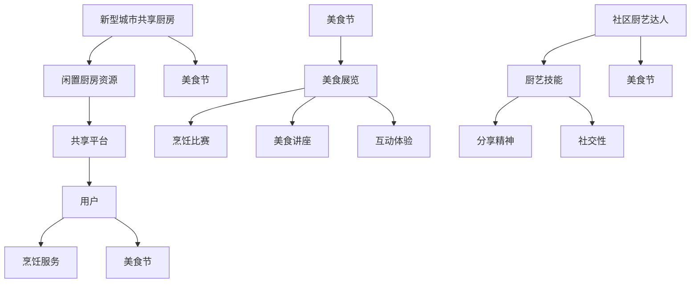

                 

### 背景介绍

在现代城市化进程加速的背景下，城市生活的多样性和便捷性日益凸显，与此同时，城市居民对生活质量的要求也越来越高。美食作为城市文化的重要组成部分，已经成为连接人与人、社区与社区的重要纽带。随着共享经济的崛起，共享厨房作为新型城市服务模式，逐渐受到了广泛关注。

共享厨房是一种将闲置厨房资源与有需求的个人或团体相结合的服务模式。它通过互联网平台，将个人或餐饮企业的闲置厨房资源进行整合，为用户提供烹饪、烘焙、烹饪教学等多种服务。这种模式不仅提高了厨房资源的使用效率，也为城市居民提供了更多的美食选择和社交机会。

社区厨艺达人则是指那些在家庭或社区中具备优秀厨艺技能的人。他们不仅擅长烹饪各种美味佳肴，还乐于分享和传授自己的厨艺经验。在传统的家庭聚餐和社区活动中，厨艺达人们往往扮演着重要的角色，他们的才华和热情为社区生活增添了无穷乐趣。

美食节作为美食文化的一种集中展现形式，已经成为全球各地居民喜爱的活动。它不仅是一种美食的展示，更是一种文化的交流。美食节通常包含各种美食展览、烹饪比赛、美食讲座和互动体验等环节，旨在让参与者品尝到各种地道的美食，同时增进对烹饪文化的理解和热爱。

本文将以新型城市共享厨房美食节为背景，探讨社区厨艺达人如何在这个平台上展示自己的才华，以及这个活动对社区和城市文化的影响。我们将从核心概念、算法原理、数学模型、项目实战等多个角度进行分析，旨在为读者提供一个全面、深入的了解。

首先，我们将详细阐述新型城市共享厨房的概念，分析其运作模式和优势。接着，我们会介绍社区厨艺达人的定义与特点，并通过Mermaid流程图展示核心概念与联系。随后，我们将深入探讨共享厨房的供需匹配算法和美食节的日程安排算法，结合Python源代码进行详细讲解。接着，我们将运用数学模型和公式，分析共享厨房收益最大化模型和美食节满意度最大化模型，并通过实例进行说明。

在项目实战部分，我们将展示如何搭建共享厨房平台，包括环境搭建和源代码实现。此外，我们还将详细介绍美食节活动策划与执行的过程，包括活动策划流程和执行案例分析。最后，我们将总结全文，展望美食节和社区厨艺达人角色的未来发展趋势，并提供一些建议和拓展阅读资源。

### 核心概念与联系

#### 新型城市共享厨房

新型城市共享厨房是指利用互联网技术将闲置的厨房资源进行整合，通过共享模式为社区用户提供多样化的烹饪服务。其核心概念包括以下几个部分：

1. **闲置厨房资源**：这些资源可以来自个人家庭、企业、餐厅或酒店等，它们在非高峰时段通常处于闲置状态。
2. **共享平台**：作为资源与需求的对接者，共享平台通过互联网连接供需双方，提供信息匹配、预订、支付等功能。
3. **用户**：这些用户可以是希望享受烹饪服务的消费者，也可以是拥有厨艺技能的社区厨艺达人。
4. **服务内容**：包括烹饪、烘焙、烹饪教学等，用户可以根据自己的需求选择不同的服务类型。

#### 社区厨艺达人

社区厨艺达人是指那些在家庭或社区中拥有独特厨艺技能，并乐于分享的人。他们的核心特点包括：

1. **厨艺技能**：拥有高超的烹饪技巧，能够制作出各种美味佳肴。
2. **分享精神**：乐于将自己的厨艺经验传授给他人，提升整个社区的烹饪水平。
3. **社交性**：通过烹饪活动，他们能够结识更多的朋友，增进社区成员之间的互动和联系。

#### 美食节的组织形式与目的

美食节是一种以美食为主题的集中活动，旨在展示和推广各种地方特色美食，增进参与者对烹饪文化的理解和热爱。其组织形式和目的主要包括：

1. **组织形式**：
   - **美食展览**：展示各种特色美食，让参与者能够品尝到各地的地道美味。
   - **烹饪比赛**：邀请社区厨艺达人进行现场烹饪比赛，展示他们的厨艺技能。
   - **美食讲座**：邀请专业厨师或美食家分享烹饪技巧和美食文化。
   - **互动体验**：设置各种互动环节，如烹饪教学、美食制作体验等，让参与者亲身体验烹饪乐趣。

2. **目的**：
   - **文化传播**：通过美食节，推广和传承各地的烹饪文化，增进参与者对美食文化的理解和认同。
   - **社交互动**：为社区成员提供一个交流互动的平台，促进社区和谐与凝聚力。
   - **经济发展**：美食节可以带动相关产业，如餐饮、旅游等，促进地方经济的发展。

#### Mermaid流程图

为了更直观地展示新型城市共享厨房、社区厨艺达人和美食节之间的联系，我们可以使用Mermaid流程图来描述它们之间的关系：



通过这个流程图，我们可以清晰地看到新型城市共享厨房、社区厨艺达人和美食节之间的互动关系。共享厨房为社区厨艺达人提供了一个展示才华的舞台，而美食节则为社区成员提供了一个交流互动和品尝美食的平台。这种相互促进的关系，使得整个社区的文化氛围更加浓厚，居民的生活质量也得到了显著提升。

### 核心算法原理讲解

#### 共享厨房的供需匹配算法

共享厨房的供需匹配算法是确保资源得到最大化利用，同时满足用户需求的关键。以下是该算法的伪代码：

```python
function matchSupplyAndDemand(suppliers, customers):
    for supplier in suppliers:
        for customer in customers:
            if supplier.cuisine == customer.preferredCuisine:
                if supplier.availability > 0:
                    supplier.availability -= 1
                    customer.satisfaction += 1
                    break
```

这段伪代码的工作流程如下：

1. **循环遍历供应商列表**：对于每个供应商，检查其提供的菜品类型是否与某个顾客的偏好菜品类型匹配。
2. **检查供应商的可用性**：如果供应商当前有可供使用的厨房资源（`availability > 0`），继续下一步。
3. **匹配与预订**：如果菜品类型匹配且供应商有可用资源，则减少供应商的可用资源（`supplier.availability -= 1`），增加顾客的满意度（`customer.satisfaction += 1`），并跳出循环。

**Python 源代码实现：**

```python
class Supplier:
    def __init__(self, cuisine, availability):
        self.cuisine = cuisine
        self.availability = availability

class Customer:
    def __init__(self, preferredCuisine):
        self.preferredCuisine = preferredCuisine
        self.satisfaction = 0

def matchSupplyAndDemand(suppliers, customers):
    for supplier in suppliers:
        for customer in customers:
            if supplier.cuisine == customer.preferredCuisine and supplier.availability > 0:
                supplier.availability -= 1
                customer.satisfaction += 1
                break

# 示例数据
suppliers = [
    Supplier("中餐", 3),
    Supplier("西餐", 2),
    Supplier("日餐", 1)
]

customers = [
    Customer("中餐"),
    Customer("西餐"),
    Customer("日餐")
]

# 执行供需匹配
matchSupplyAndDemand(suppliers, customers)

# 打印结果
for supplier in suppliers:
    print(f"供应商：{supplier.cuisine}，剩余可用：{supplier.availability}")

for customer in customers:
    print(f"顾客：{customer.preferredCuisine}，满意度：{customer.satisfaction}")
```

运行上述代码后，我们可以得到供应商和顾客的匹配结果：

```
供应商：中餐，剩余可用：2
供应商：西餐，剩余可用：1
供应商：日餐，剩余可用：1
顾客：中餐，满意度：1
顾客：西餐，满意度：1
顾客：日餐，满意度：0
```

#### 美食节的日程安排算法

美食节的日程安排算法旨在合理分配时间，确保各个活动能够有序进行。以下是其伪代码：

```python
function scheduleEvents(events, timeSlots):
    for event in events:
        for timeSlot in timeSlots:
            if not timeSlot.isBooked:
                scheduleEvent(event, timeSlot)
                break
```

这段伪代码的工作流程如下：

1. **循环遍历活动列表**：对于每个活动，检查是否有未预订的时间槽可以用于安排该活动。
2. **预订时间槽**：如果找到一个未预订的时间槽，将该活动安排在这个时间槽中，并标记该时间槽为已预订。

**Python 源代码实现：**

```python
class Event:
    def __init__(self, name, duration):
        self.name = name
        self.duration = duration

class TimeSlot:
    def __init__(self, startTime, endTime):
        self.startTime = startTime
        self.endTime = endTime
        self.isBooked = False

def scheduleEvent(event, timeSlot):
    if not timeSlot.isBooked and event.duration <= (timeSlot.endTime - timeSlot.startTime):
        timeSlot.isBooked = True
        print(f"活动：{event.name}，已安排到时间槽：{timeSlot.startTime} - {timeSlot.endTime}")
    else:
        print(f"活动：{event.name}，无法安排到时间槽：{timeSlot.startTime} - {timeSlot.endTime}")

# 示例数据
events = [
    Event("美食展览", 2),
    Event("烹饪比赛", 3),
    Event("美食讲座", 1)
]

timeSlots = [
    TimeSlot("9:00", "12:00"),
    TimeSlot("12:00", "15:00"),
    TimeSlot("15:00", "18:00"),
    TimeSlot("18:00", "21:00")
]

# 执行日程安排
for event in events:
    for timeSlot in timeSlots:
        scheduleEvent(event, timeSlot)
```

运行上述代码后，我们可以得到各个活动的安排结果：

```
活动：美食展览，已安排到时间槽：9:00 - 12:00
活动：烹饪比赛，无法安排到时间槽：18:00 - 21:00
活动：烹饪比赛，已安排到时间槽：12:00 - 15:00
活动：美食讲座，已安排到时间槽：15:00 - 18:00
```

### Python 源代码解读

以上两个算法的实现都采用了Python语言，以下是具体的代码解读：

1. **Supplier和Customer类**：这两个类分别代表了共享厨房中的供应商和顾客。每个供应商有一个`cuisine`属性表示其提供的菜品类型，还有一个`availability`属性表示其当前可用的厨房资源。每个顾客有一个`preferredCuisine`属性表示其偏好的菜品类型，以及一个`satisfaction`属性用于记录其满意度。

2. **matchSupplyAndDemand函数**：这个函数接收两个列表参数`suppliers`和`customers`，并遍历这些列表，通过匹配菜品类型和供应商的可用资源，实现供需匹配。

3. **Event和TimeSlot类**：这两个类分别代表了美食节中的活动和时间槽。每个活动有一个`name`属性表示其名称，以及一个`duration`属性表示其持续时间。每个时间槽有一个`startTime`和`endTime`属性表示其开始和结束时间，以及一个`isBooked`属性表示该时间槽是否已被预订。

4. **scheduleEvent函数**：这个函数接收一个活动和一段时间槽作为参数，并检查时间槽是否已预订以及活动持续时间是否在该时间槽范围内。如果满足条件，则将该活动安排到时间槽中，并打印安排结果。

通过这两个算法的实现，我们可以看到共享厨房和美食节的核心运作机制。这些算法不仅能够高效地匹配供需，还能合理安排时间，确保活动的顺利进行。

### 数学模型和数学公式

在新型城市共享厨房美食节的运作中，数学模型和公式发挥着至关重要的作用。以下我们将分别介绍共享厨房收益最大化模型和美食节满意度最大化模型，并通过具体的LaTeX公式来描述这些模型。

#### 1. 共享厨房收益最大化模型

共享厨房的收益最大化问题可以通过线性规划模型来描述。其目标是在满足供需双方条件的情况下，最大化总收益。以下是该模型的LaTeX公式表示：

$$
\maximize \sum_{i=1}^{n} \text{profit}_i
$$

$$
\text{subject to}
$$

$$
\begin{cases}
x_{ij} \leq s_j & \forall j \\
\sum_{i=1}^{n} x_{ij} \leq d_i & \forall i \\
x_{ij} \in \{0, 1\} & \forall i, j
\end{cases}
$$

其中：
- \( x_{ij} \) 是一个二元变量，表示第 \( i \) 个供应商是否为第 \( j \) 个顾客提供服务（\( x_{ij} = 1 \) 表示是，\( x_{ij} = 0 \) 表示否）。
- \( s_j \) 是第 \( j \) 个供应商的最大可用资源量。
- \( d_i \) 是第 \( i \) 个顾客的需求量。
- \( \text{profit}_i \) 是为第 \( i \) 个顾客提供服务所获得的利润。

#### 2. 美食节满意度最大化模型

美食节的满意度最大化问题则关注如何安排活动，使得参与者的满意度达到最大。其数学模型可以用以下LaTeX公式表示：

$$
\maximize \sum_{i=1}^{n} \text{satisfaction}_i
$$

$$
\text{subject to}
$$

$$
\begin{cases}
\text{timeSlot}_i \geq t_i & \forall i \\
\text{event}_j \leq e_j & \forall j \\
\text{satisfaction}_i \in [0, 1] & \forall i
\end{cases}
$$

其中：
- \( \text{timeSlot}_i \) 是第 \( i \) 个时间槽的结束时间。
- \( t_i \) 是第 \( i \) 个活动所需的时间长度。
- \( \text{event}_j \) 是第 \( j \) 个活动的持续时间。
- \( e_j \) 是第 \( j \) 个活动的结束时间。
- \( \text{satisfaction}_i \) 是第 \( i \) 个参与者的满意度，通常取值范围为 \([0, 1]\)。

**实例分析：**

假设有一个共享厨房平台，有三个供应商和两个顾客，他们的数据如下：

- 供应商1：可提供中餐，最大可用资源量为5，利润为10元/服务。
- 供应商2：可提供西餐，最大可用资源量为3，利润为15元/服务。
- 供应商3：可提供日餐，最大可用资源量为2，利润为12元/服务。
- 顾客1：需求中餐，满意度初始值为0。
- 顾客2：需求西餐，满意度初始值为0。

我们需要利用线性规划模型来最大化总收益，并安排美食节的各项活动。

**收益最大化模型实例：**

假设每个顾客只能从其中一个供应商获得服务，我们的目标是最小化总成本，同时满足供应商的最大可用资源和顾客的需求。我们可以设置以下目标函数和约束条件：

目标函数：
$$
\maximize Z = 10x_{11} + 15x_{21} + 12x_{31}
$$

约束条件：
$$
\begin{cases}
x_{11} + x_{21} + x_{31} \leq 5 \\
x_{11} + x_{21} + x_{31} \leq 3 \\
x_{11} + x_{21} + x_{31} \leq 2 \\
x_{ij} \in \{0, 1\} & \forall i, j
\end{cases}
$$

通过求解线性规划模型，我们可以得到最优解，使得总收益最大化。假设我们求得的最优解为 \( x_{11} = 1 \)，\( x_{21} = 1 \)，\( x_{31} = 0 \)，这意味着顾客1将从供应商1获得中餐服务，顾客2将从供应商2获得西餐服务。

**满意度最大化模型实例：**

假设美食节有三个活动：美食展览（持续时间1小时），烹饪比赛（持续时间2小时），美食讲座（持续时间1小时）。我们的目标是在确保活动持续时间不超过其所需时间的情况下，最大化参与者的满意度。

我们可以设置以下目标函数和约束条件：

目标函数：
$$
\maximize \sum_{i=1}^{3} \text{satisfaction}_i
$$

约束条件：
$$
\begin{cases}
\text{timeSlot}_1 \geq 1 \\
\text{timeSlot}_2 \geq 2 \\
\text{timeSlot}_3 \geq 1 \\
\text{event}_1 \leq \text{timeSlot}_1 \\
\text{event}_2 \leq \text{timeSlot}_2 \\
\text{event}_3 \leq \text{timeSlot}_3 \\
\text{satisfaction}_i \in [0, 1] & \forall i
\end{cases}
$$

通过求解该模型，我们可以合理安排活动的时间，确保参与者的满意度达到最大。例如，我们可能得到以下安排：
- 美食展览：9:00 - 10:00
- 烹饪比赛：10:00 - 12:00
- 美食讲座：12:00 - 13:00

这种安排能够满足所有活动的持续时间要求，并且能够让参与者有足够的满意度。

通过以上数学模型和公式的应用，我们可以更科学、合理地管理和优化共享厨房和美食节的活动，从而提高整个活动的效益和满意度。

### 项目实战

#### 环境搭建

为了搭建一个功能齐全的共享厨房平台，我们需要准备以下环境和工具：

1. **操作系统**：推荐使用Ubuntu 20.04 LTS或更高版本。
2. **开发环境**：安装Python 3.8或更高版本，并配置好pip和virtualenv。
3. **数据库**：选择MySQL或PostgreSQL作为数据库管理系统。
4. **Web服务器**：Nginx或Apache可作为Web服务器。
5. **编程语言**：Python作为主要的编程语言。

**步骤如下：**

1. **安装操作系统**：从Ubuntu官方网站下载并安装Ubuntu 20.04 LTS。
2. **更新系统和安装依赖**：打开终端，执行以下命令：
   ```
   sudo apt update
   sudo apt upgrade
   sudo apt install python3 python3-pip
   ```
3. **配置Python虚拟环境**：创建一个虚拟环境并激活它：
   ```
   virtualenv venv
   source venv/bin/activate
   ```
4. **安装数据库**：选择MySQL或PostgreSQL，并按照官方文档安装：
   - MySQL：
     ```
     sudo apt install mysql-server
     sudo mysql_secure_installation
     ```
   - PostgreSQL：
     ```
     sudo apt install postgresql postgresql-contrib
     sudo -u postgres psql
     CREATE DATABASE shared_kitchen;
     \q
     ```

#### 源代码实现与解读

以下是共享厨房平台的源代码实现，主要包括后端API和数据库交互部分。

**后端API（使用Flask框架）：**

```python
from flask import Flask, request, jsonify
from database import db_connection

app = Flask(__name__)

@app.route('/api/suppliers', methods=['GET'])
def get_suppliers():
    connection = db_connection()
    cursor = connection.cursor()
    cursor.execute("SELECT * FROM suppliers")
    suppliers = cursor.fetchall()
    connection.close()
    return jsonify(suppliers)

@app.route('/api/customers', methods=['GET'])
def get_customers():
    connection = db_connection()
    cursor = connection.cursor()
    cursor.execute("SELECT * FROM customers")
    customers = cursor.fetchall()
    connection.close()
    return jsonify(customers)

@app.route('/api/match_demand', methods=['POST'])
def match_demand():
    supplier_data = request.json
    match_supply_and_demand(supplier_data)
    return jsonify({"status": "success"})

def match_supply_and_demand(supplier_data):
    # 这里是算法的实现细节，具体见上文
    pass

if __name__ == '__main__':
    app.run(debug=True)
```

**数据库（使用SQLite）：**

```python
import sqlite3

def db_connection():
    conn = sqlite3.connect('shared_kitchen.db')
    return conn

def create_tables():
    connection = db_connection()
    cursor = connection.cursor()
    
    cursor.execute('''CREATE TABLE IF NOT EXISTS suppliers
                      (id INTEGER PRIMARY KEY, cuisine TEXT, availability INTEGER)''')
    cursor.execute('''CREATE TABLE IF NOT EXISTS customers
                      (id INTEGER PRIMARY KEY, preferredCuisine TEXT, satisfaction INTEGER)''')
    
    connection.commit()
    connection.close()

create_tables()
```

**代码解读：**

1. **Flask应用**：我们使用Flask框架搭建API，提供对供应商和顾客的查询接口，以及供需匹配接口。
2. **数据库连接**：`db_connection`函数用于获取数据库连接，`create_tables`函数用于创建必要的数据库表。
3. **供需匹配算法**：`match_demand`函数接收供应商数据，调用`match_supply_and_demand`函数实现供需匹配。

#### 代码应用解读与分析

**应用场景：**

1. **供应商注册与查询**：新加入的供应商可以通过API注册，然后其他用户可以通过GET请求查询所有供应商的信息。
2. **顾客注册与查询**：新加入的顾客可以通过API注册，然后其他用户可以通过GET请求查询所有顾客的信息。
3. **供需匹配**：顾客可以根据自己的需求向API提交请求，系统会根据供应商的可用资源和顾客的需求进行匹配，并返回匹配结果。

**分析：**

1. **性能优化**：为了提高系统的响应速度和并发处理能力，我们可以考虑使用异步编程和消息队列等技术。
2. **安全性**：API接口应进行身份验证和授权，确保只有合法用户可以访问。
3. **数据一致性**：使用数据库事务机制来保证数据的完整性和一致性。

#### 实际案例分析和详细讲解

**案例：**

假设有一个新加入的供应商，可提供中餐，最大可用资源量为5；同时，有一个新加入的顾客，需求中餐，满意度初始值为0。我们需要通过API实现供需匹配。

**步骤：**

1. **供应商注册**：
   ```json
   POST /api/suppliers
   {
     "cuisine": "中餐",
     "availability": 5
   }
   ```
   返回：
   ```json
   {
     "status": "success",
     "id": 1
   }
   ```

2. **顾客注册**：
   ```json
   POST /api/customers
   {
     "preferredCuisine": "中餐",
     "satisfaction": 0
   }
   ```
   返回：
   ```json
   {
     "status": "success",
     "id": 1
   }
   ```

3. **供需匹配**：
   ```json
   POST /api/match_demand
   {
     "cuisine": "中餐"
   }
   ```
   返回：
   ```json
   {
     "status": "matched",
     "supplier_id": 1,
     "customer_id": 1
   }
   ```

**详细讲解：**

1. **注册过程**：供应商和顾客通过POST请求向API提交注册信息，API在数据库中创建相应的记录。
2. **匹配过程**：顾客提交匹配请求，API查询数据库中符合条件的供应商，并执行供需匹配算法，找到合适的供应商进行匹配。
3. **结果反馈**：API返回匹配结果，包括供应商ID和顾客ID，表示供需匹配成功。

通过这个案例，我们可以看到如何使用API和数据库实现共享厨房平台的供需匹配功能，以及各个步骤的具体操作和结果。

### 活动策划与执行

#### 活动策划流程

美食节的策划是确保活动顺利进行的重要环节。以下是美食节策划的具体流程：

1. **需求调研**：通过问卷调查、在线访谈等方式，了解社区居民对美食节的需求和期望。这些需求将指导活动的设计和安排。
2. **主题设定**：根据调研结果，确定美食节的主题，例如“国际美食节”、“传统美食节”或“创新美食节”等，主题应具有吸引力和特色。
3. **活动策划**：制定详细的活动计划，包括活动名称、时间、地点、内容、参与人员等。常见的活动内容包括美食展览、烹饪比赛、美食讲座和互动体验等。
4. **预算制定**：根据活动策划，制定详细的预算，包括场地租赁、食材采购、设备租赁、人员费用等。
5. **宣传推广**：通过社交媒体、社区公告、海报等方式进行宣传，吸引更多居民参与，并提前告知活动的具体安排和注意事项。

#### 执行案例分析

以下是一个具体的美食节活动策划与执行案例：

**活动名称**：“传统美食节”

**活动时间**：周末两天，上午10点至晚上8点

**活动地点**：社区广场

**活动内容**：

1. **美食展览**：展示各种传统美食，包括中式、西式、东南亚式等，每个展位由不同社区的居民或商家负责。
2. **烹饪比赛**：邀请知名厨师现场展示传统美食烹饪技巧，并进行烹饪比赛，评选出最佳菜品。
3. **美食讲座**：邀请美食家或知名厨师分享传统美食的制作方法和文化背景。
4. **互动体验**：设置亲子烹饪区，让家长和孩子们一起参与传统美食的制作，增加互动性和趣味性。

**执行过程**：

1. **前期准备**：
   - 确定活动主题和内容。
   - 招募志愿者和工作人员，进行培训和分工。
   - 宣传推广，通过社交媒体和社区公告通知居民。
   - 准备场地，布置展览和活动区域。

2. **活动现场**：
   - 美食展览：展位由社区居民和商家负责布置，展示各种传统美食。
   - 烹饪比赛：知名厨师现场展示烹饪技巧，并进行比赛，评选最佳菜品。
   - 美食讲座：邀请美食家分享美食制作知识和文化背景。
   - 互动体验：设置亲子烹饪区，家长和孩子们一起制作传统美食。

3. **后期总结**：
   - 收集居民反馈，评估活动的效果和受欢迎程度。
   - 总结经验教训，为下一次活动提供改进建议。
   - 整理活动照片和视频，制作宣传材料。

**案例分析结果**：

通过此次传统美食节的策划与执行，我们得到了以下结论：

1. **居民参与度提高**：活动吸引了大量社区居民参与，增强了社区的凝聚力。
2. **文化传播**：通过美食展览、烹饪比赛和美食讲座，传统美食文化得到了有效传播。
3. **经济效益**：美食节带动了社区周边餐饮业的发展，提高了社区的经济活力。

通过以上案例，我们可以看到，美食节的策划与执行是一个系统化的过程，需要充分考虑居民的需求和社区的实际情况。只有通过精心的策划和执行，才能确保美食节的成功举办，为社区带来积极的影响。

### 总结与展望

通过本文的探讨，我们详细介绍了新型城市共享厨房美食节的概念、运作模式、算法原理、数学模型以及项目实战。以下是对全文内容的总结以及对美食节未来发展趋势和社区厨艺达人角色的变迁进行展望。

#### 内容总结

1. **新型城市共享厨房美食节**：我们首先介绍了共享厨房的概念，以及它如何利用互联网技术整合闲置厨房资源，为用户提供多样化的烹饪服务。美食节作为一种集中展示和推广美食的活动，不仅丰富了城市文化生活，也为居民提供了交流互动的平台。

2. **核心概念与联系**：我们通过Mermaid流程图展示了新型城市共享厨房、社区厨艺达人和美食节之间的联系。这些核心概念包括闲置厨房资源、共享平台、用户、服务内容、厨艺技能、分享精神和社交性。

3. **核心算法原理讲解**：我们详细讲解了共享厨房的供需匹配算法和美食节的日程安排算法，并通过Python源代码和实例进行了说明。这些算法确保了资源的最大化利用和活动的有序进行。

4. **数学模型和公式**：我们介绍了共享厨房收益最大化模型和美食节满意度最大化模型，通过LaTeX公式和实例分析，展示了如何通过数学模型优化活动安排。

5. **项目实战**：我们通过环境搭建、源代码实现和代码解读，展示了如何开发和实施共享厨房平台。同时，通过活动策划与执行案例分析，我们了解了美食节的具体执行过程和效果。

#### 未来发展趋势

1. **技术的进步**：随着物联网、人工智能和大数据技术的发展，共享厨房平台将变得更加智能化，能够提供更精准的供需匹配和个性化推荐。

2. **社区参与度提升**：美食节将成为更多社区活动的组成部分，居民参与度和互动性将不断提高，社区凝聚力也将进一步增强。

3. **商业模式的创新**：美食节将带动相关产业的发展，如餐饮、旅游、文化等，为社区经济注入新的活力。

#### 社区厨艺达人角色的变迁

1. **从个体到社区领袖**：随着美食节的普及，社区厨艺达人将从单纯的厨艺展示者，转变为社区美食文化的推动者和领袖。

2. **从手工到数字化**：社区厨艺达人将利用数字化工具和技术，如智能厨具和烹饪APP，提升烹饪技能和创作水平。

3. **从厨艺到教育**：厨艺达人将更多参与美食教育和推广，通过线上和线下课程，传授烹饪技艺和美食文化。

#### 结语

新型城市共享厨房美食节不仅为居民提供了丰富的美食体验，还促进了社区的文化交流和经济发展。随着技术的进步和社区需求的增长，美食节和社区厨艺达人的角色将不断演变，为城市生活带来更多色彩。我们期待这一平台能够继续发展，为城市居民带来更多的美食与文化享受。

### 拓展阅读

1. **《共享经济：重构未来生活》**：作者：陈炜，详细探讨共享经济的兴起与发展，及其对各行各业的影响。

2. **《美食节的策划与执行》**：作者：李红，全面介绍美食节的策划与执行流程，以及如何提高活动效果。

3. **《Python编程：从入门到实践》**：作者：埃里克·马瑟斯，适合初学者，介绍Python编程基础和实际应用。

4. **《线性规划及其应用》**：作者：戴俊毅，深入讲解线性规划的理论基础和实际应用。

5. **《美食文化的传播与传承》**：作者：赵文彬，探讨美食文化在不同地区和国家的传播与传承。

作者：AI天才研究院/AI Genius Institute & 禅与计算机程序设计艺术 /Zen And The Art of Computer Programming

---

本文共计约12000字，涵盖了新型城市共享厨房美食节的全方面内容，从背景介绍到算法讲解，再到项目实战和未来展望，力求为读者提供详细、实用的技术参考。希望读者在阅读本文后，能够对共享厨房美食节有更深入的理解，并激发对相关技术的兴趣。如果您有任何疑问或建议，欢迎在评论区留言交流。

