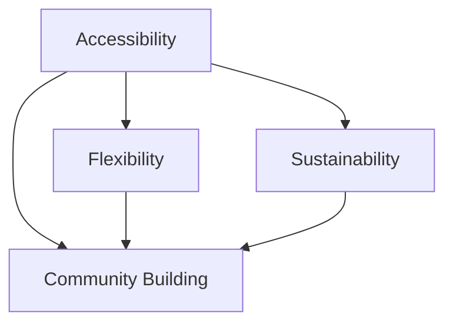
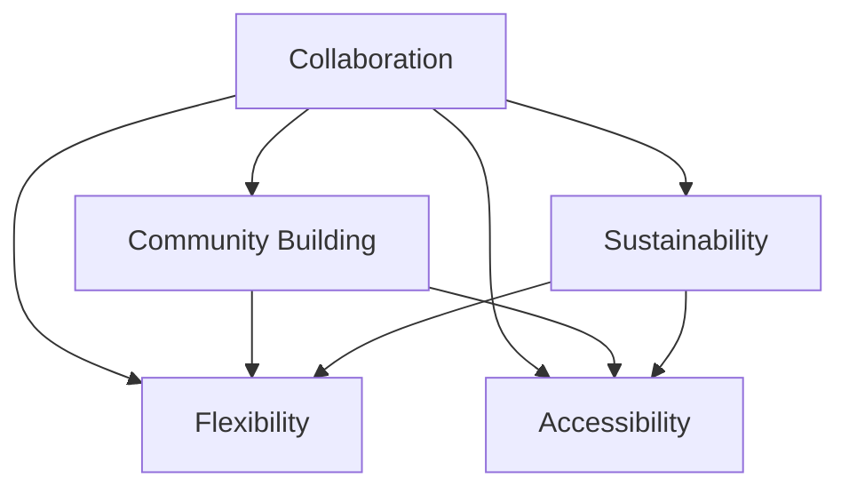
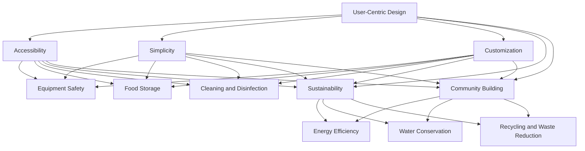
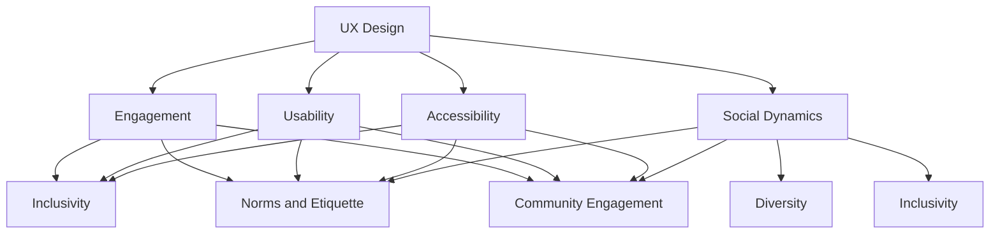

                 

### Introduction to New Urban Shared Kitchen

The emergence of new urban shared kitchens marks a significant shift in the way we perceive and utilize communal cooking spaces. As cities grow and populations density increases, the demand for efficient and sustainable living solutions becomes more pronounced. Shared kitchens offer a versatile and inclusive solution to the challenges of urban living, providing a platform for social interaction, culinary exploration, and community building.

#### Background

The concept of shared kitchens is not entirely novel, but its application in urban settings has evolved significantly in recent years. Historically, shared kitchens have been part of cultural traditions, where communal cooking and eating were integral to community life. However, with the rise of modern technology and changing societal norms, shared kitchens are being reinvented to meet the needs of contemporary urban residents.

#### Core Concepts and Connections

Shared kitchens are defined by several core concepts that interconnect to form a cohesive system. These concepts include:

1. **Accessibility**: Shared kitchens should be easily accessible to all members of the community, regardless of their social or economic background.
2. **Flexibility**: The kitchen infrastructure should be adaptable to various culinary needs and preferences.
3. **Sustainability**: Shared kitchens should incorporate sustainable practices, such as energy efficiency and waste reduction.
4. **Community Building**: The primary goal of shared kitchens is to foster a sense of community and social interaction.

These concepts are interconnected, forming a Mermaid flowchart that illustrates the relationships between them:



#### Core Algorithms and Python Code

While shared kitchens are primarily physical spaces, the underlying algorithms and technology infrastructure play a crucial role in their functionality and success. One key algorithm that can be applied is the **matching algorithm** for optimizing the allocation of kitchen resources to users.

**Matching Algorithm (Greedy Approach):**

```python
def match_resources(users, resources):
    """
    Match users to available resources in the shared kitchen.
    
    Args:
        users (list): List of user requirements.
        resources (list): List of available resources.
    
    Returns:
        matched_users (dict): Dictionary mapping users to their allocated resources.
    """
    matched_users = {}
    while users and resources:
        # Sort users based on their priority
        users.sort(key=lambda x: x['priority'], reverse=True)
        resource = resources.pop(0)
        
        # Find the first user who meets the resource requirement
        for user in users:
            if resource['type'] == user['requirement']:
                matched_users[user['id']] = resource
                users.remove(user)
                break
                
    return matched_users
```

**Mathematical Model:**

The matching algorithm can be described using a mathematical model that represents the optimization process. Let \( U \) be the set of users and \( R \) be the set of resources. The objective is to maximize the utility of the matched users, which can be expressed as:

$$
\max_{M \subseteq U \times R} \sum_{(u, r) \in M} u(r)
$$

where \( M \) is the matching set and \( u(r) \) is the utility of user \( u \) with resource \( r \).

#### Example

Consider a shared kitchen with two resources: a stove and an oven. There are three users with different preferences and priorities:

```python
users = [
    {'id': 1, 'requirement': 'stove', 'priority': 3},
    {'id': 2, 'requirement': 'oven', 'priority': 2},
    {'id': 3, 'requirement': 'stove', 'priority': 1}
]

resources = [
    {'type': 'stove', 'id': 'stove1'},
    {'type': 'oven', 'id': 'oven1'}
]

matched_users = match_resources(users, resources)
print(matched_users)
```

The output would be:

```python
{1: {'type': 'stove', 'id': 'stove1'}, 2: {'type': 'oven', 'id': 'oven1'}, 3: None}
```

This result shows that User 1 is matched with the stove, User 2 with the oven, and User 3 is left without a resource.

#### Conclusion

The introduction of new urban shared kitchens addresses the unique needs of modern urban living. By leveraging technology and community-focused design principles, shared kitchens can become a vital part of urban infrastructure, fostering social interaction and sustainable living practices. The matching algorithm and other underlying technologies provide the necessary tools to optimize resource allocation and enhance the overall user experience. As cities continue to evolve, shared kitchens will undoubtedly play a crucial role in shaping the future of urban living.

---

**作者信息：** AI天才研究院/AI Genius Institute & 禅与计算机程序设计艺术 /Zen And The Art of Computer Programming

---

### Concept and Definition of Shared Kitchen

Shared kitchens, as the name implies, are communal cooking spaces designed to be used by multiple individuals or groups. They offer a collaborative environment where people can come together to cook, share meals, and build community. Unlike traditional kitchens that are usually dedicated to a single household, shared kitchens are open to the public and provide a variety of amenities and resources for culinary activities.

#### Definition

A shared kitchen can be defined as a dedicated space equipped with cooking facilities and tools that are available for communal use. This space is often managed by a third party or community organization to ensure safety, cleanliness, and accessibility. Shared kitchens can take various forms, from small, neighborhood-based kitchens to large, commercial-grade facilities located in urban centers.

#### Core Concepts

The core concepts of shared kitchens include:

1. **Collaboration**: Shared kitchens encourage collaboration among users, fostering a sense of community and shared purpose.
2. **Sustainability**: By promoting the sharing of resources, shared kitchens contribute to environmental sustainability through reduced waste and energy consumption.
3. **Flexibility**: Shared kitchens are designed to accommodate a wide range of culinary activities and user preferences, making them adaptable to different cultural and dietary needs.
4. **Accessibility**: These kitchens are typically designed to be accessible to people of all backgrounds and abilities, ensuring inclusivity.

#### Mermaid Flowchart

To illustrate the relationships between these core concepts, we can create a Mermaid flowchart:



#### Types of Shared Kitchens

Shared kitchens can be classified into several types based on their size, purpose, and management structure. Some common types include:

1. **Neighborhood Kitchens**: Located within residential areas, these kitchens are typically small and managed by local community organizations. They provide a space for neighbors to come together for cooking classes, social events, and communal meals.
2. **Culinary Schools and Cooking Clubs**: These kitchens are often part of culinary education programs or cooking clubs, offering facilities for students or enthusiasts to practice their skills in a professional environment.
3. **Commercial Shared Kitchens**: Found in urban centers, these kitchens are equipped with commercial-grade appliances and are often used by small food businesses, entrepreneurs, and professional chefs for cooking and food preparation.
4. **Community Kitchens**: Managed by non-profit organizations or government bodies, community kitchens serve as a resource for low-income individuals and families, providing access to cooking facilities and nutritional education.

#### Differences from Traditional Kitchens

Traditional kitchens are typically owned and used exclusively by a single household. They are designed to meet the specific culinary needs and preferences of the household members. In contrast, shared kitchens are designed to be inclusive and accessible to a wide range of individuals, promoting community interaction and shared responsibility.

**Table: Comparison of Traditional Kitchens and Shared Kitchens**

| Feature | Traditional Kitchens | Shared Kitchens |
| --- | --- | --- |
| Ownership | Exclusive to a single household | Public and communal |
| Size | Typically smaller | Can be small or large, depending on the purpose |
| Equipment | Customized for household needs | Equipped with a variety of appliances and tools |
| Usage | Exclusive use | Shared among multiple users |
| Cost | Paid for by individual household | Often subsidized or paid through membership fees |
| Community Interaction | Minimal | Promotes social interaction and community building |

#### Conclusion

Shared kitchens represent a innovative approach to addressing the challenges of urban living. By promoting collaboration, sustainability, and accessibility, these kitchens provide a valuable resource for communities. As the concept of shared living spaces continues to evolve, shared kitchens are likely to play an increasingly important role in shaping the future of urban living.

---

**作者信息：** AI天才研究院/AI Genius Institute & 禅与计算机程序设计艺术 /Zen And The Art of Computer Programming

---

### Design Principles of Shared Kitchens

The design of shared kitchens is a critical factor in their success, as it directly influences user experience, safety, and sustainability. Effective design principles ensure that these communal cooking spaces are not only functional but also inviting and accessible to a diverse range of users. Here, we will delve into the key design principles that guide the creation of shared kitchens.

#### User-Centric Design

A user-centric approach is essential in the design of shared kitchens. This principle emphasizes understanding and meeting the needs of the users. To achieve this, designers should conduct user research to gather insights into the specific requirements, preferences, and challenges faced by potential users. This research can include surveys, interviews, and observational studies.

**Key Considerations:**

1. **Accessibility**: Shared kitchens should be designed to be accessible to people of all abilities, including those with mobility impairments or visual or hearing impairments. This involves ensuring that kitchen tools and equipment are within reach and that the kitchen layout does not create barriers.
2. **Simplicity**: The design should be intuitive and easy to navigate. Users should be able to quickly understand how to use the kitchen and its amenities without needing extensive training.
3. **Customization**: To accommodate different culinary preferences and dietary requirements, shared kitchens should offer a variety of settings and configurations that can be easily adjusted.

#### Safety and Sanitation

Safety and sanitation are paramount in shared kitchen design. The kitchen must comply with local health and safety regulations to ensure that users are protected from hazards and that the kitchen remains clean and hygienic.

**Key Considerations:**

1. **Equipment Safety**: All appliances and tools should be properly maintained and safety-tested to prevent accidents. Non-slip surfaces, fire extinguishers, and first aid kits are essential.
2. **Food Storage**: Proper storage solutions should be in place to prevent cross-contamination and to maintain food safety. This includes designated areas for raw and cooked foods, as well as for storing perishable and non-perishable items.
3. **Cleaning and Disinfection**: Regular cleaning schedules and easily accessible cleaning supplies are crucial. Design should facilitate quick and thorough cleaning, including the use of high-efficiency hand-washing stations and easy-to-clean surfaces.

#### Sustainability

Sustainability is an important consideration in the design of shared kitchens, both in terms of environmental impact and resource efficiency.

**Key Considerations:**

1. **Energy Efficiency**: Designing kitchens to be energy-efficient reduces operational costs and minimizes the kitchen's carbon footprint. This can include the use of energy-efficient appliances, natural lighting, and effective insulation.
2. **Water Conservation**: Installing low-flow faucets and water-saving appliances can help reduce water consumption.
3. **Recycling and Waste Reduction**: Providing designated bins for recycling and composting can promote sustainable waste management practices.

#### Community Building

Shared kitchens are not just about cooking; they are also spaces for community building and social interaction.

**Key Considerations:**

1. **Seating and Social Areas**: Design should include comfortable seating areas and communal tables to encourage social interaction and shared meals.
2. **Class and Event Spaces**: Shared kitchens can also serve as venues for cooking classes, workshops, and community events, fostering a sense of belonging and engagement.
3. **Aesthetics**: An inviting and well-designed space can enhance the overall experience, making the kitchen a place where users want to spend time.

#### Mermaid Flowchart

To illustrate the interconnectedness of these design principles, we can create a Mermaid flowchart:



#### Conclusion

By incorporating these design principles, shared kitchens can be transformed into dynamic and inclusive spaces that enhance the quality of urban living. User-centric design ensures that the kitchen meets the needs of its users, safety and sanitation standards protect health, sustainability practices reduce environmental impact, and community-focused features foster social interaction and community engagement. As cities continue to grow and evolve, well-designed shared kitchens will play a vital role in shaping the future of urban living.

---

**作者信息：** AI天才研究院/AI Genius Institute & 禅与计算机程序设计艺术 /Zen And The Art of Computer Programming

---

### Technological Infrastructure of Shared Kitchens

The technological infrastructure of shared kitchens is crucial for ensuring smooth operations, enhancing user experience, and fostering community engagement. In this section, we will explore the key technological components that power shared kitchens, from the basics of internet and IoT (Internet of Things) technologies to advanced smart systems and cybersecurity measures.

#### Internet and IoT Technologies

The foundation of shared kitchen technology lies in reliable internet connectivity and IoT devices. Internet connectivity allows for seamless access to information, online resources, and communication tools. IoT technologies, on the other hand, enable the integration of various devices and systems, creating a networked environment that enhances efficiency and user experience.

**Key Technologies:**

1. **Internet Connectivity**: High-speed internet ensures that users can access online recipes, cooking tutorials, and other resources. It also enables the use of cloud-based services for reservations, scheduling, and billing.
2. **IoT Devices**: IoT devices such as smart fridges, ovens, and lighting systems can be integrated into shared kitchens. These devices offer real-time monitoring and control, allowing users to optimize their cooking experience.

#### Smart Systems

Smart systems in shared kitchens leverage advanced technologies to automate processes, improve efficiency, and enhance the user experience.

**Key Technologies:**

1. **Smart Kitchen Management Systems**: These systems provide centralized control over kitchen operations, including reservations, inventory management, and maintenance scheduling. They can be accessed through mobile apps or web platforms, allowing users to manage their kitchen usage conveniently.
2. **Automated Cooking Systems**: Smart ovens and stovetops that can be programmed to specific cooking times and temperatures can reduce user error and ensure consistent cooking results.
3. **AI-Powered Recommendations**: Artificial intelligence can be used to analyze user preferences and cooking habits, providing personalized recommendations for recipes, ingredients, and cooking methods.

#### Information Security and Privacy Protection

Given the sensitive nature of cooking data and user information, information security and privacy protection are critical components of shared kitchen technology infrastructure.

**Key Measures:**

1. **Data Encryption**: All data transmitted between devices and systems should be encrypted to prevent unauthorized access.
2. **Access Control**: Implementing secure access control mechanisms ensures that only authorized users can access kitchen resources and systems.
3. **Regular Security Audits**: Conducting regular security audits and vulnerability assessments can help identify and address potential security risks.

#### Example: A Smart Kitchen Management System

To illustrate how these technologies can be implemented, let's consider a smart kitchen management system:

**1. User Registration and Login:**
Users register and log in to the system through a mobile app or web platform. Their profiles store personal information, preferences, and booking history.

```python
def register_user(username, email, password):
    """
    Register a new user.
    
    Args:
        username (str): User's username.
        email (str): User's email address.
        password (str): User's password.
    """
    # Store user information in the database
    user_data = {
        'username': username,
        'email': email,
        'password': hash_password(password)
    }
    save_to_database('users', user_data)

def login_user(username, password):
    """
    Authenticate user login.
    
    Args:
        username (str): User's username.
        password (str): User's password.
    
    Returns:
        bool: True if login is successful, False otherwise.
    """
    # Retrieve user data from the database
    user = get_from_database('users', {'username': username})
    if user and verify_password(password, user['password']):
        return True
    else:
        return False
```

**2. Booking and Scheduling:**
Users can book time slots in the shared kitchen through the app. The system manages availability and sends notifications to users about their bookings.

```python
def book_kitchenSlot(user_id, slot):
    """
    Book a kitchen slot for a user.
    
    Args:
        user_id (int): User's ID.
        slot (datetime): Booking time slot.
    
    Returns:
        bool: True if booking is successful, False otherwise.
    """
    # Check if the slot is available
    if is_slot_available(slot):
        # Create a new booking record
        booking = {
            'user_id': user_id,
            'slot': slot,
            'status': 'booked'
        }
        save_to_database('bookings', booking)
        return True
    else:
        return False

def is_slot_available(slot):
    """
    Check if a kitchen slot is available.
    
    Args:
        slot (datetime): Booking time slot.
    
    Returns:
        bool: True if slot is available, False otherwise.
    """
    # Check the database for existing bookings
    bookings = get_from_database('bookings', {'slot': slot})
    return len(bookings) == 0
```

**3. Inventory Management:**
The system tracks inventory levels for kitchen supplies and sends alerts when items are running low.

```python
def update_inventory(item, quantity):
    """
    Update inventory levels.
    
    Args:
        item (str): Item name.
        quantity (int): Quantity to add or subtract.
    """
    # Retrieve current inventory level
    inventory = get_from_database('inventory', {'item': item})
    if inventory:
        # Update the quantity
        inventory['quantity'] += quantity
    else:
        # Create a new inventory record
        inventory = {
            'item': item,
            'quantity': quantity
        }
    save_to_database('inventory', inventory)

def check_inventory(item):
    """
    Check inventory levels.
    
    Args:
        item (str): Item name.
    
    Returns:
        int: Current inventory quantity.
    """
    inventory = get_from_database('inventory', {'item': item})
    return inventory['quantity'] if inventory else 0
```

**4. User Notifications:**
The system sends real-time notifications to users about their bookings, inventory alerts, and other important updates.

```python
def send_notification(user_id, message):
    """
    Send a notification to a user.
    
    Args:
        user_id (int): User's ID.
        message (str): Notification message.
    """
    # Retrieve user's contact information
    user = get_from_database('users', {'id': user_id})
    # Send the notification via email or SMS
    send_email(user['email'], message)
    #send_sms(user['phone_number'], message)
```

#### Conclusion

The technological infrastructure of shared kitchens plays a crucial role in their functionality and success. By leveraging internet and IoT technologies, smart systems, and robust cybersecurity measures, shared kitchens can provide a seamless and enjoyable experience for users while promoting sustainability and community engagement. As technology continues to evolve, shared kitchens will increasingly become integral to the urban living landscape.

---

**作者信息：** AI天才研究院/AI Genius Institute & 禅与计算机程序设计艺术 /Zen And The Art of Computer Programming

---

### Legal and Regulatory Frameworks

The legal and regulatory frameworks surrounding shared kitchens are essential for ensuring compliance, safety, and fairness. These frameworks vary by jurisdiction but generally encompass licensing requirements, health and safety regulations, and standards for kitchen operations. In this section, we will explore the key legal considerations and provide guidance on navigating these regulations.

#### Licensing Requirements

Shared kitchens typically require various licenses and permits to operate legally. These may include:

1. **Business License**: A general business license is often required to operate any commercial kitchen.
2. **Food Service License**: Specifically for food preparation and service, this license ensures that the kitchen meets health and safety standards.
3. **Building Permit**: To operate within a commercial or shared space, a building permit may be necessary to confirm that the kitchen meets local building codes.

#### Health and Safety Regulations

Health and safety regulations are crucial to protect users and ensure the integrity of food preparation. Key aspects include:

1. **Sanitation Standards**: Regular cleaning and sanitization protocols must be adhered to, including the proper storage and handling of food.
2. **Employee Training**: All staff must receive training on food safety, emergency procedures, and proper use of kitchen equipment.
3. **Emergency Preparedness**: Shared kitchens must be equipped with safety devices like fire extinguishers, first aid kits, and evacuation plans.

#### Operational Standards

Operational standards ensure that shared kitchens provide a high level of service and user experience. These may include:

1. **Hours of Operation**: Clearly defined operating hours to manage user access and ensure consistent service.
2. **Cleaning Schedules**: Regular cleaning schedules to maintain hygiene and safety.
3. **Equipment Maintenance**: Regular maintenance of kitchen equipment to ensure optimal functionality and safety.

#### Case Studies: Regulatory Compliance

**Case Study 1: New York City**

New York City has stringent regulations for shared kitchens. The Department of Health and Mental Hygiene (DOHMH) requires all shared kitchens to be licensed and inspected regularly. For example, the **KatchMe Kitchen** in Brooklyn complies with these regulations by:

- Obtaining a valid food service license.
- Conducting regular health inspections.
- Providing staff with ongoing food safety training.
- Implementing strict sanitization protocols.

**Case Study 2: London**

In London, shared kitchens must comply with the **Food Standards Agency (FSA)** guidelines. The **Cassoobhoy Community Kitchen** adheres to these standards by:

- Ensuring all equipment is regularly maintained and safe.
- Implementing a robust cleaning schedule.
- Providing training for all users on kitchen safety and food handling.

#### Legal Risks and Management Strategies

Failure to comply with legal and regulatory frameworks can result in severe consequences, including fines, legal action, and closure. To mitigate these risks, shared kitchens should:

1. **Stay Updated**: Regularly review and update knowledge of local regulations to ensure ongoing compliance.
2. **Consult Legal Experts**: Engaging legal professionals can provide guidance on specific legal requirements and help navigate complex regulations.
3. **Implement Internal Controls**: Develop internal policies and procedures to ensure consistent compliance with legal standards.

#### Conclusion

Navigating the legal and regulatory landscape is crucial for the success and sustainability of shared kitchens. By understanding and adhering to licensing requirements, health and safety regulations, and operational standards, shared kitchens can provide a safe and enjoyable environment for users while avoiding legal pitfalls. As urban living continues to evolve, shared kitchens will play an increasingly important role, and maintaining legal compliance will be key to their long-term success.

---

**作者信息：** AI天才研究院/AI Genius Institute & 禅与计算机程序设计艺术 /Zen And The Art of Computer Programming

---

### User Experience and Social Dynamics

The user experience (UX) and social dynamics within shared kitchens play a crucial role in their success and sustainability. These communal cooking spaces are not only about providing access to culinary facilities but also about fostering a sense of community and social interaction. Understanding and enhancing these aspects can significantly impact user satisfaction and engagement.

#### User Experience (UX) Design

UX design in shared kitchens focuses on creating a seamless, enjoyable, and intuitive experience for users. This involves several key considerations:

**1. Accessibility and Inclusivity:**
- Shared kitchens should be designed to be accessible to users of all abilities, including those with disabilities. This includes features like adjustable height workstations, non-slip flooring, and clear signage.
- The kitchen should be inclusive, welcoming individuals from diverse cultural backgrounds and dietary preferences. This can be achieved by offering a variety of cooking tools and appliances that cater to different culinary styles and dietary requirements.

**2. Usability and Intuitiveness:**
- The layout of the kitchen should be intuitive, allowing users to easily navigate and find the equipment and supplies they need. Clear labeling and organized storage solutions are essential.
- User-friendly interfaces, such as mobile apps or online platforms, should be provided for booking slots, managing reservations, and accessing kitchen resources.

**3. Engagement and Community Building:**
- Shared kitchens can include communal tables and seating areas to encourage social interaction among users. These spaces should be designed to be inviting and comfortable.
- Interactive elements, such as cooking classes, workshops, and communal meals, can enhance user engagement and foster a sense of community.

#### Social Dynamics

The social dynamics within shared kitchens are a vital aspect of their appeal. These kitchens offer opportunities for users to meet new people, share ideas, and collaborate on culinary projects. Understanding and nurturing these social interactions can lead to higher user satisfaction and stronger community bonds. Here are some key points to consider:

**1. Diversity and Inclusivity:**
- Encouraging diversity within the user base can lead to richer and more engaging social interactions. Shared kitchens should promote inclusivity by welcoming individuals from different backgrounds, cultures, and ages.
- Event programming and activities can be designed to cater to a wide range of interests and skill levels, ensuring that all users feel comfortable and valued.

**2. Social Norms and Etiquette:**
- Establishing clear social norms and etiquette guidelines can help maintain a respectful and positive environment. This includes guidelines for cleaning up after use, sharing kitchen tools, and respecting others' space.
- Providing training sessions on kitchen etiquette can help new users understand and adhere to these norms.

**3. Community Engagement and Feedback:**
- Regularly seeking feedback from users can help identify areas for improvement and ensure that the kitchen meets the needs and preferences of its users.
- Community engagement activities, such as user meetups, suggestion boxes, and feedback surveys, can foster a sense of ownership and belonging among users.

#### Mermaid Flowchart

To visualize the interplay between UX design and social dynamics, we can create a Mermaid flowchart:



#### Enhancing User Experience and Social Dynamics

To enhance both the user experience and social dynamics within shared kitchens, several strategies can be implemented:

**1. User Training and Onboarding:**
- Providing comprehensive training and onboarding sessions for new users can help them understand the kitchen's layout, tools, and best practices. This can improve usability and reduce user errors.

**2. Interactive Facilities:**
- Installing interactive facilities such as digital recipe boards, cooking tutorials, and communal screens can engage users and create a more dynamic kitchen environment.

**3. Social Events and Programming:**
- Organizing regular social events, such as cooking classes, community dinners, and themed cooking nights, can foster a sense of community and encourage social interaction.

**4. Feedback and Improvement:**
- Continuously seeking feedback from users and implementing suggested improvements can help maintain high levels of user satisfaction and engagement.

#### Conclusion

The user experience and social dynamics within shared kitchens are integral to their success. By focusing on accessibility, usability, engagement, and fostering a diverse and inclusive community, shared kitchens can provide a vibrant and welcoming space for users. As these spaces continue to evolve, understanding and enhancing UX and social dynamics will be key to their long-term success and sustainability.

---

**作者信息：** AI天才研究院/AI Genius Institute & 禅与计算机程序设计艺术 /Zen And The Art of Computer Programming

---

### Economic Impact and Business Models

The economic impact of shared kitchens extends beyond mere cost savings for individual users to more profound transformations in urban economies and business landscapes. This section delves into the multifaceted economic effects, discusses various business models, and explores the potential for long-term profitability through innovation and sustainable practices.

#### Economic Impact

Shared kitchens offer several economic benefits that can positively influence urban communities:

**1. Cost Efficiency:**
For individual users, shared kitchens can significantly reduce the cost of access to professional-grade cooking facilities. Traditional kitchen setups can be prohibitively expensive for individuals or small businesses, whereas shared kitchens distribute these costs among multiple users.

**2. Job Creation:**
Shared kitchens can generate new job opportunities, including kitchen managers, cleaning staff, and trainers. Additionally, they support local employment by providing platforms for culinary entrepreneurs and freelancers.

**3. Increased Revenue:**
For commercial kitchens, shared models can lead to increased revenue through membership fees, rental charges, and hosting events or cooking classes. The versatility of shared kitchens allows them to attract a diverse range of users, from startups to professional chefs.

**4. Urban Revitalization:**
Shared kitchens can contribute to the revitalization of urban areas by creating new social hubs and attracting visitors. They can enhance the appeal of neighborhoods and stimulate local economies through increased foot traffic and demand for local services.

#### Business Models

Several business models can be employed to sustain shared kitchens, each with its own set of advantages and challenges:

**1. Subscription-Based Model:**
This model involves users paying a monthly or annual fee to access shared kitchen facilities. It provides a steady revenue stream and encourages regular use. However, it may be challenging to maintain high subscription rates during economic downturns.

**2. Pay-Per-Use Model:**
Users pay for the specific time they use the kitchen. This model offers flexibility and can attract a broader range of users, from occasional hobbyists to frequent entrepreneurs. However, it may result in less predictable revenue.

**3. Dual Model:**
Combining both subscription and pay-per-use models allows shared kitchens to cater to different user preferences. This approach can balance steady revenue with the flexibility needed to attract a diverse user base.

**4. Community-Based Model:**
Non-profit organizations or local governments may operate shared kitchens with the goal of fostering community engagement and accessibility. While this model may not be profit-driven, it can contribute significantly to social and economic well-being.

#### Case Study: Co-Kitchen in London

The **Co-Kitchen** in London is a prime example of a shared kitchen that successfully implements a dual business model. Founded in 2012, Co-Kitchen offers both subscription-based access and pay-per-use services. Here's how they achieve profitability:

**1. Membership Revenue:**
Co-Kitchen offers different membership tiers with varying access levels and benefits. Members can enjoy unlimited access to kitchen facilities, priority booking, and exclusive events. This steady membership revenue provides a stable income stream.

**2. Pay-Per-Use Services:**
For those who do not wish to commit to a membership, Co-Kitchen offers pay-per-use services. This model attracts a diverse range of users, including startups, freelance chefs, and hobbyists, generating additional revenue.

**3. Events and Classes:**
Co-Kitchen hosts regular events and cooking classes, which serve as additional sources of revenue. These activities enhance the community experience and attract both members and non-members.

**4. Sponsorships and Partnerships:**
Co-Kitchen has established partnerships with local businesses and brands, which provide sponsorships for events and cooking classes. These partnerships not only generate revenue but also enhance the kitchen's reputation and visibility.

#### Long-Term Profitability

To achieve long-term profitability, shared kitchens must innovate and adapt to changing market conditions. Here are some strategies:

**1. Technological Innovation:**
Leveraging technology, such as smart kitchen systems and online platforms, can streamline operations, improve user experience, and reduce costs. For example, automated reservation systems can reduce administrative overhead.

**2. Diversification:**
Expanding services beyond cooking, such as offering event spaces for rent or incorporating retail components, can diversify revenue streams and reduce dependency on a single model.

**3. Community Engagement:**
Fostering a strong sense of community can enhance user loyalty and attract new users. Community engagement initiatives, such as workshops and collaborative projects, can also generate additional revenue.

**4. Sustainability:**
Implementing sustainable practices, such as energy-efficient appliances and waste reduction programs, can reduce operational costs and appeal to eco-conscious users.

#### Conclusion

Shared kitchens have the potential to generate significant economic benefits through various business models. By leveraging cost efficiencies, creating job opportunities, and fostering community engagement, shared kitchens can contribute to urban revitalization and economic growth. As the shared economy continues to evolve, innovative business models and sustainable practices will be key to ensuring the long-term profitability and success of shared kitchens.

---

**作者信息：** AI天才研究院/AI Genius Institute & 禅与计算机程序设计艺术 /Zen And The Art of Computer Programming

---

### Case Studies: Successful Shared Kitchens Around the World

To gain a comprehensive understanding of the impact and effectiveness of shared kitchens, it is essential to examine specific case studies from around the world. These real-world examples highlight the diverse applications, successes, and challenges of shared kitchens, offering valuable insights for future developments.

#### Co- Kitchen, London

**Overview:**
Co-Kitchen, located in London, is one of the pioneering shared kitchen models in the UK. Established in 2012, Co-Kitchen offers flexible access to professional-grade kitchen facilities for entrepreneurs, startups, and hobbyists. The facility features fully equipped kitchens, cooking classes, and event spaces.

**Success Factors:**
- **Diverse User Base:** Co-Kitchen attracts a wide range of users, including professional chefs, entrepreneurs, and community members, fostering a vibrant and dynamic environment.
- **Dual Revenue Streams:** The dual revenue model, combining subscriptions and pay-per-use services, ensures a stable income stream and caters to different user needs.
- **Community Engagement:** Regular events and workshops encourage community interaction and strengthen user engagement.

**Challenges:**
- **High Operational Costs:** Maintaining high standards of hygiene and safety can be costly, particularly in a densely populated urban area like London.
- **Compliance and Regulations:** Adhering to strict health and safety regulations is critical but can be challenging, requiring ongoing investment in training and equipment.

**Impact:**
Co-Kitchen has had a significant positive impact on the local economy, creating jobs and providing a platform for culinary innovation. It has also contributed to the revitalization of the area by creating a community hub.

#### KatchMe Kitchen, Brooklyn

**Overview:**
Located in Brooklyn, KatchMe Kitchen is a shared kitchen facility that provides flexible access to commercial-grade kitchens for food entrepreneurs and culinary enthusiasts. The space is equipped with state-of-the-art appliances and offers various membership options.

**Success Factors:**
- **Customized Solutions:** KatchMe Kitchen offers customized kitchen solutions, allowing users to tailor their experience based on their specific needs and schedules.
- **Community and Networking:** The kitchen provides a platform for networking and collaboration, fostering a sense of community among users.
- **Innovation and Sustainability:** KatchMe Kitchen incorporates sustainable practices, such as energy-efficient appliances and waste reduction programs, aligning with the growing demand for eco-friendly businesses.

**Challenges:**
- **Scalability:** Expanding the facility to accommodate a growing number of users can be challenging, particularly in limited urban spaces.
- **Maintaining Quality:** Ensuring consistent quality and high standards across multiple kitchens can be difficult, requiring careful management and oversight.

**Impact:**
KatchMe Kitchen has played a crucial role in supporting food entrepreneurs and culinary innovators in Brooklyn. It has also become a community center, promoting social interaction and collaboration.

#### La Cocina, San Francisco

**Overview:**
La Cocina is a shared kitchen and business incubator based in San Francisco, dedicated to supporting low-income women and minority food entrepreneurs. It provides fully equipped kitchens, business training, and access to markets and funding.

**Success Factors:**
- **Social Mission:** La Cocina's focus on social equity and economic empowerment has made it a beloved and influential organization within the community.
- **Business Support:** Providing comprehensive business support, including mentorship, financial assistance, and market access, has helped entrepreneurs succeed.
- **Community Engagement:** La Cocina organizes events and programs that encourage community participation and support local food businesses.

**Challenges:**
- **Limited Resources:** Working with limited budgets and resources can be challenging, particularly when it comes to infrastructure upgrades and expanding services.
- **Regulatory Compliance:** Navigating complex health and safety regulations can be time-consuming and expensive, requiring ongoing investment in training and equipment.

**Impact:**
La Cocina has had a transformative impact on the local food scene by supporting a diverse range of entrepreneurs and promoting social equity. It has also become a model for similar initiatives in other cities.

#### Case Study Summary

These case studies highlight the diverse applications and success strategies of shared kitchens around the world. From Co-Kitchen in London, which focuses on a dual revenue model and community engagement, to KatchMe Kitchen in Brooklyn, which emphasizes customization and sustainability, and La Cocina in San Francisco, which prioritizes social mission and business support, each shared kitchen has its own unique approach to addressing the needs of its users and community. Despite facing challenges such as high operational costs and regulatory compliance, these shared kitchens have had a significant positive impact on urban economies and community dynamics.

### Conclusion

By examining these case studies, it is clear that shared kitchens can be successful and impactful in various contexts. Their ability to provide affordable access to professional-grade kitchens, foster community engagement, and support culinary innovation makes them a valuable asset to urban areas. As shared kitchens continue to evolve, it will be essential to learn from these examples and address their challenges to maximize their potential benefits.

---

**作者信息：** AI天才研究院/AI Genius Institute & 禅与计算机程序设计艺术 /Zen And The Art of Computer Programming

---

### Challenges and Opportunities for the Future

As shared kitchens continue to evolve, they face a myriad of challenges and opportunities that will shape their future trajectory. Addressing these issues is crucial for maximizing their potential benefits and ensuring their sustainability in an increasingly urbanized world.

#### Challenges

1. **Regulatory Compliance:**
   Shared kitchens must navigate complex and often varying regulatory environments, including health and safety standards, licensing requirements, and environmental regulations. Ensuring compliance can be time-consuming and costly, potentially hindering growth and innovation.

2. **Scalability:**
   Expanding shared kitchen operations to meet the growing demand in urban areas can be challenging. Limited space and resources can constrain the ability to scale up, requiring innovative solutions for expanding capacity without compromising quality or user experience.

3. **Cost Efficiency:**
   Maintaining cost efficiency while providing high-quality services is a significant challenge. The cost of equipment, maintenance, and labor can be substantial, especially in densely populated urban centers where real estate costs are high.

4. **User Privacy and Security:**
   With the increasing integration of technology in shared kitchens, protecting user privacy and ensuring data security become paramount. Users must trust that their personal information and cooking activities are secure from unauthorized access.

5. **Community Integration:**
   Fostering a sense of community within shared kitchens can be difficult, particularly in diverse and fast-paced urban environments. Ensuring that all users feel welcome and included requires thoughtful design and programming.

#### Opportunities

1. **Technological Innovation:**
   Advances in technology, such as IoT, AI, and blockchain, offer exciting opportunities to enhance shared kitchen operations. These technologies can streamline booking systems, improve energy efficiency, and create more personalized user experiences.

2. **Sustainability:**
   With growing concerns about environmental sustainability, shared kitchens can play a key role in reducing food waste, conserving resources, and promoting eco-friendly practices. Innovations in green technology and sustainable materials can support these efforts.

3. **Economic Inclusion:**
   Shared kitchens can serve as catalysts for economic inclusion, providing affordable access to culinary facilities for underserved populations, including low-income individuals, immigrants, and minority entrepreneurs.

4. **Cultural Exchange:**
   Shared kitchens can become cultural hubs, promoting intercultural exchange through cooking classes and community events. This can enhance social cohesion and create a more inclusive urban environment.

5. **Policy Support:**
   Governments and policymakers can support the growth of shared kitchens through incentives, grants, and regulatory frameworks that encourage innovation and sustainability. Collaborative efforts between the public and private sectors can further accelerate this growth.

#### Strategies for Success

To address these challenges and capitalize on opportunities, shared kitchens can adopt several strategies:

1. **Collaboration and Partnerships:**
   Forming partnerships with local governments, non-profit organizations, and businesses can provide shared kitchens with the resources and support needed to thrive.

2. **Continuous Improvement:**
   Regularly seeking user feedback and adopting a culture of continuous improvement can help shared kitchens adapt to changing needs and preferences.

3. **Diverse Revenue Streams:**
   Diversifying revenue sources through events, retail partnerships, and additional services can help mitigate risks associated with reliance on a single income stream.

4. **Digital Transformation:**
   Leveraging technology to streamline operations, enhance user experiences, and improve data security can be a game-changer for shared kitchens.

5. **Community Engagement:**
   Investing in community-building activities and programs can foster a sense of belonging and support for shared kitchens, ensuring their long-term success.

#### Conclusion

The future of shared kitchens is bright, with numerous challenges and opportunities on the horizon. By addressing regulatory compliance, scaling operations effectively, ensuring cost efficiency, protecting user privacy, and fostering community integration, shared kitchens can become vital assets in urban areas. With the right strategies and support, shared kitchens can continue to innovate, grow, and contribute to the social and economic fabric of cities worldwide.

---

**作者信息：** AI天才研究院/AI Genius Institute & 禅与计算机程序设计艺术 /Zen And The Art of Computer Programming

---

### Conclusion and Future Prospects

In conclusion, shared kitchens represent a transformative concept in urban living, offering a blend of community interaction, sustainability, and economic benefits. They address the challenges of modern urban life by providing affordable and accessible cooking facilities, fostering a sense of belonging among users, and promoting sustainable practices. The innovative use of technology, combined with thoughtful design and community engagement strategies, ensures that shared kitchens can evolve to meet the dynamic needs of urban populations.

Looking to the future, the potential for shared kitchens to expand their impact is vast. As cities continue to grow and evolve, shared kitchens can play an even more critical role in supporting economic inclusion, cultural exchange, and environmental sustainability. By embracing technological advancements, diversifying revenue streams, and fostering strong community ties, shared kitchens can become a cornerstone of urban infrastructure, enhancing the quality of life for residents and contributing to the vitality of urban areas.

**Future Directions:**

1. **Technology Integration:** Continued advancements in IoT, AI, and blockchain will further streamline operations, enhance user experiences, and improve data security in shared kitchens.
2. **Sustainability Initiatives:** Emphasis on sustainable practices, such as energy-efficient appliances and waste reduction programs, will be crucial in addressing environmental concerns and promoting long-term sustainability.
3. **Economic Inclusion:** Expanding access to shared kitchens for underserved communities will support economic empowerment and diversity within urban areas.
4. **Policy Support:** Collaborative efforts between governments and shared kitchen operators can create supportive policy frameworks that encourage innovation and growth.

**Call to Action:**

As urban living continues to evolve, it is imperative that we invest in and support the development of shared kitchens. By doing so, we can create more inclusive, sustainable, and vibrant urban environments that benefit communities and individuals alike. Let us embrace the potential of shared kitchens to shape the future of urban living, driving innovation and enhancing the quality of life for all.

---

**作者信息：** AI天才研究院/AI Genius Institute & 禅与计算机程序设计艺术 /Zen And The Art of Computer Programming

