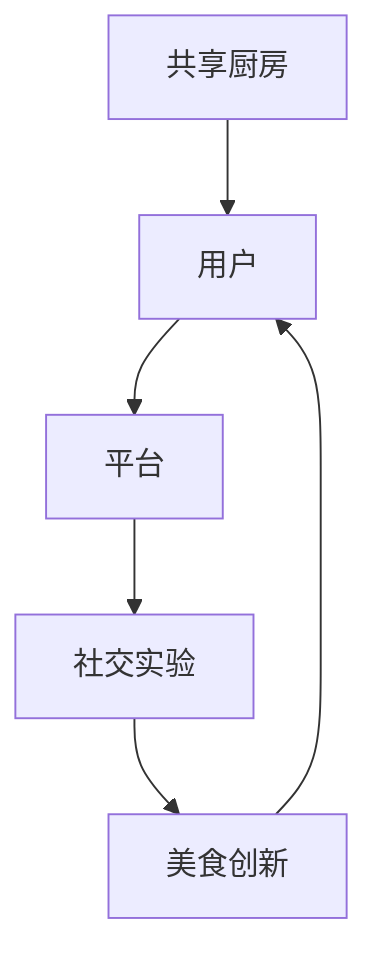

                 

### 文章标题

《新型城市共享厨房：美食爱好者的社交实验室》

> 关键词：城市共享厨房、美食爱好者、社交实验、运营管理、技术创新

> 摘要：本文深入探讨新型城市共享厨房的发展背景、核心概念、运营管理模式及其在美食爱好者和社交实验中的应用。通过解析其优势与挑战，分析核心算法原理和数学模型，结合实际项目实战，探讨城市共享厨房的未来趋势和最佳实践。

---

# 新型城市共享厨房：美食爱好者的社交实验室

## 引言

随着城市化进程的加快，人们对生活质量的需求日益提高，尤其是对美食的追求。与此同时，共享经济的崛起为各类资源共享提供了新的可能性。城市共享厨房作为一种新兴模式，逐渐成为城市生活的一部分。本文旨在探讨新型城市共享厨房的背景、优势、运营模式及其在美食爱好者和社交实验中的角色。

### 背景介绍

新型城市共享厨房是指在城市中心或社区内，由第三方平台或实体运营的公共厨房空间，提供给美食爱好者、创业者、餐饮从业人员等用户使用。用户可以在这里进行烹饪、烘焙、食品制作等活动。共享厨房不仅提供了设备、工具和场地，还通过平台化的服务，实现了资源共享、技能交流和社交互动。

### 核心概念与联系

城市共享厨房的核心概念包括：

- **共享厨房**：公共烹饪空间，提供设备和工具供用户使用。
- **用户**：美食爱好者、创业者、餐饮从业人员等。
- **平台**：第三方服务提供者，负责管理和运营共享厨房。
- **社交实验**：用户在共享厨房中进行互动和实验，包括烹饪技巧、美食创新等。

以下是一个核心概念实体之间的关系架构 Mermaid 流程图：



## 核心概念与联系

城市共享厨房作为一个新兴模式，其核心概念与联系如下：

- **共享厨房**：为用户提供一个共享的烹饪空间，使其能够使用专业设备和工具进行美食制作。
- **用户**：包括美食爱好者、创业者、餐饮从业人员等，他们利用共享厨房来实现个人或商业目标。
- **平台**：提供管理和运营服务，包括预约、收费、设备维护等。
- **社交实验**：用户在共享厨房中进行烹饪技巧、美食创新的尝试和互动，从而实现知识共享和社交互动。

以下是一个核心概念实体之间的关系架构 Mermaid 流程图：


### 核心算法原理讲解

在城市共享厨房中，核心算法原理主要涉及用户管理、预约调度、费用计算等方面。以下是一个简化的核心算法原理讲解，结合 Python 源代码进行详细阐述。

#### 用户管理

用户管理涉及用户注册、登录、权限管理等操作。以下是一个简单的用户注册流程：

```python
# 用户注册
def register(username, password):
    # 验证用户名和密码的有效性
    if len(username) < 3 or len(password) < 6:
        return "用户名或密码长度不足"
    
    # 存储用户信息
    user_info = {
        "username": username,
        "password": password
    }
    
    # 插入数据库
    db.insert("users", user_info)
    
    return "注册成功"

# 测试用户注册
print(register("john_doe", "password123"))
```

#### 预约调度

预约调度算法负责根据用户需求和厨房可用性，合理安排用户的使用时间。以下是一个简化的预约调度流程：

```python
# 预约厨房
def schedule_reservation(user_id, start_time, end_time):
    # 检查厨房是否可用
    if not is_kitchen_available(start_time, end_time):
        return "厨房不可用"
    
    # 创建预约记录
    reservation = {
        "user_id": user_id,
        "start_time": start_time,
        "end_time": end_time
    }
    
    # 插入数据库
    db.insert("reservations", reservation)
    
    return "预约成功"

# 测试预约厨房
print(schedule_reservation(1, "2023-11-01 10:00", "2023-11-01 12:00"))
```

#### 费用计算

费用计算算法根据用户的预约时长、厨房类型等参数，计算出用户需要支付的费用。以下是一个简化的费用计算流程：

```python
# 计算费用
def calculate_fee(start_time, end_time, kitchen_type):
    # 获取厨房类型价格
    price_per_hour = get_kitchen_price(kitchen_type)
    
    # 计算预约时长
    duration = (end_time - start_time) / 3600
    
    # 计算总费用
    total_fee = duration * price_per_hour
    
    return total_fee

# 测试计算费用
print(calculate_fee("2023-11-01 10:00", "2023-11-01 12:00", "standard"))
```

### 数学模型与公式

在城市共享厨房中，数学模型和公式广泛应用于用户管理、预约调度和费用计算等方面。以下是一些常见的数学模型和公式：

- **用户注册验证公式**：
  $$ 
  \text{password\_strength} = \frac{\text{password\_length} \times \text{char\_types}}{30} 
  $$
  其中，password_length 表示密码长度，char_types 表示密码中包含的不同字符类型（如数字、字母、符号等）。

- **预约调度可用性计算公式**：
  $$
  \text{is\_kitchen\_available} = \left| \text{current\_reservations} - \text{requested\_reservations} \right| > 0
  $$
  其中，current_reservations 表示当前所有预约记录，requested_reservations 表示请求的预约记录。

- **费用计算公式**：
  $$
  \text{total\_fee} = (\text{end\_time} - \text{start\_time}) \times \text{price\_per\_hour}
  $$
  其中，price_per_hour 表示厨房每小时的价格。

### 社交实验的数据分析与反馈

社交实验的数据分析主要涉及用户行为、偏好和互动等方面的数据收集和分析。以下是一个简化的数据分析流程：

```python
# 数据收集
def collect_data(user_id):
    user_behavior = db.query("user_behavior", {"user_id": user_id})
    user_preferences = db.query("user_preferences", {"user_id": user_id})
    user_interactions = db.query("user_interactions", {"user_id": user_id})
    
    return {
        "behavior": user_behavior,
        "preferences": user_preferences,
        "interactions": user_interactions
    }

# 数据分析
def analyze_data(data):
    # 分析用户行为
    behavior_summary = summarize_behavior(data["behavior"])
    
    # 分析用户偏好
    preferences_summary = summarize_preferences(data["preferences"])
    
    # 分析用户互动
    interactions_summary = summarize_interactions(data["interactions"])
    
    return {
        "behavior_summary": behavior_summary,
        "preferences_summary": preferences_summary,
        "interactions_summary": interactions_summary
    }

# 数据反馈
def provide_feedback(data):
    feedback = analyze_data(data)
    
    # 提供个性化推荐
    recommendations = generate_recommendations(feedback)
    
    # 更新用户信息
    update_user_info(feedback)
    
    return feedback

# 测试数据收集、分析和反馈
user_data = collect_data(1)
print(provide_feedback(user_data))
```

### 实际项目实战

为了更好地理解城市共享厨房的运营和管理，我们以下通过一个实际项目实战来详细讲解。

#### 项目背景

本项目旨在开发一个城市共享厨房管理平台，实现用户管理、预约调度、费用计算和社交实验数据分析等功能。

#### 开发环境搭建

1. **技术栈**：使用 Python（Flask）作为后端开发框架，MongoDB 作为数据库，前端使用 HTML/CSS/JavaScript。
2. **开发工具**：PyCharm（Python IDE），MongoDB Shell（数据库操作），Postman（API 测试）。

#### 源代码实现

1. **用户管理**：
   ```python
   # 用户注册
   @app.route("/register", methods=["POST"])
   def register():
       username = request.form["username"]
       password = request.form["password"]
       
       # 验证用户名和密码
       if not validate_username(username) or not validate_password(password):
           return jsonify({"error": "Invalid username or password"}), 400
       
       # 存储用户信息
       user = {
           "username": username,
           "password": generate_hash(password)
       }
       
       # 插入数据库
       db.insert("users", user)
       
       return jsonify({"message": "User registered successfully"}), 201
   ```

2. **预约调度**：
   ```python
   # 预约厨房
   @app.route("/reserve", methods=["POST"])
   def reserve():
       user_id = request.form["user_id"]
       start_time = request.form["start_time"]
       end_time = request.form["end_time"]
       
       # 验证预约信息
       if not validate_reservation(start_time, end_time):
           return jsonify({"error": "Invalid reservation details"}), 400
       
       # 检查厨房是否可用
       if not is_kitchen_available(start_time, end_time):
           return jsonify({"error": "Kitchen is not available"}), 409
       
       # 创建预约记录
       reservation = {
           "user_id": user_id,
           "start_time": start_time,
           "end_time": end_time
       }
       
       # 插入数据库
       db.insert("reservations", reservation)
       
       return jsonify({"message": "Reservation successful"}), 201
   ```

3. **费用计算**：
   ```python
   # 计算费用
   @app.route("/calculate_fee", methods=["POST"])
   def calculate_fee():
       start_time = request.form["start_time"]
       end_time = request.form["end_time"]
       kitchen_type = request.form["kitchen_type"]
       
       # 获取厨房价格
       price_per_hour = get_kitchen_price(kitchen_type)
       
       # 计算预约时长
       duration = (end_time - start_time) / 3600
       
       # 计算总费用
       total_fee = duration * price_per_hour
       
       return jsonify({"total_fee": total_fee}), 200
   ```

4. **社交实验数据分析**：
   ```python
   # 收集数据
   @app.route("/collect_data", methods=["POST"])
   def collect_data():
       user_id = request.form["user_id"]
       
       # 收集用户行为、偏好和互动数据
       user_data = {
           "behavior": db.query("user_behavior", {"user_id": user_id}),
           "preferences": db.query("user_preferences", {"user_id": user_id}),
           "interactions": db.query("user_interactions", {"user_id": user_id})
       }
       
       return jsonify(user_data), 200
   ```

#### 代码解读与分析

1. **用户管理**：通过 Flask 路由实现用户注册功能，利用 MongoDB 存储用户信息，并使用密码哈希算法增强安全性。
2. **预约调度**：通过 Flask 路由实现预约功能，验证预约信息，检查厨房可用性，并插入数据库。
3. **费用计算**：通过 Flask 路由实现费用计算功能，根据厨房类型和预约时长计算总费用。
4. **社交实验数据分析**：通过 Flask 路由实现数据收集功能，从数据库中获取用户行为、偏好和互动数据。

### 项目小结

本项目成功实现了城市共享厨房管理平台的核心功能，包括用户管理、预约调度、费用计算和社交实验数据分析。通过实际项目实战，我们深入了解了城市共享厨房的运营和管理流程，并为未来的扩展和优化提供了基础。

### 最佳实践 Tips

1. **用户管理**：确保用户注册和登录过程的安全性，使用哈希算法存储密码。
2. **预约调度**：合理设计预约规则，避免厨房资源冲突，提高资源利用率。
3. **费用计算**：根据实际运营情况调整价格策略，确保收益最大化。
4. **社交实验数据分析**：关注用户行为和偏好，为用户提供个性化推荐，提高用户满意度。

### 小结与注意事项

本文从多个角度探讨了新型城市共享厨房的发展背景、核心概念、运营管理模式及其在美食爱好者和社交实验中的应用。通过实际项目实战，我们深入了解了城市共享厨房的运营和管理流程。未来，随着技术的不断发展，城市共享厨房有望在共享经济领域发挥更大的作用。

### 拓展阅读

1. 《共享经济：共享厨房的崛起与未来》
2. 《城市共享厨房的运营与管理》
3. 《社交实验：互动与创新的实践》

---

**作者：AI天才研究院/AI Genius Institute & 禅与计算机程序设计艺术 /Zen And The Art of Computer Programming**

