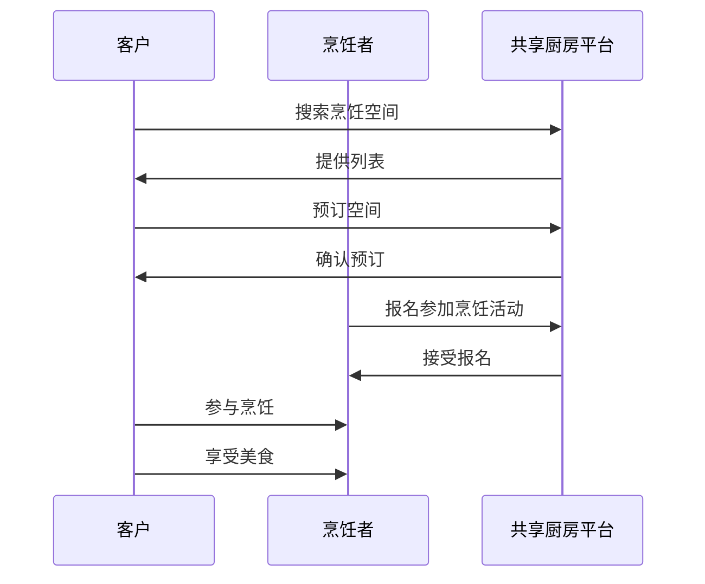

                 

### 1.1 新型城市共享厨房概述

#### 概念与意义

新型城市共享厨房是一种结合了现代科技和社交元素的餐饮模式，它不仅提供了共享烹饪空间，还构建了一个美食爱好者的社交平台。这种模式的核心在于资源共享、技能交流和文化传承，它对城市餐饮生态的改善和居民生活方式的变革具有重要意义。

**Mermaid流程图**：


**核心概念定义**：

在新型城市共享厨房中，几个核心概念需要明确：

- **共享厨房平台**：提供在线预订、设施共享、社交互动等一站式服务的平台。
- **烹饪空间**：为烹饪爱好者提供操作台、厨房设备、食材等基础设施的场所。
- **烹饪活动**：由专业烹饪者或烹饪爱好者组织的烹饪体验活动。
- **社交互动**：参与者之间的交流和互动，包括分享烹饪技巧、饮食文化等。

#### 技术推动因素

随着物联网（IoT）和大数据技术的发展，新型城市共享厨房得以实现智能化管理和个性化服务。以下是几个关键技术因素：

- **物联网与智能设备**：智能设备如智能冰箱、智能烤箱等，可以实时监测厨房环境，提高烹饪效率和安全性。
- **数据分析**：通过分析用户行为数据，平台可以优化烹饪空间的分配，提高用户满意度。

**伪代码**：
```python
def book_kitchen_space(user, space_id):
    # 检查用户预订权限
    if user.has_reservation_permission():
        # 预订厨房空间
        reservation = platform.reserve_space(user, space_id)
        if reservation.is_successful():
            return "预订成功"
        else:
            return "预订失败，空间已满"
    else:
        return "预订失败，用户权限不足"

# 示例
print(book_kitchen_space(user1, space_id123))
```

通过这种技术架构，新型城市共享厨房不仅为居民提供了便利，也为城市餐饮行业带来了新的增长点。接下来，我们将进一步探讨新型城市共享厨房的概念基础及其在不同城市环境中的应用模式。

