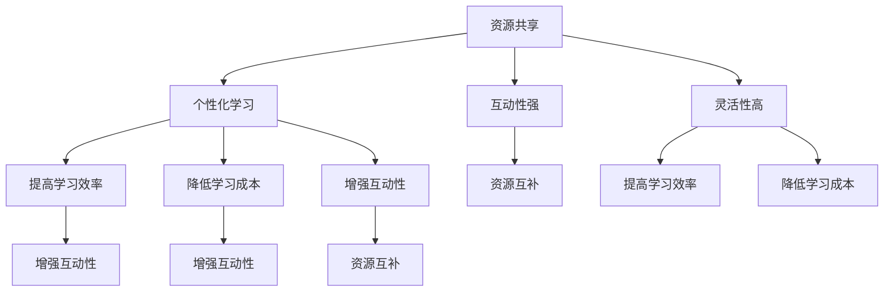
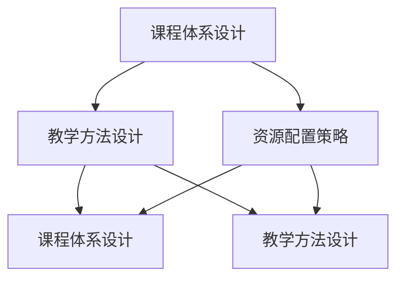

                 

### 文章标题

《新型城市共享厨艺课程：线上线下结合的烹饪教育模式》

----------------------------------------------------------------

**关键词：**  
- 城市共享厨艺课程
- 线上线下结合
- 烹饪教育模式
- 教学平台搭建
- 资源配置策略
- 教学活动组织

**摘要：**  
本文深入探讨了新型城市共享厨艺课程的设计与实施，着重分析了线上线下结合的烹饪教育模式。首先，我们介绍了共享厨艺课程的概念及其在城市化进程中的重要性。接着，我们详细描述了线上线下结合的教育模式，包括课程体系设计、教学方法、资源配置策略等。然后，我们分别讲解了线上教学平台和线下教学活动的搭建与组织，并通过实际案例进行了分析。最后，我们展望了共享厨艺课程的发展趋势，提出了未来改进的方向和潜在挑战。本文旨在为教育工作者和烹饪爱好者提供一套实用、系统的烹饪教育模式参考。

----------------------------------------------------------------

### 1. 导论

在当前快速发展的城市化进程中，人们对生活质量的要求越来越高，特别是在饮食方面。随着共享经济的发展，共享厨艺课程作为一种新兴的教育模式，逐渐受到了人们的关注。本文旨在探讨新型城市共享厨艺课程的设计与实施，特别是线上线下结合的烹饪教育模式。

#### 1.1 书籍主题与目的

本书的主题是新型城市共享厨艺课程，旨在为教育工作者和烹饪爱好者提供一套完整、系统的烹饪教育模式参考。本书的主要目的是：

1. **介绍共享厨艺课程的概念和背景**：通过阐述共享厨艺课程的发展历程和重要性，帮助读者了解这一新兴教育模式的基本概念。
2. **分析线上线下结合的教育模式**：详细描述线上线下结合的烹饪教育模式，包括课程体系设计、教学方法、资源配置策略等，为教育实践提供理论支持。
3. **讲解线上教学平台的搭建**：介绍线上教学平台的搭建过程、功能模块和关键技术，为教育工作者提供实际操作指南。
4. **探讨线下教学活动的组织**：分析线下教学活动的设计与实施，包括课程安排、师资队伍和教学评价，为教育实践提供可操作性建议。
5. **分享实际案例和经验**：通过实际案例分析和经验分享，帮助读者了解共享厨艺课程的成功经验和面临的问题，并提出解决方案。
6. **展望共享厨艺课程的发展趋势**：探讨共享厨艺课程的发展趋势、未来方向和潜在挑战，为教育工作者提供前瞻性思考。

#### 1.2 读者对象与预期收益

本书的读者对象主要包括以下几个方面：

1. **教育工作者**：如教师、教育管理者、烹饪学校负责人等，他们可以通过本书了解新型城市共享厨艺课程的设计与实施，为实际教学提供参考。
2. **烹饪爱好者**：对烹饪有兴趣的读者可以通过本书学习到专业的烹饪知识和技能，提高自己的烹饪水平。
3. **研究学者**：对烹饪教育模式感兴趣的研究学者可以通过本书了解当前烹饪教育的发展趋势和前沿研究。

通过阅读本书，读者可以预期获得以下收益：

1. **了解共享厨艺课程的概念和背景**：对共享厨艺课程有一个全面、系统的认识。
2. **掌握线上线下结合的教育模式**：了解如何设计、实施和评价线上线下结合的烹饪教育模式。
3. **学习线上教学平台的搭建**：掌握线上教学平台的搭建方法和关键技术。
4. **提高烹饪技能**：通过学习本书提供的烹饪知识和技能，提高自己的烹饪水平。
5. **获得实际案例和经验**：通过分析实际案例，了解共享厨艺课程的成功经验和面临的问题，为实际工作提供参考。
6. **前瞻性思考**：对共享厨艺课程的发展趋势和未来方向有更深入的了解，为教育工作者的研究和实践提供指导。

#### 1.3 书籍结构概述

本书共分为七个主要部分，具体结构如下：

1. **导论**：介绍书籍的主题、目的、读者对象以及书籍的结构和内容概述。
2. **背景与理论基础**：介绍共享厨艺课程的概念、发展历程以及线上线下结合的教育模式。
3. **共享厨艺课程的架构设计**：详细讲解共享厨艺课程的课程体系、教学方法和资源配置。
4. **线上教学平台的搭建**：介绍线上教学平台的搭建过程、功能模块和关键技术。
5. **线下教学活动的组织**：探讨线下教学活动的设计与实施，包括课程安排、师资队伍和教学评价。
6. **案例分析与经验分享**：分享实际案例，分析成功经验和面临的问题，并提出解决方案。
7. **发展趋势与展望**：探讨共享厨艺课程的发展趋势、未来方向和潜在挑战。

通过以上结构，本书力求为读者提供一套完整、系统的共享厨艺课程参考，帮助读者更好地理解和实施这一新兴教育模式。

### 2. 背景与理论基础

#### 2.1 共享厨艺课程的概念

共享厨艺课程是一种基于共享经济理念的新型烹饪教育模式。它通过线上和线下的方式，为广大烹饪爱好者提供便捷、专业的烹饪学习资源和服务。共享厨艺课程的核心在于资源的共享和优化，通过整合优质教育资源，提高学习效率，降低学习成本。

共享厨艺课程的主要特点包括：

1. **资源共享**：通过线上平台，将各类烹饪资源（如教学视频、食谱、工具等）进行整合，实现资源的共享和优化。
2. **个性化学习**：根据学习者的需求和兴趣，提供定制化的学习路径和课程内容，满足个性化学习需求。
3. **互动性强**：线上平台提供互动交流功能，学习者可以与其他学习者互动，分享学习心得，提高学习效果。
4. **灵活性高**：学习者可以根据自己的时间安排，灵活选择学习时间和地点，实现随时随地学习。

#### 2.2 线上线下结合的教育模式

线上线下结合的教育模式是指将线上教育和线下教育相互结合，发挥各自优势，实现教育资源的最大化利用。在共享厨艺课程中，线上线下结合的教育模式具有以下优势：

1. **资源互补**：线上教育资源丰富、多样，可以提供大量的教学视频、电子书籍等；线下教育资源则更注重实践教学，如实际操作、面对面交流等。两者结合，可以实现教育资源的最大化利用。
2. **提高学习效率**：线上教育可以为学生提供大量的学习资源，节省了学生寻找资料的时间；线下教育则可以提供实际操作的机会，让学生更好地理解和掌握烹饪技能。
3. **降低学习成本**：线上教育可以减少交通、住宿等成本，降低整体学习成本；线下教育则可以提供更为丰富、实用的实践机会，提高学习效果。
4. **增强互动性**：线上教育可以为学生提供交流平台，让学生在学习过程中相互交流、互动；线下教育则可以提供面对面的交流机会，增强学习者的学习动力。

#### 2.3 共享厨艺课程的发展历程

共享厨艺课程作为一种新兴的教育模式，其发展历程可以分为以下几个阶段：

1. **初期探索阶段（2010-2015年）**：在这一阶段，共享厨艺课程主要以线上平台的形式出现，如烹饪教学网站、APP等。这一阶段的共享厨艺课程主要侧重于提供烹饪教学视频和电子书籍等资源，以供学习者自主学习。
2. **快速发展阶段（2016-2020年）**：随着移动互联网的普及，共享厨艺课程逐渐与线上线下结合的教育模式相结合。这一阶段，共享厨艺课程开始注重实践教学，如线下烹饪培训班、烹饪比赛等，同时线上教育资源也进一步丰富，如直播教学、互动交流等。
3. **成熟阶段（2021年至今）**：在这一阶段，共享厨艺课程已经形成较为完整的体系，线上教育资源进一步丰富，线下实践教学活动也日益成熟。同时，共享厨艺课程开始向多元化、个性化方向发展，以满足不同学习者的需求。

#### 2.4 核心概念与联系

在共享厨艺课程中，核心概念包括：资源共享、个性化学习、互动性强、灵活性高、资源互补、提高学习效率、降低学习成本、增强互动性。这些概念之间存在着紧密的联系，构成了一个完整的共享厨艺课程体系。以下是这些概念之间的联系架构图：

通过以上架构图，我们可以清楚地看到，资源共享是共享厨艺课程的核心，它直接影响了个性化学习、互动性、灵活性、提高学习效率、降低学习成本和增强互动性等概念。而资源互补、提高学习效率、降低学习成本和增强互动性等概念则相互支持，共同构成了一个完整的共享厨艺课程体系。

### 3. 共享厨艺课程的架构设计

#### 3.1 课程体系设计

共享厨艺课程的课程体系设计是确保教学效果和学生学习体验的重要环节。一个完善、系统的课程体系应包括以下内容：

1. **课程目标**：明确课程的学习目标，包括基础技能掌握、专业技能提升、创新实践等。例如，初级课程的目标是使学生掌握基本的烹饪技巧和食材处理方法，中级课程的目标是提高学生的烹饪水平和创新能力，高级课程的目标是培养专业厨师或烹饪专家。
2. **课程内容**：根据不同层次的学习目标，设计相应的课程内容。课程内容应涵盖烹饪基础知识、烹饪技能、食材选择与搭配、营养健康等方面。例如，初级课程内容包括烹饪工具的使用、食材的清洗和切割、基本烹饪技巧等；中级课程内容包括高级烹饪技巧、创意菜品设计、烹饪比赛技巧等；高级课程内容包括专业餐厅运营管理、菜品创新研发等。
3. **课程结构**：课程结构应具有层次性和连贯性，从基础到高级，逐步提升。同时，课程结构应注重理论与实践的结合，使学生在学习过程中能够充分理解和掌握烹饪技能。例如，课程可以分为基础知识、实践操作、案例分析、综合训练等环节，每个环节都有明确的教学目标和教学内容。
4. **课程评价**：建立科学、合理的课程评价体系，包括过程评价和结果评价。过程评价主要关注学生的学习过程，如出勤率、学习态度、课堂表现等；结果评价主要关注学生的学习成果，如考试分数、作品质量、实际操作能力等。通过评价体系的建立，可以及时了解学生的学习状况，调整教学策略，提高教学质量。

#### 3.2 教学方法设计

教学方法设计是确保课程目标实现和学生学习效果的关键。在共享厨艺课程中，可以采用以下几种教学方法：

1. **讲授法**：讲授法是传统的教学方法，适用于传授烹饪基础知识。通过教师的讲解，使学生了解烹饪的基本原理和技巧。讲授法应注重生动、形象，使学生在轻松愉快的氛围中学习。
2. **实践操作法**：实践操作法是让学生亲自动手操作，实际操作烹饪过程，掌握烹饪技能。实践操作法应注重安全、卫生，确保学生在实际操作中能够充分理解和掌握烹饪技能。
3. **互动讨论法**：互动讨论法是让学生在课堂上相互交流、讨论，分享学习心得和经验，提高学习效果。互动讨论法应注重激发学生的思维，培养学生的创新意识和团队协作能力。
4. **案例分析法**：案例分析法是通过分析实际案例，让学生了解烹饪过程中的问题和解决方案，提高学生的实际操作能力和分析问题、解决问题的能力。案例分析法应注重真实、典型，使学生在分析案例中能够充分理解和掌握烹饪技能。

#### 3.3 资源配置策略

资源配置策略是共享厨艺课程顺利实施的保障。合理的资源配置可以提高教学效果，降低学习成本。在共享厨艺课程中，应注重以下资源配置策略：

1. **教师资源**：教师是课程实施的关键，应注重教师的选拔和培训。教师应具备丰富的烹饪经验和教学能力，能够胜任课程的教学任务。同时，应建立教师团队，实现资源共享，提高教学质量。
2. **教材资源**：教材是学生学习的重要资料，应注重教材的编写和选用。教材应内容丰富、图文并茂，便于学生理解和掌握。同时，应不断更新教材内容，保持教材的时效性和实用性。
3. **技术资源**：技术资源是线上教学平台建设的基础，应注重技术资源的投入和建设。技术资源包括服务器、网络、数据库、教学软件等，应确保教学平台的稳定运行和高效使用。
4. **设施资源**：设施资源包括教学场所、烹饪设备、工具等，应确保设施资源的充足和先进。教学场所应干净、整洁、宽敞，烹饪设备应齐全、先进，确保学生在实际操作中能够充分练习和掌握烹饪技能。
5. **时间资源**：时间资源是确保教学任务按时完成的重要保障，应注重时间资源的合理安排。应制定详细的教学计划，确保课程内容的有序推进，同时给予学生充分的练习和复习时间。

#### 3.4 核心概念与联系

在共享厨艺课程中，核心概念包括课程体系设计、教学方法设计、资源配置策略。这些概念之间存在着紧密的联系，构成了一个完整的共享厨艺课程体系。以下是这些概念之间的联系架构图：

通过以上架构图，我们可以清楚地看到，课程体系设计是共享厨艺课程的基础，教学方法设计和资源配置策略是课程体系设计的具体实现。教学方法设计应围绕课程体系设计进行，资源配置策略应满足教学方法和课程体系设计的需求。这三者相互联系，共同构成了一个完整的共享厨艺课程体系。

### 4. 线上教学平台的搭建

#### 4.1 平台搭建概述

线上教学平台是共享厨艺课程的核心组成部分，它为学习者提供了便捷的学习资源和互动空间。平台搭建的总体目标是实现教学资源的在线共享、教学活动的线上开展以及学习者之间的互动交流。以下为平台搭建的概述：

1. **目标定位**：线上教学平台的目标是提供一站式烹饪教育服务，包括课程学习、互动交流、资源下载、在线测试等。
2. **功能模块**：平台应具备以下功能模块：用户管理、课程管理、教学资源管理、互动交流、在线测试与评估、数据统计与分析等。
3. **技术架构**：平台的技术架构应具备高可用性、高性能、高扩展性等特点，采用微服务架构，便于功能模块的独立开发和维护。
4. **用户体验**：平台应注重用户体验，界面设计简洁直观，操作流程简便，确保学习者能够快速上手。

#### 4.2 功能模块设计

线上教学平台的功能模块设计是确保平台稳定运行和高效使用的关键。以下为平台的主要功能模块及其设计思路：

1. **用户管理模块**：用户管理模块负责用户的注册、登录、个人信息管理、权限控制等。设计思路包括：
   - 用户注册：支持用户名、邮箱、手机等多种注册方式，确保用户方便快捷地注册。
   - 用户登录：支持密码登录、短信验证码登录等多种登录方式，提高用户登录的便捷性。
   - 个人信息管理：用户可以修改个人信息、上传头像、绑定社交媒体账号等。
   - 权限控制：根据用户角色（如学生、教师、管理员）分配不同权限，确保平台功能的安全和稳定。

2. **课程管理模块**：课程管理模块负责课程信息的上传、编辑、发布、分类等。设计思路包括：
   - 课程分类：按照课程难度、类型、菜系等进行分类，便于学习者快速找到所需课程。
   - 课程发布：管理员可以发布新课程，设置课程封面、简介、课程目录等。
   - 课程编辑：管理员可以对已发布课程进行编辑，更新课程内容、调整课程结构等。

3. **教学资源管理模块**：教学资源管理模块负责教学资源的上传、下载、分类、共享等。设计思路包括：
   - 资源分类：按照资源类型（如视频、文档、图片等）进行分类，便于学习者查找和使用。
   - 资源共享：支持用户上传资源，其他用户可以下载和使用，实现资源共享。
   - 资源下载：用户可以下载所需资源，方便学习和复习。

4. **互动交流模块**：互动交流模块负责学习者之间的交流和互动，包括评论区、论坛、聊天室等。设计思路包括：
   - 评论区：用户可以在课程页面、资源页面等评论区发表观点、提问和回答问题。
   - 论坛：设置课程论坛，用户可以发帖、回帖、参与讨论。
   - 聊天室：设置实时聊天室，用户可以实时交流，提高学习氛围。

5. **在线测试与评估模块**：在线测试与评估模块负责对学习者的学习成果进行测试和评估。设计思路包括：
   - 测试发布：管理员可以发布在线测试，设置测试题目、答案和评分标准。
   - 测试答题：用户可以在线答题，系统自动评分并给出答案解析。
   - 评估报告：生成学习者的测试报告，展示学习者的测试成绩和知识点掌握情况。

6. **数据统计与分析模块**：数据统计与分析模块负责对平台运行数据进行分析和统计，为平台优化和决策提供依据。设计思路包括：
   - 数据收集：收集用户行为数据、课程数据、测试数据等。
   - 数据分析：对收集到的数据进行分析，生成报告和图表，展示平台运行状况和用户行为特点。
   - 数据可视化：使用图表、报表等形式展示分析结果，便于理解和决策。

#### 4.3 关键技术介绍

线上教学平台的搭建涉及多项关键技术，以下为关键技术及其简要介绍：

1. **前端技术**：前端技术包括HTML、CSS、JavaScript等，负责平台界面的设计和实现。前端技术应具备响应式设计，确保平台在不同设备和屏幕尺寸上都能正常运行。

2. **后端技术**：后端技术包括服务器端编程语言（如Python、Java等）、数据库（如MySQL、MongoDB等）、服务器（如Apache、Nginx等）。后端技术负责处理用户请求、数据存储和管理、业务逻辑实现等。

3. **开发框架**：开发框架包括Django、Spring Boot、Flask等，用于简化后端开发过程，提高开发效率。选择合适的开发框架可以加快平台开发进度，确保平台稳定运行。

4. **云服务**：云服务包括阿里云、腾讯云、华为云等，提供服务器、数据库、存储等基础设施服务。使用云服务可以降低硬件投入成本，提高平台的可扩展性和可靠性。

5. **缓存技术**：缓存技术（如Redis、Memcached等）用于提高平台响应速度，减少数据库访问压力。缓存技术可以存储高频访问的数据，加快数据读取速度。

6. **消息队列**：消息队列（如RabbitMQ、Kafka等）用于处理平台中的异步任务，如邮件通知、消息推送等。消息队列可以确保任务的高效、可靠执行，提高系统性能。

7. **API接口**：API接口用于实现平台与其他系统（如第三方登录、支付系统等）的对接。设计合理的API接口可以提高平台的可扩展性和灵活性。

#### 4.4 平台搭建步骤

线上教学平台的搭建可以分为以下几个步骤：

1. **需求分析**：明确平台的功能需求、性能需求、安全性需求等，为后续开发提供依据。

2. **技术选型**：根据需求分析结果，选择合适的前端技术、后端技术、开发框架、云服务等，确保平台的技术架构合理、稳定。

3. **数据库设计**：设计平台的数据库架构，包括表结构、关系模型、索引等，为数据存储和管理提供支持。

4. **前端开发**：根据设计文档，使用前端技术实现平台界面，包括页面布局、交互效果、响应式设计等。

5. **后端开发**：根据设计文档，使用后端技术实现平台功能，包括用户管理、课程管理、教学资源管理、互动交流、在线测试与评估等。

6. **接口开发**：设计并实现平台与其他系统的API接口，确保平台与其他系统的高效对接。

7. **测试与部署**：对平台进行功能测试、性能测试、安全性测试等，确保平台稳定、可靠。测试通过后，进行平台部署，包括服务器配置、数据库安装、应用部署等。

8. **运维与优化**：对平台进行持续运维，包括系统监控、故障处理、性能优化等，确保平台稳定运行。

通过以上步骤，可以搭建一个功能完善、稳定可靠的线上教学平台，为共享厨艺课程的开展提供有力支持。

### 5. 线下教学活动的组织

#### 5.1 教学活动设计

线下教学活动的设计是确保共享厨艺课程顺利进行的重要环节。教学活动设计应充分考虑课程目标、学习者的需求以及场地条件等因素。以下是线下教学活动设计的主要内容：

1. **课程安排**：课程安排应合理分配理论学习和实践操作的时间，确保学习者能够充分理解和掌握烹饪技能。例如，初级课程可以安排每周一次的理论课和一次的实践课，中级课程可以增加实践课的频率，高级课程可以安排更多实践操作的机会。

2. **教学资源**：教学资源包括教材、工具、设备等，应确保教学资源的充足和先进。教材应内容丰富、图文并茂，便于学习者理解和掌握；工具和设备应齐全、先进，确保学习者能够顺利地进行实践操作。

3. **教学环境**：教学环境应干净、整洁、宽敞，具备良好的通风和照明条件，确保学习者的安全和舒适。同时，应配备必要的烹饪设备和工具，如炉灶、烤箱、刀具、砧板等。

4. **教学活动流程**：教学活动流程应包括课程导入、理论学习、实践操作、总结与反思等环节。在课程导入环节，教师可以简要介绍课程内容和目标，激发学习者的兴趣；在理论学习环节，教师可以通过讲解、演示等方式，使学习者掌握必要的理论知识；在实践操作环节，教师应引导学习者动手实践，确保学习者能够正确、安全地操作；在总结与反思环节，教师应引导学习者总结学习心得，提出改进意见。

#### 5.2 师资队伍建设

师资队伍建设是确保线下教学活动质量的重要保障。以下为师资队伍建设的要点：

1. **教师选拔**：教师应具备丰富的烹饪经验和教学能力，具有相关专业背景和资格证书。选拔过程应注重教师的专业素养、教学水平和实践能力。

2. **教师培训**：教师应定期参加专业培训，更新烹饪知识和技能，提高教学水平。培训内容应包括烹饪技术、教学方法、课程设计、教学评价等方面。

3. **教师评价**：建立科学的教师评价体系，对教师的教学质量、教学成果进行评价。评价结果应作为教师晋升、奖励和培训的重要依据。

4. **教师团队建设**：建立教师团队，实现教师之间的资源共享和相互协作。教师团队应定期开展教研活动，共同探讨教学问题，提高整体教学水平。

#### 5.3 教学评价体系

教学评价体系是衡量教学效果的重要手段。以下为教学评价体系的主要内容：

1. **过程评价**：过程评价主要关注学生的学习过程，包括出勤率、课堂表现、作业完成情况等。通过过程评价，可以了解学生的学习状况，及时调整教学策略。

2. **结果评价**：结果评价主要关注学生的学习成果，包括考试成绩、作品质量、实际操作能力等。通过结果评价，可以了解学生的学习效果，为课程改进提供依据。

3. **评价方式**：评价方式应多样化，包括笔试、口试、实操、作品展示等。通过多种评价方式的结合，可以全面、客观地评估学生的学习成果。

4. **评价结果的应用**：评价结果应作为学生学习成绩、课程质量的重要依据。同时，评价结果应反馈给教师和学生，为教学改进提供参考。

#### 5.4 线下教学案例分析

以下为某共享厨艺课程线下教学活动的案例分析：

**案例背景**：某烹饪学校开设了一门初级烹饪课程，课程目标是为初学者提供基本的烹饪技巧和知识。

**教学活动设计**：

1. **课程安排**：每周一次的理论课和一次的实践课，每次课程时间为2小时。

2. **教学资源**：教材为《初级烹饪教程》，配备烹饪工具和设备，如炉灶、烤箱、刀具、砧板等。

3. **教学环境**：教室干净、整洁，通风良好，配备必要的烹饪设备和工具。

4. **教学活动流程**：

   - **课程导入**：教师简要介绍课程内容和目标，激发学生的学习兴趣。

   - **理论学习**：教师通过讲解、演示等方式，使学习者掌握烹饪基础知识，如食材处理、烹饪技巧等。

   - **实践操作**：教师引导学习者动手实践，如切菜、炒菜等，确保学习者能够正确、安全地操作。

   - **总结与反思**：教师引导学生总结学习心得，提出改进意见，为下一次课程做好准备。

**教学评价**：

1. **过程评价**：通过出勤率、课堂表现等指标，了解学生的学习状况。

2. **结果评价**：通过考试和实操考核，评估学习者的学习成果。

3. **评价结果的应用**：评价结果作为学生学习成绩的重要依据，反馈给教师和学生，为教学改进提供参考。

**案例分析**：

通过上述案例分析，我们可以看出，合理的课程安排、充足的教学资源、良好的教学环境和科学的评价体系是确保线下教学活动顺利进行的重要因素。在教学过程中，教师应注重理论与实践的结合，提高学习者的动手能力和实践技能。同时，通过过程评价和结果评价，了解学习者的学习状况，及时调整教学策略，提高教学质量。

### 6. 案例分析与经验分享

#### 6.1 成功案例分析

在共享厨艺课程的发展过程中，有许多成功的案例值得借鉴。以下为某城市共享厨艺课程的案例分析：

**案例背景**：某城市的一家烹饪学校推出了线上线下结合的共享厨艺课程，课程涵盖从初级到高级的各类烹饪技能。

**课程内容**：课程内容包括烹饪基础知识、各类菜系的教学、烹饪技巧和创新菜品的制作。

**线上平台**：学校搭建了一个功能完善的线上教学平台，提供视频教程、电子书籍、互动交流区等资源。

**线下教学**：学校在市区设立多个教学点，提供实际操作课程，学员可以参加各种烹饪实践活动。

**成功经验**：

1. **课程体系完善**：课程内容丰富，涵盖各类烹饪技能，满足不同层次学习者的需求。

2. **线上线下结合**：线上平台为学习者提供了便捷的学习资源，线下教学点提供了实践机会，实现了理论和实践的结合。

3. **互动交流**：线上平台上的互动交流区使学习者能够互相分享学习心得，提高了学习效果。

4. **教师团队强大**：教师团队由经验丰富的烹饪专家组成，能够提供高质量的教学服务。

**案例分析**：

该案例的成功在于：

1. **课程体系的科学性**：课程体系设计合理，从基础到高级，逐步提升，使学习者能够系统地掌握烹饪技能。

2. **教学模式的创新**：线上线下结合的教学模式提高了学习效率，降低了学习成本，增强了学习体验。

3. **教师团队的实力**：强大的教师团队为课程质量提供了保障，确保了教学效果。

#### 6.2 面临的问题与挑战

尽管共享厨艺课程在发展过程中取得了显著成果，但仍面临一些问题和挑战：

1. **教学资源不足**：部分共享厨艺课程的教学资源不足，特别是线上教育资源。一些平台上的教学视频和文档质量不高，无法满足学习者的需求。

2. **线上线下衔接不畅**：线上线下教学衔接不够紧密，部分学习者反映在线上学习后，线下实践时存在一定的困难。

3. **师资力量薄弱**：一些共享厨艺课程的师资力量薄弱，教师的专业水平和教学能力有待提高。

4. **学习效果评价不足**：部分课程缺乏有效的学习效果评价机制，无法准确评估学习者的学习成果。

#### 6.3 解决方案与改进措施

针对上述问题和挑战，可以采取以下解决方案和改进措施：

1. **优化教学资源**：加大对线上教学资源的投入，提高教学视频和文档的质量。可以邀请烹饪专家录制教学视频，编写高质量的教材。

2. **强化线上线下衔接**：完善线上线下教学衔接机制，确保线上学习与线下实践的无缝对接。可以通过线上课程导学、线下实践指导等方式，提高学习效果。

3. **加强师资培训**：加强对教师的专业培训和教学能力提升，定期举办教学研讨会、工作坊等，提高教师的教学水平。

4. **建立学习效果评价机制**：建立科学、合理的学习效果评价机制，通过过程评价和结果评价，全面了解学习者的学习状况。可以设置在线测试、实操考核等评价方式，确保学习效果。

#### 6.4 经验分享

以下为共享厨艺课程实施过程中的经验分享：

1. **课程内容要贴近实际**：课程内容应贴近实际生活，关注学习者的需求和兴趣，提高学习者的学习积极性。

2. **注重实践教学**：实践教学是共享厨艺课程的重要环节，应确保学习者有足够的实践机会，提高动手能力。

3. **加强互动交流**：线上平台应提供充分的互动交流功能，鼓励学习者分享学习心得，互相帮助。

4. **定期反馈与改进**：定期收集学习者的反馈意见，及时调整教学策略，提高教学质量。

通过以上经验分享，我们可以更好地实施共享厨艺课程，为学习者提供优质的教育服务。

### 7. 发展趋势与展望

#### 7.1 发展趋势分析

共享厨艺课程作为一种新兴的教育模式，正随着城市化进程的加快和人们对生活质量的要求提高而逐渐受到关注。以下是共享厨艺课程发展的一些趋势：

1. **技术进步推动**：随着互联网技术的不断发展，尤其是移动互联网的普及，线上教学平台的功能和性能不断提升，为共享厨艺课程提供了更好的技术支持。

2. **教育需求增加**：随着人们对健康饮食和烹饪技能的重视，以及烹饪爱好者对专业培训的需求增加，共享厨艺课程的市场需求不断上升。

3. **多元化发展**：共享厨艺课程正朝着多元化方向发展，不仅涵盖传统菜系的培训，还涉及国际美食、创新菜品设计等，满足不同层次、不同口味的学习者需求。

4. **线上线下结合**：共享厨艺课程逐渐实现线上线下相结合，通过线上平台提供丰富的学习资源，线下教学点提供实践机会，使教学效果更加显著。

5. **教育服务专业化**：越来越多的教育机构和企业参与到共享厨艺课程中，提供专业化的烹饪培训服务，推动整个行业的专业化发展。

#### 7.2 未来方向探讨

面对共享厨艺课程的发展趋势，未来的方向可以从以下几个方面进行探讨：

1. **个性化学习**：随着人工智能和大数据技术的发展，共享厨艺课程可以进一步实现个性化学习，根据学习者的兴趣、水平和需求，提供定制化的学习方案。

2. **国际化发展**：共享厨艺课程可以进一步拓展国际市场，与国外烹饪培训机构合作，引进国际先进的教学理念和技术，提高课程的国际影响力。

3. **创新创业**：鼓励学习者参与烹饪创新和创业项目，通过课程培养创新意识和创业能力，推动烹饪行业的创新和创业发展。

4. **校企合作**：加强校企合作，为企业提供定制化的烹饪培训服务，推动烹饪人才的培养与企业需求的对接。

5. **规范化管理**：建立健全共享厨艺课程的标准和规范，提高课程的质量和公信力，推动行业的规范化发展。

#### 7.3 潜在挑战与应对策略

尽管共享厨艺课程发展前景广阔，但在发展过程中仍面临一些潜在挑战：

1. **技术更新**：技术更新速度加快，对课程内容的实时更新和技术的不断升级提出了更高的要求。

2. **教育资源不均衡**：不同地区、不同背景的学习者教育资源不均衡，可能导致学习效果的差异。

3. **师资培训**：教师的培训水平和教学能力是共享厨艺课程发展的关键，但现有的师资培训体系可能不足以满足快速发展的需求。

4. **市场竞争**：共享厨艺课程的快速发展吸引了大量企业进入市场，市场竞争日益激烈。

针对上述挑战，可以采取以下应对策略：

1. **技术持续升级**：保持对前沿技术的关注，持续升级教学平台，提高教学效率和用户体验。

2. **教育资源均衡发展**：通过政策引导和资源整合，推动教育资源在不同地区和群体之间的均衡发展。

3. **加强师资培训**：建立完善的师资培训体系，定期举办专业培训，提高教师的教学能力和水平。

4. **强化品牌建设**：通过差异化竞争，打造具有独特优势的共享厨艺课程品牌，提高市场竞争力。

通过以上策略，共享厨艺课程可以更好地应对未来发展中的挑战，实现可持续发展。

### 附录

**附录A：共享厨艺课程相关的工具与资源**

1. **在线教学平台**：
   - **Udemy**：提供大量的烹饪课程，适合不同水平的学员。
   - **Coursera**：与多所知名大学合作，提供系统的烹饪课程。
   - **Skillshare**：提供互动性强、内容丰富的烹饪课程。

2. **视频教程**：
   - **YouTube**：搜索烹饪相关的视频教程，涵盖各种菜系和技巧。
   - **TikTok**：快速获取烹饪灵感和技巧的小视频。

3. **食谱网站**：
   - **Epicurious**：提供丰富多样的食谱和烹饪技巧。
   - **Allrecipes**：涵盖各种菜系，适合家庭烹饪。

4. **烹饪工具和设备**：
   - **Amazon**：购买各种烹饪工具和设备，如厨房刀具、烤箱、压力锅等。
   - **Williams-Sonoma**：高端厨房用品，适合专业烹饪。

**附录B：线上教学平台开发参考资料**

1. **技术文档**：
   - **Django**：Python Web开发框架，适用于快速搭建线上教学平台。
   - **Flask**：轻量级Python Web开发框架，适合小型线上教学平台。
   - **Spring Boot**：Java Web开发框架，适用于大型线上教学平台。

2. **学习资源**：
   - **慕课网**：提供Web开发相关的视频教程和资料。
   - **极客学院**：涵盖Python、Java等编程语言的学习资源。
   - **GitHub**：搜索和参考线上教学平台的开源项目。

**附录C：线下教学活动实施指南**

1. **教学场所选择**：选择干净、整洁、交通便利的教学场所，确保学生的舒适和安全。

2. **设备配置**：确保厨房设备、工具齐全，如炉灶、烤箱、刀具、砧板等。

3. **课程准备**：提前准备好课程所需的食材、调料和教学资料。

4. **课堂管理**：制定课堂管理规范，确保教学秩序，提高学习效果。

5. **学员反馈**：课后收集学员反馈，及时调整教学计划和内容。

### 作者信息

**作者：AI天才研究院/AI Genius Institute & 禅与计算机程序设计艺术 /Zen And The Art of Computer Programming**

