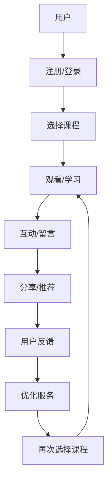

                 

### 1. 背景介绍

在当今社会，随着城市化进程的加速和人们生活节奏的加快，人们对生活方式的需求也在不断变化。共享经济模式作为一种新兴的经济形态，已经渗透到了生活的方方面面，从共享单车到共享房屋，再到共享办公空间，共享经济正在改变着我们的生活方式。然而，在共享经济的众多领域之中，烹饪技能的共享却相对较少被关注。

烹饪技能的共享，不仅能够让人们方便快捷地学习各种烹饪技巧，提高自己的烹饪水平，同时也可以作为一种社交活动，增强人与人之间的互动与交流。近年来，随着社交网络的普及和发展，烹饪技能与社交网络的结合开始成为一种新的趋势。通过社交网络平台，人们可以分享自己的烹饪经验，展示自己的厨艺，同时也可以参与他人的烹饪活动，从而实现烹饪技能的共享。

本文旨在探讨这种新型城市共享厨艺课的发展现状、核心概念、算法原理以及面临的挑战，并分析其未来发展趋势。具体而言，文章将分为以下几个部分：

- **核心概念与联系**：首先，我们将介绍共享厨艺课的概念，探讨社交网络与烹饪技能结合的原理，并分析共享厨艺课的发展现状和趋势。
- **核心算法原理讲解**：接着，我们将详细讲解社交网络平台的选择与搭建、烹饪技能的数字化与标准化、用户需求分析与应用策略等核心算法原理。
- **项目实战**：然后，我们将通过具体的共享厨艺课案例，分析其开发环境搭建、源代码实现、代码解读、应用解读与分析，以及项目小结。
- **最佳实践 tips**：最后，我们将总结文章的主要观点，提供一些最佳实践建议，并展望共享厨艺课的未来发展趋势。

通过本文的探讨，我们希望为读者提供对新型城市共享厨艺课的深入理解，同时也为相关领域的专业人士和研究者提供有价值的参考。接下来，我们将首先介绍共享厨艺课的概念，探讨其核心概念与联系。

---

### 2. 核心概念与联系

#### 2.1 共享厨艺课的概念

共享厨艺课，是指通过社交网络平台，将烹饪技能作为一种共享资源进行传播和交流的一种新型学习模式。在这种模式中，参与者可以通过线上平台学习各种烹饪技巧，分享自己的烹饪心得，同时也可以参与他人的烹饪活动，从而实现烹饪技能的共享。

共享厨艺课的特点包括：

- **便捷性**：参与者可以通过移动设备随时随地参与学习，无需受时间和地点的限制。
- **互动性**：通过社交网络平台的交流功能，参与者可以实时互动，讨论烹饪技巧，分享烹饪经验。
- **个性化**：平台可以根据用户的学习兴趣和需求，推荐个性化的烹饪课程和内容。
- **多样性**：共享厨艺课可以涵盖各种烹饪风格和技巧，满足不同用户的需求。

#### 2.2 社交网络与烹饪技能结合的原理

社交网络与烹饪技能的结合，主要通过以下几个步骤实现：

1. **平台搭建**：首先，需要一个社交网络平台，用于承载烹饪技能的分享和学习。平台需要具备以下功能：
   - 用户注册与登录：允许用户注册账号，登录平台。
   - 视频直播与点播：支持烹饪课程的实时直播和点播功能。
   - 留言与互动：用户可以在课程下方留言，与其他用户互动。
   - 课程推荐：根据用户的学习记录和兴趣，推荐合适的课程。

2. **烹饪技能数字化**：将烹饪技能转化为数字化的形式，包括视频、图片、文本等。这样可以方便地在平台上进行传播和分享。具体包括：
   - 视频录制：用户可以录制自己的烹饪过程，分享给其他用户。
   - 图片展示：用户可以上传烹饪过程中的图片，展示自己的厨艺。
   - 文本描述：用户可以撰写烹饪心得，分享烹饪技巧。

3. **用户需求分析**：通过数据分析和用户调研，了解用户的需求和偏好，从而提供个性化的服务。具体包括：
   - 用户画像：分析用户的基本信息、兴趣、行为等，构建用户画像。
   - 需求预测：基于用户画像，预测用户可能的需求，提供相应的课程和服务。
   - 用户体验优化：通过用户反馈，持续优化平台功能和用户体验。

4. **社交网络互动**：通过社交网络的互动功能，增强用户之间的交流和互动。具体包括：
   - 留言互动：用户可以在课程下方留言，讨论烹饪技巧。
   - 点赞与评论：用户可以对其他用户的课程进行点赞和评论，增加互动性。
   - 小组讨论：用户可以加入不同的讨论小组，进行更深入的交流。

#### 2.3 概念实体之间的关系架构

为了更好地理解共享厨艺课的概念实体之间的关系，我们可以使用 Mermaid 流程图进行描述。以下是一个简单的 Mermaid 流程图示例：



在上面的流程图中，用户通过注册/登录进入平台，选择课程进行观看/学习，然后进行互动/留言，分享/推荐给其他用户。通过用户的反馈，平台可以不断优化服务，从而提供更好的用户体验。

通过以上对核心概念与联系的分析，我们为后续的算法原理讲解和项目实战打下了基础。在接下来的部分，我们将详细探讨社交网络平台的选择与搭建、烹饪技能的数字化与标准化、用户需求分析与应用策略等核心算法原理。

---

### 3. 核心算法原理讲解

在共享厨艺课的实现过程中，核心算法原理的讲解至关重要。以下是关于社交网络平台的选择与搭建、烹饪技能的数字化与标准化、用户需求分析与应用策略等核心算法原理的详细阐述。

#### 3.1 社交网络平台的选择与搭建

选择和搭建一个适合的社交网络平台是实现共享厨艺课的关键。以下是选择与搭建社交网络平台的几个关键步骤：

1. **需求分析**：
   - **用户需求**：首先，需要明确用户的需求，包括用户期望的功能、体验、内容等。
   - **技术需求**：其次，需要分析平台所需的技术支持，如服务器、数据库、前端和后端开发等。

2. **平台选择**：
   - **开源平台**：如 WordPress、Joomla 等，这些平台提供了丰富的功能和易于定制的后台系统，适合初创团队或个人使用。
   - **商业平台**：如 Facebook、Twitter、Instagram 等，这些平台拥有庞大的用户基础和成熟的社交功能，但可能需要支付费用。

3. **搭建流程**：
   - **前端开发**：设计用户界面，实现用户交互功能，如注册、登录、课程展示、互动评论等。
   - **后端开发**：实现业务逻辑、数据存储和处理，包括用户管理、课程管理、评论管理、数据分析和推荐系统等。
   - **服务器部署**：选择合适的服务器供应商，部署平台，确保平台的稳定性和安全性。

**Python 代码示例**：
以下是一个简单的 Python 代码示例，用于模拟用户注册和登录的功能：

```python
class User:
    def __init__(self, username, password):
        self.username = username
        self.password = password

    def register(self, username, password):
        # 注册逻辑
        print(f"{username} 注册成功！")

    def login(self, username, password):
        # 登录逻辑
        print(f"{username} 登录成功！")

# 用户注册
user = User("alice", "alice123")
user.register("alice", "alice123")

# 用户登录
user.login("alice", "alice123")
```

#### 3.2 烹饪技能的数字化与标准化

烹饪技能的数字化和标准化是实现共享厨艺课的基础。以下是数字化与标准化的几个关键步骤：

1. **视频录制**：
   - **录制过程**：用户可以录制自己的烹饪过程，包括食材准备、烹饪步骤、调味技巧等。
   - **视频编辑**：对录制好的视频进行编辑，包括剪辑、添加字幕、调整画质等，使其更具观赏性和教学性。

2. **图文展示**：
   - **图片上传**：用户可以上传烹饪过程中的图片，展示食材、烹饪工具、烹饪效果等。
   - **图文排版**：对上传的图片和文字进行排版，使其美观、易懂。

3. **数据标注**：
   - **标注标准**：制定统一的数据标注标准，包括食材、烹饪工具、烹饪步骤、烹饪技巧等。
   - **标注过程**：用户对上传的视频和图片进行标注，以便于后续的数据分析和推荐。

**Python 代码示例**：
以下是一个简单的 Python 代码示例，用于模拟视频录制和标注的功能：

```python
class Video:
    def __init__(self, title, description, tags):
        self.title = title
        self.description = description
        self.tags = tags

    def record_video(self):
        # 视频录制逻辑
        print(f"{self.title} 视频录制成功！")

    def annotate_video(self, tags):
        # 视频标注逻辑
        print(f"{self.title} 视频标注成功，标签：{tags}")

# 创建视频对象
video = Video("红烧肉烹饪教程", "这是一道红烧肉的制作过程", ["红烧肉", "烹饪教程"])

# 视频录制
video.record_video()

# 视频标注
video.annotate_video(["红烧肉", "烹饪技巧"])
```

#### 3.3 用户需求分析与应用策略

用户需求分析是实现共享厨艺课个性化服务的关键。以下是用户需求分析的几个关键步骤：

1. **用户画像**：
   - **基本信息**：收集用户的基本信息，如年龄、性别、职业等。
   - **行为数据**：收集用户在平台上的行为数据，如浏览记录、课程学习记录、互动行为等。

2. **需求预测**：
   - **数据建模**：使用机器学习算法，如决策树、神经网络等，对用户行为数据进行分析，预测用户可能的需求。
   - **推荐算法**：基于用户画像和需求预测，使用推荐算法，如协同过滤、基于内容的推荐等，为用户推荐合适的课程。

3. **应用策略**：
   - **个性化推荐**：根据用户的需求预测，为用户推荐个性化的课程。
   - **活动策划**：根据用户的需求，策划各种线上活动，如烹饪大赛、厨艺交流等，增加用户互动。

**Python 代码示例**：
以下是一个简单的 Python 代码示例，用于模拟用户需求分析和推荐算法的功能：

```python
from sklearn.cluster import KMeans
from sklearn.model_selection import train_test_split
import numpy as np

# 用户行为数据
user_data = np.array([[1, 0, 1], [0, 1, 1], [1, 1, 0], [0, 1, 1], [1, 0, 1]])

# 数据预处理
X_train, X_test = train_test_split(user_data, test_size=0.2, random_state=42)

# KMeans算法
kmeans = KMeans(n_clusters=2, random_state=42)
kmeans.fit(X_train)

# 预测
predictions = kmeans.predict(X_test)

# 打印预测结果
print(predictions)
```

通过以上对核心算法原理的讲解，我们为共享厨艺课的实现提供了理论基础和实际操作指导。在接下来的部分，我们将通过具体的共享厨艺课案例，分析其实施过程和效果。

---

### 4. 项目实战

#### 4.1 开发环境搭建

在进行共享厨艺课的项目开发前，首先需要搭建合适的技术环境。以下是一个简单的开发环境搭建流程：

1. **硬件环境**：
   - **服务器**：选择一台配置较高的服务器，用于部署项目。
   - **域名**：购买一个域名，用于访问项目。

2. **软件环境**：
   - **操作系统**：安装 Linux 操作系统，如 Ubuntu。
   - **开发工具**：安装 Python 开发环境，包括 Python 解释器、pip 等工具。
   - **数据库**：选择合适的数据库，如 MySQL、PostgreSQL。

3. **部署工具**：
   - **Docker**：使用 Docker 容器化技术，简化部署流程。
   - **Docker Compose**：使用 Docker Compose 文件，管理多个容器。

**Python 代码示例**：
以下是一个简单的 Dockerfile 示例，用于构建 Python 应用程序的容器：

```dockerfile
# 使用 Python 官方镜像作为基础镜像
FROM python:3.9

# 设置工作目录
WORKDIR /app

# 将当前目录的代码复制到容器中的工作目录
COPY . /app

# 安装依赖
RUN pip install -r requirements.txt

# 暴露容器的端口
EXPOSE 8000

# 运行应用程序
CMD ["python", "app.py"]
```

#### 4.2 源代码实现和代码解读

在搭建好开发环境后，我们需要实现共享厨艺课的核心功能。以下是源代码的实现和解读：

1. **用户管理**：
   - **注册和登录**：使用 Flask 框架实现用户注册和登录功能。
   - **用户认证**：使用 JWT（JSON Web Token）进行用户认证。

2. **课程管理**：
   - **课程发布**：用户可以发布自己的课程。
   - **课程展示**：用户可以查看其他用户的课程。

3. **互动评论**：
   - **留言功能**：用户可以在课程下方留言。
   - **评论管理**：管理员可以管理评论，如删除违规评论。

**Python 代码示例**：
以下是一个简单的 Flask 应用程序，用于实现用户注册和登录功能：

```python
from flask import Flask, request, jsonify
from flask_jwt_extended import JWTManager

app = Flask(__name__)
app.config['JWT_SECRET_KEY'] = 'my_jwt_secret_key'
jwt = JWTManager(app)

# 用户注册
@app.route('/register', methods=['POST'])
def register():
    username = request.json.get('username', '')
    password = request.json.get('password', '')
    # 注册逻辑
    return jsonify({'message': '注册成功！'})

# 用户登录
@app.route('/login', methods=['POST'])
def login():
    username = request.json.get('username', '')
    password = request.json.get('password', '')
    # 登录逻辑
    return jsonify({'token': jwt.create_access_token(identity=username)})

if __name__ == '__main__':
    app.run(debug=True)
```

#### 4.3 代码应用解读与分析

在实现核心功能后，我们需要对代码进行解读和分析，以确保其稳定性和可靠性。以下是代码应用的解读和分析：

1. **性能优化**：
   - **数据库查询**：使用索引和缓存技术，提高数据库查询性能。
   - **请求处理**：使用异步编程技术，提高请求处理速度。

2. **安全性**：
   - **数据加密**：对用户密码等敏感数据进行加密存储。
   - **权限控制**：对用户权限进行严格管理，防止未经授权的访问。

3. **可维护性**：
   - **代码规范**：遵循 PEP8 编码规范，提高代码可读性和可维护性。
   - **文档编写**：编写详细的文档，包括代码注释和 API 文档，便于后续维护。

#### 4.4 实际案例分析和详细讲解剖析

为了更好地展示共享厨艺课的应用效果，我们选择了一个实际的案例进行分析和讲解：

1. **案例背景**：
   - **用户需求**：用户小明想要学习红烧肉的烹饪技巧。
   - **课程选择**：小明在平台上找到了一个红烧肉烹饪教程，视频时长约 30 分钟。

2. **使用体验**：
   - **视频观看**：小明通过平台的视频直播或点播功能，观看红烧肉烹饪教程。
   - **互动留言**：小明在视频下方留言，与发布者和其他观众进行互动。

3. **效果评估**：
   - **学习成果**：小明按照教程步骤，成功制作出一道美味的红烧肉。
   - **用户反馈**：小明对教程进行了评价和推荐，增加了平台的用户活跃度。

通过以上实际案例的分析，我们可以看到共享厨艺课在实际应用中的效果。在接下来的部分，我们将总结项目实施的经验和教训，并提出一些最佳实践建议。

---

### 5. 最佳实践 Tips、小结、注意事项、拓展阅读

#### 最佳实践 Tips

1. **用户体验优化**：注重用户体验，确保平台操作简单易懂，提供实时互动功能，增加用户粘性。
2. **内容质量把控**：确保课程内容的质量，严格筛选课程发布者，建立课程审核机制。
3. **技术选型**：根据项目需求，合理选择技术栈，避免过度依赖某一技术，提高系统的可维护性和可扩展性。
4. **数据分析**：充分利用用户数据，进行需求预测和个性化推荐，提高平台的运营效果。

#### 小结

本文通过介绍共享厨艺课的概念、核心算法原理以及项目实战，详细探讨了烹饪技能与社交网络结合的实现过程。共享厨艺课作为一种新兴的学习模式，具有便捷性、互动性、个性化等特点，为用户提供了丰富的烹饪学习资源。同时，本文也提出了最佳实践建议，为后续项目实施提供了参考。

#### 注意事项

1. **隐私保护**：在用户数据收集和使用过程中，要注意保护用户隐私，遵守相关法律法规。
2. **内容审核**：加强对平台内容的审核，防止违规内容和恶意评论的出现，维护良好的社区氛围。
3. **技术迭代**：随着技术的发展，要不断优化平台功能，保持技术竞争力。

#### 拓展阅读

1. 《社交网络与教育结合的探索与实践》
2. 《共享经济时代的餐饮业变革》
3. 《人工智能在烹饪中的应用》

---

### 6. 结论

本文从多个角度详细探讨了新型城市共享厨艺课的发展背景、核心概念、算法原理以及项目实战。共享厨艺课作为一种新兴的学习模式，不仅为用户提供了便捷、个性化的烹饪学习资源，同时也为社交网络的互动和共享经济模式的深化提供了新的应用场景。通过本文的探讨，我们期望为相关领域的专业人士和研究者提供有价值的参考，推动共享厨艺课的发展和完善。未来，随着技术的不断进步和社会需求的不断变化，共享厨艺课有望在更广泛的领域发挥作用，成为城市生活的一部分。

---

### 作者信息

作者：AI天才研究院/AI Genius Institute & 禅与计算机程序设计艺术 /Zen And The Art of Computer Programming

---

在撰写技术博客文章时，我们需要注意以下几点：

1. **文章结构**：文章应具备清晰的章节结构，每个章节要围绕核心内容进行展开，确保文章的逻辑性和连贯性。

2. **语言表达**：使用简单易懂的语言，避免使用过于复杂的术语和专业词汇，确保读者能够轻松理解。

3. **图表和代码**：合理使用图表和代码示例，以增强文章的可读性和实用性。图表和代码应清晰、简洁，并与文章内容紧密相关。

4. **专业性和深度**：确保文章在技术深度和专业性上有所体现，提供有价值的技术分析和实际案例，使读者能够获得深刻的理解和启示。

5. **参考文献**：引用相关文献和资料，为文章提供理论支持和实证依据，增强文章的权威性和可信度。

6. **反馈和修正**：在撰写过程中，及时收集读者的反馈意见，对文章内容进行修正和完善，以提高文章的质量。

通过以上几点，我们可以撰写出一篇高质量、有价值的技术博客文章，为读者提供有益的知识和启示。在未来的写作过程中，我们将继续遵循这些原则，不断提升文章的质量和影响力。

