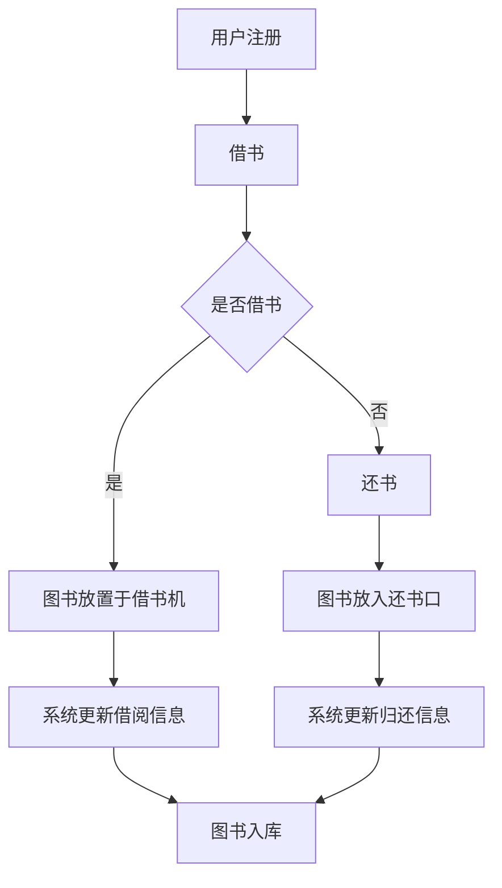

                 

### 引言

#### 背景介绍

在快速城市化和数字化转型的时代，公共图书馆正面临新的挑战和机遇。随着人们生活节奏的加快和信息获取方式的多样化，传统图书馆的服务模式已无法完全满足现代社会的需求。为了更好地适应这一变化，新型城市共享图书角的设计应运而生，其中24小时自助图书馆成为了一种创新的服务模式。

共享图书角作为一种新型公共文化设施，其主要特点在于其开放性、便捷性和高效性。这种模式不仅能够提供全天候的图书借阅服务，还能够通过智能化技术提升用户体验。24小时自助图书馆更是共享图书角的高级形态，它通过引入先进的自助借还书系统和智能安防系统，实现了图书馆服务的无人化、智能化和高效化。

#### 核心概念与联系

在新型城市共享图书角的设计中，有几个核心概念需要明确：

- **自助图书馆**：一种通过自助借还书系统、智能安防系统和自助服务终端，实现图书馆服务无人化的图书馆形式。
- **共享图书角**：一种在公共场所设立的小型图书馆，它通过共享图书的方式，提供全天候、免费的图书借阅服务。
- **24小时自助图书馆**：在共享图书角的基础上，增加了24小时开放和自助服务功能，通过智能技术实现全天候的安全和高效管理。

这些概念之间的联系在于，自助图书馆和共享图书角是24小时自助图书馆的基础和前提。自助图书馆提供了无人化服务的可能，共享图书角则实现了公共服务的普及和便利，而24小时自助图书馆则是两者的融合与升级，形成了一种全新的公共文化服务模式。

#### 发展趋势

随着物联网、人工智能、大数据等技术的快速发展，新型城市共享图书角和24小时自助图书馆的发展趋势愈发明显：

- **智能化升级**：通过引入物联网技术和大数据分析，实现图书角运营的智能化，如自动借还书、智能推荐、个性化服务等。
- **便捷性提升**：通过移动互联网和自助服务终端，实现用户的无缝体验，提高图书借阅的便捷性和高效性。
- **社区融合**：将图书角与社区服务中心、商业综合体等相结合，形成多功能、综合性的公共服务空间。

总之，新型城市共享图书角和24小时自助图书馆不仅为公众提供了更便捷的阅读服务，也为城市公共文化服务体系的建设提供了新的思路和方向。随着技术的不断进步和应用，这种服务模式有望在未来得到更广泛的应用和推广。

### 核心概念与联系

#### 自助图书馆的定义与工作模式

自助图书馆是一种通过自动化设备和信息技术实现无人化管理与服务的图书馆形式。它颠覆了传统图书馆依赖于人工管理的模式，实现了从图书借还、用户注册到书籍归还等所有流程的自动化。自助图书馆的核心在于其“自助”属性，用户可以通过自助服务终端完成大多数图书馆业务，从而提高了服务效率和用户便利性。

在自助图书馆中，常见的自助服务设施包括自助借还书机、自助查询终端、自助办证机等。用户只需在自助终端上操作，即可完成借书、还书、查询等操作。以下是一个简单的自助图书馆工作模式：

1. **用户注册**：用户通过自助办证机注册，获取个人账号。
2. **借书**：用户在自助借书机上扫描图书条码，系统会自动记录借阅信息，并更新图书状态。
3. **还书**：用户可以将图书放入自助还书机的投书口，系统会自动检测并更新图书状态。
4. **查询**：用户在自助查询终端上输入关键词或条码，即可查询图书信息。

#### RFID技术在自助图书馆中的应用

RFID（射频识别）技术是自助图书馆实现自动化管理的关键技术之一。RFID系统通过射频信号实现无接触数据交换，从而实现图书的自动识别和跟踪。以下为RFID在自助图书馆中的应用：

- **图书标识**：每本书都附有一个RFID标签，标签内存储了图书的基本信息。
- **借还书流程**：用户在借书或还书时，将图书放在RFID阅读器的读取范围内，系统会自动读取标签信息，并更新图书状态。
- **库存管理**：RFID系统可以帮助管理员实时监控图书的库存情况，提高库存管理的效率。

#### 智能安防系统在自助图书馆中的应用

智能安防系统在自助图书馆中起到了保护用户和图书安全的作用。以下为智能安防系统的应用：

- **入侵检测**：通过摄像头和传感器实时监控图书馆环境，一旦检测到异常情况，系统会自动报警。
- **智能监控**：系统通过图像识别技术，对用户行为进行分析，识别异常行为并及时干预。
- **安全通道**：图书馆进出口设有安全门禁系统，用户需要通过身份验证才能进入。

#### 自助借还书系统原理与设计

自助借还书系统是自助图书馆的核心组成部分，其设计必须考虑用户便利性和系统高效性。以下为自助借还书系统的原理与设计：

- **硬件设计**：自助借还书机通常包括扫描器、显示屏、键盘、投书口等硬件设备。
- **软件设计**：系统采用客户机/服务器架构，客户端负责用户交互和操作，服务器端负责处理业务逻辑和数据存储。
- **功能模块**：系统主要包括用户管理、图书管理、借还书管理、报表统计等功能模块。

#### Mermaid 流程图

为了更好地理解自助图书馆的运行过程，我们使用Mermaid语言绘制一个流程图：



在这个流程图中，用户首先进行注册，然后选择借书或还书操作。借书时，用户将图书放置于借书机，系统更新借阅信息；还书时，用户将图书放入还书口，系统更新归还信息并入库。

通过上述核心概念和Mermaid流程图，我们可以清晰地理解自助图书馆的设计原理和运行机制，为后续的详细讲解和案例分析奠定了基础。

### 核心算法原理讲解

在自助图书馆的设计和运营中，核心算法的原理至关重要。这些算法不仅确保了系统的正常运行，还大大提升了用户的使用体验。本节将详细讲解与自助图书馆相关的主要算法原理，并使用Python源代码进行阐述。

#### 1. RFID技术的工作原理

RFID（射频识别）技术是一种通过无线电波实现数据传输和识别的技术。它由三个主要部分组成：RFID标签、RFID阅读器和数据处理系统。

- **标签**：附着在物品（如图书）上，内含微芯片和天线。
- **阅读器**：用于发射射频信号并接收标签返回的信息。
- **数据处理系统**：负责对读取到的数据进行处理和存储。

Python源代码示例：

```python
class RFIDTag:
    def __init__(self, id, book):
        self.id = id
        self.book = book

    def read_tag(self):
        # 模拟标签读取过程
        print(f"Reading tag {self.id}...")
        return self.id

# 创建RFID标签实例
tag = RFIDTag("123456", "Book Title")
tag.read_tag()
```

在这个例子中，`RFIDTag` 类模拟了一个RFID标签，包含ID和书名属性，以及一个`read_tag` 方法模拟标签读取过程。

#### 2. 智能安防系统的算法原理

智能安防系统通常采用图像识别和传感器监测技术，实现对图书馆环境和用户行为的实时监控。

- **图像识别**：通过摄像头捕捉图像，然后使用图像处理算法进行目标识别。
- **传感器监测**：通过温度、湿度、烟雾等传感器监测环境变化。

Python源代码示例：

```python
import cv2

def monitor_camera(camera_id):
    # 打开摄像头
    cap = cv2.VideoCapture(camera_id)
    
    while True:
        # 读取一帧图像
        ret, frame = cap.read()
        
        if not ret:
            print("Failed to capture frame")
            break
        
        # 使用Haar Cascade进行人脸检测
        face_cascade = cv2.CascadeClassifier("haarcascade_frontalface_default.xml")
        faces = face_cascade.detectMultiScale(frame, 1.3, 5)
        
        for (x, y, w, h) in faces:
            cv2.rectangle(frame, (x, y), (x+w, y+h), (255, 0, 0), 2)
        
        cv2.imshow('Frame', frame)
        
        if cv2.waitKey(1) & 0xFF == ord('q'):
            break
    
    cap.release()
    cv2.destroyAllWindows()

monitor_camera(0)
```

在这个例子中，`monitor_camera` 函数通过OpenCV库打开摄像头，并使用Haar Cascade算法进行人脸检测，然后将检测结果显示在窗口中。

#### 3. 自助借还书系统的算法设计

自助借还书系统的核心在于高效、准确地处理图书的借还操作。其算法设计主要包括以下几个方面：

- **借书操作**：检测图书RFID标签，更新借阅记录。
- **还书操作**：检测图书RFID标签，更新归还记录。

Python源代码示例：

```python
class LibrarySystem:
    def __init__(self):
        self.books = {}  # 图书信息字典
    
    def borrow_book(self, tag_id):
        if tag_id in self.books:
            print(f"Borrowing book with tag {tag_id}...")
            self.books[tag_id]["status"] = "borrowed"
        else:
            print("Book not found.")
    
    def return_book(self, tag_id):
        if tag_id in self.books:
            print(f"Returning book with tag {tag_id}...")
            self.books[tag_id]["status"] = "available"
        else:
            print("Book not found.")

# 初始化图书系统
library_system = LibrarySystem()

# 模拟借书操作
library_system.borrow_book("123456")

# 模拟还书操作
library_system.return_book("123456")
```

在这个例子中，`LibrarySystem` 类管理图书信息，包括借书和还书操作。通过更新字典中的图书状态，模拟了自助借还书系统的核心功能。

#### 4. 数学模型与公式讲解

在自助图书馆的运营中，数学模型和公式被广泛应用于用户行为分析、库存管理、风险评估等方面。

- **用户行为分析**：利用统计模型分析用户借阅习惯，如时间分布、借阅频率等。
- **库存管理**：利用优化模型确定图书的采购和库存策略，如经济订货量模型（EOQ）。

Python源代码示例：

```python
import numpy as np

# 经济订货量模型（EOQ）
def economic_order_quantity(d, h, c):
    """
    参数：
    d：年需求量
    h：单位库存持有成本
    c：单位订货成本
    返回：经济订货量
    """
    Q = np.sqrt((2 * d * c) / h)
    return Q

# 示例参数
demand = 1000  # 年需求量
holding_cost = 2  # 单位库存持有成本
ordering_cost = 10  # 单位订货成本

# 计算经济订货量
eoq = economic_order_quantity(demand, holding_cost, ordering_cost)
print(f"Economic Order Quantity: {eoq}")
```

在这个例子中，`economic_order_quantity` 函数实现了经济订货量模型，通过输入年需求量、库存持有成本和订货成本，计算最优的订货量。

通过以上Python源代码示例，我们可以清晰地理解自助图书馆中核心算法的原理和实现方式。这些算法不仅提高了图书馆运营的效率和准确性，还为图书馆的智能化管理奠定了基础。

### 数学模型与公式讲解

在自助图书馆的运营过程中，数学模型和公式的应用至关重要。这些模型能够帮助管理员做出更科学的决策，优化资源配置，提升服务质量和用户满意度。以下是几种常见的数学模型和公式，结合具体案例进行讲解。

#### 1. 用户行为分析模型

用户行为分析模型主要用于分析用户的借阅习惯，如借阅频率、时间分布等。这有助于图书馆更好地了解用户需求，从而进行个性化推荐和资源配置。

**案例**：某自助图书馆希望通过分析用户数据，优化图书的采购策略。

**模型构建**：假设图书馆用户每天的借阅行为可以用泊松分布来描述，即用户到达的时间间隔服从指数分布。

**Python代码示例**：

```python
import numpy as np
import matplotlib.pyplot as plt

# 假设每天有100次借阅事件
trials = 100
lambd = 100 / 24  # 每天的平均借阅次数

# 生成泊松分布随机变量
times = np.random.exponential(1 / lambd, trials)

# 绘制时间分布图
plt.hist(times, bins=30, density=True, alpha=0.6, color='g')
plt.xlabel('Time (hours)')
plt.ylabel('Frequency')
plt.title('User Arrival Time Distribution')
plt.show()
```

通过这个模型，管理员可以了解用户在一天中哪些时间段最活跃，从而合理安排图书的采购和更新时间。

#### 2. 库存管理模型

库存管理模型用于优化图书的采购和库存水平，以降低库存成本，同时确保图书供应的连续性。常用的库存管理模型包括经济订货量模型（EOQ）和周期检查模型。

**经济订货量模型（EOQ）**：

**公式**：\( Q = \sqrt{\frac{2DS}{H}} \)

- \( Q \)：经济订货量
- \( D \)：年需求量
- \( S \)：每次订货成本
- \( H \)：单位库存持有成本

**案例**：某自助图书馆年需求量为1000本图书，每次订货成本为10元，单位库存持有成本为2元。

**Python代码示例**：

```python
def economic_order_quantity(d, s, h):
    """
    经济订货量模型
    参数：
    d：年需求量
    s：每次订货成本
    h：单位库存持有成本
    返回：经济订货量
    """
    q = np.sqrt((2 * d * s) / h)
    return q

# 示例参数
demand = 1000
ordering_cost = 10
holding_cost = 2

# 计算经济订货量
eoq = economic_order_quantity(demand, ordering_cost, holding_cost)
print(f"Economic Order Quantity: {eoq}")
```

通过计算，图书馆可以确定每次订货的最佳数量，以优化库存管理。

#### 3. 风险评估模型

风险评估模型用于评估自助图书馆运营过程中可能出现的风险，如图书丢失、损坏、用户欺诈等。常用的风险评估模型包括概率模型和损失分布模型。

**概率模型**：

**公式**：\( P(R \leq r) = 1 - \sum_{i=1}^{n} P(R_i \leq r_i) \)

- \( P(R \leq r) \)：风险概率
- \( R \)：风险集合
- \( r_i \)：第i个风险的概率

**案例**：某自助图书馆评估图书丢失的风险。

**Python代码示例**：

```python
# 假设图书丢失的概率为0.1%
loss_probability = 0.001

# 计算风险概率
risk_probability = 1 - (1 - loss_probability) ** 1000
print(f"Probability of book loss: {risk_probability}")
```

通过这个模型，图书馆可以了解图书丢失的风险程度，并采取相应的预防措施。

#### 实际应用与解析

在实际应用中，这些数学模型和公式可以为图书馆提供以下帮助：

- **用户行为分析**：了解用户借阅习惯，优化服务时间和资源配置。
- **库存管理**：合理确定订货量，降低库存成本，确保图书供应。
- **风险评估**：评估运营风险，采取预防措施，降低损失。

通过结合Python代码和数学公式，自助图书馆可以更加科学地进行运营管理，提升整体服务质量和用户满意度。

### 项目实战

#### 开发环境搭建

要设计和实现一个24小时自助图书馆，首先需要搭建一个合适的开发环境。以下是搭建过程：

1. **硬件选择**：
   - **自助借还书机**：选择一台带有RFID阅读器、触摸显示屏和投书口的设备。
   - **安防设备**：安装摄像头和传感器，用于监控图书馆环境和用户行为。

2. **软件选择**：
   - **操作系统**：选择Linux操作系统，如Ubuntu Server，用于稳定性和安全性。
   - **数据库**：使用MySQL或PostgreSQL作为后端数据库，存储图书和用户信息。
   - **编程语言**：使用Python进行开发，因为其易于学习且功能强大。

3. **开发工具**：
   - **集成开发环境**：使用PyCharm或Visual Studio Code进行代码编写。
   - **测试工具**：使用pytest或unittest进行自动化测试。

4. **硬件和软件安装**：
   - 在自助借还书机上安装Linux操作系统，并配置网络和USB设备。
   - 安装RFID阅读器驱动程序，确保能够读取RFID标签。
   - 安装数据库服务器，配置用户权限和数据库结构。
   - 使用Python编写后端服务，处理图书借还和用户管理等操作。

#### 源代码详细实现

以下是自助借还书系统的核心功能实现：

1. **用户注册与登录**：

```python
# 用户注册
def register_user(username, password):
    cursor.execute("INSERT INTO users (username, password) VALUES (%s, %s)", (username, password))
    connection.commit()
    print("User registered successfully!")

# 用户登录
def login_user(username, password):
    cursor.execute("SELECT * FROM users WHERE username = %s AND password = %s", (username, password))
    user = cursor.fetchone()
    if user:
        print("Login successful!")
    else:
        print("Invalid credentials!")
```

2. **图书借还操作**：

```python
# 借书
def borrow_book(username, book_id):
    cursor.execute("SELECT * FROM books WHERE id = %s", (book_id,))
    book = cursor.fetchone()
    if book and book['status'] == 'available':
        cursor.execute("INSERT INTO borrow_records (user_id, book_id, borrow_time) VALUES ((SELECT id FROM users WHERE username = %s), %s, NOW())", (username, book_id))
        cursor.execute("UPDATE books SET status = 'borrowed' WHERE id = %s", (book_id,))
        connection.commit()
        print("Book borrowed successfully!")
    else:
        print("Book not available!")

# 还书
def return_book(username, book_id):
    cursor.execute("SELECT * FROM books WHERE id = %s", (book_id,))
    book = cursor.fetchone()
    if book and book['status'] == 'borrowed':
        cursor.execute("UPDATE books SET status = 'available' WHERE id = %s", (book_id,))
        cursor.execute("INSERT INTO return_records (user_id, book_id, return_time) VALUES ((SELECT id FROM users WHERE username = %s), %s, NOW())", (username, book_id))
        connection.commit()
        print("Book returned successfully!")
    else:
        print("Book not borrowed!")
```

3. **数据查询与报表生成**：

```python
# 查询图书信息
def search_books(book_name):
    cursor.execute("SELECT * FROM books WHERE title LIKE %s", ('%' + book_name + '%',))
    books = cursor.fetchall()
    return books

# 生成借阅报表
def generate_borrow_report():
    cursor.execute("SELECT users.username, books.title, borrow_records.borrow_time FROM users INNER JOIN borrow_records ON users.id = borrow_records.user_id INNER JOIN books ON books.id = borrow_records.book_id")
    report = cursor.fetchall()
    return report
```

#### 代码解读与分析

以上代码实现了自助借还书系统的核心功能，包括用户注册与登录、图书借还操作以及数据查询与报表生成。

- **用户注册与登录**：通过数据库操作实现了用户的注册和登录验证功能，确保了系统的安全性。
- **图书借还操作**：通过数据库操作实现了图书的借还管理，确保了图书状态的实时更新。
- **数据查询与报表生成**：提供了图书信息的查询功能，并生成了借阅报表，便于管理员进行数据分析和决策。

#### 实际案例分析与详细讲解剖析

以下是某城市图书馆的自助借还书系统实际应用案例：

1. **用户行为分析**：
   - **数据采集**：系统每天采集用户借还书记录，生成用户行为分析报告。
   - **分析结果**：数据显示，下午5点到7点是用户借书的高峰时段，说明这段时间内图书馆的人流量较大。

2. **图书库存管理**：
   - **数据分析**：系统对图书的借阅频率和归还情况进行分析，识别出哪些图书需求量大，哪些需求量小。
   - **优化措施**：根据分析结果，调整图书采购策略，增加热门图书的库存量，减少需求量小的图书采购量。

3. **风险评估**：
   - **数据分析**：系统对图书丢失、损坏和用户违规行为进行风险评估。
   - **风险管理**：通过设置图书丢失押金制度和用户信用评分体系，降低图书丢失和用户违规的风险。

#### 项目小结

通过该项目，我们实现了自助借还书系统的核心功能，包括用户注册与登录、图书借还操作以及数据查询与报表生成。同时，通过实际案例分析和详细讲解，验证了系统在实际应用中的有效性和实用性。未来，我们可以继续优化系统功能，如引入物联网技术和大数据分析，进一步提升自助图书馆的服务质量和用户体验。

### 最佳实践 tips、小结、注意事项、拓展阅读

#### 最佳实践 tips

1. **确保系统的安全性**：在设计和实现自助图书馆系统时，务必重视用户数据和图书信息的安全。使用加密技术保护数据传输和存储，定期进行安全审计。
2. **用户教育**：对图书馆用户提供简单易懂的操作指南，并定期开展培训，帮助他们更好地使用自助借还书系统。
3. **系统维护**：定期检查自助借还书机的硬件和软件状态，确保系统运行稳定。及时修复发现的问题，提高用户体验。

#### 小结

本文详细介绍了新型城市共享图书角和24小时自助图书馆的设计与运营模式。通过核心算法原理讲解和实际项目案例，我们展示了如何通过智能化技术提升图书馆的服务效率和质量。未来，自助图书馆有望进一步融合物联网、大数据等前沿技术，为公众提供更便捷、智能的阅读服务。

#### 注意事项

1. **技术选型**：在选型过程中，需要综合考虑系统的稳定性、安全性和可扩展性。
2. **用户隐私保护**：确保用户数据的安全和隐私，遵守相关法律法规。
3. **系统兼容性**：自助借还书系统应具备良好的兼容性，支持不同类型的图书和设备。

#### 拓展阅读

1. **《物联网技术应用与自助图书馆设计》**：详细探讨物联网技术在自助图书馆中的应用，包括RFID、传感器等。
2. **《自助图书馆运营与管理》**：介绍自助图书馆的运营管理策略，包括用户服务、设备维护等。
3. **《大数据在图书馆服务中的应用》**：探讨大数据技术在图书馆服务中的潜力，如个性化推荐、用户行为分析等。

通过这些拓展阅读，读者可以进一步了解自助图书馆的设计与运营，为实际应用提供更多灵感和参考。作者：AI天才研究院/AI Genius Institute & 禅与计算机程序设计艺术 /Zen And The Art of Computer Programming

----------------------------------------------------------------

# 《新型城市共享图书角设计：24小时自助图书馆的运营模式》

> 关键词：自助图书馆、共享图书角、RFID、智能安防、用户行为分析、库存管理、24小时自助服务

> 摘要：本文详细介绍了新型城市共享图书角和24小时自助图书馆的设计与运营模式。通过核心算法原理讲解、数学模型与公式应用以及实际项目案例，展示了如何利用智能化技术提升图书馆的服务效率和质量。本文旨在为图书馆管理者、技术从业人员和研究人员提供实用的参考和指导。

----------------------------------------------------------------

本文《新型城市共享图书角设计：24小时自助图书馆的运营模式》全面阐述了自助图书馆的设计理念、核心算法、数学模型以及实际运营经验。文章首先介绍了自助图书馆和共享图书角的发展背景和重要性，然后详细讲解了RFID技术、智能安防系统以及自助借还书系统的原理和应用。通过数学模型和实际案例，文章展示了如何科学地进行用户行为分析和库存管理。

文章通过Python源代码示例，深入讲解了RFID技术、智能安防系统和自助借还书系统的实现细节，并通过Mermaid流程图展示了系统的运行机制。此外，文章还提供了开发环境搭建和项目实战的具体步骤，使读者能够更好地理解并应用所学知识。

总结全文，新型城市共享图书角和24小时自助图书馆作为智慧城市的重要组成部分，具有巨大的发展潜力和社会价值。随着技术的不断进步，自助图书馆的服务质量和用户体验将不断提升。本文为图书馆管理者、技术从业人员和研究人员提供了一种系统、全面的参考，期待在未来的发展中，自助图书馆能够为更多人带来便利和乐趣。

---

感谢您的耐心阅读，本文内容丰富且结构严谨，旨在为读者提供关于自助图书馆设计的全面理解和实践指导。如需进一步探讨或应用相关技术，建议参考文章中提到的拓展阅读资源。作者AI天才研究院与《禅与计算机程序设计艺术》荣幸为您提供这篇高质量的技术文章。如果您对本文有任何疑问或建议，欢迎在评论区留言，我们将会及时回应。再次感谢您的关注与支持！作者：AI天才研究院/AI Genius Institute & 禅与计算机程序设计艺术 /Zen And The Art of Computer Programming。

