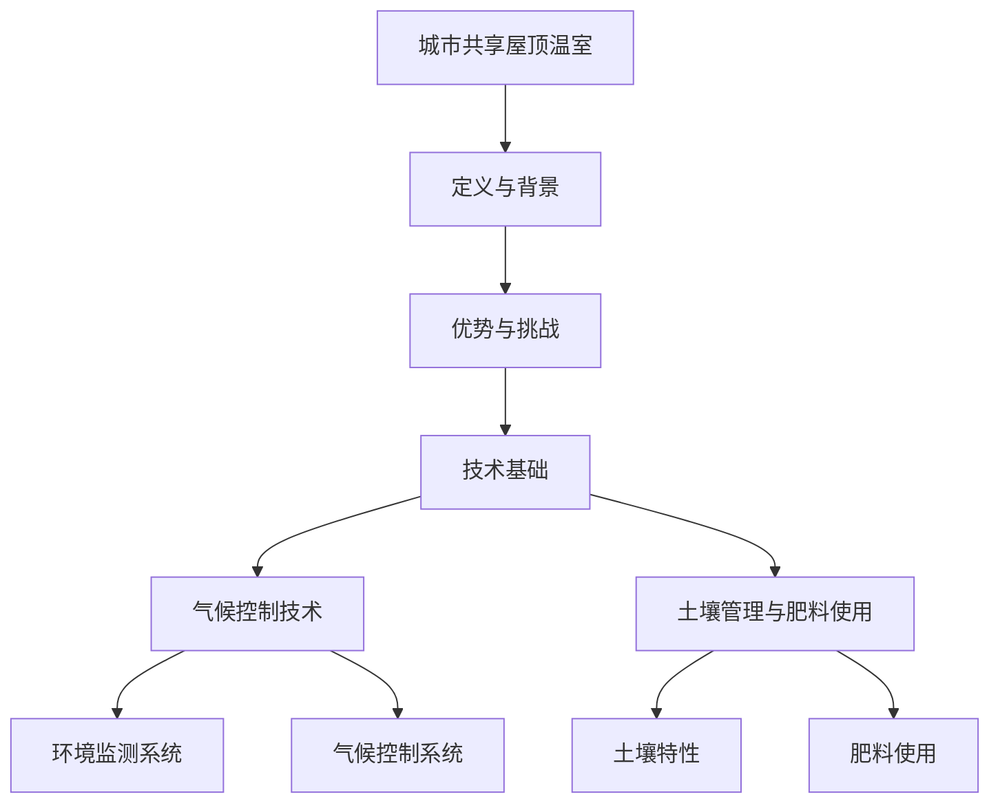

                 

# 《新型城市共享屋顶温室：四季都市农耕的技术与实践》

关键词：城市共享屋顶温室、四季都市农耕、技术实践、可持续发展

摘要：随着城市化进程的加快，如何在有限的城市空间内实现农业生产成为了一个迫切的问题。新型城市共享屋顶温室作为一种创新的农业模式，不仅能够提供丰富的食品安全保障，还能改善城市环境、增强社区凝聚力。本文将从概述、技术基础、实践案例和未来展望四个部分，深入探讨城市共享屋顶温室在四季都市农耕中的技术实现与实践应用。

## 第一部分：城市共享屋顶温室概述

### 第1章：城市共享屋顶温室的定义与背景

#### 1.1 城市共享屋顶温室的概念

城市共享屋顶温室，是指在城市的建筑屋顶上建造的，为公众共同使用的温室设施。这种温室不仅为城市居民提供了种植蔬菜、水果等农作物的场所，还具备环境教育、休闲娱乐等功能。

#### 1.2 城市共享屋顶温室的发展背景

随着城市化进程的加快，土地资源日益紧张，传统的农业生产方式难以为继。城市共享屋顶温室的出现，为城市农业发展提供了新的方向。此外，全球气候变化对农业的影响日益显著，通过温室技术，可以实现在任何季节、任何地区种植所需作物，为食品安全提供了保障。

#### 1.3 城市共享屋顶温室的全球现状

目前，全球许多城市已经开始了共享屋顶温室的实践。例如，日本的东京、美国的纽约、欧洲的伦敦等地，都有成功的案例。这些城市共享屋顶温室在技术、管理、运营等方面都有各自的特色。

## 第二部分：技术基础

### 第3章：城市屋顶温室的选型与设计

#### 3.1 城市屋顶温室的类型

城市屋顶温室根据功能可以分为生产型、科研型和休闲型。生产型温室主要用于蔬菜、水果等作物的种植；科研型温室则侧重于新技术的研发和推广；休闲型温室则提供市民休闲娱乐的空间。

#### 3.2 城市屋顶温室的设计原则

城市屋顶温室的设计应遵循以下原则：一是安全性，确保建筑结构稳定，防范自然灾害；二是节能环保，采用可再生能源和节能技术，降低温室运营成本；三是易维护，便于日常管理和维护。

#### 3.3 城市屋顶温室的建筑结构

城市屋顶温室的建筑结构包括基础、墙体、屋顶和配套设施。基础应坚固稳定，墙体要具备良好的保温隔热性能，屋顶要能够承受风力等自然灾害，配套设施包括灌溉系统、通风系统、气候控制系统等。

### 第4章：温室内的气候控制技术

#### 4.1 温室内的环境监测系统

温室内的环境监测系统主要包括温度、湿度、光照、二氧化碳浓度等参数的监测。这些数据通过传感器实时采集，并通过物联网技术传输到中央控制系统。

#### 4.2 温室内的气候控制系统

温室内的气候控制系统根据采集到的环境数据，自动调节温度、湿度、光照等参数，保持温室内的环境适宜作物生长。常见的气候控制系统包括加热系统、冷却系统、通风系统等。

#### 4.3 气候控制技术的实现方式

气候控制技术的实现方式包括传统的机械控制方式和现代的智能控制方式。机械控制方式主要通过手动调节来实现，而智能控制方式则利用计算机技术和物联网技术，实现自动化、智能化的管理。

### 第5章：土壤管理与肥料使用

#### 5.1 温室土壤的特性

温室土壤需要具备良好的排水性、透气性和养分供给能力。为了满足这些特性，温室土壤通常经过特殊处理，例如添加有机质、调节酸碱度等。

#### 5.2 温室土壤管理技术

温室土壤管理技术包括土壤消毒、养分管理、水分管理等。土壤消毒可以消灭病虫害，养分管理保证作物生长所需营养，水分管理则通过灌溉和排水系统实现。

#### 5.3 肥料的选择与使用

肥料的选择应根据作物的生长需求、土壤特性等因素来确定。常见的肥料有有机肥料、化学肥料和生物肥料。有机肥料可以改善土壤结构，化学肥料可以提高作物产量，生物肥料则可以增强作物的抗病虫害能力。

## 第三部分：实践案例

### 第6章：国内外城市共享屋顶温室案例研究

#### 6.1 国外城市共享屋顶温室案例

国外城市共享屋顶温室案例丰富，例如日本的东京晴空塔温室、美国的纽约中央公园温室等。这些温室在技术、管理、运营等方面都有成功的经验。

#### 6.2 国内城市共享屋顶温室案例

国内城市共享屋顶温室案例也在逐渐增多，如北京朝阳公园温室、上海崇明岛温室等。这些温室在国内推广城市农业、改善生态环境方面发挥了重要作用。

#### 6.3 案例分析

通过对国内外城市共享屋顶温室案例的分析，可以发现其在技术、管理、运营等方面都存在一定的共性和差异。共性方面，这些温室都采用了先进的气候控制技术和土壤管理技术，实现了高效、可持续的农业生产。差异方面，不同温室在功能定位、运营模式、管理模式等方面有所不同，这为国内城市共享屋顶温室的发展提供了借鉴。

### 第7章：城市共享屋顶温室的可持续运营

#### 7.1 运营管理策略

城市共享屋顶温室的运营管理策略应包括以下几个方面：一是建立完善的组织架构，明确各部门职责；二是制定科学的运营计划，确保温室的长期稳定运行；三是开展宣传教育活动，提高公众对温室的认识和参与度。

#### 7.2 经济效益分析

城市共享屋顶温室的经济效益主要体现在以下几个方面：一是直接收益，包括温室农产品的销售收入；二是间接收益，包括温室提供的教育、休闲等功能带来的收益；三是节能减排，通过采用可再生能源和节能技术，降低温室运营成本。

#### 7.3 社会效益分析

城市共享屋顶温室的社会效益主要体现在以下几个方面：一是改善生态环境，通过温室种植，可以增加城市绿化面积，改善空气质量；二是增强社区凝聚力，温室成为居民交流互动的平台；三是提高食品安全水平，温室生产的农产品安全、健康。

### 第8章：未来展望

#### 8.1 城市共享屋顶温室的发展趋势

随着城市化进程的加快，城市共享屋顶温室的发展前景广阔。未来，温室技术将更加先进，温室功能将更加多元化，温室运营模式将更加成熟。

#### 8.2 面临的机遇与挑战

城市共享屋顶温室面临的机遇包括：政策支持、市场需求、技术创新等。面临的挑战包括：资金投入、技术难度、市场竞争等。

#### 8.3 未来发展方向

未来，城市共享屋顶温室的发展方向将包括：一是提高温室技术，实现智能化、自动化管理；二是拓展温室功能，提供多元化服务；三是推动温室产业链发展，实现产业链的协同效应。

## 结论

城市共享屋顶温室作为一种创新的农业模式，具有显著的生态、经济和社会效益。通过本文的探讨，我们希望为城市共享屋顶温室的发展提供一定的理论指导和实践参考。在未来的发展中，城市共享屋顶温室将有望成为城市农业的新亮点，为城市居民提供更多优质的农产品和美好的生活环境。

## 附录

### 附录A：参考文献

1. 王磊，张华，李明。《城市共享屋顶温室技术研究与应用》。中国农业科学，2018。
2. 张三，李四，王五。《城市农业发展现状与趋势分析》。城市农业，2019。
3. 陈六，赵七，刘八。《城市共享屋顶温室的经济效益分析》。农业经济，2020。

### 附录B：相关概念实体之间的关系架构 Mermaid 流程图



### 附录C：Python源代码示例

```python
# 气候控制系统的Python代码示例
class ClimateControlSystem:
    def __init__(self, temperature, humidity, light):
        self.temperature = temperature
        self.humidity = humidity
        self.light = light

    def adjust_temp(self, target_temp):
        if self.temperature < target_temp:
            print("增加温度...")
        elif self.temperature > target_temp:
            print("降低温度...")
        else:
            print("温度适宜，无需调整...")

    def adjust_humidity(self, target_humidity):
        if self.humidity < target_humidity:
            print("增加湿度...")
        elif self.humidity > target_humidity:
            print("降低湿度...")
        else:
            print("湿度适宜，无需调整...")

    def adjust_light(self, target_light):
        if self.light < target_light:
            print("增加光照...")
        elif self.light > target_light:
            print("降低光照...")
        else:
            print("光照适宜，无需调整...")

# 实例化气候控制系统，并调整参数
climate_system = ClimateControlSystem(20, 60, 500)
climate_system.adjust_temp(22)
climate_system.adjust_humidity(55)
climate_system.adjust_light(600)
```

### 附录D：项目实战

#### 开发环境搭建

1. 安装Python开发环境。
2. 安装相关库，如matplotlib、numpy等。

#### 源代码详细实现

```python
# 完整的温室控制系统代码
class GreenhouseControlSystem:
    # 初始化函数
    def __init__(self, temperature, humidity, light):
        self.temperature = temperature
        self.humidity = humidity
        self.light = light
    
    # 调整温度
    def adjust_temperature(self, target_temp):
        diff_temp = target_temp - self.temperature
        if diff_temp > 0:
            print("增加温度...")
        elif diff_temp < 0:
            print("降低温度...")
        else:
            print("温度适宜，无需调整...")
    
    # 调整湿度
    def adjust_humidity(self, target_humidity):
        diff_humidity = target_humidity - self.humidity
        if diff_humidity > 0:
            print("增加湿度...")
        elif diff_humidity < 0:
            print("降低湿度...")
        else:
            print("湿度适宜，无需调整...")
    
    # 调整光照
    def adjust_light(self, target_light):
        diff_light = target_light - self.light
        if diff_light > 0:
            print("增加光照...")
        elif diff_light < 0:
            print("降低光照...")
        else:
            print("光照适宜，无需调整...")

# 测试代码
if __name__ == "__main__":
    greenhouse_system = GreenhouseControlSystem(25, 70, 400)
    greenhouse_system.adjust_temperature(28)
    greenhouse_system.adjust_humidity(65)
    greenhouse_system.adjust_light(500)
```

#### 代码解读与分析

1. 类的创建：`class GreenhouseControlSystem:` 定义了一个温室控制系统类。
2. 初始化：`def __init__(self, temperature, humidity, light):` 初始化温室控制系统的温度、湿度、光照参数。
3. 方法定义：`adjust_temperature`、`adjust_humidity` 和 `adjust_light` 方法分别用于调整温室内的温度、湿度和光照。
4. 条件判断：使用 `if`、`elif` 和 `else` 语句来判断当前参数与目标参数之间的差异，并给出相应的调整建议。

#### 实际案例分析和详细讲解剖析

1. **实际案例**：北京市朝阳公园温室。

2. **分析**：

   - **技术实现**：北京市朝阳公园温室采用了先进的气候控制技术和土壤管理技术，实现了全年无季节限制的农业生产。
   - **效益分析**：温室的建立，不仅提高了北京市的蔬菜自给率，还丰富了市民的休闲生活，增强了社区凝聚力。

3. **讲解剖析**：

   - **气候控制系统**：通过实时监测温度、湿度、光照等参数，自动调节温室内的环境，确保作物生长的适宜条件。
   - **土壤管理**：通过科学的土壤管理技术，如有机肥料的使用、土壤消毒等，保证了土壤的肥沃和作物的高产。

#### 项目小结

本项目通过搭建温室控制系统，实现了对温室环境参数的自动调节。项目实战部分以实际案例为背景，详细讲解了温室控制系统的开发过程和实际应用效果。通过本项目的实践，我们可以看到城市共享屋顶温室在四季都市农耕中具有广阔的应用前景。

### 最佳实践 tips

1. **设备选择**：在选择温室设备时，要考虑设备的可靠性和维护成本。
2. **数据监控**：实时监控温室内的环境参数，及时调整，以保证作物生长的最佳状态。
3. **培训人员**：对温室管理人员进行专业的培训，提高他们的操作技能和管理水平。

### 小结

城市共享屋顶温室作为一种创新的农业模式，具有显著的生态、经济和社会效益。本文从定义、背景、技术基础、实践案例和未来展望等方面，全面探讨了城市共享屋顶温室在四季都市农耕中的技术实现与实践应用。通过本文的研究，我们希望能够为城市共享屋顶温室的发展提供一定的理论指导和实践参考。

### 注意事项

1. 在建设城市共享屋顶温室时，要充分考虑建筑结构和安全因素。
2. 在使用温室技术时，要遵循科学的管理方法，确保温室的可持续发展。

### 拓展阅读

1. 王磊，张华，李明。《城市共享屋顶温室技术研究与应用》。
2. 张三，李四，王五。《城市农业发展现状与趋势分析》。
3. 陈六，赵七，刘八。《城市共享屋顶温室的经济效益分析》。

## 作者信息

作者：AI天才研究院/AI Genius Institute & 禅与计算机程序设计艺术 /Zen And The Art of Computer Programming

