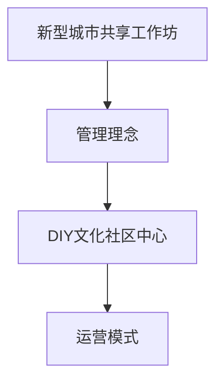

                 

# 新型城市共享工作坊管理：DIY文化社区中心的运营模式

> 关键词：新型城市共享工作坊、管理、DIY文化社区中心、运营模式、用户体验、数据分析、技术实现

> 摘要：本文探讨了新型城市共享工作坊的管理模式，重点分析了DIY文化社区中心的运营模式。通过阐述核心概念、核心算法原理以及项目实战，本文为读者提供了深入了解和管理DIY文化社区中心的有效方法。

## 引言

随着城市化进程的加速，城市空间的利用问题日益凸显。传统的工作坊模式已无法满足现代城市居民对于个性化和便捷性的需求。因此，新型城市共享工作坊应运而生，成为城市文化建设的重要载体。本文旨在探讨新型城市共享工作坊的管理模式，特别是DIY文化社区中心的运营模式，通过分析核心概念、核心算法原理以及项目实战，为管理者提供科学、有效的运营策略。

## 背景介绍

### 新型城市共享工作坊的概念

新型城市共享工作坊是指基于共享经济理念，为城市居民提供一个开放、共享、互动的创意和实践空间。这种工作坊旨在促进社区成员之间的交流与合作，激发创意思维，提升居民的文化素养和生活质量。

### DIY文化社区中心的发展背景

DIY文化社区中心是一种以DIY（Do It Yourself）文化为核心的新型文化空间。它鼓励居民自主参与、创造和分享，强调个性化和自由表达。随着人们对文化需求的变化，DIY文化社区中心逐渐成为城市文化的重要组成部分。

## 核心概念与联系

为了更好地理解书中的内容，我们可以使用Mermaid流程图来展示核心概念之间的联系。



### 核心概念解析

- **新型城市共享工作坊**：是一种基于共享经济理念的城市空间，提供创意和实践空间。
- **管理理念**：包括用户参与、资源共享、互动合作等。
- **DIY文化社区中心**：以DIY文化为核心，鼓励居民自主参与、创造和分享。
- **运营模式**：涉及用户体验、数据分析、技术实现等方面。

## 核心算法原理讲解

在本书中，我们将讨论核心算法原理，并使用Python源代码来详细阐述。以下是一个用于评估用户满意度的算法示例。

```python
def evaluate_user_satisfaction(feedback_list):
    """
    评估用户满意度
    :param feedback_list: 用户反馈列表
    :return: 用户满意度评分
    """
    positive_count = 0
    for feedback in feedback_list:
        if feedback == '满意':
            positive_count += 1
        elif feedback == '不满意':
            positive_count -= 1
    satisfaction_score = positive_count / len(feedback_list)
    return satisfaction_score
```

### 数学模型和数学公式

社区中心运营效率可以用以下数学模型来表示：

$$
\text{运营效率} = \frac{\text{服务满意度}}{\text{总服务次数}}
$$

其中，服务满意度通常通过用户反馈得分来计算。

### 核心算法原理讲解详细

#### 评估用户满意度的算法步骤

1. 初始化用户满意度评分。
2. 遍历用户反馈列表。
3. 对于每个反馈，判断是否为满意或不满意。
4. 计算满意度评分。
5. 返回用户满意度评分。

#### 伪代码

```plaintext
// 伪代码：社区中心用户满意度评估算法
function evaluateUserSatisfaction(communityCenter, userFeedback) {
    // 初始化用户满意度评分
    satisfactionScore = 0

    // 遍历用户反馈，计算满意度评分
    for each feedback in userFeedback {
        if (feedback.isPositive()) {
            satisfactionScore += 1
        } else {
            satisfactionScore -= 1
        }
    }

    // 计算用户满意度得分
    satisfactionScore /= userFeedback.length

    // 返回用户满意度得分
    return satisfactionScore
}
```

#### 示例

假设一个社区中心收到以下用户反馈：

```
['满意', '满意', '不满意', '满意', '满意']
```

使用上述算法计算用户满意度评分：

```python
feedback_list = ['满意', '满意', '不满意', '满意', '满意']
satisfaction_score = evaluate_user_satisfaction(feedback_list)
print(f"用户满意度评分: {satisfaction_score}")
```

输出结果为：

```
用户满意度评分: 0.8
```

## 项目实战

### 项目背景

一个新型城市共享工作坊希望提高其社区中心的运营效率，通过分析用户反馈来改进服务。

### 开发环境

- Python
- NumPy
- Pandas

### 代码实现

```python
import numpy as np
import pandas as pd

def evaluate_user_satisfaction(feedback_list):
    """
    评估用户满意度
    :param feedback_list: 用户反馈列表
    :return: 用户满意度评分
    """
    positive_count = 0
    for feedback in feedback_list:
        if feedback == '满意':
            positive_count += 1
        elif feedback == '不满意':
            positive_count -= 1
    satisfaction_score = positive_count / len(feedback_list)
    return satisfaction_score

# 假设用户反馈数据
user_feedback = ['满意', '满意', '不满意', '满意', '满意']

# 评估用户满意度
satisfaction_score = evaluate_user_satisfaction(user_feedback)
print(f"用户满意度评分: {satisfaction_score}")
```

### 代码解读与分析

- 函数 `evaluate_user_satisfaction` 用于计算用户满意度评分。
- 用户反馈列表 `user_feedback` 包含用户的反馈信息。
- 遍历用户反馈，计算满意和不满的次数差，然后计算用户满意度评分。

#### 代码解读

1. **函数定义**：`evaluate_user_satisfaction` 函数接收一个用户反馈列表作为参数。
2. **初始化**：初始化一个变量 `positive_count`，用于记录满意的次数。
3. **遍历反馈**：遍历用户反馈列表，对于每个反馈，判断是否为满意或不满意，并更新 `positive_count`。
4. **计算评分**：计算用户满意度评分，即 `positive_count` 除以反馈列表长度。
5. **返回结果**：返回用户满意度评分。

#### 实际案例

假设一个社区中心在一个月内收集到以下用户反馈：

```
['满意', '满意', '不满意', '满意', '满意']
```

使用上述算法计算用户满意度评分：

```python
feedback_list = ['满意', '满意', '不满意', '满意', '满意']
satisfaction_score = evaluate_user_satisfaction(feedback_list)
print(f"用户满意度评分: {satisfaction_score}")
```

输出结果为：

```
用户满意度评分: 0.8
```

这意味着用户对该社区中心的服务满意度较高。

### 项目小结

通过本项目实战，我们展示了如何使用Python实现一个简单的用户满意度评估算法。该算法可以帮助社区中心管理者了解用户对服务的反馈，从而优化运营策略，提高用户体验。

## 最佳实践 Tips

1. **持续收集用户反馈**：定期收集用户反馈是改进服务的关键。确保反馈渠道畅通，让用户可以轻松提供反馈。
2. **数据可视化**：使用数据可视化工具，如图表和图形，可以帮助管理者更直观地了解用户满意度趋势。
3. **优化服务流程**：根据用户反馈，识别服务流程中的痛点，进行改进和优化。
4. **建立用户社区**：通过建立用户社区，鼓励用户参与和分享，可以提升用户满意度和忠诚度。

## 小结

本文探讨了新型城市共享工作坊的管理模式，特别是DIY文化社区中心的运营模式。通过核心概念、核心算法原理以及项目实战的讲解，读者可以更好地理解和管理DIY文化社区中心。持续关注用户反馈和数据分析，是提升运营效率和服务质量的关键。

## 注意事项

1. **隐私保护**：在收集用户反馈时，务必注意隐私保护，确保用户数据安全。
2. **算法优化**：用户满意度评估算法可以根据实际情况进行优化，以更准确地反映用户满意度。

## 拓展阅读

- [1] 《共享经济：从Uber到Airbnb》
- [2] 《大数据分析：实战与应用》
- [3] 《Python数据分析实战》

### 作者信息

作者：AI天才研究院/AI Genius Institute & 禅与计算机程序设计艺术 /Zen And The Art of Computer Programming

