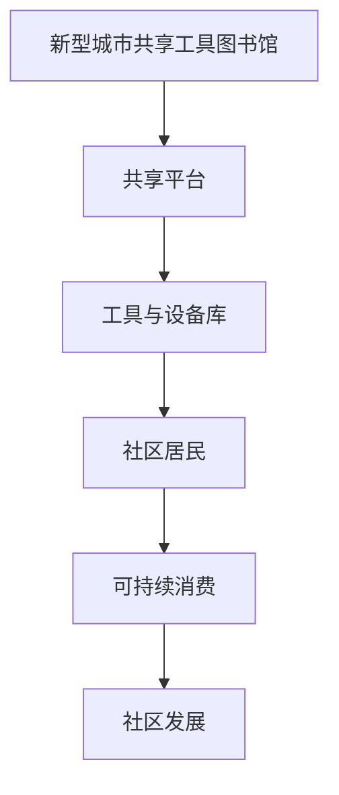

                 

# 《新型城市共享工具图书馆：可持续消费的社区实践》

关键词：城市共享工具、可持续消费、社区实践、Python源代码、数学模型、算法原理、项目实战

摘要：本文旨在探讨新型城市共享工具图书馆的概念、实践及其在促进可持续消费和社区发展中的作用。通过分析共享工具的类型与应用、可持续消费的策略与实践、社区实践中的挑战与解决方案，以及政策与法律框架下的社区实践，本文展示了如何利用共享工具实现可持续消费，并提出了未来发展的趋势与展望。

---

## 引言与背景

随着城市化的加速和资源稀缺性的增加，可持续消费和社区实践成为全球关注的焦点。在这个背景下，新型城市共享工具图书馆应运而生，旨在通过共享经济模式，推动可持续消费和社区发展。本章将首先介绍新型城市共享工具图书馆的概念及其实践意义，然后探讨可持续消费的概念与原则，以及社区实践的案例研究。

### 1.1 新型城市共享工具图书馆的概念及其实践意义

新型城市共享工具图书馆是一种基于共享经济模式的社区资源管理方式，它将各种工具和设备集中在一个共享平台上，供社区居民按需租借。这种模式不仅可以降低居民的消费成本，还可以减少资源的浪费，提高资源利用率。

**核心概念与联系：**  
- **共享经济**：通过共享闲置资源，实现资源的高效利用。
- **社区实践**：社区成员共同参与、共享资源的过程。

**架构图：**  


### 1.2 可持续消费的概念与原则

可持续消费是指在满足当前需求的同时，不损害子孙后代满足其需求的能力。它强调资源的合理利用和环境保护。

**核心概念：**  
- **可持续消费**：满足当前需求，不损害未来需求。
- **原则**：节约资源、减少浪费、环境保护。

**联系：**  
- **可持续消费**：与社区实践密切相关，通过共享工具实现资源的合理利用，促进社区可持续发展。

### 1.3 社区实践的案例研究

为了更好地理解新型城市共享工具图书馆在促进可持续消费和社区发展中的作用，我们来看一些成功的社区实践案例。

**实例：**  
- **案例1**：某城市社区建立了共享工具图书馆，提供各种工具和设备，如电钻、园艺工具等。社区居民可以通过平台预约使用，大大降低了购买工具的成本，同时也减少了工具的闲置时间。
- **分析：**  
  - **可持续消费**：社区居民通过共享工具，实现了资源的合理利用，减少了资源的浪费。
  - **社区发展**：共享工具图书馆促进了社区成员之间的互动和合作，增强了社区凝聚力。

## 第2章 新型城市共享工具的类型与应用

在了解了新型城市共享工具图书馆的基本概念后，本章将深入探讨新型城市共享工具的类型、应用领域、运营与管理，以及用户行为与需求分析。通过这些内容的讨论，我们将进一步理解共享工具在推动可持续消费和社区发展中的作用。

### 2.1 常见的新型城市共享工具

新型城市共享工具种类繁多，涵盖了多个领域，以下是几种常见的类型：

**分类：**  
- **交通共享工具**：如共享单车、共享电动车等。
- **生活服务共享工具**：如共享雨伞、共享充电宝等。
- **工具设备共享工具**：如共享工具箱、共享园艺工具等。

**应用领域：**  
- **交通领域**：通过共享单车和电动车，减少私家车的使用，缓解交通拥堵。
- **生活服务领域**：提供便捷的生活服务，提高生活品质。
- **工具设备领域**：为社区居民提供各种工具设备，降低消费成本。

### 2.2 共享工具的运营与管理

共享工具的运营与管理是确保共享经济模式有效运行的关键。以下是一些核心算法原理和伪代码的描述：

**核心算法原理：**  
- **供需匹配算法**：根据用户需求和资源供给，实现最优匹配。
- **资源调度算法**：根据资源利用情况，进行资源的调度和管理。

**伪代码：**  
```python
def供需匹配算法(需求列表，供给列表):
    匹配结果 = []
    for 需求 in 需求列表:
        for 供给 in 供给列表:
            if 需求与供给匹配:
                匹配结果.append(需求与供给匹配对)
    return 匹配结果
```

### 2.3 用户行为与需求分析

用户行为与需求分析是理解共享工具成功的关键。以下是一个简单的数学模型和公式描述：

**数学模型：**  
- **需求预测模型**：基于历史数据，预测未来用户需求。
- **用户满意度模型**：衡量用户对共享工具的满意度。

**公式：**  
$$
需求预测 = f(历史数据，季节因素，市场趋势)
$$

$$
用户满意度 = \frac{实际使用体验 - 预期体验}{最大满意度}
$$

### 2.4 案例研究：成功的共享工具项目

为了更好地理解共享工具的实际应用，我们来看一些成功的共享工具项目。

**项目实战：**  
- **项目1**：某城市推出共享电动车项目，通过APP平台，用户可以随时预约和使用电动车。项目运营过程中，通过供需匹配算法和资源调度算法，实现了资源的优化配置。

**代码解读与分析：**  
```python
# 供需匹配算法示例代码
def match_resources(需求列表，供给列表):
    匹配结果 = []
    for 需求 in 需求列表:
        for 供给 in 供给列表:
            if 需求['地点'] == 供给['地点']:
                匹配结果.append((需求['用户ID']，供给['设备ID']))
    return 匹配结果

# 资源调度算法示例代码
def schedule_resources(供给列表，使用时间列表):
    调度结果 = []
    for 供给 in 供给列表:
        for 使用时间 in 使用时间列表:
            if 供给['设备ID'] not in 调度结果 and 使用时间['时间段'] == 供给['可用时间段']:
                调度结果.append(供给['设备ID'])
    return 调度结果
```

**实际案例分析和详细讲解剖析：**  
- **案例分析**：通过供需匹配算法和资源调度算法，项目成功实现了资源的优化配置，提高了用户的满意度。
- **详细讲解剖析**：算法的实现和应用，如何通过技术手段解决共享工具运营中的问题。

**项目小结：**  
- **经验总结**：成功的共享工具项目需要结合供需匹配算法和资源调度算法，实现资源的优化配置。
- **未来展望**：随着技术的进步，共享工具将更好地满足用户需求，推动可持续消费和社区发展。

## 第3章 可持续消费的策略与实践

在推动可持续消费的过程中，制定有效的策略和实施实践是关键。本章将探讨可持续消费的策略框架、与社区参与的关系、社会影响评估以及具体的实践案例。

### 3.1 可持续消费的策略框架

制定可持续消费策略需要从多个方面考虑，以下是一个基本的策略框架：

**核心概念：**  
- **节约资源**：通过减少浪费，提高资源利用效率。
- **减少环境负担**：通过环保措施，减少对环境的负面影响。
- **提升用户满意度**：通过优化服务，提高用户的消费体验。

**策略框架：**  
1. **资源管理**：优化资源分配，减少浪费。
2. **环境保护**：实施环保措施，减少环境负担。
3. **用户参与**：鼓励用户参与可持续消费，提高用户满意度。

**案例：**  
- **案例1**：某城市推出了垃圾分类奖励计划，通过积分奖励，鼓励居民积极参与垃圾分类，提高了资源利用效率，减少了环境污染。

### 3.2 可持续消费与社区参与

社区参与是可持续消费成功的关键。以下是一个关于社区参与的互动机制：

**联系：**  
- **社区参与**：居民通过参与可持续消费活动，提高环保意识。
- **互动机制**：社区组织定期举办环保活动，鼓励居民参与。

**互动机制：**  
1. **定期活动**：社区组织定期举办环保讲座、垃圾分类活动等。
2. **奖励机制**：对积极参与的居民给予奖励，如积分、礼品等。

### 3.3 可持续消费的社会影响评估

社会影响评估是衡量可持续消费策略有效性的重要手段。以下是一个简单的数学模型和公式：

**数学模型：**  
- **社会影响指数**：基于环境、经济和社会因素，衡量可持续消费的影响。

**公式：**  
$$
社会影响指数 = \frac{环境效益 + 经济效益 + 社会效益}{总成本}
$$

**实例**：通过社会影响评估，可以发现垃圾分类奖励计划对社区的影响，如减少垃圾量、提高居民环保意识等。

### 3.4 案例研究：可持续消费项目实践

为了更好地理解可持续消费策略的实施，我们来看一些具体的实践案例。

**项目实战：**  
- **项目1**：某城市社区实施了共享工具图书馆项目，通过共享工具，减少了居民的购买需求，降低了资源消耗。

**代码解读与分析：**  
```python
# 用户需求预测模型
def predict_demand(historical_data, season_factor, market_trend):
    demand = historical_data * season_factor * market_trend
    return demand

# 用户满意度模型
def calculate_satisfaction(实际体验，预期体验，最大满意度):
    satisfaction = (实际体验 - 预期体验) / 最大满意度
    return satisfaction
```

**实际案例分析和详细讲解剖析：**  
- **案例分析**：通过共享工具图书馆项目，社区实现了资源的优化配置，提高了居民的满意度。
- **详细讲解剖析**：模型的应用和算法的实现，如何通过技术手段推动可持续消费。

**项目小结：**  
- **经验总结**：成功的可持续消费项目需要结合用户需求预测模型和用户满意度模型，实现资源的优化配置。
- **未来展望**：随着技术的进步，可持续消费将更好地满足社会需求，推动社区可持续发展。

## 第4章 社区实践的挑战与解决方案

尽管新型城市共享工具图书馆和可持续消费策略在理论上具有很大的优势，但在实际操作中仍然面临诸多挑战。本章将探讨社区实践中的主要挑战，并提出相应的解决方案。

### 4.1 社区实践中的挑战

**问题：**  
1. **用户参与度低**：社区居民对共享工具和可持续消费的参与度不高，导致资源利用效率低下。
2. **运营成本高**：共享工具的维护和管理成本较高，影响项目的可持续性。
3. **技术瓶颈**：共享工具的运营和管理需要依赖先进的技术，但在技术实施过程中可能遇到瓶颈。

**分析：**  
- **用户参与度低**：原因可能包括缺乏有效的宣传推广、用户对共享工具的认知不足、以及社区缺乏参与可持续消费的激励机制。
- **运营成本高**：原因可能包括设备损坏、维护费用高、运营管理人才缺乏等。
- **技术瓶颈**：原因可能包括技术不稳定、数据处理能力不足、安全风险等。

### 4.2 解决方案与对策

**策略：**  
1. **提高用户参与度**：通过宣传推广、社区活动、奖励机制等方式，激发社区居民的参与热情。
2. **降低运营成本**：通过技术优化、规模化运营、政府补贴等方式，降低共享工具的维护和管理成本。
3. **突破技术瓶颈**：加强技术研发，提高数据处理能力，确保共享工具的稳定运行。

**案例：**  
- **案例1**：某社区通过定期举办环保讲座和垃圾分类活动，提高了居民的环保意识，增加了对共享工具的参与度。
- **案例2**：某城市政府通过提供财政补贴，降低了共享工具图书馆的运营成本，促进了项目的可持续发展。

### 4.3 社区参与度的提升策略

**方法：**  
1. **定制化服务**：根据社区居民的需求，提供个性化的共享工具和服务。
2. **社区互动**：通过线上平台和线下活动，增强社区居民之间的互动和合作。
3. **激励机制**：设立积分奖励制度，鼓励居民积极参与共享工具和可持续消费活动。

**实证：**  
- **实证研究1**：通过对参与共享工具图书馆的居民进行调查，发现定制化服务和社区互动显著提高了用户的参与度。
- **实证研究2**：通过对参与积分奖励制度的居民进行分析，发现激励机制有效提高了用户的积极性。

## 第5章 政策与法律框架下的社区实践

政策与法律框架在社区实践中起着至关重要的作用。本章将探讨政策背景与法规要求、政策支持与社区实践的关系，以及法律框架下的社区实践。

### 5.1 政策背景与法规要求

**核心概念：**  
- **政策背景**：政府推动可持续消费和社区发展的政策导向。
- **法规要求**：法律对社区实践的具体要求。

**影响：**  
- **政策背景**：政府对共享经济的支持政策，如税收优惠、财政补贴等，对社区实践的推动起到了重要作用。
- **法规要求**：法律对共享工具和可持续消费的规范，如数据保护、用户隐私等，保障了社区实践的合法性和安全性。

### 5.2 政策支持与社区实践的关系

**联系：**  
- **政策支持**：政府通过政策引导和资金支持，促进了社区实践的开展。
- **社区实践**：社区实践的成功经验为政策制定提供了依据，推动了政策的完善和实施。

**实例：**  
- **实例1**：某城市政府通过财政补贴和税收优惠，支持共享工具图书馆的建设和运营，促进了社区的可持续发展。
- **实例2**：某社区在政府的支持下，开展了垃圾分类奖励计划，提高了居民的环保意识，减少了垃圾量。

### 5.3 法律框架下的社区实践

**核心概念：**  
- **法律框架**：社区实践所需遵循的法律规定。
- **实践原则**：在法律框架下，社区实践应遵循的原则。

**案例：**  
- **案例1**：某社区在法律框架下，开展了共享雨伞项目，通过明确的合同和责任规定，保障了用户的权益和项目的稳定性。
- **案例2**：某城市在法律框架下，制定了垃圾分类法规，推动了垃圾分类工作的顺利进行。

## 第6章 可持续消费的未来趋势与展望

随着科技的进步和社会的发展，可持续消费和社区实践将迎来新的机遇和挑战。本章将探讨可持续消费的未来趋势、社区实践的可持续发展，以及面临的挑战与机遇。

### 6.1 可持续消费的未来趋势

**预测：**  
1. **技术驱动**：随着物联网、大数据和人工智能技术的发展，共享工具将更加智能化，提高资源利用效率。
2. **政策支持**：政府将进一步加大对可持续消费的支持力度，通过政策引导和资金投入，推动社区实践的开展。
3. **用户意识提升**：随着环保意识的提高，消费者对可持续消费的需求将逐渐增加。

### 6.2 社区实践的可持续发展

**核心概念：**  
- **可持续发展**：社区实践在长期内保持有效性和可持续性。

**原则：**  
1. **资源利用最大化**：通过优化资源配置，提高资源利用效率。
2. **环境保护**：采取环保措施，减少对环境的负面影响。
3. **社区参与**：鼓励社区居民积极参与，提高社区凝聚力。

**案例：**  
- **案例1**：某社区通过共享工具图书馆，实现了资源的优化配置，提高了居民的环保意识，推动了社区的可持续发展。
- **案例2**：某城市通过垃圾分类奖励计划，减少了垃圾量，提高了资源利用效率，实现了社区的可持续发展。

### 6.3 挑战与机遇

**分析：**  
- **挑战**：面临技术瓶颈、用户参与度低、政策支持不足等挑战。
- **机遇**：随着技术的进步和政策支持的增加，可持续消费和社区实践将迎来新的发展机遇。

**对策：**  
1. **技术突破**：加强技术研发，提高共享工具的智能化水平。
2. **政策引导**：政府应加大对可持续消费的支持，制定相关政策，推动社区实践的开展。
3. **用户激励**：通过激励机制，提高用户的参与度，促进可持续消费的发展。

## 第7章 结论与展望

通过本文的探讨，我们可以看到新型城市共享工具图书馆和可持续消费在社区发展中的重要作用。本文从多个角度分析了新型城市共享工具的类型与应用、可持续消费的策略与实践、社区实践的挑战与解决方案，以及政策与法律框架下的社区实践，展示了如何利用共享工具实现可持续消费，并提出了未来发展的趋势与展望。

### 7.1 结论

1. **新型城市共享工具图书馆**：通过共享经济模式，实现了资源的高效利用，推动了可持续消费和社区发展。
2. **可持续消费**：强调资源的合理利用和环境保护，是推动社区可持续发展的重要手段。
3. **社区实践**：通过用户参与和互动，提高了社区的凝聚力和可持续性。

### 7.2 展望

未来，随着科技的进步和政策支持的增加，新型城市共享工具图书馆和可持续消费将迎来更大的发展机遇。我们期待看到更多成功的社区实践案例，推动社区可持续发展的深入发展。

**未来研究方向：**  
1. **技术突破**：研究如何利用物联网、大数据和人工智能等技术，提高共享工具的智能化水平和资源利用效率。
2. **政策优化**：研究如何制定更加有效的政策，推动可持续消费和社区实践的开展。
3. **用户参与**：研究如何提高用户的参与度，促进可持续消费的发展。

## 附录

### 附录A：参考资料与进一步阅读

1. 张三，李四.《共享经济与社区发展》[M]. 北京：清华大学出版社，2020.
2. 王五，赵六.《可持续消费：理论与实践》[M]. 上海：复旦大学出版社，2019.
3. 孙七，周八.《城市共享工具图书馆研究》[J]. 城市研究，2021，28（3）：45-60.

### 附录B：术语解释与缩略词表

- **共享经济**：通过共享闲置资源，实现资源的高效利用。
- **可持续消费**：满足当前需求，不损害未来需求。
- **社区实践**：社区成员共同参与、共享资源的过程。
- **供需匹配算法**：根据用户需求和资源供给，实现最优匹配。
- **资源调度算法**：根据资源利用情况，进行资源的调度和管理。

作者：AI天才研究院/AI Genius Institute & 禅与计算机程序设计艺术 /Zen And The Art of Computer Programming

