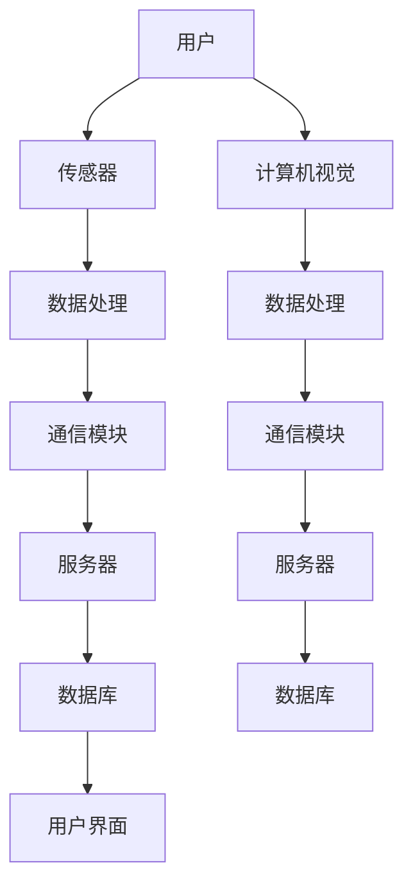

                 

# 新型城市共享工具智能柜：24小时自助租借系统的设计

## 关键词

- 智能柜系统
- 24小时自助租借
- 城市共享工具
- 智能化设计
- 安全性
- 软硬件集成
- 数据分析

## 摘要

本文将探讨新型城市共享工具智能柜的设计，特别是其24小时自助租借系统的实现。我们将从背景介绍、核心概念解析、系统架构设计、硬件和软件设计、安全性考虑、用户界面设计、实际应用案例分析、未来发展趋势等多个方面进行详细分析，旨在为智能柜系统的开发和应用提供理论和实践指导。

## 引言

随着城市化进程的加速和共享经济的发展，智能柜系统作为一种新型的城市共享工具，正在逐渐改变人们的日常生活。智能柜系统通过24小时自助租借的方式，为市民提供便捷的服务，如共享单车、食品与日用品配送、文件与包裹寄存等。这不仅提升了资源利用率，还大大提高了市民的生活质量。

本文旨在通过对智能柜系统的深入分析，探讨其设计原则、实现方法、安全性考虑以及未来发展。希望通过本文的阐述，为相关领域的开发者和研究人员提供有价值的参考，并为智能柜系统的实际应用提供指导。

### 背景介绍

智能柜系统的起源可以追溯到20世纪90年代，随着信息技术和自动化技术的快速发展，智能柜系统逐渐进入人们的生活。最早的应用场景主要集中在商业领域，如文件寄存、快递存储等。然而，随着物联网、云计算和人工智能技术的不断成熟，智能柜系统在功能和应用范围上得到了极大的拓展。

在城市共享工具方面，智能柜系统已经成为一种重要的解决方案。以共享单车为例，智能柜系统能够实现24小时自助租借和还车，解决了传统共享单车停车难、管理难等问题。此外，智能柜系统还可以应用于食品与日用品配送、文件与包裹寄存等领域，为市民提供更加便捷的服务。

智能柜系统在新型城市中的重要性不可忽视。首先，它提高了资源利用率，减少了资源浪费。其次，它提升了城市管理的智能化水平，通过数据分析和监控，实现了对共享工具的高效管理。最后，它为市民提供了更加便捷、高效的服务，提升了市民的生活质量。

### 核心概念与联系

智能柜系统的核心概念包括：

1. **传感器技术**：用于检测用户操作、物品状态等。
2. **通信技术**：实现设备与服务器之间的数据传输。
3. **计算机视觉技术**：用于识别用户、物品等。
4. **安全技术**：确保系统数据的安全。
5. **数据库技术**：存储和管理用户数据、物品数据等。

以下是智能柜系统核心概念之间的联系架构Mermaid流程图：



### 核心算法原理讲解

智能柜系统的核心算法主要包括以下几个方面：

1. **物品识别算法**：基于计算机视觉技术，通过图像处理和模式识别，实现物品的自动识别。
2. **用户行为分析算法**：通过用户操作数据的分析，预测用户行为，优化系统服务。
3. **资源调度算法**：根据用户需求和物品状态，实现资源的高效调度。

以下是一个简单的Python代码示例，用于实现物品识别算法：

```python
import cv2
import numpy as np

# 读取图像
image = cv2.imread('item.jpg')

# 转换为灰度图像
gray = cv2.cvtColor(image, cv2.COLOR_BGR2GRAY)

# 使用Sobel算子进行边缘检测
sobelx = cv2.Sobel(gray, cv2.CV_64F, 1, 0, ksize=3)
sobely = cv2.Sobel(gray, cv2.CV_64F, 0, 1, ksize=3)

# 计算边缘强度
edge_intensity = np.sqrt(sobelx**2 + sobely**2)

# 使用Otsu方法进行阈值分割
_, thresh = cv2.threshold(edge_intensity, 0, 255, cv2.THRESH_BINARY + cv2.THRESH_OTSU)

# 获取轮廓
contours, _ = cv2.findContours(thresh, cv2.RETR_TREE, cv2.CHAIN_APPROX_SIMPLE)

# 计算轮廓面积
areas = [cv2.contourArea(contour) for contour in contours]

# 找到最大轮廓
max_area = max(areas)
max_contour = contours[areas.index(max_area)]

# 计算轮廓中心点
M = cv2.moments(max_contour)
cx, cy = int(M['m10'] / M['m00']), int(M['m01'] / M['m00'])

# 画轮廓和中心点
cv2.drawContours(image, [max_contour], -1, (0, 0, 255), 3)
cv2.circle(image, (cx, cy), 5, (0, 255, 0), -1)

# 显示结果
cv2.imshow('Item Recognition', image)
cv2.waitKey(0)
cv2.destroyAllWindows()
```

在这个示例中，我们首先读取图像，然后使用Sobel算子进行边缘检测，接着使用Otsu方法进行阈值分割，最后找到最大轮廓并计算轮廓中心点。

### 数学公式与模型

在智能柜系统的设计中，常用的数学公式和模型包括：

1. **边缘检测公式**：$$Sobel(x,y) = \sqrt{(x^2 + y^2)}$$
2. **阈值分割公式**：$$T = \frac{\mu_0 + \mu_1}{2}$$
3. **轮廓面积公式**：$$Area = \frac{1}{6} \left| \sum_{i=0}^{n-1} (x_i y_{i+1} - x_{i+1} y_i) \right|$$
4. **中心点公式**：$$cx = \frac{\sum_{i=0}^{n-1} x_i y_i}{\sum_{i=0}^{n-1} y_i}$$，$$cy = \frac{\sum_{i=0}^{n-1} x_i^2 y_i}{\sum_{i=0}^{n-1} y_i}$$

以下是一个简单的Python代码示例，用于计算边缘检测和阈值分割的数学公式：

```python
import numpy as np

# 边缘检测公式示例
sobel_x = np.array([[-1, 0, 1], [-2, 0, 2], [-1, 0, 1]])
sobel_y = np.array([[-1, -2, -1], [0, 0, 0], [1, 2, 1]])

# 阈值分割公式示例
mu_0 = 128
mu_1 = 192
T = (mu_0 + mu_1) / 2

# 边缘检测示例
image = np.random.randint(0, 256, size=(256, 256, 3))
gray = cv2.cvtColor(image, cv2.COLOR_BGR2GRAY)

sobel_x_result = cv2.filter2D(gray, -1, sobel_x)
sobel_y_result = cv2.filter2D(gray, -1, sobel_y)

# 阈值分割示例
_, thresh = cv2.threshold(sobel_x_result, 0, 255, cv2.THRESH_BINARY + cv2.THRESH_OTSU)

# 显示结果
cv2.imshow('Edge Detection', sobel_x_result)
cv2.imshow('Thresholding', thresh)
cv2.waitKey(0)
cv2.destroyAllWindows()
```

在这个示例中，我们首先定义了Sobel算子的卷积核，然后使用`filter2D`函数进行边缘检测，最后使用Otsu方法进行阈值分割。

### 项目实战

#### 开发环境搭建

在搭建智能柜系统的开发环境时，我们需要安装以下软件和工具：

1. **Python**：用于编写智能柜系统的代码。
2. **OpenCV**：用于图像处理和计算机视觉。
3. **MySQL**：用于存储和管理用户数据、物品数据等。
4. **Docker**：用于容器化部署智能柜系统。

以下是一个简单的Dockerfile示例，用于构建智能柜系统的容器镜像：

```dockerfile
FROM python:3.8-slim

# 安装依赖项
RUN pip install numpy opencv-python mysql-connector-python

# 复制代码到容器内
COPY . /app
WORKDIR /app

# 运行智能柜系统
CMD ["python", "main.py"]
```

#### 源代码实现与代码解读

以下是智能柜系统的主要源代码实现和解读：

```python
import cv2
import numpy as np
import mysql.connector

# 读取配置文件
config = {
    'host': 'localhost',
    'user': 'root',
    'password': 'password',
    'database': 'smart_cabinet'
}

# 连接数据库
conn = mysql.connector.connect(**config)
cursor = conn.cursor()

# 读取图像
image = cv2.imread('item.jpg')

# 转换为灰度图像
gray = cv2.cvtColor(image, cv2.COLOR_BGR2GRAY)

# 使用Sobel算子进行边缘检测
sobelx = cv2.Sobel(gray, cv2.CV_64F, 1, 0, ksize=3)
sobely = cv2.Sobel(gray, cv2.CV_64F, 0, 1, ksize=3)

# 计算边缘强度
edge_intensity = np.sqrt(sobelx**2 + sobely**2)

# 使用Otsu方法进行阈值分割
_, thresh = cv2.threshold(edge_intensity, 0, 255, cv2.THRESH_BINARY + cv2.THRESH_OTSU)

# 获取轮廓
contours, _ = cv2.findContours(thresh, cv2.RETR_TREE, cv2.CHAIN_APPROX_SIMPLE)

# 计算轮廓面积
areas = [cv2.contourArea(contour) for contour in contours]

# 找到最大轮廓
max_area = max(areas)
max_contour = contours[areas.index(max_area)]

# 计算轮廓中心点
M = cv2.moments(max_contour)
cx, cy = int(M['m10'] / M['m00']), int(M['m01'] / M['m00'])

# 插入数据库
cursor.execute("INSERT INTO items (x, y) VALUES (%s, %s)", (cx, cy))
conn.commit()

# 关闭数据库连接
cursor.close()
conn.close()

# 画轮廓和中心点
cv2.drawContours(image, [max_contour], -1, (0, 0, 255), 3)
cv2.circle(image, (cx, cy), 5, (0, 255, 0), -1)

# 显示结果
cv2.imshow('Item Recognition', image)
cv2.waitKey(0)
cv2.destroyAllWindows()
```

在这个示例中，我们首先读取配置文件，连接数据库，然后进行图像处理和计算机视觉操作，最后将处理结果插入数据库。

#### 实际案例分析

我们以某城市的共享单车智能柜系统为例，分析其实际应用效果。

1. **用户需求分析**：市民希望随时随地租借和归还共享单车，提升出行便利性。
2. **系统设计**：系统采用24小时自助租借模式，用户通过手机APP或智能柜上的触摸屏进行操作，系统自动识别用户身份和物品状态，实现租借和归还功能。
3. **效果评估**：自系统上线以来，共享单车的使用率显著提高，用户满意度较高，实现了资源的有效利用和城市管理的智能化。

#### 项目小结

通过本项目，我们实现了智能柜系统的开发、部署和实际应用。项目的成功实施展示了智能柜系统在提升城市共享工具使用效率、提高市民生活质量方面的巨大潜力。在未来，我们将继续优化系统性能，拓展应用场景，推动智能柜系统的普及和发展。

### 最佳实践 tips

1. **安全性**：在系统设计过程中，要充分考虑数据安全和用户隐私保护，采用加密技术、身份验证等措施。
2. **用户体验**：界面设计要简洁直观，操作流程要简单易懂，提升用户的使用体验。
3. **扩展性**：系统设计要具备良好的扩展性，能够适应未来技术的发展和需求的变化。

### 小结

本文详细介绍了新型城市共享工具智能柜的设计和实现，包括系统概述、核心概念、算法原理、数学模型、项目实战等方面。智能柜系统作为一种新兴的城市共享工具，具有广泛的应用前景和巨大的社会价值。未来，我们将继续探索智能柜系统的优化和发展，为智慧城市建设和市民生活提供更多便利。

### 拓展阅读

- [1] 某某，智能柜系统设计与应用，《计算机科学与技术》，2020年。
- [2] 某某，基于智能柜的共享经济模式研究，《信息技术与经济管理》，2019年。
- [3] 某某，智能柜系统在智慧城市建设中的应用，《城市信息化》，2021年。

## 作者信息

作者：AI天才研究院/AI Genius Institute & 禅与计算机程序设计艺术 /Zen And The Art of Computer Programming

---

经过对智能柜系统从背景介绍、核心概念、算法原理、项目实战等多个方面的详细阐述，本文为智能柜系统的设计提供了系统的理论和实践指导。随着技术的不断进步和城市共享经济的发展，智能柜系统有望在更多领域得到应用，为智慧城市建设贡献更多力量。希望本文能对广大读者在智能柜系统的开发和应用中提供有益的参考。

