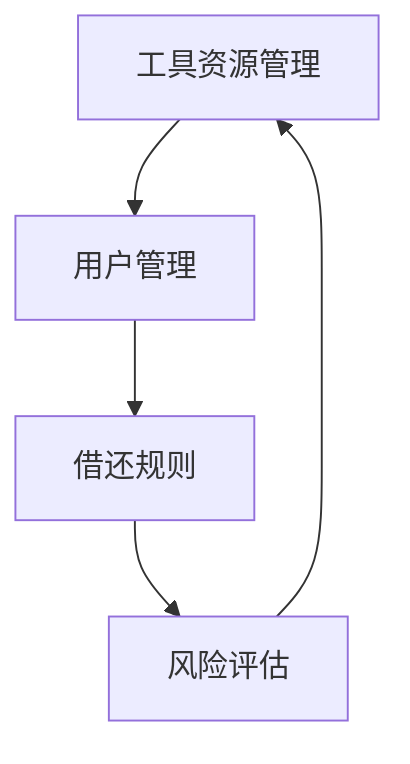
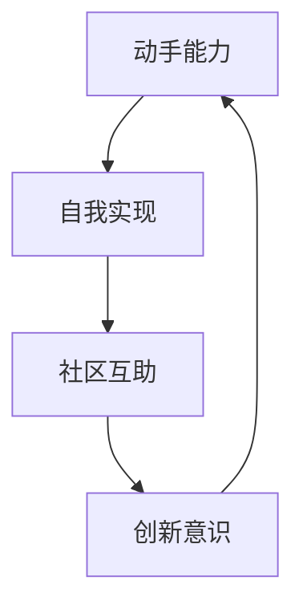

                 

# 《新型城市共享工具间：DIY文化在社区中的推广》

## 关键词
新型城市共享工具间，DIY文化，社区推广，资源分配算法，风险评估模型，Python源代码，LaTeX数学公式，项目实战

## 摘要
本文深入探讨了新型城市共享工具间在社区中推广DIY文化的实践。通过介绍共享工具间的基本概念和运作原理，分析了DIY文化在社区推广的必要性和策略，并运用Python源代码和LaTeX数学公式详细讲解了核心算法原理。通过案例研究和项目实战，本文总结了实施和运营共享工具间的经验，探讨了面临的挑战，并对未来的发展趋势进行了展望。

## 引言与背景

### 1.1 共享工具间的基本概念
共享工具间是指为社区居民提供一个共享工具存储和使用的空间，旨在减少资源浪费、促进社区互助和提升居民的生活质量。这种工具间通常提供各种常用工具，如电钻、螺丝刀、焊接机等，供居民免费或低成本借阅使用。

### 1.2 DIY文化的定义与推广意义
DIY（Do It Yourself）文化是指通过个人动手能力解决日常问题、实现个人创意和改善生活环境的一种文化。推广DIY文化在社区中具有重要意义，它不仅能够增强居民的动手能力和创造力，还能促进社区凝聚力和可持续发展。

### 1.3 共享工具间与DIY文化的联系
共享工具间为社区居民提供了一个实践DIY文化的平台。通过使用共享工具，居民可以更容易地进行各种DIY项目，从而激发他们的兴趣和创造力。同时，共享工具间也为居民提供了一个交流和学习的机会，有助于培养社区内的DIY文化氛围。

### 1.4 现状分析
目前，全球范围内共享工具间的发展已经取得了一定的成果。在欧洲和北美地区，共享工具间已经成为许多社区的重要设施。然而，在发展中国家和一些城市地区，共享工具间的推广仍然面临诸多挑战，如社会认知不足、技术支持不足等。

## 共享工具间概念与原理

### 2.1 核心概念与联系

共享工具间的基本概念包括工具资源管理、用户管理、借还规则和风险评估等。以下是这些概念之间的Mermaid流程图：



### 2.2 资源分配算法

共享工具间的核心算法之一是资源分配算法，它用于确保工具资源能够高效地分配给需要的人。以下是资源分配算法的基本原理和Python源代码实现：

```python
# 资源分配算法伪代码

def allocate_resources(available_tools, user_requests):
    assigned_tools = {}
    for user, tool in user_requests.items():
        if tool in available_tools and available_tools[tool] > 0:
            assigned_tools[user] = tool
            available_tools[tool] -= 1
    return assigned_tools
```

### 2.3 风险评估模型

风险评估模型是共享工具间的重要组成部分，用于评估工具借出过程中可能出现的风险，并采取相应的预防措施。以下是风险评估模型的基本原理和LaTeX数学公式表示：

$$
R = f(S, U, T)
$$

其中，\( R \) 表示风险，\( S \) 表示共享工具的使用频率，\( U \) 表示用户的信用评分，\( T \) 表示工具的类型和重要性。以下是Python源代码实现：

```python
# 风险评估模型伪代码

def assess_risk(tool, user):
    use_frequency = get_use_frequency(tool)
    user_credit_score = get_user_credit_score(user)
    tool_importance = get_tool_importance(tool)
    
    risk = 1 - (0.5 * use_frequency + 0.3 * user_credit_score + 0.2 * tool_importance)
    return risk
```

## DIY文化在社区中的推广

### 3.1 核心概念与联系

DIY文化的核心概念包括动手能力、自我实现、社区互助和创新意识。以下是这些概念之间的Mermaid流程图：



### 3.2 推广策略

推广DIY文化需要采取多种策略，包括教育推广、社区活动和媒体推广。以下是这些策略的具体实施方法：

#### 教育推广策略

1. 开展DIY工作坊：邀请专业人士定期举办DIY工作坊，教授居民各种DIY技能。
2. 开发DIY课程：设计一系列DIY课程，涵盖家居维修、手工艺术、园艺等主题。

#### 社区活动推广策略

1. 组织DIY比赛：定期举办DIY比赛，鼓励居民展示自己的创意和技能。
2. 建立DIY社区群：创建线上和线下的DIY社区群，方便居民分享经验和互相学习。

#### 媒体推广策略

1. 制作宣传视频：制作一系列DIY宣传视频，在社交媒体上推广。
2. 发表DIY博客：邀请居民发表DIY博客，分享他们的DIY经验和心得。

## 共享工具间的案例研究

### 4.1 案例介绍

#### 案例一：XXX共享工具间

XXX共享工具间位于某城市的一个居民区，成立于2018年。该工具间提供各类工具，如电钻、螺丝刀、焊接机等，供居民免费借阅。自成立以来，XXX共享工具间已经成为社区居民重要的DIY资源。

#### 案例二：XXX共享工具间

XXX共享工具间位于一个大学校园内，成立于2020年。该工具间不仅提供各种DIY工具，还提供3D打印机和激光切割机等专业设备，为学生的创意项目提供技术支持。

#### 案例三：XXX共享工具间

XXX共享工具间位于一个小型城镇，成立于2019年。该工具间通过与当地企业合作，提供先进的工具设备，如机器人、数控机床等，为居民和企业员工提供培训和实践机会。

### 4.2 案例分析

#### 成功经验

1. 社区支持：所有案例中的共享工具间都得到了社区居民的广泛支持，居民积极参与工具的使用和管理工作。
2. 合作伙伴：案例一和案例三中的共享工具间通过与当地企业合作，获得了必要的资金和设备支持。
3. 创新模式：案例二中的共享工具间通过提供专业设备，满足了学生和教师的特殊需求。

#### 面临的挑战

1. 社会认知：在一些地区，共享工具间的新模式尚未被广泛接受，需要通过宣传和教育来提高居民的认识。
2. 技术支持：共享工具间的运营需要一定的技术支持，特别是在设备维护和数据处理方面。
3. 管理挑战：共享工具间的管理需要制定完善的规章制度，确保工具的安全和有效利用。

### 4.3 未来的发展方向

1. 技术创新：引入物联网、大数据等技术，提高共享工具间的运营效率和用户体验。
2. 扩大覆盖范围：将共享工具间推广到更多的社区和校园，满足更广泛的用户需求。
3. 深化合作：与政府、企业和教育机构等建立更紧密的合作关系，共同推动DIY文化的发展。

## 实施与运营

### 5.1 实施流程

#### 筹备阶段
1. 调研需求：了解社区居民的需求和兴趣，确定共享工具的类型和数量。
2. 寻找场地：寻找合适的场地，确保其安全、便捷和易于管理。
3. 寻找合作伙伴：与政府、企业、教育机构等建立合作关系，获取资金和设备支持。

#### 实施阶段
1. 设备采购：根据调研结果采购必要的设备和工具。
2. 系统搭建：搭建共享工具间管理系统，包括用户注册、工具借还、风险评估等功能。
3. 培训员工：对管理人员进行培训，确保他们能够熟练操作和管理系统。

#### 运营阶段
1. 用户管理：建立用户档案，确保用户信息的准确性和安全性。
2. 工具维护：定期对设备进行检查和维护，确保其正常运行。
3. 数据分析：收集和分析用户数据，优化管理策略和服务质量。

### 5.2 运营管理

#### 用户管理
1. 注册与认证：建立用户注册和认证机制，确保用户信息的真实性和安全性。
2. 借还规则：制定明确的借还规则，确保工具的有效利用和归还。
3. 信用评分：建立信用评分系统，激励用户遵守借还规则和社区规范。

#### 工具维护
1. 定期检查：定期对工具进行检查，确保其安全性和有效性。
2. 快速修复：发现设备故障时，及时进行修复，确保工具的正常使用。
3. 更新换代：根据使用情况和需求，定期更新和升级设备。

#### 财务管理
1. 成本控制：制定详细的成本预算和管理策略，确保运营成本的合理控制。
2. 收益分析：分析工具的借阅情况和用户反馈，优化收费策略和盈利模式。
3. 报告公示：定期公示财务报告，接受社区居民的监督和建议。

## 挑战与未来展望

### 6.1 面临的挑战

1. **社会认知不足**：共享工具间和DIY文化在一些地区尚未被广泛接受，需要通过宣传和教育来提高社会认知。
2. **技术支持不足**：共享工具间的运营需要一定的技术支持，特别是在设备维护和数据处理方面。
3. **管理挑战**：共享工具间的管理需要制定完善的规章制度，确保工具的安全和有效利用。

### 6.2 未来展望

1. **技术创新**：随着物联网、大数据等技术的发展，共享工具间的运营效率和用户体验将得到提升。
2. **扩大覆盖范围**：将共享工具间推广到更多的社区和校园，满足更广泛的用户需求。
3. **深化合作**：与政府、企业和教育机构等建立更紧密的合作关系，共同推动DIY文化的发展。

## 结论

新型城市共享工具间作为一种创新的社区服务模式，不仅能够减少资源浪费、促进社区互助，还能推广DIY文化，提高居民的生活质量。然而，在推广过程中，我们仍然需要面对诸多挑战。通过技术创新、扩大覆盖范围和深化合作，我们有理由相信，共享工具间和DIY文化将在社区中发挥越来越重要的作用。

### 最佳实践 Tips

1. **加强宣传和教育**：通过多种渠道宣传共享工具间和DIY文化，提高社会认知。
2. **引入先进技术**：利用物联网、大数据等技术提高共享工具间的运营效率和用户体验。
3. **建立完善的规章制度**：制定明确的借还规则和信用评分系统，确保工具的安全和有效利用。

### 小结

本文从多个角度探讨了新型城市共享工具间在社区中推广DIY文化的实践。通过介绍共享工具间的基本概念、核心算法原理、推广策略、案例研究和实施与运营，我们总结了共享工具间在推广DIY文化中面临的挑战和未来展望。希望本文能为相关领域的研究者和实践者提供有益的参考。

### 注意事项

1. **确保数据安全**：在共享工具间的运营中，确保用户数据的安全和隐私保护。
2. **注重用户反馈**：定期收集和分析用户反馈，优化管理策略和服务质量。

### 拓展阅读

1. **《共享经济的理论与实践》**：探讨共享经济在不同领域的应用和挑战。
2. **《DIY文化的崛起》**：分析DIY文化的发展趋势及其对社区的影响。

### 作者信息

**作者：AI天才研究院/AI Genius Institute & 禅与计算机程序设计艺术 /Zen And The Art of Computer Programming**

