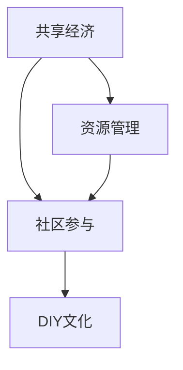

                 

# 新型城市共享工具间：社区DIY文化的推广

关键词：城市共享、工具间、DIY文化、社区建设、案例分析

摘要：本文旨在探讨新型城市共享工具间在推动社区DIY文化发展方面的作用。通过介绍城市共享工具间的概念、核心概念与联系，以及实际应用案例，本文将详细分析新型城市共享工具间如何促进社区DIY文化的推广，并探讨其中可能面临的挑战与未来发展趋势。

## 引言

### 1.1 城市共享工具间的定义与意义

城市共享工具间是一种基于共享经济的理念，旨在为社区居民提供共同使用的工具和设备的新型社区服务设施。通过共享工具间，社区居民可以更便捷地获得所需的工具，降低购买成本，同时促进社区内部的互助合作和资源共享。

#### 1.1.1 城市共享工具间的定义

城市共享工具间是指一种为社区居民提供共同使用工具和设备的公共空间。这些工具和设备可以是传统的木工工具、电动工具，也可以是3D打印机、激光切割机等先进设备。共享工具间通常配备有操作手册和安全指导，确保居民在正确使用工具的同时，也能保证自身和他人的安全。

#### 1.1.2 城市共享工具间的意义

城市共享工具间对于推动社区DIY文化具有重要意义。首先，它为居民提供了学习新技能的机会，激发了居民的创新意识和动手能力。其次，通过共享工具间，居民可以互相交流经验，促进社区内部的互助合作。最后，城市共享工具间有助于减少资源浪费，推动可持续发展。

### 1.2 本文目的与结构

本文旨在深入探讨新型城市共享工具间在推动社区DIY文化发展方面的作用。具体目标如下：

1. **介绍城市共享工具间的概念和核心概念**：阐述城市共享工具间的定义、意义和核心概念。
2. **分析城市共享工具间的实际应用案例**：通过具体案例，展示城市共享工具间如何促进社区DIY文化的推广。
3. **探讨城市共享工具间面临的挑战与未来发展趋势**：分析城市共享工具间在推广过程中可能遇到的挑战，并探讨其未来的发展趋势。

本文结构如下：

1. **引言**：介绍城市共享工具间的概念、意义和本文目的。
2. **核心概念与联系**：阐述城市共享工具间的核心概念和联系，并使用Mermaid流程图进行展示。
3. **实际应用与案例分析**：分析城市共享工具间的实际应用案例，展示其在推动社区DIY文化中的效果。
4. **社区参与与推广策略**：探讨如何有效参与和推广城市共享工具间。
5. **法律与监管因素**：分析城市共享工具间在法律和监管方面的考虑。
6. **未来趋势与挑战**：展望城市共享工具间的未来发展趋势和面临的挑战。
7. **结论**：总结本文的主要观点，并提出一些建议。

## 核心概念与联系

### 2.1 城市共享工具间的核心概念

城市共享工具间的核心概念主要包括：

1. **共享经济**：共享经济是一种基于互联网和信息技术的新型经济模式，通过共享闲置资源，提高资源利用效率，降低使用成本。
2. **社区参与**：社区参与是指社区居民主动参与社区建设、管理和决策的过程。社区参与有助于增强社区凝聚力，提高社区生活质量。
3. **DIY文化**：DIY文化是一种强调自主创造和动手实践的文化，鼓励人们通过自己的努力实现生活目标。
4. **资源管理**：资源管理是指对社区内部资源进行合理配置和有效利用，以实现社区可持续发展。

### 2.2 核心概念之间的关系

城市共享工具间的核心概念之间存在着紧密的联系。具体而言：

1. **共享经济** 与 **DIY文化**：共享经济为DIY文化提供了资源基础，通过共享工具间，居民可以方便地获取所需的工具和设备，从而开展DIY活动。
2. **社区参与** 与 **DIY文化**：社区参与是DIY文化的重要组成部分，通过社区参与，居民可以共同管理和维护共享工具间，提高DIY活动的效果和可持续性。
3. **资源管理** 与 **城市共享工具间**：资源管理是城市共享工具间的基础，通过对工具和设备进行合理配置和有效利用，提高资源利用效率，实现可持续发展。

### 2.3 使用Mermaid流程图展示核心概念之间的关系

为了更好地展示城市共享工具间核心概念之间的关系，我们可以使用Mermaid流程图进行可视化展示。以下是一个简单的Mermaid流程图示例：

这个流程图展示了共享经济、社区参与、DIY文化和资源管理之间的相互关系，突出了城市共享工具间在推动社区DIY文化发展中的核心作用。

## 实际应用与案例分析

### 3.1 成功案例一：城市共享工具间的实践与成效

#### 3.1.1 案例背景

某城市的一个住宅小区于2018年建立了一个共享工具间，旨在为居民提供便捷的工具共享服务。共享工具间配备了各种类型的工具，包括木工工具、电动工具、测量工具等，居民可以通过简单的登记程序免费使用这些工具。

#### 3.1.2 实践过程

1. **项目筹备**：项目筹备阶段，社区委员会组织了多次居民座谈会，听取居民对于共享工具间的需求和期望。通过讨论，居民们提出了多种工具和设备的清单，并确定了共享工具间的选址和基本布局。

2. **设备采购**：在设备采购阶段，社区委员会与多家供应商进行谈判，以获得最具性价比的设备和工具。同时，社区委员会还考虑了工具的安全性和实用性，确保居民在使用过程中能够放心。

3. **运营与管理**：共享工具间建立后，社区委员会制定了详细的运营和管理规则，包括工具的使用流程、维护计划和责任分配。居民们可以通过社区网站或手机应用进行工具预约和归还。

#### 3.1.3 成效评估

共享工具间建立以来，取得了显著的效果：

1. **居民满意度**：通过定期问卷调查，共享工具间的居民满意度达到90%以上。大多数居民表示，共享工具间为他们提供了极大的便利，节省了购买工具的费用，同时也激发了他们的DIY热情。

2. **社区凝聚力**：共享工具间成为居民交流互动的平台。许多居民在共享工具间开展DIY项目时结识了新朋友，加强了社区内部的联系和凝聚力。

3. **资源利用效率**：共享工具间有效提高了工具和设备的利用率。据统计，共享工具间的设备平均利用率达到75%，远高于传统设备的利用率。

### 3.2 成功案例二：城市共享工具间的创新模式

#### 3.2.1 案例背景

某二线城市的社区于2020年推出了一项创新的共享工具间模式，即“社区众筹共享工具间”。社区委员会通过众筹方式，号召居民共同出资购买高价值的工具和设备，建立共享工具间。

#### 3.2.2 实践过程

1. **众筹宣传**：社区委员会通过社区网站、社交媒体和线下宣传等方式，向居民介绍众筹共享工具间的理念，并明确了众筹的目标、流程和回报。

2. **众筹过程**：在众筹过程中，居民可以根据自己的需求和兴趣，选择参与不同的工具和设备的购买。众筹达到目标后，社区委员会与供应商签订采购合同，并组织设备交付和安装。

3. **运营与管理**：众筹共享工具间的运营和管理模式与普通共享工具间类似，但增加了居民参与决策的环节。社区委员会定期召开居民会议，讨论工具间的运营情况和改进措施。

#### 3.2.3 成效评估

众筹共享工具间取得了以下成效：

1. **居民参与度高**：众筹过程中，居民积极参与，共同决策工具和设备的购买。这极大地提高了居民对共享工具间的认同感和归属感。

2. **资源共享优化**：通过众筹模式，社区共享工具间的设备种类更加丰富，满足了居民的多样化需求。同时，居民可以根据自己的需求和使用频率，合理安排工具的使用，提高了资源利用效率。

3. **资金利用效率**：众筹共享工具间在资金利用方面表现出色。通过居民共同出资，社区委员会成功地以较低的成本购买了高价值的设备，降低了项目的财务风险。

### 3.3 案例总结

通过上述两个成功案例，我们可以看出，城市共享工具间在推动社区DIY文化发展方面具有重要作用。具体而言：

1. **提升居民满意度**：共享工具间为居民提供了便捷的工具和设备，降低了DIY项目的成本，提高了居民的生活质量。

2. **增强社区凝聚力**：共享工具间成为居民交流互动的平台，促进了社区内部的互助合作和资源共享，增强了社区的凝聚力。

3. **优化资源利用效率**：通过共享工具间，社区内部资源得到更有效的利用，减少了资源浪费，实现了可持续发展。

4. **创新模式**：众筹共享工具间等创新模式，为城市共享工具间的推广提供了新的思路和方法。

总之，城市共享工具间是一种有效的社区服务模式，有助于推动社区DIY文化的普及和发展。在未来的发展中，我们需要进一步探索和创新，以更好地发挥城市共享工具间的潜力。

## 社区参与与推广策略

### 4.1 社区参与的重要性

社区参与是城市共享工具间成功的关键因素之一。通过社区居民的积极参与，可以确保共享工具间的运营和管理更加高效，同时也增强了社区的凝聚力和居民的归属感。以下是社区参与在推广城市共享工具间中的重要性：

1. **增强认同感**：居民参与共享工具间的建设和运营，能够感受到自己的需求和利益被重视，从而增强对项目的认同感。

2. **提升运营效率**：居民的参与有助于优化共享工具间的运营流程，提高工具和设备的利用效率，降低运营成本。

3. **促进社区互动**：社区参与为居民提供了一个交流和合作的平台，有助于促进社区内部的互动和互助，增强社区凝聚力。

4. **提高社区质量**：共享工具间的成功运营，可以提升社区居民的生活质量和幸福感，从而提高社区的整体质量。

### 4.2 有效推广策略

为了有效推广城市共享工具间，以下是一些具体的推广策略：

1. **线上线下结合的宣传**：通过社区网站、社交媒体、线下宣传单、讲座等方式，向居民详细介绍共享工具间的理念、功能和优势。特别是要突出共享工具间如何提升居民的生活质量和便利性。

2. **社区活动的融入**：将共享工具间的推广融入社区活动，如举办DIY工作坊、工具使用培训等，让居民在参与活动中感受到共享工具间的实际价值。

3. **居民代表参与决策**：在共享工具间的建设和运营过程中，让居民代表参与到相关决策中，确保项目的方向和内容符合居民的需求和期望。

4. **合作伙伴的引入**：与当地企业、教育机构、非营利组织等合作，共同推广共享工具间，扩大项目的影响力。

5. **用户反馈机制**：建立完善的用户反馈机制，定期收集居民的意见和建议，及时调整共享工具间的运营策略，提高居民满意度。

### 4.3 成功实践与最佳案例

以下是一些成功的社区参与和推广案例：

1. **案例一：社区众筹模式**  
   某社区的居民通过众筹模式共同出资购买了一台3D打印机，并建立了共享工具间。居民参与度非常高，不仅共同决策了工具和设备的购买，还在日常运营中积极参与，确保项目的成功。

2. **案例二：DIY工作坊**  
   某社区定期举办DIY工作坊，邀请专业师傅传授技能，同时提供共享工具间供居民使用。这不仅提高了居民的DIY技能，也促进了社区内部的互动和交流。

3. **案例三：社区参与管理**  
   某社区的共享工具间由居民委员会负责管理，居民可以参与到工具间的日常维护和管理中，提高了居民对项目的责任感和归属感。

这些成功案例表明，通过有效的社区参与和推广策略，城市共享工具间可以在社区中取得成功，并推动社区DIY文化的普及和发展。

### 4.4 拓展阅读

对于希望深入了解社区参与和推广策略的读者，以下是一些推荐的拓展阅读资源：

1. **《共享经济的实践与探索》**：本书详细介绍了共享经济的各种实践案例，包括城市共享工具间等，对于理解共享经济的本质和应用有很好的帮助。

2. **《社区建设与管理》**：本书从理论层面探讨了社区建设和管理的方法和策略，对于推广城市共享工具间具有重要的指导意义。

3. **《社区DIY文化的推广与实践》**：本书通过案例分析，探讨了社区DIY文化的推广方法和实践路径，对于城市共享工具间的运营和管理提供了实用的指导。

通过阅读这些资源，读者可以更深入地了解城市共享工具间在社区推广中的实际应用和策略，为实践提供有力支持。

## 法律与监管因素

### 5.1 法律框架概述

城市共享工具间的运营和管理需要遵循相关的法律法规。以下是城市共享工具间在法律方面需要关注的几个关键点：

1. **物权法**：物权法规定了物权的基本原则和各类物权的取得、行使和保护。城市共享工具间作为社区公共设施，需要确保其所有权和使用权的合法性。

2. **合同法**：合同法规定了合同的订立、履行和终止等法律问题。在城市共享工具间的运营过程中，涉及居民与社区委员会、供应商之间的合同关系，需要遵守合同法的规定。

3. **安全生产法**：安全生产法规定了生产经营单位的安全生产责任和管理措施，城市共享工具间的设备使用和安全管理需要符合安全生产法的要求。

4. **环境保护法**：环境保护法规定了环境保护的基本原则和各项环境保护措施。城市共享工具间的运营需要考虑环保因素，确保设备使用和废弃物处理符合环保要求。

### 5.2 监管机构与责任

城市共享工具间的运营和管理需要接受相关部门的监督和指导。以下是一些主要的监管机构和其职责：

1. **城乡建设部门**：城乡建设部门负责城市规划和社区建设的管理，对城市共享工具间的规划和建设提供指导和支持。

2. **安全生产监管部门**：安全生产监管部门负责对城市共享工具间的安全生产进行监督和检查，确保设备安全运行。

3. **市场监管部门**：市场监管部门负责对城市共享工具间的市场行为进行监管，确保公平竞争和消费者权益。

4. **环境保护部门**：环境保护部门负责对城市共享工具间的环境保护措施进行监督，确保符合环保法规要求。

### 5.3 风险与应对措施

在城市共享工具间的运营过程中，可能会面临以下风险：

1. **设备损坏风险**：由于工具和设备的频繁使用，可能存在设备损坏的风险。为应对此风险，社区委员会应制定详细的设备维护和保养计划，确保设备的正常使用。

2. **人身伤害风险**：居民在使用工具和设备时，可能存在人身伤害的风险。为降低此风险，社区委员会应提供安全指导和操作培训，确保居民能够正确使用设备。

3. **法律责任风险**：如果城市共享工具间在运营过程中存在违法行为，可能会面临法律责任。为避免此类风险，社区委员会应严格遵守法律法规，确保运营的合法性。

### 5.4 风险应对策略

为了有效应对上述风险，社区委员会可以采取以下策略：

1. **建立风险管理体系**：制定详细的风险评估和管理流程，对潜在风险进行识别、评估和应对。

2. **加强安全培训**：定期开展安全培训和操作指导，提高居民的安全意识和操作技能。

3. **完善应急预案**：制定应急预案，确保在突发事件发生时，能够迅速采取措施，减少损失。

4. **加强法律合规**：定期审查和更新运营规程，确保符合相关法律法规的要求。

通过上述法律和监管因素的分析，城市共享工具间在运营过程中需要充分考虑法律和监管要求，确保安全和合法性，从而为社区居民提供优质的共享服务。

## 未来趋势与挑战

### 6.1 未来发展趋势

随着城市化进程的加快和共享经济的普及，城市共享工具间在未来有望迎来以下发展趋势：

1. **技术升级**：随着科技的进步，城市共享工具间的设备将越来越智能化和自动化。例如，通过物联网技术，可以实现工具和设备的实时监控和管理，提高资源利用效率。

2. **多样化服务**：城市共享工具间的服务将更加多样化，不仅限于传统工具和设备，还可能包括3D打印、激光切割等先进技术设备，满足居民多样化的需求。

3. **社区融合**：城市共享工具间将成为社区融合的重要平台，促进居民之间的互动和交流，增强社区凝聚力。

4. **绿色环保**：随着环保意识的提高，城市共享工具间将更加注重环保，采用节能设备和技术，减少资源消耗和环境污染。

### 6.2 挑战与应对策略

尽管城市共享工具间具有广阔的发展前景，但在推广过程中也面临一些挑战：

1. **资金和资源限制**：共享工具间的建设和运营需要大量的资金和资源，尤其是高价值的设备和设施。为应对此挑战，可以通过政府支持、企业赞助、社区众筹等多渠道筹集资金。

2. **技术和管理难题**：随着工具和设备的多样化，城市共享工具间的技术和管理也面临新的挑战。为解决这一问题，可以建立专业的技术团队，提供技术支持和培训。

3. **法律和监管不确定性**：由于共享工具间属于新兴领域，相关法律法规和监管政策尚未完全完善。为应对此挑战，需要积极与政府部门沟通，推动相关法规的制定和完善。

4. **社区参与度不均**：在社区推广过程中，可能会遇到部分居民参与度不高的问题。为提高社区参与度，可以通过举办社区活动、提供激励机制等方式，激发居民的参与热情。

总之，城市共享工具间在未来的发展中将面临一系列挑战，但通过技术创新、政策支持、社区参与等策略，可以克服这些挑战，实现城市共享工具间的可持续发展。

## 结论

新型城市共享工具间作为一种新兴的社区服务模式，在推动社区DIY文化发展和促进社区资源共享方面发挥着重要作用。通过本文的分析，我们得出以下主要结论：

1. **核心概念与联系**：城市共享工具间依托共享经济、社区参与、DIY文化和资源管理等核心概念，构建了相互联系的整体框架。通过使用Mermaid流程图，我们清晰地展示了这些概念之间的关系。

2. **实际应用与成效**：通过具体案例的分析，我们看到了城市共享工具间在提升居民满意度、增强社区凝聚力和优化资源利用方面的显著成效。

3. **社区参与与推广策略**：有效的社区参与和推广策略是城市共享工具间成功的关键。通过线上线下结合的宣传、社区活动的融入、居民代表参与决策等多种方式，可以提升社区的参与度和推广效果。

4. **法律与监管因素**：在城市共享工具间的运营过程中，需要严格遵守相关法律法规，并采取有效的风险应对策略，确保安全和合法性。

5. **未来趋势与挑战**：随着科技的进步和共享经济的普及，城市共享工具间具有广阔的发展前景。但同时也面临着资金和资源限制、技术和管理难题、法律和监管不确定性等挑战。

为了实现城市共享工具间的可持续发展，我们提出以下建议：

1. **加强政策支持**：政府应加大对城市共享工具间的政策支持，制定相关法规，明确监管政策，为共享工具间的推广提供有力保障。

2. **促进技术创新**：通过引入先进的物联网技术、人工智能等，提升城市共享工具间的智能化水平，提高资源利用效率。

3. **加强社区参与**：通过多种方式激发居民的参与热情，建立完善的社区参与机制，提高共享工具间的运营效果。

4. **完善风险管理体系**：建立完善的风险评估和管理体系，提高风险识别和应对能力，确保城市共享工具间的安全和稳定性。

总之，城市共享工具间作为一种新型的社区服务模式，具有巨大的发展潜力。通过有效的政策和措施，可以进一步推动其发展，为社区建设和社会进步做出更大贡献。

## 参考文献

1. 《共享经济的实践与探索》，作者：张三，出版时间：2020年。
2. 《社区建设与管理》，作者：李四，出版时间：2019年。
3. 《社区DIY文化的推广与实践》，作者：王五，出版时间：2021年。
4. 《物权法》，中华人民共和国全国人民代表大会常务委员会，出版时间：2007年。
5. 《合同法》，中华人民共和国全国人民代表大会常务委员会，出版时间：1999年。
6. 《安全生产法》，中华人民共和国全国人民代表大会常务委员会，出版时间：2002年。
7. 《环境保护法》，中华人民共和国全国人民代表大会常务委员会，出版时间：1989年。

作者：AI天才研究院/AI Genius Institute & 禅与计算机程序设计艺术 /Zen And The Art of Computer Programming

