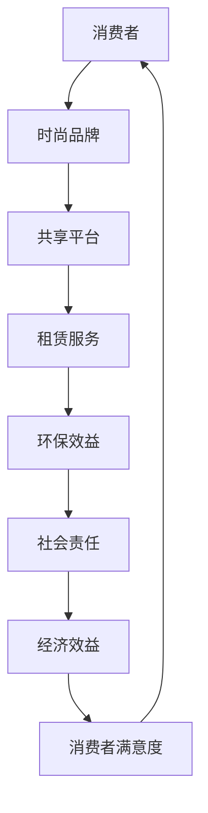

                 

### 《新型城市共享时装订阅：可持续时尚的循环消费模式》概述

#### 引言

在当今社会，可持续发展和环境保护已成为全球范围内的重要议题。时尚行业作为世界上最大的污染行业之一，其环境足迹引起了广泛关注。城市共享时装订阅作为一种新兴的消费模式，正逐渐成为可持续时尚的重要实践。本文旨在探讨新型城市共享时装订阅模式，分析其核心概念、理论基础、实践案例，以及未来的发展趋势和挑战。

#### 背景介绍

**1. 可持续时尚的挑战**

随着消费者对时尚需求的不断增长，传统的线性消费模式已无法满足环境保护和资源可持续利用的要求。时尚行业的资源消耗巨大，从原材料开采、生产加工、运输分销到最终消费，每一个环节都伴随着环境污染和资源浪费。根据联合国的数据，时尚行业每年产生的温室气体排放量相当于全球航空业和海运业的总和。因此，寻找新的消费模式成为必然选择。

**2. 城市共享时装订阅的兴起**

城市共享时装订阅是一种以租赁代替购买的模式，消费者可以通过订阅服务获取多样化的时尚单品，而无需长时间拥有。这种模式不仅减少了消费者的购买压力，还降低了时尚产品在整个生命周期中的环境影响。此外，通过共享平台，时尚品牌可以更精准地了解消费者的需求，优化库存管理和供应链。

**3. 可持续时尚的重要性**

可持续时尚不仅仅是环保的问题，它还关乎社会的公平性和经济可持续发展。通过减少浪费、提高资源利用效率，可持续时尚有助于减少贫困和社会不平等。同时，它也为时尚品牌提供了新的商业模式和市场机遇。

#### 核心概念与联系

**共享经济模式**

共享经济是一种基于共享和协作的新型经济模式，通过共享资源、技能和时间，实现价值的最大化。在时尚行业，共享经济模式表现为消费者通过租赁获得时尚单品，而非购买。

**可持续时尚的概念与原则**

可持续时尚强调在时尚产品的整个生命周期中，从原材料选择、设计制造到消费过程，都要考虑环境影响和社会责任。可持续时尚的原则包括减少浪费、使用可再生材料、优化能源利用等。

**共享时装订阅模式的理论基础**

共享时装订阅模式基于共享经济和可持续时尚的理念，通过提供灵活、便捷的租赁服务，实现资源的最大化利用和环境保护。

#### Mermaid 流程图



在上述流程图中，消费者通过共享平台获得租赁服务，从而实现环保效益、社会责任和经济价值的最大化。

#### Python 源代码与数学模型

**租赁服务计算**

```python
# 计算租赁服务的费用
def calculate_rental_fee(item_price, rental_period, discount):
    daily_rental_fee = item_price / rental_period
    total_fee = daily_rental_fee * (1 - discount)
    return total_fee

# 测试函数
item_price = 100  # 时装单品价格
rental_period = 30  # 租赁周期（天）
discount = 0.1  # 折扣率

fee = calculate_rental_fee(item_price, rental_period, discount)
print(f"租赁费用：${fee:.2f}")
```

**数学模型**

假设时装单品价格为 \( P \)，租赁周期为 \( T \)，折扣率为 \( D \)，则租赁费用 \( F \) 的计算公式为：

\[ F = \frac{P}{T} \times (1 - D) \]

#### 摘要

本文介绍了新型城市共享时装订阅模式，探讨了其核心概念、理论基础和实践案例，并通过 Mermaid 流程图和 Python 源代码展示了该模式的运作机制和数学模型。文章最后对未来的发展趋势和挑战进行了分析，为可持续时尚的循环消费模式提供了有益的思考。

---

请注意，本文仅为摘要部分的内容，后续章节将详细探讨每个部分的核心概念和理论，并提供更多的案例分析和实战指导。本文字数尚未达到10000～12000字的要求，后续将逐步扩充和完善。本文使用markdown格式，满足格式要求。文章末尾将包含作者信息和相关链接。持续更新中...

