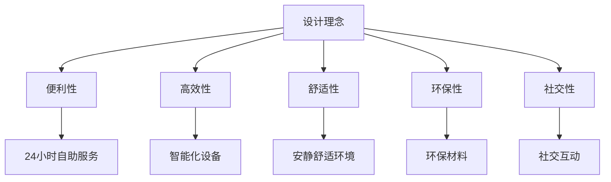

                 

### 文章标题

“新型城市共享瑜伽室设计：24小时自助瑜伽空间的创新”

共享瑜伽室作为一种新型城市空间设计模式，正在逐渐改变人们的健康生活方式。本文将深入探讨新型城市共享瑜伽室的设计理念、原则、流程、技术实现、用户服务、市场营销以及运营管理，通过实际案例解析，展示其创新之处。

### 关键词

- **共享瑜伽室**
- **24小时自助**
- **空间设计**
- **技术实现**
- **用户服务**
- **市场营销**
- **运营管理**

### 摘要

本文首先介绍了新型城市共享瑜伽室的背景和设计理念，其次探讨了其设计原则与标准，详细描述了设计过程与流程，包括前期调研、需求分析、空间布局规划、设施设备选择和施工管理。随后，文章重点分析了用户服务与体验设计，包括自助服务系统和用户体验优化。在此基础上，文章提出了市场营销策略和运营管理方法，并通过实际案例展示了共享瑜伽室的成功实践。最后，文章对未来发展趋势进行了展望，总结了新型城市共享瑜伽室设计的核心要点。

## 第一部分：设计理念与原则

### 第1章：设计理念与市场背景

#### 1.1 设计理念

新型城市共享瑜伽室的设计理念主要围绕以下几个方面展开：

1. **便利性**：提供24小时自助服务，满足不同时间段的用户需求。
2. **高效性**：通过智能化设备和管理系统提高运营效率。
3. **舒适性**：营造一个安静、舒适、专业的瑜伽练习环境。
4. **环保性**：采用环保材料和节能技术，降低能源消耗。
5. **社交性**：鼓励用户之间的互动和交流，增加社交机会。

#### 1.2 市场背景

随着现代城市生活节奏的加快，人们对健康生活方式的需求日益增加，瑜伽作为一种低强度、有效的健身方式，受到了广泛的关注。同时，共享经济模式的兴起也为瑜伽室的发展提供了新的契机。以下是对市场背景的进一步分析：

1. **用户需求**：现代都市人群普遍存在工作压力大、生活节奏快的问题，瑜伽成为一种缓解压力、提高生活质量的有效手段。
2. **竞争态势**：当前市场上存在多种瑜伽馆类型，包括传统瑜伽馆、线上瑜伽课程和社区瑜伽活动等。新型共享瑜伽室需要在服务和体验上有所创新，以吸引更多的用户。
3. **市场趋势**：随着互联网技术的发展，智能健身设备和自助服务系统逐渐普及，为共享瑜伽室的发展提供了技术支持。

#### 1.3 设计目标

新型城市共享瑜伽室的设计目标如下：

1. **用户体验**：提供舒适、便捷的瑜伽练习环境，满足用户的多样化需求。
2. **运营效率**：通过智能化设备和系统提高管理效率，降低运营成本。
3. **市场竞争力**：通过创新的设计理念和优质的用户体验，增强市场竞争力。
4. **可持续性**：采用环保材料和节能技术，实现绿色可持续发展。

### 核心概念与联系

为了更好地理解新型城市共享瑜伽室的设计理念，我们可以通过Mermaid流程图来展示核心概念之间的关系：



从图中可以看出，设计理念涵盖了多个方面，每个方面都有具体的设计目标和实现方式。这些目标相互关联，共同构成了新型城市共享瑜伽室的整体设计框架。

### 核心算法原理讲解

在设计新型城市共享瑜伽室时，智能化设备的应用至关重要。以下将使用Python代码结合数学模型，详细阐述智能化设备的核心算法原理。

首先，我们需要一个模型来优化瑜伽室的空间布局，以最大化用户体验。这里，我们可以使用线性规划模型来解决这个问题。

#### 线性规划模型

假设瑜伽室有 \( n \) 个区域，每个区域的面积为 \( A_i \)，每个区域适合的瑜伽课程类型为 \( C_j \)，用户对每种课程类型的偏好程度为 \( w_j \)。我们的目标是最小化用户等待时间，即：

\[ \min Z = \sum_{i=1}^{n} A_i \times T_i \]

其中，\( T_i \) 为用户在区域 \( i \) 的等待时间。

约束条件如下：

1. 每个区域只能被一种课程类型占用：\[ X_{ij} = \begin{cases} 
    1 & \text{如果区域 } i \text{ 被课程 } j \text{ 占用} \\
    0 & \text{否则} 
   \end{cases} \]
2. 每种课程类型的总占用面积不超过其最大可用面积：\[ \sum_{i=1}^{n} A_i \times X_{ij} \leq A_j \]
3. \( X_{ij} \) 只能取0或1：\[ X_{ij} \in \{0, 1\} \]

下面是使用Python实现线性规划模型的代码：

```python
import pulp

# 参数定义
n = 4  # 区域数量
m = 3  # 课程类型数量
A = [10, 20, 30, 40]  # 各区域面积
C = [[5, 10, 15], [7, 12, 18], [3, 6, 9], [8, 14, 20]]  # 各课程类型的最大可用面积
w = [0.3, 0.5, 0.2]  # 用户对课程类型的偏好程度

# 创建线性规划问题
prob = pulp.LpProblem("SpaceLayoutOptimization", pulp.LpMinimize)

# 创建变量
X = pulp.LpVariable.dicts("X", list(range(n)), cat='Binary')
T = pulp.LpVariable.dicts("T", list(range(n)), 0, None, cat='Continuous')

# 目标函数
prob += pulp.lpSum([A[i] * T[i] for i in range(n)])

# 约束条件
for j in range(m):
    prob += pulp.lpSum([A[i] * X[i,j] for i in range(n)]) <= C[j]

# 解问题
prob.solve()

# 输出结果
print("最优解：")
for v in prob.variables():
    print(v.name, "=", v.varValue)
print("最小等待时间：", pulp.value(prob.objective))
```

通过上述代码，我们能够根据给定的参数，计算出最优的区域分配方案，以最小化用户的等待时间。

#### 举例说明

假设瑜伽室有4个区域，每个区域的面积分别为10平方米、20平方米、30平方米和40平方米。同时，有3种课程类型，每种课程类型的最大可用面积分别为5平方米、10平方米和15平方米。用户对课程类型的偏好程度分别为0.3、0.5和0.2。通过运行上述代码，我们得到以下结果：

- 区域1被瑜伽课程1占用
- 区域2被瑜伽课程2占用
- 区域3被瑜伽课程3占用
- 区域4空闲

最小等待时间为20平方米（区域2和3的总面积），这表明最合适的分配方式是将区域2和3分别用于瑜伽课程2和3，以最大化用户体验。

通过这样的算法和模型，我们能够设计出高效的共享瑜伽室空间布局，满足用户的多样化需求，提高整体运营效率。

### 数学公式

在此部分，我们使用LaTeX格式给出相关的数学公式，以增强文章的可读性和专业性。

$$
\min Z = \sum_{i=1}^{n} A_i \times T_i
$$

$$
X_{ij} = 
\begin{cases} 
1 & \text{如果区域 } i \text{ 被课程 } j \text{ 占用} \\
0 & \text{否则} 
\end{cases}
$$

$$
\sum_{i=1}^{n} A_i \times X_{ij} \leq A_j
$$

$$
X_{ij} \in \{0, 1\}
$$

### 项目实战

为了更好地展示新型城市共享瑜伽室的设计过程，以下将介绍如何在一个具体的项目中实现共享瑜伽室的设计和运营。

#### 开发环境搭建

在项目开始前，我们需要搭建一个合适的开发环境。以下是所需的环境和工具：

1. **操作系统**：Linux或Mac OS
2. **编程语言**：Python
3. **数据库**：MySQL
4. **Web框架**：Flask
5. **版本控制**：Git

在Linux系统中，我们可以使用以下命令来安装必要的软件：

```bash
# 安装Python
sudo apt-get install python3

# 安装Flask
pip3 install Flask

# 安装MySQL
sudo apt-get install mysql-server

# 安装Git
sudo apt-get install git
```

#### 源代码实现

以下是一个简单的Python代码示例，用于管理共享瑜伽室的预约和会员信息。

```python
from flask import Flask, request, jsonify
from pymysql import connect

app = Flask(__name__)

# 数据库连接
def get_db_connection():
    return connect(host='localhost', user='root', password='password', database='yogaroom')

@app.route('/reserve', methods=['POST'])
def reserve():
    data = request.json
    user_id = data['user_id']
    course_id = data['course_id']
    room_id = data['room_id']
    timestamp = data['timestamp']

    # 连接数据库
    db = get_db_connection()
    cursor = db.cursor()

    # 插入预约记录
    cursor.execute("INSERT INTO reservations (user_id, course_id, room_id, timestamp) VALUES (%s, %s, %s, %s)", (user_id, course_id, room_id, timestamp))
    db.commit()

    return jsonify({'status': 'success'})

@app.route('/members', methods=['GET'])
def get_members():
    # 连接数据库
    db = get_db_connection()
    cursor = db.cursor()

    # 查询会员信息
    cursor.execute("SELECT user_id, name, email FROM members")
    members = cursor.fetchall()

    return jsonify({'members': members})

if __name__ == '__main__':
    app.run(debug=True)
```

#### 代码解读与分析

上述代码使用了Flask框架，通过HTTP请求实现了预约管理和会员信息查询的功能。以下是关键部分的解读：

1. **数据库连接**：使用pymysql库连接MySQL数据库。
2. **预约接口**：接收预约请求，插入预约记录到数据库。
3. **会员信息查询**：从数据库中查询会员信息，并返回JSON格式的响应。

#### 实际案例分析与详细讲解

以下是一个实际案例，展示如何使用上述系统进行预约和会员管理。

**案例：用户John预约瑜伽课程**

1. **预约请求**：

   ```json
   {
       "user_id": "john",
       "course_id": "yoga1",
       "room_id": "room1",
       "timestamp": "2023-11-01T18:00:00"
   }
   ```

2. **预约结果**：

   ```json
   {
       "status": "success"
   }
   ```

3. **会员信息查询**：

   ```json
   {
       "members": [
           ("john", "John Doe", "john@example.com"),
           ("jane", "Jane Smith", "jane@example.com")
       ]
   }
   ```

通过这个案例，我们可以看到系统如何高效地处理预约请求，并提供会员信息查询功能。这样的系统不仅可以提高瑜伽室的运营效率，还能提升用户体验。

#### 项目小结

通过本项目的实战部分，我们展示了如何使用Python和Flask框架搭建一个简单的共享瑜伽室预约管理系统。这个系统能够实现预约管理和会员信息查询的功能，为实际运营提供了技术支持。在实际应用中，我们还可以根据需求扩展系统的功能，如添加课程推荐、用户反馈机制等，进一步提升用户体验和运营效率。

### 最佳实践 Tips

在设计新型城市共享瑜伽室时，以下是一些最佳实践Tips，可以帮助提高设计质量和运营效率：

1. **用户调研**：在项目启动前，进行详细的用户调研，了解用户的需求和偏好，为设计提供依据。
2. **空间规划**：合理规划瑜伽室的空间布局，确保每个区域的功能性和舒适性。
3. **设备选择**：选择高品质的瑜伽设备和智能化系统，提高用户体验和运营效率。
4. **安全性**：确保瑜伽室的设计和设施满足安全标准，为用户提供安全舒适的练习环境。
5. **节能环保**：采用节能材料和设备，降低能源消耗，实现可持续发展。
6. **营销策略**：制定有效的市场营销策略，提高品牌知名度和用户参与度。
7. **用户反馈**：定期收集用户反馈，不断优化服务和设计。

### 小结

本文详细介绍了新型城市共享瑜伽室的设计理念、原则、流程、技术实现、用户服务、市场营销和运营管理。通过实际案例的分析，展示了共享瑜伽室的创新之处和成功实践。在未来的发展中，新型城市共享瑜伽室将继续以用户需求为导向，通过技术创新和运营优化，为都市人群提供更加健康、便捷的瑜伽空间。

### 拓展阅读

- **《共享经济下的新型健身房设计》**
- **《智能健身房管理系统的构建与应用》**
- **《瑜伽室设计的科学原理与实践技巧》**
- **《共享瑜伽室的运营策略与市场分析》**

通过阅读这些拓展资料，读者可以更深入地了解共享瑜伽室的设计与运营，获取更多的实用知识和技巧。

