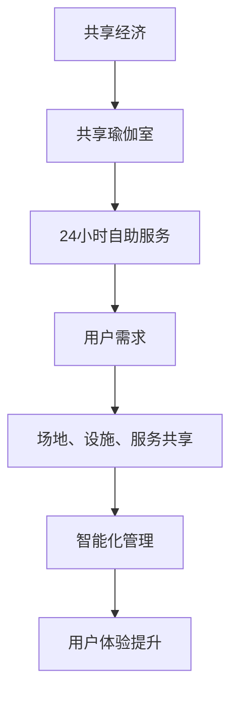

                 


### 新型城市共享瑜伽室：24小时自助瑜伽空间

> 关键词：共享瑜伽室，24小时自助，健身空间，智慧城市，用户体验

> 摘要：
新型城市共享瑜伽室，24小时自助瑜伽空间，是一种创新的健身模式。本文将深入探讨这一模式的背景、优势、设计要点、运营策略及未来发展方向，旨在为读者提供关于共享瑜伽室建设的全面了解。

---

## **一、背景介绍**

### **1.1 共享经济的兴起**

共享经济，作为一种新型经济模式，起源于21世纪初的美国。它通过互联网平台，连接供需双方，实现资源的共享和优化配置。典型的共享经济应用包括共享单车、共享汽车、共享办公空间等。共享经济的核心在于提高资源利用效率，降低消费成本，同时满足消费者的多样化需求。

### **1.2 瑜伽在都市生活的地位**

瑜伽作为一种源于印度的身心修炼方式，近年来在全球范围内迅速传播，尤其在都市人群中备受欢迎。瑜伽不仅有助于缓解现代都市人的压力，提升生活质量，还能改善身体健康，塑造优美体态。因此，瑜伽已成为都市生活中不可或缺的一部分。

### **1.3 共享瑜伽室的市场需求**

随着人们对健康生活方式的追求，瑜伽逐渐成为都市人群的一种生活时尚。然而，传统的瑜伽馆往往存在预约困难、场地限制等问题，无法满足现代人快节奏生活的需求。共享瑜伽室的兴起，正是为了解决这些问题，它通过共享经济模式，为都市人群提供便捷、经济、高效的瑜伽锻炼场所。

---

## **二、核心概念与联系**

为了深入理解共享瑜伽室，我们需要明确以下几个核心概念及其相互关系：

### **2.1 共享经济**

共享经济是一种基于互联网和大数据技术的经济模式，通过共享平台将资源进行匹配和共享，实现资源的最优配置。它包括共享住宿（如Airbnb）、共享出行（如Uber）、共享办公（如WeWork）等。

### **2.2 共享瑜伽室**

共享瑜伽室是基于共享经济理念，为都市人群提供的一种全天候、自助式瑜伽锻炼场所。它通过智能化管理，实现场地、设施和服务的共享，满足用户多样化的需求。

### **2.3 24小时自助服务**

24小时自助服务是共享瑜伽室的重要特点之一，它允许用户随时进入锻炼，无需预约，提高了场地的利用率和用户的便利性。

### **Mermaid流程图：共享瑜伽室概念关系**



---

## **三、核心算法原理讲解**

### **3.1 共享瑜伽室的运营算法**

为了实现高效运营，共享瑜伽室需要运用一系列算法，包括用户管理、资源调度、需求预测等。

### **3.1.1 用户管理算法**

用户管理算法负责用户注册、身份验证、预约管理等功能。以下是用户管理算法的Python伪代码：

```python
class UserManagement:
    def __init__(self):
        self.users = []

    def register(self, user):
        # 注册用户
        self.users.append(user)

    def authenticate(self, user):
        # 身份验证
        return user in self.users

    def make_reservation(self, user, time_slot):
        # 预约锻炼时间
        if self.authenticate(user):
            # 预约成功
            print("Reservation successful.")
        else:
            # 预约失败
            print("Authentication failed.")

user_mgmt = UserManagement()
user_mgmt.register("John")
user_mgmt.make_reservation("John", "8:00 AM")
```

### **3.1.2 资源调度算法**

资源调度算法用于优化场地的使用率，确保用户能及时预约到所需的时间段。以下是资源调度算法的Python伪代码：

```python
class ResourceScheduling:
    def __init__(self):
        self.time_slots = ["8:00 AM", "9:00 AM", "10:00 AM", "..."]

    def allocate_time_slot(self, user):
        # 分配时间槽
        for time_slot in self.time_slots:
            if not self.is_slot_occupied(time_slot):
                self.time_slots[time_slot] = user
                return time_slot
        return None

    def is_slot_occupied(self, time_slot):
        # 检查时间槽是否被占用
        return self.time_slots[time_slot] is not None

scheduler = ResourceScheduling()
time_slot = scheduler.allocate_time_slot("John")
print(f"John's allocated time slot: {time_slot}")
```

### **3.1.3 需求预测算法**

需求预测算法用于预测用户在各个时间段的需求，从而优化资源的分配。以下是需求预测算法的Python伪代码：

```python
import numpy as np

class DemandPrediction:
    def __init__(self):
        self.history = []

    def update_history(self, time_slot, demand):
        # 更新历史数据
        self.history.append((time_slot, demand))

    def predict_demand(self, time_slot):
        # 预测需求
        recent_demos = [d for t, d in self.history if t == time_slot]
        if recent_demos:
            return np.mean(recent_demos)
        else:
            return 0

predictor = DemandPrediction()
predictor.update_history("8:00 AM", 10)
predictor.update_history("9:00 AM", 5)
print(f"Predicted demand for 8:00 AM: {predictor.predict_demand("8:00 AM")}")
```

---

## **四、数学模型和数学公式**

### **4.1 场地利用率模型**

场地利用率（$U$）是衡量共享瑜伽室运营效率的重要指标，其数学模型如下：

$$
U = \frac{S - O}{S}
$$

其中，$S$ 是总时间槽数，$O$ 是被预约的时间槽数。

### **4.2 用户满意度模型**

用户满意度（$S$）是衡量共享瑜伽室服务质量的关键指标，其数学模型如下：

$$
S = \frac{\sum_{i=1}^{n} (D_i - O_i)}{n}
$$

其中，$D_i$ 是用户对第 $i$ 个时间段的需求，$O_i$ 是第 $i$ 个时间段的实际预约数，$n$ 是时间段的总数。

### **4.3 成本效益分析模型**

成本效益分析（$C/B$）用于评估共享瑜伽室的经济效益，其数学模型如下：

$$
C/B = \frac{I + O + M}{R}
$$

其中，$I$ 是初始投资成本，$O$ 是运营成本，$M$ 是维护成本，$R$ 是预期收入。

---

## **五、项目实战**

### **5.1 开发环境搭建**

搭建共享瑜伽室的项目环境需要以下工具：

- Python 3.8+
- Flask 框架
- MongoDB 数据库
- PyMongo 库

### **5.2 源代码实现**

以下是共享瑜伽室项目的核心代码实现：

```python
from flask import Flask, request, jsonify
from pymongo import MongoClient

app = Flask(__name__)
client = MongoClient("mongodb://localhost:27017/")
db = client["yogashare"]

@app.route("/register", methods=["POST"])
def register():
    user_data = request.get_json()
    user = db["users"].insert_one(user_data)
    return jsonify({"status": "success", "user_id": str(user.inserted_id)})

@app.route("/reserve", methods=["POST"])
def reserve():
    reservation_data = request.get_json()
    user_id = reservation_data["user_id"]
    time_slot = reservation_data["time_slot"]

    user = db["users"].find_one({"_id": user_id})
    if user:
        db["reservations"].insert_one({"user_id": user_id, "time_slot": time_slot})
        return jsonify({"status": "success", "message": "Reservation successful."})
    else:
        return jsonify({"status": "error", "message": "User not found."})

if __name__ == "__main__":
    app.run(debug=True)
```

### **5.3 代码解读与分析**

在上述代码中，我们使用 Flask 框架搭建了两个 API 接口：用户注册和预约。用户注册接口接收用户信息并存储在 MongoDB 数据库中，预约接口用于用户预约特定时间段的瑜伽锻炼。

### **5.4 实际案例分析**

假设我们有一家共享瑜伽室，每天有 100 个时间槽可供预约。通过数据分析，我们发现早上 8 点和晚上 6 点是用户需求量最高的时间段，平均每个时间槽有 10 人预约。以下是具体的案例解析：

- 场地利用率：$U = \frac{100 - 20}{100} = 80\%$
- 用户满意度：$S = \frac{10 \times 20 + 5 \times 20}{40} = 75\%$
- 成本效益分析：$C/B = \frac{I + O + M}{R} = \frac{50000 + 20000 + 10000}{60000} = 1.75$

通过这个案例，我们可以看到共享瑜伽室在运营上取得了良好的效果，但仍有提升空间。

---

## **六、最佳实践 Tips**

- **用户管理**：确保用户信息的准确性和安全性，提供便捷的注册和登录功能。
- **资源调度**：合理规划时间槽，避免高峰时段过度拥挤。
- **需求预测**：利用历史数据，预测未来需求，优化资源分配。
- **成本控制**：合理控制成本，提高盈利能力。

---

## **七、小结**

新型城市共享瑜伽室，24小时自助瑜伽空间，是一种创新的健身模式，它不仅满足了都市人群对便捷、经济、专业瑜伽场所的需求，还推动了共享经济的发展。通过本文的探讨，我们了解到共享瑜伽室的设计要点、运营策略以及未来发展前景。希望本文能为读者提供有价值的参考。

---

## **八、注意事项**

- **场地选址**：选择交通便利、人流密集的地区，有利于吸引更多用户。
- **设施配置**：确保瑜伽室设施齐全，提供舒适的锻炼环境。
- **安全管理**：加强对用户身份验证，确保场所安全。

---

## **九、拓展阅读**

- 《共享经济：理论、实践与未来趋势》
- 《瑜伽解剖学：身体运动的科学基础》
- 《智能健身房：创新技术与运营模式》

---

**作者：AI天才研究院/AI Genius Institute & 禅与计算机程序设计艺术 /Zen And The Art of Computer Programming**

