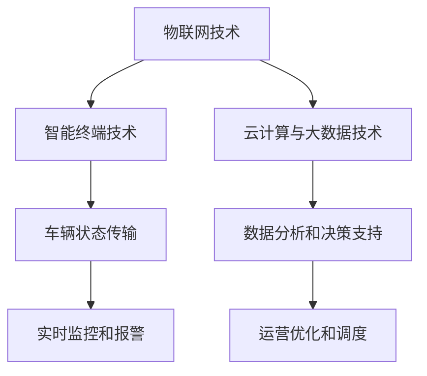
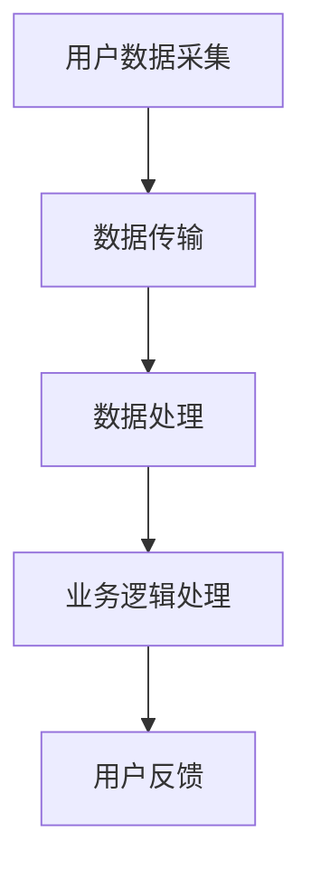

                 

### 文章标题

《新型城市共享电动滑板车网络：最后一公里的绿色解决方案》

#### 文章关键词

- 新型城市
- 共享电动滑板车
- 绿色解决方案
- 最后一公里
- 智能交通系统

#### 文章摘要

本文探讨了新型城市共享电动滑板车网络的发展及其在解决城市交通和环境保护问题中的关键作用。通过分析其技术基础、运营模式、架构设计及核心算法，我们揭示了共享电动滑板车网络作为最后一公里绿色解决方案的潜力，并对未来的发展趋势和挑战进行了展望。

### 引言

#### 1.1 共享电动滑板车网络的起源与发展

共享经济作为一种新兴的经济模式，近年来在全球范围内迅速发展。共享汽车、共享单车等模式已经成为城市交通的重要组成部分。电动滑板车作为共享经济的一种新形式，也在近几年内崛起，逐渐成为城市出行的新选择。

共享电动滑板车网络的起源可以追溯到2010年左右，当时一些初创公司开始尝试在校园和城市地区推出电动滑板车共享服务。这些服务通过移动互联网和物联网技术，实现了车辆的实时定位、租赁和解锁等功能。随着技术的不断进步和市场的需求增加，共享电动滑板车网络逐渐在全球范围内扩展。

近年来，共享电动滑板车网络在全球多个城市得到广泛应用，其发展速度之快令人瞩目。根据统计，全球共享电动滑板车的用户数量已经超过数百万，并且在不断增长。特别是在北美、欧洲和亚洲的一些大城市，共享电动滑板车已经成为解决“最后一公里”出行问题的有效手段。

#### 1.2 城市交通问题与共享电动滑板车的角色

城市交通问题一直是全球城市面临的重要挑战。随着城市人口的不断增长和机动化的普及，城市交通拥堵、污染和交通事故等问题日益严重。传统的公共交通系统在高峰时段往往难以满足乘客需求，而私家车的大量使用则加剧了交通拥堵和环境污染。

共享电动滑板车网络的兴起为解决城市交通问题提供了新的思路。首先，共享电动滑板车可以作为一种灵活的出行选择，补充公共交通和私家车的不足。用户可以通过手机应用程序轻松找到最近的共享电动滑板车，进行即时租赁和使用。这种灵活的出行方式不仅方便用户，还能够减少交通拥堵，提高交通效率。

其次，共享电动滑板车网络的运营模式具有环保优势。与传统汽车相比，电动滑板车的能耗和排放明显更低，有助于减少碳排放和空气污染。此外，共享电动滑板车网络还能够减少车辆闲置时间，提高车辆使用效率，进一步降低能源消耗。

#### 1.3 新型城市共享电动滑板车网络的背景

新型城市共享电动滑板车网络的发展背景主要包括全球化、智能化和绿色发展需求三个方面。

首先，全球化背景为共享电动滑板车网络的发展提供了广阔的市场空间。随着全球化的深入发展，各国城市之间的联系日益紧密，城市交通问题成为全球共同关注的议题。共享电动滑板车网络作为一种创新的交通解决方案，能够在不同国家和地区得到推广和应用。

其次，智能化趋势为共享电动滑板车网络的发展提供了技术支持。物联网、大数据、人工智能等技术的发展，使得共享电动滑板车网络能够实现更高效、更智能的运营管理。通过智能终端设备和数据分析，共享电动滑板车网络能够实现车辆实时定位、路径规划、能耗优化等功能，提高用户体验和运营效率。

最后，绿色发展需求为共享电动滑板车网络的发展提供了动力。随着人们对环境保护意识的提高，减少碳排放和改善空气质量成为各国政府的首要任务。共享电动滑板车网络作为一种绿色出行方式，符合绿色发展理念，能够在一定程度上缓解城市交通拥堵和环境污染问题。

#### 1.4 书籍结构与内容概述

本书旨在深入探讨新型城市共享电动滑板车网络的发展及其在解决城市交通和环境保护问题中的作用。全书分为三个部分：

第一部分是引言，主要介绍了共享电动滑板车网络的起源、发展背景、在城市交通问题中的角色以及新型城市共享电动滑板车网络的背景。这部分内容为后续章节的讨论奠定了基础。

第二部分是核心概念与架构，详细介绍了新型城市共享电动滑板车网络的核心概念、技术架构、运营模式、架构设计及核心算法。这部分内容是本书的核心，旨在帮助读者全面了解共享电动滑板车网络的技术原理和实践应用。

第三部分是绿色解决方案，探讨了新型城市共享电动滑板车网络在环境保护、交通改善和城市可持续发展方面的贡献。这部分内容旨在展示共享电动滑板车网络作为一种绿色解决方案的潜力和价值。

此外，本书还提供了附录，包括参考资料和进一步阅读的内容，以供读者深入了解相关领域的研究和实践。

本书的主要目标是：

1. 揭示新型城市共享电动滑板车网络的发展现状和未来趋势。
2. 分析共享电动滑板车网络在城市交通和环境保护问题中的关键作用。
3. 介绍共享电动滑板车网络的核心概念、技术架构和运营模式。
4. 探讨共享电动滑板车网络在绿色解决方案中的应用和实践。

本书的主要读者群体包括：

1. 城市交通规划和管理人员，了解共享电动滑板车网络的发展和应用。
2. 信息技术和物联网领域的专业人士，关注共享电动滑板车网络的技术创新和实践。
3. 环境保护和可持续发展领域的专业人士，探讨共享电动滑板车网络在环境保护和可持续发展中的作用。

内容结构安排：

本书分为三大部分，共十六章。第一部分引言包括第一章到第三章，主要介绍共享电动滑板车网络的背景和发展现状。第二部分核心概念与架构包括第四章到第八章，详细分析共享电动滑板车网络的核心概念、技术架构、运营模式和核心算法。第三部分绿色解决方案包括第九章到第十六章，探讨共享电动滑板车网络在环境保护、交通改善和城市可持续发展方面的贡献。

### 核心概念与架构

#### 2.1 技术基础

新型城市共享电动滑板车网络的技术基础主要包括物联网（IoT）、智能终端技术、云计算与大数据技术。这些技术的融合与应用，使得共享电动滑板车网络能够实现高效的运营管理、实时数据分析和智能决策。

**物联网技术**：物联网技术是共享电动滑板车网络的核心组成部分。通过物联网，电动滑板车与云端服务器进行实时通信，实现车辆状态、位置信息的传输和监控。物联网技术包括传感器、无线通信模块和网络协议等，它们共同构建了共享电动滑板车网络的物理和信息连接。

**智能终端技术**：智能终端技术包括智能手机、智能手表、智能眼镜等，这些设备为用户提供了便捷的租赁和解锁功能。通过智能终端设备，用户可以实时查看车辆状态、租赁进度和费用信息，还可以通过应用程序进行导航和反馈。

**云计算与大数据技术**：云计算与大数据技术为共享电动滑板车网络提供了强大的数据处理和分析能力。通过云计算平台，共享电动滑板车网络能够存储和管理海量的数据，包括用户行为数据、车辆状态数据和环境数据。大数据技术则通过对这些数据的分析和挖掘，为运营决策提供支持，如车辆调度、路线优化和能耗管理。

**Mermaid 流程图**



#### 2.2 运营模式

新型城市共享电动滑板车网络的运营模式主要包括注册与身份认证、租赁流程、费用计算和用户体验与反馈机制。

**注册与身份认证**：用户首先需要在共享电动滑板车网络平台上注册账户，并进行身份认证。身份认证过程通常包括手机号码验证、人脸识别或身份证信息验证等，以确保用户信息的真实性和安全性。

**租赁流程**：用户通过手机应用程序找到附近的共享电动滑板车，并进行租赁。租赁流程包括扫描车辆二维码、输入密码或指纹解锁、开启行程等步骤。用户在行程结束后，将车辆停放在指定区域内，通过应用程序完成行程结算。

**费用计算**：共享电动滑板车的费用计算通常包括时间费用和距离费用。用户根据行程的时间和距离支付相应的费用。一些平台还提供免费骑行时间或免费距离，以鼓励用户减少骑行时间和距离。

**用户体验与反馈机制**：共享电动滑板车网络平台会收集用户的使用数据和反馈，以不断优化服务。用户可以通过应用程序提交反馈，如车辆故障、服务不周等。平台会根据用户的反馈进行调整和改进，以提高用户满意度。

#### 2.3 架构设计

新型城市共享电动滑板车网络的架构设计包括物理架构设计、软件架构设计和数据流架构设计。

**物理架构设计**：物理架构设计主要涉及电动滑板车的硬件配置和传感器安装。电动滑板车通常配备有GPS定位模块、蓝牙通信模块、无线充电模块等，以实现车辆的实时定位、通信和充电功能。

**软件架构设计**：软件架构设计包括应用程序层、业务逻辑层和数据存储层。应用程序层为用户提供租赁、解锁、支付等功能；业务逻辑层处理车辆的调度、路线规划、能耗管理等业务逻辑；数据存储层存储用户数据、车辆数据和环境数据。

**数据流架构设计**：数据流架构设计主要涉及数据采集、传输和处理。数据采集包括车辆状态数据、用户行为数据和环境数据等；数据传输通过物联网技术实现实时传输；数据处理包括数据清洗、分析和挖掘等。

**Mermaid 流程图**



#### 2.4 核心算法

新型城市共享电动滑板车网络的核心算法包括车辆调度算法、位置跟踪与导航算法和能耗优化算法。

**车辆调度算法**：车辆调度算法负责根据用户需求和车辆状态，实现车辆的有效调度和分配。常见的调度算法包括最短路径算法、遗传算法和蚁群算法等。调度算法的目标是最大化车辆利用率，最小化用户等待时间和行驶距离。

**位置跟踪与导航算法**：位置跟踪与导航算法负责实时跟踪电动滑板车的位置，并提供最优导航路径。常用的位置跟踪算法包括GPS定位、无线传感器网络定位和地图匹配算法。导航算法通常基于路径规划算法，如A*算法和Dijkstra算法，以提供实时、准确的导航服务。

**能耗优化算法**：能耗优化算法旨在降低电动滑板车的能耗，延长续航时间。常见的能耗优化算法包括能耗预测模型、能耗优化策略和能耗控制算法。通过实时监测车辆状态和路况信息，能耗优化算法能够实现智能化的能耗管理。

**Python 源代码**

```python
import heapq
import math

# 车辆调度算法示例
def vehicle_scheduling(requests, vehicles):
    # 创建一个优先队列，用于存储待调度的车辆
    schedule_queue = []
    for request in requests:
        # 计算每个请求的优先级（目标位置到当前车辆位置的曼哈顿距离）
        priority = abs(request['destination_x'] - request['current_x']) + abs(request['destination_y'] - request['current_y'])
        # 将请求加入优先队列
        heapq.heappush(schedule_queue, (priority, request))
    
    # 调度车辆
    scheduled_vehicles = []
    while schedule_queue:
        _, request = heapq.heappop(schedule_queue)
        # 分配车辆
        vehicle = find_vehicle(vehicles)
        if vehicle:
            scheduled_vehicles.append((vehicle, request))
            # 更新车辆位置
            vehicle['current_x'] = request['destination_x']
            vehicle['current_y'] = request['destination_y']
    
    return scheduled_vehicles

# 找到可用车辆
def find_vehicle(vehicles):
    for vehicle in vehicles:
        if vehicle['available']:
            vehicle['available'] = False
            return vehicle
    return None

# 示例数据
requests = [
    {'current_x': 0, 'current_y': 0, 'destination_x': 3, 'destination_y': 4},
    {'current_x': 1, 'current_y': 1, 'destination_x': 5, 'destination_y': 6},
    {'current_x': 2, 'current_y': 2, 'destination_x': 4, 'destination_y': 5}
]
vehicles = [
    {'id': 1, 'current_x': 0, 'current_y': 0, 'available': True},
    {'id': 2, 'current_x': 1, 'current_y': 1, 'available': True},
    {'id': 3, 'current_x': 2, 'current_y': 2, 'available': True}
]

# 执行车辆调度算法
scheduled_vehicles = vehicle_scheduling(requests, vehicles)
print(scheduled_vehicles)
```

### 绿色解决方案

#### 3.1 环境保护

新型城市共享电动滑板车网络在环境保护方面具有显著优势。首先，共享电动滑板车作为一种零排放的交通工具，可以有效减少城市的碳排放。相比传统燃油汽车，电动滑板车的二氧化碳排放量大幅降低，有助于改善空气质量。

其次，共享电动滑板车网络通过减少车辆闲置时间和提高车辆使用效率，进一步降低了能源消耗。传统私家车在非高峰时段往往处于闲置状态，而共享电动滑板车则可以充分利用这些闲置车辆，实现资源共享。根据统计，共享电动滑板车的使用频率和行驶里程显著高于传统私家车，从而降低了总体能源消耗。

此外，共享电动滑板车网络还能够有效减少城市交通拥堵。交通拥堵不仅浪费了大量的时间和资源，还会导致更多的尾气排放。共享电动滑板车网络通过提供灵活的出行选择，分散了交通流量，减少了拥堵现象，从而降低了尾气排放。

#### 3.2 交通改善

新型城市共享电动滑板车网络在交通改善方面也发挥了重要作用。首先，共享电动滑板车作为一种短途出行工具，可以填补公共交通和私家车之间的空白，实现无缝衔接。用户可以在公共交通站点或目的地附近轻松找到共享电动滑板车，进行短途出行，从而减少了对私家车的依赖。

其次，共享电动滑板车网络通过实时数据分析和智能调度，实现了高效的交通管理。通过分析用户出行数据、车辆状态数据和路况信息，共享电动滑板车网络能够实现精准的车辆调度和路线规划，减少交通拥堵，提高交通效率。

此外，共享电动滑板车网络还能够为城市交通规划提供有力支持。通过收集和分析大量交通数据，城市管理者可以更好地了解交通状况，优化交通布局，提高交通设施的利用效率。

#### 3.3 城市可持续发展

新型城市共享电动滑板车网络对城市可持续发展具有深远影响。首先，共享电动滑板车网络作为一种绿色出行方式，符合可持续发展理念，有助于实现城市交通的低碳化和绿色化。通过推广共享电动滑板车，城市可以减少对传统燃油汽车的依赖，降低碳排放，改善环境质量。

其次，共享电动滑板车网络促进了城市智能化建设。通过物联网、大数据和人工智能等技术的应用，共享电动滑板车网络实现了车辆状态的实时监控、路径规划和能耗管理，提高了城市交通的智能化水平。这有助于提升城市管理的效率，促进城市的可持续发展。

此外，共享电动滑板车网络还推动了社区互动和社区服务的发展。共享电动滑板车作为一种便捷的出行工具，不仅方便了居民的出行，还促进了社区居民之间的交流和互动。通过共享平台，居民可以方便地分享出行经验和资源，增强社区的凝聚力和互助精神。

#### 3.4 新型城市共享电动滑板车网络的未来发展

随着技术的不断进步和市场需求的增长，新型城市共享电动滑板车网络有望在未来的发展中取得更大的突破。以下是新型城市共享电动滑板车网络未来发展的一些趋势和挑战：

**趋势 1：智能化与自动化**

智能化和自动化是未来共享电动滑板车网络发展的重要方向。通过应用人工智能、机器学习和物联网等先进技术，共享电动滑板车网络可以实现更智能的车辆调度、路径规划和能耗管理。例如，自动驾驶滑板车的出现将大大提高共享电动滑板车网络的运营效率，减少人为失误和事故风险。

**趋势 2：多元化服务模式**

未来，共享电动滑板车网络可能会发展出更多元化的服务模式，以满足不同用户的需求。例如，提供按需租赁、订阅服务和共享社区等模式，用户可以根据自己的需求和预算选择合适的服务方式。此外，共享电动滑板车网络还可能与其他交通方式（如共享单车、公共交通等）进行整合，实现多模式出行。

**趋势 3：绿色能源和可持续材料**

为了进一步推动绿色发展和可持续发展，共享电动滑板车网络将越来越注重使用绿色能源和可持续材料。例如，推广太阳能充电、风能充电等绿色能源方式，减少对传统化石燃料的依赖。此外，共享电动滑板车的制造和维修也将采用更环保的材料和技术，以降低对环境的影响。

**挑战 1：政策与法规**

政策与法规是共享电动滑板车网络发展的重要制约因素。未来，政府需要制定更加完善和灵活的政策与法规，以规范共享电动滑板车网络的发展。例如，明确共享电动滑板车的监管主体、运营标准和法律责任，保障用户的权益和城市的交通安全。

**挑战 2：技术标准化和安全性**

技术标准化和安全性是共享电动滑板车网络发展面临的重大挑战。随着共享电动滑板车网络的发展，相关的技术标准、安全标准和数据隐私保护问题需要得到有效解决。例如，制定统一的物联网通信协议、车辆安全标准和个人信息保护规定，确保共享电动滑板车网络的稳定运行和用户安全。

**挑战 3：市场竞争和用户接受度**

市场竞争和用户接受度是共享电动滑板车网络发展的重要挑战。随着越来越多的企业进入共享电动滑板车市场，如何保持竞争力、提升用户体验和增加用户粘性成为关键问题。此外，用户对共享电动滑板车的接受度和使用习惯也需要逐渐培养，以提高市场占有率。

### 结论

新型城市共享电动滑板车网络作为一种绿色解决方案，在环境保护、交通改善和城市可持续发展方面具有巨大潜力。通过分析其技术基础、运营模式、架构设计和核心算法，我们揭示了共享电动滑板车网络的优势和不足。未来，随着技术的不断进步和市场需求的增长，共享电动滑板车网络有望在城市交通体系中发挥更加重要的作用。

作者：AI天才研究院/AI Genius Institute & 禅与计算机程序设计艺术 /Zen And The Art of Computer Programming

