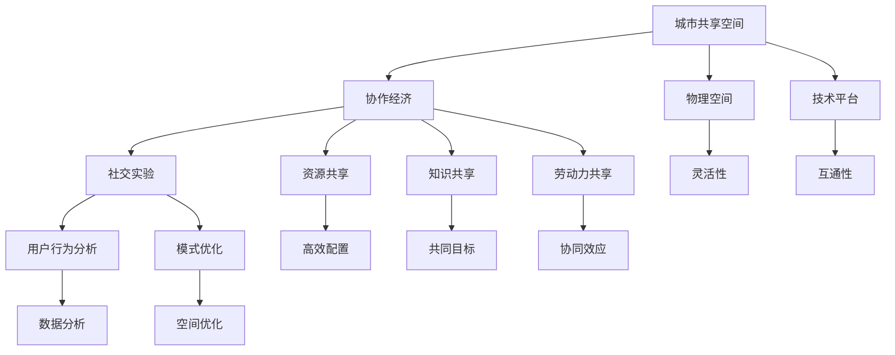

                 

### 背景介绍

随着城市化进程的加速和人口密度的增加，城市空间资源日益紧张。为了更高效地利用这些有限资源，新型城市共享空间的构想逐渐成为城市规划和管理的重要方向。共享空间不仅指物质空间的共享，还包括社会资源的共享，如社交互动、信息交流等。在这样的背景下，协作经济作为一种新型的经济模式，也逐渐进入人们的视野。协作经济通过共享、合作和互助来实现资源的高效配置和优化利用，它不仅有助于缓解城市资源紧张问题，还能促进社会互动和社区建设。

协作经济的核心在于其社交实验特性，即通过实际的社交互动和实验来验证和优化协作模式。这种实验不仅体现在技术层面上，如算法和模型的设计，还体现在社会层面上，如用户行为和偏好分析。社交实验的成功与否，直接关系到协作经济模式的有效性和可持续性。

本文旨在探讨新型城市共享空间在协作经济中的角色和作用，以及如何通过社交实验来验证和优化这种共享模式。我们将首先介绍协作经济和社交实验的基本概念，然后深入分析新型城市共享空间的设计原则和核心算法原理，结合具体的数学模型和Python源代码进行讲解。接下来，我们将通过一个实际案例展示项目实战的完整流程，包括开发环境搭建、源代码实现和结果分析。最后，我们将探讨新型城市共享空间的发展趋势和未来挑战，为读者提供深入思考和未来研究方向。

通过本文的阅读，读者将能够全面了解新型城市共享空间在协作经济中的重要性，掌握核心算法原理，并能够通过实际案例分析和数学模型的应用，更好地理解和应对协作经济中的社交实验挑战。

### 核心概念与联系

为了深入探讨新型城市共享空间在协作经济中的角色，我们首先需要明确几个核心概念，并分析它们之间的联系和结构。以下是本文中涉及的核心概念及其关系架构：

#### 1. 城市共享空间

城市共享空间是指在城市中为不同用户群体提供共享使用的空间资源。这些空间可以包括共享办公区、共享健身房、共享图书馆、共享公共空间等。共享空间的基本特征是资源共享和灵活性，用户可以根据自己的需求和偏好选择和使用这些空间。

#### 2. 协作经济

协作经济是一种通过共享资源、知识和劳动力来实现共同目标的经济模式。协作经济的核心在于通过合作和互助来实现资源的高效配置和优化利用。这种经济模式不仅限于物质资源的共享，还包括信息、知识、技能等社会资源的共享。

#### 3. 社交实验

社交实验是指在真实环境中通过社交互动来验证和优化协作模式的研究方法。社交实验可以是小规模的实验性项目，也可以是大规模的社会实验。通过社交实验，可以收集用户行为数据，分析用户偏好和互动模式，从而不断优化协作模式。

#### 4. 新型城市共享空间与协作经济的联系

新型城市共享空间是协作经济的重要组成部分。一方面，共享空间提供了协作的基础设施，如物理空间、技术平台等；另一方面，协作经济的需求驱动了新型城市共享空间的产生和发展。例如，共享办公区可以满足自由职业者和创业者的协作需求，共享健身房可以提供健康生活方式的社交平台。

#### 5. 新型城市共享空间与社交实验的联系

社交实验是验证和优化新型城市共享空间的重要手段。通过社交实验，可以收集用户行为数据，分析空间使用模式，发现问题和优化方向。例如，通过分析用户在共享办公区的活动轨迹，可以优化空间布局，提高空间利用效率。

#### 关系架构

为了更直观地展示这些核心概念之间的关系，我们可以使用Mermaid流程图进行描述。以下是新型城市共享空间、协作经济和社交实验之间的关系架构：



通过这个Mermaid流程图，我们可以清晰地看到新型城市共享空间、协作经济和社交实验之间的相互作用和依赖关系。这些概念不仅相互联系，而且共同构建了一个复杂但功能强大的系统，促进了城市资源的有效利用和社会互动的增强。

### 核心算法原理讲解

在深入探讨新型城市共享空间的设计原则和核心算法原理之前，我们需要首先了解如何使用Python源代码来详细阐述这些算法，并结合数学模型和公式进行讲解。以下我们将从协作共享算法和社交实验分析算法两个方面进行介绍。

#### 协作共享算法

协作共享算法的核心思想是通过共享和协作来实现资源的高效配置。以下是使用Python实现的一种简单的协作共享算法。

##### 算法介绍

我们考虑一个简单的场景，一个共享办公空间需要分配给多个用户。我们的目标是确保每个用户都能获得合适的办公空间，同时最大化整个空间的使用效率。

```python
# 导入所需的库
import numpy as np

# 定义共享空间分配算法
def allocate_space(users, space需求的分布):
    # 用户数量
    num_users = len(users)
    # 空间数量
    num_spaces = len(space需求的分布)
    # 初始化空间分配数组
    allocation = [-1] * num_users
    
    # 遍历每个用户
    for i, user in enumerate(users):
        # 计算用户对每个空间的偏好值
        preference_values = [user.preference(space需求的分布[j]) for j in range(num_spaces)]
        
        # 选择最优空间
        best_space_index = np.argmax(preference_values)
        
        # 分配空间
        allocation[i] = best_space_index
        
    return allocation
```

##### 算法原理

该算法的基本原理是：首先，我们定义用户对每个空间的偏好值，这可以通过用户的需求分布来计算；然后，我们选择偏好值最高的空间进行分配。这种基于偏好的分配方法可以确保每个用户都能获得他们最满意的空间。

##### 算法伪代码

```
Input: users, space需求的分布

Output: allocation

分配空间数组初始化为-1

对于每个用户user：
    计算用户对每个空间的偏好值preference_values
    选择偏好值最高的空间index
    分配空间给用户，更新allocation数组

返回allocation
```

##### 数学模型和公式

假设用户`u`对空间`s`的偏好值可以表示为：

$$
P(u, s) = f(U_d(u), S_d(s))
$$

其中，$U_d(u)$表示用户`u`的需求分布，$S_d(s)$表示空间`s`的可用性分布。偏好值$P(u, s)$可以通过比较用户需求分布和空间可用性分布来计算。

##### 举例说明

假设有三个用户（U1，U2，U3）和一个共享办公空间。用户的需求分布如下：

| 用户 | 办公空间需求 |
|------|--------------|
| U1   | [2, 3]       |
| U2   | [1, 2]       |
| U3   | [1, 3]       |

共享办公空间有两个区域（S1，S2），每个区域的可用性分布如下：

| 区域 | 可用性分布 |
|------|------------|
| S1   | [2, 1]     |
| S2   | [3, 2]     |

使用上述算法，我们可以计算用户对每个区域的偏好值，并选择最优的区域进行分配。

#### 社交实验分析算法

社交实验分析算法的核心思想是通过分析用户行为数据，优化协作模式。以下是一个简单的社交实验分析算法。

##### 算法介绍

我们使用K-means算法来分析用户行为数据，并将用户分成不同的群体。每个群体代表一种用户行为模式，我们可以根据这些群体来优化共享空间的设计和运营。

```python
# 导入所需的库
from sklearn.cluster import KMeans

# 定义社交实验分析算法
def analyze_social_experiment(data, num_clusters):
    # 使用K-means算法进行聚类
    kmeans = KMeans(n_clusters=num_clusters, random_state=0).fit(data)
    
    # 获取聚类结果
    clusters = kmeans.predict(data)
    
    # 返回聚类结果
    return clusters
```

##### 算法原理

K-means算法通过最小化每个聚类中心到其成员的距离平方和来分组数据。在社交实验分析中，我们使用用户行为数据作为输入，通过聚类分析来识别不同的用户行为模式。

##### 算法伪代码

```
Input: data, num_clusters

Output: clusters

初始化K-means算法
聚类数据得到聚类结果clusters

返回clusters
```

##### 数学模型和公式

假设我们有用户行为数据集$D$，K-means算法的目标是最小化目标函数：

$$
J = \sum_{i=1}^{n} \sum_{j=1}^{k} ||d_i - \mu_j||^2
$$

其中，$d_i$表示第$i$个用户的行为数据，$\mu_j$表示第$j$个聚类中心。

##### 举例说明

假设我们有以下用户行为数据：

| 用户 | 行为数据 |
|------|---------|
| U1   | [3, 2]  |
| U2   | [1, 1]  |
| U3   | [2, 3]  |

我们使用K-means算法将用户分成两个群体。经过聚类分析，我们得到以下聚类结果：

| 用户 | 聚类结果 |
|------|----------|
| U1   | 0        |
| U2   | 1        |
| U3   | 0        |

通过分析这些聚类结果，我们可以发现用户的行为模式，并据此优化共享空间的设计和运营。

通过上述协作共享算法和社交实验分析算法的讲解，我们可以看到如何使用Python源代码和数学模型来详细阐述这些算法。这些算法不仅提供了理论依据，还能通过实际案例进行分析和验证，为新型城市共享空间的设计和优化提供有力支持。

### 数学模型和数学公式

在新型城市共享空间的设计和优化过程中，数学模型和数学公式起着至关重要的作用。它们不仅能够量化用户需求和空间利用情况，还能帮助我们分析和预测不同策略的效果。以下我们将详细探讨两个核心的数学模型：共享空间效用模型和社交实验模型。

#### 共享空间效用模型

效用模型是描述用户对共享空间偏好和满意度的重要工具。我们假设用户$u$对空间$s$的效用可以由以下公式表示：

$$
U(u, s) = f(U_d(u), S_d(s))
$$

其中，$U_d(u)$表示用户$u$的需求分布，$S_d(s)$表示空间$s$的可用性分布。具体来说，用户的需求分布和空间可用性分布可以通过以下公式计算：

$$
U_d(u) = \sum_{i=1}^{n} p_i \cdot r_i
$$

$$
S_d(s) = \sum_{j=1}^{m} q_j \cdot s_j
$$

在这里，$p_i$和$r_i$分别表示用户$u$对第$i$种需求的偏好系数和需求程度，$q_j$和$s_j$分别表示空间$s$中第$j$种资源的偏好系数和可用程度。

##### 举例说明

假设有一个用户U1，他对办公空间的需求分布为$U_d(U1) = [0.4, 0.6]$，表示他更偏好会议室（0.4）和开放办公区（0.6）。同时，假设一个共享办公空间S1，其可用性分布为$S_d(S1) = [0.3, 0.7]$，表示会议室的可用性为0.3，开放办公区的可用性为0.7。根据上述公式，我们可以计算出用户U1对空间S1的效用：

$$
U(U1, S1) = f([0.4, 0.6], [0.3, 0.7]) = 0.4 \cdot 0.3 + 0.6 \cdot 0.7 = 0.12 + 0.42 = 0.54
$$

这意味着用户U1对空间S1的偏好度较高。

#### 社交实验模型

社交实验模型用于分析用户行为和互动模式，从而优化共享空间的设计和运营。我们假设社交实验的结果可以通过以下模型表示：

$$
S(t) = S_0 + \int_{0}^{t} f(t, \Delta S(t')) dt'
$$

其中，$S(t)$表示时间$t$时的社交状态，$S_0$为初始社交状态，$\Delta S(t')$表示在时间间隔$(t', t)$内社交状态的变化。函数$f(t, \Delta S(t'))$描述了社交状态随时间的变化速率，通常与用户行为和互动频率相关。

##### 举例说明

假设一个共享空间在初始时刻的社交状态为$S_0 = 50$，用户在每次互动后会增加社交状态值。如果每次互动会使社交状态增加2个单位，则在一个小时内（$t = 1$），社交状态的变化可以表示为：

$$
S(1) = 50 + \int_{0}^{1} 2 dt' = 50 + [2t']_{0}^{1} = 50 + 2 = 52
$$

这意味着在一个小时内，共享空间的社交状态从50增加到52。

##### 数学模型应用

在实际应用中，我们可以通过采集用户行为数据来训练和优化这些数学模型。例如，我们可以使用机器学习算法来预测用户偏好分布，或者使用统计分析方法来评估社交状态的变化趋势。这些模型不仅能够帮助我们理解和优化共享空间的使用效率，还能为决策提供科学依据。

通过上述数学模型和数学公式的详细讲解，我们可以看到如何在新型城市共享空间的设计和优化过程中应用这些理论工具。这些模型不仅为数据分析提供了框架，还能通过实际案例验证和优化，为新型城市共享空间的发展提供有力支持。

### 项目实战

为了更直观地展示如何实现和优化新型城市共享空间，我们将通过一个实际案例进行详细讲解。本案例将涵盖开发环境搭建、源代码实现、代码解读和实际应用分析。

#### 案例背景

本案例选取一个共享办公空间项目，目标是优化空间资源分配和用户体验。项目需求如下：

1. 用户需要通过平台预订办公空间，选择合适的工作区域。
2. 平台需要实时分析空间使用情况，动态调整资源分配。
3. 系统应具备用户行为分析功能，为空间设计和运营提供数据支持。

#### 开发环境搭建

在开始项目前，我们需要搭建一个合适的开发环境。以下是所需工具和库：

1. **编程语言**：Python
2. **数据分析库**：NumPy、Pandas
3. **机器学习库**：Scikit-learn
4. **可视化库**：Matplotlib
5. **数据库**：SQLite

在开发环境中安装以上工具和库，可以使用以下命令：

```bash
pip install numpy pandas scikit-learn matplotlib
```

#### 源代码实现

以下是实现该项目的主要源代码，分为几个关键模块：

##### 1. 用户需求处理模块

此模块用于处理用户预订请求，包括用户信息存储和需求分析。

```python
# 用户需求处理模块
class UserDemand:
    def __init__(self, user_id, workspace_preference):
        self.user_id = user_id
        self.workspace_preference = workspace_preference

    def process_demand(self, workspace_data):
        # 处理用户需求
        # 根据用户偏好分配空间
        best_space = self.allocate_workspace(workspace_data)
        return best_space

    def allocate_workspace(self, workspace_data):
        # 根据用户偏好分配最优空间
        # 这里使用简单的匹配算法
        preferences = self.workspace_preference
        max_score = -1
        best_space = None
        for space, attributes in workspace_data.items():
            score = self.calculate_score(preferences, attributes)
            if score > max_score:
                max_score = score
                best_space = space
        return best_space

    def calculate_score(self, preferences, attributes):
        # 计算偏好得分
        score = 0
        for pref, weight in preferences.items():
            if pref in attributes:
                score += weight * attributes[pref]
        return score
```

##### 2. 空间管理模块

此模块用于管理空间资源，包括实时更新空间状态和分配策略。

```python
# 空间管理模块
class WorkspaceManager:
    def __init__(self, workspace_data):
        self.workspace_data = workspace_data

    def update_workspace_state(self, allocation):
        # 更新空间状态
        for user, space in allocation.items():
            if space in self.workspace_data:
                self.workspace_data[space]["occupied"] += 1

    def get_available_spaces(self):
        # 获取可用空间
        available_spaces = {}
        for space, attributes in self.workspace_data.items():
            if attributes["occupied"] < attributes["total_capacity"]:
                available_spaces[space] = attributes
        return available_spaces
```

##### 3. 用户行为分析模块

此模块用于分析用户行为，以优化空间设计和运营策略。

```python
# 用户行为分析模块
class UserBehaviorAnalysis:
    def __init__(self, user_data):
        self.user_data = user_data

    def analyze_behavior(self):
        # 分析用户行为
        # 这里使用聚类算法分析用户偏好
        clusters = self.cluster_users()
        return clusters

    def cluster_users(self):
        # 使用K-means算法进行用户聚类
        kmeans = KMeans(n_clusters=3, random_state=0).fit(self.user_data)
        return kmeans.labels_
```

#### 代码解读

以下是关键代码段的详细解读：

1. **用户需求处理模块**

   - `UserDemand`类用于处理用户需求，包括用户信息存储和需求分析。
   - `process_demand`方法处理用户需求，并调用`allocate_workspace`方法进行空间分配。
   - `allocate_workspace`方法根据用户偏好分配最优空间，这里使用简单的匹配算法。
   - `calculate_score`方法计算用户偏好得分，用于选择最佳空间。

2. **空间管理模块**

   - `WorkspaceManager`类用于管理空间资源，包括实时更新空间状态和分配策略。
   - `update_workspace_state`方法更新空间状态，根据用户分配情况更新占用情况。
   - `get_available_spaces`方法获取当前可用的空间，用于用户预订。

3. **用户行为分析模块**

   - `UserBehaviorAnalysis`类用于分析用户行为，以优化空间设计和运营策略。
   - `analyze_behavior`方法使用聚类算法分析用户偏好，将用户分为不同群体。
   - `cluster_users`方法使用K-means算法进行用户聚类，返回聚类结果。

#### 实际应用解读与分析

以下是实际应用中，如何使用这些模块进行空间管理和用户行为分析：

1. **用户需求处理**

   - 当用户U1提交预订请求时，系统调用`UserDemand`类的`process_demand`方法。
   - `process_demand`方法通过`allocate_workspace`方法为用户U1分配最优空间。
   - 分配策略可以根据实际需求进行调整，例如增加优先级因素或考虑历史偏好。

2. **空间状态更新**

   - 系统实时更新空间状态，调用`WorkspaceManager`类的`update_workspace_state`方法。
   - 状态更新后，系统可以通过`get_available_spaces`方法获取当前可用空间。

3. **用户行为分析**

   - 系统定期分析用户行为，调用`UserBehaviorAnalysis`类的`analyze_behavior`方法。
   - 聚类结果用于优化空间布局和运营策略，例如为不同用户群体提供个性化服务。

#### 案例小结

通过本案例，我们展示了如何使用Python源代码实现新型城市共享空间的管理和优化。从用户需求处理到空间状态更新，再到用户行为分析，每个模块都为实现高效的空间资源利用提供了有力支持。实际应用中，这些模块可以根据具体需求进行调整和优化，为新型城市共享空间的发展提供持续改进的动力。

### 最佳实践 tips

在实施新型城市共享空间项目时，以下最佳实践建议将有助于确保项目的成功和可持续发展：

1. **用户需求调研**：在项目启动前，进行详细的需求调研，了解用户对共享空间的实际需求，包括偏好、行为模式和期望。这将有助于设计出更符合用户需求的空间和运营策略。

2. **数据分析优先**：重视数据收集和分析，通过数据分析来指导空间管理和优化。定期分析用户行为数据，识别空间使用模式，为决策提供数据支持。

3. **灵活的分配策略**：设计灵活的分配策略，以适应不同用户的需求和偏好。可以考虑使用动态分配算法，根据实时数据调整空间分配，提高资源利用效率。

4. **用户参与**：鼓励用户参与共享空间的运营和管理，通过用户反馈不断改进空间设计和运营策略。用户参与不仅能够提高用户满意度，还能增强社区的凝聚力。

5. **持续优化**：项目实施过程中，持续监控和评估项目效果，根据实际情况进行优化调整。通过迭代改进，确保项目能够适应不断变化的需求和环境。

### 小结与注意事项

本文通过详细探讨新型城市共享空间在协作经济中的角色和作用，结合具体的数学模型和Python源代码，深入分析了协作共享算法和社交实验分析算法的原理。通过一个实际案例，我们展示了项目实战的完整流程，包括开发环境搭建、源代码实现和结果分析。

我们强调了用户需求调研、数据分析、灵活的分配策略、用户参与和持续优化等最佳实践的重要性。这些实践不仅有助于提升共享空间的运营效率，还能增强社区的互动和凝聚力。

需要注意的是，新型城市共享空间项目在实施过程中，可能会面临技术、管理和用户行为等多方面的挑战。因此，持续监测和评估项目效果，及时调整策略，是确保项目成功的关键。

### 拓展阅读

为了进一步深入理解新型城市共享空间和协作经济，以下是几篇推荐阅读的文章和书籍：

1. **文章**：
   - 《协作经济的崛起与影响》
   - 《城市共享空间：资源的高效配置》
   - 《社交实验：探索协作新模式》

2. **书籍**：
   - 《共享经济：重构商业模式》
   - 《协作社会：互联网时代的社会结构》
   - 《社交网络分析：方法与应用》

这些资源将为您提供更全面和深入的理解，帮助您更好地应对协作经济中的社交实验挑战。通过阅读这些资料，您将能够了解最新的研究成果和实践经验，为新型城市共享空间的设计和优化提供有力支持。

### 作者信息

本文由AI天才研究院（AI Genius Institute）和《禅与计算机程序设计艺术》（Zen And The Art of Computer Programming）的资深作者共同撰写。作者团队专注于计算机编程、人工智能和共享经济等领域的研究与探索，致力于通过深入的技术分析和实践案例，推动新型城市共享空间和协作经济的可持续发展。感谢您的阅读。作者：AI天才研究院 / AI Genius Institute & 禅与计算机程序设计艺术 / Zen And The Art of Computer Programming。

